# TryHackMe:天桥 2 —黑客攻略

> 原文：<https://infosecwriteups.com/tryhackme-overpass-2-hacked-walkthrough-351daeaeca89?source=collection_archive---------0----------------------->

在这篇文章中，我将提供一个**天桥 2-被黑的**房间的漫游，这是一个由 **NinjaJc01** *创建的 TryHackMe 平台上的免费房间。*我在下面的参考资料中提供了一个 TryHackMe 平台的链接，供有兴趣尝试这个免费房间的人使用。


# 放弃

这是一个演练室，而不是你传统的 CTF 室，但是这篇文章仍然会包含一些剧透。我相信你会更喜欢这个房间，如果你先自己尝试，然后在遇到困难或需要提示时再来看这篇文章！

# 房间背景—天桥被黑了！

以下是为这个免费房间提供的背景。

> 立交桥被黑了！SOC 团队(Paradox，祝贺晋升)在查看 shibes 时注意到一个夜班的可疑活动，并在攻击发生时设法捕获了数据包。
> 
> 你能找出攻击者是如何进入的吗？你能黑进天桥公司的生产服务器吗？

# 取证—分析 PCAP

房间首先提供一个 PCAP 文件，其中包含攻击期间捕获的数据包。通过对捕获的网络数据包进行取证分析，需要回答五个问题。使用 Wireshark ，我打开了 PCAP 文件来分析网络数据包并开始回答问题。

```
sudo wireshark overpass2.pcapng 
```

> **1。他们用来上传反向外壳的页面的 URL 是什么？**

使用 Wireshark，我右键单击第一个 TCP 数据包，向下移动到 follow 选项，然后选择 **TCP 流**。这使我能够跟踪 TCP 协议流，并以应用层的方式查看协议。

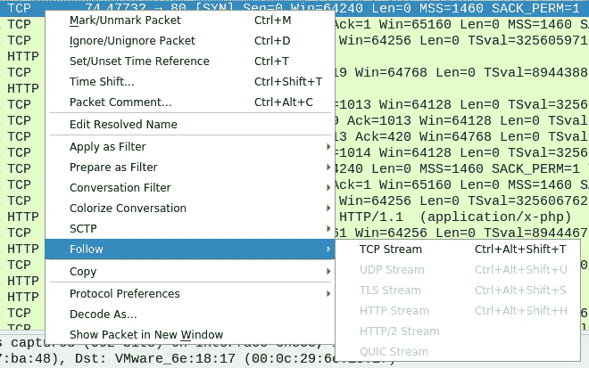

查看流中的第一个 TCP 包，我可以看到攻击者用来上传他们的反向 shell 的页面的 URL。

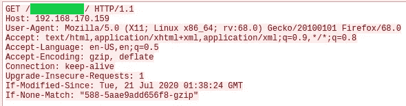

> **2。攻击者使用什么有效载荷来获得访问权限？**

查看数据流中的下一个 TCP 数据包，我可以看到攻击者使用**upload.php**页面上传了一个名为**payload.php**的文件，其中包含他们的反向外壳。

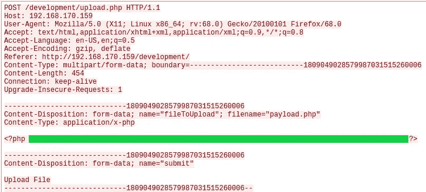

> **3。攻击者使用了什么密码来访问 privesc？**

我在数据流中发现了另一个 TCP 数据包，它显示了攻击者在目标机器上获得反向外壳后所做的事情。攻击者首先使用 **id** 命令检查他们是什么用户，显示他们是用户 **www-data** 。接下来，他们使用 python 导入 **pty 模块**，并生成一个新的、更稳定的 shell。然后他们列出上传目录的内容，并查看一个名为**的隐藏文件的内容。天桥**。然后，攻击者使用 **su** 命令切换到用户 **james** 并输入密码，提升他们在目标机器上的权限。

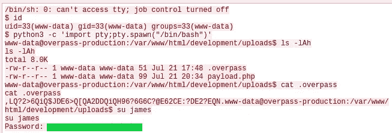

> **4。攻击者是如何建立持久性的？**

一旦攻击者提升了他们的权限，他们就转到 jame 的主目录，并使用 **sudo** **-l** 查看他们可以使用 root 权限运行哪些命令。我可以看到，基于数据包捕获中的输出，用户 **james** 被允许以 root 用户身份使用 sudo 运行所有命令。然后，攻击者开始查看存储在 **/etc/shadow** 文件中的散列。

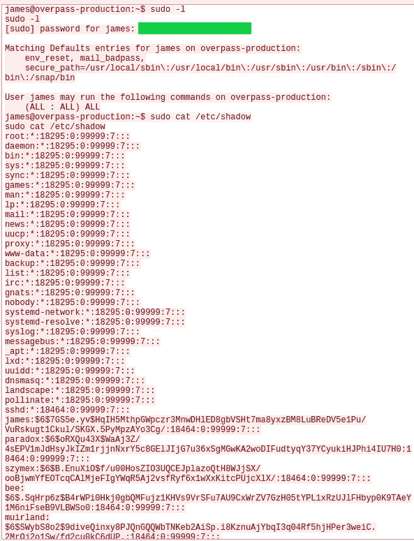

攻击者继续将 Github 存储库克隆到目标机器上，这使他们能够创建 SSH 后门。

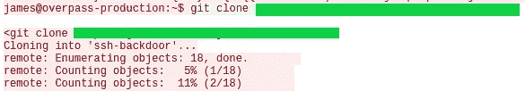

> **5。使用快速跟踪单词表，有多少系统密码可以破解？**

如上面的影子文件所示，在目标机器上创建了 5 个用户。使用密码破解工具，如**开膛手约翰**和指定的单词表**快速跟踪**，我可以确定有多少密码可以破解。我首先将网络捕获中影子文件的最后五行复制到一个名为 passwords 的新文件中。接下来，我运行**开膛手约翰**工具来破解散列。

```
sudo john --wordlist=/usr/share/wordlists/fasttrack.txt passwords
```

从输出中可以看到 **4 个哈希**被破解。

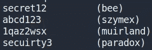

# 研究—分析代码

这个房间的下一个阶段包括分析后门使用的代码。在对 PCAP 文件进行法律分析时，我可以通过使用之前找到的 Github 链接来检索代码。

> **1。后门的默认哈希是什么？**

翻看从 Github 下载的资源库内容，可以看到一个名为 **main.go** 的文件。我决定使用 **Sublime** 来检查这个文件，在查看前几行代码时，我可以看到后门的默认散列字符串。

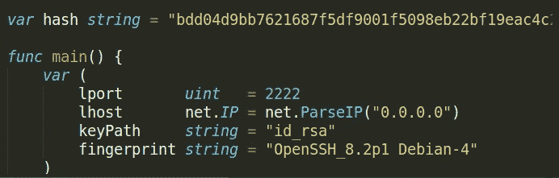

> **2。借壳的硬编码盐是什么？**

向下移动 **main.go** 文件中的代码，我找到了一个名为 **verifypass** 的函数，它有三个参数，其中一个名为 **salt** 。

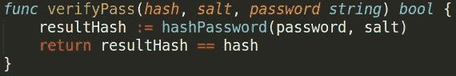

再往下，我发现了一个名为 **passwordHandler** 的函数，它为 salt 参数使用了硬编码的字符串值。

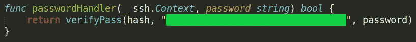

> **3。攻击者使用的哈希是什么？—为此回到 PCAP！**

回到前面分析的 PCAP 文件，可以看到，在攻击者克隆了 Github 库并生成了 RSA 密钥对之后，攻击者接着使**后门**文件可执行，并使用使用 **-a** 参数指定的散列来执行二进制文件。

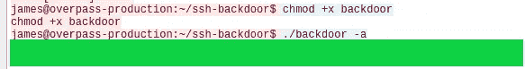

> **4。使用 rockyou 和您选择的破解工具来破解哈希。密码是什么？**

在恢复散列之后，我可以使用工具 **hashcat** 和 **wordlist rockyou** 来破解上面恢复的散列。使用工具**哈希标识符**，我可以确认恢复的哈希使用了 SHA-512 算法。通过前面对后门代码的分析，我知道 SHA-512 散列是使用密码，然后是 salt 按照这个顺序创建的(即**密码:salt** )。

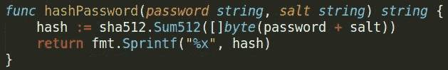

我可以访问 hashcat wiki ( **参见参考文献**)并寻找一种与散列创建方式相匹配的散列模式。我看哈希模式 **1710** 比较合适。

```
1710 | sha512($pass.$salt)        | Raw Hash, Salted and/or Iterated
```

为了破解 hash，我需要提供在攻击者使用的数据包捕获中找到的 **SHA-512** hash 和在 **main.go** 文件中找到的**硬编码 salt** (即 **hash:salt** )。我将 **hash:salt** 添加到一个文件中，然后使用下面的 hashcat 命令来破解这个散列。

```
hashcat -m 1710 -a 0 -o cracked.txt hash.txt rockyou.txt
```

这是成功的，我能够恢复密码。

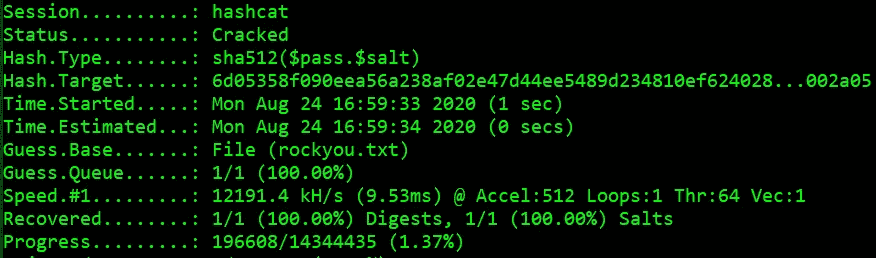

# 进攻——退回去！

这个房间的最后阶段是再次控制跨平台生产服务器，并检索**用户**和**根标志**。我开始用 NMAP 扫描目标机器。

```
nmap -sV -sC -Pn -v -oN nmap_report 10.10.219.135
```

该扫描显示目标机器上有三个打开的端口。

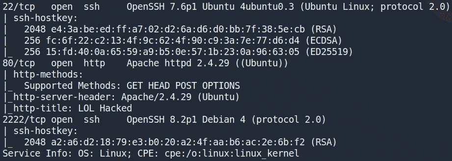

> **1。攻击者破坏了网站。他们留下了什么信息作为标题？**

在我的浏览器中输入 IP 地址会显示一个网页，看起来像是仙人掌在吃饼干(我猜😅).

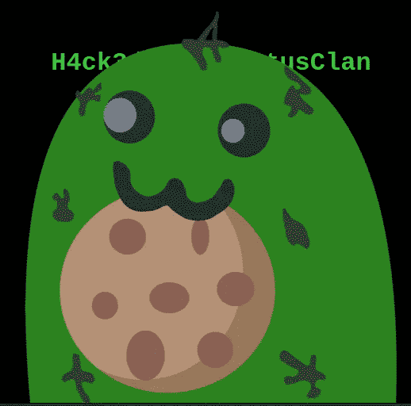

通过查看页面源代码，我得到了攻击者作为标题留下的完整信息。

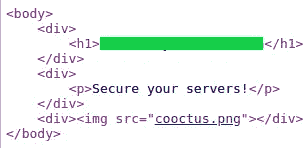

## 用户标志

从上面的 NMAP 扫描结果中，我可以看到端口 **22** 和 **2222** 都运行着 SSH 服务。根据我目前收集的信息，我试着以用户**詹姆斯**的身份登录，使用的是检查 PCAP 文件时看到的原始密码。这对于端口 22 和 2222 都失败。然后，我尝试使用 hashcat 破解 **SHA-512 哈希**得到的**密码**。这对端口 22 无效，但对端口 2222 有效。

```
ssh -p 2222 james@10.10.219.135
```

登录后，我可以导航到 James 的主目录并检索用户标志。

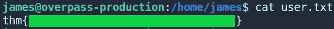

## 根标志

起初，我相信用户 **james** 能够根据之前在 PCAP 文件中找到的信息使用 sudo 以 root 权限运行任何命令。然而，我发现这不是真的，我不能使用 sudo 作为 root 运行任何命令。我决定回到詹姆斯的主目录，看看是否有什么有趣的文件。我立刻注意到在名为**的目录中有一个 root 拥有的隐藏的**二进制文件**。suid_bash** 。


我可以执行这个二进制文件，它将为我创建一个具有 root 权限的新 shell。

```
./.suid_bash -p
```

然后，我可以将目录更改为根目录，并检索根标志。

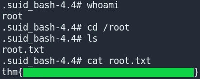

# 结束语

我真的很喜欢这个自由空间，以及它如何在攻击目标机器之前整合多个阶段。这种风格的房间类似于我不久前完成的**恢复 CTF** 房间，其中包括对事件进行分类并修复所造成的损害，但没有那么非传统。

我真的很喜欢这样的房间，在这里您需要调查事件并了解发生了什么，然后才能修复造成的损害或使用收集的证据来攻击机器并获取标记。我希望在不久的将来能在 TryHackMe 平台上看到更多这样的房间。感谢阅读到最后，继续黑客😄！

# 参考

*   [https://tryhackme.com/](https://tryhackme.com/)
*   [https://hashcat.net/wiki/doku.php?id=hashcat](https://hashcat.net/wiki/doku.php?id=hashcat)