# TryHackMe: OWASP 十大(第 1 天)初学者友好演练

> 原文：<https://infosecwriteups.com/tryhackme-owasp-top-10-day-1-7fcbe671c4f?source=collection_archive---------2----------------------->

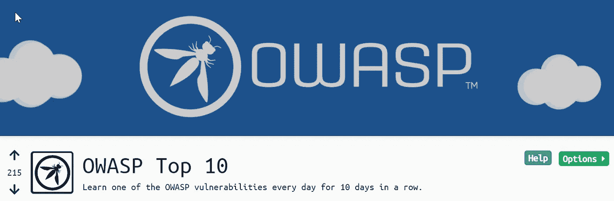

OWASP 前 10 名房间

## 演练[第 1 天]注射试验

**房间链接:**[**【https://tryhackme.com/room/owasptop10】**](https://tryhackme.com/room/owasptop10)

最近，TryHackMe 发布了为期十天的 OWASP 十大挑战，初学者将实际学习 OWASP 十大挑战。

使用以下链接通过 OpenVPN 连接到 tryhackme 网络

 [## 黑客培训

### TryHackMe 是一个学习和教授网络安全的在线平台，全部通过您的浏览器完成。

tryhackme.com。](https://tryhackme.com/connect?o=vpn) 

> 现在使用下面的链接进入 owasp 前 10 名房间:
> [https://tryhackme.com/room/owasptop10](https://tryhackme.com/room/owasptop10)

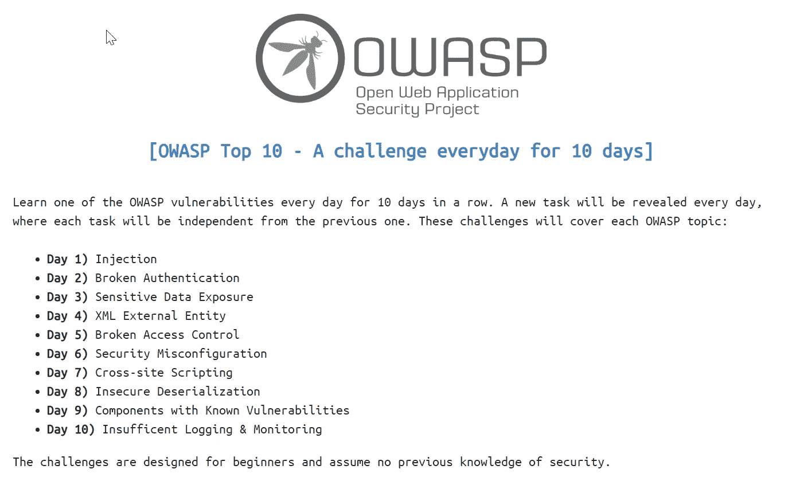

OWASP 前 10 名房间

**【第 1 天】注射**

下面我提供了一些资源来涵盖注入攻击的理论部分

[https://OWASP . org/www-project-Top-Ten/OWASP _ Top _ Ten _ 2017/Top _ 10-2017 _ A1-Injection](https://owasp.org/www-project-top-ten/OWASP_Top_Ten_2017/Top_10-2017_A1-Injection)

 [## OWASP 前 10 名:注入—深源

### IT 中的安全性就像锁上你的房子或汽车，它不能阻止坏人，但如果足够好，他们可能会移动…

deepsource.io](https://deepsource.io/blog/owasp-top-ten-injection/) 

[第 1 天]操作系统命令注入:

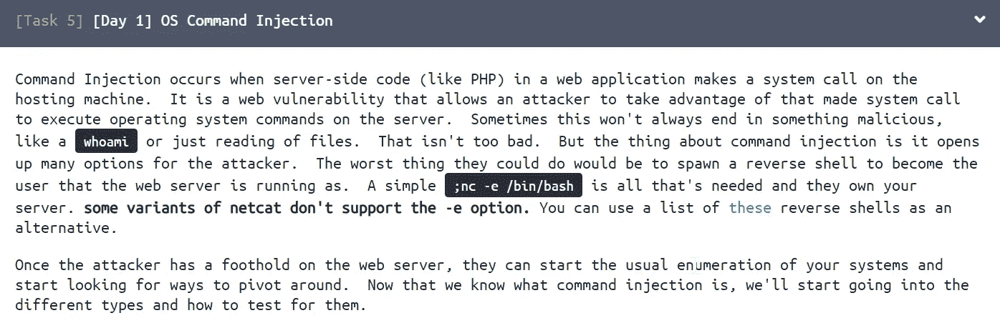

操作系统命令注入

请参考下面的操作系统命令注入链接

> [https://ports wigger . net/we b-security/OS-command-injection #:~:text = OS % 20 command % 20 injection % 20(也称%20known、application % 20 和%20all%20its%20data。](https://portswigger.net/web-security/os-command-injection#:~:text=OS%20command%20injection%20(also%20known,application%20and%20all%20its%20data.)

现在我们已经给出了实用的。

转到任务 6 并单击部署按钮。确保您已经使用 OpenVPN 连接到 tryhackme 网络。

之后，他们分配该机器的 IP 地址。等待 1 到 5 分钟，因为 tryhackme 服务器需要一些时间来部署机器。

之后，你会得到一个这样的网页。

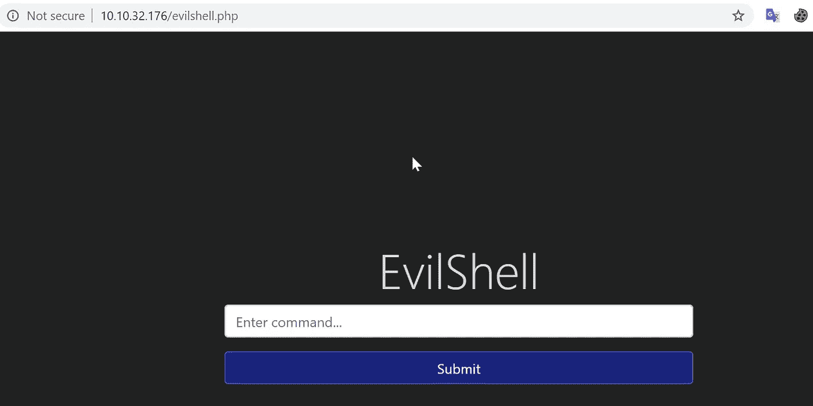

请参考以下链接，了解在进行 pentesting 时有用的操作系统命令

> [**https://security online . info/some-useful-Linux-command-for-your-penetration-testing Linux-command/**](https://securityonline.info/some-useful-linux-command-for-your-penetration-testinglinux-command/)
> 
> [http://www.networkpentest.net/p/windows-command-list.html](http://www.networkpentest.net/p/windows-command-list.html)

## #1 网站根目录里有什么奇怪的文本文件？

*   **通过输入 pwd** 命令，我得到了目录，即 **/var/www/html。由此我可以知道我在根目录中。**
*   现在我使用 **ls** 命令来列出目录中的文件。

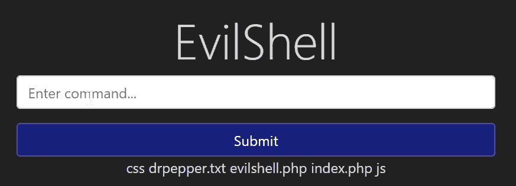

ls 命令

从上面的截图，我知道了 **drpepper.txt** 是一个奇怪的文件。

Ans: **drpepper.txt**

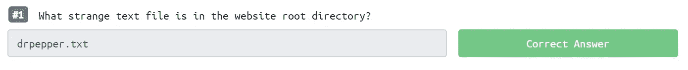

问题 1

## #2 有多少非 root/非服务/非守护进程用户？

**Ans** :因为我已经知道这是一台 Linux 机器。anAndinux 存储位于 **/etc/passwd** 目录中的 **passwd** 文件中的所有用户名。

所以我快速地输入了 **cat /etc/passwd** 命令来显示 passwd 文件中的内容

密码文件

从这个输出中，我观察到不存在**非根/非服务/非守护进程**用户。

所以我们的答案是 **0**

问题 2

## #3 此应用程序以什么用户身份运行？

**回答:**这个问题是 vestraightforwardweWean 我们使用 **whoami** 命令来检查哪个用户正在运行这个应用程序。

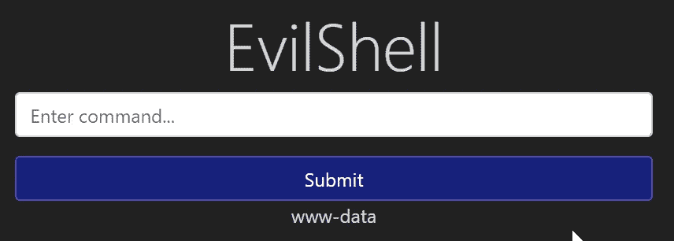

用户

从上面的输出中，我们可以看到 **www-data** 用户正在运行这个应用程序。

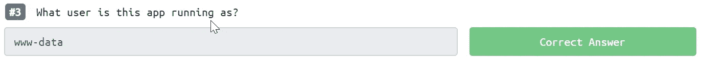

问题 3

## #4 用户的 shell 设置为什么？

答:因为我们检索了包含所有用户信息的 **passwd** 文件。由此，我们可以检索允许该用户使用的权限。

在下面的输出中，我突出显示了用户部分&我们可以看到用户的 shell 信息。

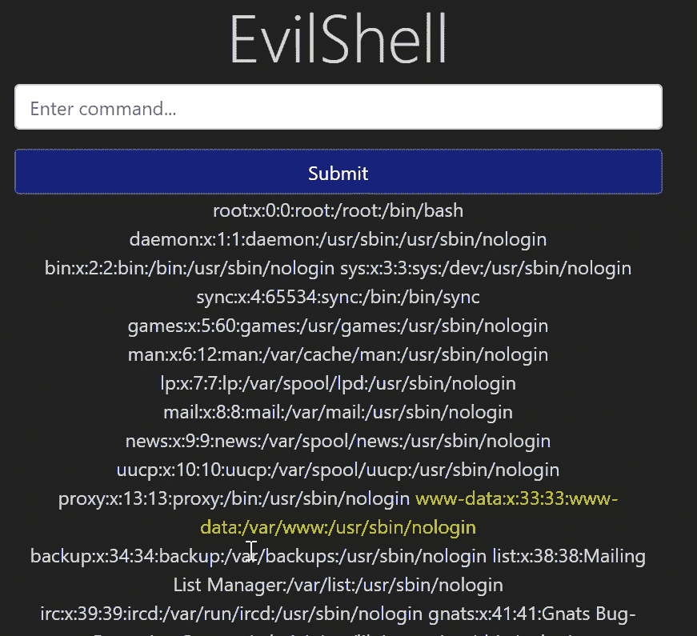

答案: **/usr/sbin/nologin**

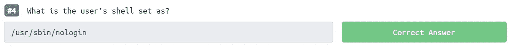

问题 4

## # 5 Ubuntu 运行的是什么版本？

**答:**对于这个问题，我们可以使用 Linux 的内置命令来了解 os 的版本。

**命令:lsb_release -a**

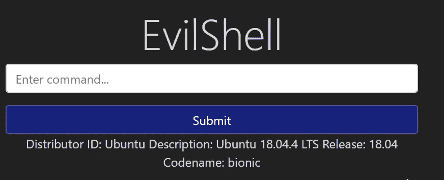

操作系统版本。

参考:

> [https://www . cyber Citi . biz/FAQ/how-to-check-OS-version-in-Linux-command-line/](https://www.cyberciti.biz/faq/how-to-check-os-version-in-linux-command-line/)

答案:18.04.4

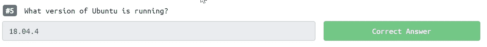

问题 5

## #6 打印出 MOTD。有什么最受欢迎的饮料？

**答:**对于什么是 MOTD 的理论部分，请点击下面的链接。

> [https://en . Wikipedia . org/wiki/Motd _(Unix)#:~:text = The % 20% 2 fetc % 2f Motd % 20 is % 20a，all%20an%20e%2Dmail%20message。](https://en.wikipedia.org/wiki/Motd_(Unix)#:~:text=The%20%2Fetc%2Fmotd%20is%20a,all%20an%20e%2Dmail%20message.)

目前我还不知道这个 MOTD 的文件。所以我很快谷歌了一下这个文件，并了解到这个文件是用来给所有用户发送一条普通消息的，这比给所有用户发送一条电子邮件更有效。

&该文件驻留在 **/etc/** 目录中。这么快就用定位命令找到了所有有 **motd** 名字的文件。从下面的结果中，我找出了正确的文件。

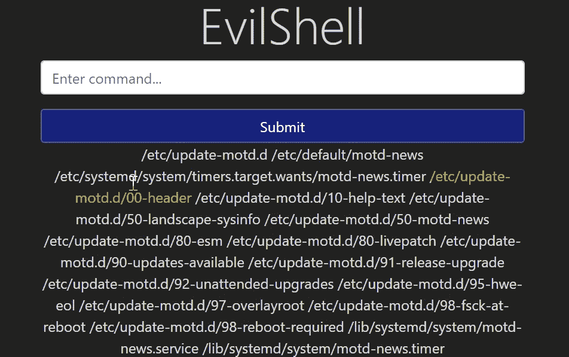

之后，我使用 cat 命令来显示文件中的内容。

**命令:***cat/etc/update-motd . d/00-header*

在他们问饮料的问题中&从最后一行的输出中，我得到了名字是**胡椒博士。**

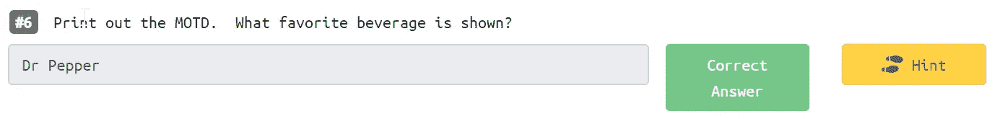

问题 6

## 注意:下一部分将于明天发布。

## 参考资料:

 [## OWASP 十大

### OWASP Top 10 是开发人员和 web 应用程序安全性的标准认知文档。它代表了广泛的…

owasp.org](https://owasp.org/www-project-top-ten/) 

[https://security online . info/some-useful-Linux-command-for-your-penetration-testing Linux-command/](https://securityonline.info/some-useful-linux-command-for-your-penetration-testinglinux-command/)

 [## /etc/passwd 文件，由 Linux 信息项目(LINFO)提供

### etc/passwd 是一个文本文件，包含上每个用户或帐户的属性(即基本信息)

www.linfo.org](http://www.linfo.org/etc_passwd.html#:~:text=%2Fetc%2Fpasswd%20is%20a%20text,user%20on%20the%20system1.)  [## motd (Unix)

### etc/motd 是类 Unix 系统上的一个文件，包含“每日消息”，用于向所有…

en.wikipedia.org](https://en.wikipedia.org/wiki/Motd_%28Unix%29#:~:text=The%20%2Fetc%2Fmotd%20is%20a,all%20an%20e%2Dmail%20message.) 

**作者:Mayur Parmar(th3cyb3rc0p)**

[https://twitter.com/th3cyb3rc0p?lang=en](https://twitter.com/th3cyb3rc0p?lang=en)

[https://in.linkedin.com/in/th3cyb3rc0p](https://in.linkedin.com/in/th3cyb3rc0p)

[https://www.instagram.com/th3cyb3rc0p/?hl=en](https://www.instagram.com/th3cyb3rc0p/?hl=en)

[https://twitter.com/cyberdefecers?lang=en](https://twitter.com/cyberdefecers?lang=en)