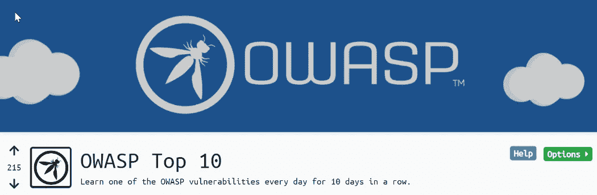
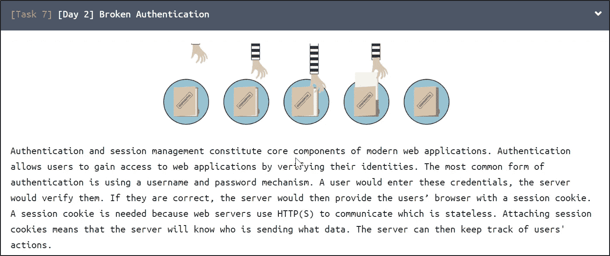
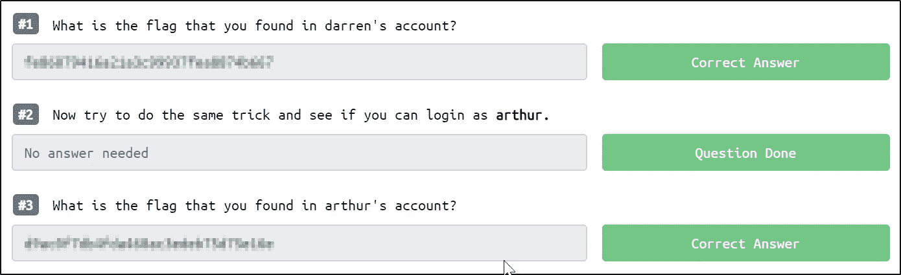
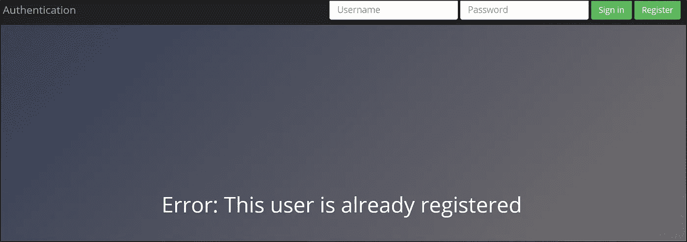
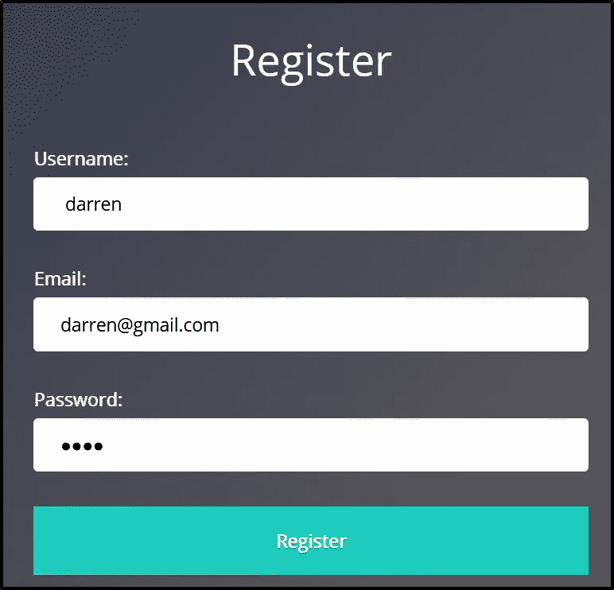
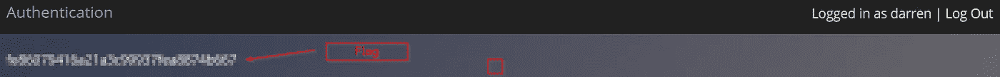
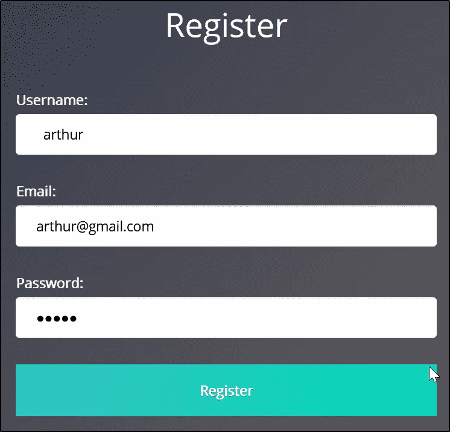
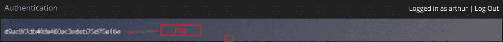

# TryHackMe: OWASP 十大(第 2 天)初学者友好演练

> 原文：<https://infosecwriteups.com/tryhackme-owasp-top-10-day-2-beginner-friendly-walkthrough-2a97f3c0aea8?source=collection_archive---------1----------------------->

OWASP 前 10 名房间

# 演练[第 2 天]身份验证尝试失败

**房间链接:**[**【https://tryhackme.com/room/owasptop10】**](https://tryhackme.com/room/owasptop10)

**【第二天】破解认证:**

身份验证被破坏

参考以下链接获取**破解认证**理论部分:

 [## a2:2017-身份验证失败

### 威胁代理/攻击媒介安全弱点影响应用程序。特定可开发性:3 普遍性:2 可检测性:2…

owasp.org](https://owasp.org/www-project-top-ten/OWASP_Top_Ten_2017/Top_10-2017_A2-Broken_Authentication) 

**实用:**

**问题:**

**问题 1:您在 Darren 的帐户中找到的旗帜是什么？**

*   按照说明，我们有**达伦**用户名。所以我试着用同样的用户名创建另一个帐户，但是它告诉我一个错误，说这个帐户已经存在。

所以我想起了挑战的理论部分，他们提到如果我们可以在用户名中添加{space}。例如{ Mayur}&创建一个帐户，然后它会给我们现有用户的帐户。所以我遵循同样的方法&用 **darren** username 创建一个帐户。

注册成功后。我登录了账户&在那里我得到了我的第一面旗帜。

标志 1:

标志 1

**问题 3 .你在亚瑟的叙述中发现的旗帜是什么？**

标志 2:

对于标志 2，我们可以应用相同的方法。用亚瑟用户名注册一个新账户。

登录后，它会给我 flag2。

标志 2

> 我把旗子弄模糊了。遵循我的方法&你会得到两面旗帜。

结论:

在这篇博客的最后，我想告诉你为什么会出现这个漏洞。

在此挑战中，它仅验证**用户名，** &这些字段也未被正确清理。因为没有人会在用户名中使用空格。

参考:

 [## a2:2017-身份验证失败

### 威胁代理/攻击媒介安全弱点影响应用程序。特定可开发性:3 普遍性:2 可检测性:2…

owasp.org](https://owasp.org/www-project-top-ten/OWASP_Top_Ten_2017/Top_10-2017_A2-Broken_Authentication)  [## 身份验证被破坏

### 当攻击者登录到您的 web 应用程序时

medium.com](https://medium.com/tradecraft/broken-authentication-7d2b7e93e281)  [## HackerOne 上披露的 Phabricator:身份验证和...

### 嗨，希望你很好！重现步骤:1)创建一个 Phabricator 帐户，电子邮件地址为“a@x.com”。2)现在注销…

hackerone.com](https://hackerone.com/reports/17474) 

**作者:**[**Mayur Parmar**](https://medium.com/u/4dbaf35dbafc?source=post_page-----2a97f3c0aea8--------------------------------)**(th 3c Yb 3 RC 0 p)**

在 Twitter 和 LinkedIn 上关注我(通常我会在这些社交媒体平台上分享技巧)

[https://twitter.com/th3cyb3rc0p?lang=en](https://twitter.com/th3cyb3rc0p?lang=en)

https://in.linkedin.com/in/th3cyb3rc0p

【https://www.instagram.com/th3cyb3rc0p/?hl=en 

[https://twitter.com/cyberdefecers?lang=en](https://twitter.com/cyberdefecers?lang=en)