# Tryhackme Pcap 分析室官方报道

> 原文：<https://infosecwriteups.com/tryhackme-pcap-analysis-room-official-writeup-5788e5853acf?source=collection_archive---------2----------------------->

PCA 分析室:[https://tryhackme.com/jr/pcapanalysis](https://tryhackme.com/jr/pcapanalysis)

**任务一**

问:21 号港口的旗帜是什么？

答案:vsFTPd 2.3.4

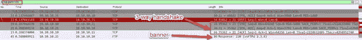

在三次握手之后，服务返回横幅信息。

问:来自用户 X:)作为 NMAP FTP 服务用户名的 NSE 脚本的名称是什么？

答案:ftp-vsftpd-backdoor.nse

我们将使用以下命令:

find / -iname "*。nse" 2>&1|xargs grep "用户 X "

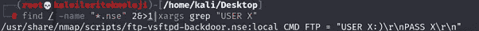

问:在使用 VSFTPD 后门脚本扫描 NMAP 时运行什么命令？

答案:id

当 vsftpd 后门漏洞被利用时，会在端口 6200 上打开后门。

对于这个问题，我们可以使用以下 wireshark 显示过滤器:

tcp.flags.push==1，tcp.flags.ack==1，tcp.port==6200

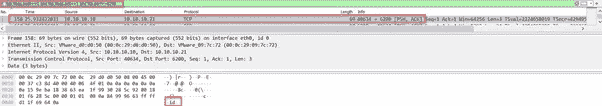

问题:Metasploit 框架中包含相关 vsFTPd2.3.4 横幅信息的 FTP 服务的弱点是如何利用的？

答案:exploit/UNIX/FTP/vsftpd _ 234 _ back door

我们将使用以下命令:

find / -iname "*。rb" 2>&1|xargs grep "VSFTPD "

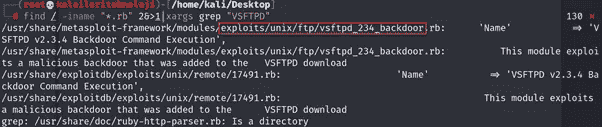

问题:

在 Metasploit 框架中通过 ftp 服务登录到系统后运行的第一个命令是什么？

答案:whoami

当 shell 打开时，id 命令指定 uid=0(root) gid=0(root)。使用 nohup，该进程继续在后台运行。用 echo 指定的表达式用来检查外壳是否打开。

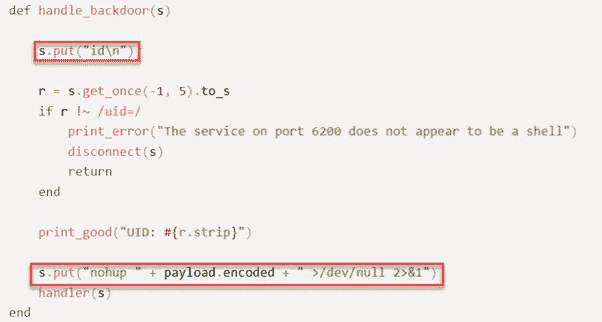

代号:【https://www.exploit-db.com/exploits/17491 

攻击者发出命令后，echo 命令会自动运行。

对于这个问题，我们可以使用以下 wireshark 显示过滤器:

tcp.flags.push==1，tcp.flags.ack==1，tcp.port==6200

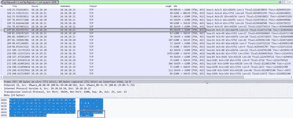

第一个命令:whoami

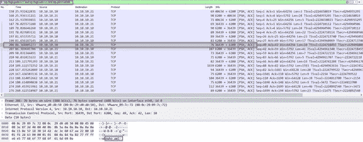

问题:kaleileriteknoloji 用户的用户 ID 是什么？

答案:1003

应该检查 213 数据包的 TCP 流。

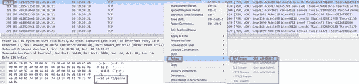

kaleileriteknoloji 用户 id 设置为 1003。

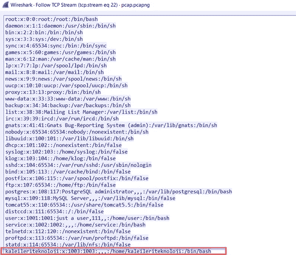

问题:什么是 user.txt 内容？

答案:10031003

这个问题的答案也显示在与上一个问题相同的 TCP 流中。

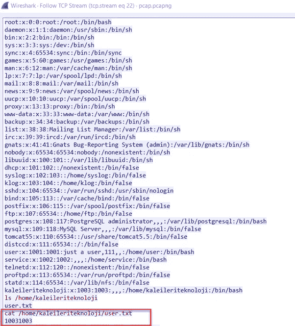

任务二

问题:用 Ngrok 接收反向 shell 时使用了哪个端口？

Asnwer:4444

我们可以应用以下过滤器:

tcp.flags.ack==1，tcp.flags.push==1，ip.src==127.0.0.1

问题:在收到带有 Ngrok 的反向 shell 后，首先运行的是哪个命令？

答案:ip a

应用下面的过滤器后，我们可以控制 TCP 流。

tcp.flags.ack==1，tcp.flags.push==1，ip.src==127.0.0.1

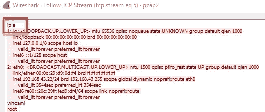

问题:在收到带有 Ngrok 的反向 shell 后，第二个运行的是哪个命令？

答案:whoami

应用下面的过滤器后，我们可以控制 TCP 流。

tcp.flags.ack==1，tcp.flags.push==1，ip.src==127.0.0.1

**任务 3**

问题:哪个 web 漏洞被利用了？

答案:命令注入

应用下面的过滤器后，我们可以控制请求和响应。

http 和 http.request.method==POST

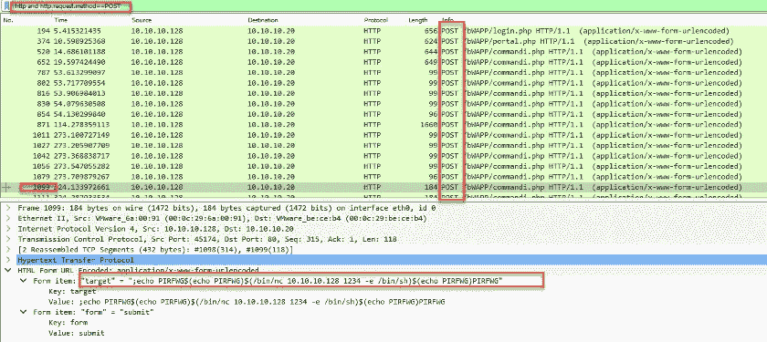

问题:在接收带有 bash 命令的反向 shell 时，哪个端口在监听？

答案:1234

应用下面的过滤器后，我们可以控制端口。

tcp.flags.ack==1，tcp.flags.push==1

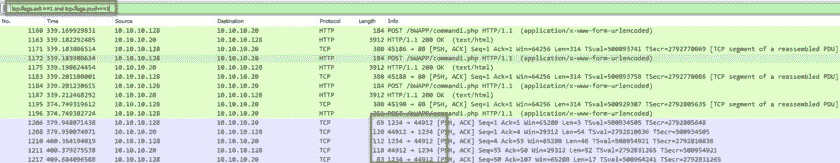

问题:web 漏洞被利用的工具是什么？

答案:commix

应用下面的过滤器后，我们可以控制用户代理。

http.user_agent 包含 commix

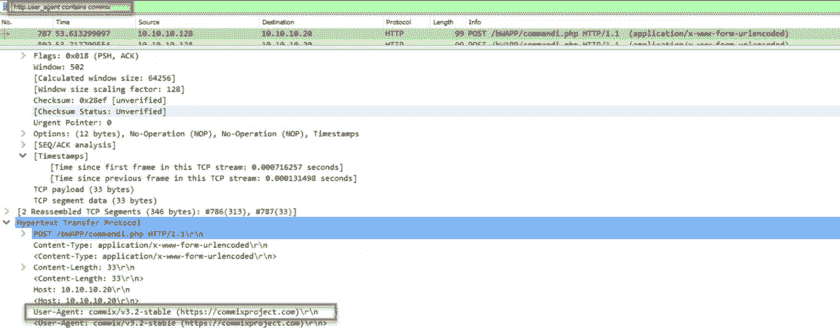

问:哪个命令用于运行 web 请求中的 base64 编码数据？

答案:eval

应用下面的过滤器后，我们可以控制数据。

框架包含“base64”

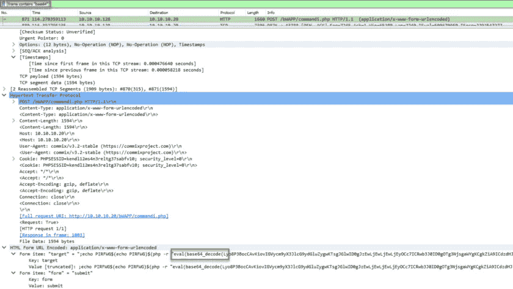

问:除了 bash 命令使用的反向 shell 之外，还使用了哪个有效负载？

答案:php/meterpreter/reverse_tcp

应用下面的过滤器后，我们可以控制端口。

tcp.flags.ack==1，tcp.flags.push==1

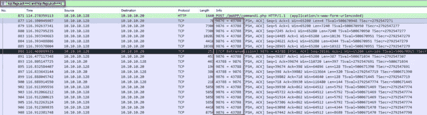

之后我们必须读取有效载荷。

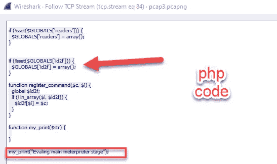

问:在检查有效负载内容时，使用了哪个函数来运行命令？

答案:shell_exec

我们将在 tcp.stream eq 84 中搜索 exec，system，shell_exec 命令。

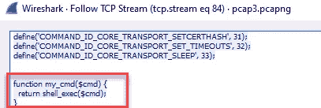

问:在 bash 命令收到反向 shell 后，首先运行哪个命令？

答案:id

应用下面的过滤器后，我们可以控制 TCP 流。

tcp.flags.ack==1，tcp.flags.push==1，tcp.port==1234

tcp.stream eq 100

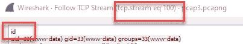

问:在使用 bash 命令获取反向 shell 后，使用哪个命令切换到交互式 shell？

答案:python -c“导入 ptypty.spawn('/bin/bash ')"

应用下面的过滤器后，我们可以控制 TCP 流。

tcp.flags.ack==1，tcp.flags.push==1，tcp.port==1234

tcp.stream eq 100

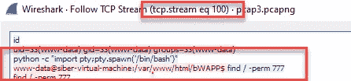

问:凭据所在文件的完整路径是什么？

答案:/home/siber/cred.txt

应用下面的过滤器后，我们可以控制 TCP 流。

tcp.flags.ack==1，tcp.flags.push==1，tcp.port==1234

tcp.stream eq 100

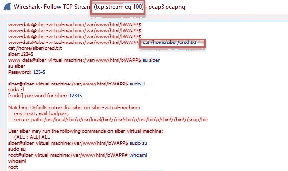

问:凭证所在的文件中提到了哪个用户名？

答案:siber

应用下面的过滤器后，我们可以控制 TCP 流。

tcp.flags.ack==1，tcp.flags.push==1，tcp.port==1234

tcp.stream eq 100

问:凭据所在文件的密码是什么？

答案:12345

应用下面的过滤器后，我们可以控制 TCP 流。

tcp.flags.ack==1，tcp.flags.push==1，tcp.port==1234

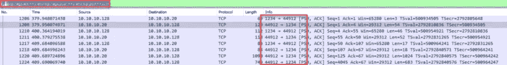

tcp.stream eq 100

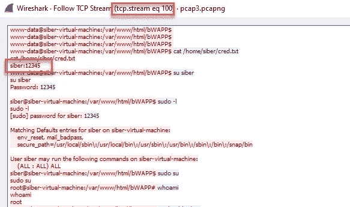

问:siber 用户使用了什么命令来提升权限？

答案:须藤素

应用下面的过滤器后，我们可以控制 TCP 流。

tcp.flags.ack==1，tcp.flags.push==1，tcp.port==1234

tcp.stream eq 100

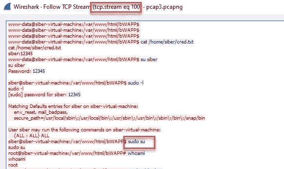

问题:siber 用户密码的哈希是什么？

答案:$ 6 $ EELzOgDE $ yhab 47 TF 5 EC 7 Li/git 2 hmur 6 zrek 3 rat jfz 2 zh 3a 2 qcrhbmpo 4n . 0 buozuzavchyrfvs 2 ygybzoztbet 1 v1 FZ。

应用下面的过滤器后，我们可以控制 TCP 流。

tcp.flags.ack==1，tcp.flags.push==1，tcp.port==1234

tcp.stream eq 100

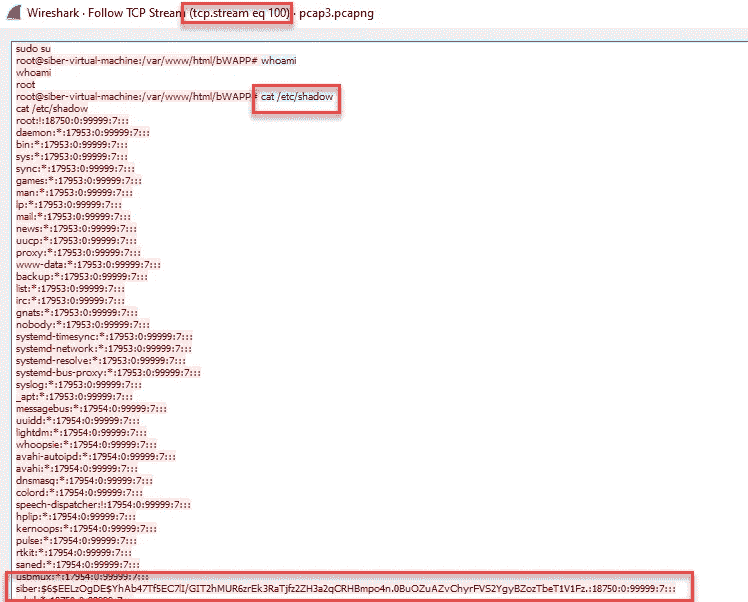