# 特里哈克姆-皮克里克 CTF 写道(详细)

> 原文：<https://infosecwriteups.com/tryhackme-pickle-rick-ctf-writeup-detailed-bd7a3c6893ba?source=collection_archive---------1----------------------->

CTF 报道#8

欢迎各位！！今天我们将在《T2》节目中采访里克·CTF。

 [## 泡菜里克

### TryHackMe 是一个学习和教授网络安全的在线平台，全部通过您的浏览器完成。

tryhackme.com](https://tryhackme.com/room/picklerick) 

在桌面上为您的 CTF 计算机创建一个目录，并在 CTF 目录中为 Nmap 创建一个目录。

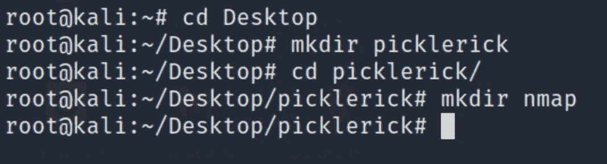

部署机器。让我们开始吧！享受流动吧！

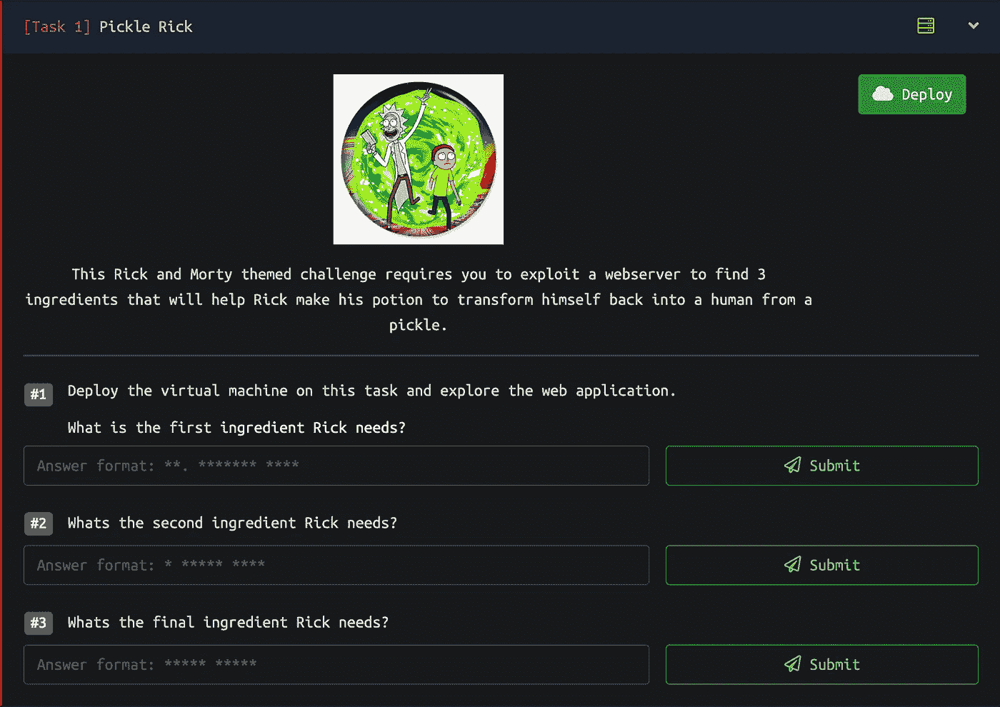

## Nmap 扫描:

> nmap-sC-sV-oN nmap/pickle Rick <machine_ip>-sC:默认脚本
> -sV:版本检测
> -oN:输出将存储在您之前创建的目录‘nmap’中</machine_ip>

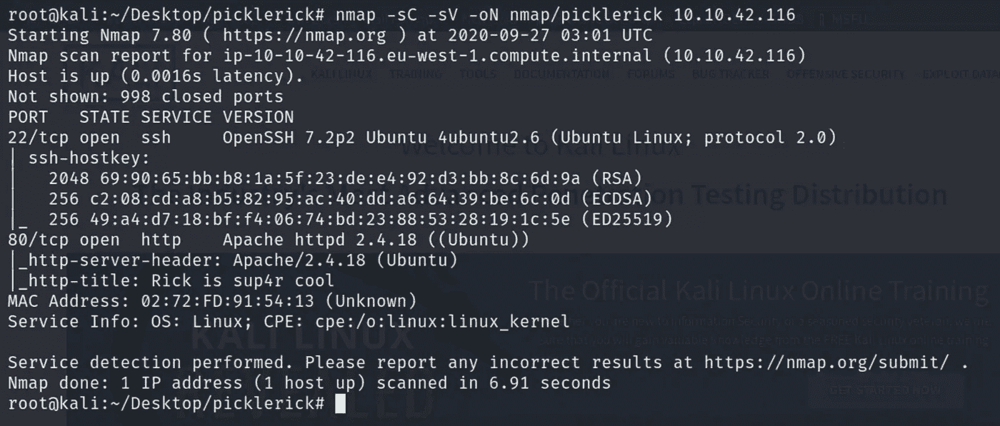

有 2 个端口打开:
22/ssh-OpenSSH 7.2 p2
80/http-Apache httpd 2 . 4 . 18
OS 检测到- Ubuntu Linux

虽然我们知道端口 80 是开放的，但我们可以快速启动 gobuster，继续浏览站点并找到对我们的枚举过程有帮助的有趣信息。

## Gobuster:

> gobuster dir-u http://<machine_ip>-w<path_to_wordlist>-o<output_file_name>-x <extensions>-u:URL
> -w:word list
> -o:要存储在目录中的输出
> -x:搜索扩展名，例如 html、txt、php、phtml 等。</extensions></output_file_name></path_to_wordlist></machine_ip>

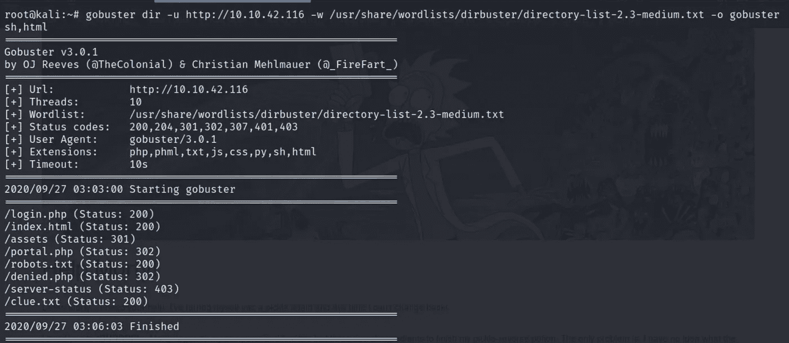

太好了。robots.txt，登录页面，clue.txt，portal.php，资产目录页面。

## Nikto:

同时你也可以快速旋转 nikto。它可能提供信息，也可能不提供，我仍然运行它来查找任何信息。

> nikto -h<target_ip></target_ip>

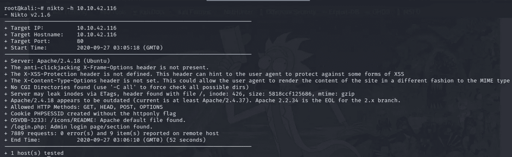

看起来我们已经从 gobuster 扫描中知道了很多。

现在，我们将浏览我们找到的所有内容，深入到盒子的更深处，最终获得外壳和根。

> 导航到 http://<target_ip></target_ip>

检查页面的源代码是否有隐藏的注释总是好的。
查看 URL 页面的来源【Ctrl+U】。

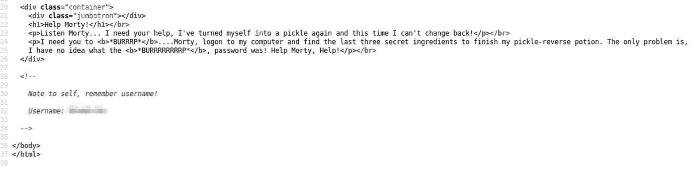

有一个用户名。这肯定不是很难找到。让我们继续检查 login.php 页面。

> 导航到 http:// <target_ip>/login.php</target_ip>

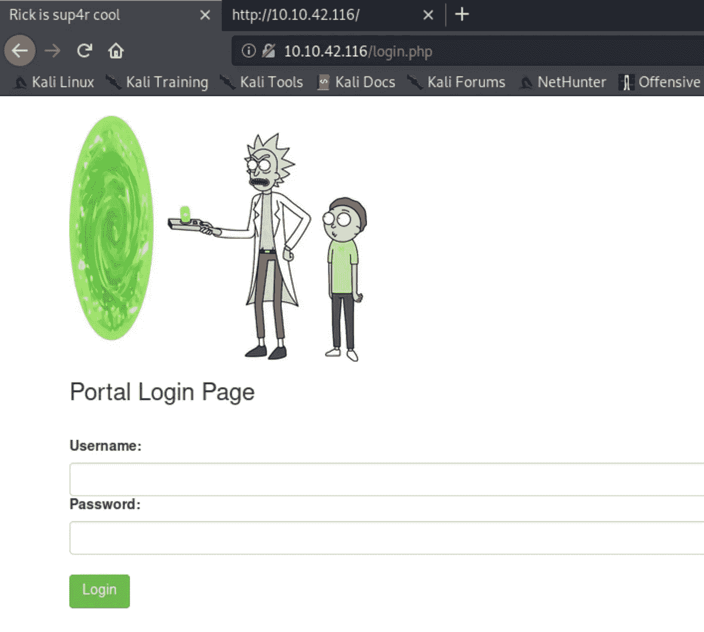

我们已经拿到用户名了。我们需要密码。不管怎样，我们会继续检查其余的。

导航到 http:// <target_ip>/assets</target_ip>

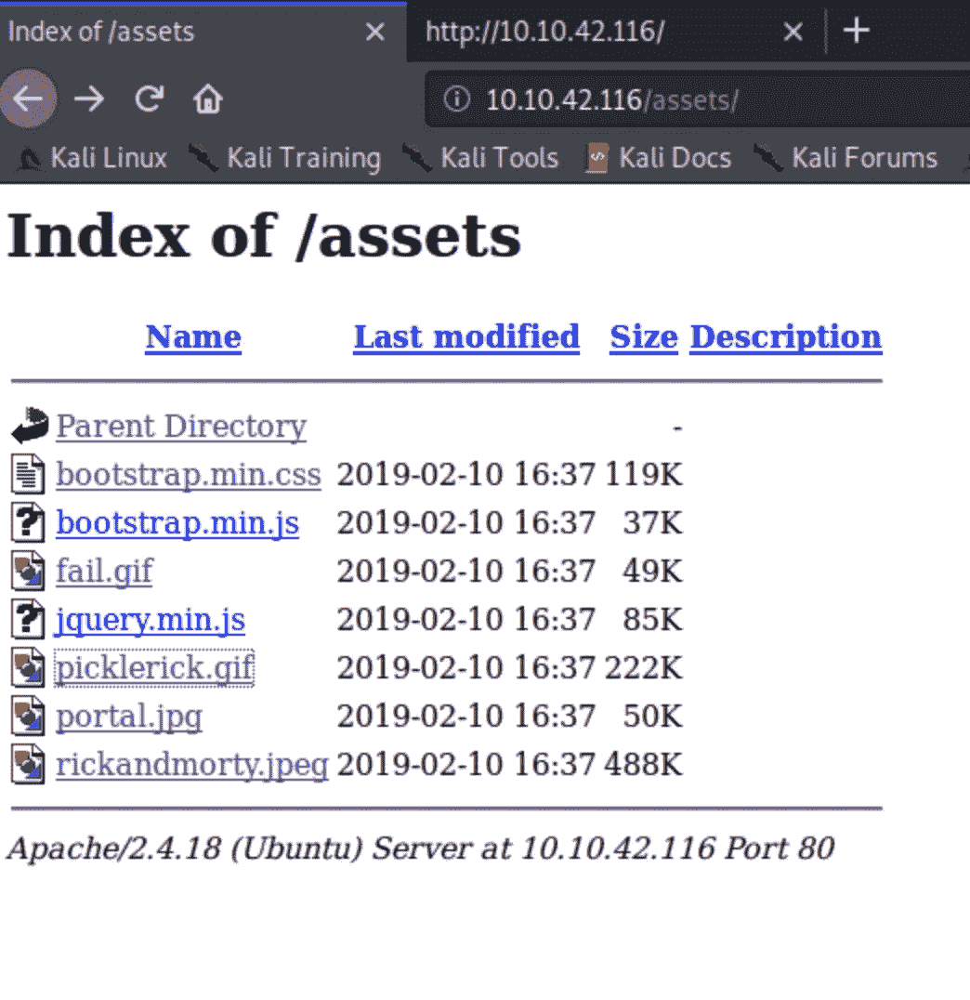

没什么特别的。看起来很正常。

导航到 http:// <target_ip>/robots.txt</target_ip>

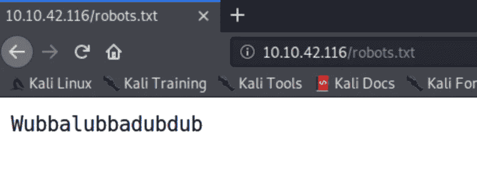

太棒了..这是什么？这看起来当然不是一片混乱。可能是密码。我们稍后参考并检查最后一页。

> 导航至 http:// <target_ip>/clue.txt</target_ip>

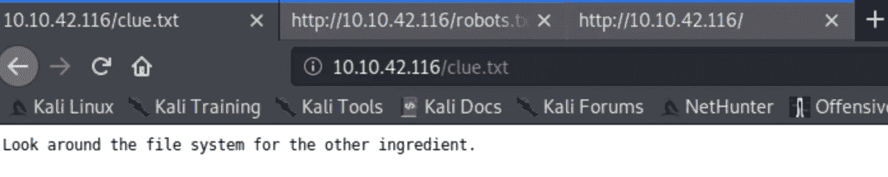

线索很明显，因为我们已经知道了。这是显而易见的，因为当我们获得 shell 时，其他组件肯定会出现在文件系统中，我们必须查看它。

我们有一个用户名和一个潜在的密码，我们可以尝试用我们获得的凭证登录 login.php。

导航到 http:// <target_ip>/login.php</target_ip>

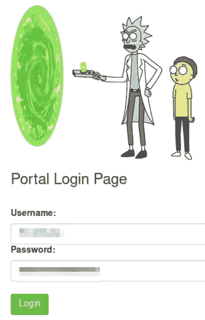

瞧啊。！我们进去了..

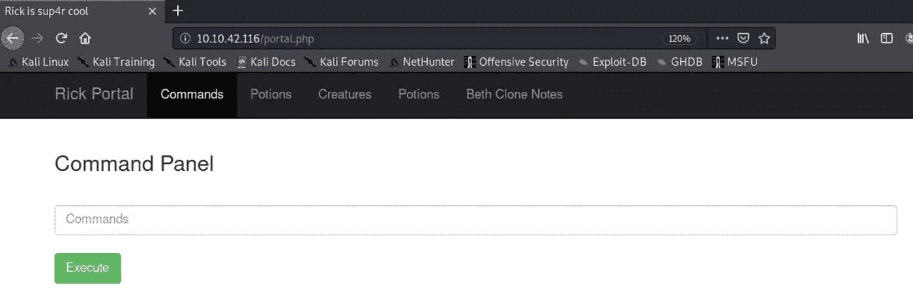

嗯。命令面板和用于输入命令的字段。很好。首先，让我们玩玩它，看看一些基本的命令能不能用，比如 cat，cd，ls。

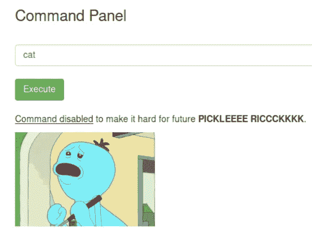

一些常见的命令不允许执行，因此增加了难度。我们会看到的。

在执行 ls 命令时，下面显示的框将输出文件，您将在那里看到您的第一个标志。我们必须想办法看到。txt 与配料。

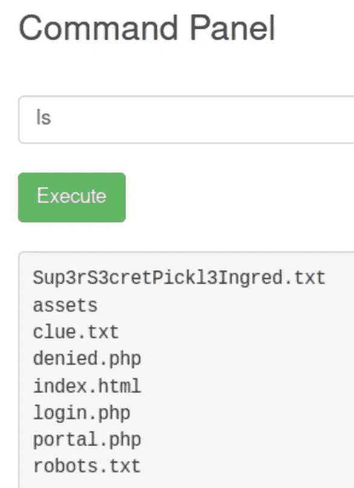

我们将尝试输入命令，例如 cat、less、strings，这些命令基本上可以向我们显示文件内部的内容。

幸运的是，在执行字符串命令时，我们将得到盒子的第一个组成部分。还有两个！

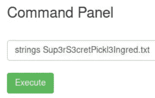

第一种配料

或者，我们可以通过简单地将文件名复制并粘贴到 URL 中来获得标志。当我们在命令面板中输入“ls”时，显示的输出在/var/www/ directory 中。这个文件碰巧在服务器上。文件以这种方式重命名，这样我们的单词表就找不到它了。

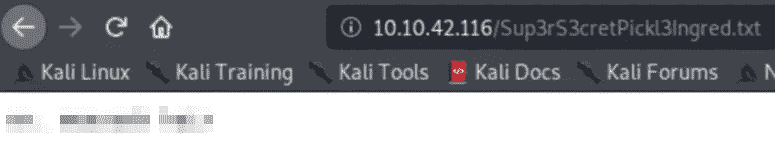

现在我们有了旗子。我们希望通过导航到/home 目录来查看机器上的其他用户。

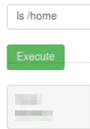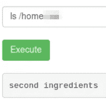

我们得到了第二种成分。我们需要看看它的内部。我们知道之前有一个命令对我们有效。我们将使用字符串。

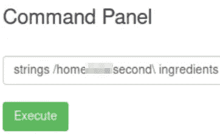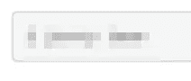

太棒了。！我们得到了第二种成分。我们可以提交那面旗帜。让我们寻找最后的配料。

当我们想要提升权限时，我们使用命令 sudo -l 来查看可以由 root 用户运行的任何命令或二进制文件。执行 sudo -l。

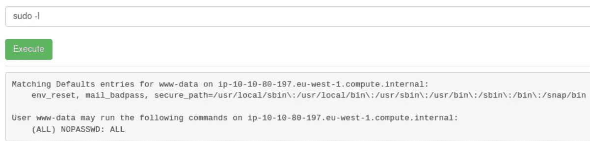

输出显示一切都可以运行，不需要密码。这实际上很棒，因为我们可以使用 sudo 来 ls 到根文件夹。
就这么办吧。

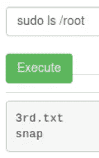

看起来我们知道最终成分的位置了。我们将使用字符串命令来查看文件内部。

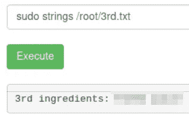

搞定了。搞定了。超棒的盒子。除了我们的扫描，在这个盒子里没有看到太多的终端，但它是一个有趣的盒子。我希望你能喜欢阅读这篇文章。

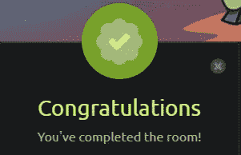

如果你喜欢这个帖子，并且这个帖子在任何可能的方面帮助了你，请在评论中告诉我，或者用掌声分享你的爱。

> 作为 10 月 PentesterLab 赠品的一部分提交

谢谢你抽出时间。

跟着我。

更多的报道正在进行中。

保重，注意安全，继续黑！

**-哈桑·谢赫**