# Tryhackme 泡菜里克演练

> 原文：<https://infosecwriteups.com/tryhackme-pickle-rick-walkthrough-2b5e844a96f3?source=collection_archive---------0----------------------->

**穆基兰 B 写的**

本演练是关于 CTF 挑战，我们必须通过利用目标找到旗帜。因此，让我们投入到 Tryhackme 挑战中。启动机器后，我看到了一个网页

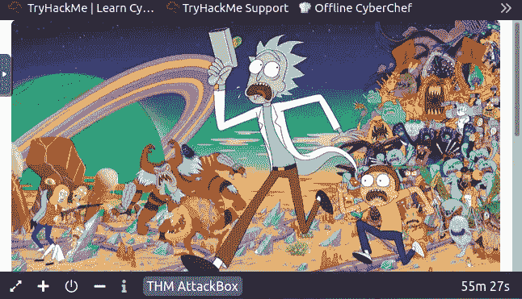

然后，我进一步深入到一个网站，我得到了一个用户名，通过源页面

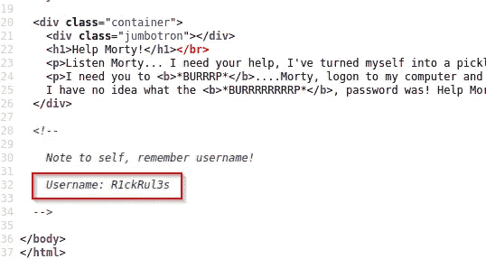

然后搜索密码和登录页面，我使用 dirsearch 命令强行打开目录

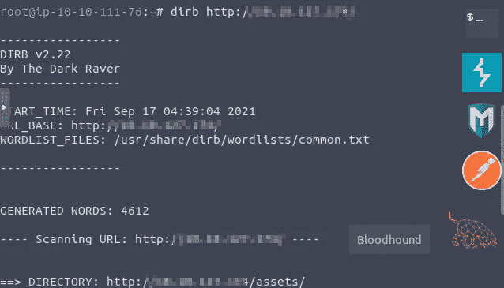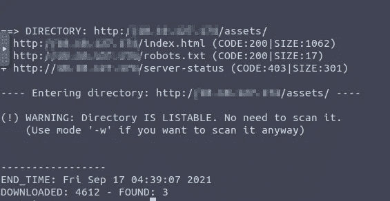

经过蛮力我找出了 robots.txt 和 login.php 等有用的信息。

我深入研究了 robots.txt，得到了密码 Wubbalubbadubdub

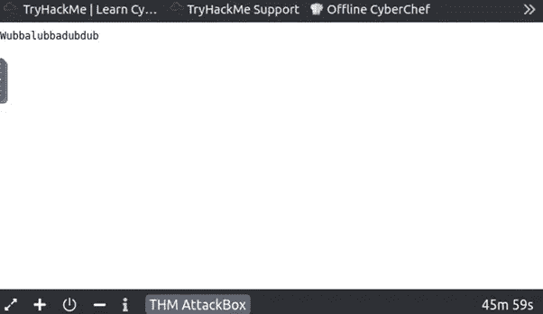

我使用这些凭证登录到 login

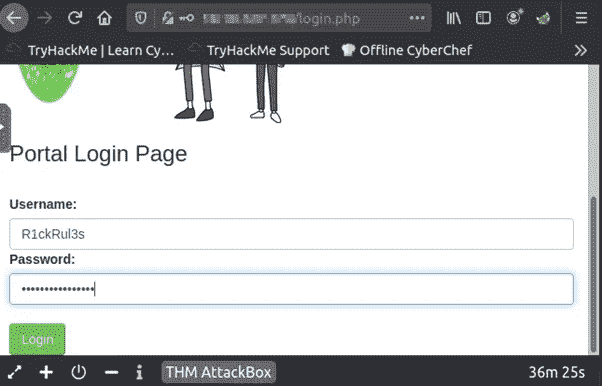

登录后，我成功地找到了外壳，我给了一些命令，是否有任何有用的信息被隐藏。

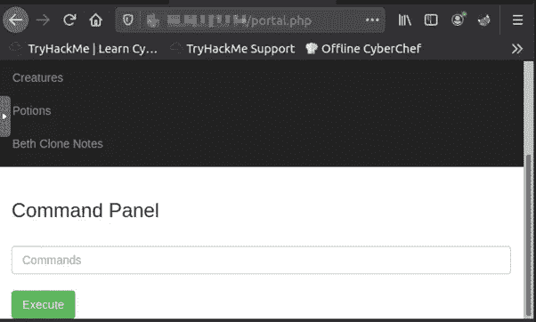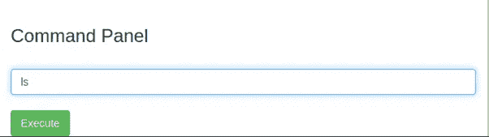

在我输入 ls 命令后，它显示了一些有用的信息

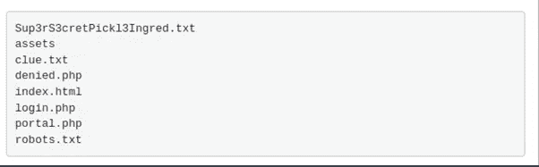

我在 shell 中使用 cat Sup3rS3cretPick13Ingred.txt，但它被列入了白名单

因此，我从系统中反向连接，无论它是否会连接，为此我使用 pentest monkey 网站上的命令列表。首先，我使用 Perl 命令不起作用，然后我继续使用 python 命令，它起作用了！！！对我来说不错

我把 python 换成 python3 才管用！！！

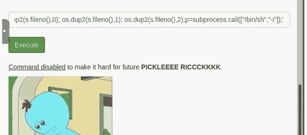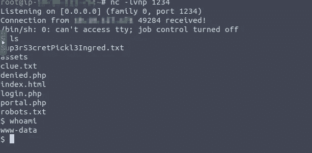

获得之后，shell 使用“cat Sup3rS3cretPick13Ingred.txt”获得了第一个标志

那是米索克先生的头发

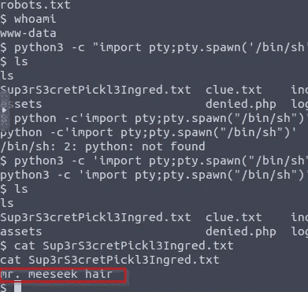

然后进一步挖掘，我得到了特权升级的第二个标志

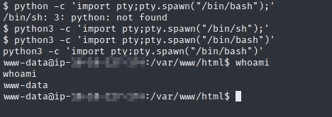

使用命令 python 3–c ' import pty；pty.spawn("/bin/bash ")'

通过简单的技巧，我使用“sudo bash”作为根用户登录

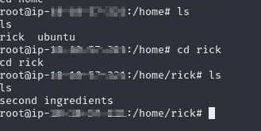

然后我拿到了第二面旗子

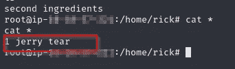

最后，我得到了第三面旗帜

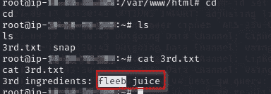

下次我会想出一个新的故事。

感谢神奇的黑客们！！！