# TryHackMe-心理突破 CTF 写(超详细)

> 原文：<https://infosecwriteups.com/tryhackme-psycho-break-ctf-writeup-super-detailed-64db523169c0?source=collection_archive---------0----------------------->

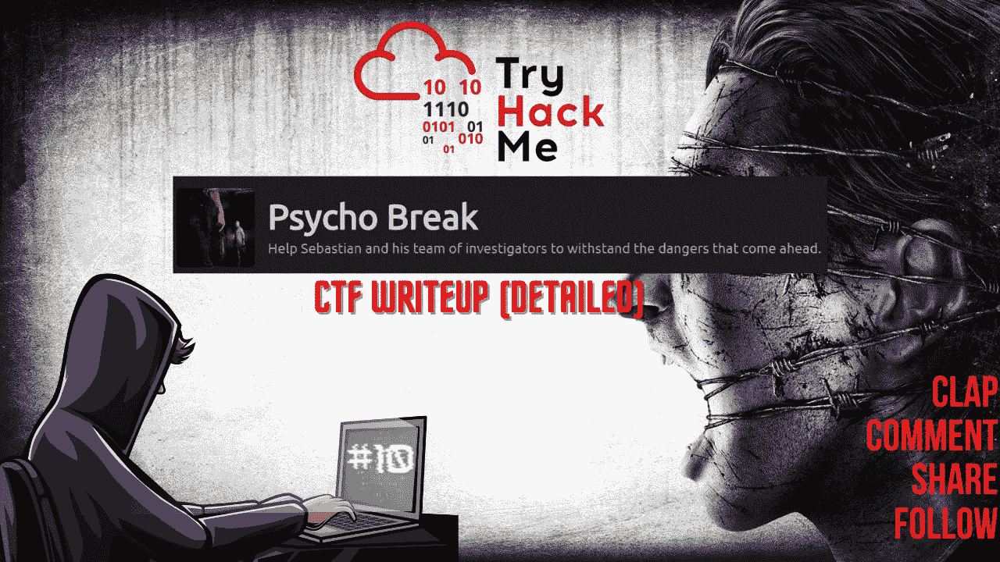

CTF 报道#10

欢迎各位！！

我们将播放由 on [TryHackMe](https://medium.com/u/dc49a0a3cb16?source=post_page-----64db523169c0--------------------------------) 创作的《惊魂记》CTF。这个 CTF 房间是一个相对较新的益智型房间。《惊魂记》的创作者[沙夫多](https://twitter.com/ShalindaFdo)CTF 大声喊出来。

 [## 精神崩溃

### TryHackMe 是一个学习和教授网络安全的在线平台，全部通过您的浏览器完成。

tryhackme.com](https://tryhackme.com/room/psychobreak) 

在桌面上为您的 CTF 计算机创建一个目录，并在 CTF 目录中为 Nmap 创建一个目录。

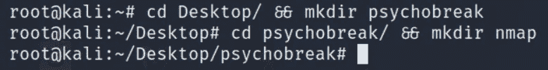

让我们开始冒险吧！！享受流动吧！！

## 任务 1-侦察:

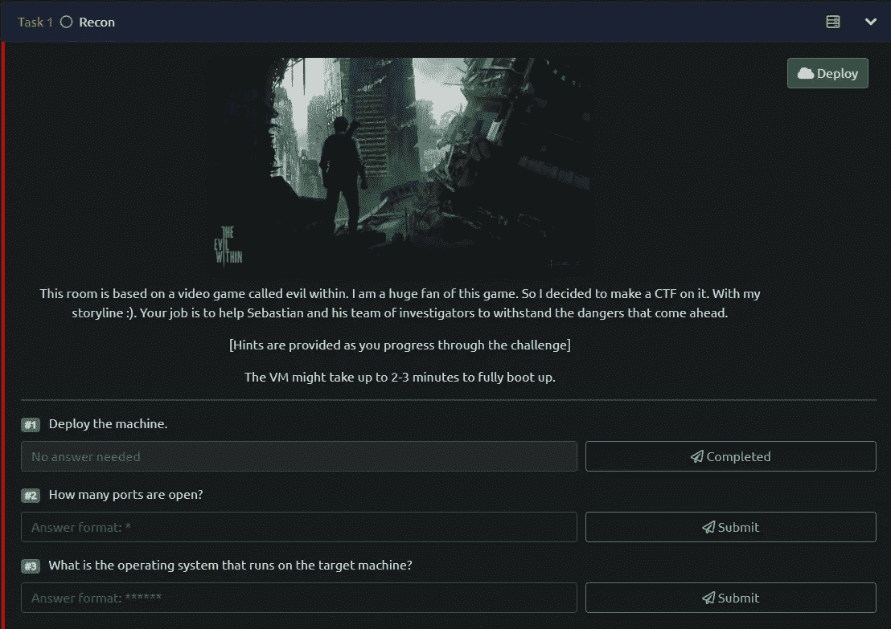

任务 1 列表

> #1 部署机器
> 答:不需要。

# Nmap 扫描:

> nmap-sC-sV-p--O--oN nmap/精神分裂<machine_ip></machine_ip>
> 
> -sC:默认脚本
> -sV:版本检测
> -oN:输出将存储在您之前创建的目录“nmap”中
> -p-:扫描所有端口
> -O:操作系统检测

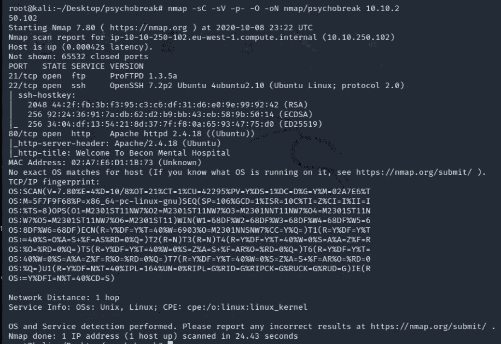

Nmap 扫描输出

有 3 个端口打开:
21/FTP-ProFTPD 1 . 3 . 5 a
22/ssh-OpenSSH 7.2 p2
80/http-Apache httpd 2 . 4 . 18
检测到的操作系统:Ubuntu Linux

> #2.开放了多少个端口？
> Ans: 3
> #3。目标机器上运行的操作系统是什么？
> 答:Ubuntu

## 任务 2-网络:

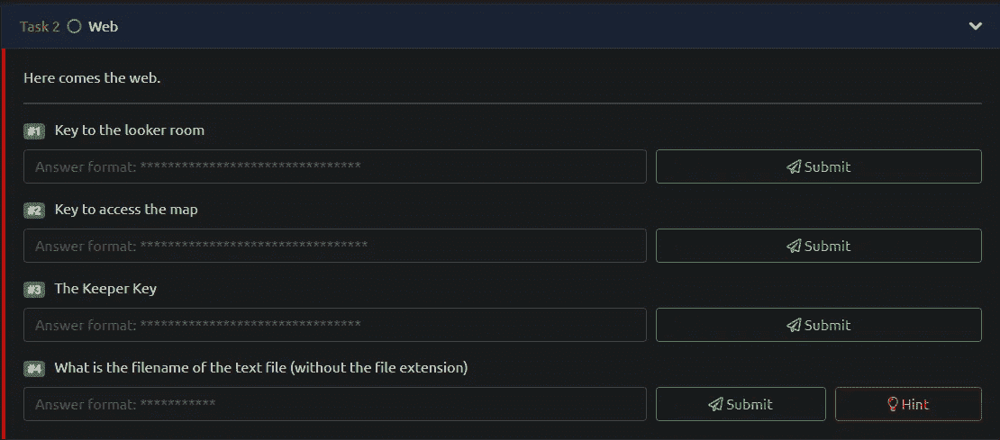

任务 2 列表

导航到 http://<target_ip></target_ip>

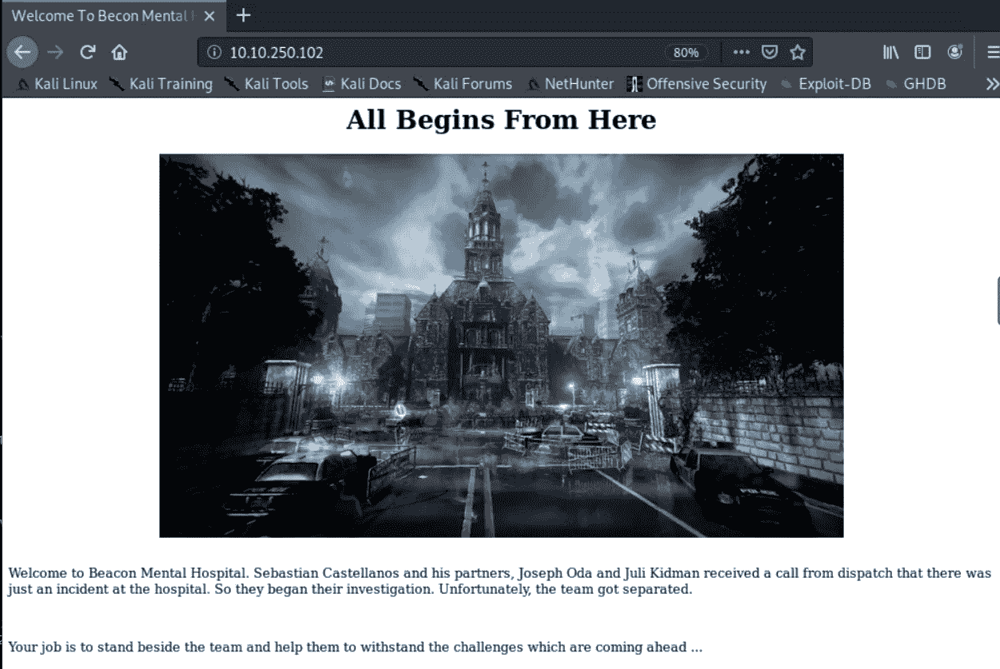

检查页面的源代码，寻找任何对我们的枚举过程有帮助的有趣信息总是好的。
查看 URL 页面的来源。[Ctrl+U]

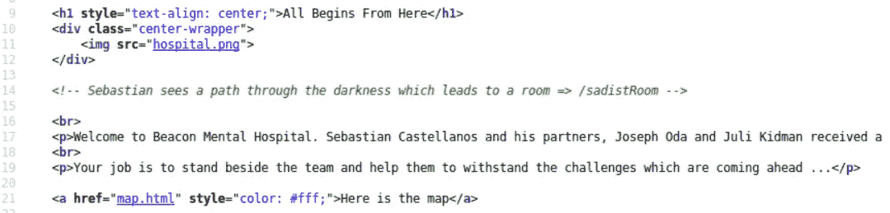

我们在源代码中有一个被注释掉的目录，供我们去发现。让我们导航到那个。

导航到 http://<target_ip>/虐待狂房间</target_ip>

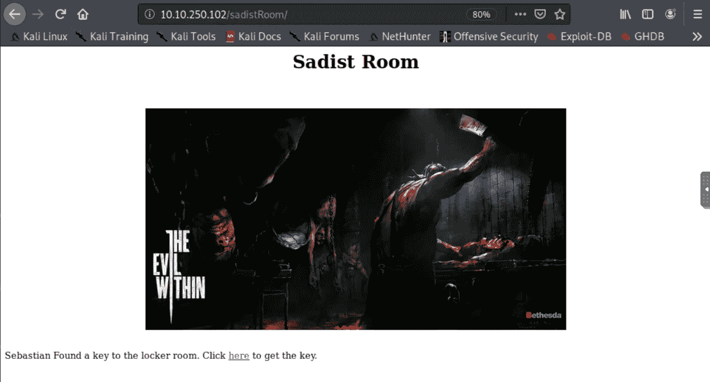

源代码:/虐待狂房间

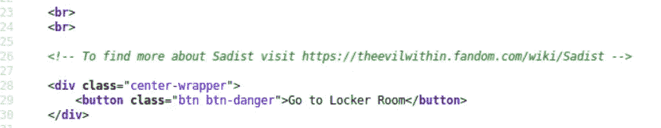 [## 虐待狂者

### “一个从杀人犯的思想中诞生的生物融合了鲁维克的疯狂。他失去了自己的愤怒，成为…

theevilwithin.fandom.com](https://theevilwithin.fandom.com/wiki/Sadist) 

点击按钮获取密钥。

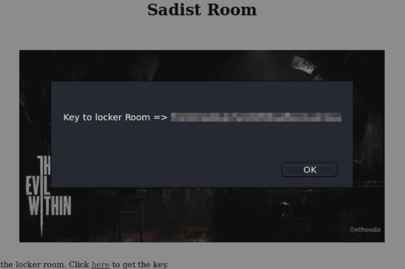

> #1.看房钥匙
> 答案:xxxxxxxxxxxxxxxxxxx

做得好！！

现在我们已经得到了第一个任务的答案，我们可以提交密钥来重定向到/lockerRoom。

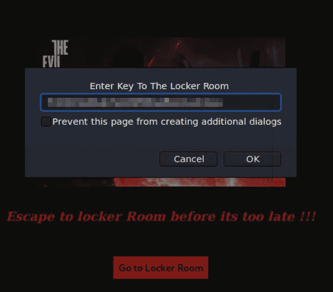

如果您等待几秒钟，不提交密钥，您将被重定向到 dead.php 页面。如果您在时间限制内正确输入了密钥，您将自动重定向到/lockerRoom 页面。

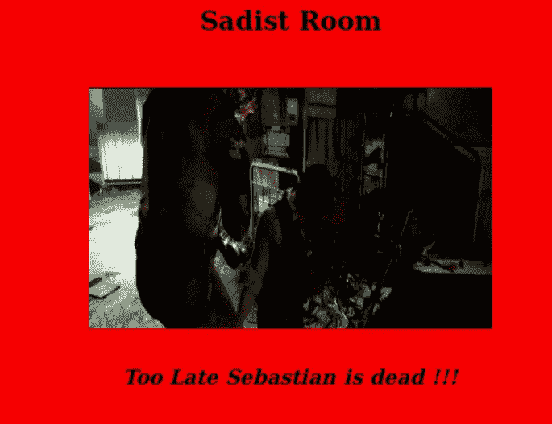

密钥提交超时

已重定向至 http:// <target_ip>/lockerRoom</target_ip>

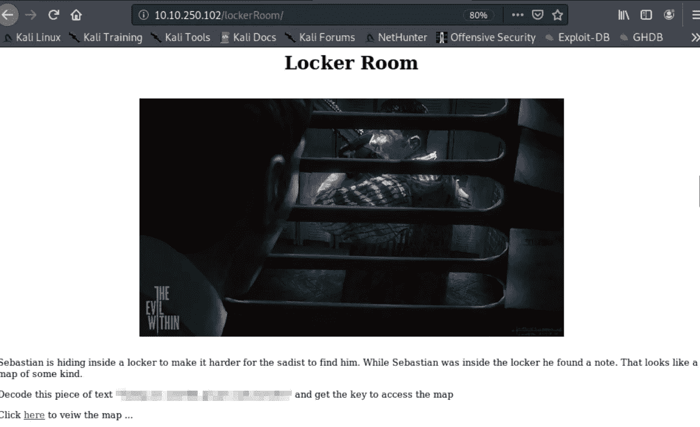

/lockerRoom

我们要解码一个散列值。一旦破解它，我们将获得访问地图的钥匙，如上所述的页面。

我们将检查网页的源代码。

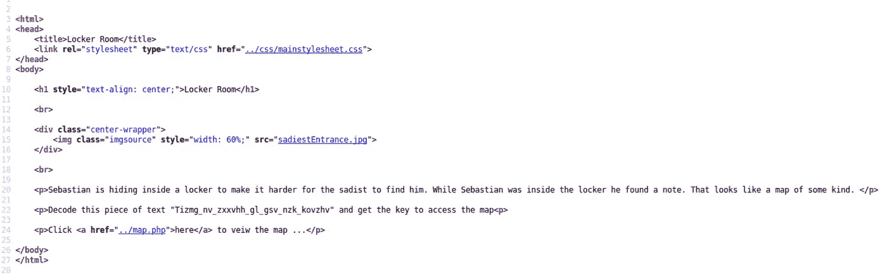

从哈希来看，它看起来像 ROT13，但实际上不是。我花了一段时间来解码，因为我只是尝试了十几种哈希格式，但无法解码哈希。我突然想到这可能是一个密码。但这可能是什么密码呢？因此，我在谷歌上查找密码分析器，找到了下面的网站。

 [## 密码标识符(在线工具)| Boxentriq

### 被密码或密文困住了？这个工具将帮助您识别密码的类型，并为您提供信息…

www.boxentriq.com](https://www.boxentriq.com/code-breaking/cipher-identifier) 

复制哈希并提交分析。

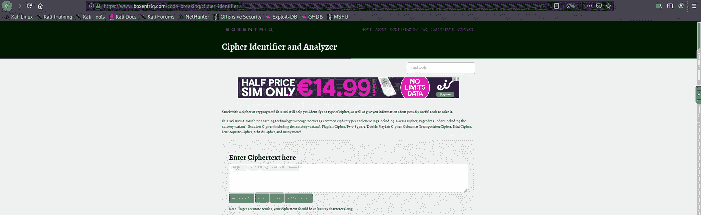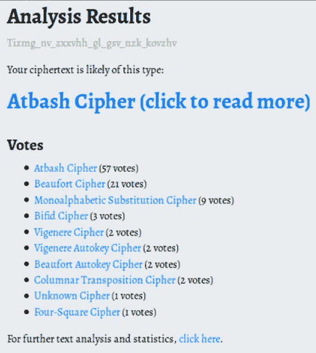

厉害！！我们已经得到了散列类型，现在对我们来说解码它就容易多了。我破解哈希的首选是赛博咖啡馆。

 [## 网络咖啡馆

### 网络瑞士军刀-一个用于加密、编码、压缩和数据分析的网络应用程序

gchq.github.i](https://gchq.github.io/CyberChef/) 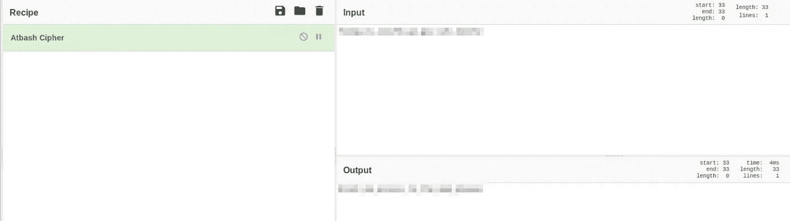

做得好！！我们已经成功解码了哈希。Cyberchef 一如既往地完美工作。

> #2.进入地图的键
> Ans:xxxxxxxxxxxxxxxxxx

我们将单击页面上的链接来访问地图。

重定向至 http:// <target_ip>/map.php</target_ip>

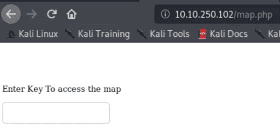

在输入我们之前通过破解 hash 获得的标志后，我们将进入 map。在这一页有 4 个链接，我们已经检查了前两个。因此，最后两个环节将是我们的兴趣点。

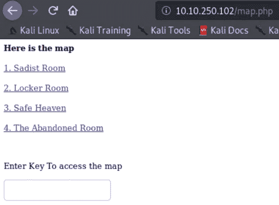

导航到 http:// <target_ip>/SafeHeaven</target_ip>

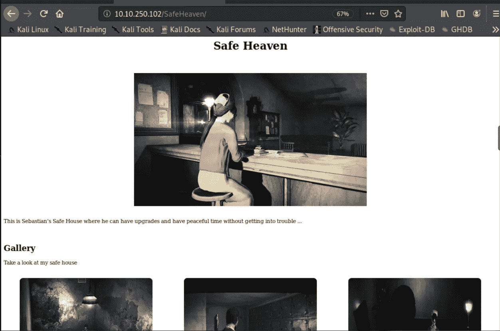

让我们看看页面的源代码。

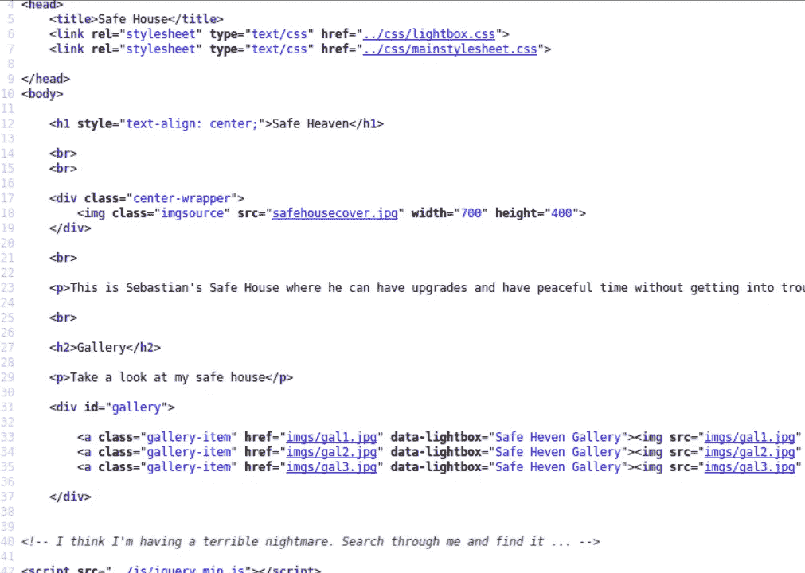

有一个评论需要我们搜索并找到一些东西，这将引导我们回答下一个任务，即找到守护者关键旗帜。我们将启动 gobuster 并在此页面中查找任何目录。希望它能给我们一些信息。

**捉鬼敢死队:**

> *gobuster dir-u http://<MACHINE _ IP>-w<PATH _ TO _ word list>*
> 
> -u:URL
> -w:word list
> -q:quiet，静默扫描。将隐藏横幅
> -o:输出将存储在目录
> -x:搜索扩展名，如 html、txt、php、phtml 等。

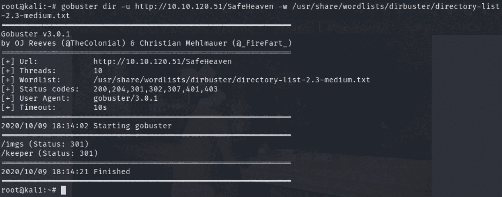

太棒了。我们找到了一个名为/keeper 的目录，这确实是我们想要的。

导航到 http:// <target_ip>/SafeHeaven/keeper</target_ip>

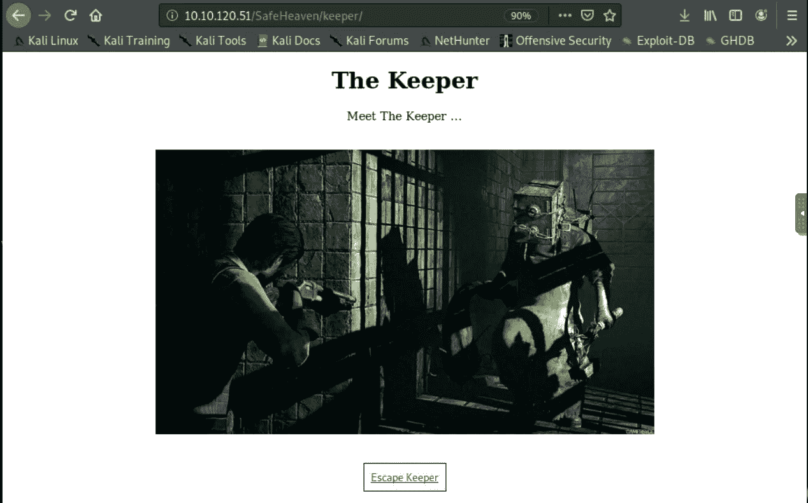

查看页面的源代码。

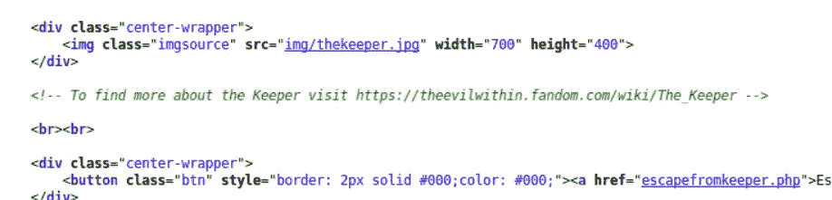

我们会找到一个包含链接到守护者维基页面的评论。它只会给你关于游戏《邪恶之心》中守护者角色的信息。
继续我们的任务，我们将点击“Escape keeper ”,并被重定向到我们必须输入密码/密钥才能继续的页面。

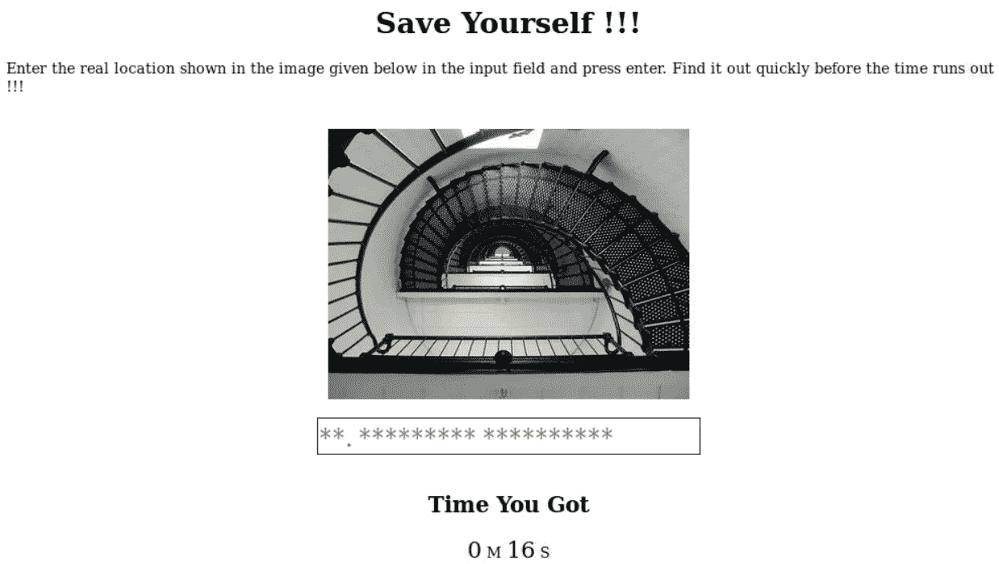

像往常一样，我们应该看看网页的源代码。

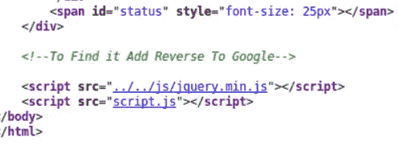

因此...我们被要求在谷歌中反转图像来寻找钥匙的答案。
将映像下载到您的主机上。

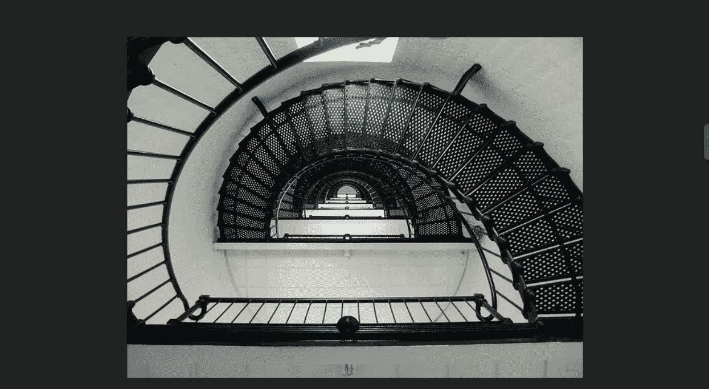

前往 google.com，点击图像，点击相机按钮，点击上传图像选项卡，选择我们之前下载的图像进行反向搜索。

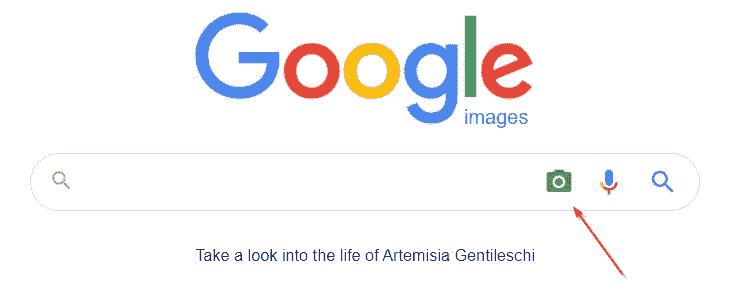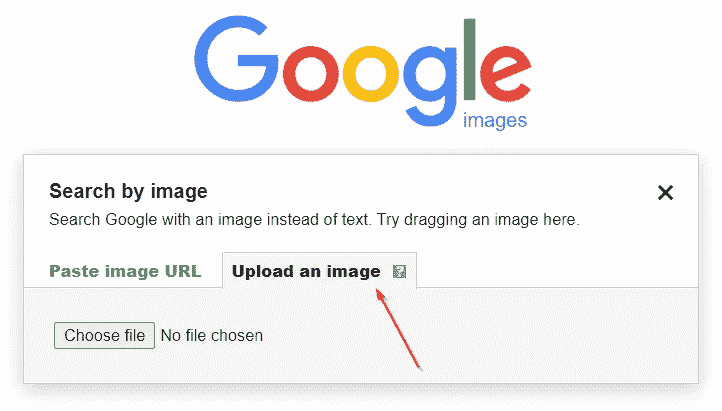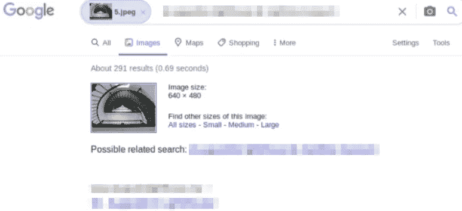

看来谷歌已经成功反转了图像，为我们提供了所需的信息。我们将复制它并试图用它进入内部。

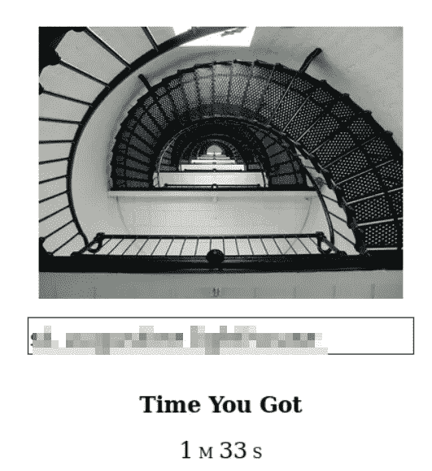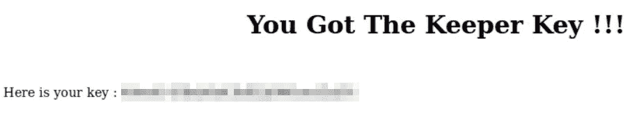

精彩！！我们得到了守护者的钥匙旗。我们可以提交并继续下一个任务。

> #3.门神钥匙
> Ans:xxxxxxxxxxxxxxxxxxxxx

我们还没有检查地图中的最后一个链接。我们将导航回 map.php 页面，并点击最后一个链接。

已重定向至 http:// <target_ip>/abandonedRoom</target_ip>

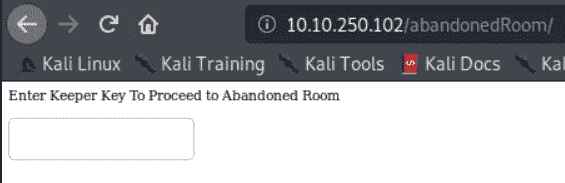

我们必须粘贴从上一个任务中获得的 keeper 密钥，然后按 Enter 键。

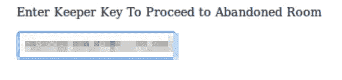

已重定向至 http:// <target_ip>/abandonedRoom</target_ip>

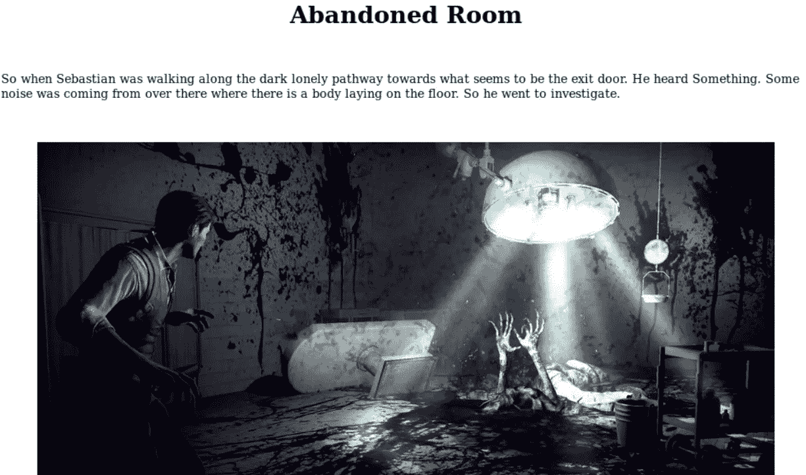

阅读叙述。点击“更进一步”

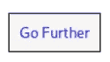

CTF 老板打架。劳拉来了。目标是逃离劳拉。

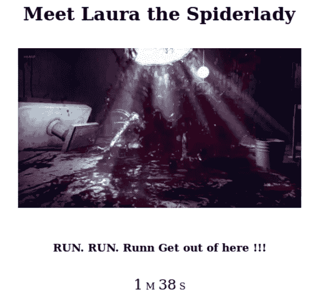

看看页面的源代码。

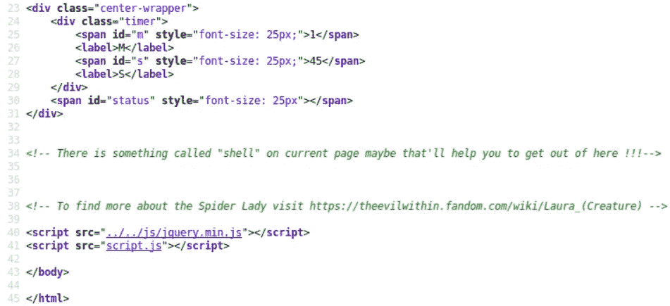

在当前页面上有一个叫做“外壳”的东西，它将帮助我们离开这里。嗯……这是一个棘手的任务，你可能会被这个任务困住。经过几次尝试后，我发现 shell 是一个参数，页面容易受到命令注入的攻击。因此，它可以使用参数在 URL 中执行命令。现在的目标是找到允许执行的命令。

尽管这是一个详细的记录，但在这个任务中，我会混淆确实有效的命令，并给我们一个逃离劳拉的方法。我希望你能深入思考一下这个问题的解决方案。如果你没有任何线索，我会用图片给你两个提示，你也会克服的。

> 提示 1:在 Linux 文件系统中当你想列出目录中的文件时，你使用什么命令。

> 提示 2:在 Linux 文件系统中，当你想浏览上一个目录时，你使用什么命令。

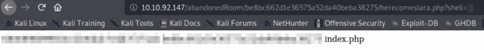

如果操作正确，你会看到两个散列和 index.php 文件。

我们发现的两个散列都是 MD5，我们可以通过 crackstation 在线破解它们，但它不会帮助我们逃离劳拉。

> 【哈希 1】是我们要去的目录
> 【哈希 2】是我们所在的目录

因此，我们将在 URL 中插入[HASH 1]来输入目录。

导航到 http://<target_ip>/abandon edroom/【has h1】</target_ip>

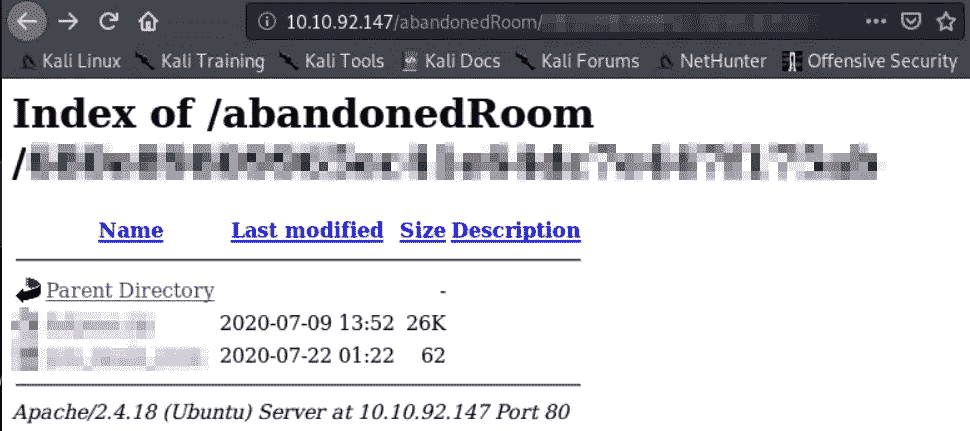

有一个 helpme.zip 文件和 XXXXXXXXXX.txt 文件。我们可以将它们下载到我们的主机上并进行检查。的名称。txt 文件回答了任务的问题。

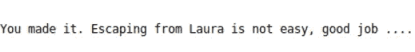

XXXXXXXXXX.txt 文件

> #4.文本文件的文件名是什么(不带文件扩展名)
> Ans:xxxxxxxxxxxxxxx

逃了！！难以置信的有趣！！
让我们跳到任务 3。

## 任务 3-帮助我:

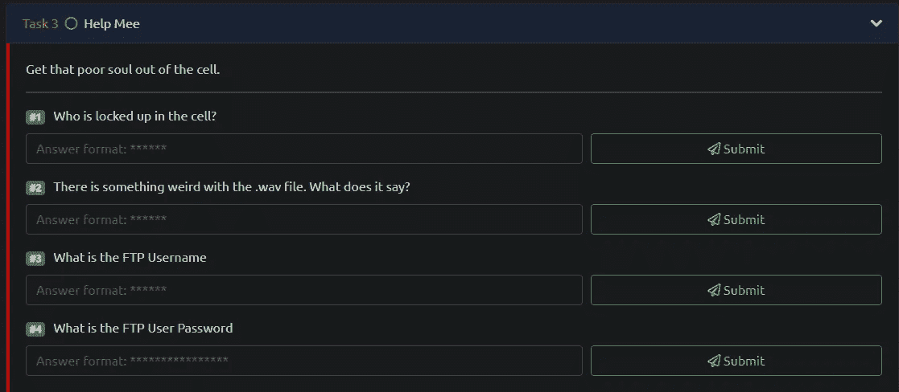

任务列表

我们必须解压缩下载的 zip 文件。

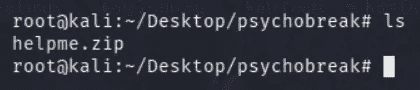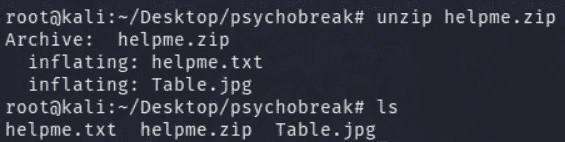

两个文件被提取。检查他们。

> 1.helpme.txt

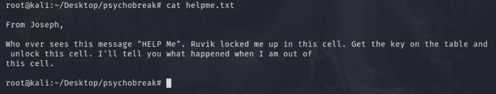

本说明回答了任务的问题。

> #1.谁被关在牢房里？
> 答:约瑟夫

我们可以使用“文件”命令来分析文件的类型。文件 Table.jpg 被重命名为 jpg，而它实际上是一个压缩文件。我们必须将其重命名为。zip 以便提取它。

> 2.Table.jpg

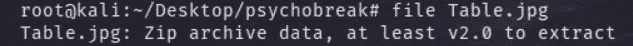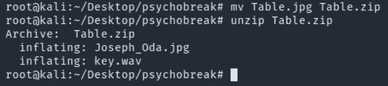

又提取了两个文件。我们可以用“文件”命令来分析它们。

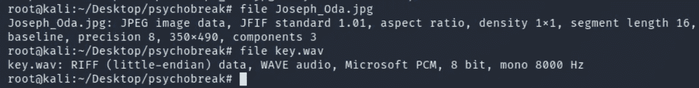

> 1.约瑟夫 _ 奥德. jpg

> 2.key.wav

我查了很多网站从中提取关键。wav 文件。我找到了链接，它会像魔咒一样工作。

 [## 莫尔斯码自适应音频解码器

### 莫尔斯电码解码器可以听你的电脑的麦克风或音频文件，适应速度和频率…

morsecode.world](https://morsecode.world/international/decoder/audio-decoder-adaptive.html) 

上传。wav 文件，然后单击播放。如果你仍然不能得到的关键，所以我想让你调整如下图所示的选项。

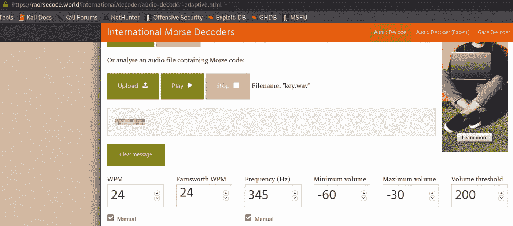

宏伟！！

> #2.这有点奇怪。wav 文件。上面写了什么？
> 答:XXXXXXXXX

我们可以回忆一下，有一个. jpg 文件，是一个名叫 Joseph 的角色的图像。它将包含有用的信息。我们可以使用隐写工具提取信息。

> 要安装:apt-get install steghide
> 要提取:steg hide extract-SF<IMAGE>

查看 thankyou.txt 文件。

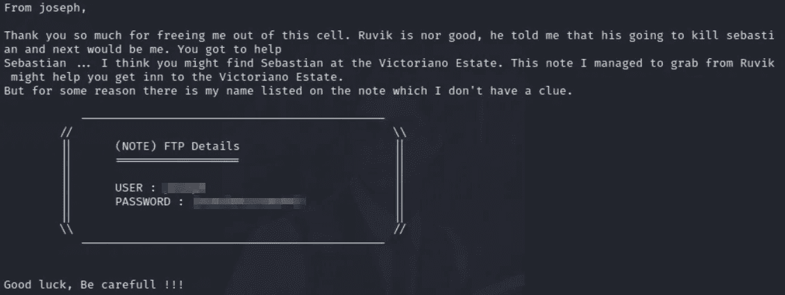

太棒了！！
我们已经获得了 FTP 凭证。
凭证回答了该任务的最后两个子任务。

> #3.什么是 FTP 用户名
> Ans: XXXXXXXX
> 
> #4.什么是 FTP 用户密码
> Ans: XXXXXXXX

## 任务 4-打开它:

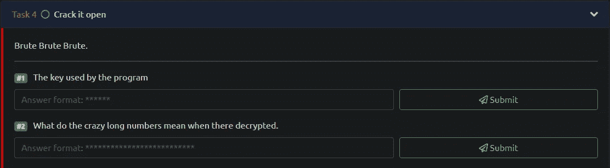

任务列表

让我们使用 FTP 凭证并枚举服务。

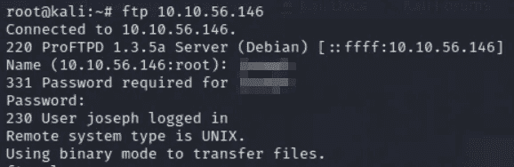

使用“get”命令将文件传输到主机:

> 获取程序
> get random.dic

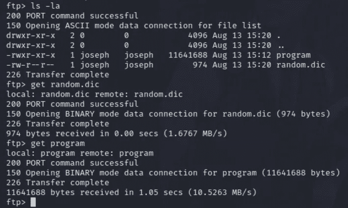

我们有两个文件，我们必须检查每一个。

> 1.random.dic

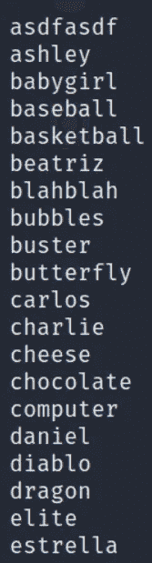

一个单词表，但不要太长。不错！！

> 2.程序

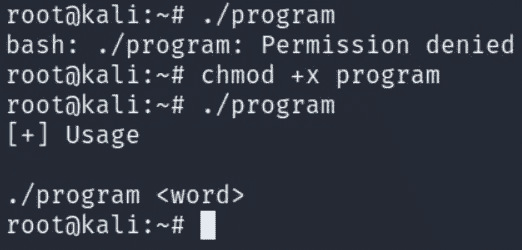

当我们运行程序文件时，它需要许可，因此我们使用命令“chmod +x program”。
在执行程序时，我们将看到程序的使用格式。我们需要从 random.dic 字典文件中输入正确的单词，因此我们必须对程序进行强制。

我们将使用下面的命令:

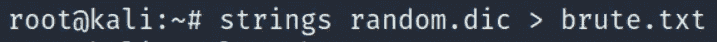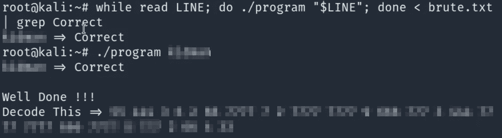

在我们插入正确的密钥后，程序会给我们一个散列值来解码。

*XX XXX X XX X XX XXXX X XXXX XXXX X XXX XXX X XXX XXXX XXXX XXX XXXX X XXX X XX XX XX*

当然哈希不是一个妖术。我在 reddit 上做了研究，找到了答案。要解码它，我们可以使用下面的链接:

 [## 你好！

### 编辑描述

keypad-translator.glitch.me](https://keypad-translator.glitch.me/) 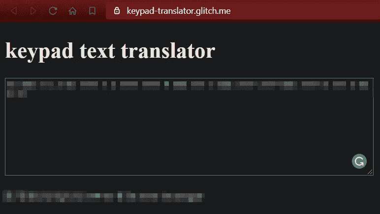

或者，有另一个链接来解码散列。

 [## 编码短信多次点击(电话模式 ABC) -编码器、编码器、编码器

### Outil 为编码器/编码器与轻敲模式的短信。多抽头或代码 ABC 是一种类型的 saisie 利用在这些…

www.dcode.fr](https://www.dcode.fr/code-multitap-abc) 

太棒了。！我们正在粉碎它！！让我们进行任务 5。

## 任务 5-去捕捉旗帜:

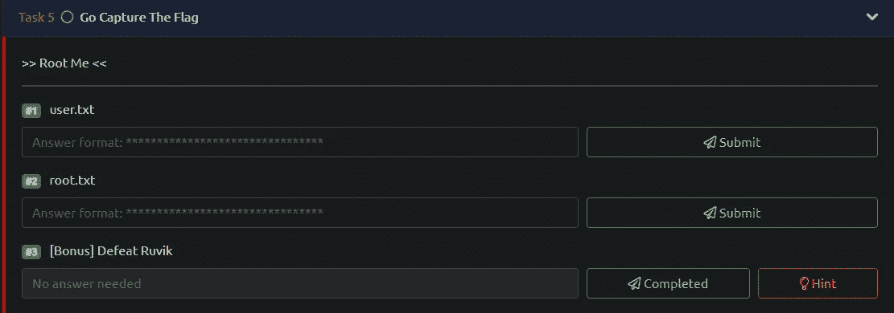

我们将使用在上一任务中破解的凭证登录 ssh。

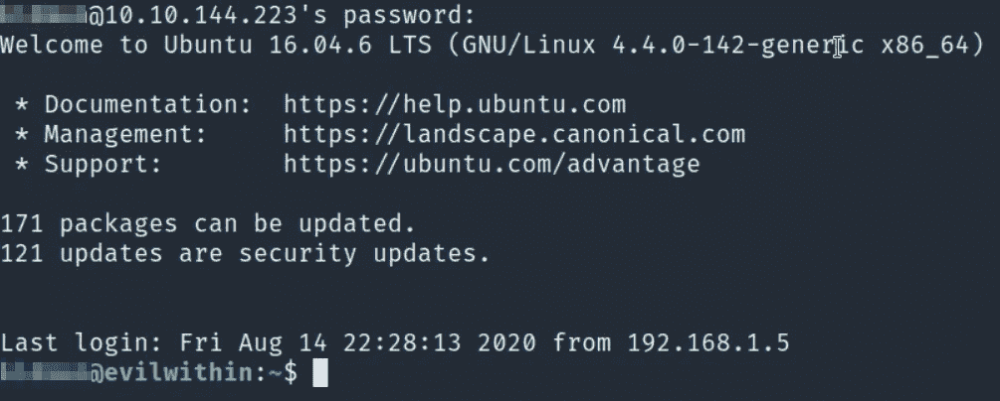

瞧。我们成功获得了壳牌。
让我们捕获用户标志。

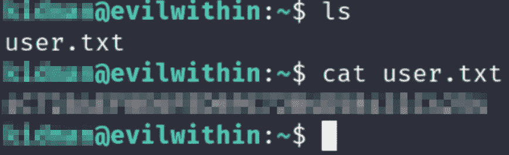

> #1.user . txt
> Ans:xxxxxxxxxxxxxxxxxxxxxxxxxx

厉害！！现在该怎么办..你认为这是对的。我们必须提升我们的权限，并成为 root 用户以获取 root 标志。

让我们进行一些手动枚举，找出任何潜在的攻击媒介，以帮助提升权限。

我们将查看任何具有超级用户权限的二进制文件。

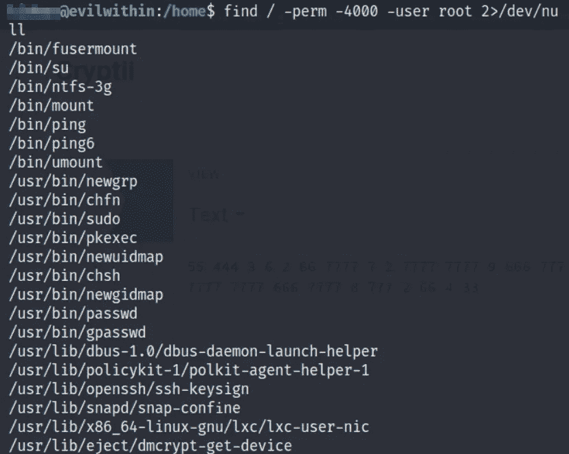

我们将通过 crontab 查找计划运行的脚本。

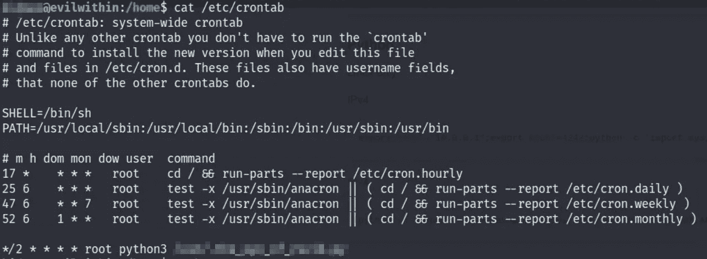

太好了！！有一个脚本计划以 root 用户身份每 2 分钟运行一次。
我们来看看剧本。

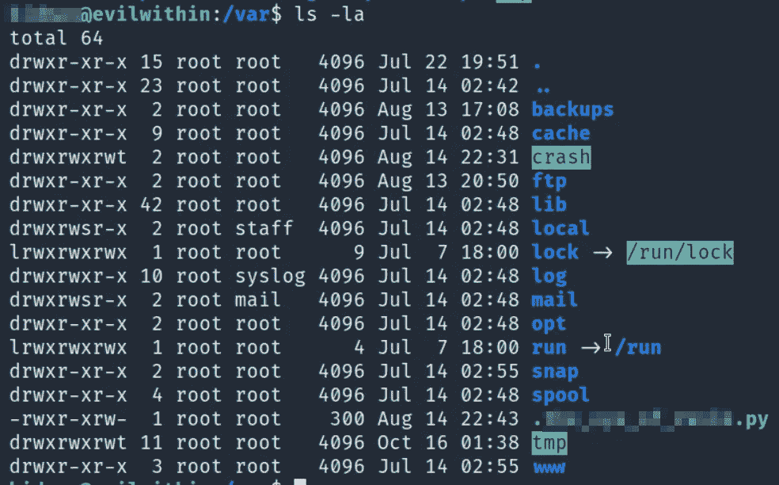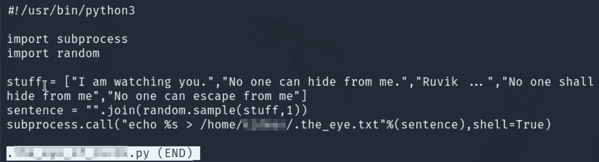

我们必须修改脚本并插入有效负载，这将在执行时在 netcat 中给我们一个反向 shell。

 [## 反向外壳备忘单

### 如果你足够幸运，在渗透测试中发现了一个命令执行漏洞，不久之后…

pentestmonkey.net](http://pentestmonkey.net/cheat-sheet/shells/reverse-shell-cheat-sheet) 

我们可以使用 nano editor 并粘贴有效载荷，将值更改到我们的主机，保存它并等待它执行。

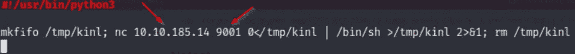

在 netcat 上启动监听器。

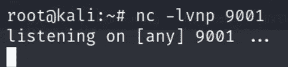

等等！！手指交叉！！

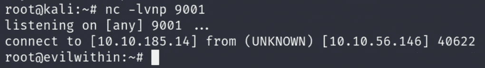

耶！！搞定了。！好放心！！太棒了！！
让我们抓住根旗。

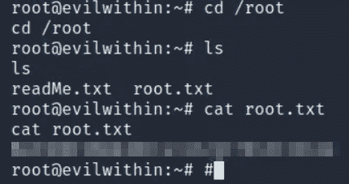

我们已经成功地找到了盒子并得到了所有的标志。

> #2.root . txt
> Ans:xxxxxxxxxxxxxxxxxxxxxxxxxxxxxx

我们将完成奖金任务。这样做很简单。我们可以用“德卢斯·鲁维克”。

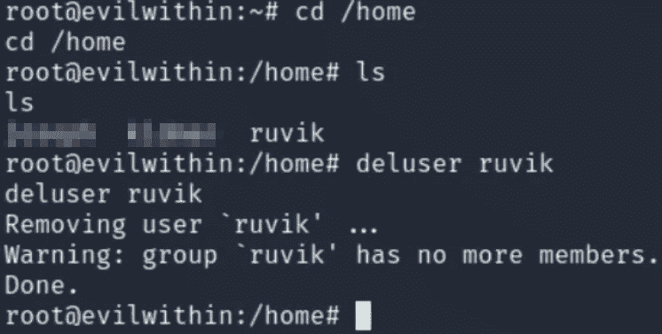

(就是那样)突如其来😃。

> #3.[奖金]击败鲁维克
> 答:不需要答案

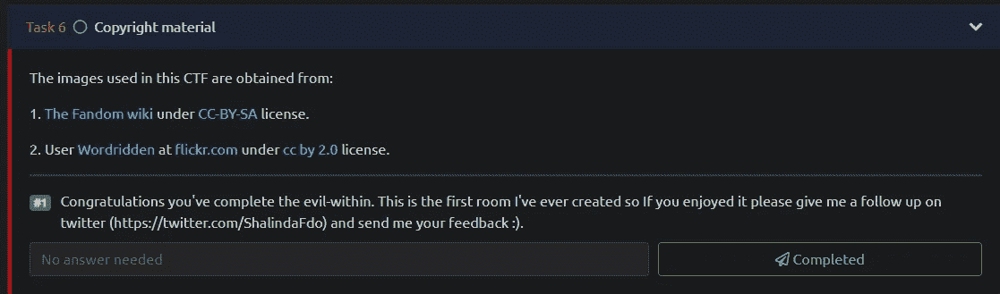

> #1.恭喜你完成了内心的邪恶。这是我创建的第一个房间，所以如果你喜欢它，请在 Twitter(https://twitter.com/ShalindaFdo)上给我一个后续信息，并给我发送你的反馈:)。
> 答:不需要回答

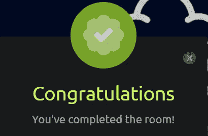

如果你喜欢这个帖子，并且这个帖子在任何可能的方面帮助了你，请在评论中告诉我，或者用掌声分享你的爱。

谢谢你抽出时间。

跟着我。

更多的报道正在进行中。

保重，注意安全，继续黑！

**-哈桑·谢赫**