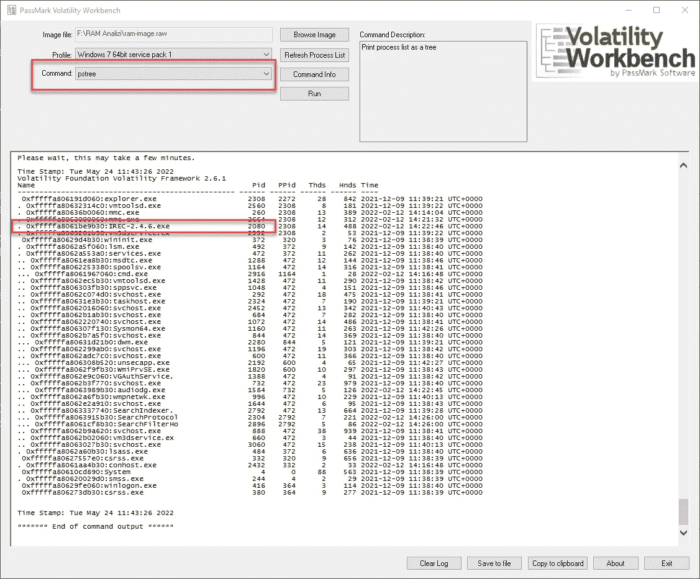
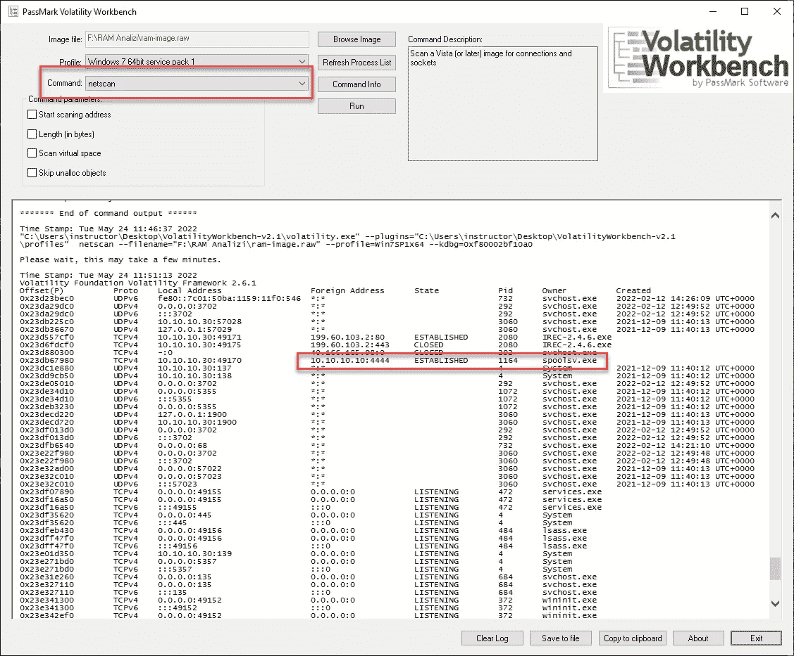
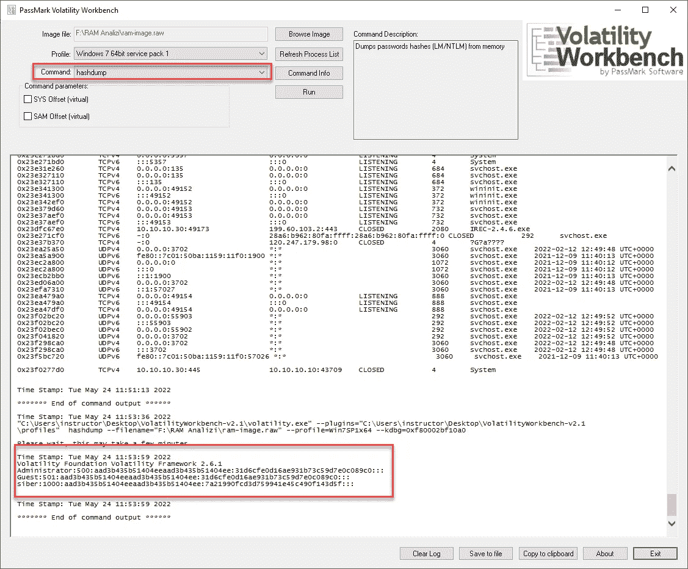
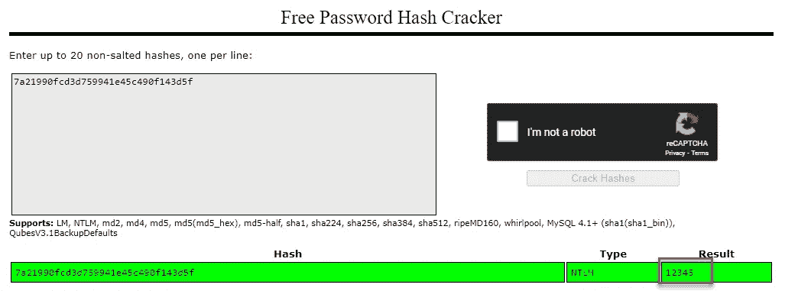
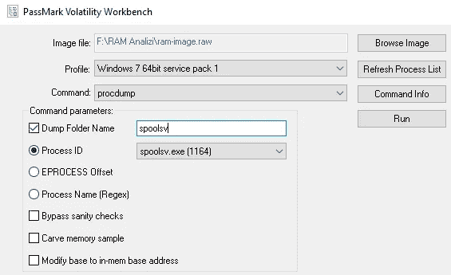

# Tryhackme ramanalysis 报道

> 原文：<https://infosecwriteups.com/tryhackme-ramanalysis-writeup-c305dd88f150?source=collection_archive---------8----------------------->

 [## 网络安全培训

### TryHackMe 是一个免费的学习网络安全的在线平台，使用动手练习和实验室，通过您的…

tryhackme.com](https://tryhackme.com/jr/ramanalysis) 

Volatility Workbench 将用于此房间的解决方案。

问:IREC-2.4.6.exe 用什么进程 ID 运行？
A:2080
波动率工作台命令:pstree

问:反向 shell 获得的 IP 地址和端口是什么？
A:10.10.10.10:4444
波动率工作台命令:netscan

问:检索反向外壳时启动的进程是什么？
答:spoolsv.exe

Volatility Workbench 命令:netscan

问:检索反向外壳时启动的进程的 id 是什么？
答:1164

Volatility Workbench 命令:netscan

问:网络用户的密码是什么？答:12345

Volatility 工作台命令:hashdump

让我们在 crackstation 中搜索哈希信息。

问:用 procdump 转储 1164 个进程后创建的文件的 MD5 值是多少？
a . 34 a6f 074 BC 9 BCF 31516054d 7 DD 72 c0f 4

Volatility 工作台命令:procdump

让我们在 virustotal 中搜索该文件。

