# TryHackMe: RES

> 原文：<https://infosecwriteups.com/tryhackme-res-5e814acff6ed?source=collection_archive---------1----------------------->

## 游戏攻略

大家好。！这次我们要去 root res，一个 TryHackMe 上容易评级的机器。

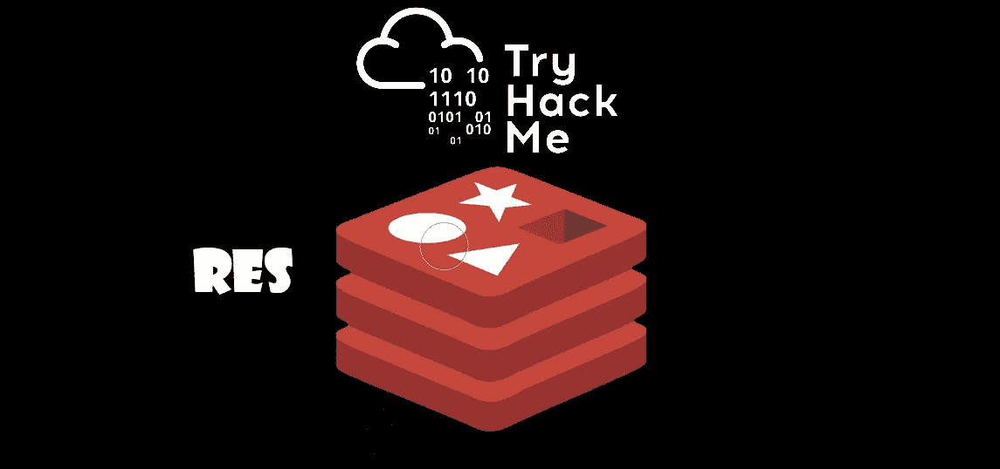

Cover.png

# 列举

先说枚举，即 **nmap** 扫描:

```
nmap -sC -sV -Pn -oN nmap $IP
```

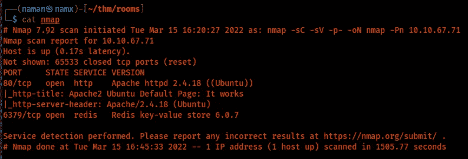

nmap 扫描结果

我们有两个开放的端口，80 是 T2 的 http T3，6379 是 T4 的 Redis T5。

据了解，Redis 是某种数据结构存储服务。

我很快谷歌了一下 redis，发现了一些有趣的枚举步骤( [**链接**](https://book.hacktricks.xyz/pentesting/6379-pentesting-redis) )。

# 剥削

让我们通过以下方式检查服务

```
redis-cli -h $IP
```

通过标题，我们知道是 **ngnix** 服务器将它的 html 数据存储在 **/var/www/html** 上

所以让我们为 RCE 做好准备:

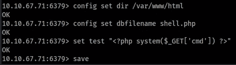

外壳制备

现在，让我们检查一下 **RCE** 。

```
http://$IP/shell.php?cmd=id
```

访问此 URL 后，我们得到确认。现在是壳的时间了！！

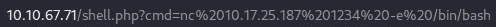

获取外壳 URL

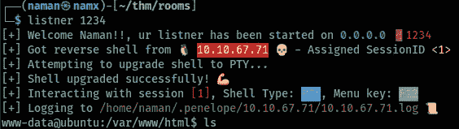

shell.png

不要理会我的谎言，它们只是所有大司令部的一封邮件。

# 特权 c

获得 shell 后，我检查了任何易受攻击的 SUID 二进制文件，并找到了一个

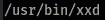

SUID

在 [**GTFOBins**](https://gtfobins.github.io/gtfobins/xxd/#suid) 上搜索，有了这个二进制，我们只能以 root 身份读取文件。我拿到了 root.txt XD。

但是我进一步利用了它，得到了/etc/shadow 文件。

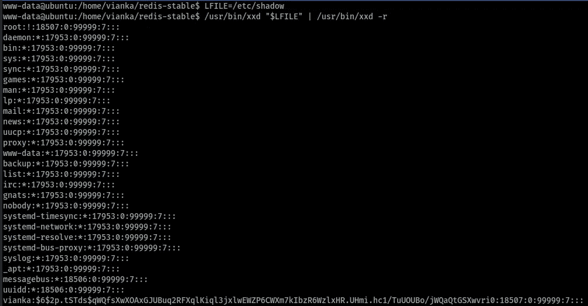

/etc/影子

简单地复制散列，约翰做了一切需要做的事情(:

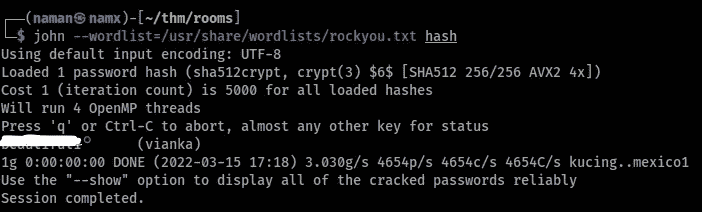

约翰破解了用户维安卡的密码

使用命令以用户 **Vianka** 的身份登录

```
su vianka
```

我们得到了用户标志

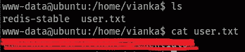

用户标志

# 根

在用户标志之后，我再次搜索一些 SUID 二进制文件、crontabs、内核漏洞等等。但哑巴我，检查 sudoers 的许可:

```
sudo -l
```

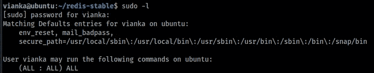

须岛一号

她可以用任何命令使用 sudo。我使用

```
sudo su
```

我们是根 XD

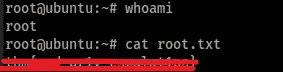

根标志

就这样了，谢谢你抽出时间来看我的博客。我将在下一篇博客中与你见面。

|| [网站](https://namx05.github.io) | [推特](http://twitter.com/namx05) | [THM-RES-Room](https://tryhackme.com/room/res) ||