# TryHackMe:反转 ELF 记录

> 原文：<https://infosecwriteups.com/tryhackme-reversing-elf-writeup-6fd006704148?source=collection_archive---------0----------------------->

这篇文章展示了我解决由 **mrpvr** 创建的**倒车精灵**房间的方法，可在 TryHackMe 平台上免费获得。这个房间包含 8 个初学者难题，难度随着你的进步而增加。我在下面提供了一个 TryHackMe 平台的链接，供有兴趣尝试这些挑战的人使用。


# Crackme1

> 让我们从一个基本的预热开始，你能运行二进制吗？

挑战提供了一个要求我运行的二进制文件。使用**文件**命令，我可以看到根据房间的标题，它是一个精灵二进制文件。

```
file crackme1
```

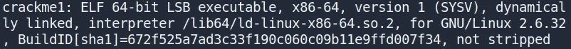

使用 chmod 命令，我可以使文件可执行，然后运行 ELF 二进制文件来获取标志。很好很容易！

```
chmod +x crackme1./crackme1
```

# Crackme2

> 找到超级秘密密码！并使用它来获取标志

该挑战提供了一个 ELF 二进制文件，需要密码才能获得标志。

```
./crackme2 **password**
```

只需使用 **strings** 命令就可以获取二进制文件的密码。密码可以在输出中看到。

```
strings crackme2
```


将此密码作为二进制文件的输入提供给标志。

# Crackme3

> 使用基本的逆向工程技能获得旗帜

提供了一个 ELF 二进制文件，它需要密码才能检索标志。可以使用与 crackme2 相同的方法来检索密码，但是多了一个步骤。使用 **strings** 命令，我找到了一个 **base64 编码的字符串**。

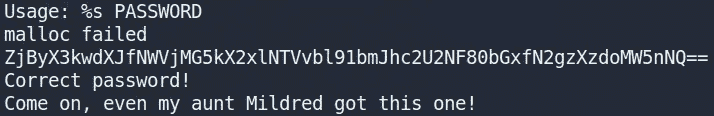

使用 **CyberChef** ，我可以解码字符串并检索密码，结果是旗帜。

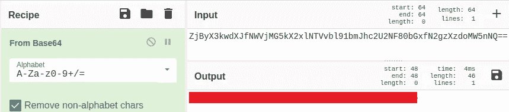

# Crackme4

> 分析并找到二进制文件的密码？

在没有密码的情况下运行 ELF 二进制文件，我得到了以下消息。

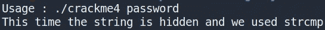

这个提示告诉我，ELF 二进制文件使用了 **strcmp** 函数。我决定用 **gdb 调试器**调试二进制。

```
gdb crackme4
```

接下来，我使用 gdb 列出了二进制文件中的不同函数。

```
(gdb) info functions
```

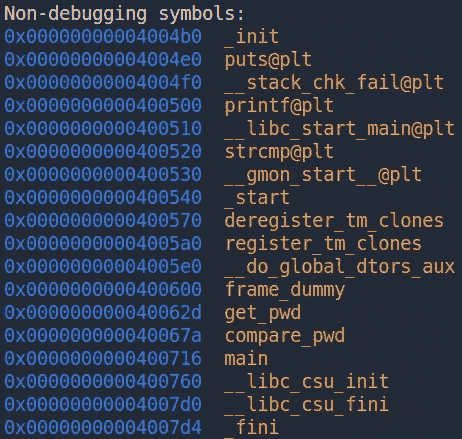

有几个有趣的函数名很突出，包括 **main** 、 **get_pwd** 、和 **compare_pwd** 。但是，根据提供的消息，我对 **strcmp@plt** 函数感兴趣。我们可以假设通过 **strcmp()** 将输入的密码与正确的密码进行了比较。使用 gdb，我决定在这个函数的内存地址设置一个**断点**。

> 注意:在软件开发中，**断点**是**程序**中有意停止或暂停的地方，放置在适当的位置用于调试目的，并帮助获取关于**程序**在其执行期间的知识。

```
(gdb) b *0x0000000000400520
```

设置好断点后，我现在可以用一些测试输入在 gdb 中运行二进制文件了。

```
(gdb) run test
```

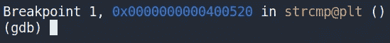

如上图所示，二进制文件一直执行到遇到断点。接下来，我可以用 gdb 查看寄存器的当前状态。

> 注意:寄存器本质上是处理器中的小存储区域，可以用来存储任何用 8 个字节或更少字节表示的内容。

```
(gdb) info registers
```

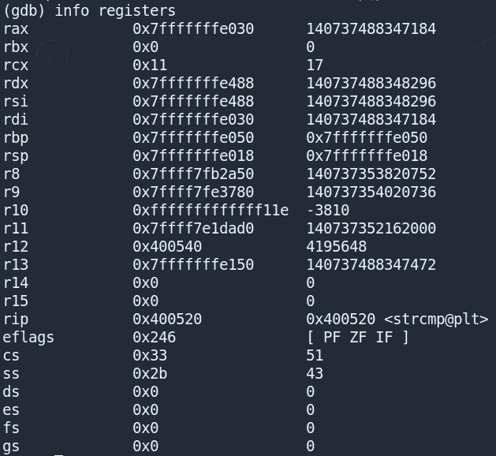

查看上面的输出，我可以看到寄存器的名称，十六进制格式的寄存器值和 gdb 认为最合适的格式的寄存器值(十六进制表示指针，十进制表示其他)。我可以看到通用寄存器 **rax** 和 **rdx** 有内存地址值。我可以使用 gdb 在这些地址打印字符串。

```
(gdb) x/s 0x7fffffffe030
```

这向我显示了我在执行二进制文件时作为输入提供的字符串，以及用于与我的输入进行比较的密码/标志。

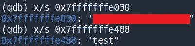

# Crackme5

> 得到输出`Good game`的文件的输入是什么？

对于这个 ELF 二进制文件，我的任务是提供一些输入，输出消息“**好游戏**”。

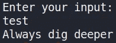

使用 gdb，我在二进制文件中列出了不同的函数。

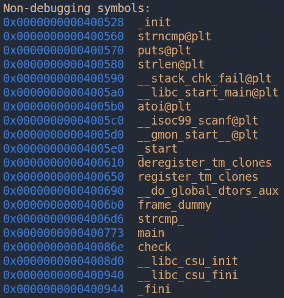

与 Crackme4 中不同，二进制文件现在使用的是**strcmp @ PLT**而不是 **strcmp@plt** 。查看 rax 和 rcx 寄存器的内存地址字符串值给了我必要的输入，以获得输出消息“Good game”。

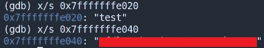

同样的方法也可以与 **strcmp_** 函数一起使用来检索标志。

# Crackme6

> 分析易密码的二进制文件

在没有密码的情况下运行 ELF 二进制文件会显示一条消息，告诉我查看**源代码**。

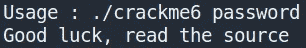

对于这个挑战，我将使用 **Ghidra** ，一个软件逆向工程(SRE)工具套件。我将 crackme6 二进制文件加载到 Ghidra 中，GHI DRA 对二进制文件进行反编译，并为我提供源代码。我从查看**主**函数开始。

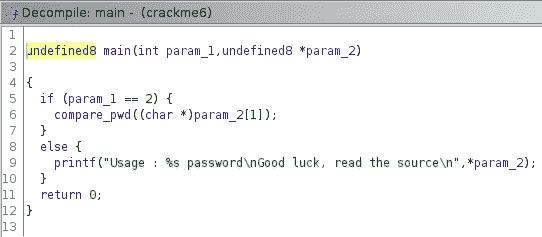

我可以看到密码的输入被传递给了一个名为 **compare_pwd** 的函数，其源代码可以在下面看到。

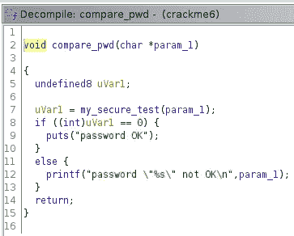

该函数获取密码并将其传递给另一个名为 **my_secure_test** 的函数。查看这个函数的源代码可以发现一个 **if else** 语句块，它检查输入中的每个字母是否对应于一个**指定的字符串值**。

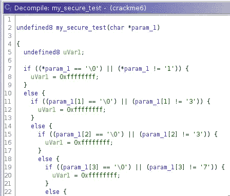

将这些指定的字符串值重新组合成一个字符串提供了标志(即“1”、“3”、“3”、“7”等)..).

# Crackme7

> 分析二进制文件以获取标志

执行 ELF 二进制文件为我提供了三个不同的任务，我可以通过输入相应的数字来执行它们。

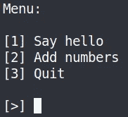

我决定用 Ghidra 来反编译二进制的源代码。查看 **main** 函数的源代码，我可以看到用户输入的数字被 **if else** 语句检查，然后根据输入的值执行一个动作。

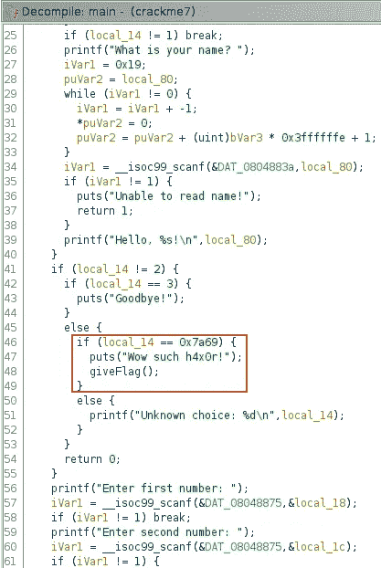

我注意到似乎有一个隐藏的选项运行一个叫做 **giveFlag()** 的方法。要触发此选项，我需要输入十进制格式的十六进制值 **0x7a69** ，即 **31337** 。这给了我旗子。

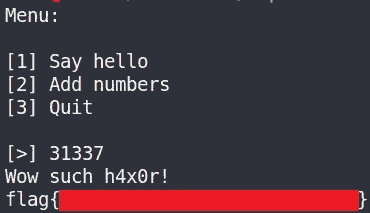

# Crackme8

> 分析二进制文件并获取标志

这是另一个 ELF 二进制文件，它请求密码以获得标志。如前所述，我使用 Ghidra 反编译二进制文件，并开始查看主函数的反编译源代码。我可以看到，在检查输入是否等于 **-0x35010ff3 之前，输入被传递给一个名为 **atoi()** 的函数。**

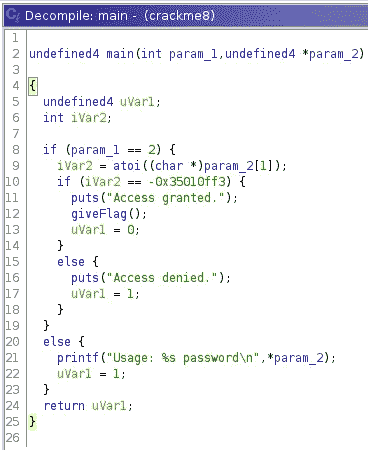

**atoi()** 函数是 C 编程语言中的一个函数，**将字符串转换成整数**数值表示。我可以把 **-0x35010ff3** 的值转换成十进制，也就是 **-889262067** ，然后作为密码传递给二进制，得到标志。

```
./crackme **-889262067**
```

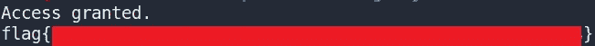

# 结束语

我发现这些挑战真的很有趣，对于学习更多关于反转 ELF 二进制文件的人来说也很容易。这些挑战涵盖了如何对 ELF 二进制文件进行逆向工程的基础知识，可以帮助初学者了解更多关于逆向工程领域的知识。感谢阅读到最后，继续黑客😄！

# 参考

[](https://tryhackme.com/) [## 黑客培训

### TryHackMe 是一个学习和教授网络安全的在线平台，全部通过您的浏览器完成。

tryhackme.com](https://tryhackme.com/)