# TryHackMe : RootMe CTF 报道(详细)

> 原文：<https://infosecwriteups.com/tryhackme-rootme-ctf-walkthrough-detailed-a7c521df7339?source=collection_archive---------0----------------------->

## 让我们开始吧！！

## **任务 1-部署机器**

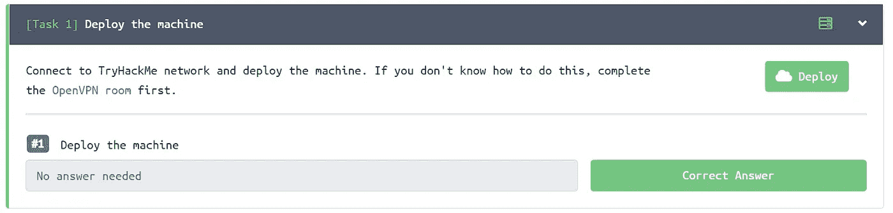

在桌面上为 ctf 机器创建一个目录，并为 nmap 创建一个目录

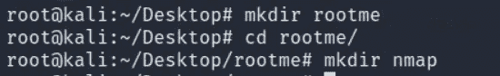

**任务二——侦察**

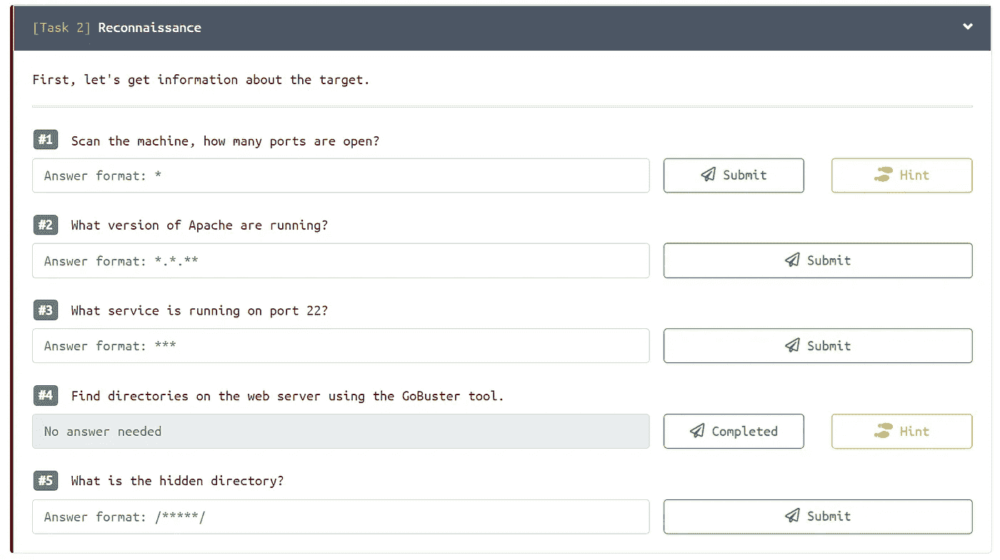

## **Nmap 扫描:**

> nmap -sC -sV -oN nmap/rootme<machine_ip></machine_ip>

*   -sC:默认脚本
*   -sV:版本检测
*   -oN:输出将存储在您之前创建的目录“nmap”中

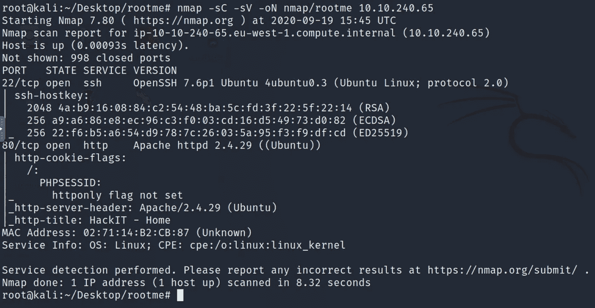

Nmap 扫描输出

有 2 个端口打开:
22/ssh—OpenSSH 7.6p 1
80/http—Apache httpd 2 . 4 . 29
检测到 OS—Linux

> #1.1.扫描机器，有多少端口是开放的？
> Ans: 2
> #1.2。Apache 运行的是什么版本？
> 答:2.4.29
> #1.3。端口 22 上运行的是什么服务？
> 答:宋承宪

**Gobuster :**

Gobuster 标准输出

> gobuster dir-u http://<machine_ip>-w<path_to_wordlist></path_to_wordlist></machine_ip>

*   -u : URL
*   -w:单词表

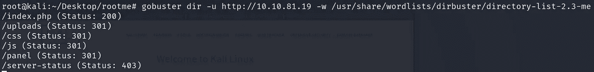

使用以下标志的 Gobuster 输出

此外，您可以在 gobuster 中使用更多标志:

*   -问:安静，无声扫描。将隐藏横幅。
*   -o:要存储在目录中的输出
*   -x:搜索扩展名，如 html、txt、php、phtml 等。

> #1.4.使用 GoBuster 工具在 web 服务器上查找目录。
> 答:不需要回答
> #1.5。什么是隐藏目录？
> Ans: /panel/

**任务 3-获取外壳**

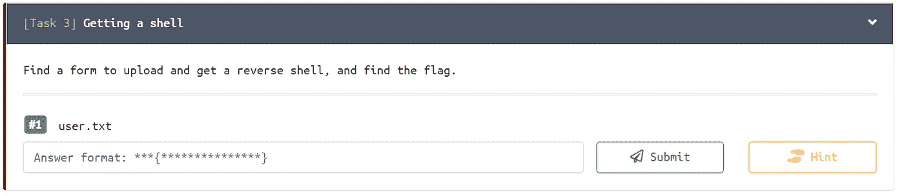

导航至网址 http://<machine_ip></machine_ip>

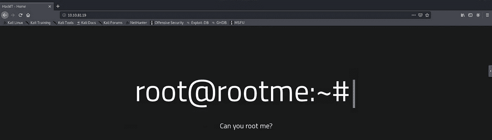

检查页面的源代码，寻找任何对我们的枚举过程有帮助的有趣信息总是好的。
查看 URL 页面的来源。Ctrl+U

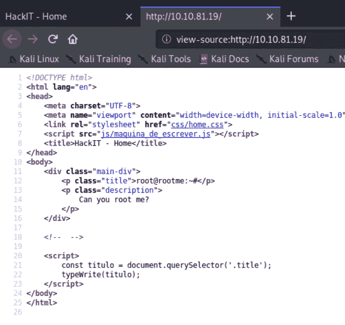

正如你所看到的，我们对源代码中没有什么感兴趣的，所以我们将开始查看 gobuster 中的目录。

有一个隐藏的目录/面板/。

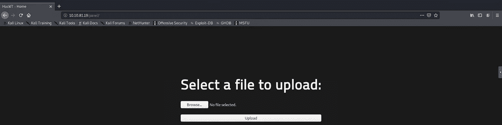

我们可以在/panel/目录中上传一个文件。

对于这项任务，我们将上传 php 反向外壳脚本。我经常使用 pentest monkey php-reverse-shell.php 脚本，试图获得一个使用 netcat 的反向外壳。
Git 链接下载脚本或在终端克隆:[https://github.com/pentestmonkey/php-reverse-shell](https://github.com/pentestmonkey/php-reverse-shell)

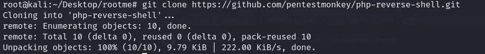

> 使用命令:
> chmod+x PHP _ reverse _ shell . PHP 使您的 php-reverse-shell 脚本可执行。
> 在编辑器中打开脚本，将$ip 和$port 更改为您要监听的主机的 ip 和端口。

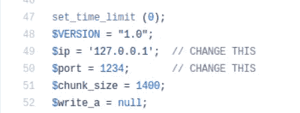

现在您已经配置了脚本。我们将进一步上传脚本。

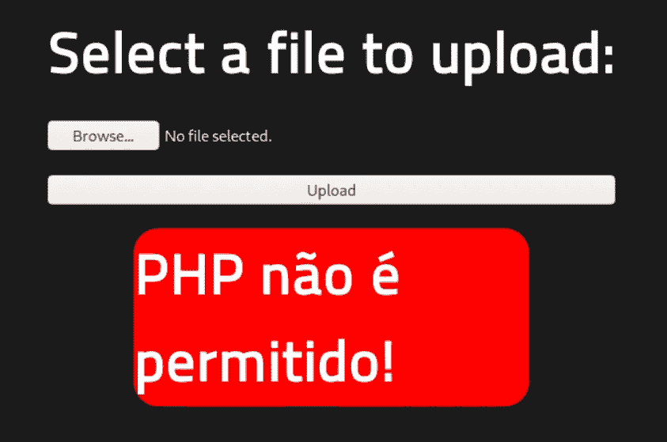

上传失败！！这是因为 php 不允许上传。因此，我们将尝试通过更改文件扩展名来绕过上传。要进一步了解文件名旁路，请参见下面的图表:

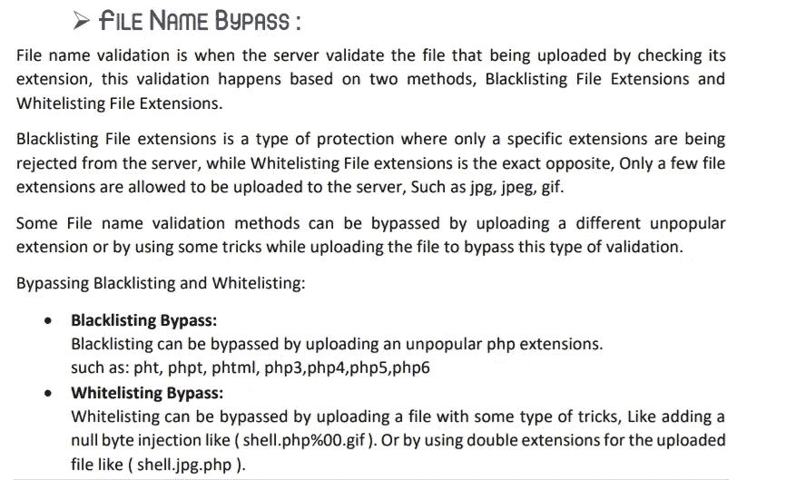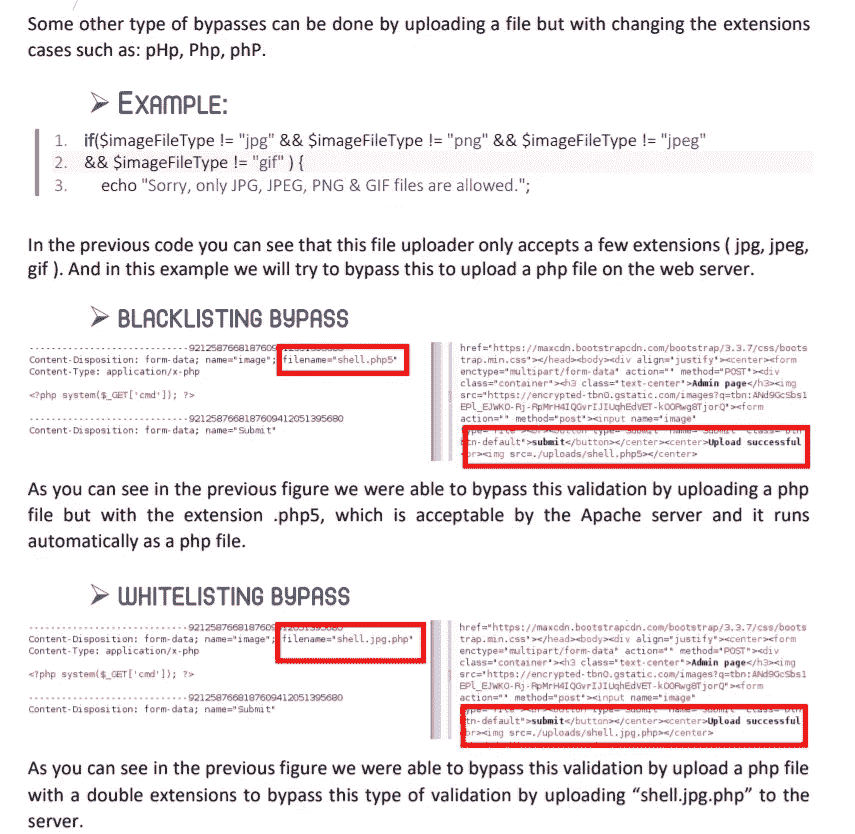

> 我们将使用命令重命名该脚本:
> mv PHP _ reverse _ shell . PHP PHP _ reverse _ shell . phtml

让我们再次尝试上传脚本。

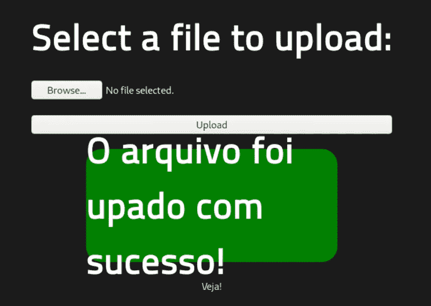

我们已经成功上传了脚本。进入下一步，我们将在 netcat 上启动一个监听器。我使用 9001 端口，并且我已经在我们上传的脚本中在我的机器的主机 IP 旁边插入了相同的端口。

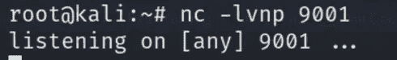

我们正在监听端口 9001。
现在我们必须通过执行< MACHINE_IP > /uploads/目录中上传的脚本来获得 shell。

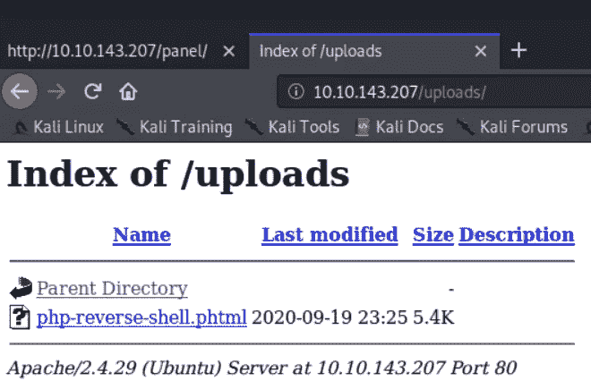

执行该脚本，然后查看您的 netcat 监听器。

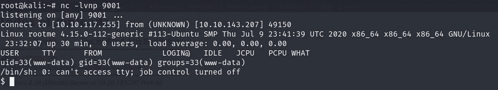

瞧啊。！
我们成功获得了 shell。
但这个壳不是一个稳定的壳。
我们如何获得稳定的外壳？让我来带路。

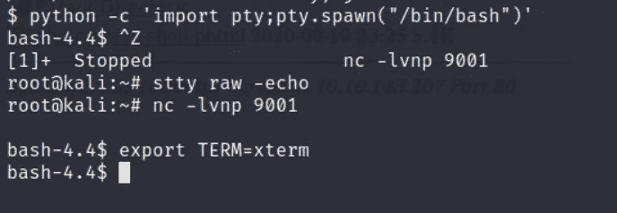

> $ python-c ' import pty；pty . spawn("/bin/bash ")'
> Ctrl+Z
> stty raw-echo
> fg
> export TERM = xterm

我们现在有一个稳定的外壳。
以上命令将让您现在通过 TAB 键自动完成，清除屏幕，在 shell 中轻松导航。

让我们寻找我们的用户标志！

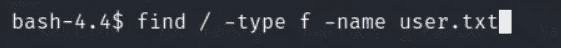

find 命令非常有用，可以很容易地找到 user.txt 文件，节省了我们手动搜索标志位置的时间。

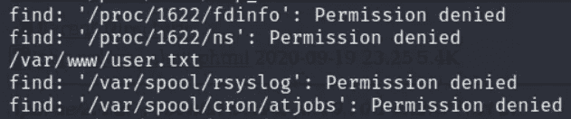

导航到/var/www/user.txt

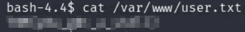

> # 3.1 user . txt
> Ans:THM { XXXXXXXXXXXX }

**任务 4-权限提升**

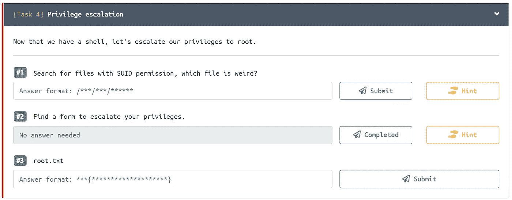

> 要查找具有 SUID 权限的文件，我们可以使用命令:
> find/-type f-user root-perm-4000 2>/dev/null

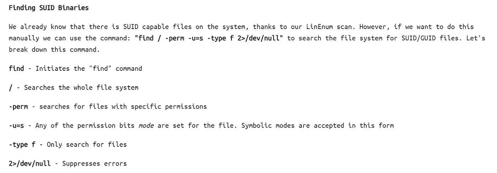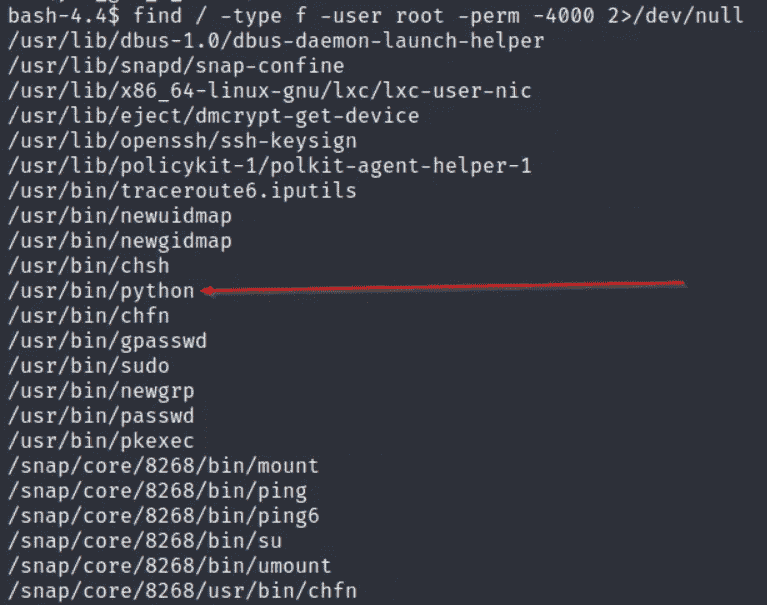

> #4.1 搜索有 SUID 权限的文件，哪个文件比较怪异？
> Ans: /usr/bin/python

我们拥有/usr/bin/python 的 SUID 权限，我们将尝试提升我们的权限。
我的第一个任务是去[https://gtfobins.github.io/](https://gtfobins.github.io/)寻找提升权限的可能的权限提升命令。
在搜索栏搜索 python。

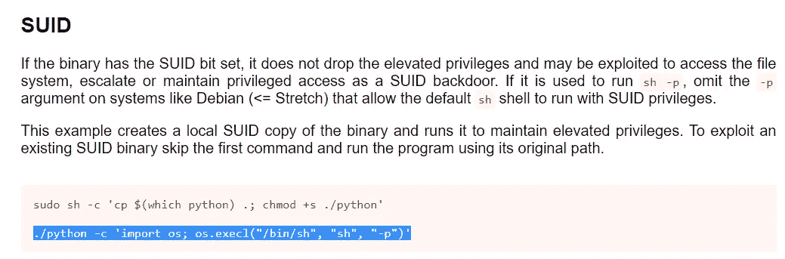

在复制命令之前，请务必阅读描述。我们可以跳过第一个命令，因为二进制文件已经获得了 SUID 权限。复制第二个命令并粘贴到 shell 中，看看是否有效。移除。/并运行它。

> python -c '导入 OS；os.execl("/bin/sh "，" sh "，" p ")'

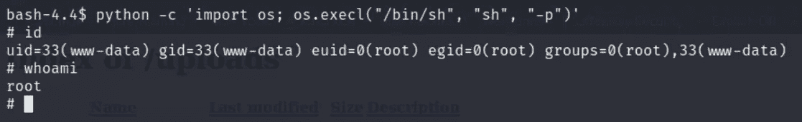

是啊！！它确实有效。
我们已经成功升级了我们的权限。
我们可以确认我们是 root。

> #4.2 找到一份表格来提升您的权限。答:不需要回答。

让我们得到我们的根旗。

导航到/root/folder 以找到您的 root.txt

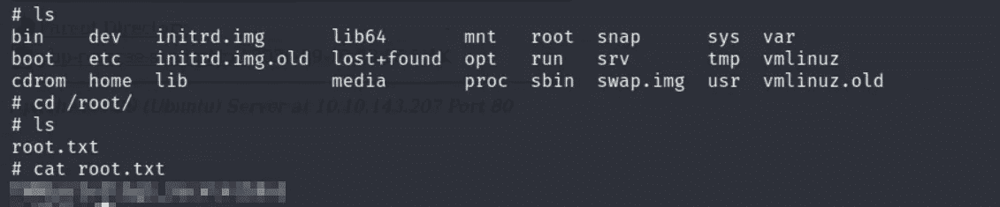

> # 4.3 root . txt
> Ans:THM { XXXXXXXXXXXX }

恭喜你！！！您已经完成了房间！！！

如果你喜欢这个帖子，并且这个帖子在任何可能的方面帮助了你，请在评论中告诉我，或者用掌声分享你的爱。这是我的第一篇中型文章，也是我第一次尝试 hackme。我真的很喜欢为那些想学习做 CTFs 的人尽可能详细地做这个。RootMe CTF 是针对初学者的，我会推荐所有初学者尝试这个盒子，并扎根它。

> *作为 10 月 PentesterLab 赠品的一部分提交*

谢谢你抽出时间。

跟着我。

更多的报道正在进行中。

保重，注意安全，继续黑！

哈桑·谢赫