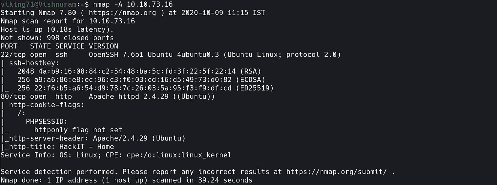
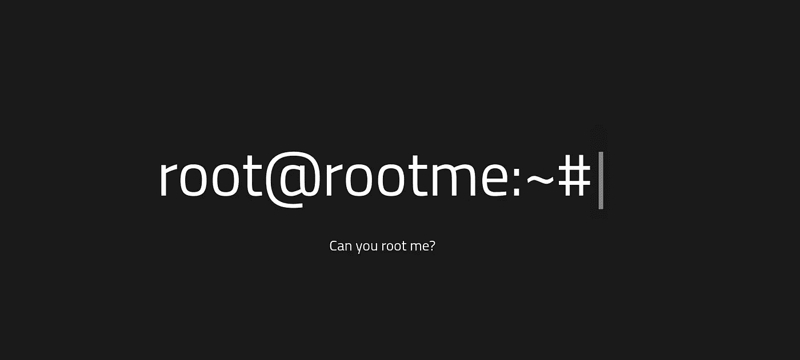
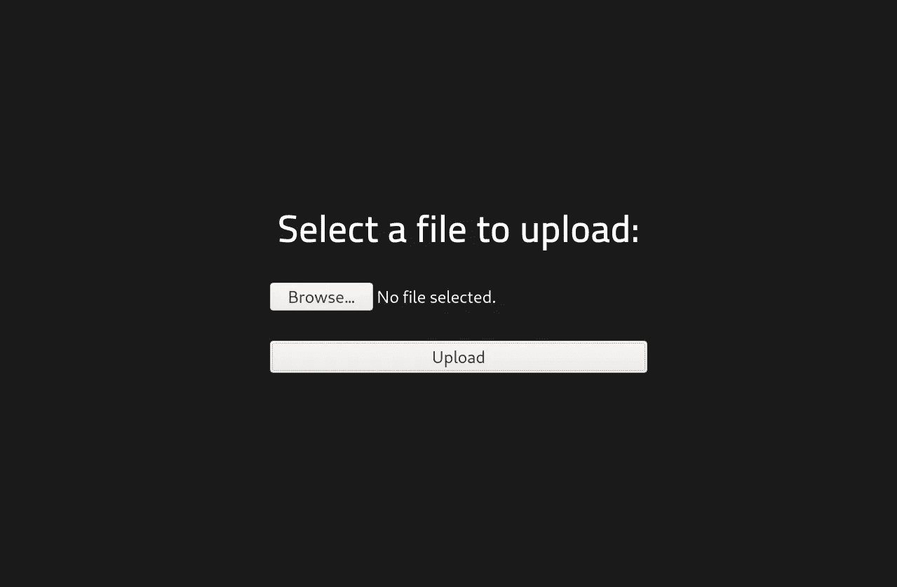
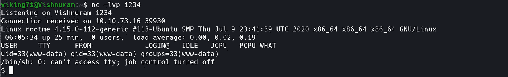
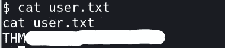
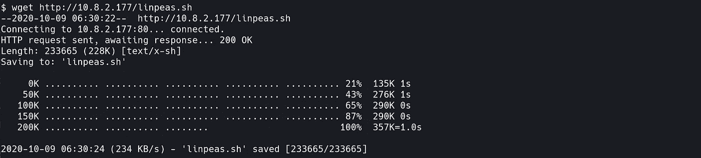
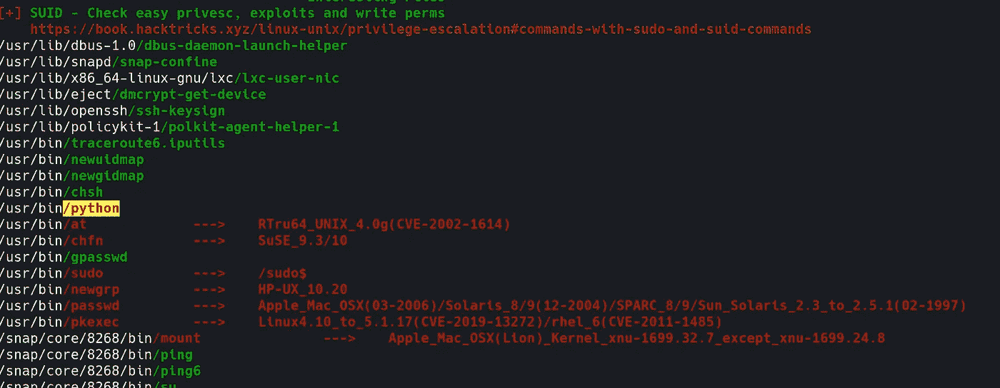
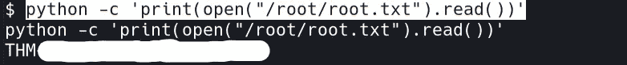

# TryHackMe: RootMe 向上写

> 原文：<https://infosecwriteups.com/tryhackme-rootme-write-up-bf87b41e8917?source=collection_archive---------0----------------------->


初级 CTF

这是一篇关于 THM 初级挑战 [RooTMe](https://tryhackme.com/room/rrootme) 的文章。没有任何延迟，让我们连接到我们的 THM OpenVPN 网络，并开始黑客攻击！！！

## **任务 1 部署机器**

部署机器，您将获得您的机器 IP 地址。您的机器至少需要 2 分钟来设置。

## **任务二侦察**

1.  使用 Nmap 扫描您的网络

```
nmap -A <machine-ip>
```



Nmap 扫描结果

2.有两个开放的端口。让我们看看 HTTP(80)端口中有什么。



3.它只是一个静态页面。让我们通过 Gobuster 工具来列举网页扩展。

```
gobuster dir -u http://<machine-ip> -w 'wordlist'
```

4.打开您找到的站点扩展。它是一个上传入口。让我们试着上传一个 PHP 反向 shell。



上传页面

## **任务 3 获取外壳**

1.我们得到了一些有趣的东西。我们试着上传一个 PHP 反向 shell。你可以在这里找到一个。

2.上传之前，将 IP 地址更改为您的系统 IP 并设置端口。此外，检查您的文件的扩展名是否是. php5，以获得 php 的新特性。

3.同时打开一个新的终端，并使用 Netcat 监听端口 1234。

```
nc -lvp 1234
```

4.我们成功地得到了我们的壳。



5.找出“user.txt”文件的路径。

```
find -name 'user.txt'
```

6.爆炸！！！我们得到了第一面旗帜。



user.txt 标志

## **任务 4 权限提升**

1.  让我们进一步升级以获得根标志。我们可以使用 [LinPEAS](https://github.com/carlospolop/privilege-escalation-awesome-scripts-suite/blob/master/linPEAS/linpeas.sh) 进行权限提升。您可以启动 python 本地服务器或 apache2，并将文件下载到机器 shell 中。



通过托管的 apache 服务器下载机器外壳中的 linpeas.sh 文件

2.使文件可执行并运行它。



LinPEAS.sh 扫描

3.通过 Python，我们可以进入根目录。

```
python -c 'print(open("/root/root.txt").read())'
```



root.txt 标志

做这个挑战很有趣。希望大家学到新东西:)。