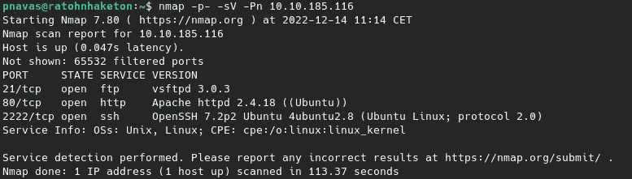
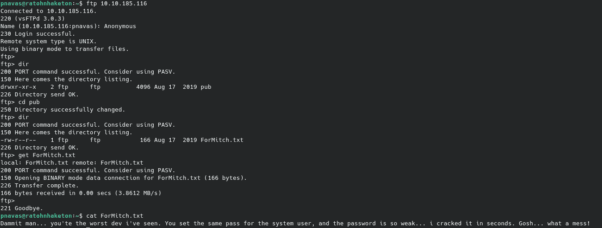
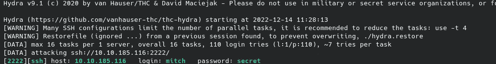
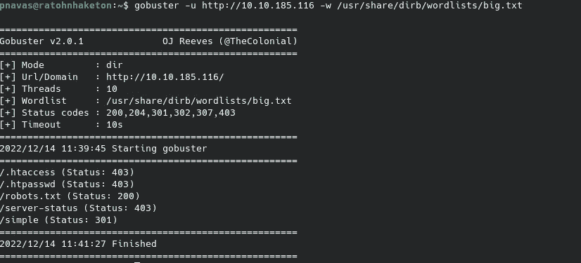
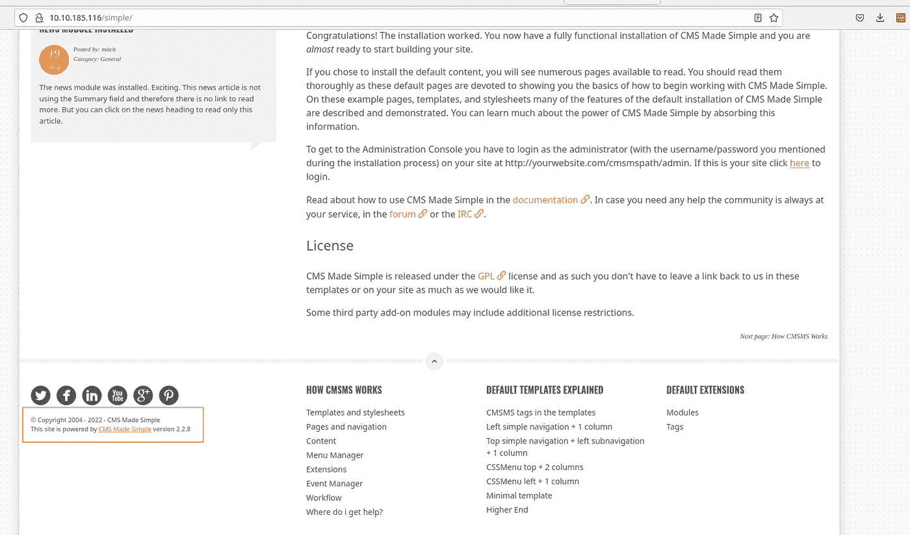
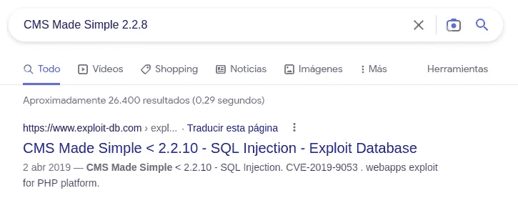
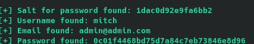
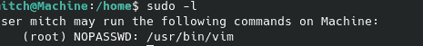
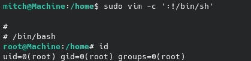

# 简单的 CTF

> 原文：<https://infosecwriteups.com/tryhackme-simple-ctf-879a19561438?source=collection_archive---------3----------------------->


简单 CTF 是来自 TryHackMe 的简单机器。在上面，我们将利用 CMS 中的 SQL 注入，并使用 vim 来提升权限(而不会陷入这种尝试)。

像往常一样，在 TryHackMe 中，我们必须连接到 VPN 或使用攻击箱。我会选择 VPN。我们按下启动机器按钮，一分钟后，他们给我们显示 IP 地址。现在，我们继续使用 Nmap 进行初始识别:

```
nmap -p- -sV -Pn $IP
```

带连字符的-p 参数表示扫描所有端口,-sV 参数表示对使用的版本进行指纹识别，而-Pn 参数表示扫描机器，即使它不响应 ping。



我们可以看到机器有三个服务打开，SSH、FTP 和一个 web 服务器。

**FTP 枚举**

我们可以看到匿名登录已启用，我们可以检索一个文件:



该文件是给 Mitch 的一条消息，内容是关于弱密码。我们可以对 SSH 服务中的用户 Mitch 进行暴力攻击吗？



**网络服务器枚举**

或者，我们可以从网上获取该密码。首先，通过模糊化我们可以找到/simple 目录。



如果我们访问它，我们将看到一个在 2.2.8 版本中简化的 CMS 显示。



一个快速的谷歌搜索将导致在这个版本的 CMS 中利用 SQL 注入的概念验证。



分析代码，我们会看到它是模块接口上 m1_idlist 参数的基于时间的 SQL 注入。最初的漏洞利用在 python 2.7 上工作。我们应该修改它，以便与 python3 一起使用。

[](https://github.com/pedrojosenavasperez/CVE-2019-9053-Python3) [## GitHub-pedrojosenavasperez/CVE-2019-9053-Python3:CVE-2019-9053 漏洞利用移植到 python 3

### 此时您不能执行该操作。您已使用另一个标签页或窗口登录。您已在另一个选项卡中注销，或者…

github.com](https://github.com/pedrojosenavasperez/CVE-2019-9053-Python3) 

**特权升级**

我们可以看到，我们可以以 root 身份运行 vim。然后，我们可以通过滥用它轻易地提升特权。



现在使用这个 gtfobins 技巧([https://gtfobins.github.io/gtfobins/vim/#sudo](https://gtfobins.github.io/gtfobins/vim/#sudo))我们可以使用 vim 提升特权，而不会有更多的问题。



**Pwned！**

我希望你喜欢我的文章，并发现我的内容有用。下一篇文章再见。

## 来自 Infosec 的报道:Infosec 每天都有很多内容，很难跟上。[加入我们的每周简讯](https://weekly.infosecwriteups.com/)以 5 篇文章、4 个线程、3 个视频、2 个 GitHub Repos 和工具以及 1 个工作提醒的形式免费获取所有最新的 Infosec 趋势！