# TryHackMe- Tartarus CTF 报道(详细)

> 原文：<https://infosecwriteups.com/tryhackme-tartarus-ctf-writeup-detailed-711fa668cbff?source=collection_archive---------1----------------------->

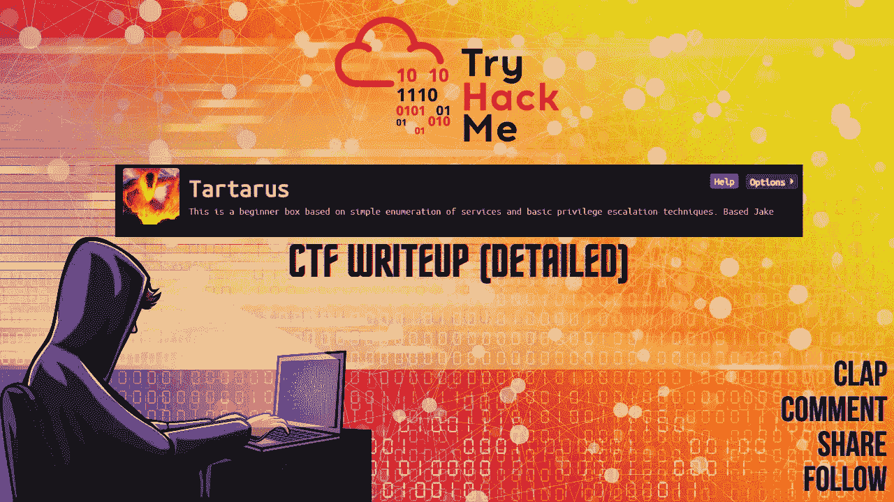

CTF 报道#4

欢迎各位！！今天我们要在 TryHackMe 上玩 CTF 地狱。

 [## 塔尔塔罗斯

### 这是一个基于简单的服务枚举和基本权限提升技术的初学者工具箱。基于杰克

tryhackme.com](https://tryhackme.com/room/tartaraus) 

部署机器。

让我们开始吧！！享受流动吧！！

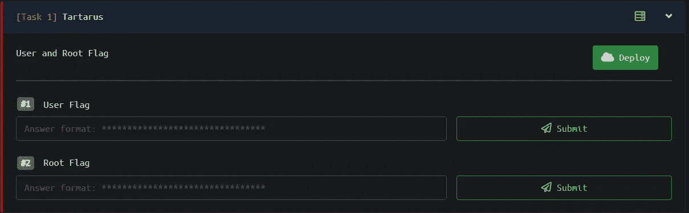

任务列表

与此同时，当你等待机器被部署时，我希望你能在桌面上快速创建一个 CTF 目录，并在 CTF 目录中创建一个 nmap 目录。

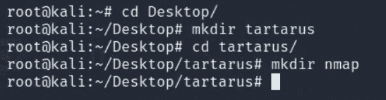

先从扫网开始吧！

## Nmap 扫描:

> nmap -sC -sV -oN nmap/tartarus<target_ip></target_ip>

*   -sC:默认脚本
*   -sV:版本检测
*   -oN:输出将存储在您之前创建的目录“nmap”中

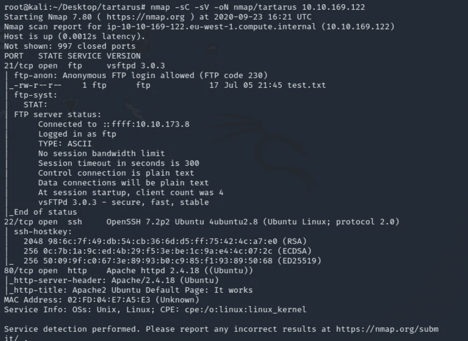

Nmap 输出

盒子上开了 3 个端口:
21/ftp- vsftpd 3.0.3 允许匿名登录
22/ssh-OpenSSH 7.2 p2
80/http-Apache/2 . 4 . 18
检测到 OS-Linux

我们不会急于进入 ftp，而是让我们导航到 http:// <target_ip>。</target_ip>

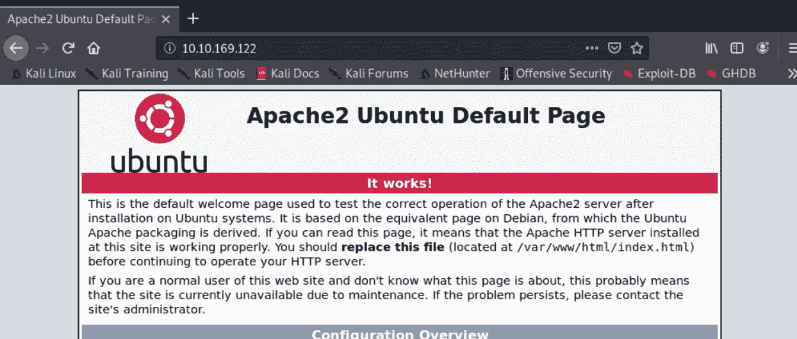

Apache 默认页面

我们可以尝试通过 gobuster 找到 URL 上隐藏的目录。

## Gobuster:

> gobuster dir -u http:// <target_ip>-w<path_to_wordlist></path_to_wordlist></target_ip>

*   -u : URL
*   -w:单词表

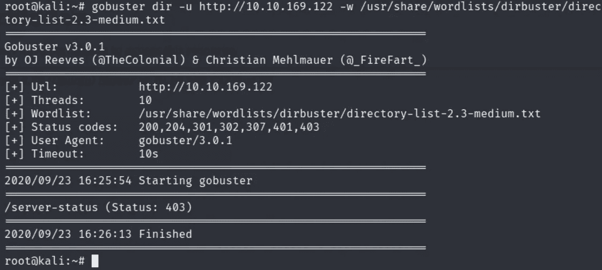

cleaGobuster 输出

您可以在 gobuster 中使用更多标志:

*   -问:安静，无声扫描。将隐藏横幅。
*   -o:要存储在目录中的输出
*   -x:搜索扩展名，如 html、txt、php、phtml 等。

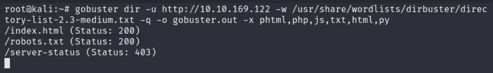

太棒了！我们有 robots.txt
我们可以去看看。

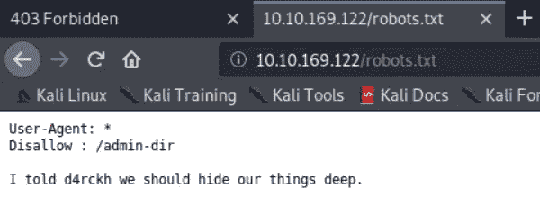

查看页面，我们注意到 down **d4rckh** 可能是一个潜在的用户名。此外，还有一个名为/admin-dir 的目录，其中可能包含对我们有用的信息。没有进一步的麻烦，导航到管理目录。

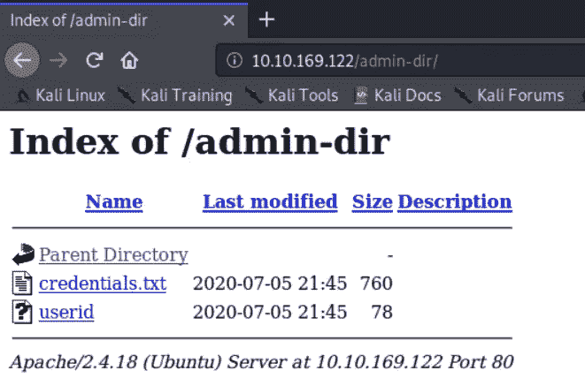

太棒了。！所以我们有两个文件，看看它们的名字，它们看起来很好吃。从第一个开始，credential.txt。

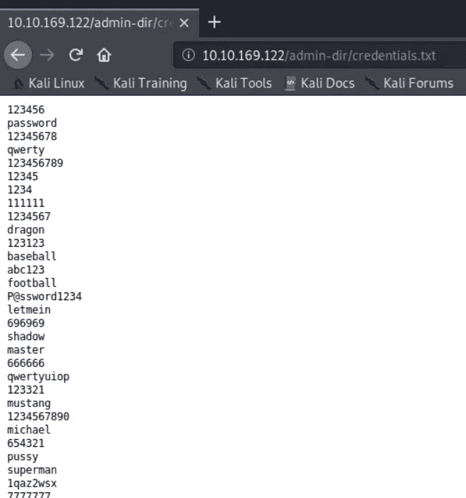

单词表

这是一个密码组合的单词表，我们可以用它来进行暴力破解。将单词表保存到你的机器上，以备后用。

我们需要检查第二个文件 userid 的内容

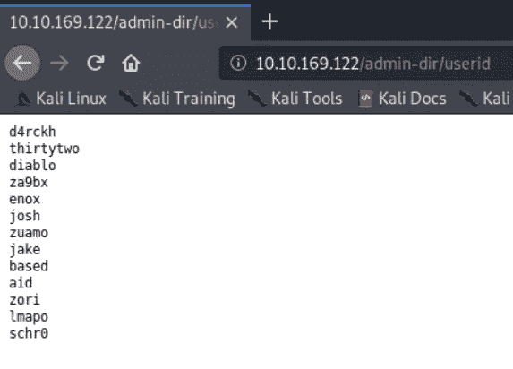

这是一个非常有用的用户名组合列表。也省省吧。

让我们开始列举 FTP 服务是开放的，并允许匿名登录。

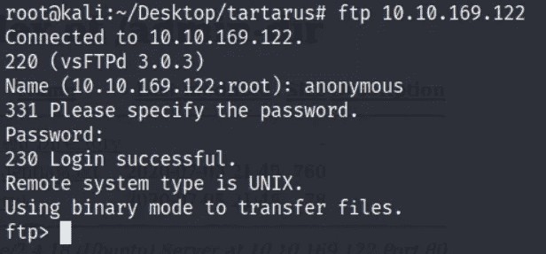

FTP 登录成功

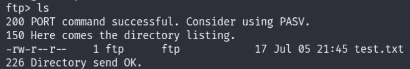

有一个文件可以让我们把它转移到我们的机器上。使用命令:
获取 test.txt

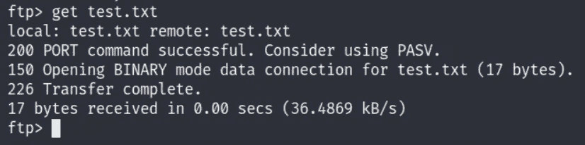

我们还能做什么？如果你看过我以前的文章，我说过在你退出 FTP 服务前总是检查任何隐藏的文件/目录是一个好习惯。让我们开始吧。

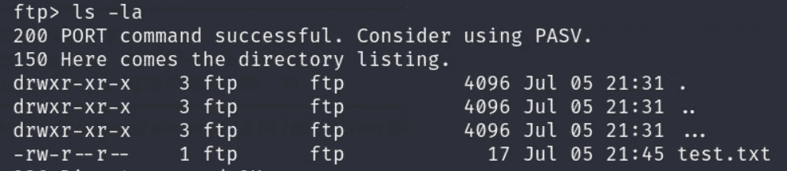

有一个目录…
cd 到那个里面，用 ls -la 看看有没有隐藏的东西。

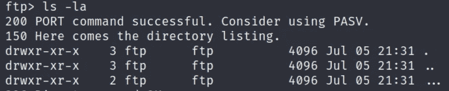

事实上，里面还有另一个目录。
cd 放进去，用 ls -la 看看有没有隐藏的东西。

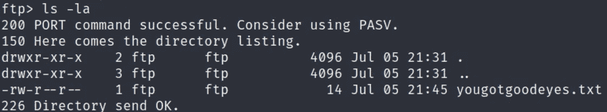

的确，我们有一双好眼睛。yougotgoodeyes.txt 文件就在那里，等待我们转移到我们的机器上。让我们转移它并退出服务。

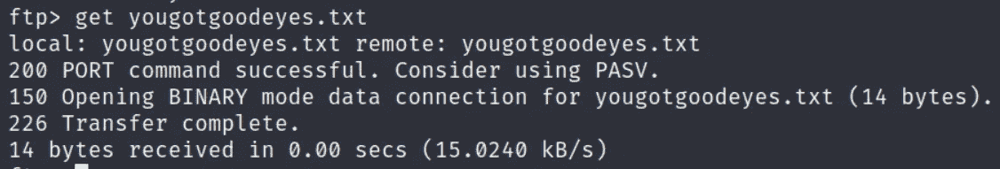

我们需要检查 test.txt 文件和 yougotgoodeyes.txt 中的内容。

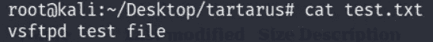

这似乎很奇怪。它不包含任何信息。它只是一个对我们毫无用处的 ASCII 文本文件。

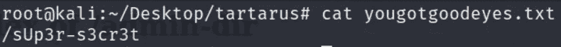

嗯..所以又发现了一个目录。我们去看看！

http:// <target_ip>/sUp3r-s3cr3t</target_ip>

干得好！！我们有一个登录页面。

怎么样，如果有隐藏的目录与此页。我们可以在这个目录中尝试 gobuster，看看有什么隐藏的或有趣的东西。

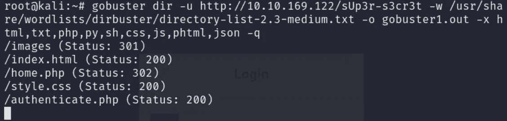

导航到/images 目录，它有一个/uploads 目录。我们将回到这一点。首先我们要想办法进去。

我们将使用两种不同的方法来进行暴力破解。从学习的角度来看，这两者都有好处。

## 方法 1:用石膏进行粗磨

我得打个嗝。如果你不知道如何设置，让我给你演示一下。

为 Firefox 安装 FoxyProxy 扩展，并为 Burp 配置代理。

Burpsuite 正在以 Burp 默认值运行。因此，我们将首先安装 CA 证书。

导航到 [http://burp](http://burp)

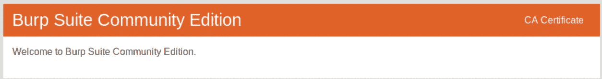

转到浏览器的首选项。

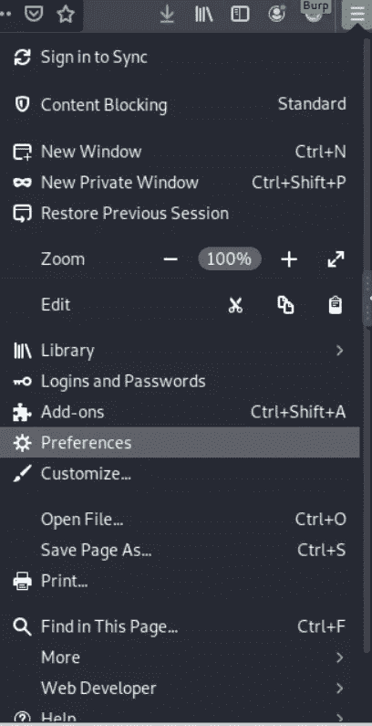

搜索证书。

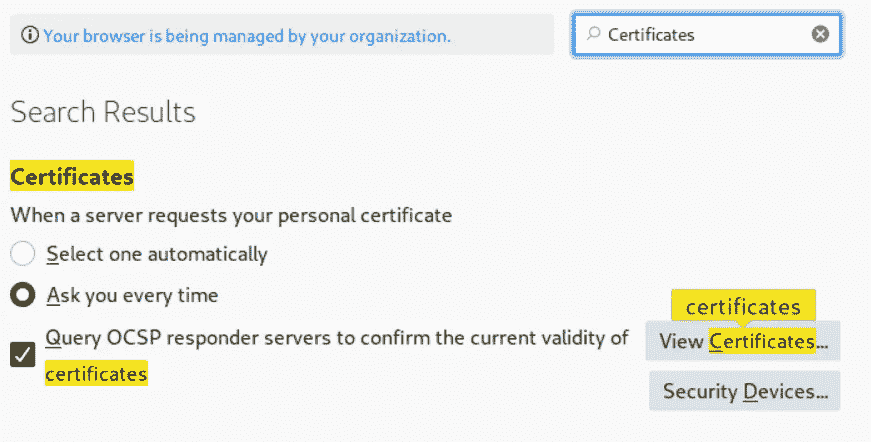

导入证书并安装它。

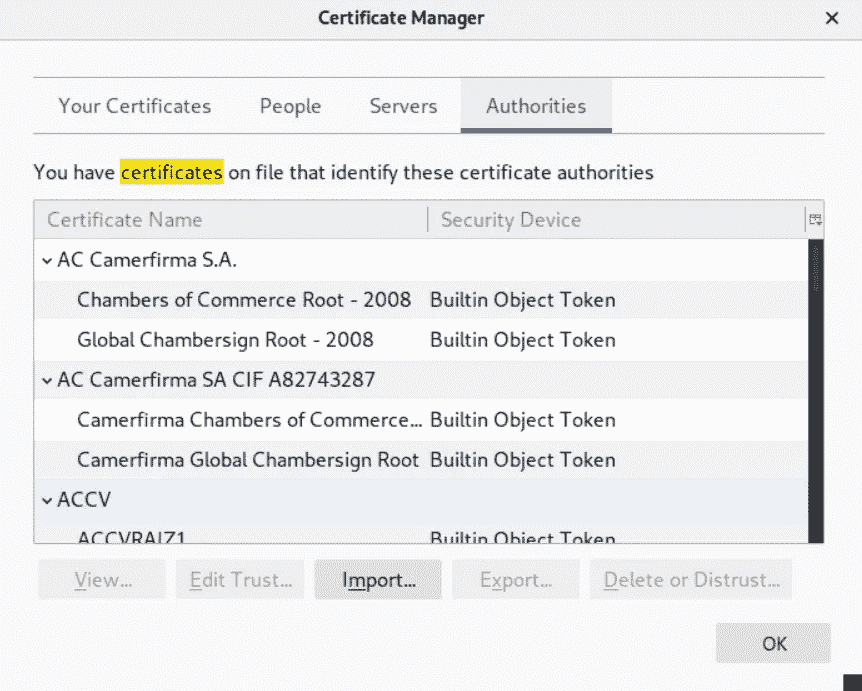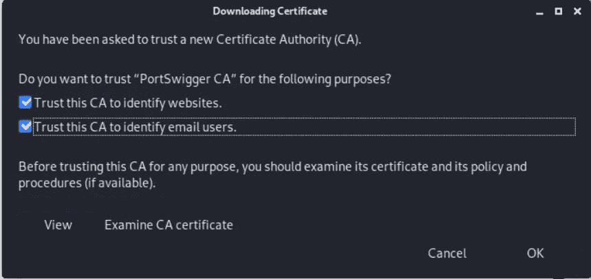

Burp 代理现在已经设置好了，为我们的浏览器配置来拦截请求。

点击，进入 BurpSuite > Proxy，打开拦截。

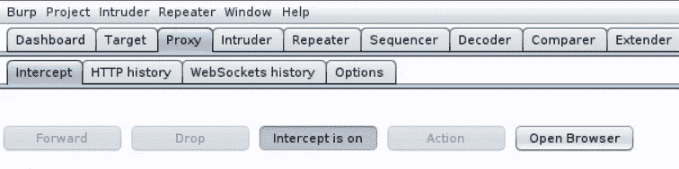

试着用 admin:admin 登录，看到拦截器弹出来给你头。

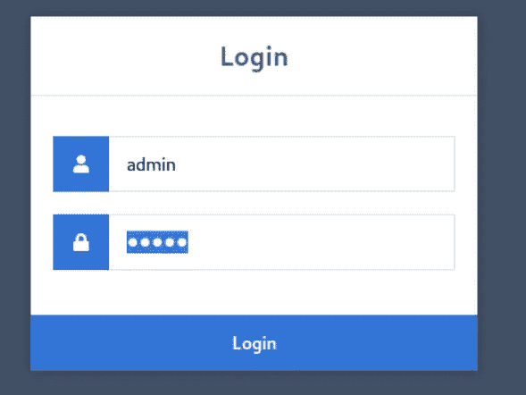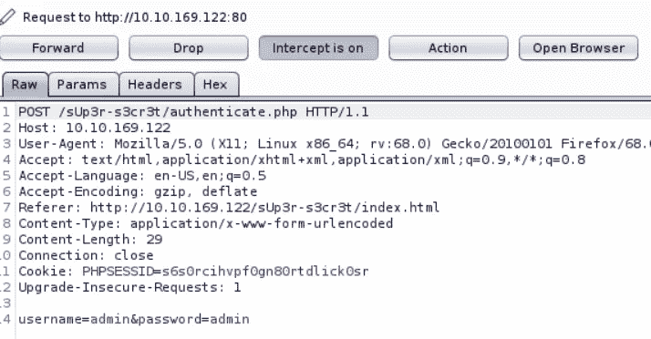

这是 POST 请求。将请求转发给 authenticate.php·佩奇。

我们可以把这个请求发送给入侵者并试图强行入侵

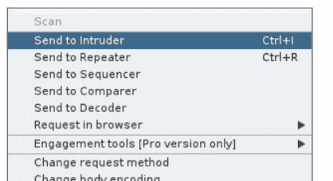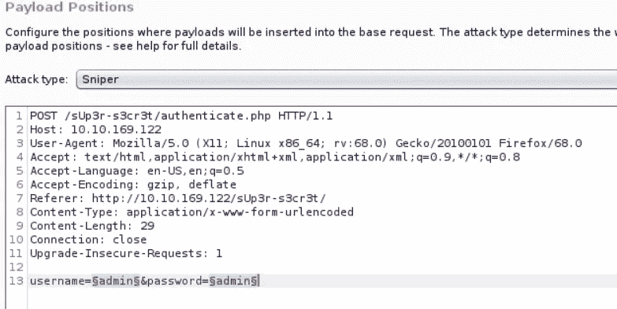

我们将选择集束炸弹作为我们的攻击类型。

我们有两个有效载荷。因此，有效负载 1 是用户名，有效负载 2 是密码。

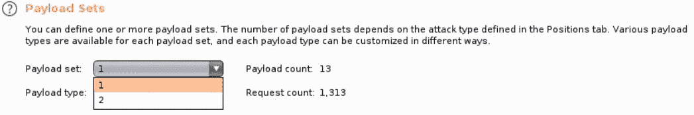

我们需要分别加载单词表。
有效负载 1 的用户标识文件
有效负载 2 的凭证. txt

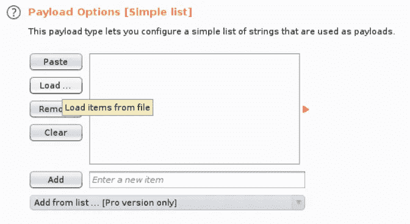

取消勾选此框。

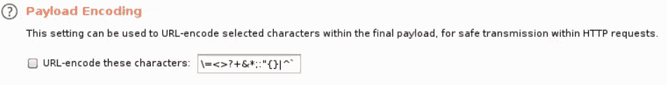

开始攻击并等待状态代码为 302 的凭证。我们迟早会得到我们的用户名和密码。

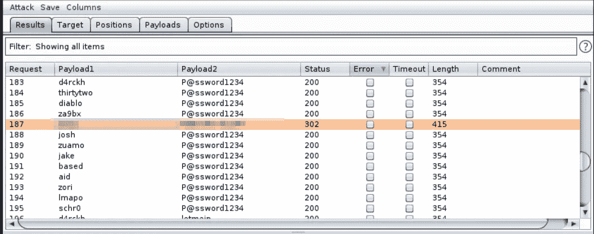

太棒了！！太棒了。！

## 方法 2:使用九头蛇进行强力攻击

或者，我们可以使用九头蛇蛮力给我们同样的结果与相当短的时间。

Hydra 是一个破解密码的神奇工具，它支持很多暴力破解服务。让我们一起旋转九头蛇。

> hydra-l userid-p credentials . txt 10 . 10 . 169 . 122 http-post-form " /sup3r-s3cr3t/authenticate.php/:username=^user^&password=^pass^&login=login:f=incorrect* "

*   -L:包含用户名列表的文件
*   -P:包含密码列表的文件

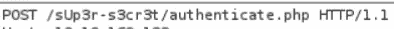

*   http-post-form:这是一个 post 请求，正如在 Burp 拦截器中看到的那样
*   "/sUp3r-s3cr 3t/authenticate . PHP/:这是凭据从登录页面转发到的页面
*   username=^USER^:用户名字段是通配符
*   password=^PASS^:密码字段是通配符
*   登录=登录:这是我们点击验证用户和密码的按钮
*   F=Incorrect*:这意味着当我们发送了不正确的凭据时，页面将会显示“不正确的用户名”行，因此我们告诉 hydra tool，如果凭据错误，您将会收到不正确的消息，因此只需绕过它并尝试下一个组合。*表示如果页面上的任何地方显示不正确，hydra 将继续强行破解。

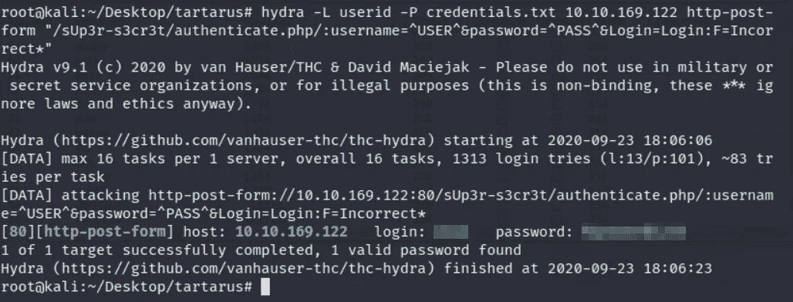

瞧啊。！我们已经成功破解了用户名和密码。因此，我们可以继续登录页面。

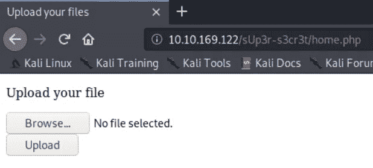

太棒了。！我们可以上传一个文件。对于这个任务，我们将上传 php 反向 shell 脚本。
我经常使用 pentest monkey php-reverse-shell.php 脚本，试图通过 netcat 获得一个反向 shell。【https://github.com/pentestmonkey/php-reverse-shell】Git 链接下载脚本或在终端克隆:[T2](https://github.com/pentestmonkey/php-reverse-shell)

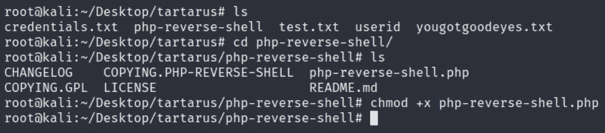

> 使用命令:
> chmod+x PHP _ reverse _ shell . PHP 使您的 php-reverse-shell 脚本可执行。
> 在编辑器中打开脚本，将$ip 和$port 更改为您想要监听的主机的 ip 和端口。

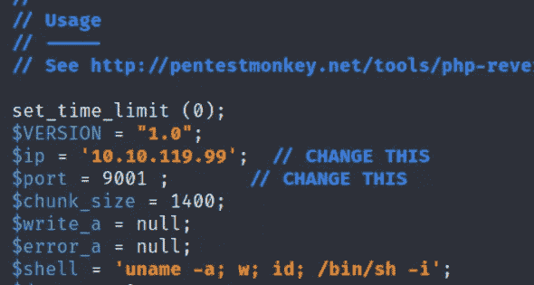

现在您已经配置了脚本。我们将进一步上传脚本。

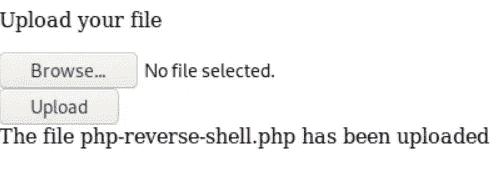

这个上传到哪里了？如果您还记得，我们之前进行了一次 gobuster 扫描，得到了一个位于 sUp3r-s3cr3t 目录中的目录。它是/images/目录，在/uploads/中包含一个子目录

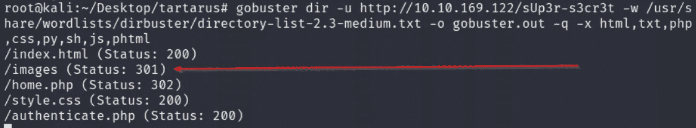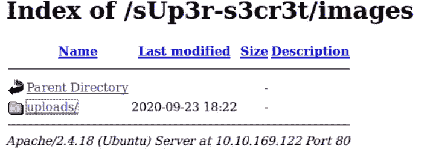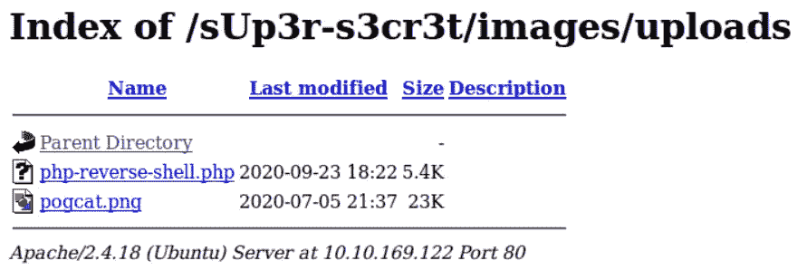

我们有我们的 php-reverse-shell.php 在这里。现在我们需要开始通过 netcat 监听端口 9001，并尝试获得一个 shell。

就这么办吧。

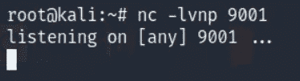

返回到/uploads/并执行脚本。

检查一下监听器。

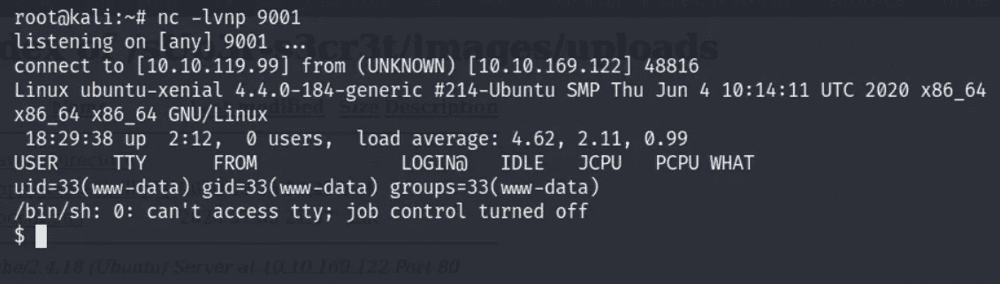

干得好！！

我们进去了。！我们已经成功获得了外壳！！
但是壳不是稳定的壳。
我们如何获得稳定的外壳？让我来带路。

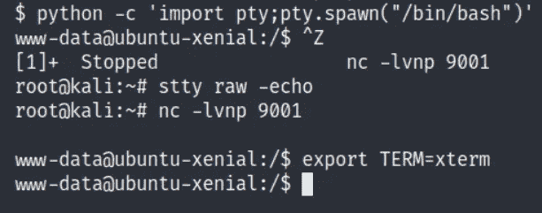

> *$ python-c ' import pty；pty . spawn("/bin/bash ")'
> Ctrl+Z
> stty raw-echo
> fg
> export TERM = xterm*

我们现在有一个稳定的外壳。
上面的命令将让你通过 TAB 键自动完成，清除屏幕，在 shell 中轻松导航。

让我们寻找我们的用户标志！

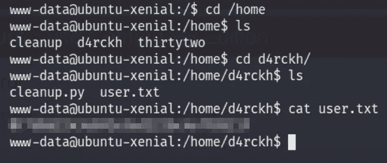

嗯。有。py 脚本在这里。继续前进…
碾碎它！！我们已经得到了我们的用户标志！！

> #1 user.txt
> 回复:xxxxxxxxxxxxxxxxxxxxxx

怎么办？你们认为这是对的。
现在我们需要尝试提升我们的特权，成为 root 用户并获得我们的 root 标志。

让我们看看有没有可以用 root 权限运行的二进制文件。

> 使用命令:
> sudo -l

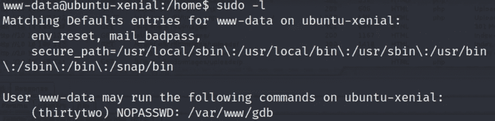

我们有可以由用户' thirtytwo '运行的/var/www/gdb，我们将尝试提升我们的权限。我的第一个任务是去 https://gtfobins.github.io/的寻找提升权限的可能的权限提升命令。

在搜索栏搜索 gdb。

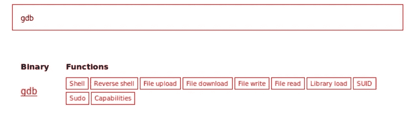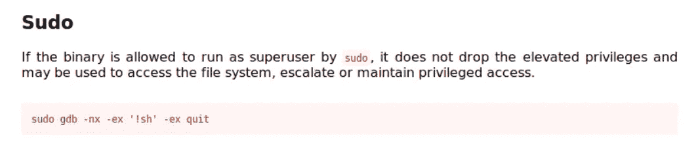

我们需要以用户名“thirtytwo”的身份登录，用上面的命令运行二进制文件。只是对命令做了一点修改。

> 使用命令:
> sudo-u thirty two/var/www/GD b-NX-ex '！sh' -ex 退出

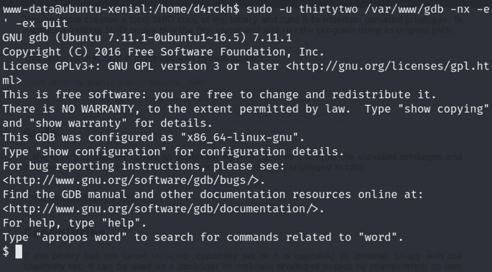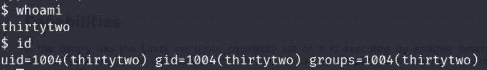

我们是用户“三十二”

让我们看看可以运行哪些二进制文件来提升权限。

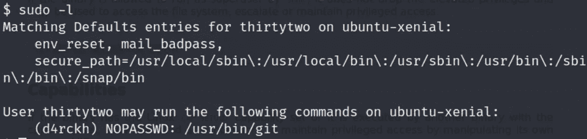

前往[https://gtfobins.github.io/](https://gtfobins.github.io/)寻找提升权限的可能权限提升命令。
在搜索栏中搜索 git。

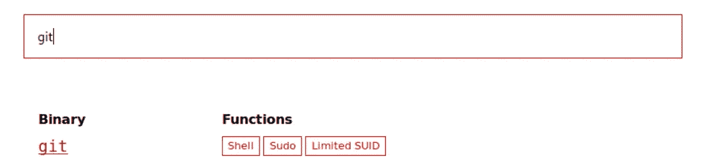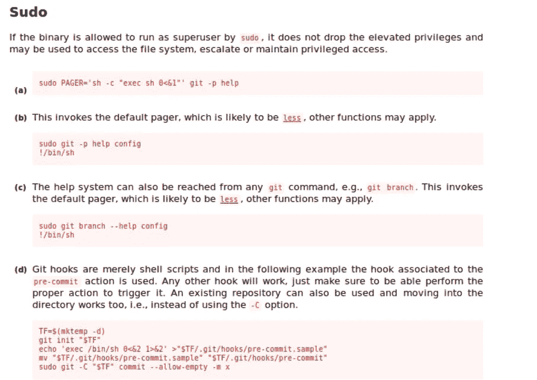

我们需要 sudo 作为用户名' d4rckh '，运行二进制/usr/bin/git 并在命令中附加帮助配置

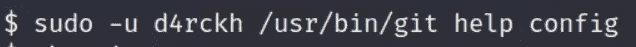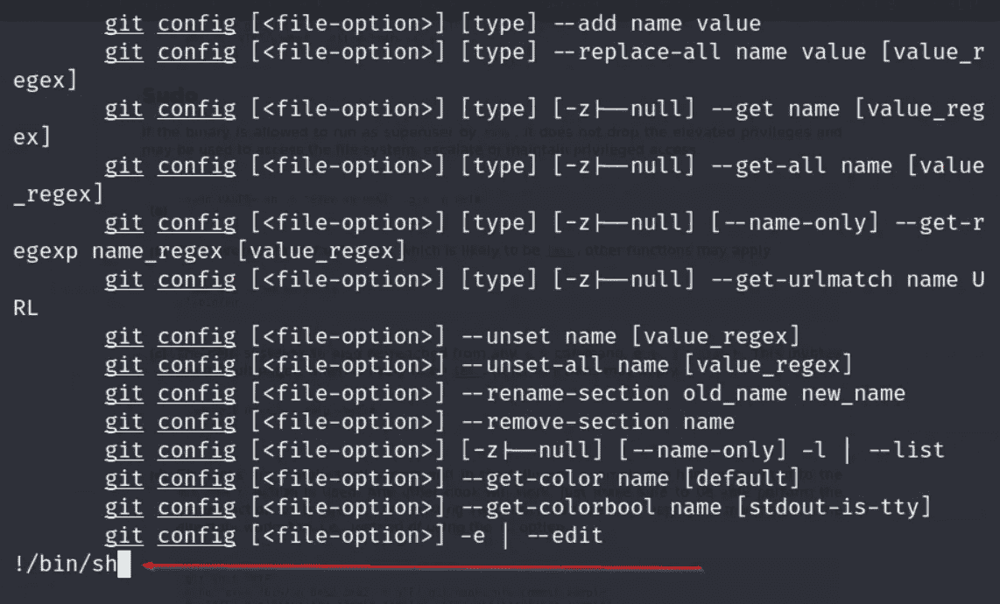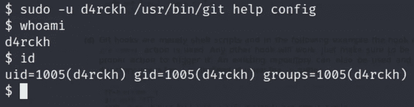

我们可以确认我们是用户 d4rckh。

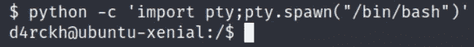

现在，我们导航回他的主文件夹，查看我们之前找到的脚本，并将其用于我们的权限提升目的。

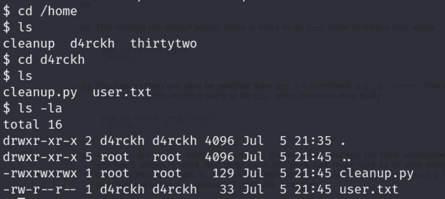

我们拥有编辑脚本 cleanup.py 的写权限。

让我们看看剧本里有什么。
少清理. py

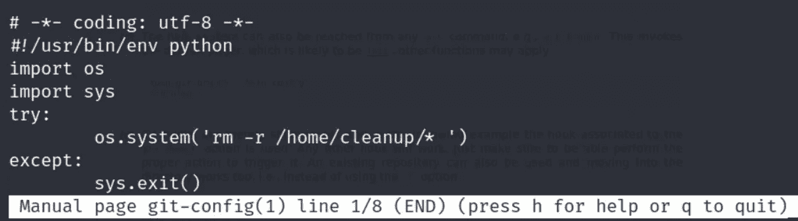

阅读此脚本会删除主目录中 cleanup 文件夹中的内容。

我们可以看到该脚本计划何时运行。在 linux 中，计划脚本由 crontab 运行。因此，我们可以“猫”入/etc/crontab

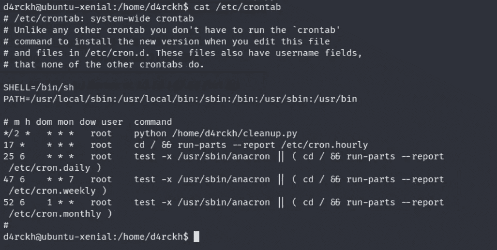

cleanup.py 脚本计划每 2 分钟运行一次。

 [## swisskyrepo/payloads all things

### Web 应用程序安全和 Pentest/CTF-swisskyrepo/payloads all things 的有用负载和旁路列表

github.com](https://github.com/swisskyrepo/PayloadsAllTheThings/blob/master/Methodology%20and%20Resources/Reverse%20Shell%20Cheatsheet.md#python) 

这一次我们将使用 python 脚本。请看下面 git 存储库中该脚本的位置。

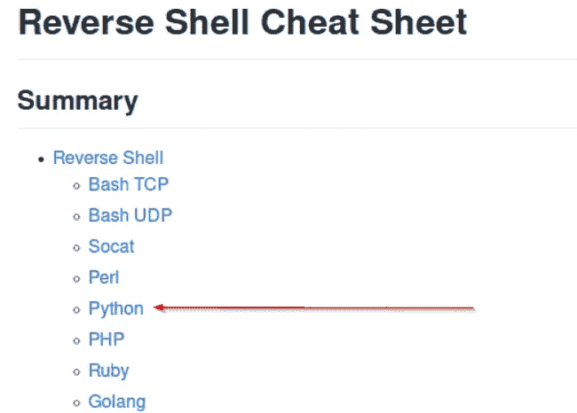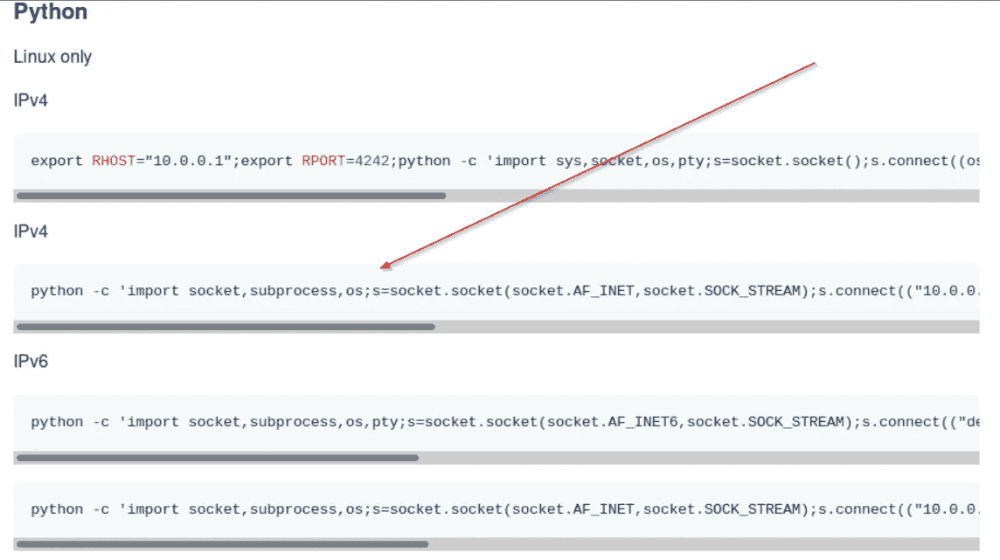

我们可以复制“cleanup.py”脚本，并将其命名为“cleanup1.py”

我们需要用 nano 来修改新的副本‘clean up . py’。

复制 Python > IPv4 下 git 存储库中提供的脚本。

该脚本是一行程序，因此，我们必须删除分隔符，并需要添加:
#！/bin/bash

指定我们的主机 IP 和我们将监听的端口。

最后，我们需要删除脚本中最后一个命令末尾的'。
进口 ptypty.spawn("/bin/bash ")'

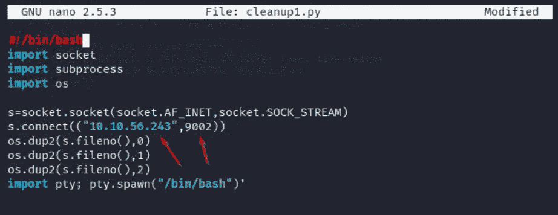

通过 netcat 启动一个端口监听器，试图获得一个反向 shell。

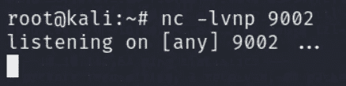

我们将删除 cleanup.py，而不是 cleanup1.py

> 使用命令:
> rm -rf cleanup.py

ls 确认我们已经删除了 cleanup.py

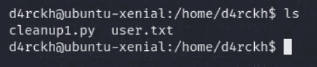

它被移除了。
我们现在使用命令将‘clean up 1 . py’重命名为‘clean up . py ’:

> mv 清理 1.py 清理. py

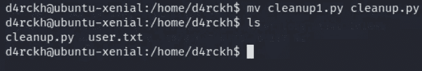

我们可以确认机器上运行的 python 版本。是 2.7.12。

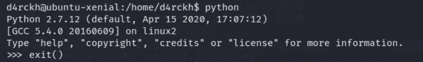

我们将使用 python 命令运行该脚本。

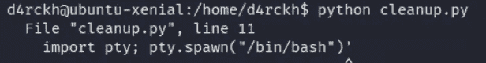

我忘记在脚本中删除“所以我将快速删除”并保存脚本。没什么大不了的。
我们可以继续再次执行脚本。

它被执行。我们检查我们的 netcat 监听器。

宏伟！！干得好！！我们已经成功提升了权限。

我们可以确认我们是根。

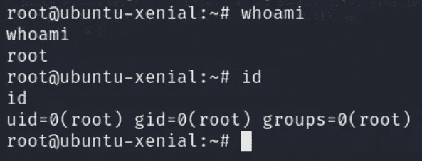

我们剩下的就是拿到我们的根旗，完成盒子。

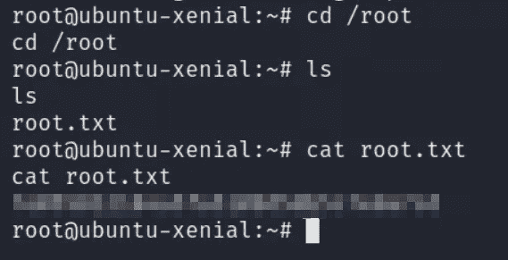

恭喜你！！我们已经完成了 CTF 房间！！

我很开心地找到了这个盒子，也为你们所有人写了一篇详细的文章。我将向早期的初学者推荐它，让他们接触这个盒子。你会学到很多东西。你可能会也可能不会掉进兔子洞，但这就是我们学习的方式。我相信在做 CTFs 的时候，兔子洞对初学者来说确实很烦人，但是有必要以艰难的方式学习。我被卡住了很多次，但这并没有阻止我更加努力。我希望你喜欢这篇文章。

如果你喜欢这篇文章或者这篇文章在任何可能的方面帮助了你，请在评论中告诉我或者用掌声分享你的爱。

> 作为 10 月 PentesterLab 赠品的一部分提交

跟着我。

谢谢你抽出时间。

保重，注意安全，继续黑！

**-哈桑·谢赫**