# TryHackMe:团队

> 原文：<https://infosecwriteups.com/tryhackme-team-a58402202a0d?source=collection_archive---------3----------------------->

走查

大家好。！这一次我们将 root Team，TryHackMe 上的 easy room。

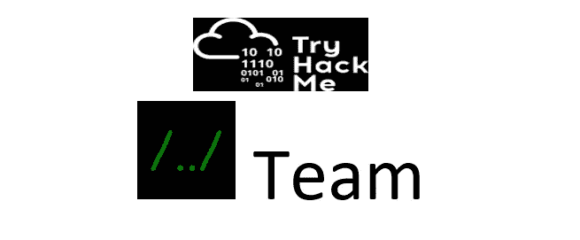

# 首字母:

```
export IP=10.10.103.174
```

## 侦察

```
nmap $IP 
```

有 3 个端口，21、22 和 80。让我们深入探究一下:

```
nmap -sC -sV -p21,22,80 -oN nmap $IP
```

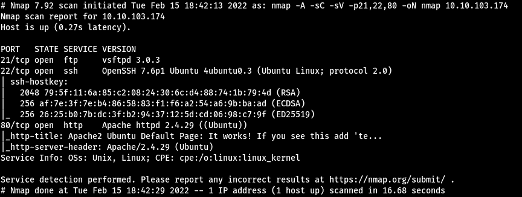

nmap

> 端口 **80** 只是 Apache web 服务器页面。但是在源代码中，我们发现:

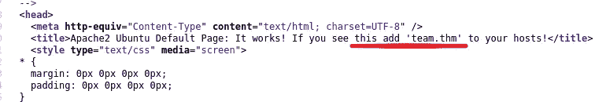

> 让我们将它添加到主机中

```
sudo vim /etc/hosts
```

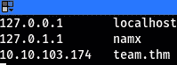

主机 _ 文件

访问网站，即 team.thm


team.thm

首先，我访问了`robots.txt`，发现只有一个词，即 dale:

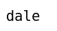

robots.txt

> 做目录枚举，我用 gobuster:

```
gobuster dir -u [http://team.thm](http://team.thm) -w medium.txt
```

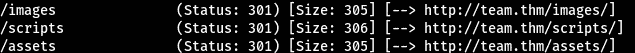

gobuster_result _1

**/scripts** 引起了我的注意。它在页面上给出拒绝的权限。之后，我做了另一个目录枚举，再次使用 **disbuster** ，我们找到了 **script.txt**

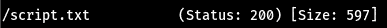

gobuster_result _2

# 文件传送协议

让我们一起去参观`[http://team.thm/scripts/script.txt](http://team.thm/scripts/script.txt)`

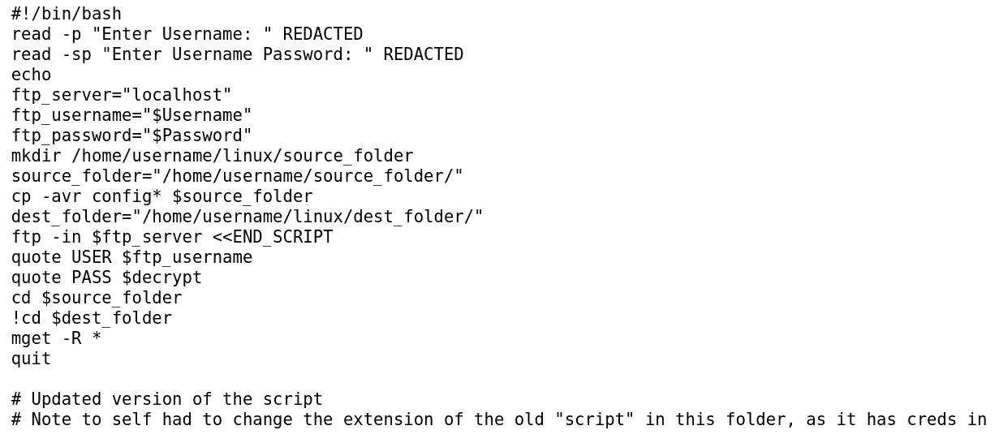

脚本. txt

似乎他们更改了文件名，因为旧文件包含凭据，但那是在同一个文件夹中。

经过一番猜测，我终于找到了旧的脚本文件，它给了我们 ftp 用户名和密码:

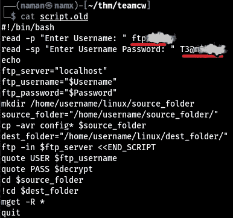

脚本.旧

以上凭据连接到 FTP 服务器:

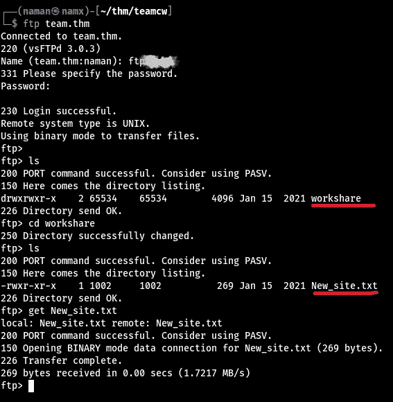

ftp 连接

# User.txt

## LFI

我们得到了 FTP 服务器上的另一个文件，它指向某个 **dev** 站点。

我很快将 dev 添加到主机的文件中

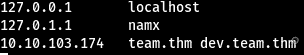

主机

并访问了`dev.team.thm`和另一个页面链接:

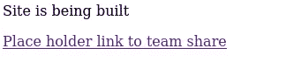

开发团队. thm

此链接重定向到另一个页面，该页面除了 url 之外没有任何特殊内容:

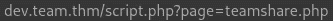

LFI 网址

*   尝试了一些 LFI 技巧→失败
*   再次尝试相同的技术，但这一次与打嗝套件运行→成功

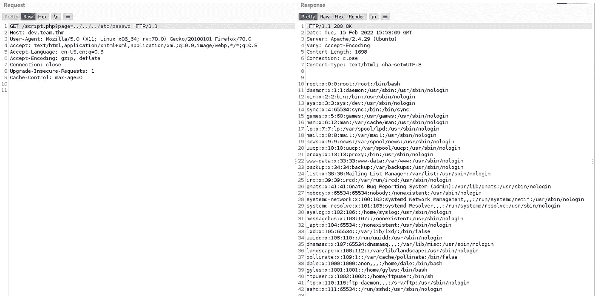

lfi

我得到了`/etc/passwd`文件。然后我想下一步该做什么，突然想起 SecLists 有一些 **lfi 单词表:**

*   向入侵者发送请求，然后开火


发送给入侵者

*   后来，当入侵者完成任务时，我们发现了 sshd 配置文件

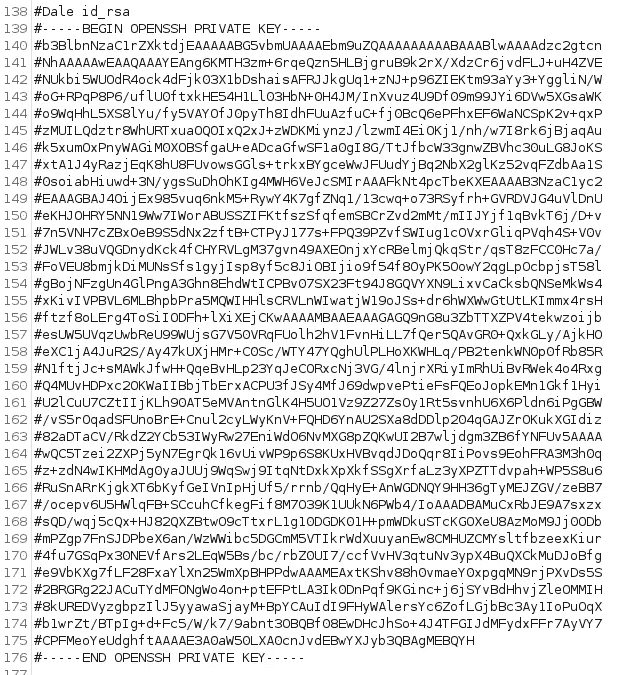

ssh id_rsa 密钥

保存文件，让我们连接到 **dale** (记得我们在 robots.txt 中找到的)

## 嘘

```
ssh -i id_rsa dale@team.thm
```

→一定要给 id_rsa 文件适当的权限，否则无法工作。

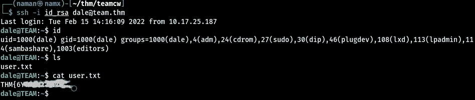

ssh 连接

得到 shell/ssh 之后，我做的第一件事就是检查`.bash_history`文件。检查相同，我们得到:

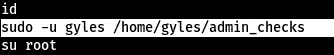

。bash _ 历史

似乎用户`dale`可以用 **sudo** 运行一些文件，检查文件内容→

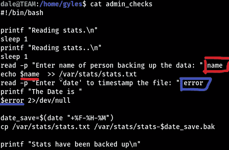

卡特彼勒管理检查

如您所见，有两个用户输入。我们可以把我们的命令注入其中任何一个。

## 利用脚本(第 1 部分)

因为红色是将输入命令重定向到另一个文件，所以我们只使用紫色。

运行我们从`.bash_history`文件中找到的命令:

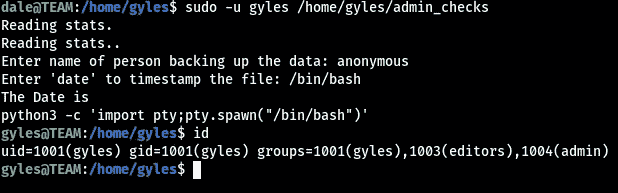

利用脚本

# 根

## 利用脚本(第 2 部分)

现在我们改变了用户。该用户属于不同的组，包括**管理员**

检查该用户的命令历史后，我们发现该用户有一个脚本:

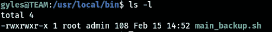

文件权限

由于`gyles`是**管理**组的成员，我们可以运行该脚本。

让我们在文件中添加反向 shell 负载，并触发 shell :D

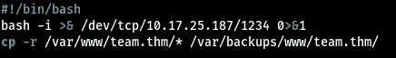

有效载荷

设置监听程序:

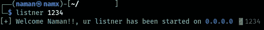

听众

这是我的自定义脚本，不要紧。你可以跑

```
nc -lnvp 1234
```

## 反向外壳

设置好监听器后，运行该文件，然后嘣！！

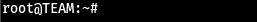

根

我们是**根**。现在是 root.txt 的时候了

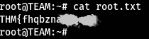

root.txt

这个房间就这些了。让我们在另一个博客上见面吧。

## 再见了。！

# 参考资料:

> || [网站](https://namx05.github.io) | [推特](http://twitter.com/namx05)|[thm room](http://tryhackme.com/room/teamcw)| LFI _[有效载荷](https://raw.githubusercontent.com/danielmiessler/SecLists/master/Fuzzing/LFI/LFI-gracefulsecurity-linux.txt) ||

# 🔈 🔈Infosec Writeups 正在组织其首次虚拟会议和网络活动。如果你对信息安全感兴趣，这是最酷的地方，有 16 个令人难以置信的演讲者和 10 多个小时充满力量的讨论会议。[查看更多详情并在此注册。](https://iwcon.live/)

[**https://iwcon.live/**](https://iwcon.live/)