# TryHackMe |团队报道

> 原文：<https://infosecwriteups.com/tryhackme-team-writeup-e8ba56dcbce9?source=collection_archive---------0----------------------->

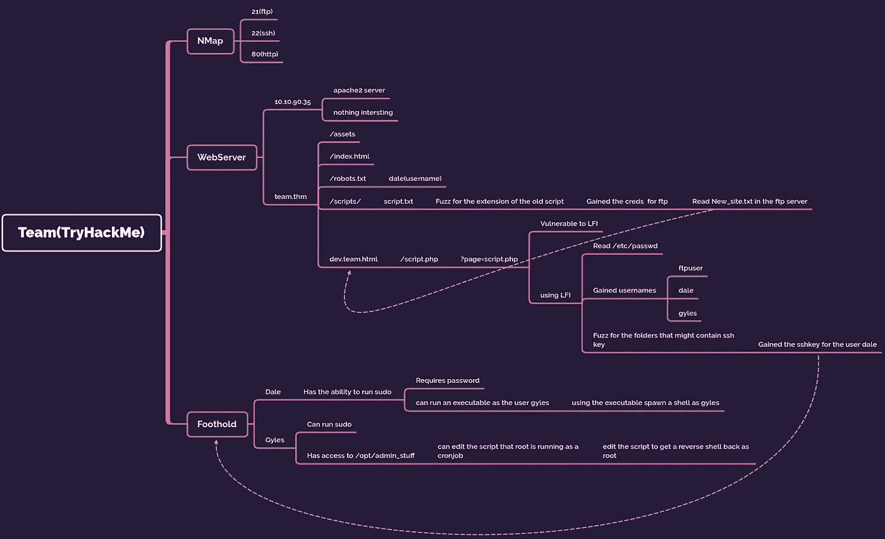

# **概述**

嘿，大家好。我带着另一篇文章回来了，这次是达莱马扎的《尝试团队》。

[](https://tryhackme.com/room/teamcw) [## TryHackMe |团队

### 初学者友好的 boot2root 机器

tryhackme.com](https://tryhackme.com/room/teamcw) [](https://tryhackme.com/p/dalemazza) [## TryHackMe | dalemazza

### TryHackMe 是一个免费的学习网络安全的在线平台，使用动手练习和实验室，通过您的…

tryhackme.com](https://tryhackme.com/p/dalemazza) 

这是一个容易评级的盒子，但在我看来应该是一个中等评级的盒子，因为在机器上获得最初的立足点需要大量的步骤。访问网站时，我们会看到一个默认的 Apache2 页面。经过一些初步的侦察，我们发现机器正在使用一个虚拟主机域，在访问第二个域时，我们模糊了运行在端口 21 上的 FTP 服务的凭证。从那里我们找到了子域的名称，在访问它时，我们看到该域上的 php 脚本容易受到 LFI 的攻击。再次使用 LFI we，fuzz 来查找用户的 ssh 密钥。登录到机器后，我们首先进行横向权限提升，以获得对机器上另一个用户的访问权。之后，我们编辑一个由 root cronjob 运行的脚本，以 root 身份获得一个反向 shell。没什么好说的了，我们开始吧。

# 我们闯进去吧！

像往常一样，从 NMap 扫描开始。

```
sudo nmap -sS -sV -sC -oA nmap/team *THM Box IP* -vv
```

> *Here -sS: SYN Scan，-sC:用于“安全”脚本，或默认脚本，-sV:用于版本枚举，-oA:所有格式的输出(Greppable、XML 和默认 NMap 输出)，-vv:用于详细。*

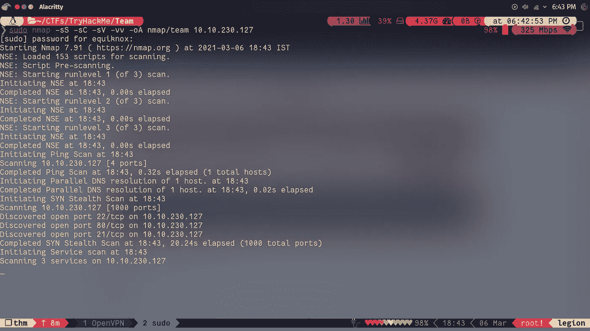

在上，运行 NMap 扫描，我们打开了 3 个端口:21(ftp)、22(ssh)和 80(http)。ftp 服务禁用了匿名登录，所以让我们访问运行在端口 80 上的 web 服务器。在访问 web 服务器时，我们会看到一个默认的 Apache 登录页面。使用 GoBuster 来寻找任何有趣的东西，我们一无所获。

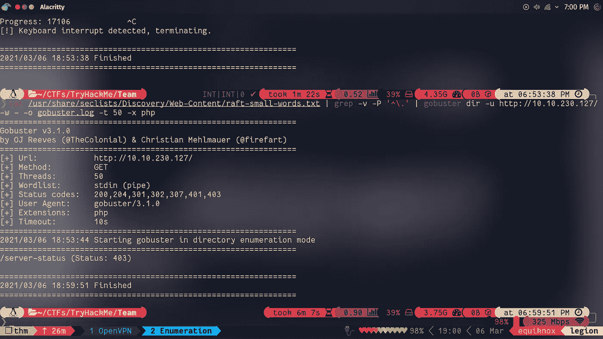

```
cat /usr/share/seclists/Discovery/Web-Content/raft-small/words.txt | grep -v -P ‘^\.’ | gobuster dir -u [http://*THM](/*THM) box IP*/ -w - -o gobuster.log -t 50 -x php
```

> 这里，dir:指定目录强制，-u 指定目标 URL，-w 指定单词列表，我使用 raft-small-words.txt。它包含在 GitHub 的 sec-lists 中，您可以在自己的发行版中克隆它，我建议您这样做，因为它们非常有用。否则你可以从 [**这里**](https://github.com/danielmiessler/SecLists/blob/master/Discovery/Web-Content/raft-small-directories.txt) 下载这个特定的单词表。-x:指定扩展名。这个开关将在每个单词后添加一个. php 来检查一个文件是否也存在。您可以指定多种文件类型，用逗号分隔。—线程:指定一次发出请求的进程数量。非常谨慎地使用这个开关，因为在现实世界中，对网站的大量请求会将你列入黑名单。既然这是虚拟环境，应该不是问题。-o:指定输出文件。

我使用 grep 删除了所有以“.”开头的行。，因为任何以它开头的东西都会给出一个 403(未授权)错误代码，它会使屏幕变得混乱。

在默认页面上一无所获之后，我尝试将 **team.thm** 域添加到我的“/etc/hosts”中，这样我的浏览器就可以将我重定向到该域。果然，服务器上又出现了一个网页。似乎服务器正在使用虚拟域名托管。

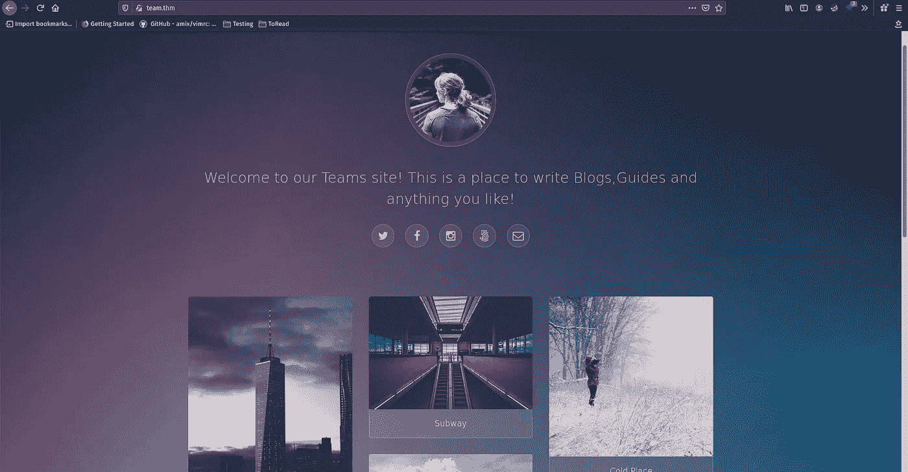

在这个域上使用 GoBuster，我们得到了多次点击，但其中只有两次看起来很有趣。访问 robots.txt，我们看到文件里只有一个字‘dale’，猜测可能是用户名，我往前移了移。访问/scripts/，我们无权查看根目录，所以让我们再次对其使用 GoBuster，看看我们是否有权查看任何文件。GoBuster 完成后，我们看到我们只被授权查看一个文件' script.txt '。

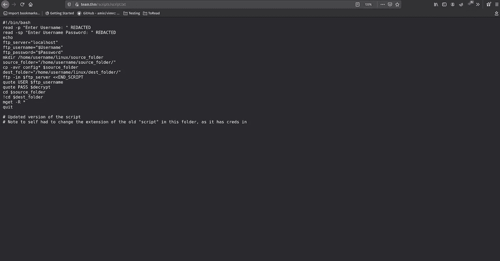

用户注意到有另一个名为 script 的文件，但是它的扩展名被更改了，因为它包含了**凭证**。因此，让我们使用 ffuf 模糊扩展。

```
ffuf -w /usr/share/seclists/Discovery/Web-content/raft-small-extension -u ‘http://team.thm/scripts/scriptFUZZ’ -fc 403,404
```

> 这里，-w:指定要使用的单词列表，-u:指定要模糊的 URL，fuzz:指定要模糊的 URL 中的位置，-fc:按 HTTP 状态代码过滤结果。

使用上面的命令，我们找到了旧脚本的扩展，以及 ftp 服务器的凭证。

进入 ftp 服务器，我们发现一个名为 New_site.txt 的文件，读取它，我们发现用户也有一个。服务器上托管的“dev”网站。在 vhost 模式下使用 GoBuster，我们为 team.thm 找到一个子域。

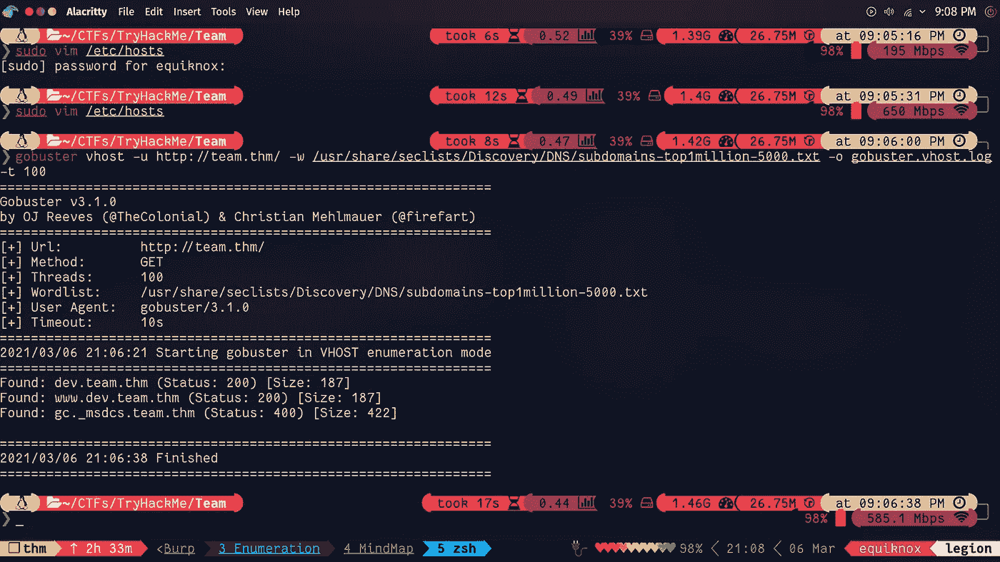

```
gobuster vhost -u [http://team.thm/](http://team.thm/) -w /usr/share/seclists/Discovery/DNS/subdomains-top1million-5000.txt -o gobuster.vhost.log -t 100
```

在将新的子域添加到我们的“/etc/hosts/”之后，让我们访问网站。在访问该网站时，很明显该网站仍在开发中。点击网站上唯一的链接，我们看到它是一个 PHP 脚本，很可能使用了 include 函数。测试变量‘page’，我们看到它容易受到 LFI 的攻击。

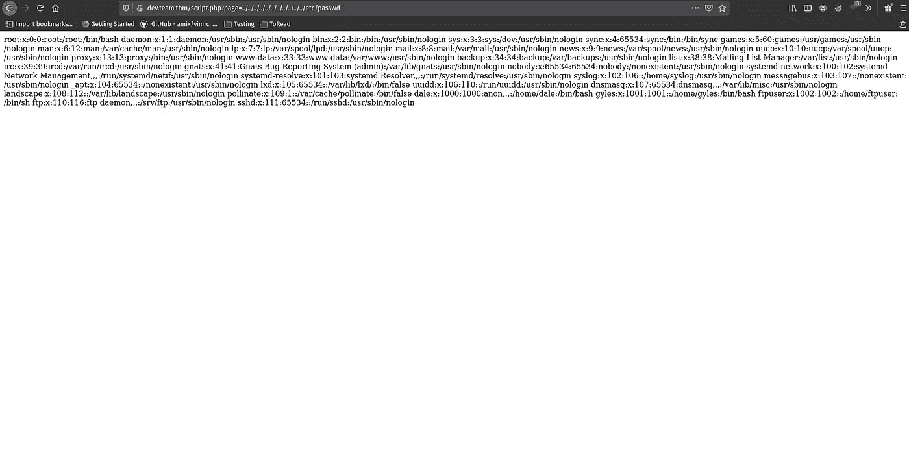

现在，这部分花了我一分钟来完成。在 New_site.txt 中提到，用户 dale 必须复制他的“id_rsa”密钥，并将其保存在配置文件中。在尝试了不同的方法将 LFI 升级到 RCE，并以惊人的失败告终后，我尝试模糊化“id_rsa”。

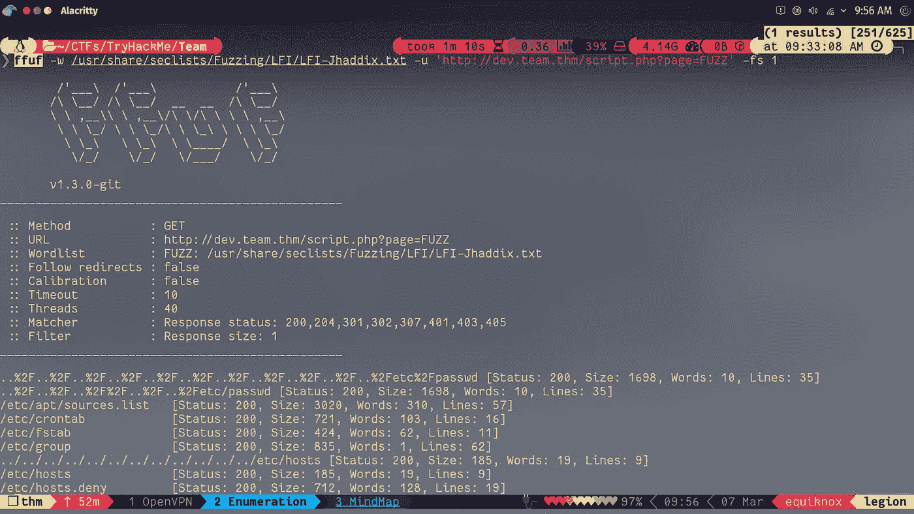

使用[的](https://github.com/danielmiessler/SecLists/blob/master/Fuzzing/LFI/LFI-Jhaddix.txt) [seclists](https://github.com/danielmiessler/SecLists) 中的词表，以及 ffuf，我最终得到了用户 dale 的‘id _ RSA’。哦！，*甜-释放*。

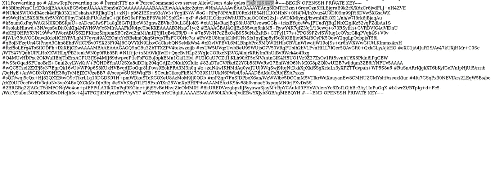

我把 ssh-key 留在这里，我知道这是违反规定的，但是伙计，如果你能输入一个完整的 ssh 密钥而不用去找它，你就是 c̶r̶a̶z̶y 的奇迹。总之，继续前进。在使用一些 Linux-foo 将密钥恢复为原始格式之后，让我们通过 ssh 进入机器。

**附言**要获得原始格式的密钥，只需将它粘贴到一个文件中。姑且称之为 a.txt，然后做`cat a.txt | sed ‘s/ #/\r\n/g’ > id_rsa`。为了简化这里发生的事情。我们使用 sed 将任何出现的' # '替换为换行符。

或者，您可以手动操作。

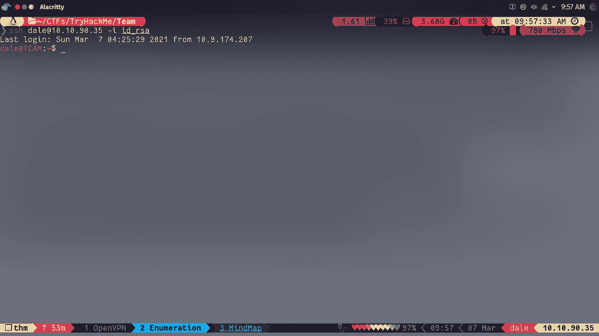

进入机器后，我们看到机器中有另一个用户“gyles”。因为 Gyles 正在指导 dale，所以可以安全地假设用户 Gyles 比我们当前的用户拥有更多的特权。在上，以用户 dale 的身份运行`sudo -l`,我们看到我们可以以用户 gyles 的身份运行脚本‘admin _ checks ’,并具有提升的权限和 NOPASSWD。在读取脚本“admin_check”时，它会询问用户名和日期，然后将“日期变量”传递给要执行的“日期命令”。这很容易被利用，只需将“/bin/bash”作为日期传递，我们就有了一个 shell。

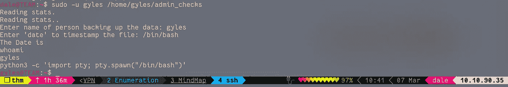

四处翻找了一番后，我什么也没找到。所以，我把 [pspy](https://github.com/DominicBreuker/pspy) 从我的机器上转移过来，寻找任何在后台运行的进程。等待一段时间后，我们看到 root 正在为“script.sh”运行一个 cronjob。在检查脚本的权限时，我们看到我们的用户能够编辑脚本。因此，让我们编辑它以在我们的机器上获得一个反向 shell。

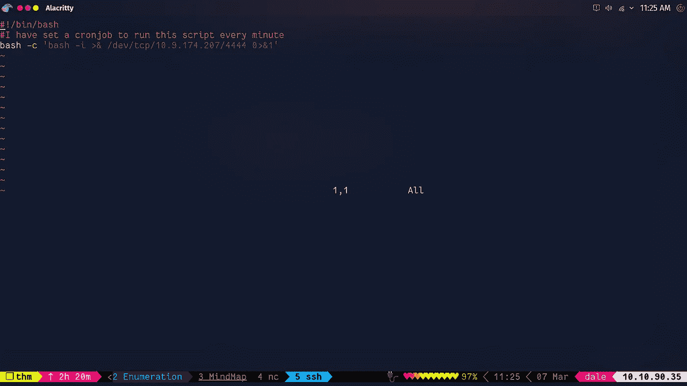

保存它，并在您的机器上启动一个监听器，监听来自机器的传入连接。等待几秒钟后，我们作为根用户在我们的机器上得到一个反向 shell。

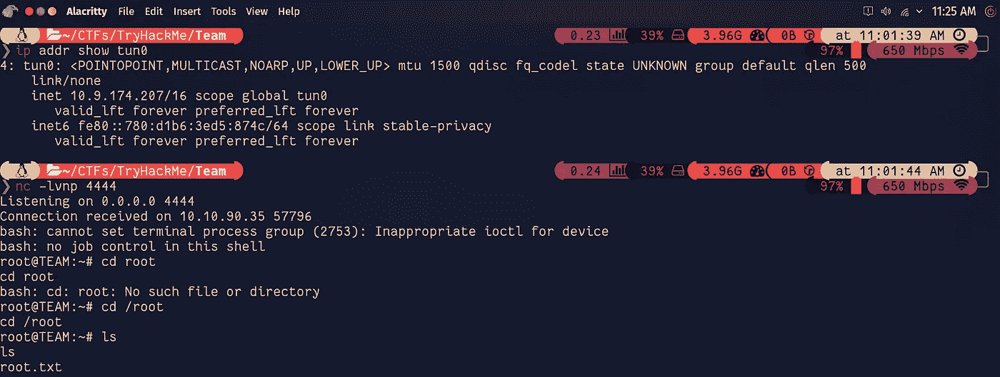

这就是那个盒子。希望你们喜欢。

如果你有任何建议，请在评论中告诉我。

祝你有美好的一天！