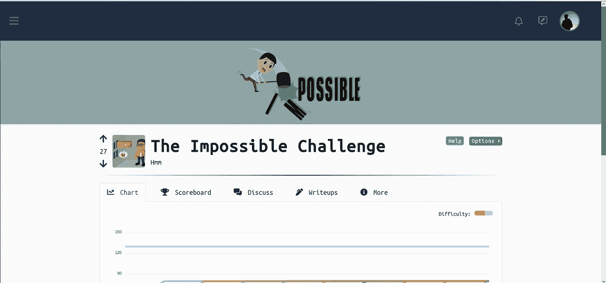
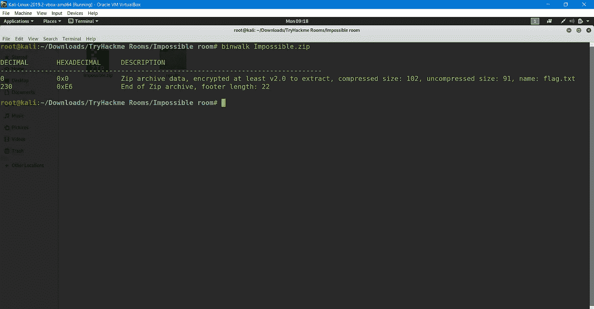
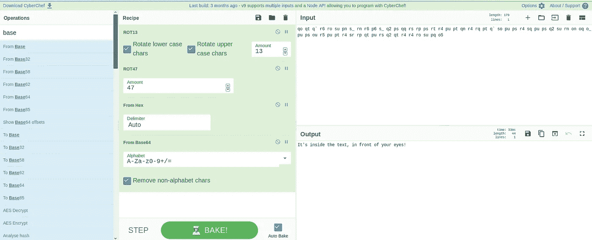
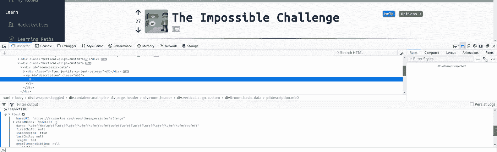
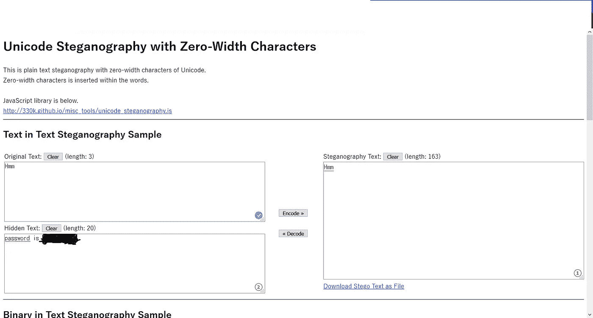
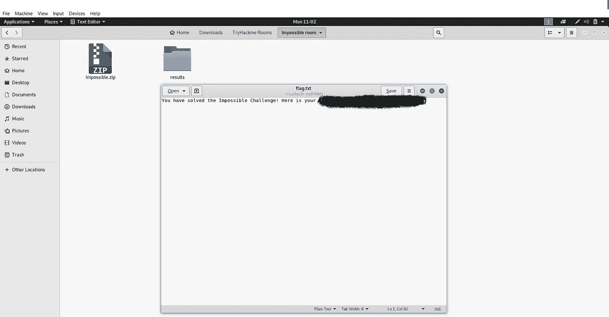

# TryHackme:不可能的挑战报道

> 原文：<https://infosecwriteups.com/tryhackme-the-impossible-challenge-write-up-45272629b461?source=collection_archive---------1----------------------->

## **使用零宽度字符的 Unicode 隐写术**

大家好！

**房间:** [不可能的挑战](https://www.tryhackme.com/room/theimpossiblechallenge)

**难度:**中等

这个名字已经表明，对我来说，基于密码学/速记学，这是一个有点艰难和耗时的挑战。所以让我们去找旗子吧…

当你进入房间，看起来一切正常，从这里开始麻烦就来了..

挑战包括一个名为 **Impossible.zip** 的受密码保护的 zip 文件。它包含一个名为 **flag.txt** 的文本文件。所以，可能我们的标志只在 flag.txt 文件中。

我决定用 JohntheRipper，fcrackzip，在线网站来破解给定 zip 文件的密码，但这只是浪费时间，什么也没出现。

我再次进入挑战页面，寻找一些提示，并注意到给定编码引导我找到了某种方法。

下载文件，并找到旗帜！

-

qo Qt q ` R6 ro su pn s _ rn R6 P6 s _ Q2 PS QQ RS RP PS rt R4 pu pt qn R4 rq pt q ` so pu PS R4 sq pu PS Q2 su rn on OQ o _ pu PS ou r5 pu pt R4 Sr RP Qt pu RS Q2 Qt R4 ro su pq o5

以上是给我们的信息，这是强编码。花了很多时间后，它终于解码了。参见下面给出的快照

消息是(就在正文里面，就在你眼前！)

这个提示没有提供任何关于旗帜的确切信息，但我的想法迫使我检查给定网页的源代码。所以我做了同样的扫描，深入浏览代码 2-3 个小时。时间和努力得到了回报，发现了一些有趣的东西。

查看快照下方的数据行

我开始在谷歌上搜索“**/**[**ufe ff**](https://www.fileformat.info/info/unicode/char/feff/index.htm)”，在这个网页上找到了相关内容。提示出现了“ **Unicode 零宽度字符**”关于这方面的更多搜索，给我介绍了一个全新的主题，叫做“ [**Unicode 零宽度字符隐写术**](https://null-byte.wonderhowto.com/how-to/use-zero-width-characters-hide-secret-messages-text-even-reveal-leaks-0198692/) ”，即文本速记。

同样，我在网上搜索在线解码，最终得到了一些有用的网站。链接[是**这里的**是](https://330k.github.io/misc_tools/unicode_steganography.html)

解码整个字符串{\ufeff‌‌hmm‌‌‌‌‍‬‌‍‌‌‌‌‍\ufeff‌\ufeff‌‌‌‌‍\ufeff‌\ufeff‌‌‌‌‍\ufeff‍\ufeff‌‌‌‌‍‬\ufeff\ufeff‌‌‌‌‍\ufeff‌‬‌‌‌‌‍‬‍‌‌‌‌‌‌‬‌‌‌‌‌‌‍‬‬‍‌‌‌‌‍\ufeff‌\ufeff‌‌‌‌‌‬‌‌‌‌‌‌‍‬‬‌‌‌‌‌‍‬‌‍‌‌‌‌‍‬‬‌‌‌‌‌‍‬‌‍‌‌‌‌‍‬‍‍‌‌‌‌‍\ufeff‬‬‌‌‌‌‍\ufeff‌‌‌‌‌‌‍\ufeff}。有价值的产出出现了

**注意** -建议您必须使用在线解码器支持的网络浏览器进行解码。我也面临一些问题，这就是原因。

前往我们的 zip 文件与密码，我们从上述过程中获得。

史酷比来了。拿到我们的旗子了。

## 结论

对我来说，这是一种全新的速记法，我学会了用积极的态度看待一切皆有可能。

保持更新，保持狩猎！