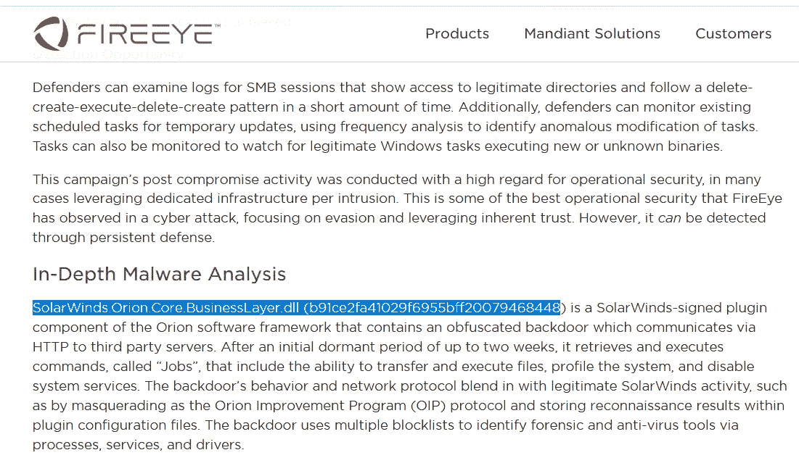
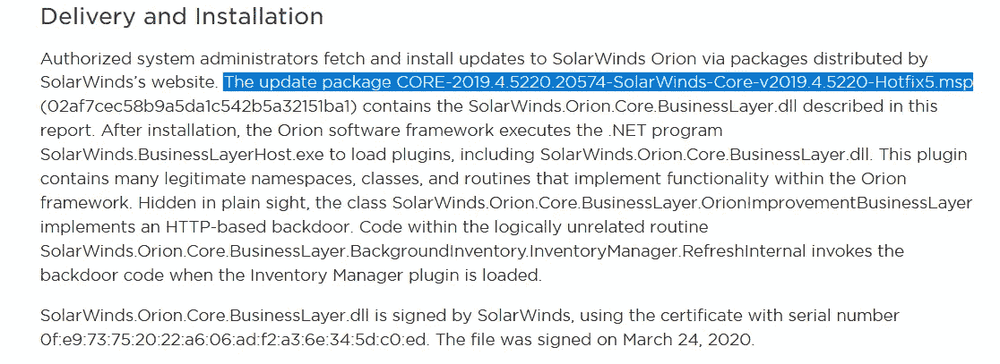
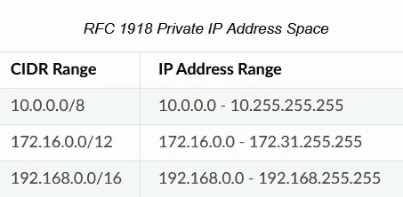

# TryHackMe:威胁情报

> 原文：<https://infosecwriteups.com/tryhackme-threat-intelligence-efa9770e8400?source=collection_archive---------1----------------------->

本实验将尝试向 SOC 分析师介绍他们将采取的步骤，以帮助缓解违规并从威胁情报报告中识别重要数据。

进入房间:[https://tryhackme.com/room/threatintelligence](https://tryhackme.com/room/threatintelligence)

> ***任务 1:了解最近一次攻击的威胁情报博文***

威胁情报:旭日东升

本实验将尝试向 SOC 分析师介绍他们将采取的步骤，以帮助缓解违规并从威胁情报报告中识别重要数据。

让我们试着定义一些我们会遇到的单词:

**红队工具:**红队工具是一套程序，攻击性安全团队将在测试项目中使用这些程序来帮助公司确定其程序、策略、框架、工具、配置和工作流中的缺陷。红色团队可能会尝试破解用户密码，接管公司基础设施，如 API、路由器、防火墙、IPS/IDS、打印机服务器、邮件服务器、活动目录服务器，基本上是他们可以获得的任何数字资源。用于学习 Sec+/Sans/OSCP/CEH 的一些常见框架和操作系统包括 Kali、Parrot 和 metasploit

**APT:**Advanced persistent Threat 是一个由民族国家资助的黑客组织，参与国际间谍和犯罪活动。不管我们知不知道，人类已经进入了第四次工业革命。机器人技术、人工智能和网络战争现在被认为是一种规范，作为一个个体，你可以做许多事情来保护自己和你的数据(Pi-Hole、OpenDNS、GPG)。

**IoT(物联网):**这是现在你可以认为是 PLC(可编程逻辑控制器)的任何电子设备。任何拥有 IPv4 或 IPv6 的个人电脑、计算机、智能设备(冰箱、门铃、照相机)都可以从公共网络访问。在许多挑战中，你可以使用 Shodan 搜索有趣的设备。物联网以我们从未想象过的方式将我们联系在一起，不断变化的技术景观发展速度超过了政策和隐私的发展速度。

**零日漏洞利用:**在系统中发现的漏洞或精心制作的漏洞利用，该漏洞利用没有已发布的软件补丁，并且没有对该特定漏洞利用的特定使用。(震网病毒)

**蓝队:**蓝队将与其组织的开发人员、运营团队、IT 运营、开发人员和网络合作，交流来自安全披露、威胁情报、博客帖子和其他资源的重要信息，以更新程序、流程和协议。许多蓝色团队在 SIEM 中活动，可以利用开源工具(ELK)或购买强大的企业解决方案(SPLUNK)。

你可以在免费的 https://tryhackme.com/room/mitre ATT & CK 米特房间找到额外的学习材料:

1.  **点击完成** 无需回答

> **任务 2:查看关于旭日恶意软件的火眼威胁情报**

给定来自 FireEye 攻击的威胁报告，无论是恶意软件样本、wireshark pcap 还是 SIEM，都可以从事件响应的角度识别重要数据。

[https://www . fire eye . com/blog/threat-research/2020/12/unauthorized-access-of-fire eye-red-team-tools . html](https://www.fireeye.com/blog/threat-research/2020/12/unauthorized-access-of-fireeye-red-team-tools.html)

[https://www . fire eye . com/blog/threat-research/2020/12/avoidable-attack-leverages-solarwinds-supply-chain-compromises-with-sunburst-back door . html](https://www.fireeye.com/blog/threat-research/2020/12/evasive-attacker-leverages-solarwinds-supply-chain-compromises-with-sunburst-backdoor.html)

阅读 FireEye 博客，并在互联网上搜索更多资源。在你熟悉攻击后继续。

1.  **点击完成** 无需回答

> **任务 3:分析威胁情报**

1.  **看完报告后，火眼给 APT 起了什么名字？** 答案:UNC2452
2.  **火眼公布了一些信息，帮助安全组织蓝队检测已经泄露的工具。你能找到哪些‘多语言’的规则？
    【Ans 格式:* * * * * | * * * | * * * | * * * * * * *】** Ans:Snort | Yara | IOC | ClamAV
3.  哪个 dll 文件被用来创建后门？
    答:网络安全管理软件产品。Orion.Core.BusinessLayer.dll

**4。这个文件的 MD5 和是什么？** 答案:b 91 ce 2 fa 41029 f 6955 BFF 20079468448

**5。授权的系统管理员通常执行最终导致恶意软件如何被传送和安装到网络中的任务。包含前面提到的 dll 文件交付的软件的文件扩展名是什么？** 答:msp

**6。一段时间后，C2 框架会向僵尸主机发出信号。这个特定的恶意软件样本是故意精心制作的，通过使用比正常时间更长的时间和更大的抖动间隔来规避常见的沙盒技术。在启动信标之前，恶意软件会在受感染的机器上隐藏多长时间？最小时间|最大时间|时间的度量单位[标志格式:* * | * * | * * * *]** Ans:12 | 14 |天

**7。您能找到基于主机和基于网络的 C2 检测的 IOC 吗？标志是前 3 个网络 IP 地址块所属的分类的名称？
T5 Ans:RFC 1918**

**8。在 snort 规则中，您可以找到大量与后门相关的消息。其中只有一个域名解析为伪装成在线大学的虚假组织。该组织的内容字段中引用的域名是什么？** Ans:digitalcollege.org(Ans 在 [GitHub 库](https://github.com/fireeye/sunburst_countermeasures/blob/main/all-snort.rules))

**9。速记被用来混淆通过网络连接到 C2 的命令和数据。如果我想更改远程机器上的注册表值，攻击者会使用哪个数字命令？** 答:14

**10。有效载荷是如何编码的？** 答案:base64

**11。分派作业的程序叫什么名字？
Ans:JobExecutionEngine**

12。使用了多少种 Mitre 攻击技术？
Ans : 17

13。根据 Solarwinds 的回应，只有一定数量的机器易受此攻击。潜在受影响的机器数量是多少？
答:18000

14。如果您是受影响机器的管理员，FireEye 建议您立即做一些事情。新的推荐补丁版本的名称是什么？
Ans : 2020.2.1 HF 1

> **任务 4:附加资源**

在获取威胁情报后，SOC 团队将使用 Yara、Suricata、Snort 和 ELK 等工具来更新漏洞。

你可以在这个试衣间了解更多:[https://tryhackme.com/room/yara](https://tryhackme.com/room/yara)

其他资源…

[FireEyeBlog 访问红队工具](https://www.fireeye.com/blog/threat-research/2020/12/unauthorized-access-of-fireeye-red-team-tools.html)[fire eyeblog Solarwinds 恶意软件分析](https://www.fireeye.com/blog/threat-research/2020/12/evasive-attacker-leverages-solarwinds-supply-chain-compromises-with-sunburst-backdoor.html)[太阳风咨询](https://www.solarwinds.com/securityadvisory)[Sans](https://www.sans.org/webcasts/emergency-webcast-about-solarwinds-supply-chain-attack-118015)SOC 规则更新为 IOC

1.  [https://github.com/fireeye/red_team_tool_countermeasures](https://github.com/fireeye/red_team_tool_countermeasures)
2.  [https://github.com/fireeye/sunburst_countermeasures](https://github.com/fireeye/sunburst_countermeasures)
3.  [https://github . com/fire eye/sun burst _ counters/blob/64266 C2 C5 bbbe 4 cc 8452 bde 245 ed 2c 6 BD 94792/all-snort . rules](https://github.com/fireeye/sunburst_countermeasures/blob/64266c2c2c5bbbe4cc8452bde245ed2c6bd94792/all-snort.rules)

[Gov 安全揭秘](https://www.sec.gov/ix?doc=/Archives/edgar/data/1739942/000162828020017451/swi-20201214.htm)[微软博客](https://msrc-blog.microsoft.com/2020/12/13/customer-guidance-on-recent-nation-state-cyber-attacks/)[连线](https://www.wired.com/story/russia-solarwinds-supply-chain-hack-commerce-treasury/)[TrustedSec](https://www.trustedsec.com/blog/solarwinds-orion-and-unc2452-summary-and-recommendations/)[Splunk SIEM](https://www.splunk.com/en_us/blog/security/sunburst-backdoor-detections-in-splunk.html)[BHIS 每周安全谈话](https://www.youtube.com/watch?v=QZOW0itnyLU&t=1710s)[https://www . fedscoop . com/solarwinds-federal](https://www.fedscoop.com/solarwinds-federal-footprint-nightmare/)

**感谢阅读……*😊😊***