# TryHackMe- ToolsRus CTF 报道(详细)

> 原文：<https://infosecwriteups.com/tryhackme-toolsrus-ctf-writeup-detailed-a995fd0a6293?source=collection_archive---------0----------------------->

CTF 报道#16

欢迎各位！！我们将在由[迪蒙](https://twitter.com/User6825)创作的 [TryHackMe](https://medium.com/u/dc49a0a3cb16?source=post_page-----a995fd0a6293--------------------------------) 上做《工具 CTF》。

 [## 黑客培训

### TryHackMe 是一个学习和教授网络安全的在线平台，全部通过您的浏览器完成。

tryhackme.com](https://tryhackme.com/room/toolsrus) 

在桌面上为您的 CTF 计算机创建一个目录，并在 CTF 目录中为 Nmap 创建一个目录。

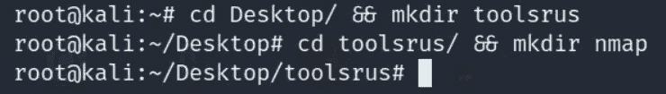

让我们开始吧！！享受流动吧！！

## 任务 1-玩具反斗城:

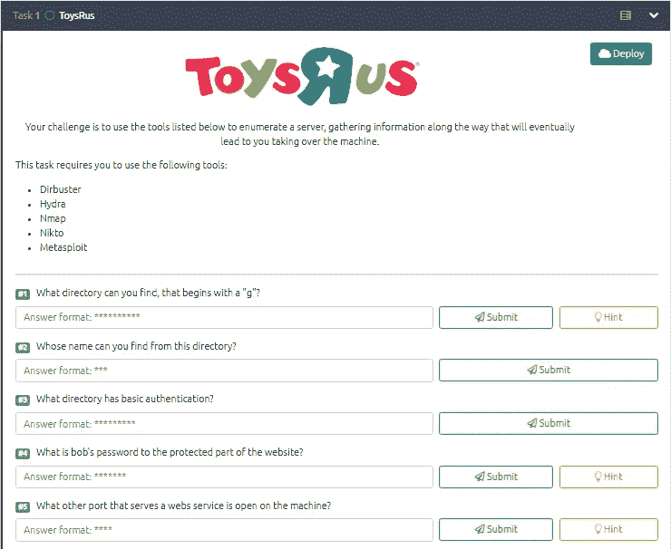

任务列表 1–5

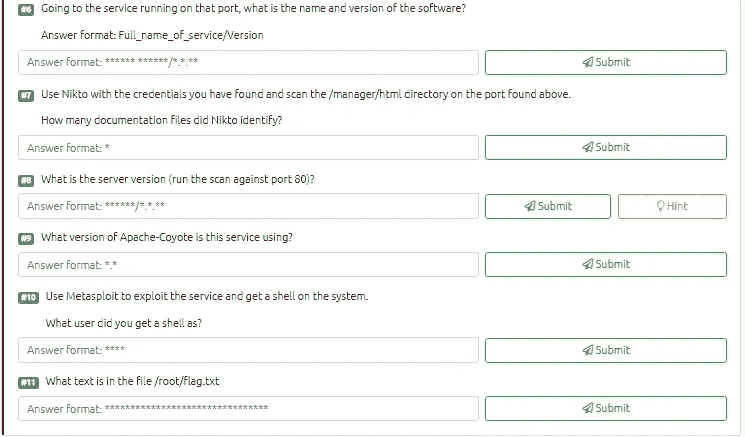

任务列表 5–11

## Nmap 扫描:

> *nmap-sC-sV-p--在 nmap/toolsrus 上< TARGET_IP >*
> 
> -sC:默认脚本
> -sV:版本检测
> -oN:输出将存储在您之前创建的“nmap”目录中
> -p-:要扫描的所有端口

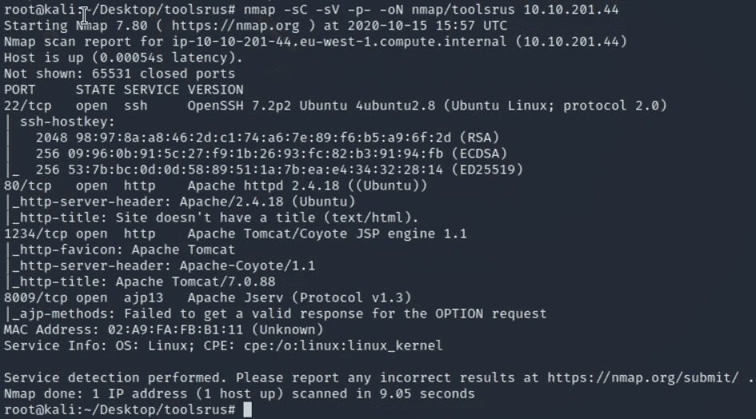

有 4 个端口打开:
22/ssh-OpenSSH 7.2 p2
80/http-Apache httpd 2 . 4 . 18
1234/http-Apach Tomcat/Coyote JSP engine 1.1
8009/ajp 13-Apache Jserv v 1.3

**Gobuster :**

> *gobuster dir-u http://<TARGET _ IP>-w<PATH _ TO _ word list>-o<OUTPUT _ FILE _ NAME>-x<扩展>*
> 
> -u:URL
> -w:word list
> -q:quiet，静默扫描。将隐藏横幅。
> -o:输出将存储在目录
> -x:搜索扩展名，如 html、txt、php、phtml 等。

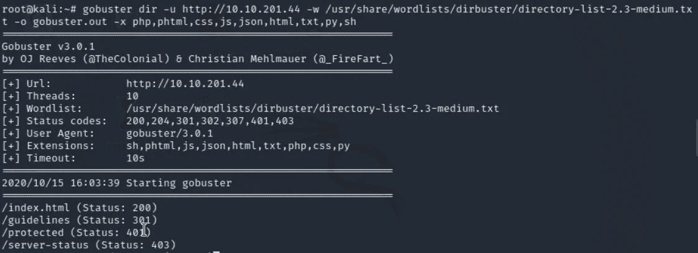

我们发现了两个有趣的目录，其中一个带有“g”的目录回答了任务的问题。我们会检查的。

> #1.你能找到以“g”开头的目录吗？答案:指导方针

导航到 http://<target_ip></target_ip>

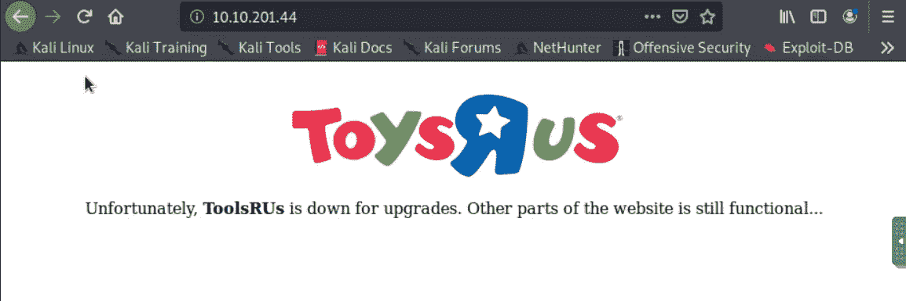

检查页面的源代码是否有隐藏的注释总是好的。查看 URL 页的源代码。

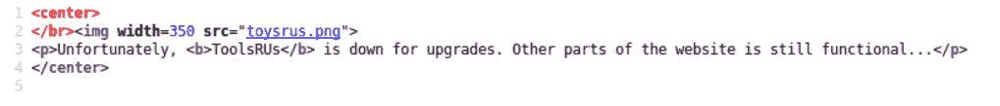

没有隐藏或注释。继续前进…

导航到 http:// <target_ip>/guidelines</target_ip>

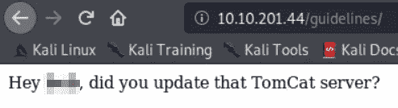

我们很容易就得到用户名和任务的答案。

> #2.你能从这个目录中找到谁的名字？
> 答:XXX

导航到 http:// <target_ip>/protected</target_ip>

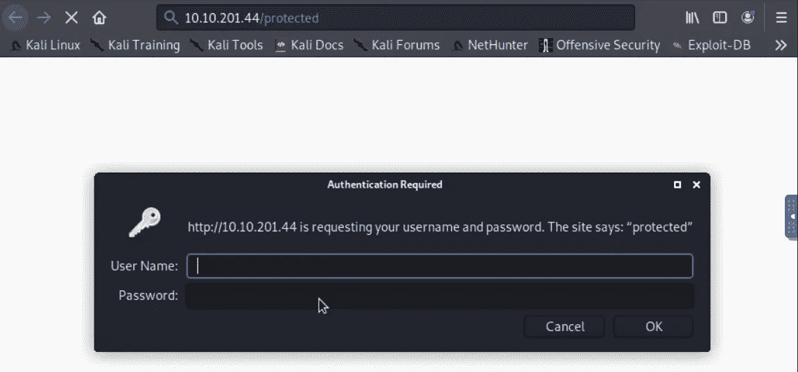

> #3.什么目录有基本认证？
> 答:受保护

有一个登录提示，我们需要暴力破解凭据，因此我们将使用九头蛇，它会像一个迷人的工作。Hydra 是一个破解密码的神奇工具，它支持很多暴力破解服务。让我们把它旋转起来。

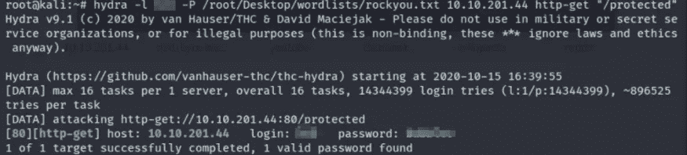

太棒了！！我们获得了凭据，现在我们可以登录到/protected 目录。

提交任务的答案。

> #4.bob 的网站受保护部分的密码是什么？答案:XXXXXXX

再次导航到 http:// <target_ip>/protected
插入凭据并单击确定。</target_ip>

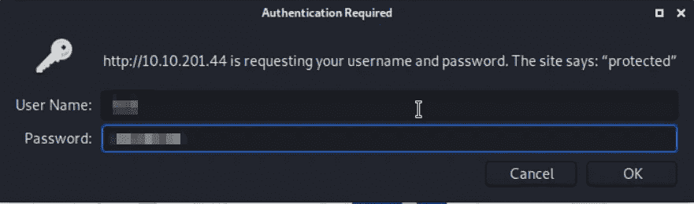

我们进去了。！

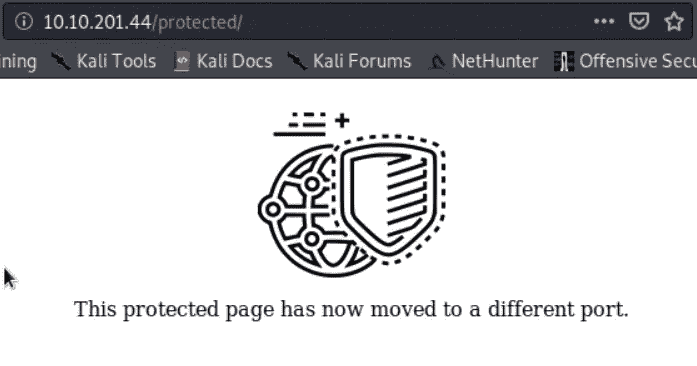

我们出去了😃！！该页面已移动到不同的端口，并且我们已经从 Nmap 扫描中获得了该端口。web 服务器运行在端口 1234 上，运行 Apache Tomcat/Coyote JSP 引擎 1.1

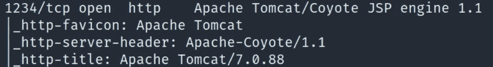

> #5.机器上还有哪个提供 web 服务的端口是打开的？
> Ans: 1234

导航到 http:// <target_ip>:1234</target_ip>

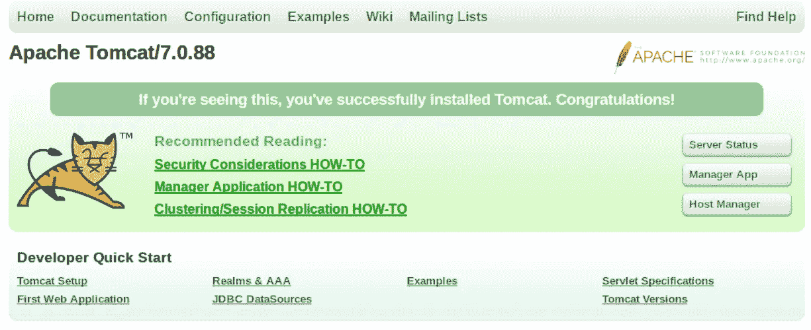

Coyote 是 Tomcat 的一个连接器组件，主要用于监听服务器的传入连接。我们有这个版本，如果有必要的话，它对我们搜索漏洞会非常有用。

> #6.转到该端口上运行的服务，软件的名称和版本是什么？
> 回答格式:Full _ name _ of _ service/Version
> Ans:Apache Tomcat/7 . 0 . 88

导航到 http:// <target_ip>:1234/manager/html</target_ip>

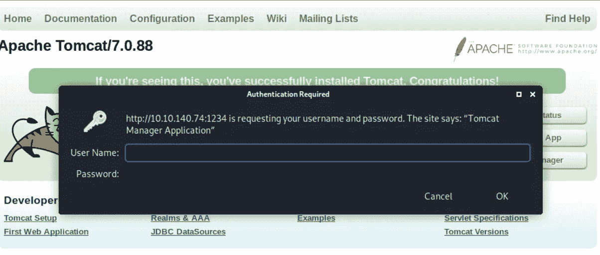

再次登录提示，我们有凭证。
我们需要为下一个任务启动 nikto 认证扫描，并在服务器上找到文档文件。

> nikto -id 用户名:password-h<target_ip>:1234/manager/html</target_ip>

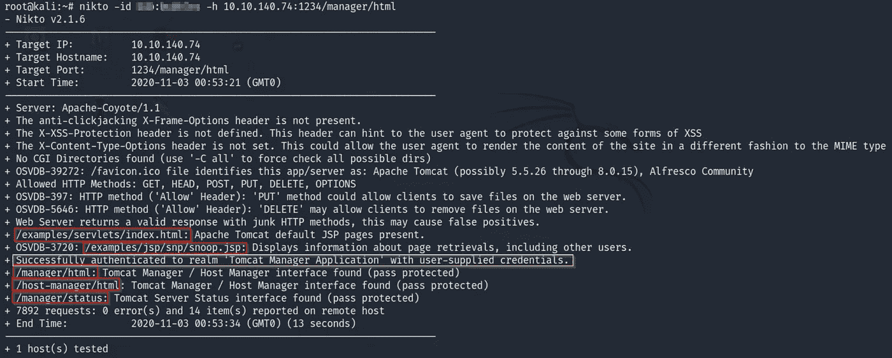

在 nikto 凭证扫描输出中，我用红色突出显示了文档文件，您可能会注意到黄色框，它确认我们的凭证是正确的。太棒了。！

> #7.使用 Nikto 和您找到的凭证，在上面找到的端口上扫描/manager/html 目录。【Nikto 识别了多少文档文件？
> 答案:5

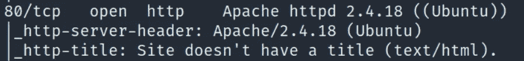

> #8.服务器版本是什么(对端口 80 运行扫描)？答案:阿帕奇/2.4.18

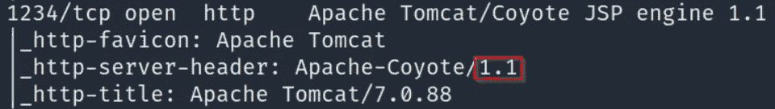

> #9.这个服务使用的是什么版本的 Apache-Coyote？
> 答案:1.1

到目前为止做得很好。
正如我之前提到的，服务的版本非常有用，因为它们可以被利用，并为我们提供一个外壳。服务越老，就越容易受到攻击。

启动 msfconsole

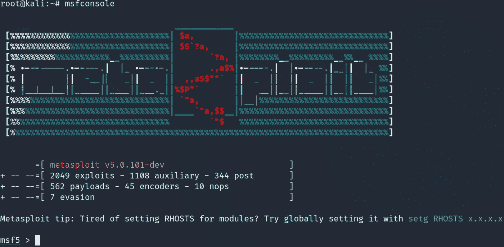

搜索 tomcat

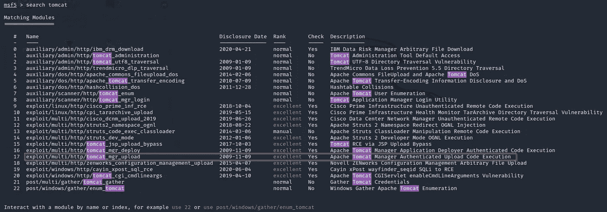

Tomcat 有相当过时的漏洞，评级很高。

在 msfconsole 中，如果我们搜索并想要利用漏洞，我们可以简单地插入“使用<exploit>”</exploit>

要查看选项，请插入“显示选项”

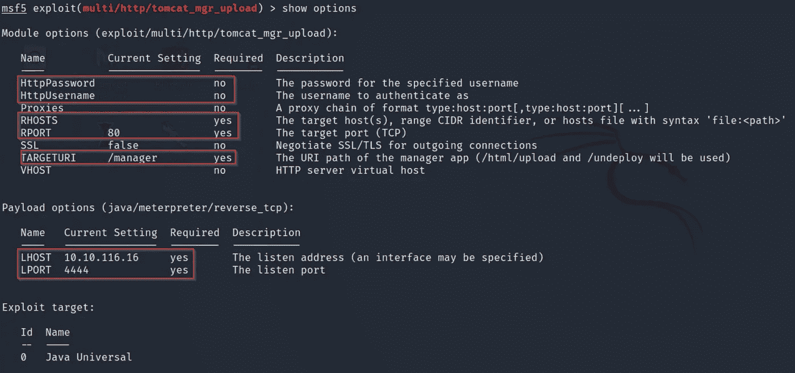

上面突出显示的框表示我们需要为成功利用漏洞设置的所有必需选项。让我们设置 HttpPassword，HttpUsername，RHOSTS，RPORT 和目标 URI/LHOST/LPORT 都已经设置好了。

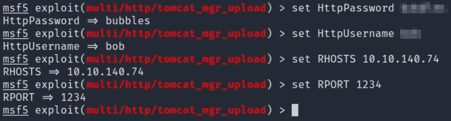

并运行该漏洞。手指交叉！！

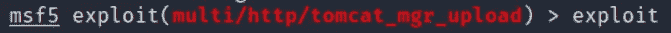

瞧啊。！我们已经成功地利用了这项服务。让我们检查一下我们是哪个用户。

要提示 shell，我们只需在 meterpreter 中使用“shell”命令。

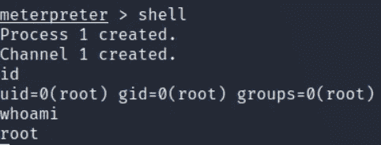

太棒了。！我们可以确认我们是根。让我们抓住根旗。在第一次提交任务答案之前。

> #10.使用 Metasploit 利用该服务并在系统上获得一个外壳。
> 你以什么用户的身份获得了一个 shell？
> 答:根

导航到/root 目录，标志就在那里。

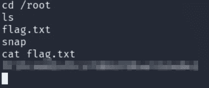

宏伟！！提交吧。

> #11.文件/root/flag.txt 中有什么文字
> Ans:xxxxxxxxxxxxxxxxxxxxxxxxxxxxx

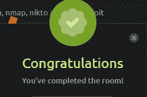

我们已经完成了房间。我在寻找盒子的过程中获得了巨大的乐趣，我希望你喜欢阅读这篇文章。这个盒子非常简单明了，强烈建议初学者尝试这个房间，因为它也包含在 TryHackMe 的完整初学者路径中。

如果你喜欢这篇文章，并且这篇文章对你有所帮助，请在评论中告诉我，或者用掌声分享你的爱。

谢谢你抽出时间。

跟着我。

更多的报道正在进行中。

保重，注意安全，继续黑！

**-哈桑·谢赫**