# TryHackMe ultraTech CTF

> 原文：<https://infosecwriteups.com/tryhackme-ultratech-ctf-5f4a8e238ed9?source=collection_archive---------5----------------------->

## 渗透测试、枚举、权限提升和 WebApp 测试的基础知识

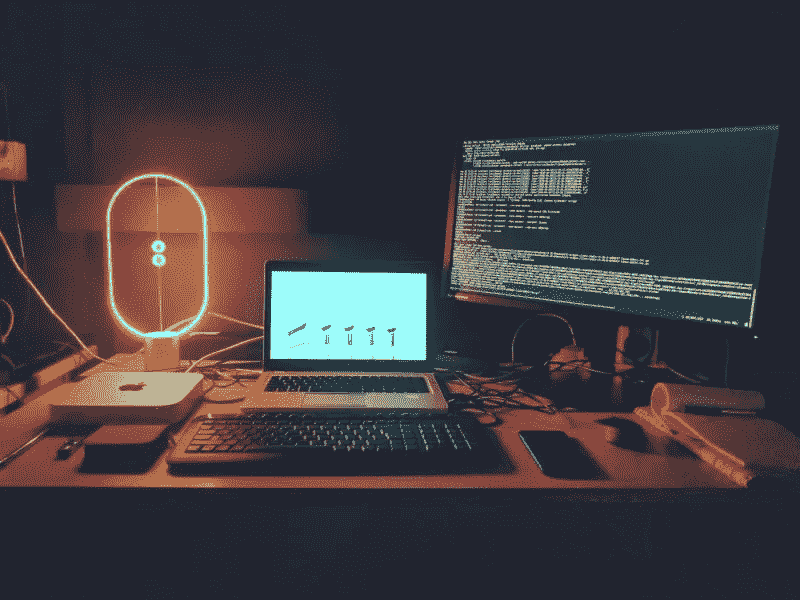

来源:谷歌

在这里，我们的最终目标是获得根 shell 并找到根用户的 ssh 私有密钥。这台机器的灵感来自于现实生活中的测试。

**在这里找到的房间**:【https://tryhackme.com/room/ultratech1 

启动机器……..


来源:谷歌

我们将这台机器分成两个任务，即 [**任务 1**](#07ff)&**[**任务 2**](#c7ba)**

**#[任务 1]:对机器进行低级别访问**

*****步骤 1 - >*** **ping** 机器以检查机器是否活着**

*****步骤 2 - >*** 执行端口扫描**

```
#!/bin/bash

masscan -e tun0 $1 -p 1-65535 --rate 5000 > $1_masscan
cat $1_masscan | grep "Discovered open port" | awk {'print $4'} | tr -d /tcp >> $1_masscanP
cat $1_masscanP | while read b || [[ -n $b ]] ;do nmap -A -p"${b}" $1 ;done >> $1_nmap

# u also uncommnet below line
# rm $1_masscan
# rm $1_masscanP
# Usage : ./filaname.sh <ip>
```

**该脚本简单地对所有 65535 端口执行[**mass scan**](https://github.com/robertdavidgraham/masscan)，并将输出发送到 [**nmap**](https://nmap.org/) 进行进一步处理。**

**我们打开了 3 个端口，即 **21** 、 **8081** 和 **31331****

**让我们给问题一个答案…..**

1.  ****哪个软件正在使用端口 8081？****

**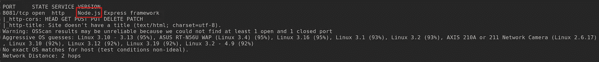**

*****Ans:——node . js*****

**2.**还有哪些非标准端口在用？****

*****Ans :- 31331*****

**3.**哪个软件使用这个端口？****

**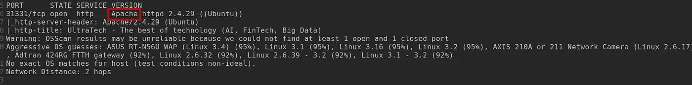**

*****Ans:——阿帕奇*****

**4 **。好像用的是哪个 GNU/Linux 发行版？****

****

*****Ans:——Ubuntu*****

**5.**使用端口 8081 的软件是一个 REST api，它的多少个路由被 web 应用程序使用？****

**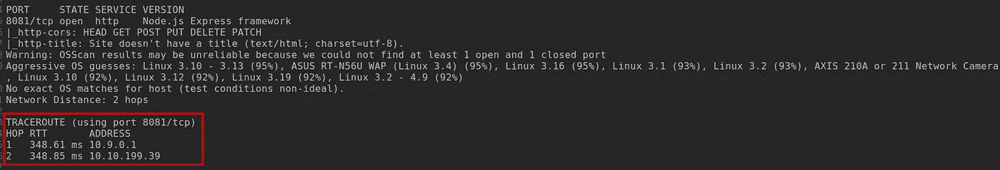**

*****Ans :- 2*****

**这是端口 8081 和 31331 的简单网页**

**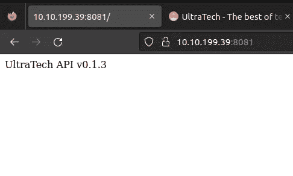**

**端口:8081**

**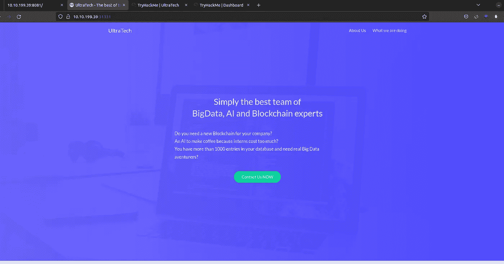**

**端口:31331**

**对端口 **8081** 和 **31331** 进行目录暴力破解得到了 **/auth** 目录，但是里面没有什么有趣的东西。**

*****第三步- >*** /robots.txt 目录**

**在执行一些基本的枚举之后，请记住为什么不检查一个 **/robots.txt** 或 **/sitemap.xml** 目录呢？**

**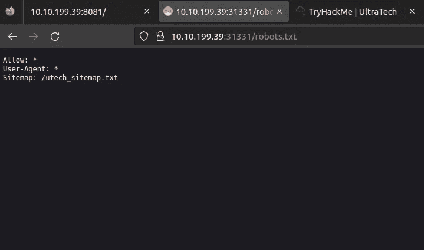**

**robots.txt**

**并得到了这个文件，即 **/utech_sitemap.txt.****

**导航到它后在 **/index.html** 、/【what.html】、 **/partners.html** 中得到 3 个目录**

**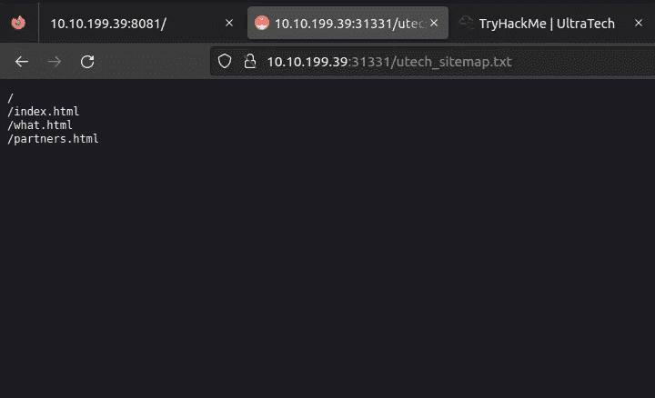**

****/index.html** 和 **/what.html** 不够有趣，但是 **/partners.html** 包含了一个登录页面。**

**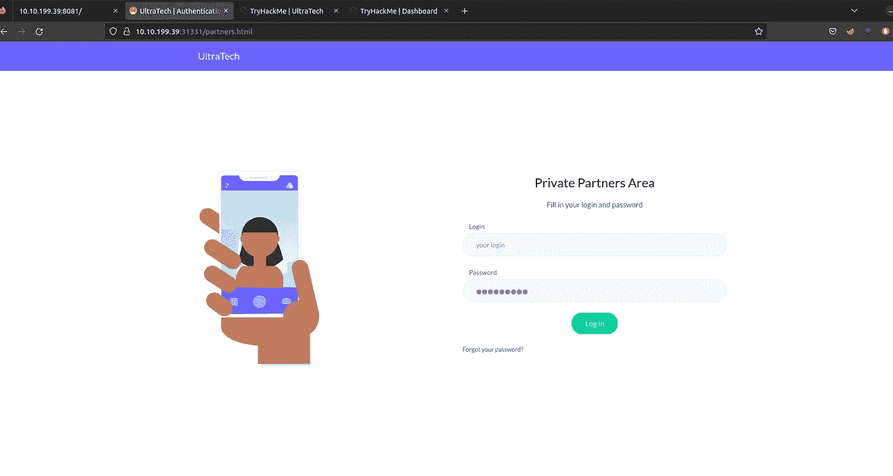**

**登录页面**

**但是接下来该怎么办呢？我们没有用户名和密码。**

****让我们开始思考……****

*****步骤 4 - >*** 普通用户的用户名和密码**

**检查**源代码**，我们得到了这个**

**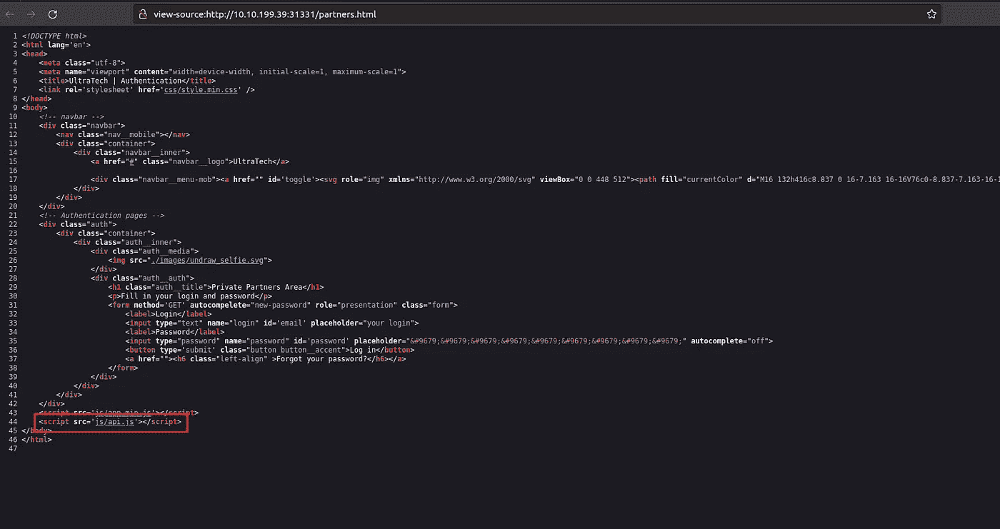**

**js/api.js**

**在导航到 js/api.js 之后，找到了这个有趣的东西**

**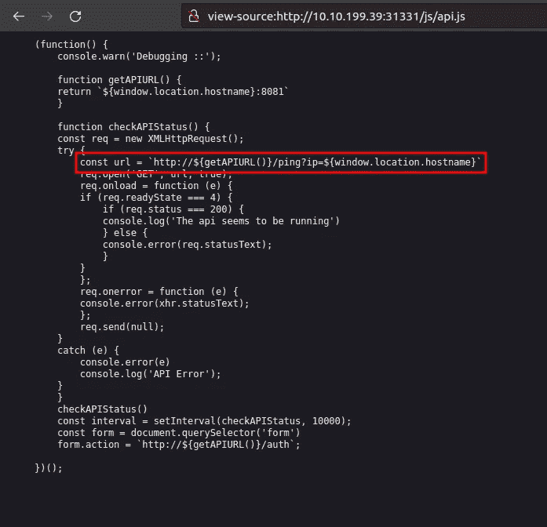**

**jsUrl**

**看起来像是 ***常量 url*** 变量从 **getAPIURL()** 函数和 ping ip 地址 **{window.location.hostname}中获取其值。****

**然后我们可以用攻击箱 IP 地址 ping 我们的本地主机。**

**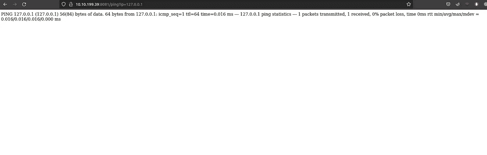**

**砰**

**Boommmm …..这是工作。我们试图看看是否可以运行另一个命令，但我们得到了一个错误。**

**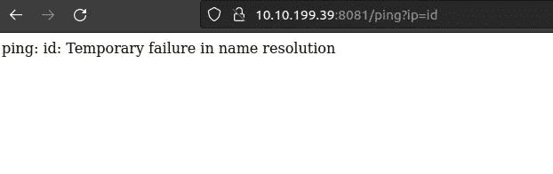**

**id 错误**

**它似乎有一个名称解析错误，但我们有一个解决方案，即 backstick(```)。上图中的命令是:***10 . 10 . 199 . 39:8081/ping？IP = ping id*。结果，当我们点击回车时，网站返回一个错误。当我们使用反斜线和反斜线之间的类型命令时，它们由 shell 在主命令之前执行。****

**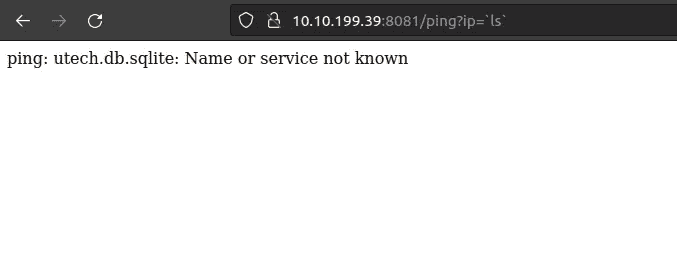**

**数据库文件**

**我们得到了一个文件，并在双引号之间使用了 ***ls*** 命令。把这个文件翻一翻，看看里面有什么。**

**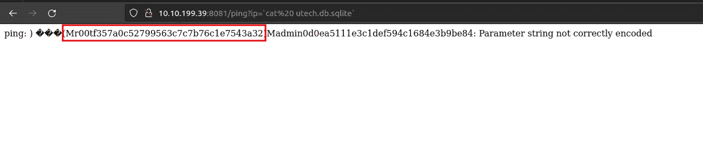**

**卡特彼勒文件**

**这里我们得到了它的用户名和散列密码。用户名是 r00t 和 admin。这是一个 md5 散列让我们破解它。**

**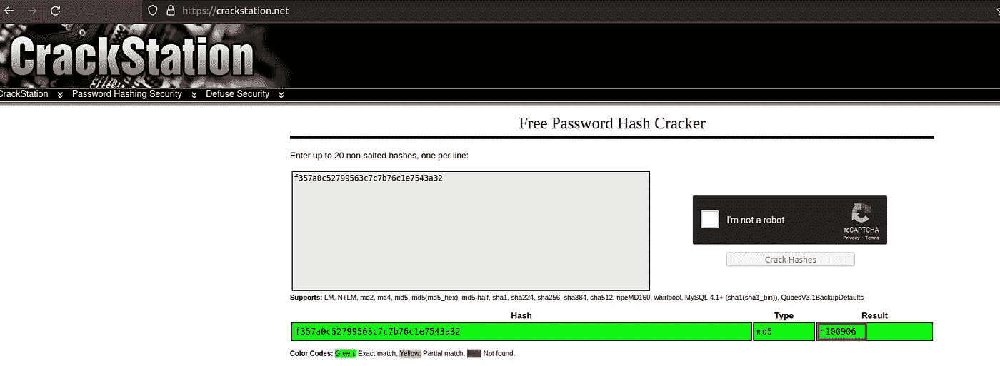**

**裂化站**

**让我们给问题一个答案…..**

**6.有一个数据库，它的文件名是什么？**

*****Ans:--utech . db . SQLite*****

**7.**第一个用户的密码哈希是什么？****

*****Ans:-f 357 a0c 52799563 c 7 c 7 b 76 C1 e 7543 a 32*****

**8.**这个哈希关联的密码是什么？****

*****答:——n 100906*****

*****步骤 5 - >*** 获取机器上的第一个外壳**

**使用 **ssh** 尝试使用 **r00t** 和 **n100906** 登录**

**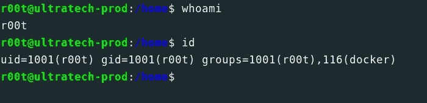**

**ssh shell**

**而我们是机器上的 r00t 普通用户。**

****#[任务 2]让 root 用户访问机器****

*****步骤 1 - >*** 应用技巧得到根壳**

**完成所有的技术后，我们决定做一件我们想做的事。**

**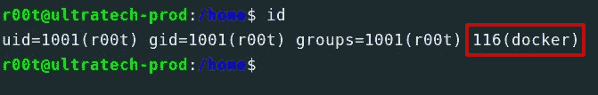**

**身份证明（identification）**

**就像在机器上运行 Docker，这个用户就是其中的一部分。让我们在 [GTFOBins](https://gtfobins.github.io/) 上查看 docker 关键字。我们得到了这个..**

**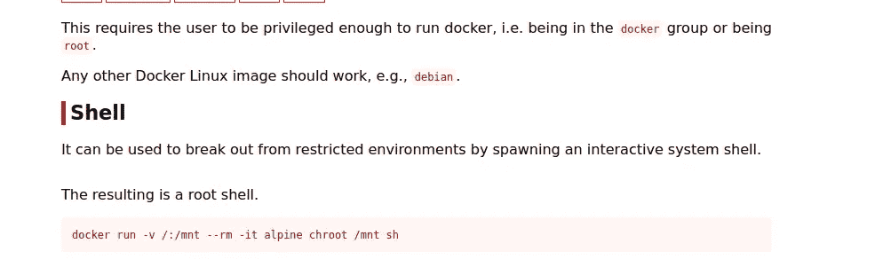**

**gtfo 箱**

**在终端上运行该命令:***docker run-v/:/mnt—RM-it bash ch root/mnt sh*****

**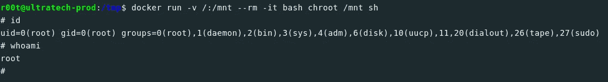**

**根壳**

**还有 boooommmm……..我们是这台机器上的根用户**

**让我们给这些问题一个答案。**

**9.**root 用户私有 SSH 密钥的前 9 个字符是什么？****

**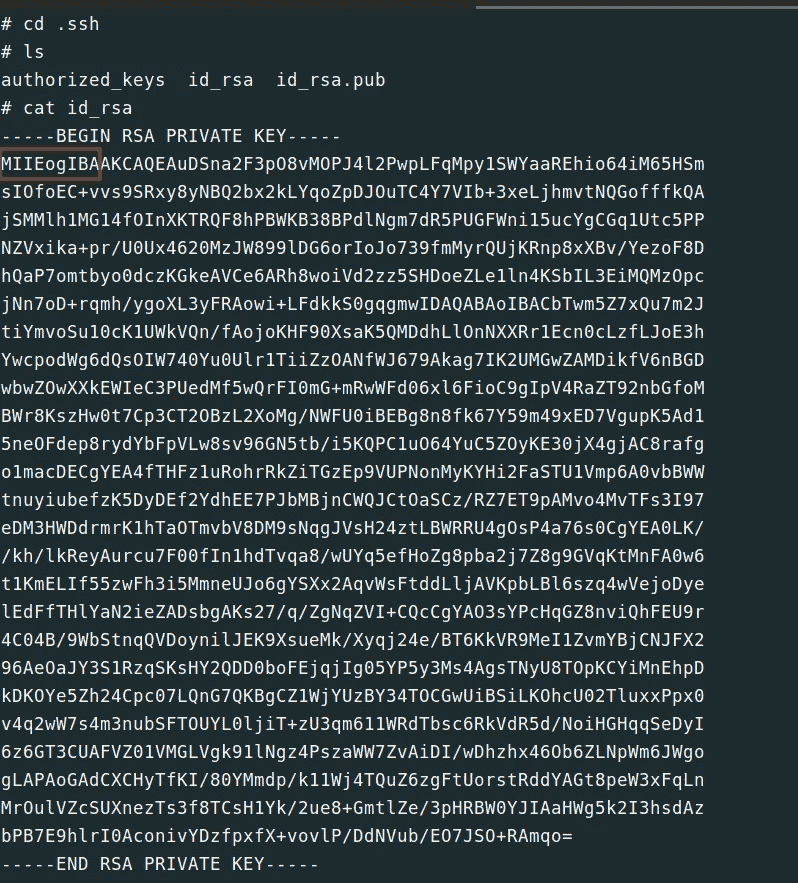**

*****答:——MIIEogIBA*****

****:注:****

**总是查看**源代码**并尝试阅读有趣的 **Javascript** 。**

**感谢阅读💓 ……….**

**继续学习……..**

**帮我接通:**

**[Twitter](https://twitter.com/bhavesharmalkar) ， [Linkedin](https://www.linkedin.com/in/bhaveshharmalkar/) ， [GitHub](https://github.com/bhaveshharmalkar)**

## **来自 Infosec 的报道:Infosec 每天都有很多内容，很难跟上。[加入我们的每周简讯](https://weekly.infosecwriteups.com/)以 5 篇文章、4 个线程、3 个视频、2 个 GitHub Repos 和工具以及 1 个工作提醒的形式免费获取所有最新的 Infosec 趋势！**