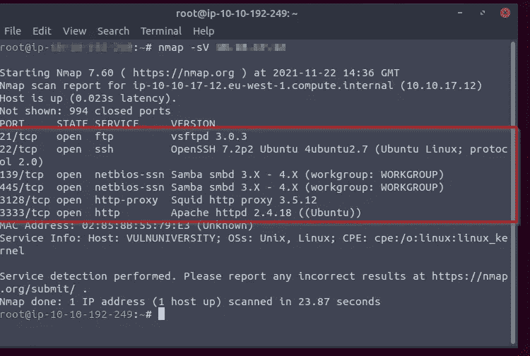
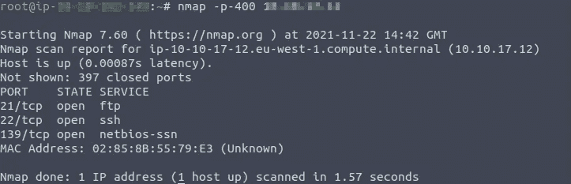
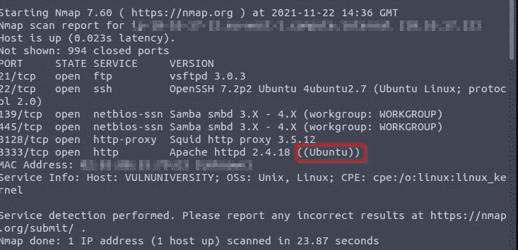
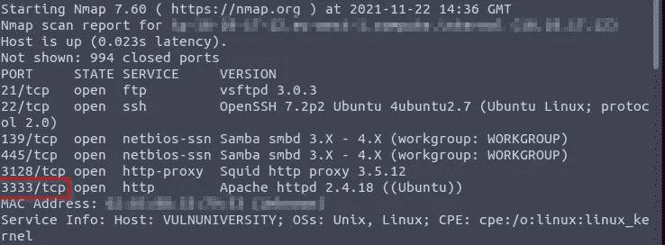
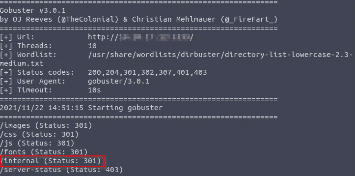

# TryHackme-Vulnversity 第 1 部分

> 原文：<https://infosecwriteups.com/tryhackme-vulnversity-part-1-5b232c888f90?source=collection_archive---------1----------------------->

## CTF 报道

欢迎回来，了不起的黑客们，我在 ryhackme Vulnversity 上又写了一篇有趣的博客。 这是你去猎捕虫子赏金时最重要的话题。

首先，我们可以对任何打开或关闭的端口执行一些 Nmap 扫描。

Nmap 扫描后，我发现了一些关于目标的有用信息。

我发现 21、22、139、445、3128 和 3333 端口都打开了。

我查了下 **-p-400 (400 端口)下 Nmap 扫描多少端口。**

> **这台机器最有可能运行的是什么操作系统？**

人的本质

> **web 服务器运行在哪个端口？**

3333

下一阶段查找 ***目录暴力破解。***

> **gobuster dir-u http://<IP>:3333-w<词表位置>**

该工具用于查找目标主机中的目录列表。

我发现有用的信息 ***内部*** 是用来上传任何文件或文件夹进而在反向外壳中有用的。

tryhackme vulnversity part 2:[https://mukibas 37 . medium . com/tryhackme-vulnversity-part-2-f5af 8651 AAC 4](https://mukibas37.medium.com/tryhackme-vulnversity-part-2-f5af8651aac4)