# TryHackMe-Warzone 2 报道及答案| 300 分

> 原文：<https://infosecwriteups.com/tryhackme-warzone-2-write-up-with-answers-51030b8639d4?source=collection_archive---------1----------------------->

## TryHackMe-Warzone 2 简单演练，由 Karthikeyan Nagaraj 提供答案|截至 2022 年 12 月 300 分

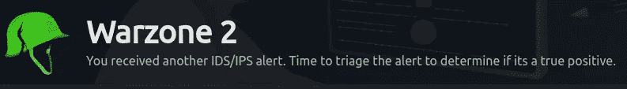

# 本练习使用的工具和网站

1.  边缘

2.病毒总数

3.网吧(如果需要)

***如果你不知道这些工具是什么，可以看看下面！！！***

> *1。什么是 Brim？*
> 
> *Brim 是* ***一款面向安全和网络专家的开源桌面应用*** *。Brim 使搜索和分析数据变得容易:数据包捕获，如 Wireshark 创建的数据包捕获，以及。结构化日志，尤其是来自 Zeek 网络分析框架的日志。*

[](https://github.com/brimdata/brim) [## GitHub — brimdata/brim:高效搜索和分析超结构化…

### Brim 是面向安全和网络专家的开源桌面应用程序。Brim 使其易于搜索和…

github.com](https://github.com/brimdata/brim) 

> *2。什么是 Virustotal？*
> 
> *该网站用于分析可疑文件、域、IP 和 URL，以检测恶意软件和其他违规行为，并自动与安全社区共享这些内容*。

 [## 病毒总数

### 病毒总数

VirusTotalwww.virustotal.com](https://www.virustotal.com/) 

> *3。什么是赛博咖啡？*
> 
> *CyberChef 是* ***一个简单、直观的网络应用程序，用于在网络浏览器*** *中执行各种“网络”操作。*

[](https://gchq.github.io/CyberChef/) [## 网络咖啡馆网络版

### 网络瑞士军刀——一个用于加密、编码、压缩和数据分析的网络应用

gchq.github.io](https://gchq.github.io/CyberChef/) 

# 任务 1 另一天，另一个警报

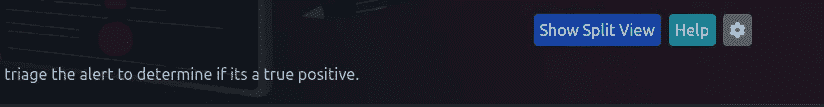

单击显示拆分视图

## 1.检测到网络木马的警报特征是什么？

在工具目录中打开 Brim 应用程序

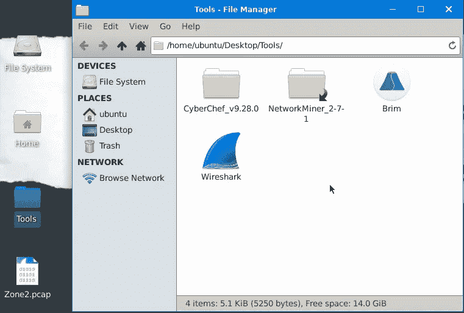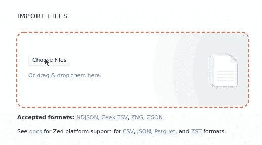

选择桌面上可用的 Zone2.pcap 文件

> *点击****→查询部分*下按来源和目的地** *保存预警*

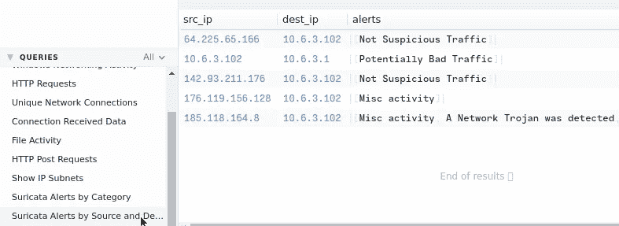

我们发现 IP**185.118.164.8**受到了特洛伊木马的影响，所以让我们查找该 IP 的任何日志

在搜索栏上键入 IP

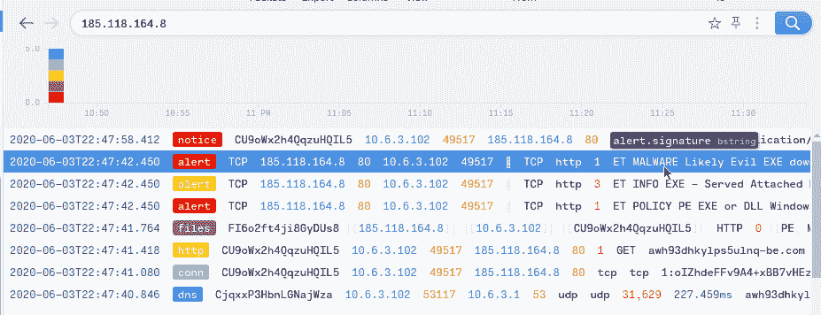

我们发现一个带有恶意软件签名的警报

```
Ans: ET MALWARE Likely Evil EXE download from MSXMLHTTP non-exe extension M2
```

## 2.**潜在企业隐私侵犯**的警报签名是什么？

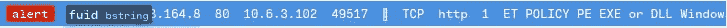

双击签名中带有单词 Policy 的通信，查看活动日志

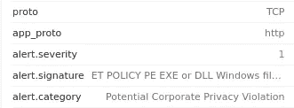

```
Ans: ET POLICY PE EXE or DLL Windows file download HTTP
```

## 3.触发警报的 IP 是什么？以**默认**格式输入您的答案。

我们在第一个问题中找到的 ***IP 触发了*** *，*警报，但是我们必须以默认方式输入 IP。你可以使用 [Cyberchef](https://gchq.github.io/CyberChef/) 工具来方得它！

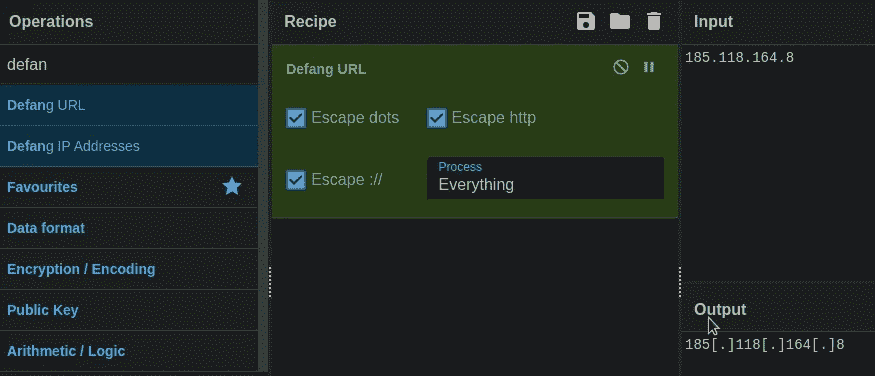

```
Ans: 185[.]118[.]164[.]8
```

## 4.为恶意下载的文件提供完整的 URI。在你的回答中，**方得**URI。

打开 Http 流量

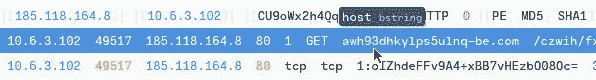

双击流量。完整的 URL 是主机和 Uri 的组合

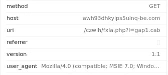

使用赛博厨师方得它

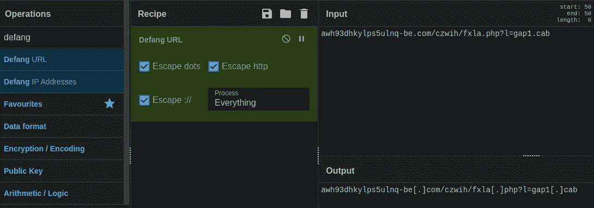

```
Ans: awh93dhkylps5ulnq-be[.]com/czwih/fxla[.]php?l=gap1[.]cab
```

## 5.cab 文件中有效负载的名称是什么？

双击带有流量标签的通知并仔细查看，有一个带有哈希的 Virustotal 链接。让我们用散列手动搜索

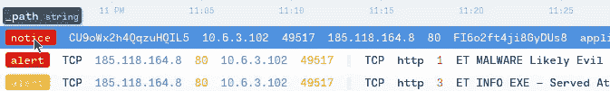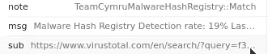

```
https://www.virustotal.com/en/search/?query=f3e9e7f321deb1a3408053168a6a67c6cd70e114
```

我们找到了哈希—f 3e 9 e 7 f 321 deb 1a 3408053168 a6 a67 c6cd 70 e 114

手动搜索 [Virustotal](https://www.virustotal.com/gui/home/search) 上的哈希

 [## 病毒总数

### 病毒总数

VirusTotalwww.virustotal.com](https://www.virustotal.com/gui/home/search) 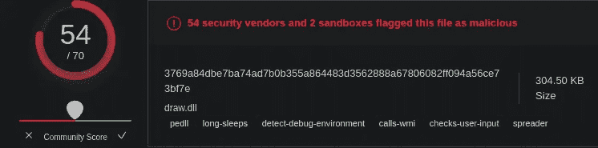

```
Ans: draw.dll
```

## 6.与此网络流量相关联的用户代理是什么？

打开 HTTP 流量以查找用户代理


```
Ans: Mozilla/4.0 (compatible; MSIE 7.0; Windows NT 10.0; WOW64; Trident/8.0; .NET4.0C; .NET4.0E)
```

## 7.您在网络流量中还看到哪些被 VirusTotal 标记为恶意的域？按照字母顺序输入域名**。(**格式:域[。]zzz，域[。]zzz****

**在“关系”选项卡上，您可以看到 URL 的恶意软件检测**

**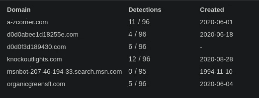**

```
a-zcorner.com
knockoutlights.com

These two URLS are Highly Malicious as it has Highest Detections.
--> We Have to Defang the Urls in Alphabetical Order
```

**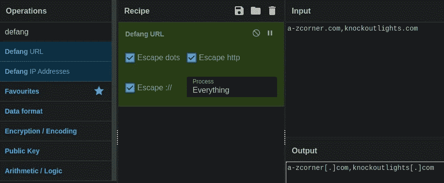**

```
Ans: a-zcorner[.]com,knockoutlights[.]com
```

## **8.有些 IP 地址被标记为**非可疑流量**。IP 地址是什么？按数字顺序输入您的答案，然后**去掉**。(**格式:IPADDR，IPADDR** )**

**点击我们在第一个问题中已经找到的查询部分下的 ***按来源和目的地分类的 Suricata 警报*** 。**

**有两个网址标记为不可疑**

**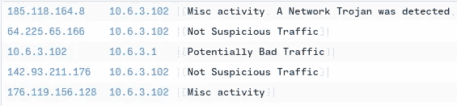**

**按照不规则的字母顺序写出 IP 64..,142...**

**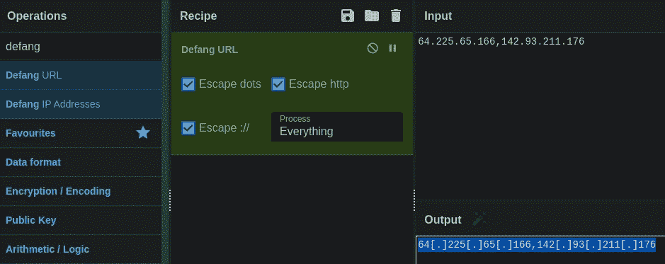**

```
Ans: 64[.]225[.]65[.]166,142[.]93[.]211[.]176
```

## **9.对于第一个标记为**非可疑流量**的 IP 地址。根据 VirusTotal，有几个域与这个被标记为恶意的 IP 地址相关联。您在与此 IP 地址相关的网络流量中发现了哪些域？以**默认**格式输入您的答案。请按字母顺序输入你的答案。(**格式:域[。]zzz，域[。]zzz 等****

**在 Virustotal 上搜索第一个非可疑 IP 64.225.65.166**

**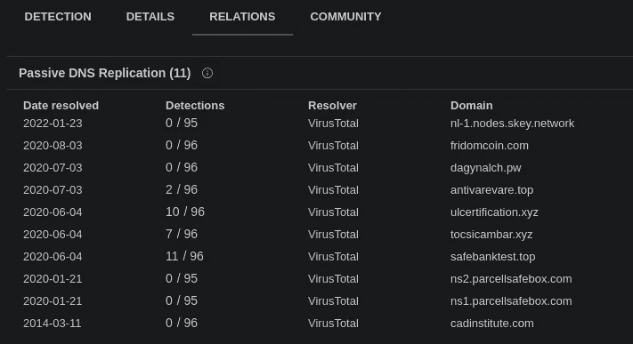**

**基于检测的前 3 个域是恶意 URL。**

**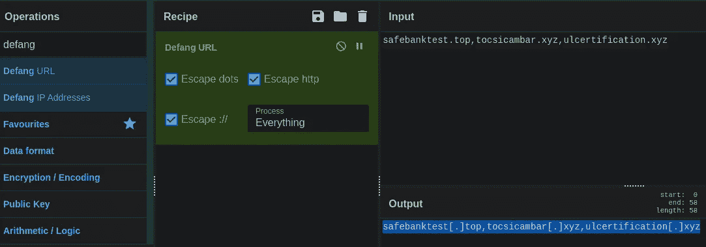**

**方得按字母顺序排列的网址**

```
Ans: safebanktest[.]top,tocsicambar[.]xyz,ulcertification[.]xyz
```

## **10.现在对于第二个标记为**的 IP 没有可疑流量**。您在与此 IP 地址相关的网络流量中发现了哪个域？以**默认**格式输入您的答案。(**格式:域[。]zzz****

**现在使用 grim 上的搜索查询来查找与第二个非恶意 IP 相关的域**

```
142.93.211.176 | cut query
```

**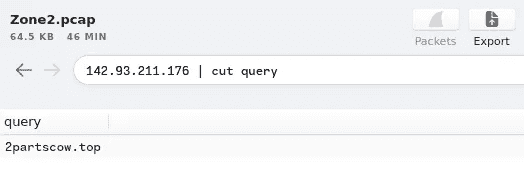**

```
Ans: 2partscow[.]top
```

**感谢您的阅读！！**

**黑客快乐~**

```
Author: Karthikeyan Nagaraj ~ Cyberw1ng
```

**给我点提示鼓励我！！**

**Tryhackme，THM，warzone，warzone2，tryhackme 编写，tryhackme 演练，warzone2 演练，ctf，warzone2 编写，warzone2 答案，brim，brim 工具，virustotal，cyberchef，karthikeyan nagaraj，cyberw1ng**

## **来自 Infosec 的报道:Infosec 每天都有很多内容，很难跟上。[加入我们的每周简讯](https://weekly.infosecwriteups.com/)以 5 篇文章、4 条线索、3 个视频、2 个 GitHub Repos 和工具以及 1 个工作提醒的形式免费获取所有最新的 Infosec 趋势！**