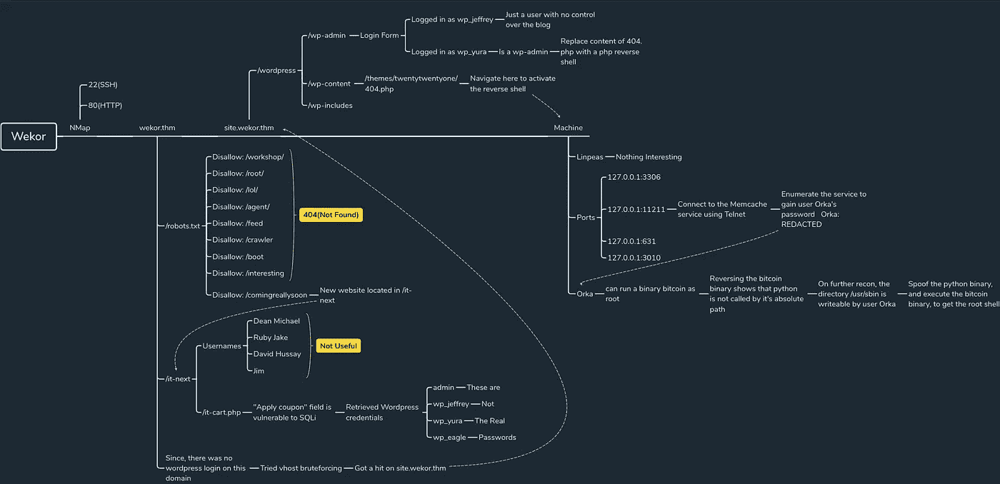
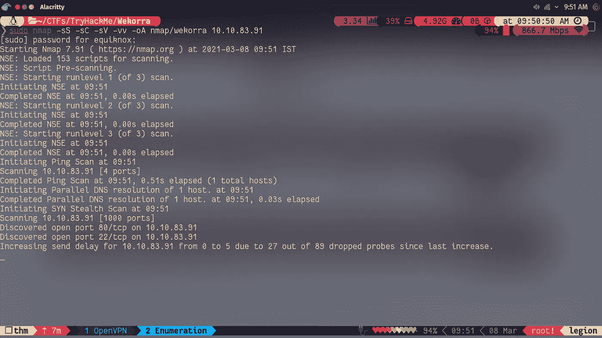
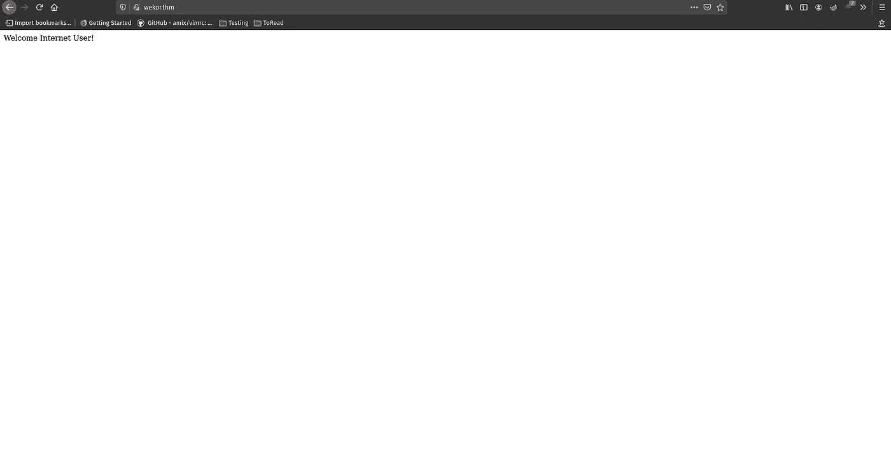
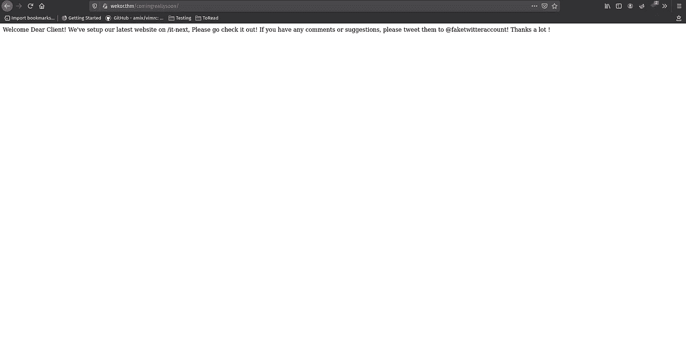
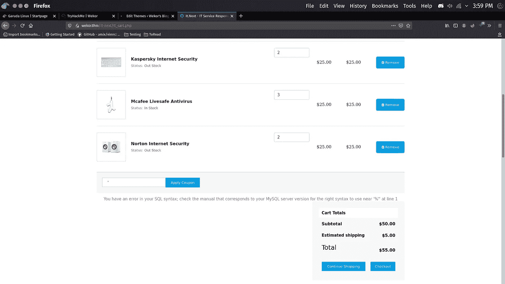
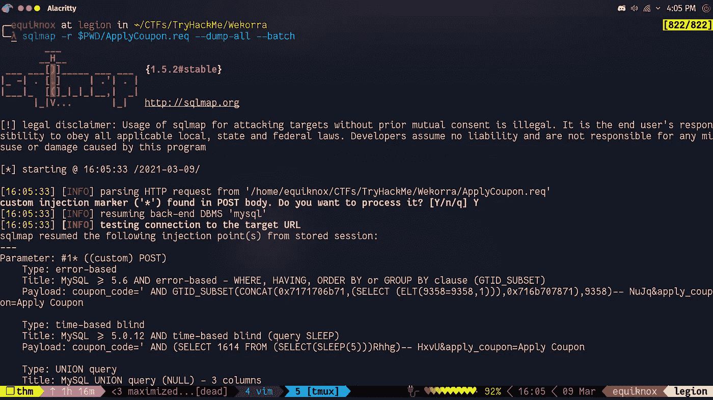
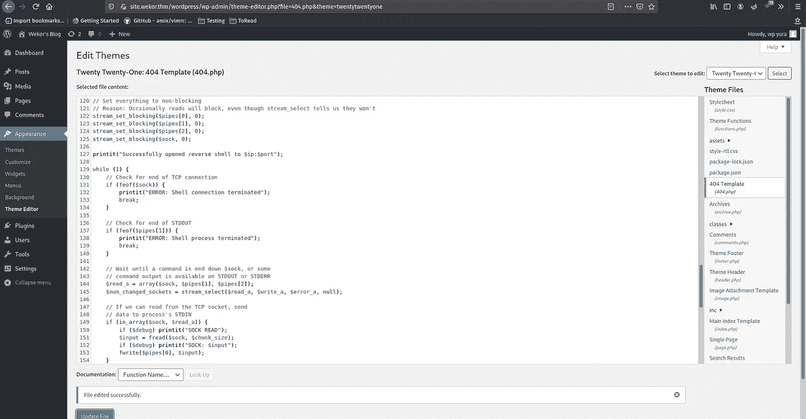
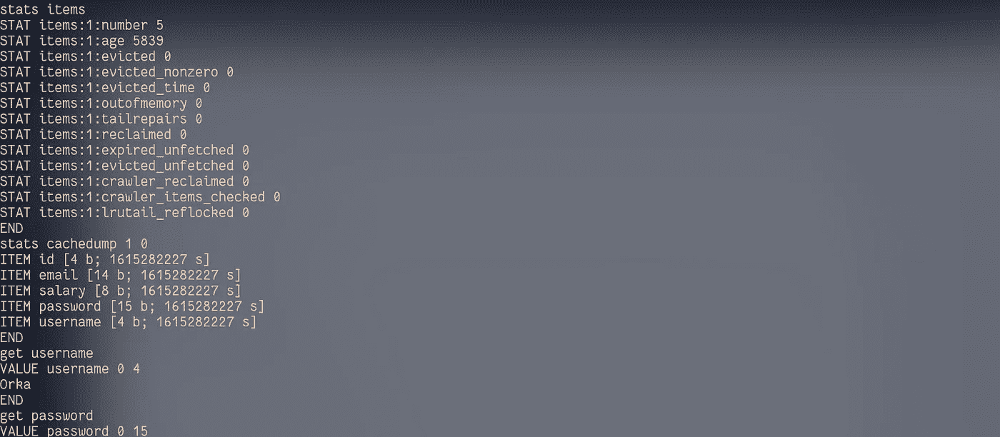
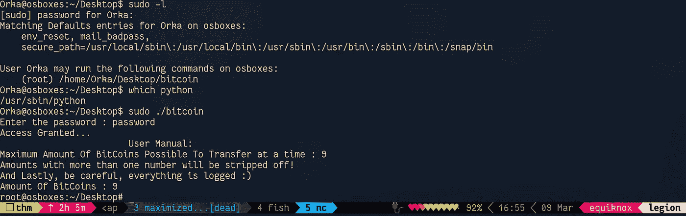

# TryHackMe | Wekor 报道

> 原文：<https://infosecwriteups.com/tryhackme-wekor-writeup-a01b851f651d?source=collection_archive---------3----------------------->



# **概述**

嘿，你们好吗？我带着另一篇文章回来了，这一次是尝试 ustoun0 的 Wekor。这是一台非常棒的机器，比我最初想象的要难。

[](https://tryhackme.com/room/wekorra) [## TryHackMe | Wekor

### 涉及 Sqli、WordPress、vhost 枚举和识别内部服务的 CTF 挑战；)

tryhackme.com](https://tryhackme.com/room/wekorra) [](https://tryhackme.com/p/ustoun0) [## TryHackMe | ustoun0

### TryHackMe 是一个免费的学习网络安全的在线平台，使用动手练习和实验室，通过您的…

tryhackme.com](https://tryhackme.com/p/ustoun0) 

我们从简单的端口扫描开始，看到端口 80 是开放的。在最初的网站上做一些目录蛮力，我们得到另一个网站的位置。在访问该网站时，我们发现了一个 SQL 注入漏洞。从那里，我们利用 SQLMap 提取信息。浏览这些信息，我们找到了一些 WordPress 凭证。登录 WordPress，我们编辑一个 PHP 页面，得到一个反向 shell。进入机器后，我们枚举 Memcached 服务来查找用户密码。一旦完成，我们反转一个 elf 二进制文件，并伪造一个系统二进制文件来获得根目录。那么，没有别的话要说了，我们开始吧。

# 我们闯进去吧！

像往常一样，从 NMap 扫描开始。

```
sudo nmap -sS -sV -sC -oA nmap/wekor *THM Box IP* -vv
```



在运行 NMap 时，我们只打开了两个端口 22(ssh)和 80(HTTP)。让我们访问 80 端口上的网站。



在访问网站时，我们会收到一条信息。



网站上还有一个 robots.txt，在访问 robots.txt 时，我们会看到许多不同的目录路径。可悲的是，除了一个“/comingrealysoon”之外，所有这些都将我们重定向到 404(未找到)。
在这里，我们发现实际的网站可以在“/it-next”位置找到。让我们访问网站。

在访问网站时，我们看到这是一些公司的网站，提供计算机解决方案。经过一番探索，我们看到在网站的结帐部分有一个表单域，在那里他们要求提供优惠券代码。
在测试一个可能的 SQL 注入时，试图输入一个单引号，网站显示一条错误信息。



使用“'或 1 = 1---”，不带双引号，将得到实际的优惠券代码。

“Apply Coupon”字段肯定容易受到 SQL 注入的攻击，所以让我们对它运行 SQLMap，看看我们能发现什么。



是的，我确实中途换壳了。不要问我为什么，我对我的行为没有任何解释

```
sqlmap -r $PWD/ApplyCoupon.req --dump-all --batch
```

> Here -r:要将 SQLMap 指向实际的请求，请给它完整的路径，否则它会出错。- dump-all:转储本地机器上通过 SQLi 获得的所有数据。- batch:为任何提示提供默认值，以便流程不会在后台暂停，等待用户交互。

**附言**您可以使用任何代理工具轻松捕获请求。

因为，我主要用打嗝来满足我的“代理”需求，我可以给你一点帮助。只需将 burp 设置为拦截模式，代理您的浏览器执行 burp，一旦 burp 拦截到请求，右键单击请求，然后单击保存项目。现在您可以将文件传递给 SQLMap。一个小小的信息，用“*”替换您需要测试的变量的值。SQLMap 将只测试这个特定的变量，从而节省时间。正如他们所说，时间就是金钱。

捕捉请求的方法在您使用的任何其他工具上几乎应该是相同的。

一段时间后，SQLMap 完成它的工作。我们有大量的信息，但有趣的是“WordPress”文件夹，里面有不同用户的用户名和密码。哈希属于 WordPress(MD5)类别。使用 hashcat 和 [rockyou](https://www.google.com/url?sa=t&rct=j&q=&esrc=s&source=web&cd=&ved=2ahUKEwj20uW6o6PvAhUFOisKHc1xCKkQFjAAegQIBBAD&url=https%3A%2F%2Fgithub.com%2Fbrannondorsey%2Fnaive-hashcat%2Freleases%2Fdownload%2Fdata%2Frockyou.txt&usg=AOvVaw3snAERl1mU6Ccr4WFEazBd) 单词表，我们可以很容易地破解密码散列。

```
hashcat -m 400 -a 0 hashfile.txt /path/to/the/wordlist
```

所有的密码哈希都被破解了，除了管理员密码哈希，看起来有人在遵守规则。

但是，我们没有找到任何 WordPress 博客。而且，在这个网站上没有什么可以发现的了。所以，让我们试试虚拟主机暴力破解，使用 GoBuster。在 GoBuster 完成运行后，我们看到我们有一个结果，web 站点有一个子域“site”，这是一个 WordPress 博客。
导航到“/wp-admin”我们得到一个登录表单。让我们尝试使用我们得到的凭证。

使用第一组凭证，我们没有得到任何有趣的东西。杰弗里只是一个普通的 WordPress 用户，没有任何权利。
尝试第二套凭证，我们看到 Yura 是 WordPress admin，牛逼！。这意味着我们可以得到一个反向壳。

要获得反向外壳，导航到“主题编辑器”，在那里我们可以编辑任何模板，我决定编辑“404.php”。通过 [pentestmonkey](https://github.com/pentestmonkey) 粘贴 [php-reverse-shell](https://www.google.com/url?sa=t&rct=j&q=&esrc=s&source=web&cd=&ved=2ahUKEwj20uW6o6PvAhUFOisKHc1xCKkQFjAAegQIBBAD&url=https%3A%2F%2Fgithub.com%2Fbrannondorsey%2Fnaive-hashcat%2Freleases%2Fdownload%2Fdata%2Frockyou.txt&usg=AOvVaw3snAERl1mU6Ccr4WFEazBd) ，对脚本的 ip 和 port 字段进行必要的修改，并保存模板。



从那里，导航到/WP-content/themes/twenty twenty one/404 . PHP，同时使用 NetCat 监听端口，以接收反向 shell。

进入机器后，我们看到我们以“www-data”的身份登录。运行 linPEAS，我们没有发现任何有趣的东西。寻找机器上运行的服务，我们看到一个服务正在较高的端口 11211 上运行。使用一些 Google-Fu，我们发现这个服务的名字是“Memcached ”,我们可以枚举这个服务，因为它可能存储一些信息。有了这些信息，让我们试着列举服务。

*等等，什么是 Memcached，我们为什么要在里面寻找信息？*

Memcached 是一个分布式内存缓存系统。就像 Linux 机器上的交换分区一样，只是它通常运行在服务器上。发生的情况是，每当服务器耗尽内存(RAM)时，它将获取一些在某个时间之前请求的信息，将这些信息移动到缓存系统，以便它可以为当前任务释放内存。为了跟踪时间，服务器使用过期超时。一旦信息过期，它会自动将信息转移到 Memcached 服务。如果再次需要该信息，服务器可以只使用缓存的信息，而不是一遍又一遍地为查询进行计算。

所以，我们走吧。我们可以使用 Telnet 连接到服务。

```
telnet localhost 11211
stats items (shows everything in the cache)
stats cachedump 1 0 (dump everything in the slab id(1))
get user (user query information in the cache)
get password (password query information in the cache)press Ctrl+] to bring up the telnet prompt
type close to exit from telnet
```



我们得到用户 Orka 的密码。
在机器上再次运行 linPEAS，我们发现我们的用户可以在 **"/usr/sbin"** 目录中写。让我们记住这个信息，因为它很快会被证明是非常有用的。
运行 sudo -l，我们看到我们的用户只能运行一个 elf 二进制，“比特币”作为 root。运行可执行文件时，它会提示我们输入密码，但我们没有。

将二进制文件传输到我们的机器，并使用 ghidra 反转它，我们找到所需的密码，我们看到二进制文件正在对脚本“tranfer.py”进行系统调用。
二进制文件使用绝对路径调用脚本，sudoers 文件中的二进制文件使用了绝对路径，但是，它使用相对路径调用 python 二进制文件。并且*记住*，我们可以**将**写入"/usr/sbin "，它的优先级(在这台机器中)高于"/usr/bin "，实际的 python 二进制文件就驻留在那里。
这意味着，系统会先在“/usr/sbin”中查找 python 二进制文件，然后再到其他地方查找，这意味着我们可以放置自己的伪程序，给它相同的名称，系统会执行它，而不是实际的 python 二进制文件。

让我们 cd 到"/usr/sbin "，然后:

```
touch python (create a file named python)
vim python   (put in the bogus code)
     #!/bin/bash
     /bin/bash
     :wq!
chmod +x python (give it executable permission)
```

让我们尝试执行我们的伪 python 二进制文件。



瞧，我们得到了我们的根壳。

这就是那个盒子，希望你们喜欢。

如果你有任何建议，请在评论中告诉我。

祝你有美好的一天！